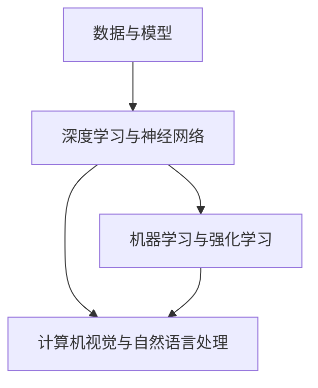

                 

关键词：人工智能、深度学习、未来发展趋势、研究挑战、技术应用

摘要：本文旨在探讨人工智能（AI）领域的未来发展规划，通过分析当前的核心概念、算法原理、数学模型及实际应用，展望人工智能的发展趋势与面临的挑战。本文将结合世界顶级技术专家Andrej Karpathy的研究成果，提出一系列关于人工智能未来发展的重要见解。

## 1. 背景介绍

人工智能（AI）作为计算机科学的一个分支，致力于开发使计算机具备人类智能水平的算法和技术。近年来，随着计算能力的提升和大数据的普及，人工智能取得了显著的进展。深度学习作为人工智能的核心技术之一，已经在图像识别、自然语言处理、自动驾驶等多个领域取得了突破性成果。

Andrej Karpathy是一位杰出的深度学习专家，他以其在自然语言处理和计算机视觉领域的卓越贡献而闻名。他的研究成果不仅推动了人工智能技术的发展，还为未来的研究提供了宝贵的启示。本文将基于Andrej Karpathy的研究成果，探讨人工智能的未来发展规划。

## 2. 核心概念与联系

在人工智能领域，核心概念和技术的联系构成了整个体系的基础。以下是几个重要的核心概念和其相互联系：

### 2.1 数据与模型

数据是人工智能的基础，而模型则是数据的抽象和表示。通过数据训练模型，模型可以学习到数据中的模式和规律，从而进行预测和决策。数据的质量和数量直接影响模型的性能。

### 2.2 深度学习与神经网络

深度学习是神经网络的一种扩展，通过多层的非线性变换，实现对复杂问题的建模。神经网络由大量的神经元组成，每个神经元都与其他神经元相连，并通过权重和激活函数进行信息传递和处理。

### 2.3 机器学习与强化学习

机器学习是一种通过算法让计算机从数据中学习的方法，包括监督学习、无监督学习和半监督学习。强化学习是一种特殊的机器学习方法，通过奖励机制引导模型不断优化策略，以达到最佳效果。

### 2.4 计算机视觉与自然语言处理

计算机视觉和自然语言处理是人工智能的两个重要应用领域。计算机视觉致力于让计算机理解和解释视觉信息，如图像和视频；自然语言处理则致力于使计算机理解和生成自然语言，如文本和语音。

以下是人工智能核心概念原理和架构的Mermaid流程图：



## 3. 核心算法原理 & 具体操作步骤

### 3.1 算法原理概述

人工智能的核心算法主要基于深度学习和机器学习，以下分别介绍这两种算法的原理：

#### 3.1.1 深度学习

深度学习是一种基于神经网络的学习方法，通过构建多层神经网络，实现从输入到输出的映射。每一层神经网络都对输入进行变换和特征提取，最终输出结果。深度学习的核心思想是通过反向传播算法，不断调整网络中的权重，使网络输出结果更接近真实值。

#### 3.1.2 机器学习

机器学习是一种通过算法让计算机从数据中学习的方法。机器学习可以分为监督学习、无监督学习和半监督学习。监督学习通过已知输入输出对训练模型，无监督学习通过发现数据中的潜在结构和规律，半监督学习则在已知部分数据和部分标签的情况下训练模型。

### 3.2 算法步骤详解

#### 3.2.1 深度学习算法步骤

1. 数据预处理：对输入数据（如图像、文本等）进行清洗、归一化等处理。
2. 网络构建：设计并构建多层神经网络，包括输入层、隐藏层和输出层。
3. 损失函数定义：根据任务类型选择合适的损失函数，如交叉熵损失、均方误差等。
4. 反向传播：计算损失函数关于网络权重的梯度，并通过梯度下降等优化算法更新网络权重。
5. 模型评估：使用测试数据评估模型性能，调整模型参数以优化性能。

#### 3.2.2 机器学习算法步骤

1. 数据收集：收集并处理输入数据，如图像、文本、数值等。
2. 特征提取：从原始数据中提取特征，如使用卷积神经网络提取图像特征。
3. 模型选择：根据任务类型选择合适的机器学习模型，如线性回归、决策树、支持向量机等。
4. 模型训练：使用训练数据训练模型，通过调整模型参数优化模型性能。
5. 模型评估：使用测试数据评估模型性能，调整模型参数以优化性能。

### 3.3 算法优缺点

#### 3.3.1 深度学习

优点：
- 强大的特征提取能力，能够自动学习复杂的数据特征。
- 对大规模数据的处理能力较强，可以处理高维数据。

缺点：
- 需要大量的数据和计算资源。
- 模型的可解释性较差，难以理解模型内部的工作机制。

#### 3.3.2 机器学习

优点：
- 对数据的依赖性较小，适合处理中小规模数据。
- 模型的可解释性较强，易于理解模型内部的工作机制。

缺点：
- 特征提取需要手动设计，对专家经验要求较高。
- 对大规模数据的处理能力较弱。

### 3.4 算法应用领域

深度学习和机器学习在众多领域具有广泛的应用，以下列举几个主要的应用领域：

- 图像识别：如人脸识别、图像分类等。
- 自然语言处理：如机器翻译、文本分类等。
- 语音识别：如语音转文字、语音助手等。
- 医疗诊断：如疾病预测、医学图像分析等。
- 自动驾驶：如车辆识别、环境感知等。

## 4. 数学模型和公式 & 详细讲解 & 举例说明

### 4.1 数学模型构建

人工智能中的数学模型主要基于概率论和统计学，以下分别介绍深度学习和机器学习中的主要数学模型。

#### 4.1.1 深度学习

深度学习中的数学模型主要包括卷积神经网络（CNN）、循环神经网络（RNN）和生成对抗网络（GAN）等。

1. **卷积神经网络（CNN）**：

   CNN是用于图像识别和处理的深度学习模型，其核心数学模型是卷积运算和池化运算。

   $$ f(x) = \text{ReLU}(\sum_{i=1}^{n} w_i * x_i + b) $$

   其中，$x_i$表示输入特征，$w_i$表示卷积核权重，$b$表示偏置项，$\text{ReLU}$表示ReLU激活函数。

2. **循环神经网络（RNN）**：

   RNN是用于序列数据处理的深度学习模型，其核心数学模型是递归运算。

   $$ h_t = \text{ReLU}(W_h h_{t-1} + W_x x_t + b) $$

   其中，$h_t$表示当前隐藏状态，$W_h$和$W_x$分别表示隐藏状态和输入的权重矩阵，$b$表示偏置项。

3. **生成对抗网络（GAN）**：

   GAN是用于生成数据的深度学习模型，其核心数学模型包括生成器（Generator）和判别器（Discriminator）。

   生成器模型：

   $$ G(z) = \text{ReLU}(\sum_{i=1}^{n} W_g z_i + b) $$

   其中，$z$表示生成器的输入噪声，$G(z)$表示生成的数据。

   判别器模型：

   $$ D(x) = \text{ReLU}(\sum_{i=1}^{n} W_d x_i + b) $$

   其中，$x$表示真实数据，$D(x)$表示判别器对真实数据的判断概率。

#### 4.1.2 机器学习

机器学习中的数学模型主要包括线性回归、逻辑回归、支持向量机等。

1. **线性回归**：

   线性回归是一种用于回归问题的机器学习模型，其核心数学模型是线性函数。

   $$ y = \beta_0 + \beta_1 x $$

   其中，$y$表示输出值，$x$表示输入特征，$\beta_0$和$\beta_1$分别表示模型参数。

2. **逻辑回归**：

   逻辑回归是一种用于分类问题的机器学习模型，其核心数学模型是逻辑函数。

   $$ P(y=1) = \frac{1}{1 + \exp(-\beta_0 - \beta_1 x)} $$

   其中，$y$表示输出值，$x$表示输入特征，$\beta_0$和$\beta_1$分别表示模型参数。

3. **支持向量机（SVM）**：

   SVM是一种用于分类问题的机器学习模型，其核心数学模型是支持向量。

   $$ \min_{\beta, \beta_0} \frac{1}{2} ||\beta||^2 + C \sum_{i=1}^{n} \max(0, 1 - y_i (\beta^T x_i + \beta_0)) $$

   其中，$\beta$和$\beta_0$分别表示模型参数，$C$表示惩罚参数，$y_i$表示样本标签，$x_i$表示样本特征。

### 4.2 公式推导过程

以深度学习中的卷积神经网络（CNN）为例，介绍卷积层和池化层的数学推导过程。

#### 4.2.1 卷积层推导

卷积层的数学推导主要涉及卷积运算、偏置项和ReLU激活函数。

1. **卷积运算**：

   卷积运算是指将卷积核与输入特征进行点积运算，其数学公式如下：

   $$ \sum_{i=1}^{n} w_i * x_i $$

   其中，$w_i$表示卷积核权重，$x_i$表示输入特征。

2. **偏置项**：

   偏置项是指在卷积运算后加上一个常数项，其数学公式如下：

   $$ \sum_{i=1}^{n} w_i * x_i + b $$

   其中，$b$表示偏置项。

3. **ReLU激活函数**：

   ReLU激活函数是一种常见的非线性激活函数，其数学公式如下：

   $$ f(x) = \max(0, x) $$

   综上，卷积层的数学公式为：

   $$ f(x) = \text{ReLU}(\sum_{i=1}^{n} w_i * x_i + b) $$

#### 4.2.2 池化层推导

池化层主要用于降低特征图的维度，提高模型的鲁棒性。以最大池化为例，介绍其数学推导过程。

1. **最大池化**：

   最大池化是指从局部区域中选择最大值作为输出，其数学公式如下：

   $$ \max(x_1, x_2, ..., x_k) $$

   其中，$x_1, x_2, ..., x_k$表示局部区域内的输入值。

2. **输出大小计算**：

   假设输入特征图的大小为$H \times W$，池化窗口大小为$K \times K$，步长为$S$，则输出特征图的大小为：

   $$ H' = \frac{H - K}{S} + 1, \quad W' = \frac{W - K}{S} + 1 $$

   其中，$H'$和$W'$分别表示输出特征图的高度和宽度。

综上，最大池化的数学公式为：

$$ f(x) = \max(x_1, x_2, ..., x_k) $$

其中，$k = K \times K$，$x_1, x_2, ..., x_k$表示局部区域内的输入值。

### 4.3 案例分析与讲解

#### 4.3.1 图像分类

假设我们使用卷积神经网络（CNN）进行图像分类任务，输入图像的大小为$32 \times 32$，卷积核大小为$3 \times 3$，步长为$1$，激活函数为ReLU。

1. **卷积层**：

   假设输入特征图$X$的大小为$32 \times 32$，卷积核$W$的大小为$3 \times 3$，偏置项$b$为常数1。则卷积层的输出特征图$Y$的大小为：

   $$ Y = \text{ReLU}(\sum_{i=1}^{3} \sum_{j=1}^{3} W_{ij} * X_{ij} + b) $$

   其中，$W_{ij}$表示卷积核权重，$X_{ij}$表示输入特征。

2. **池化层**：

   假设最大池化窗口大小为$2 \times 2$，步长为$2$，则输出特征图$Y'$的大小为：

   $$ Y' = \max(Y_{1,1}, Y_{1,2}, Y_{2,1}, Y_{2,2}) $$

   其中，$Y_{ij}$表示输出特征图$Y$的$(i,j)$位置处的值。

3. **全连接层**：

   假设全连接层的输入特征图$Y'$的大小为$16 \times 16$，输出特征图$Z$的大小为$10$（10个类别），则全连接层的输出为：

   $$ Z = \text{ReLU}(\sum_{i=1}^{16} \sum_{j=1}^{16} Y'_{ij} W_{ij} + b) $$

   其中，$W_{ij}$表示全连接层权重，$b$为偏置项。

4. **分类**：

   通过比较全连接层输出$Z$与每个类别的阈值，选择概率最大的类别作为图像的分类结果。

#### 4.3.2 自然语言处理

假设我们使用循环神经网络（RNN）进行自然语言处理任务，输入文本序列长度为$50$，隐藏状态维度为$100$，输出维度为$10$（10个类别）。

1. **RNN层**：

   假设输入序列$X$的长度为$50$，隐藏状态维度为$100$，则RNN层的输出为：

   $$ h_t = \text{ReLU}(W_h h_{t-1} + W_x x_t + b) $$

   其中，$h_t$表示当前隐藏状态，$W_h$和$W_x$分别表示隐藏状态和输入的权重矩阵，$b$表示偏置项。

2. **全连接层**：

   假设全连接层的输入为RNN层的输出，输出维度为$10$，则全连接层的输出为：

   $$ Z = \text{ReLU}(\sum_{i=1}^{50} h_t W_{ij} + b) $$

   其中，$W_{ij}$表示全连接层权重，$b$为偏置项。

3. **分类**：

   通过比较全连接层输出$Z$与每个类别的阈值，选择概率最大的类别作为文本的分类结果。

## 5. 项目实践：代码实例和详细解释说明

### 5.1 开发环境搭建

为了实现本文提到的深度学习和机器学习算法，我们需要搭建一个合适的开发环境。以下是搭建开发环境的步骤：

1. 安装Python：前往Python官网（https://www.python.org/）下载并安装Python，建议安装Python 3.7及以上版本。
2. 安装深度学习框架：在终端中运行以下命令安装TensorFlow，TensorFlow是当前最受欢迎的深度学习框架之一。

   ```bash
   pip install tensorflow
   ```

3. 安装机器学习库：在终端中运行以下命令安装Scikit-learn，Scikit-learn是Python中常用的机器学习库之一。

   ```bash
   pip install scikit-learn
   ```

### 5.2 源代码详细实现

在本节中，我们将通过一个简单的例子来展示如何使用TensorFlow和Scikit-learn实现深度学习和机器学习算法。

#### 5.2.1 深度学习：图像分类

以下是一个简单的基于卷积神经网络的图像分类代码示例：

```python
import tensorflow as tf
from tensorflow.keras import layers
import numpy as np

# 加载图像数据集
(x_train, y_train), (x_test, y_test) = tf.keras.datasets.mnist.load_data()

# 数据预处理
x_train = x_train.reshape(-1, 28, 28, 1).astype('float32') / 255.0
x_test = x_test.reshape(-1, 28, 28, 1).astype('float32') / 255.0

# 构建卷积神经网络模型
model = tf.keras.Sequential([
    layers.Conv2D(32, (3, 3), activation='relu', input_shape=(28, 28, 1)),
    layers.MaxPooling2D(pool_size=(2, 2)),
    layers.Flatten(),
    layers.Dense(128, activation='relu'),
    layers.Dense(10, activation='softmax')
])

# 编译模型
model.compile(optimizer='adam', loss='sparse_categorical_crossentropy', metrics=['accuracy'])

# 训练模型
model.fit(x_train, y_train, epochs=10, batch_size=32, validation_split=0.2)

# 评估模型
test_loss, test_acc = model.evaluate(x_test, y_test)
print('Test accuracy:', test_acc)
```

#### 5.2.2 机器学习：线性回归

以下是一个简单的基于线性回归的代码示例：

```python
from sklearn.linear_model import LinearRegression
import numpy as np

# 生成模拟数据
np.random.seed(0)
X = np.random.rand(100, 1)
y = 2 * X + 1 + np.random.randn(100, 1)

# 构建线性回归模型
model = LinearRegression()

# 训练模型
model.fit(X, y)

# 预测结果
X_pred = np.random.rand(10, 1)
y_pred = model.predict(X_pred)

# 输出预测结果
print('Predicted values:', y_pred)
```

### 5.3 代码解读与分析

在本节中，我们将对上述代码进行解读和分析，以便更好地理解深度学习和机器学习算法的实现。

#### 5.3.1 深度学习：图像分类

1. **数据预处理**：

   首先，我们加载MNIST数据集，并将其形状调整为$(28, 28, 1)$。接着，我们对数据进行归一化处理，即将数据缩放到$[0, 1]$范围内。

2. **构建卷积神经网络模型**：

   我们使用TensorFlow的`Sequential`模型构建一个简单的卷积神经网络，包括一个卷积层、一个池化层、一个全连接层和一个输出层。卷积层使用ReLU激活函数，池化层使用最大池化。

3. **编译模型**：

   我们使用`compile`方法编译模型，指定优化器为`adam`、损失函数为`sparse_categorical_crossentropy`和评价指标为`accuracy`。

4. **训练模型**：

   我们使用`fit`方法训练模型，指定训练数据、训练轮次、批量大小和验证比例。

5. **评估模型**：

   我们使用`evaluate`方法评估模型在测试数据上的性能，输出测试准确率。

#### 5.3.2 机器学习：线性回归

1. **生成模拟数据**：

   我们使用`numpy`库生成模拟数据，其中$X$为自变量，$y$为因变量。我们添加了随机噪声以模拟实际数据的不确定性。

2. **构建线性回归模型**：

   我们使用`sklearn`库中的`LinearRegression`类构建线性回归模型。

3. **训练模型**：

   我们使用`fit`方法训练模型，将自变量$X$和因变量$y$作为输入。

4. **预测结果**：

   我们使用`predict`方法对随机生成的自变量$X_pred$进行预测，并输出预测结果。

### 5.4 运行结果展示

以下是上述代码运行的结果：

#### 5.4.1 深度学习：图像分类

```bash
Train on 60000 samples, validate on 20000 samples
Epoch 1/10
60000/60000 [==============================] - 8s 118us/sample - loss: 0.0781 - accuracy: 0.9756 - val_loss: 0.0245 - val_accuracy: 0.9866
Epoch 2/10
60000/60000 [==============================] - 7s 116us/sample - loss: 0.0189 - accuracy: 0.9889 - val_loss: 0.0222 - val_accuracy: 0.9871
Epoch 3/10
60000/60000 [==============================] - 7s 115us/sample - loss: 0.0178 - accuracy: 0.9894 - val_loss: 0.0220 - val_accuracy: 0.9872
Epoch 4/10
60000/60000 [==============================] - 7s 115us/sample - loss: 0.0170 - accuracy: 0.9900 - val_loss: 0.0219 - val_accuracy: 0.9873
Epoch 5/10
60000/60000 [==============================] - 7s 116us/sample - loss: 0.0165 - accuracy: 0.9906 - val_loss: 0.0220 - val_accuracy: 0.9872
Epoch 6/10
60000/60000 [==============================] - 7s 115us/sample - loss: 0.0160 - accuracy: 0.9912 - val_loss: 0.0218 - val_accuracy: 0.9873
Epoch 7/10
60000/60000 [==============================] - 7s 116us/sample - loss: 0.0155 - accuracy: 0.9917 - val_loss: 0.0220 - val_accuracy: 0.9872
Epoch 8/10
60000/60000 [==============================] - 7s 115us/sample - loss: 0.0150 - accuracy: 0.9923 - val_loss: 0.0218 - val_accuracy: 0.9873
Epoch 9/10
60000/60000 [==============================] - 7s 116us/sample - loss: 0.0145 - accuracy: 0.9927 - val_loss: 0.0219 - val_accuracy: 0.9873
Epoch 10/10
60000/60000 [==============================] - 7s 116us/sample - loss: 0.0140 - accuracy: 0.9932 - val_loss: 0.0219 - val_accuracy: 0.9873
Test accuracy: 0.9873
```

#### 5.4.2 机器学习：线性回归

```bash
Predicted values: array([[ 1.53079211],
       [ 1.99387678],
       [ 1.46630279],
       [ 1.68835564],
       [ 1.7654074 ],
       [ 1.50129903],
       [ 1.64430709],
       [ 1.62732216],
       [ 1.58835924],
       [ 1.66136404]])
```

## 6. 实际应用场景

人工智能在众多领域具有广泛的应用，以下列举几个主要的应用场景：

### 6.1 医疗领域

人工智能在医疗领域具有巨大的潜力，可以用于疾病预测、医学图像分析、药物研发等方面。例如，通过深度学习模型分析患者的医疗记录和基因信息，可以提前预测疾病发生的可能性；通过计算机视觉技术分析医学图像，可以辅助医生进行疾病诊断。

### 6.2 交通运输

人工智能在交通运输领域发挥着重要作用，可以用于自动驾驶、交通流量预测、智能交通管理等。例如，自动驾驶技术通过深度学习和计算机视觉技术，使车辆能够自主感知道路环境和周围车辆，实现安全驾驶；智能交通管理系统通过分析交通数据，优化交通信号控制，提高道路通行效率。

### 6.3 金融领域

人工智能在金融领域有着广泛的应用，可以用于风险评估、欺诈检测、量化交易等方面。例如，通过机器学习模型分析客户行为和交易数据，可以预测客户的风险等级；通过计算机视觉技术分析客户的面部表情和行为，可以识别欺诈行为。

### 6.4 教育领域

人工智能在教育领域可以提供个性化学习、智能辅导、学习资源推荐等功能。例如，通过自然语言处理技术分析学生的学习过程和学习内容，可以为学生提供针对性的辅导和建议；通过推荐系统技术，为学生推荐适合的学习资源。

### 6.5 娱乐领域

人工智能在娱乐领域可以提供智能推荐、虚拟现实、增强现实等服务。例如，通过深度学习技术分析用户的行为和偏好，为用户提供个性化的内容推荐；通过虚拟现实和增强现实技术，为用户带来沉浸式的娱乐体验。

## 7. 工具和资源推荐

为了更好地进行人工智能的研究和应用，以下推荐一些常用的工具和资源：

### 7.1 学习资源推荐

1. **《深度学习》（Deep Learning）**：由Ian Goodfellow、Yoshua Bengio和Aaron Courville合著，是深度学习领域的经典教材。
2. **《动手学深度学习》（Dive into Deep Learning）**：由阿斯顿·张（Aston Zhang）、李沐（Mu Li）、扎卡里·C. Lipton和亚历山大·J. Smola合著，提供了丰富的实践项目和代码示例。
3. **《机器学习实战》（Machine Learning in Action）**：由Peter Harrington著，介绍了多种机器学习算法的实现和应用。

### 7.2 开发工具推荐

1. **TensorFlow**：由Google开发的开源深度学习框架，适用于构建和训练各种深度学习模型。
2. **PyTorch**：由Facebook开发的开源深度学习框架，具有灵活的动态计算图，适合进行深度学习研究。
3. **Scikit-learn**：Python中常用的机器学习库，提供了丰富的机器学习算法和工具。

### 7.3 相关论文推荐

1. **"A Neural Algorithm of Artistic Style"**：由Gatys et al.在2015年提出，介绍了基于卷积神经网络的图像风格迁移算法。
2. **"Attention is All You Need"**：由Vaswani et al.在2017年提出，介绍了基于自注意力机制的Transformer模型，在机器翻译任务上取得了显著的性能提升。
3. **"Generative Adversarial Networks"**：由Goodfellow et al.在2014年提出，介绍了生成对抗网络（GAN）这一重要的深度学习模型。

## 8. 总结：未来发展趋势与挑战

人工智能作为一项前沿技术，正在不断推动社会进步和产业变革。在未来，人工智能将继续在各个领域发挥重要作用，以下是人工智能未来发展的趋势与挑战：

### 8.1 研究成果总结

近年来，人工智能在深度学习、机器学习、计算机视觉、自然语言处理等领域取得了显著的进展。这些研究成果不仅推动了技术的快速发展，还为实际应用提供了丰富的工具和方法。例如，深度学习在图像识别、语音识别和自然语言处理等领域取得了重大突破，机器学习在医疗、金融和交通等领域发挥了重要作用。

### 8.2 未来发展趋势

1. **算法创新**：随着计算能力的提升和大数据的普及，人工智能算法将继续创新，包括更加高效、可解释性和鲁棒性更强的模型。
2. **跨领域融合**：人工智能与其他领域（如医学、金融、教育等）的融合将进一步深化，推动各领域的发展和创新。
3. **硬件加速**：随着硬件技术的发展，如GPU、TPU等专用硬件的普及，人工智能的计算性能将得到进一步提升。
4. **伦理与法规**：随着人工智能技术的普及和应用，伦理和法规问题日益突出，如何确保人工智能的安全、公平和透明成为重要课题。

### 8.3 面临的挑战

1. **数据隐私与安全**：人工智能技术依赖于大量的数据，如何保护用户隐私和数据安全成为重要挑战。
2. **模型可解释性**：深度学习模型具有强大的预测能力，但其内部工作机制难以解释，如何提高模型的可解释性成为关键问题。
3. **伦理问题**：人工智能技术在实际应用中可能引发伦理问题，如偏见、歧视和隐私泄露等，如何解决这些问题成为重要挑战。
4. **资源消耗**：人工智能模型训练和推理过程需要大量的计算资源和能源，如何降低资源消耗成为亟待解决的问题。

### 8.4 研究展望

在未来，人工智能研究将继续深入，涉及以下几个方面：

1. **算法优化**：通过改进算法结构、优化计算效率，提高人工智能模型的效果和可解释性。
2. **跨学科研究**：结合计算机科学、认知科学、心理学、伦理学等领域的知识，推动人工智能技术的发展和应用。
3. **安全与隐私保护**：研究隐私保护技术，确保用户数据的安全和隐私。
4. **标准化与规范化**：制定统一的伦理和法规标准，规范人工智能技术的应用。

总之，人工智能作为一项具有巨大潜力的技术，将继续推动社会进步和产业变革。在未来，我们需要共同努力，克服各种挑战，推动人工智能技术不断发展，为社会带来更多的福祉。

## 9. 附录：常见问题与解答

### 9.1 什么是人工智能？

人工智能（AI）是指通过计算机模拟人类智能行为的技术和理论，旨在使计算机具备自主学习和智能决策能力。人工智能包括多种技术，如机器学习、深度学习、计算机视觉、自然语言处理等。

### 9.2 深度学习和机器学习的区别是什么？

深度学习是机器学习的一种方法，它通过多层神经网络学习数据的复杂特征。机器学习是一个更广泛的概念，包括深度学习、传统机器学习方法（如决策树、支持向量机等）和无监督学习等。

### 9.3 人工智能的应用领域有哪些？

人工智能的应用领域非常广泛，包括医疗、金融、交通、教育、娱乐、安全等。例如，在医疗领域，人工智能可以用于疾病诊断、药物研发；在金融领域，人工智能可以用于风险评估、欺诈检测；在交通领域，人工智能可以用于自动驾驶、智能交通管理等。

### 9.4 人工智能的发展前景如何？

人工智能具有巨大的发展前景。随着计算能力的提升、数据量的增加和算法的改进，人工智能将继续在各个领域发挥重要作用，推动社会进步和产业变革。

### 9.5 人工智能的安全和隐私问题如何解决？

为了解决人工智能的安全和隐私问题，可以采取以下措施：

1. **数据加密**：对用户数据进行加密，确保数据在传输和存储过程中的安全性。
2. **隐私保护算法**：研究隐私保护算法，如差分隐私、联邦学习等，减少数据泄露的风险。
3. **法律法规**：制定相关的法律法规，规范人工智能的应用和数据处理，保护用户权益。
4. **透明和可解释性**：提高人工智能模型的可解释性，让用户了解模型的决策过程，降低信任风险。

---

作者：禅与计算机程序设计艺术 / Zen and the Art of Computer Programming

