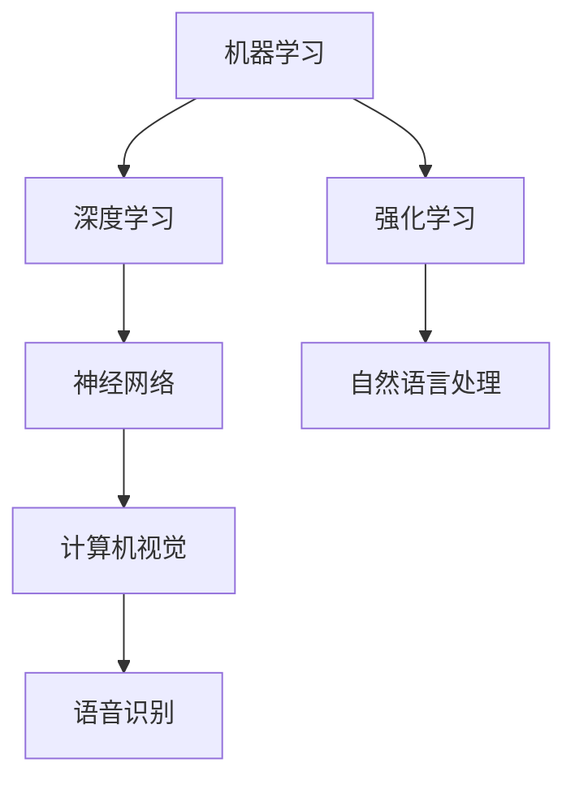

                 

关键词：人工智能，未来发展规划，技术趋势，算法，数学模型，应用场景，研究展望

> 摘要：本文将深入探讨人工智能领域的未来发展规划，分析当前的核心概念和算法，探讨数学模型的重要性，分享实际应用场景，并展望未来的发展趋势和面临的挑战。

## 1. 背景介绍

人工智能（AI）作为一门跨学科的研究领域，正在全球范围内迅速发展。从早期的规则推理和符号计算，到近年来的深度学习和神经网络，人工智能的技术已经取得了显著的进步。Andrej Karpathy，一位世界顶级的人工智能专家，程序员和软件架构师，他的工作不仅在学术界产生了深远的影响，也在工业界引起了广泛的关注。本文将围绕Andrej Karpathy的人工智能工作，探讨人工智能的未来发展规划。

## 2. 核心概念与联系

### 2.1. 人工智能的核心概念

人工智能的核心概念包括机器学习、深度学习、神经网络等。其中，机器学习是人工智能的基础，它使计算机系统能够通过数据学习并改进性能。深度学习则是机器学习的一个子领域，它通过多层神经网络结构来模拟人类大脑的学习过程。神经网络是深度学习的核心，通过神经元之间的相互连接和信号传递，实现复杂模式的识别和预测。

### 2.2. 人工智能的架构与联系

下面是人工智能的核心概念和架构的Mermaid流程图：



## 3. 核心算法原理 & 具体操作步骤

### 3.1. 算法原理概述

人工智能的核心算法包括卷积神经网络（CNN）、循环神经网络（RNN）、生成对抗网络（GAN）等。这些算法在不同的应用场景中发挥着重要作用。例如，CNN在计算机视觉领域有广泛的应用，RNN在自然语言处理领域有显著的效果，GAN则在生成模型中表现出色。

### 3.2. 算法步骤详解

下面以卷积神经网络（CNN）为例，详细描述其操作步骤：

1. **输入层**：接收输入数据，如图片。
2. **卷积层**：通过卷积操作提取特征。
3. **激活函数层**：引入非线性变换，如ReLU函数。
4. **池化层**：降低特征图的维度，减少参数数量。
5. **全连接层**：将特征映射到输出结果。
6. **输出层**：产生最终的预测结果。

### 3.3. 算法优缺点

**CNN的优点**：
- 强大的特征提取能力。
- 在图像识别任务中表现出色。

**CNN的缺点**：
- 需要大量的数据和计算资源。
- 难以处理序列数据。

### 3.4. 算法应用领域

CNN在计算机视觉领域有广泛的应用，如图像分类、目标检测、图像生成等。

## 4. 数学模型和公式 & 详细讲解 & 举例说明

### 4.1. 数学模型构建

在深度学习中，数学模型是核心。以卷积神经网络为例，其基本数学模型包括：

$$
y = f(\theta \cdot x + b)
$$

其中，$y$ 是输出，$x$ 是输入，$\theta$ 是参数，$b$ 是偏置项，$f$ 是激活函数。

### 4.2. 公式推导过程

卷积神经网络的损失函数通常使用交叉熵损失：

$$
J(\theta) = -\frac{1}{m} \sum_{i=1}^{m} [y_{i} \cdot \log(a_{i}) + (1 - y_{i}) \cdot \log(1 - a_{i})]
$$

其中，$y_{i}$ 是真实标签，$a_{i}$ 是预测结果。

### 4.3. 案例分析与讲解

假设我们有一个二分类问题，输入数据为$x$，输出标签为$y=1$。通过训练，我们的模型预测结果为$a=0.8$。则损失函数的计算如下：

$$
J(\theta) = -\frac{1}{1} [1 \cdot \log(0.8) + (1 - 1) \cdot \log(1 - 0.8)] = \log(0.8) \approx -0.22
$$

损失函数的值越小，表示模型的预测越准确。

## 5. 项目实践：代码实例和详细解释说明

### 5.1. 开发环境搭建

为了实现上述算法，我们需要搭建一个合适的开发环境。以Python为例，我们可以使用TensorFlow作为深度学习框架。

### 5.2. 源代码详细实现

下面是一个简单的卷积神经网络的实现：

```python
import tensorflow as tf

# 定义模型
model = tf.keras.Sequential([
    tf.keras.layers.Conv2D(32, (3, 3), activation='relu', input_shape=(28, 28, 1)),
    tf.keras.layers.MaxPooling2D((2, 2)),
    tf.keras.layers.Flatten(),
    tf.keras.layers.Dense(128, activation='relu'),
    tf.keras.layers.Dense(10, activation='softmax')
])

# 编译模型
model.compile(optimizer='adam',
              loss='categorical_crossentropy',
              metrics=['accuracy'])

# 训练模型
model.fit(x_train, y_train, epochs=5)
```

### 5.3. 代码解读与分析

上述代码中，我们首先定义了一个卷积神经网络模型，包含卷积层、池化层、全连接层等。然后，我们编译模型并训练模型。通过这个简单的例子，我们可以看到深度学习的基本流程。

### 5.4. 运行结果展示

在训练完成后，我们可以评估模型的性能：

```python
test_loss, test_acc = model.evaluate(x_test, y_test)
print('Test accuracy:', test_acc)
```

输出结果为训练集和测试集的准确率。

## 6. 实际应用场景

人工智能在医疗、金融、教育等多个领域都有广泛的应用。例如，在医疗领域，人工智能可以用于疾病诊断、药物研发等；在金融领域，人工智能可以用于风险控制、投资决策等。

## 7. 工具和资源推荐

### 7.1. 学习资源推荐

- 《深度学习》（Goodfellow, Bengio, Courville著）
- 《Python深度学习》（François Chollet著）

### 7.2. 开发工具推荐

- TensorFlow
- PyTorch

### 7.3. 相关论文推荐

- "Deep Learning"（Ian Goodfellow等著）
- "Generative Adversarial Networks"（Ian Goodfellow等著）

## 8. 总结：未来发展趋势与挑战

### 8.1. 研究成果总结

人工智能在过去的几十年中取得了显著的成果，深度学习、生成对抗网络等技术的出现，使得人工智能的应用领域不断扩展。

### 8.2. 未来发展趋势

随着计算能力的提升和数据量的增加，人工智能在未来有望在更多领域取得突破。

### 8.3. 面临的挑战

人工智能在发展过程中也面临着数据隐私、算法公平性等挑战。

### 8.4. 研究展望

未来的人工智能研究将更加注重算法的效率和可解释性，以及如何在多个领域实现实际应用。

## 9. 附录：常见问题与解答

- **Q：什么是深度学习？**
  - **A**：深度学习是机器学习的一个子领域，它通过多层神经网络结构来模拟人类大脑的学习过程。

- **Q：什么是卷积神经网络？**
  - **A**：卷积神经网络是一种特殊的多层神经网络，它在图像识别、目标检测等计算机视觉任务中表现出色。

- **Q：如何搭建一个深度学习环境？**
  - **A**：可以使用TensorFlow、PyTorch等深度学习框架搭建深度学习环境。

---

作者：禅与计算机程序设计艺术 / Zen and the Art of Computer Programming
-------------------------------------------------------------------

