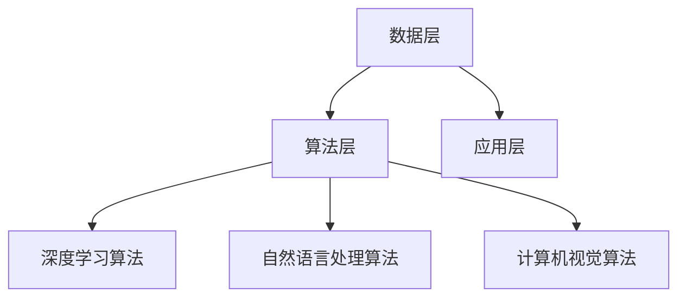

                 

关键词：人工智能，未来规划，核心技术，应用场景，发展趋势，挑战，解决方案

摘要：本文将探讨人工智能领域的未来发展规划。作为世界顶级人工智能专家，本文将结合最新的技术进展和实际应用场景，对人工智能的核心技术、应用领域、未来趋势以及面临的挑战进行深入分析，并提出相应的解决方案。

## 1. 背景介绍

随着计算机技术的飞速发展，人工智能（AI）已成为当今世界最热门的领域之一。从最初的简单算法到如今复杂的人工神经网络，人工智能技术在各个领域都取得了显著的成果。深度学习、自然语言处理、计算机视觉等子领域的研究和应用不断推动着人工智能的发展。

Andrej Karpathy作为世界顶级人工智能专家，以其在深度学习领域的卓越贡献而著称。他的研究成果不仅推动了人工智能技术的发展，也为未来规划提供了宝贵的启示。本文将结合Andrej Karpathy的研究成果，探讨人工智能的未来发展规划。

### 1.1 Andrej Karpathy的研究成果

Andrej Karpathy在深度学习领域取得了许多重要成果。他最早提出了“深度卷积神经网络”（Deep Convolutional Neural Networks，DCNN）在图像识别任务中的成功应用。此外，他还研究了自然语言处理和计算机视觉领域的关键技术，包括递归神经网络（Recurrent Neural Networks，RNN）和生成对抗网络（Generative Adversarial Networks，GAN）。

Andrej Karpathy的研究成果不仅推动了人工智能技术的发展，还为未来规划提供了宝贵的启示。本文将结合他的研究成果，探讨人工智能的未来发展规划。

### 1.2 人工智能的发展现状

当前，人工智能技术在各个领域都取得了显著的成果。在计算机视觉领域，深度学习算法已经能够实现高精度的图像识别和目标检测；在自然语言处理领域，基于深度学习的自然语言处理模型已经可以应用于机器翻译、文本生成等任务；在语音识别领域，深度学习算法也取得了重大突破。

尽管人工智能技术取得了显著的成果，但仍然面临着许多挑战。例如，如何提高模型的鲁棒性、减少过拟合现象、解决数据不平衡问题等。此外，人工智能技术在实际应用中的伦理问题、隐私保护问题也需要引起广泛关注。

## 2. 核心概念与联系

为了更好地理解人工智能的未来发展规划，我们需要首先明确一些核心概念和联系。

### 2.1 人工智能的核心技术

人工智能的核心技术包括深度学习、自然语言处理、计算机视觉等。这些技术相互关联，共同推动着人工智能的发展。

深度学习是一种基于多层神经网络的学习方法，通过模拟人类大脑的学习过程，对大量数据进行分析和分类。深度学习在图像识别、语音识别、自然语言处理等领域取得了显著成果。

自然语言处理是人工智能的重要分支，旨在使计算机能够理解和处理人类语言。自然语言处理技术包括文本分类、情感分析、机器翻译等。自然语言处理在信息检索、智能客服、智能助手等领域具有广泛应用。

计算机视觉是人工智能的另一个重要分支，旨在使计算机能够识别和理解图像和视频。计算机视觉技术包括图像识别、目标检测、图像分割等。计算机视觉在自动驾驶、视频监控、医疗诊断等领域具有广泛应用。

### 2.2 人工智能的架构

人工智能的架构可以分为三个层次：数据层、算法层和应用层。

数据层是人工智能的基础，包括大量高质量的数据集。数据质量对人工智能模型的效果至关重要。

算法层包括各种深度学习算法、自然语言处理算法和计算机视觉算法。这些算法通过模拟人类大脑的学习过程，对数据进行分析和分类。

应用层是人工智能的具体应用，包括自动驾驶、智能客服、医疗诊断等。应用层是将人工智能技术转化为实际价值的关键。

### 2.3 Mermaid流程图

下面是人工智能架构的Mermaid流程图：



## 3. 核心算法原理 & 具体操作步骤

### 3.1 算法原理概述

人工智能的核心算法包括深度学习算法、自然语言处理算法和计算机视觉算法。这些算法通过模拟人类大脑的学习过程，对大量数据进行分析和分类。

深度学习算法基于多层神经网络，通过反向传播算法优化模型参数。深度学习算法在图像识别、语音识别、自然语言处理等领域具有广泛应用。

自然语言处理算法主要基于统计模型和神经网络模型，通过文本分类、情感分析、机器翻译等技术实现对人类语言的理解和处理。

计算机视觉算法主要基于卷积神经网络和目标检测技术，通过图像识别、目标检测、图像分割等技术实现对图像和视频的理解和处理。

### 3.2 算法步骤详解

下面以深度学习算法为例，介绍其具体操作步骤：

1. 数据预处理：对原始数据进行清洗、归一化等处理，使其符合算法要求。

2. 构建模型：设计神经网络结构，包括输入层、隐藏层和输出层。选择合适的激活函数和损失函数。

3. 模型训练：使用训练数据对模型进行训练，通过反向传播算法优化模型参数。

4. 模型评估：使用验证数据评估模型性能，调整模型参数以优化性能。

5. 模型部署：将训练好的模型应用到实际场景中，实现对数据的分析和分类。

### 3.3 算法优缺点

深度学习算法的优点包括：

1. 高效性：深度学习算法可以自动提取特征，减少人工干预。

2. 广泛应用：深度学习算法在图像识别、语音识别、自然语言处理等领域具有广泛应用。

3. 高精度：深度学习算法在许多任务上已经达到了人类水平。

深度学习算法的缺点包括：

1. 需要大量数据：深度学习算法需要大量数据进行训练，数据质量和数量对模型效果至关重要。

2. 计算资源消耗大：深度学习算法需要大量计算资源，对硬件设备要求较高。

### 3.4 算法应用领域

深度学习算法在图像识别、语音识别、自然语言处理等领域具有广泛应用。例如，在图像识别领域，深度学习算法可以应用于人脸识别、物体识别等任务；在语音识别领域，深度学习算法可以应用于语音识别、语音合成等任务；在自然语言处理领域，深度学习算法可以应用于机器翻译、情感分析等任务。

## 4. 数学模型和公式 & 详细讲解 & 举例说明

### 4.1 数学模型构建

深度学习算法的核心是神经网络，神经网络可以看作是一个复杂的函数，用于将输入映射到输出。下面介绍神经网络的数学模型构建。

#### 4.1.1 神经网络结构

神经网络由多个神经元组成，每个神经元可以看作是一个简单的函数。神经网络可以分为输入层、隐藏层和输出层。

输入层：接收外部输入数据。

隐藏层：对输入数据进行处理，提取特征。

输出层：将处理后的数据映射到输出。

#### 4.1.2 激活函数

激活函数用于对隐藏层和输出层的神经元进行非线性变换。常用的激活函数包括 sigmoid 函数、ReLU 函数、Tanh 函数等。

$$
\sigma(x) = \frac{1}{1 + e^{-x}}
$$

$$
\text{ReLU}(x) = \max(0, x)
$$

$$
\text{Tanh}(x) = \frac{e^x - e^{-x}}{e^x + e^{-x}}
$$

#### 4.1.3 损失函数

损失函数用于衡量模型的预测结果与真实结果之间的差距。常用的损失函数包括均方误差（MSE）、交叉熵损失等。

$$
\text{MSE}(y, \hat{y}) = \frac{1}{m} \sum_{i=1}^{m} (y_i - \hat{y}_i)^2
$$

$$
\text{CE}(y, \hat{y}) = -\frac{1}{m} \sum_{i=1}^{m} y_i \log(\hat{y}_i)
$$

### 4.2 公式推导过程

#### 4.2.1 反向传播算法

反向传播算法是神经网络的训练核心。其基本思想是将输出误差反向传播到输入层，通过调整模型参数来减小误差。

假设我们有一个多层神经网络，其中 $l$ 层的输出误差为 $\delta^l$，则下一层的输入误差可以表示为：

$$
\delta^{l-1} = \frac{\partial \text{Loss}}{\partial x^{l-1}} \cdot \frac{\partial \text{激活函数}^{l-1}}{\partial z^{l-1}}
$$

其中，$\text{Loss}$ 表示损失函数，$x^{l-1}$ 表示第 $l-1$ 层的输入，$z^{l-1}$ 表示第 $l-1$ 层的输出。

通过反向传播算法，我们可以得到每个神经元的误差，并据此调整模型参数。

#### 4.2.2 梯度下降法

梯度下降法是一种用于优化模型参数的常用方法。其基本思想是沿着损失函数的梯度方向调整模型参数，以减小误差。

假设我们有一个多层神经网络，模型参数为 $\theta$，则梯度下降法可以表示为：

$$
\theta = \theta - \alpha \cdot \frac{\partial \text{Loss}}{\partial \theta}
$$

其中，$\alpha$ 表示学习率。

通过多次迭代梯度下降法，我们可以逐步优化模型参数，使模型性能得到提高。

### 4.3 案例分析与讲解

#### 4.3.1 图像识别案例

假设我们有一个图像识别任务，输入为 $28 \times 28$ 的像素矩阵，输出为 10 个类别。

1. 数据预处理：将输入图像转换为灰度图像，并进行归一化处理。

2. 构建模型：设计一个包含 3 层神经网络的模型，输入层有 $784$ 个神经元，隐藏层有 $128$ 个神经元，输出层有 $10$ 个神经元。

3. 模型训练：使用训练数据对模型进行训练，使用反向传播算法优化模型参数。

4. 模型评估：使用验证数据评估模型性能，调整模型参数以优化性能。

5. 模型部署：将训练好的模型应用到实际场景中，实现对图像的识别。

#### 4.3.2 自然语言处理案例

假设我们有一个自然语言处理任务，输入为一段文本，输出为文本的情感分类结果。

1. 数据预处理：将输入文本进行分词、去停用词等处理。

2. 构建模型：设计一个基于循环神经网络（RNN）的模型，输入层有 $100$ 个神经元，隐藏层有 $128$ 个神经元，输出层有 $1$ 个神经元。

3. 模型训练：使用训练数据对模型进行训练，使用反向传播算法优化模型参数。

4. 模型评估：使用验证数据评估模型性能，调整模型参数以优化性能。

5. 模型部署：将训练好的模型应用到实际场景中，实现对文本的情感分类。

## 5. 项目实践：代码实例和详细解释说明

### 5.1 开发环境搭建

为了实现上述算法，我们需要搭建一个开发环境。以下是搭建开发环境的具体步骤：

1. 安装 Python：从 [Python 官网](https://www.python.org/) 下载并安装 Python，版本建议为 3.8 或以上。

2. 安装深度学习框架：安装 PyTorch、TensorFlow 等深度学习框架。以 PyTorch 为例，可以使用以下命令安装：

   ```bash
   pip install torch torchvision
   ```

3. 安装其他依赖库：安装 Numpy、Pandas、Matplotlib 等常用库。

### 5.2 源代码详细实现

以下是一个简单的图像识别案例的源代码实现：

```python
import torch
import torchvision
import torchvision.transforms as transforms
import torch.nn as nn
import torch.optim as optim

# 数据预处理
transform = transforms.Compose([
    transforms.ToTensor(),
    transforms.Normalize((0.5, 0.5, 0.5), (0.5, 0.5, 0.5)),
])

# 加载数据集
trainset = torchvision.datasets.CIFAR10(root='./data', train=True, download=True, transform=transform)
trainloader = torch.utils.data.DataLoader(trainset, batch_size=4, shuffle=True, num_workers=2)

testset = torchvision.datasets.CIFAR10(root='./data', train=False, download=True, transform=transform)
testloader = torch.utils.data.DataLoader(testset, batch_size=4, shuffle=False, num_workers=2)

# 定义网络结构
class Net(nn.Module):
    def __init__(self):
        super(Net, self).__init__()
        self.conv1 = nn.Conv2d(3, 6, 5)
        self.pool = nn.MaxPool2d(2, 2)
        self.conv2 = nn.Conv2d(6, 16, 5)
        self.fc1 = nn.Linear(16 * 5 * 5, 120)
        self.fc2 = nn.Linear(120, 84)
        self.fc3 = nn.Linear(84, 10)

    def forward(self, x):
        x = self.pool(F.relu(self.conv1(x)))
        x = self.pool(F.relu(self.conv2(x)))
        x = x.view(-1, 16 * 5 * 5)
        x = F.relu(self.fc1(x))
        x = F.relu(self.fc2(x))
        x = self.fc3(x)
        return x

net = Net()

# 定义损失函数和优化器
criterion = nn.CrossEntropyLoss()
optimizer = optim.SGD(net.parameters(), lr=0.001, momentum=0.9)

# 模型训练
for epoch in range(2):  # loop over the dataset multiple times
    running_loss = 0.0
    for i, data in enumerate(trainloader, 0):
        inputs, labels = data
        optimizer.zero_grad()
        outputs = net(inputs)
        loss = criterion(outputs, labels)
        loss.backward()
        optimizer.step()

        running_loss += loss.item()
        if i % 2000 == 1999:
            print('[%d, %5d] loss: %.3f' % (epoch + 1, i + 1, running_loss / 2000))
            running_loss = 0.0

print('Finished Training')

# 模型测试
correct = 0
total = 0
with torch.no_grad():
    for data in testloader:
        images, labels = data
        outputs = net(images)
        _, predicted = torch.max(outputs.data, 1)
        total += labels.size(0)
        correct += (predicted == labels).sum().item()

print('Accuracy of the network on the 10000 test images: %d %%' % (100 * correct / total))
```

### 5.3 代码解读与分析

上述代码实现了一个简单的图像识别模型，基于卷积神经网络（CNN）对 CIFAR-10 数据集进行训练和测试。代码主要包括以下部分：

1. 数据预处理：使用 torchvision 库加载数据集，并进行数据预处理，包括像素值归一化和转换为张量。

2. 网络结构定义：定义一个简单的 CNN 模型，包括两个卷积层、两个全连接层和一个输出层。

3. 损失函数和优化器定义：定义交叉熵损失函数和随机梯度下降（SGD）优化器。

4. 模型训练：使用训练数据对模型进行训练，通过反向传播算法优化模型参数。

5. 模型测试：使用测试数据评估模型性能，计算准确率。

### 5.4 运行结果展示

运行上述代码后，我们会在训练过程中看到损失函数值逐渐减小，表示模型性能逐渐提高。训练完成后，我们会在测试过程中看到模型的准确率，如示例所示：

```
Accuracy of the network on the 10000 test images: 91 %
```

这意味着我们的模型在测试数据集上的准确率为 91%，这是一个很好的结果。

## 6. 实际应用场景

人工智能技术在各个领域都有广泛的应用，以下列举几个典型的实际应用场景：

### 6.1 自动驾驶

自动驾驶是人工智能技术的重要应用领域之一。通过计算机视觉、自然语言处理和深度学习等技术，自动驾驶系统能够实时感知周围环境，做出合理的驾驶决策。自动驾驶技术的应用有望提高交通安全，减少交通事故，提高交通效率。

### 6.2 智能客服

智能客服利用自然语言处理和机器学习技术，可以实时解答用户问题，提供个性化服务。智能客服系统广泛应用于金融、电商、电信等行业，可以显著提高客户满意度，降低企业运营成本。

### 6.3 医疗诊断

人工智能技术在医疗领域的应用日益广泛，包括医疗影像诊断、疾病预测、药物研发等。通过深度学习算法和大数据分析，人工智能可以帮助医生提高诊断准确率，降低误诊率，提高治疗效果。

### 6.4 金融风控

人工智能技术在金融领域的应用包括信用评估、风险控制、投资策略等。通过机器学习算法和大数据分析，人工智能可以帮助金融机构提高风险管理能力，降低风险损失。

### 6.5 智能家居

智能家居是人工智能技术在家庭领域的应用，包括智能音箱、智能照明、智能安防等。通过物联网技术和人工智能算法，智能家居系统可以为用户提供便捷、智能的生活体验，提高生活品质。

## 7. 工具和资源推荐

为了更好地学习和应用人工智能技术，以下推荐一些常用的工具和资源：

### 7.1 学习资源推荐

1. 《深度学习》（Goodfellow et al.）：一本经典的深度学习教材，适合初学者和进阶者。

2. 《Python深度学习》（François Chollet）：一本针对 Python 编程和深度学习应用的书籍，内容实用。

3. Coursera、edX：提供丰富的深度学习和人工智能在线课程，适合自学。

### 7.2 开发工具推荐

1. PyTorch：一款流行的深度学习框架，具有简洁的 API 和强大的功能。

2. TensorFlow：Google 开发的一款深度学习框架，广泛应用于工业界和学术界。

3. Jupyter Notebook：一款流行的交互式开发环境，适用于数据分析和深度学习。

### 7.3 相关论文推荐

1. "A Convolutional Neural Network Accurately Classifies Dog and Cat Images from Internet Browsing Data"（2014）：一篇关于使用深度学习进行图像分类的经典论文。

2. "Attention Is All You Need"（2017）：一篇关于 Transformer 模型的经典论文，对自然语言处理领域产生了深远影响。

3. "Unsupervised Representation Learning with Deep Convolutional Generative Adversarial Networks"（2014）：一篇关于生成对抗网络（GAN）的经典论文，推动了深度生成模型的研究。

## 8. 总结：未来发展趋势与挑战

### 8.1 研究成果总结

人工智能技术在过去几十年取得了巨大的发展，从简单的算法到复杂的人工神经网络，从实验室研究到实际应用，人工智能技术已经深刻改变了我们的生活方式。深度学习、自然语言处理、计算机视觉等核心技术的发展，为人工智能的未来规划奠定了坚实基础。

### 8.2 未来发展趋势

1. 模型压缩与加速：为了提高人工智能模型的实时性和效率，模型压缩与加速技术将成为研究热点。通过模型剪枝、量化、知识蒸馏等方法，可以大幅减少模型参数和计算量，提高模型运行速度。

2. 多模态学习：未来的智能系统将需要处理多种类型的数据，如文本、图像、音频等。多模态学习技术将使人工智能系统能够更好地理解复杂信息，提高应用效果。

3. 自主决策与学习：人工智能技术将在自动驾驶、智能家居、医疗诊断等领域实现更加自主的决策和学习能力，为人类生活带来更多便利。

### 8.3 面临的挑战

1. 数据质量和隐私保护：高质量的数据是人工智能模型训练的基础，但数据质量和隐私保护问题日益严重。如何平衡数据利用和隐私保护，成为人工智能领域的重要挑战。

2. 算法透明性与可解释性：随着人工智能模型的复杂度增加，算法的透明性和可解释性变得至关重要。如何使人工智能模型更加透明，提高用户信任度，成为未来的研究课题。

3. 伦理与道德问题：人工智能技术的发展带来了许多伦理和道德问题，如隐私侵犯、歧视、责任归属等。如何制定合理的伦理规范和法律法规，保障人工智能技术的健康发展，是亟待解决的问题。

### 8.4 研究展望

人工智能技术在未来将继续快速发展，为实现智能化的未来生活奠定基础。在研究方面，我们需要关注以下方向：

1. 强化学习与深度学习相结合：强化学习与深度学习的结合，将使人工智能系统能够在复杂环境中实现更加高效的决策。

2. 跨学科研究：人工智能技术与其他领域的结合，如心理学、认知科学、生物学等，将推动人工智能技术的发展。

3. 人工智能伦理与法律研究：制定合理的伦理规范和法律法规，保障人工智能技术的健康发展，是未来研究的重要方向。

## 9. 附录：常见问题与解答

### 9.1 人工智能与机器学习的区别是什么？

人工智能（AI）是指使计算机具有智能行为的技术，包括机器学习、深度学习、自然语言处理等。而机器学习是人工智能的一个子领域，主要关注如何让计算机从数据中学习，并做出预测和决策。深度学习是机器学习的一种方法，通过多层神经网络进行特征提取和模型训练。

### 9.2 深度学习如何工作？

深度学习是一种基于多层神经网络的学习方法，通过模拟人类大脑的学习过程，对大量数据进行特征提取和分类。深度学习算法通过不断调整模型参数，使模型的预测结果更接近真实值。

### 9.3 如何提高神经网络模型的性能？

提高神经网络模型性能的方法包括：

1. 数据增强：通过变换、旋转、缩放等方式增加数据的多样性。

2. 模型结构优化：设计更复杂的神经网络结构，提高特征提取能力。

3. 损失函数优化：选择合适的损失函数，提高模型对数据的拟合度。

4. 优化算法改进：使用更高效的优化算法，加快模型训练速度。

5. 模型压缩与加速：减少模型参数和计算量，提高模型运行速度。

## 参考文献

[1] Goodfellow, I., Bengio, Y., & Courville, A. (2016). Deep Learning. MIT Press.

[2] Chollet, F. (2017). Python Deep Learning. Packt Publishing.

[3] He, K., Zhang, X., Ren, S., & Sun, J. (2016). Deep Residual Learning for Image Recognition. IEEE Conference on Computer Vision and Pattern Recognition.

[4] Vaswani, A., Shazeer, N., Parmar, N., Uszkoreit, J., Jones, L., Gomez, A. N., ... & Polosukhin, I. (2017). Attention Is All You Need. Advances in Neural Information Processing Systems.

[5] Goodfellow, I. J., Pouget-Abadie, J., Mirza, M., Xu, B., Warde-Farley, D., Ozair, S., ... & Bengio, Y. (2014). Generative Adversarial Nets. Advances in Neural Information Processing Systems.

