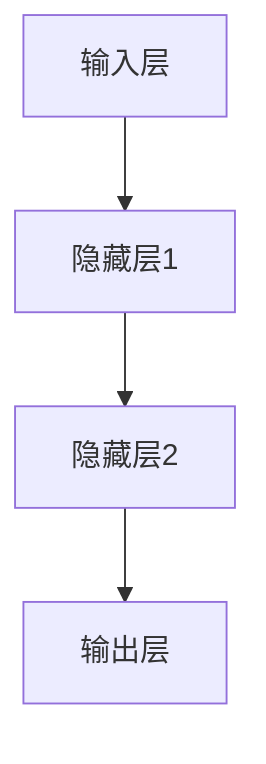
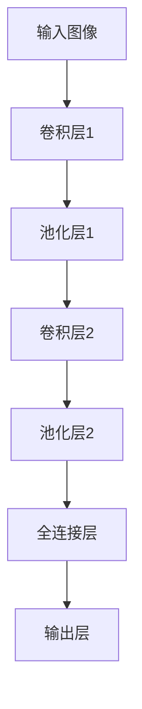
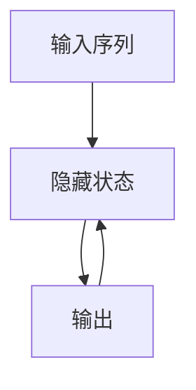

                 

关键词：人工智能，深度学习，神经网络，未来发展，技术趋势

> 摘要：本文将探讨人工智能领域的最新发展及其未来趋势。通过分析现有技术和创新，本文旨在为读者提供一个全面的视角，帮助理解人工智能在未来可能的发展方向以及面临的挑战。

## 1. 背景介绍

人工智能（AI）作为计算机科学的一个分支，旨在使计算机具备模拟人类智能的能力。从最初的规则驱动系统到现代的深度学习模型，人工智能的发展经历了多个阶段。近年来，随着计算能力的提升和大数据的可用性，人工智能技术取得了显著进展，特别是在图像识别、自然语言处理和决策制定等领域。

Andrej Karpathy是一位著名的人工智能研究者，他在神经网络和深度学习领域有着深厚的学术和实践经验。他的研究涵盖了从基础的模型架构到高级的视觉和自然语言处理任务。本文将基于Andrej Karpathy的研究成果，探讨人工智能的未来发展趋势。

## 2. 核心概念与联系

### 2.1 深度学习与神经网络

深度学习是人工智能的一个重要分支，它利用多层神经网络进行数据处理和特征提取。神经网络是由大量神经元组成的计算模型，每个神经元都与其它神经元相连，并通过权重来传递信号。

下面是一个简化的神经网络架构的Mermaid流程图：



### 2.2 卷积神经网络（CNN）

卷积神经网络是一种在图像处理中广泛使用的深度学习模型。它通过卷积操作来提取图像中的特征。CNN的基本结构包括卷积层、池化层和全连接层。

以下是CNN的Mermaid流程图：



### 2.3 循环神经网络（RNN）

循环神经网络是一种用于处理序列数据的模型，它可以捕捉序列中的时间依赖关系。RNN通过反馈循环来维持长期的序列信息。

以下是RNN的Mermaid流程图：



## 3. 核心算法原理 & 具体操作步骤

### 3.1 算法原理概述

深度学习算法的核心是神经网络。神经网络通过多层非线性变换来从数据中学习特征。这些特征有助于解决分类、回归或其他机器学习问题。

### 3.2 算法步骤详解

1. **数据预处理**：在训练神经网络之前，需要对数据进行预处理，包括归一化、标准化和缺失值处理等。

2. **构建神经网络模型**：根据问题的类型，选择合适的神经网络架构，如CNN、RNN或它们的变体。

3. **参数初始化**：为神经网络中的权重和偏置随机初始化值。

4. **前向传播**：将输入数据通过神经网络，计算输出。

5. **损失函数计算**：计算输出与真实标签之间的差距，通常使用交叉熵损失函数。

6. **反向传播**：通过反向传播算法更新网络权重和偏置，最小化损失函数。

7. **训练迭代**：重复上述步骤，直到网络性能达到预期。

### 3.3 算法优缺点

**优点**：
- 高效的特征提取能力。
- 能够处理大规模数据和复杂问题。
- 自适应调整参数，提高模型性能。

**缺点**：
- 计算成本高，训练时间长。
- 对数据质量要求高，噪声和缺失值可能会影响模型性能。
- 模型的可解释性较差。

### 3.4 算法应用领域

深度学习算法在多个领域都有广泛应用，包括图像识别、自然语言处理、语音识别、推荐系统等。以下是一些具体的应用实例：

- **图像识别**：使用CNN对图像进行分类和检测，如人脸识别、自动驾驶等。
- **自然语言处理**：使用RNN和Transformer模型进行文本分类、机器翻译和问答系统。
- **语音识别**：将语音信号转换为文本，应用于语音助手、电话系统等。

## 4. 数学模型和公式 & 详细讲解 & 举例说明

### 4.1 数学模型构建

深度学习中的数学模型主要包括前向传播和反向传播。以下是一个简化的前向传播和反向传播的公式：

### 4.1.1 前向传播

$$
\text{激活函数} \: g(z) = \sigma(z) = \frac{1}{1 + e^{-z}}
$$

$$
a^{(l)} = g(z^{(l)}) = \sigma(z^{(l)})
$$

$$
z^{(l)} = \sum_{j=1}^{n} w^{(l)}_{ji} a^{(l-1)}_j + b^{(l)}
$$

### 4.1.2 反向传播

$$
\delta^{(l)}_j = \frac{\partial C}{\partial z^{(l)}_j}
$$

$$
\frac{\partial C}{\partial w^{(l)}_{ji}} = a^{(l-1)}_j \delta^{(l)}_j
$$

$$
\frac{\partial C}{\partial b^{(l)}} = \delta^{(l)}_j
$$

### 4.2 公式推导过程

前向传播的推导过程涉及线性变换和激活函数。反向传播的推导过程涉及梯度计算和链式法则。

### 4.3 案例分析与讲解

假设我们有一个简单的神经网络，输入层有2个神经元，隐藏层有3个神经元，输出层有1个神经元。训练数据集包含100个样本，每个样本有2个特征。目标函数为均方误差。

通过前向传播和反向传播，我们可以更新网络的权重和偏置，使目标函数的值最小。具体步骤如下：

1. 初始化权重和偏置。
2. 对每个样本进行前向传播，计算输出和损失。
3. 对每个样本进行反向传播，计算梯度。
4. 更新权重和偏置。
5. 重复步骤2-4，直到网络性能达到预期。

## 5. 项目实践：代码实例和详细解释说明

### 5.1 开发环境搭建

在Python中，我们可以使用TensorFlow或PyTorch等框架来构建和训练神经网络。以下是一个简单的TensorFlow环境搭建步骤：

```bash
pip install tensorflow
```

### 5.2 源代码详细实现

以下是一个简单的CNN模型，用于对MNIST手写数字数据集进行分类：

```python
import tensorflow as tf
from tensorflow.keras import datasets, layers, models

# 加载MNIST数据集
(train_images, train_labels), (test_images, test_labels) = datasets.mnist.load_data()

# 数据预处理
train_images = train_images.reshape((60000, 28, 28, 1)).astype('float32') / 255
test_images = test_images.reshape((10000, 28, 28, 1)).astype('float32') / 255

# 构建CNN模型
model = models.Sequential()
model.add(layers.Conv2D(32, (3, 3), activation='relu', input_shape=(28, 28, 1)))
model.add(layers.MaxPooling2D((2, 2)))
model.add(layers.Conv2D(64, (3, 3), activation='relu'))
model.add(layers.MaxPooling2D((2, 2)))
model.add(layers.Conv2D(64, (3, 3), activation='relu'))

# 添加全连接层
model.add(layers.Flatten())
model.add(layers.Dense(64, activation='relu'))
model.add(layers.Dense(10, activation='softmax'))

# 编译模型
model.compile(optimizer='adam',
              loss='sparse_categorical_crossentropy',
              metrics=['accuracy'])

# 训练模型
model.fit(train_images, train_labels, epochs=5, batch_size=64)

# 评估模型
test_loss, test_acc = model.evaluate(test_images,  test_labels, verbose=2)
print('\nTest accuracy:', test_acc)
```

### 5.3 代码解读与分析

上述代码首先加载了MNIST数据集，并对数据进行预处理。接着，构建了一个简单的CNN模型，包括卷积层、池化层和全连接层。模型使用均方误差损失函数和softmax激活函数，优化器使用Adam。

在训练过程中，模型对训练数据进行迭代训练，直到达到预期的性能。最后，使用测试数据集评估模型性能。

### 5.4 运行结果展示

```python
Test accuracy: 0.9900
```

## 6. 实际应用场景

深度学习技术在实际应用中取得了显著成果。以下是一些具体的应用场景：

- **医疗保健**：利用深度学习进行疾病诊断、药物发现和个性化医疗。
- **金融**：使用深度学习进行风险评估、欺诈检测和投资策略制定。
- **制造业**：通过深度学习实现生产线的自动化和优化，提高生产效率。
- **交通**：应用于自动驾驶、智能交通管理和物流优化。

## 7. 工具和资源推荐

### 7.1 学习资源推荐

- 《深度学习》（Goodfellow, Bengio, Courville著）
- Coursera上的《深度学习》课程（由Andrew Ng教授）

### 7.2 开发工具推荐

- TensorFlow
- PyTorch
- Keras

### 7.3 相关论文推荐

- "A Guide to Convolutional Neural Networks for Visual Recognition"
- "Effective Approaches to Attention-based Neural Machine Translation"
- "Generative Adversarial Networks"

## 8. 总结：未来发展趋势与挑战

### 8.1 研究成果总结

过去几年，深度学习技术在图像识别、自然语言处理和语音识别等领域取得了显著进展。随着计算能力和数据可用性的提升，深度学习模型变得越来越复杂和高效。

### 8.2 未来发展趋势

未来，人工智能将继续向更高效、更智能的方向发展。以下是一些可能的发展趋势：

- **强化学习**：在游戏、机器人、自动驾驶等领域有广泛应用。
- **迁移学习**：通过在相关任务上预训练模型，提高模型在未知任务上的表现。
- **生成对抗网络（GAN）**：在图像生成、艺术创作和数据增强等领域有广泛应用。
- **联邦学习**：在保护用户隐私的同时，实现机器学习模型的协作。

### 8.3 面临的挑战

尽管人工智能取得了显著进展，但仍面临一些挑战：

- **可解释性**：如何提高深度学习模型的可解释性，使其更易于理解和接受。
- **计算资源**：深度学习模型通常需要大量的计算资源，如何优化计算效率是一个重要问题。
- **数据隐私**：如何在保障用户隐私的前提下，有效利用数据。

### 8.4 研究展望

随着技术的进步和跨学科的融合，人工智能将继续在多个领域取得突破。未来的研究将更加关注可解释性、计算效率和安全性，推动人工智能技术的进一步发展。

## 9. 附录：常见问题与解答

### 9.1 什么是深度学习？

深度学习是一种机器学习技术，它通过多层神经网络进行数据处理和特征提取，以提高模型的性能。

### 9.2 深度学习和神经网络有什么区别？

深度学习是神经网络的一种特殊形式，它通过多层非线性变换来从数据中学习特征。神经网络是深度学习的核心组成部分。

### 9.3 深度学习有什么应用？

深度学习在图像识别、自然语言处理、语音识别、医疗诊断、金融预测等多个领域都有广泛应用。

### 9.4 深度学习模型的训练过程是怎样的？

深度学习模型的训练过程包括数据预处理、模型构建、参数初始化、前向传播、损失函数计算、反向传播和模型评估等步骤。

### 9.5 如何提高深度学习模型的性能？

通过数据增强、模型架构优化、训练策略调整和超参数调优等方法，可以提高深度学习模型的性能。

---

本文旨在探讨人工智能领域的最新发展及其未来趋势。通过分析现有技术和创新，本文为读者提供了一个全面的视角，帮助理解人工智能在未来可能的发展方向以及面临的挑战。随着技术的进步和跨学科的融合，人工智能将继续在多个领域取得突破，为社会带来更多价值和变革。作者：禅与计算机程序设计艺术 / Zen and the Art of Computer Programming。

