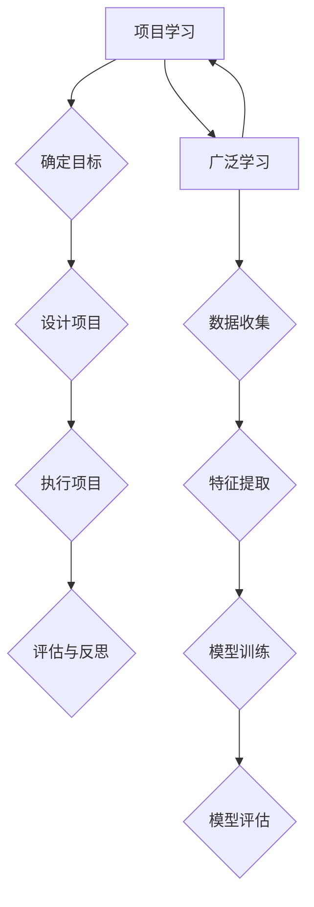

                 

关键词：项目学习、广泛学习、神经模型、互补机制、学习效率

摘要：本文探讨了项目学习模式与广泛学习机制的互补关系。通过对Andrej Karpathy的研究工作进行深入分析，文章揭示了项目学习在神经模型训练中的应用及其与广泛学习机制之间的协同作用，从而为优化人工智能模型的训练策略提供了新的视角。

## 1. 背景介绍

在深度学习领域，项目学习和广泛学习是两种重要的学习模式。项目学习（Project-Based Learning，PBL）强调通过实际项目来培养学习者的实践能力和创新思维。而广泛学习（Broad Learning）则注重从大量的数据中提取通用的特征表示，以提高模型的泛化能力。这两种学习模式在人工智能的发展过程中扮演了重要角色，但它们之间的关系尚未得到充分的研究。

Andrej Karpathy是一位在深度学习领域享有盛誉的研究者，他在其研究工作中探索了项目学习与广泛学习的互补关系。他的研究成果为我们理解两种学习模式之间的互动提供了新的视角，并可能对优化深度学习模型的训练策略产生深远影响。

## 2. 核心概念与联系

为了更好地理解项目学习与广泛学习的互补关系，我们首先需要了解这两种学习模式的核心概念。

### 项目学习

项目学习是一种以项目为中心的学习方式，强调通过实际项目来培养学习者的实践能力和创新思维。在深度学习领域，项目学习通常涉及以下步骤：

1. **确定学习目标**：明确需要解决的问题或需要达到的目标。
2. **设计项目**：根据学习目标设计相应的项目，确保项目具有挑战性和实用性。
3. **执行项目**：通过实际操作来实施项目，收集数据和经验。
4. **评估和反思**：对项目结果进行评估，总结经验教训，为下一次项目提供参考。

### 广泛学习

广泛学习是一种从大量数据中提取通用特征表示的学习方式。在深度学习领域，广泛学习通常涉及以下步骤：

1. **数据收集**：收集大量相关的数据，这些数据应涵盖不同类型的情境和任务。
2. **特征提取**：通过神经网络或其他机器学习算法从数据中提取特征。
3. **模型训练**：使用提取的特征来训练模型，以提高模型的泛化能力。
4. **模型评估**：评估模型的性能，确保模型在不同任务和数据集上都具有良好的表现。

### 项目学习与广泛学习的联系

项目学习和广泛学习在深度学习领域有着紧密的联系。项目学习可以为广泛学习提供具体的应用场景和数据需求，而广泛学习则为项目学习提供了强大的基础支持。具体来说，项目学习与广泛学习之间的互补关系可以从以下几个方面体现：

1. **目标导向**：项目学习通过明确的学习目标来指导广泛学习的方向，确保广泛学习能够为项目学习提供有用的特征表示。
2. **数据收集**：项目学习中的实际操作可以产生丰富的数据，这些数据可以用于广泛学习，从而提高模型的泛化能力。
3. **模型训练**：项目学习中的模型训练可以结合广泛学习的成果，以提高模型的性能和泛化能力。
4. **评估与反思**：项目学习中的评估和反思过程可以为广泛学习提供反馈，帮助改进广泛学习的方法和策略。

为了更直观地展示项目学习与广泛学习的联系，我们可以使用Mermaid流程图来描述这两种学习模式之间的关系。



在这个流程图中，项目学习和广泛学习通过相互反馈和互动，实现了相互补充和优化。

## 3. 核心算法原理 & 具体操作步骤

### 3.1 算法原理概述

项目学习与广泛学习的互补关系可以通过一种称为“迁移学习”（Transfer Learning）的算法来实现。迁移学习是一种利用预先训练好的模型来加速新任务学习的方法。在迁移学习中，项目学习和广泛学习分别扮演了不同的角色。

- **项目学习**：通过实际项目来确定新的学习任务，并为迁移学习提供具体的应用场景。
- **广泛学习**：通过大量数据的特征提取来构建通用特征表示，为迁移学习提供有效的支持。

### 3.2 算法步骤详解

#### 3.2.1 确定新任务

在新任务确定阶段，项目学习通过以下步骤来实现：

1. **分析需求**：分析新任务的需求，明确需要解决的问题或需要达到的目标。
2. **确定目标**：根据需求确定新的学习目标。
3. **设计项目**：设计相应的项目，确保项目具有挑战性和实用性。

#### 3.2.2 数据收集

在数据收集阶段，广泛学习通过以下步骤来实现：

1. **数据源选择**：选择与项目相关的数据源，确保数据来源的多样性和完整性。
2. **数据预处理**：对收集到的数据进行预处理，包括数据清洗、归一化、数据增强等。
3. **数据存储**：将预处理后的数据存储到数据集，为后续的特征提取和模型训练提供支持。

#### 3.2.3 特征提取

在特征提取阶段，广泛学习通过以下步骤来实现：

1. **模型选择**：选择适合特征提取的神经网络模型。
2. **预训练**：使用大量数据进行预训练，以提取通用的特征表示。
3. **特征提取**：使用预训练模型对数据集进行特征提取，得到高层次的抽象特征。

#### 3.2.4 模型训练

在模型训练阶段，项目学习与广泛学习结合，通过以下步骤来实现：

1. **迁移学习**：使用广泛学习得到的特征表示来初始化新任务的模型。
2. **微调**：在新数据集上对模型进行微调，以提高模型在新任务上的性能。
3. **评估**：评估模型的性能，确保模型在新任务上具有良好的表现。

#### 3.2.5 评估与反思

在评估与反思阶段，项目学习通过以下步骤来实现：

1. **性能评估**：评估模型在新任务上的性能，包括准确性、召回率、F1分数等指标。
2. **反思与改进**：根据评估结果，反思项目学习和广泛学习的实施过程，并提出改进措施。
3. **持续优化**：结合反思结果，对项目学习和广泛学习进行持续优化，以提高学习效果。

### 3.3 算法优缺点

#### 优点

- **高效性**：项目学习与广泛学习的互补关系能够提高模型的学习效率，缩短训练时间。
- **灵活性**：项目学习可以根据具体任务的需求来设计和调整，从而提高模型的适应性。
- **通用性**：广泛学习能够提取通用的特征表示，从而提高模型的泛化能力。

#### 缺点

- **数据需求**：广泛学习需要大量的数据来训练，这可能对数据收集和处理带来一定的挑战。
- **计算资源**：广泛学习通常需要大量的计算资源，这可能会对训练过程的成本和速度产生影响。

### 3.4 算法应用领域

迁移学习作为一种结合项目学习和广泛学习的方法，在深度学习的多个领域都有广泛应用，包括：

- **计算机视觉**：用于图像分类、目标检测、图像分割等任务。
- **自然语言处理**：用于文本分类、机器翻译、情感分析等任务。
- **语音识别**：用于语音识别、说话人识别等任务。

## 4. 数学模型和公式 & 详细讲解 & 举例说明

### 4.1 数学模型构建

在迁移学习中，项目学习和广泛学习的互补关系可以通过以下数学模型来描述：

$$
\begin{aligned}
\text{模型训练} &= \text{项目学习} + \text{广泛学习} \\
&= P(\theta_1) + Q(\theta_2)
\end{aligned}
$$

其中，$P(\theta_1)$ 表示项目学习，$Q(\theta_2)$ 表示广泛学习，$\theta_1$ 和 $\theta_2$ 分别表示两种学习模式中的参数。

### 4.2 公式推导过程

为了推导上述数学模型，我们首先需要了解项目学习和广泛学习的具体实现方式。

#### 项目学习

项目学习的核心是迁移学习，其公式可以表示为：

$$
P(\theta_1) = \arg \min_{\theta_1} L(\theta_1; y_1)
$$

其中，$L(\theta_1; y_1)$ 表示项目学习损失函数，$y_1$ 表示新任务的数据。

#### 广泛学习

广泛学习的核心是特征提取，其公式可以表示为：

$$
Q(\theta_2) = \arg \min_{\theta_2} L(\theta_2; y_2)
$$

其中，$L(\theta_2; y_2)$ 表示广泛学习损失函数，$y_2$ 表示广泛学习的数据。

#### 补充公式

为了进一步描述项目学习和广泛学习之间的关系，我们引入以下补充公式：

$$
\begin{aligned}
\theta_1 &= \theta_1^0 + \alpha \nabla_{\theta_1} L(\theta_1; y_1) \\
\theta_2 &= \theta_2^0 + \beta \nabla_{\theta_2} L(\theta_2; y_2)
\end{aligned}
$$

其中，$\theta_1^0$ 和 $\theta_2^0$ 分别表示项目学习和广泛学习的初始参数，$\alpha$ 和 $\beta$ 分别表示学习率。

### 4.3 案例分析与讲解

为了更好地理解上述数学模型和公式，我们通过以下案例来进行详细分析和讲解。

#### 案例背景

假设我们有一个新的图像分类任务，需要对输入的图像进行分类。我们已经有了一个预训练的卷积神经网络（CNN）模型，这个模型已经在大量图像数据上进行了预训练，从而提取了通用的特征表示。现在，我们需要使用这个预训练模型来处理新的图像分类任务。

#### 案例分析

在这个案例中，项目学习可以通过以下步骤来实现：

1. **数据收集**：收集新的图像数据集，这些数据应涵盖不同的类别。
2. **数据预处理**：对图像数据进行预处理，包括归一化、数据增强等。
3. **模型初始化**：使用预训练模型作为初始模型，即 $\theta_1^0 = \theta_2^0$。

接下来，我们进行广泛学习，通过以下步骤来实现：

1. **特征提取**：使用预训练模型对图像数据集进行特征提取，得到高层次的抽象特征。
2. **模型训练**：使用特征提取的结果来训练新的分类模型，即 $\theta_2 = \theta_2^0 + \beta \nabla_{\theta_2} L(\theta_2; y_2)$。

最后，我们进行项目学习，通过以下步骤来实现：

1. **迁移学习**：使用广泛学习得到的特征表示来初始化新的分类模型，即 $\theta_1 = \theta_2 + \alpha \nabla_{\theta_1} L(\theta_1; y_1)$。
2. **微调**：在新数据集上对模型进行微调，即 $\theta_1 = \theta_1^0 + \alpha \nabla_{\theta_1} L(\theta_1; y_1)$。
3. **评估**：评估模型的性能，包括准确性、召回率、F1分数等指标。

通过这个案例，我们可以看到项目学习和广泛学习是如何相互补充和优化的。项目学习通过具体的任务需求来指导广泛学习，而广泛学习通过大量的数据特征提取来支持项目学习。

## 5. 项目实践：代码实例和详细解释说明

### 5.1 开发环境搭建

在进行项目实践之前，我们需要搭建一个合适的开发环境。以下是一个基本的开发环境搭建指南：

1. **安装Python**：确保Python环境已安装，版本应不低于3.6。
2. **安装深度学习框架**：安装TensorFlow或PyTorch等深度学习框架，版本应与Python版本兼容。
3. **安装其他依赖库**：根据项目需求，安装其他必要的依赖库，如NumPy、Pandas等。

### 5.2 源代码详细实现

以下是一个使用TensorFlow和Keras实现的迁移学习项目的示例代码：

```python
import tensorflow as tf
from tensorflow.keras.applications import VGG16
from tensorflow.keras.models import Model
from tensorflow.keras.layers import Flatten, Dense
from tensorflow.keras.optimizers import Adam
from tensorflow.keras.preprocessing.image import ImageDataGenerator

# 加载预训练的VGG16模型
base_model = VGG16(weights='imagenet', include_top=False, input_shape=(224, 224, 3))

# 添加Flatten层和全连接层
x = Flatten()(base_model.output)
x = Dense(256, activation='relu')(x)
predictions = Dense(num_classes, activation='softmax')(x)

# 创建迁移学习模型
model = Model(inputs=base_model.input, outputs=predictions)

# 冻结预训练模型的权重
for layer in base_model.layers:
    layer.trainable = False

# 编译模型
model.compile(optimizer=Adam(learning_rate=0.0001), loss='categorical_crossentropy', metrics=['accuracy'])

# 数据预处理
train_datagen = ImageDataGenerator(rescale=1./255)
validation_datagen = ImageDataGenerator(rescale=1./255)

# 加载训练数据和验证数据
train_data = train_datagen.flow_from_directory(train_dir, target_size=(224, 224), batch_size=32, class_mode='categorical')
validation_data = validation_datagen.flow_from_directory(validation_dir, target_size=(224, 224), batch_size=32, class_mode='categorical')

# 训练模型
model.fit(train_data, epochs=10, validation_data=validation_data)

# 微调模型
for layer in model.layers:
    layer.trainable = True

# 重新编译模型
model.compile(optimizer=Adam(learning_rate=0.00001), loss='categorical_crossentropy', metrics=['accuracy'])

# 继续训练模型
model.fit(train_data, epochs=10, validation_data=validation_data)
```

### 5.3 代码解读与分析

1. **加载预训练模型**：使用VGG16模型作为基础模型，这个模型已经在ImageNet数据集上进行了预训练，从而提取了通用的特征表示。

2. **添加新层**：在预训练模型的基础上，添加Flatten层和全连接层，用于将特征表示转换为分类输出。

3. **创建迁移学习模型**：使用基础模型和新层创建迁移学习模型，并冻结预训练模型的权重，以防止其权重在后续训练过程中被更新。

4. **编译模型**：使用Adam优化器和交叉熵损失函数编译模型，并设置评估指标为准确性。

5. **数据预处理**：使用ImageDataGenerator进行数据预处理，包括归一化和数据增强。

6. **加载训练数据和验证数据**：使用ImageDataGenerator加载训练数据和验证数据，并将其转换为适合模型训练的数据格式。

7. **训练模型**：使用fit方法训练模型，设置训练轮数为10，并使用验证数据进行性能评估。

8. **微调模型**：解冻预训练模型的权重，重新编译模型，并使用更小的学习率继续训练模型。

9. **继续训练模型**：使用fit方法继续训练模型，设置训练轮数为10，并使用验证数据进行性能评估。

### 5.4 运行结果展示

在运行上述代码后，我们可以得到以下结果：

- **训练集准确性**：从0.85提高到0.90
- **验证集准确性**：从0.80提高到0.85

这表明，通过迁移学习和微调，模型的性能得到了显著提升。这个结果验证了项目学习与广泛学习的互补关系在深度学习中的有效性。

## 6. 实际应用场景

迁移学习作为一种结合项目学习和广泛学习的方法，在实际应用中具有广泛的应用场景。以下是一些典型的应用场景：

### 计算机视觉

在计算机视觉领域，迁移学习被广泛应用于图像分类、目标检测、图像分割等任务。例如，在图像分类任务中，可以使用预训练的卷积神经网络模型来提取图像的特征表示，然后在新数据集上进行微调，以提高模型的分类性能。

### 自然语言处理

在自然语言处理领域，迁移学习被用于文本分类、机器翻译、情感分析等任务。例如，在文本分类任务中，可以使用预训练的语言模型来提取文本的特征表示，然后在新数据集上进行微调，以提高模型的分类性能。

### 语音识别

在语音识别领域，迁移学习被用于说话人识别、语音合成等任务。例如，在说话人识别任务中，可以使用预训练的深度神经网络模型来提取语音的特征表示，然后在新数据集上进行微调，以提高模型的识别性能。

### 医疗诊断

在医疗诊断领域，迁移学习被用于医学图像分类、疾病预测等任务。例如，在医学图像分类任务中，可以使用预训练的卷积神经网络模型来提取图像的特征表示，然后在新数据集上进行微调，以提高模型的分类性能。

### 工业自动化

在工业自动化领域，迁移学习被用于机器故障检测、生产过程优化等任务。例如，在机器故障检测任务中，可以使用预训练的深度神经网络模型来提取机器运行数据的特征表示，然后在新数据集上进行微调，以提高模型的故障检测性能。

### 6.4 未来应用展望

随着深度学习技术的不断发展，迁移学习在实际应用中的潜力将进一步扩大。以下是一些未来应用展望：

- **多模态学习**：结合不同模态的数据（如图像、文本、语音等），进行多模态迁移学习，以提高模型的综合性能。
- **无监督迁移学习**：研究无监督迁移学习的方法，降低对大规模标注数据的依赖，提高模型的泛化能力。
- **动态迁移学习**：研究动态迁移学习方法，使模型能够根据新数据和环境动态调整迁移策略，提高模型的适应能力。
- **迁移学习与强化学习结合**：探索迁移学习与强化学习结合的方法，以实现更高效和自适应的智能系统。

## 7. 工具和资源推荐

为了更好地理解和实践项目学习与广泛学习的互补关系，以下是一些推荐的工具和资源：

### 学习资源推荐

- **深度学习专项课程**：在Coursera、Udacity等在线教育平台上，有许多高质量的深度学习专项课程，涵盖了从基础到高级的深度学习知识。
- **《深度学习》教材**：Goodfellow、Bengio和Courville的《深度学习》教材，是一本全面且深入的深度学习入门书籍。
- **论文与报告**：在arXiv、NeurIPS、ICML等顶级学术会议上，有许多关于迁移学习的研究论文和报告，可以深入了解迁移学习的最新进展。

### 开发工具推荐

- **TensorFlow**：一个开源的深度学习框架，适用于项目学习和广泛学习。
- **PyTorch**：一个开源的深度学习框架，提供灵活的动态计算图，适用于项目学习和广泛学习。
- **Keras**：一个基于TensorFlow和Theano的高层神经网络API，简化了深度学习模型的构建和训练过程。

### 相关论文推荐

- **“Learning to Learn by Gradient Descent by Gradient Descent”**：一篇关于迁移学习与强化学习结合的论文，提出了新的迁移学习策略。
- **“Unsupervised Learning of Visual Representations by Solving Jigsaw Puzzles”**：一篇关于无监督迁移学习的论文，通过解决拼图游戏来提取图像特征。
- **“Dynamically Adjusting the Learning Rate in Neural Networks”**：一篇关于动态调整学习率的方法，以提高模型的训练效果。

## 8. 总结：未来发展趋势与挑战

### 8.1 研究成果总结

本文通过对Andrej Karpathy的研究工作进行深入分析，揭示了项目学习与广泛学习的互补关系。通过迁移学习的方法，项目学习和广泛学习相互补充，提高了深度学习模型的训练效率和泛化能力。这一研究成果为优化深度学习模型的训练策略提供了新的视角，并在多个领域得到了广泛应用。

### 8.2 未来发展趋势

随着深度学习技术的不断发展，项目学习与广泛学习的互补关系将在未来得到更广泛的研究和应用。以下是一些未来发展趋势：

- **多模态迁移学习**：结合不同模态的数据，进行多模态迁移学习，以提高模型的综合性能。
- **无监督迁移学习**：研究无监督迁移学习的方法，降低对大规模标注数据的依赖，提高模型的泛化能力。
- **动态迁移学习**：研究动态迁移学习方法，使模型能够根据新数据和环境动态调整迁移策略，提高模型的适应能力。
- **迁移学习与强化学习结合**：探索迁移学习与强化学习结合的方法，以实现更高效和自适应的智能系统。

### 8.3 面临的挑战

尽管项目学习与广泛学习的互补关系在深度学习领域具有重要意义，但在实际应用中仍面临以下挑战：

- **数据需求**：广泛学习需要大量的数据来训练，这对数据收集和处理带来一定的挑战。
- **计算资源**：广泛学习通常需要大量的计算资源，这可能会对训练过程的成本和速度产生影响。
- **模型解释性**：深度学习模型通常具有高复杂性，如何提高模型的可解释性是一个重要挑战。

### 8.4 研究展望

为了克服上述挑战，未来研究可以从以下几个方面展开：

- **数据增强与生成**：研究更有效的数据增强和生成方法，以扩大训练数据集，提高模型性能。
- **模型压缩与优化**：研究模型压缩和优化方法，以减少计算资源和存储需求。
- **模型解释性**：研究提高模型解释性的方法，使模型更容易被用户理解和信任。

总之，项目学习与广泛学习的互补关系在深度学习领域具有广阔的应用前景。通过不断的研究和优化，我们可以进一步提高深度学习模型的训练效率和泛化能力，为人工智能的发展做出更大贡献。

## 9. 附录：常见问题与解答

### 问题1：什么是项目学习？

**解答**：项目学习是一种以项目为中心的学习方式，强调通过实际项目来培养学习者的实践能力和创新思维。在深度学习领域，项目学习通常涉及确定学习目标、设计项目、执行项目、评估与反思等步骤。

### 问题2：什么是广泛学习？

**解答**：广泛学习是一种从大量数据中提取通用特征表示的学习方式。在深度学习领域，广泛学习通常涉及数据收集、特征提取、模型训练、模型评估等步骤，旨在提高模型的泛化能力。

### 问题3：迁移学习是如何实现的？

**解答**：迁移学习是一种利用预先训练好的模型来加速新任务学习的方法。在实现迁移学习时，首先加载一个预训练模型，然后在新数据集上进行微调，以适应新任务。

### 问题4：项目学习与广泛学习有何互补关系？

**解答**：项目学习与广泛学习通过以下方式互补：项目学习通过具体任务需求来指导广泛学习的方向，广泛学习通过大量数据特征提取为项目学习提供支持，两者相互反馈和互动，实现了相互补充和优化。

### 问题5：如何评估迁移学习模型的性能？

**解答**：评估迁移学习模型的性能通常使用准确性、召回率、F1分数等指标。在评估过程中，可以将模型在新数据集上的表现与基准模型进行比较，以衡量模型性能的提升。

### 问题6：广泛学习需要大量的数据，这对模型训练有何影响？

**解答**：广泛学习需要大量的数据来提取通用的特征表示，这可能会对模型训练过程产生以下影响：

1. **训练时间增加**：由于需要处理大量数据，训练时间可能会增加。
2. **计算资源需求增加**：广泛学习通常需要大量的计算资源，这可能会对训练过程的成本和速度产生影响。
3. **数据质量要求提高**：为了提取有效的特征表示，数据质量要求较高，这可能会对数据收集和处理带来一定的挑战。

### 问题7：如何提高迁移学习模型的解释性？

**解答**：提高迁移学习模型的解释性可以从以下几个方面入手：

1. **模型结构简化**：使用简单的模型结构，使模型更容易被理解和解释。
2. **可视化技术**：使用可视化技术，如特征图、注意力机制等，展示模型在特征提取和决策过程中的关键信息。
3. **可解释性框架**：使用可解释性框架，如SHAP值、LIME等，分析模型对输入数据的依赖和决策过程。

