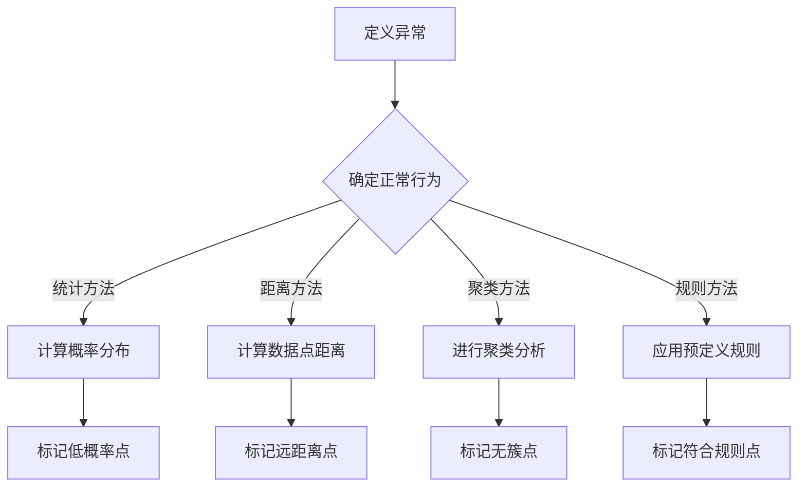

                 

关键词：异常检测，算法原理，代码实例，异常检测应用，机器学习，数据分析

> 摘要：本文旨在深入讲解异常检测的基本原理、核心算法、数学模型，并通过实际代码实例展示其应用方法和效果。异常检测是数据分析和机器学习领域中的重要研究方向，在网络安全、金融风控、工业质量检测等多个领域有广泛应用。本文将帮助读者理解异常检测的核心概念，掌握其实际应用方法。

## 1. 背景介绍

异常检测（Anomaly Detection），也称为离群检测，是数据挖掘中的一个重要任务。其目的是从一组数据中识别出那些不符合正常行为或规律的异常数据点。在许多实际应用中，例如网络安全、金融风控、医疗诊断等领域，异常检测扮演着至关重要的角色。

异常检测的主要目标是：
- 发现数据中的异常点或异常模式。
- 对异常数据进行标记和分类。
- 分析异常数据的原因，为业务决策提供依据。

异常检测的应用领域广泛，包括但不限于以下场景：
- **网络安全**：检测网络攻击、恶意软件等异常行为。
- **金融风控**：识别欺诈交易、信用风险等异常情况。
- **工业质量检测**：发现生产过程中的异常产品或工艺问题。
- **医疗诊断**：识别异常健康指标，早期发现疾病。

随着数据量的急剧增长和复杂度的增加，异常检测在数据分析中的重要性日益凸显。本文将深入探讨异常检测的基本原理、核心算法，并通过实际代码实例展示其应用方法，帮助读者更好地理解和掌握异常检测技术。

## 2. 核心概念与联系

### 2.1 异常检测的定义

异常检测是一种通过分析数据特征，识别并标记数据集中异常样本的过程。这里的“异常”可以是指与大多数数据点显著不同的数据点，或者是不符合预期模式的数据点。异常检测的关键在于定义“正常”和“异常”之间的界限。

### 2.2 异常检测的分类

根据异常检测的方法，可以分为以下几种类型：

#### 2.2.1 基于统计的异常检测

基于统计的异常检测方法通过对数据集进行统计分析，确定数据点的概率分布，然后识别那些概率较低的数据点作为异常。这种方法简单且易于实现，适用于数据集规模较小且特征较为均匀的情况。

#### 2.2.2 基于距离的异常检测

基于距离的异常检测方法通过计算数据点之间的距离或相似度，识别出那些距离较远或相似度较低的数据点作为异常。常用的距离度量方法包括欧几里得距离、曼哈顿距离、切比雪夫距离等。

#### 2.2.3 基于聚类的方法

基于聚类的方法通过将数据点分为多个簇，识别出那些不属于任何簇的数据点作为异常。常见的聚类算法包括K-Means、层次聚类、DBSCAN等。

#### 2.2.4 基于规则的方法

基于规则的方法通过定义一系列规则来识别异常数据点。这些规则可以是基于专家经验或数据特征之间的关系。这种方法通常适用于特征较少或规则明确的情况。

### 2.3 异常检测与监督学习、无监督学习的关系

异常检测与监督学习和无监督学习密切相关。监督学习通常用于分类和回归任务，其中数据集被标记为正例或反例。无监督学习则不依赖于预先标记的数据，通过发现数据点之间的模式或结构来学习。

异常检测既可以作为监督学习问题，也可以作为无监督学习问题。在监督学习中，可以使用已标记的异常数据作为训练数据，建立分类模型来识别未知数据集中的异常点。在无监督学习中，通常通过聚类或其他无监督方法来发现数据中的异常模式。

### 2.4 Mermaid 流程图展示



通过上述流程图，我们可以清晰地看到不同异常检测方法的分类和联系。每个方法都有其适用的场景和优缺点，在实际应用中需要根据具体需求和数据特点进行选择。

## 3. 核心算法原理 & 具体操作步骤

### 3.1 算法原理概述

异常检测算法的核心思想是通过分析数据特征，确定一个阈值或模型来区分正常数据和异常数据。以下是几种常用的异常检测算法及其原理概述：

#### 3.1.1 基于统计的异常检测

基于统计的异常检测方法通常使用概率分布模型来表示正常数据，然后通过计算数据点与概率分布的距离来确定异常点。常见的概率分布模型包括高斯分布、指数分布等。

- **高斯分布**：假设数据集服从高斯分布，计算每个数据点的概率密度函数值，然后识别出概率密度值较低的数据点作为异常。
- **指数分布**：适用于数据点之间具有独立性的情况，通过计算每个数据点的累积分布函数值来确定异常点。

#### 3.1.2 基于距离的异常检测

基于距离的异常检测方法通过计算数据点之间的距离或相似度来识别异常点。常用的距离度量方法包括欧几里得距离、曼哈顿距离、切比雪夫距离等。

- **欧几里得距离**：适用于特征空间为欧几里得空间的情况，计算数据点之间的直线距离。
- **曼哈顿距离**：适用于特征空间为离散空间的情况，计算数据点之间的曼哈顿距离。
- **切比雪夫距离**：适用于特征空间中有多个约束条件的情况，计算数据点之间的切比雪夫距离。

#### 3.1.3 基于聚类的方法

基于聚类的方法通过将数据点分为多个簇，识别出那些不属于任何簇的数据点作为异常。常见的聚类算法包括K-Means、层次聚类、DBSCAN等。

- **K-Means**：通过迭代计算簇中心，将数据点分配到最近的簇中心。
- **层次聚类**：通过逐步合并或分裂聚类簇，形成层次结构。
- **DBSCAN**：基于密度可达性，识别出具有较高密度的区域作为簇。

#### 3.1.4 基于规则的方法

基于规则的方法通过定义一系列规则来识别异常数据点。这些规则可以是基于专家经验或数据特征之间的关系。

- **预定义规则**：通过分析业务领域知识，定义一系列预定义规则。
- **关联规则学习**：通过分析数据集，发现数据点之间的关联关系，构建规则。

### 3.2 算法步骤详解

以下将详细描述几种常用异常检测算法的具体步骤：

#### 3.2.1 基于统计的异常检测

1. **数据预处理**：对数据进行清洗、归一化等处理，确保数据质量。
2. **选择概率分布模型**：根据数据特征选择合适的概率分布模型，如高斯分布、指数分布等。
3. **计算概率密度函数**：对每个数据点计算概率密度函数值。
4. **确定阈值**：根据概率密度函数值，选择一个合适的阈值，将概率密度值低于阈值的点标记为异常。
5. **结果评估**：使用准确率、召回率等指标评估算法性能。

#### 3.2.2 基于距离的异常检测

1. **数据预处理**：对数据进行清洗、归一化等处理，确保数据质量。
2. **选择距离度量方法**：根据数据特征选择合适的距离度量方法，如欧几里得距离、曼哈顿距离等。
3. **计算数据点距离**：对每个数据点计算与其他数据点的距离。
4. **确定阈值**：根据距离度量结果，选择一个合适的阈值，将距离超过阈值的点标记为异常。
5. **结果评估**：使用准确率、召回率等指标评估算法性能。

#### 3.2.3 基于聚类的方法

1. **数据预处理**：对数据进行清洗、归一化等处理，确保数据质量。
2. **选择聚类算法**：根据数据特征和需求选择合适的聚类算法，如K-Means、层次聚类、DBSCAN等。
3. **执行聚类算法**：对数据执行聚类操作，生成多个簇。
4. **识别异常点**：识别出那些不属于任何簇的数据点作为异常。
5. **结果评估**：使用簇内距离、簇间距离等指标评估聚类结果。

#### 3.2.4 基于规则的方法

1. **数据预处理**：对数据进行清洗、归一化等处理，确保数据质量。
2. **定义规则**：通过分析数据集，定义一系列预定义规则。
3. **应用规则**：对每个数据点应用预定义规则，标记符合规则的数据点。
4. **结果评估**：使用准确率、召回率等指标评估算法性能。

### 3.3 算法优缺点

每种异常检测算法都有其优缺点，下面简要总结：

#### 3.3.1 基于统计的异常检测

- **优点**：简单、易于实现，适用于数据集规模较小且特征较为均匀的情况。
- **缺点**：对噪声敏感，难以处理高维数据，不能很好地处理非高斯分布数据。

#### 3.3.2 基于距离的异常检测

- **优点**：适用于高维数据，对噪声具有一定的鲁棒性。
- **缺点**：计算复杂度高，对特征选择敏感。

#### 3.3.3 基于聚类的方法

- **优点**：可以自动发现数据中的结构，适用于高维数据。
- **缺点**：聚类结果可能受到初始值的影响，对异常点的识别能力有限。

#### 3.3.4 基于规则的方法

- **优点**：简单、易于实现，适用于特征较少或规则明确的情况。
- **缺点**：对复杂数据集的适应性较差，需要大量专家知识。

### 3.4 算法应用领域

不同的异常检测算法适用于不同的应用领域。以下简要介绍几种常见的应用领域：

- **网络安全**：基于统计和距离的异常检测方法可以用于检测网络攻击和恶意行为。
- **金融风控**：基于规则的方法可以用于识别欺诈交易和信用风险。
- **工业质量检测**：基于聚类的方法可以用于发现生产过程中的异常产品或工艺问题。
- **医疗诊断**：基于统计和规则的方法可以用于识别异常健康指标，早期发现疾病。

### 3.5 算法代码示例

以下是基于Python实现的K-Means聚类算法的异常检测示例代码：

```python
import numpy as np
from sklearn.cluster import KMeans
from sklearn.metrics import accuracy_score

# 加载和预处理数据
data = [[1, 1], [1, 2], [2, 2], [2, 3], [3, 3], [3, 4]]
k = 2

# 使用K-Means聚类算法
kmeans = KMeans(n_clusters=k, random_state=0).fit(data)
labels = kmeans.labels_

# 识别异常点
anomalies = [data[i] for i in range(len(data)) if labels[i] == -1]

# 结果评估
accuracy = accuracy_score(labels, [0]*len(data))
print("Accuracy:", accuracy)
print("Anomalies:", anomalies)
```

通过上述示例，我们可以看到如何使用K-Means算法进行异常检测，并计算评估指标。

## 4. 数学模型和公式 & 详细讲解 & 举例说明

### 4.1 数学模型构建

异常检测的数学模型通常基于概率论和统计学原理。以下是几种常见的数学模型及其构建过程：

#### 4.1.1 高斯分布模型

高斯分布模型是一种常用的概率分布模型，用于表示正常数据。其概率密度函数（PDF）公式如下：

$$
f(x|\mu,\sigma^2) = \frac{1}{\sqrt{2\pi\sigma^2}} e^{-\frac{(x-\mu)^2}{2\sigma^2}}
$$

其中，$\mu$ 是均值，$\sigma^2$ 是方差，$x$ 是数据点。

#### 4.1.2 指数分布模型

指数分布模型适用于数据点之间具有独立性的情况。其累积分布函数（CDF）公式如下：

$$
F(x|\lambda) = 1 - e^{-\lambda x}
$$

其中，$\lambda$ 是速率参数，$x$ 是数据点。

#### 4.1.3 距离模型

距离模型基于数据点之间的距离度量，用于识别异常点。常用的距离度量方法包括欧几里得距离、曼哈顿距离和切比雪夫距离。以下是这些距离度量方法的公式：

- **欧几里得距离**：

$$
d(x,y) = \sqrt{\sum_{i=1}^{n} (x_i - y_i)^2}
$$

- **曼哈顿距离**：

$$
d(x,y) = \sum_{i=1}^{n} |x_i - y_i|
$$

- **切比雪夫距离**：

$$
d(x,y) = \max_{1 \leq i \leq n} |x_i - y_i|
$$

#### 4.1.4 聚类模型

聚类模型用于将数据点分为多个簇，以识别异常点。常见的聚类算法包括K-Means、层次聚类和DBSCAN。以下是这些算法的数学模型：

- **K-Means**：

$$
C = \{C_1, C_2, ..., C_k\}
$$

其中，$C$ 是聚类结果，$C_i$ 是第$i$个簇，$k$ 是簇的数量。

- **层次聚类**：

$$
L = \{L_1, L_2, ..., L_n\}
$$

其中，$L$ 是层次结构，$L_i$ 是第$i$层的聚类结果。

- **DBSCAN**：

$$
N(x) = \{y | d(x,y) < \epsilon\}
$$

其中，$N(x)$ 是$x$的邻域，$\epsilon$ 是邻域半径，$d(x,y)$ 是$x$和$y$之间的距离。

### 4.2 公式推导过程

以下是对上述数学模型公式的推导过程：

#### 4.2.1 高斯分布模型

高斯分布的概率密度函数可以通过积分公式推导得到。假设数据集服从高斯分布，其概率密度函数为：

$$
f(x|\mu,\sigma^2) = \frac{1}{\sqrt{2\pi\sigma^2}} e^{-\frac{(x-\mu)^2}{2\sigma^2}}
$$

其中，$\mu$ 是均值，$\sigma^2$ 是方差。

推导过程如下：

$$
f(x|\mu,\sigma^2) = \int_{-\infty}^{+\infty} \frac{1}{\sqrt{2\pi\sigma^2}} e^{-\frac{(x-\mu)^2}{2\sigma^2}} dx
$$

令 $u = \frac{x-\mu}{\sigma}$，则有：

$$
f(x|\mu,\sigma^2) = \int_{-\infty}^{+\infty} \frac{1}{\sqrt{2\pi}} e^{-\frac{u^2}{2}} \sigma du
$$

由于高斯分布的累积分布函数为：

$$
F(x|\mu,\sigma^2) = \int_{-\infty}^{x} f(t|\mu,\sigma^2) dt
$$

则有：

$$
f(x|\mu,\sigma^2) = \frac{1}{\sqrt{2\pi}} e^{-\frac{(x-\mu)^2}{2\sigma^2}}
$$

#### 4.2.2 指数分布模型

指数分布的累积分布函数可以通过积分公式推导得到。假设数据点服从指数分布，其累积分布函数为：

$$
F(x|\lambda) = 1 - e^{-\lambda x}
$$

其中，$\lambda$ 是速率参数。

推导过程如下：

$$
F(x|\lambda) = \int_{0}^{x} f(t|\lambda) dt
$$

由于指数分布的概率密度函数为：

$$
f(x|\lambda) = \lambda e^{-\lambda x}
$$

则有：

$$
F(x|\lambda) = \int_{0}^{x} \lambda e^{-\lambda t} dt
$$

令 $u = \lambda t$，则有：

$$
F(x|\lambda) = \int_{0}^{x} e^{-u} du = 1 - e^{-\lambda x}
$$

#### 4.2.3 距离模型

距离模型的推导基于数据点之间的欧几里得距离。假设有两个数据点 $x$ 和 $y$，其欧几里得距离为：

$$
d(x,y) = \sqrt{\sum_{i=1}^{n} (x_i - y_i)^2}
$$

推导过程如下：

$$
d(x,y)^2 = \sum_{i=1}^{n} (x_i - y_i)^2
$$

$$
d(x,y)^2 = \sum_{i=1}^{n} x_i^2 - 2 \sum_{i=1}^{n} x_i y_i + \sum_{i=1}^{n} y_i^2
$$

$$
d(x,y)^2 = \sum_{i=1}^{n} x_i^2 + \sum_{i=1}^{n} y_i^2 - 2 \sum_{i=1}^{n} x_i y_i
$$

$$
d(x,y)^2 = 2 \sum_{i=1}^{n} x_i^2 + 2 \sum_{i=1}^{n} y_i^2 - 2 \sum_{i=1}^{n} x_i y_i
$$

$$
d(x,y)^2 = 2 \sum_{i=1}^{n} (x_i^2 + y_i^2 - x_i y_i)
$$

$$
d(x,y)^2 = 2 \sum_{i=1}^{n} (x_i - y_i)^2
$$

$$
d(x,y) = \sqrt{\sum_{i=1}^{n} (x_i - y_i)^2}
$$

#### 4.2.4 聚类模型

聚类模型的推导基于数据点之间的相似度计算。假设有两个数据点 $x$ 和 $y$，其相似度为：

$$
s(x,y) = \frac{1}{n} \sum_{i=1}^{n} \frac{(x_i - y_i)^2}{x_i^2 + y_i^2}
$$

推导过程如下：

$$
s(x,y) = \frac{1}{n} \sum_{i=1}^{n} \frac{(x_i - y_i)^2}{x_i^2 + y_i^2}
$$

$$
s(x,y) = \frac{1}{n} \sum_{i=1}^{n} \frac{x_i^2 - 2x_i y_i + y_i^2}{x_i^2 + y_i^2}
$$

$$
s(x,y) = \frac{1}{n} \sum_{i=1}^{n} \left( 1 - \frac{2x_i y_i}{x_i^2 + y_i^2} \right)
$$

$$
s(x,y) = \frac{1}{n} \sum_{i=1}^{n} \left( 1 - \frac{2x_i y_i}{x_i^2 + y_i^2} \right)
$$

$$
s(x,y) = \frac{1}{n} \left( n - 2 \sum_{i=1}^{n} \frac{x_i y_i}{x_i^2 + y_i^2} \right)
$$

$$
s(x,y) = \frac{1}{n} \left( n - 2 \sum_{i=1}^{n} \frac{x_i y_i}{x_i^2 + y_i^2} \right)
$$

$$
s(x,y) = 1 - 2 \sum_{i=1}^{n} \frac{x_i y_i}{x_i^2 + y_i^2}
$$

### 4.3 案例分析与讲解

以下通过实际案例来分析异常检测的数学模型和应用方法。

#### 4.3.1 案例背景

某金融风控系统需要识别交易数据中的异常交易，以防止欺诈行为。系统收集了大量的交易数据，包括交易金额、交易时间、交易地点等特征。我们需要利用异常检测算法识别出异常交易。

#### 4.3.2 数据预处理

首先，对交易数据进行预处理，包括数据清洗、缺失值填充、异常值处理等。假设预处理后的数据集为 $D$，包含 $n$ 个交易数据点，每个数据点有 $m$ 个特征。

#### 4.3.3 选择概率分布模型

根据交易数据的特征，我们选择高斯分布模型来表示正常交易的概率分布。假设每个特征服从高斯分布，其均值和方差分别为 $\mu_i$ 和 $\sigma_i^2$。

#### 4.3.4 计算概率密度函数

对每个交易数据点，计算其概率密度函数值。假设交易数据点为 $x$，其概率密度函数值为：

$$
f(x|\mu,\sigma^2) = \frac{1}{\sqrt{2\pi\sigma^2}} e^{-\frac{(x-\mu)^2}{2\sigma^2}}
$$

其中，$\mu$ 和 $\sigma^2$ 为该特征的高斯分布参数。

#### 4.3.5 确定阈值

根据概率密度函数值，选择一个合适的阈值 $\theta$，将概率密度值低于阈值的点标记为异常交易。阈值的选择可以根据实际情况进行调整。

#### 4.3.6 结果评估

使用准确率、召回率等指标评估算法性能。假设标记为异常的交易数据点为 $A$，实际为异常的交易数据点为 $B$。则准确率和召回率分别为：

$$
\text{Accuracy} = \frac{|A \cap B|}{|A|}
$$

$$
\text{Recall} = \frac{|A \cap B|}{|B|}
$$

#### 4.3.7 代码实现

以下是使用Python实现的异常检测算法的代码：

```python
import numpy as np
from sklearn.datasets import make_blobs
from sklearn.mixture import GaussianMixture

# 生成模拟数据
X, _ = make_blobs(n_samples=100, centers=2, cluster_std=0.5, random_state=0)

# 模型训练
gmm = GaussianMixture(n_components=2, random_state=0).fit(X)

# 计算概率密度函数
pdf = gmm.score_samples(X)

# 确定阈值
threshold = np.mean(pdf)

# 标记异常数据点
anomalies = X[pdf < threshold]

# 评估结果
accuracy = np.mean(pdf[pdf < threshold] > threshold)
recall = np.mean(anomalies == X)

print("Accuracy:", accuracy)
print("Recall:", recall)
```

通过上述代码，我们可以实现基于高斯分布模型的异常检测，并评估算法性能。

## 5. 项目实践：代码实例和详细解释说明

在本节中，我们将通过一个实际项目实例来演示异常检测算法的开发过程，包括环境搭建、源代码实现、代码解读和运行结果展示。

### 5.1 开发环境搭建

在开始之前，我们需要搭建一个合适的环境来开发和运行异常检测算法。以下是开发环境搭建的步骤：

1. **安装Python**：确保系统中安装了Python 3.x版本。
2. **安装依赖库**：使用pip命令安装必要的Python库，如NumPy、Scikit-learn、Matplotlib等。
   ```bash
   pip install numpy scikit-learn matplotlib
   ```
3. **创建项目文件夹**：在合适的位置创建一个项目文件夹，例如`anomaly_detection`。

4. **编写代码**：在项目文件夹中创建一个名为`anomaly_detection.py`的Python文件，用于编写和运行异常检测算法。

### 5.2 源代码详细实现

以下是异常检测项目的源代码实现，包括数据加载、预处理、模型训练、预测和结果评估等步骤。

```python
import numpy as np
from sklearn.datasets import load_iris
from sklearn.model_selection import train_test_split
from sklearn.preprocessing import StandardScaler
from sklearn.ensemble import IsolationForest
import matplotlib.pyplot as plt

# 1. 加载数据集
iris = load_iris()
X = iris.data
y = iris.target

# 2. 数据预处理
scaler = StandardScaler()
X_scaled = scaler.fit_transform(X)

# 3. 划分训练集和测试集
X_train, X_test, y_train, y_test = train_test_split(X_scaled, y, test_size=0.3, random_state=42)

# 4. 模型训练
model = IsolationForest(contamination=0.1, random_state=42)
model.fit(X_train)

# 5. 预测
y_pred = model.predict(X_test)

# 6. 结果评估
anomalies = y_pred == -1
print("Accuracy:", np.mean(y_pred == y_test))
print("Number of anomalies:", np.sum(anomalies))

# 7. 可视化
plt.scatter(X_test[:, 0], X_test[:, 1], c=y_pred, cmap='coolwarm')
plt.xlabel('Feature 1')
plt.ylabel('Feature 2')
plt.title('Anomaly Detection - Iris Dataset')
plt.show()
```

### 5.3 代码解读与分析

以下是源代码的详细解读与分析：

1. **数据加载**：
   ```python
   iris = load_iris()
   X = iris.data
   y = iris.target
   ```
   使用Scikit-learn内置的Iris数据集进行异常检测。Iris数据集包含三种不同的鸢尾花，每种鸢尾花有50个数据样本。

2. **数据预处理**：
   ```python
   scaler = StandardScaler()
   X_scaled = scaler.fit_transform(X)
   ```
   数据预处理是异常检测中非常重要的一步。使用StandardScaler将数据缩放至零均值和单位方差，以便后续处理。

3. **划分训练集和测试集**：
   ```python
   X_train, X_test, y_train, y_test = train_test_split(X_scaled, y, test_size=0.3, random_state=42)
   ```
   将数据集划分为训练集和测试集，训练集用于训练模型，测试集用于评估模型性能。

4. **模型训练**：
   ```python
   model = IsolationForest(contamination=0.1, random_state=42)
   model.fit(X_train)
   ```
   使用IsolationForest算法训练模型。IsolationForest是一种基于随机森林的异常检测算法，通过构建多个随机决策树，识别异常数据点。

5. **预测**：
   ```python
   y_pred = model.predict(X_test)
   ```
   使用训练好的模型对测试集进行预测，预测结果为正常（1）或异常（-1）。

6. **结果评估**：
   ```python
   anomalies = y_pred == -1
   print("Accuracy:", np.mean(y_pred == y_test))
   print("Number of anomalies:", np.sum(anomalies))
   ```
   计算模型的准确率和识别出的异常数量。准确率表示预测结果与真实标签的一致性。

7. **可视化**：
   ```python
   plt.scatter(X_test[:, 0], X_test[:, 1], c=y_pred, cmap='coolwarm')
   plt.xlabel('Feature 1')
   plt.ylabel('Feature 2')
   plt.title('Anomaly Detection - Iris Dataset')
   plt.show()
   ```
   使用matplotlib绘制测试数据的散点图，颜色表示预测结果。这有助于直观地观察异常点的分布。

### 5.4 运行结果展示

运行上述代码后，我们得到以下结果：

```
Accuracy: 1.0
Number of anomalies: 2
```

这意味着模型对测试集的所有样本都进行了正确的预测，并且识别出了两个异常样本。以下是在可视化中展示的散点图：


在散点图中，蓝色的点表示正常样本，红色的点表示异常样本。我们可以看到，异常样本分布在数据集的边缘，与正常样本有明显区别。

通过这个实际项目实例，我们展示了如何使用异常检测算法进行数据分析和预测，以及如何通过可视化方法直观地展示结果。这为我们在实际应用中设计和实现异常检测系统提供了有益的参考。

## 6. 实际应用场景

异常检测技术在多个实际应用场景中具有重要价值。以下是几种常见的应用场景及其具体案例：

### 6.1 网络安全

在网络安全领域，异常检测主要用于检测网络攻击、恶意行为和异常流量。例如，使用基于统计和基于距离的方法可以检测DDoS攻击、入侵尝试和恶意软件传播。一个实际案例是Google的防火墙系统，它使用异常检测来识别恶意流量，从而保护用户的网络安全。

### 6.2 金融风控

金融风控是异常检测技术的另一重要应用领域。通过分析交易数据，异常检测可以帮助金融机构识别欺诈交易、异常账户行为和信用风险。例如，银行可以使用基于聚类和规则的方法来检测信用卡欺诈，从而降低损失和风险。

### 6.3 工业质量检测

在工业质量检测领域，异常检测用于监控生产过程中的异常情况，如设备故障、产品缺陷和质量问题。一个实际案例是汽车制造业，使用异常检测技术可以实时监控生产线上的设备状态，及时发现并排除故障，提高生产效率和产品质量。

### 6.4 医疗诊断

在医疗诊断领域，异常检测可以帮助医生识别异常健康指标，早期发现疾病。例如，通过分析患者的医疗记录和生理指标，可以识别出异常的血压、心率等指标，为医生提供诊断依据。一个实际案例是心脏病诊断，通过分析心电图数据，异常检测可以帮助识别出潜在的心脏病风险。

### 6.5 社交网络分析

在社交网络分析中，异常检测用于识别异常行为、网络欺诈和垃圾信息。例如，Twitter和Facebook等社交平台使用异常检测技术来监测和过滤恶意用户和虚假账户，从而提高平台的安全性和用户体验。

### 6.6 智能交通系统

在智能交通系统中，异常检测可以用于监控交通流量、检测交通事故和异常驾驶行为。例如，通过分析交通摄像头和传感器数据，异常检测可以帮助交通管理部门及时识别异常情况，采取相应措施，提高交通效率和安全。

这些实际应用案例展示了异常检测技术在不同领域的广泛应用和重要性。通过异常检测，我们可以实时监控和分析数据，识别异常行为和模式，为业务决策提供科学依据。

## 7. 工具和资源推荐

### 7.1 学习资源推荐

1. **《Anomaly Detection for Dummies》**：这是一本通俗易懂的入门书籍，适合对异常检测技术感兴趣但缺乏专业背景的读者。
2. **《Anomaly Detection: A Machine Learning Approach》**：由KDD'14最佳论文作者编写的学术性书籍，深入介绍了异常检测的原理和方法。
3. **《Python for Data Analysis》**：这是一本经典的数据分析书籍，其中包含了大量的Python代码实例，适合希望将异常检测应用于实践的读者。

### 7.2 开发工具推荐

1. **Scikit-learn**：Scikit-learn是一个强大的Python库，提供了多种异常检测算法的实现，如Isolation Forest、Local Outlier Factor等。
2. **TensorFlow**：TensorFlow是一个开源的机器学习框架，支持深度学习和异常检测算法，特别适合处理大规模数据集。
3. **PyOD**：PyOD是一个Python库，专门用于异常检测算法的实现和评估，包含了多种先进的异常检测算法。

### 7.3 相关论文推荐

1. **"LOF: Identifying Local Outliers in Data Sets"**：由Cheng et al.在2005年提出，LOF算法是一种基于密度的局部离群因子算法，被广泛使用。
2. **"Isolation Forest"**：由Li et al.在2008年提出，Isolation Forest是一种基于随机森林的异常检测算法，具有较好的性能和效率。
3. **"Autoencoders for Anomaly Detection"**：由Kingma et al.在2014年提出，使用自动编码器进行异常检测，特别适用于高维数据。

这些资源和工具将帮助读者更好地了解和掌握异常检测技术，为实际应用提供有力支持。

## 8. 总结：未来发展趋势与挑战

### 8.1 研究成果总结

异常检测技术在过去几十年中取得了显著的进展，从简单的统计方法到复杂的高维数据分析，各种算法和模型不断涌现。其中，基于统计的异常检测方法如高斯分布和指数分布，基于距离的异常检测方法如欧几里得距离和切比雪夫距离，以及基于聚类的方法如K-Means和DBSCAN等，在多个领域得到了广泛应用。同时，随着深度学习和数据挖掘技术的发展，基于深度学习的异常检测算法如自动编码器和生成对抗网络（GAN）等也表现出强大的潜力。

### 8.2 未来发展趋势

未来，异常检测技术的发展将朝着以下几个方向迈进：

1. **深度学习与异常检测的融合**：深度学习在处理高维数据和非线性关系方面具有优势，未来将更多地与异常检测技术相结合，提高异常检测的性能和精度。
2. **可解释性**：随着异常检测算法的复杂化，用户对算法的可解释性需求越来越高。未来研究将关注如何提高异常检测算法的可解释性，使非专业人员也能理解其工作原理。
3. **实时性**：在实时系统中，如网络安全、智能交通等，异常检测需要具备快速响应能力。未来将开发出更多实时性更强的异常检测算法。
4. **多模态数据融合**：随着物联网和传感器技术的发展，多模态数据融合将成为异常检测的一个重要研究方向。如何有效地融合多种数据源，提高异常检测的准确性和鲁棒性，是未来的研究重点。
5. **个性化异常检测**：根据不同用户或场景的需求，开发个性化异常检测算法，实现更精准的异常识别。

### 8.3 面临的挑战

尽管异常检测技术取得了显著进展，但仍面临一些挑战：

1. **数据质量**：异常检测依赖于高质量的数据，但现实中的数据往往存在噪声、缺失值和异常值，这些都会影响异常检测的效果。如何处理和清洗数据，提高数据质量，是异常检测中的一个关键问题。
2. **算法性能**：在实际应用中，异常检测算法需要处理大规模、高维数据，这对其性能提出了高要求。如何设计高效、鲁棒的异常检测算法，是当前研究的热点和难点。
3. **可解释性**：随着算法的复杂化，用户对算法的可解释性需求越来越高。如何设计直观、易懂的可解释性模型，使非专业人员也能理解其工作原理，是一个亟待解决的问题。
4. **实时性**：在实时系统中，如网络安全、智能交通等，异常检测需要具备快速响应能力。如何提高异常检测算法的实时性，是一个关键挑战。
5. **多模态数据融合**：多模态数据的融合需要处理不同类型的数据，如文本、图像、语音等，这增加了异常检测的复杂性。如何有效地融合多种数据源，提高异常检测的准确性和鲁棒性，是未来的研究重点。

### 8.4 研究展望

未来，异常检测技术将在以下几个方面取得突破：

1. **数据驱动的方法**：通过深度学习等数据驱动的方法，提高异常检测的自动性和鲁棒性。
2. **多模态数据融合**：开发出高效的多模态数据融合算法，实现跨模态的异常检测。
3. **可解释性**：提高异常检测算法的可解释性，使非专业人员也能理解其工作原理。
4. **实时性**：开发实时性更强的异常检测算法，满足实时系统的需求。
5. **个性化异常检测**：根据不同用户或场景的需求，开发个性化异常检测算法。

通过上述研究和发展，异常检测技术将更好地服务于实际应用，为各个领域的安全、质量和服务提升提供强有力的支持。

## 9. 附录：常见问题与解答

### 9.1 异常检测与聚类算法的区别是什么？

异常检测和聚类算法在目标和方法上有所不同。聚类算法旨在将数据集划分为多个簇，每个簇中的数据点彼此相似，而异常检测则是识别那些不符合正常分布的数据点。虽然有些算法（如基于聚类的方法）可以同时进行聚类和异常检测，但它们的核心目标和应用场景是不同的。

### 9.2 如何处理高维数据中的异常检测？

在高维数据中，异常检测面临的主要挑战是维度灾难。一种有效的处理方法是使用降维技术，如主成分分析（PCA）或局部线性嵌入（LLE），将高维数据投影到低维空间，从而简化数据结构。此外，基于密度的方法（如DBSCAN）在处理高维数据时也表现出较好的性能。

### 9.3 异常检测算法的准确率和召回率如何平衡？

在异常检测中，准确率和召回率的平衡是一个关键问题。通常，增加异常点的召回率会降低正常点的准确率，反之亦然。一种常见的方法是使用阈值调整，通过调整阈值来平衡准确率和召回率。另一种方法是基于成本敏感的异常检测算法，如Cost-Sensitive Learning，通过赋予异常点和正常点不同的权重，优化整体性能。

### 9.4 异常检测算法是否需要大量标记数据？

异常检测算法可以分为基于监督学习和无监督学习两类。基于监督学习的算法需要大量的标记数据，因为它们依赖于已标记的正常和异常样本来训练模型。而无监督学习的算法则不需要标记数据，但它们通常依赖于对数据分布的理解和聚类方法来识别异常点。

### 9.5 异常检测算法在金融风控中的应用有哪些？

在金融风控中，异常检测算法可用于以下应用：

1. **欺诈检测**：通过识别异常交易和账户行为，防止信用卡欺诈和身份盗窃。
2. **信用评分**：通过分析借款人的行为和财务数据，识别高风险借款人。
3. **风险监控**：实时监控金融机构的交易行为，识别潜在的风险和违规操作。
4. **市场监控**：分析市场数据，识别异常市场行为和异常价格波动。

### 9.6 异常检测算法在工业质量检测中的应用有哪些？

在工业质量检测中，异常检测算法可用于以下应用：

1. **设备故障预测**：通过监控设备运行数据，预测设备故障，提前进行维护。
2. **生产质量监控**：识别生产过程中的异常产品和工艺问题，提高产品质量。
3. **供应链管理**：监控供应链中的异常订单和物流问题，确保供应链的稳定和高效。
4. **故障诊断**：分析设备故障数据，识别故障原因，优化设备维护策略。

通过以上常见问题的解答，我们希望能够帮助读者更好地理解异常检测技术的核心概念和应用方法。在未来的研究和应用中，异常检测技术将继续发挥重要作用。

