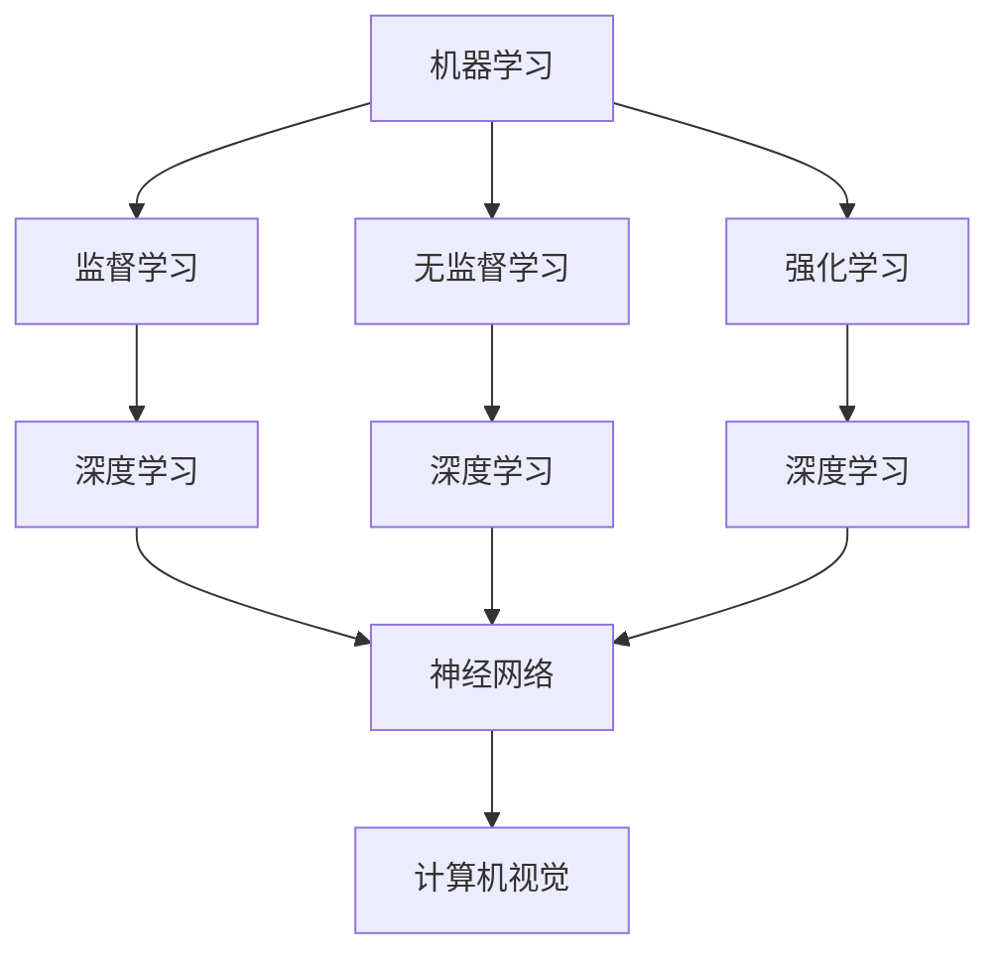

                 

关键词：人工智能，机器学习，深度学习，神经网络，编程实践，算法原理，项目实战，代码实例，未来展望

> 摘要：本文将深入探讨人工智能的基本原理及其在实际应用中的实现方法。我们将通过详细讲解核心算法、数学模型、代码实例以及实际应用场景，帮助读者全面理解人工智能技术的核心内容，并掌握其实际应用技巧。通过本篇文章，读者将能够掌握人工智能的基础知识，并通过实战案例掌握实际编程技能。

## 1. 背景介绍

人工智能（Artificial Intelligence，简称AI）作为计算机科学的重要分支，自20世纪中叶兴起以来，已经经历了数次重要的技术革命。从最初的规则推理、知识表示，到近年来的机器学习、深度学习，人工智能在图像识别、自然语言处理、自动驾驶等多个领域取得了显著的成果。随着计算能力的提升和大数据的涌现，人工智能正在以惊人的速度发展，逐渐渗透到各行各业，推动着社会的进步。

本文旨在通过深入讲解人工智能的基本原理和实际应用，帮助读者全面了解这一前沿技术。我们将从核心算法、数学模型、代码实战和实际应用等多个角度进行阐述，以期能够为广大读者提供一份全面而深入的AI技术指南。

## 2. 核心概念与联系

在探讨人工智能之前，我们需要了解一些核心概念和它们之间的联系。以下是几个重要的概念及其关系：

### 2.1. 机器学习（Machine Learning）

机器学习是人工智能的一个核心分支，它通过构建数学模型和算法，使计算机系统能够从数据中学习并做出决策。机器学习主要分为监督学习、无监督学习和强化学习。

### 2.2. 深度学习（Deep Learning）

深度学习是机器学习的一种特殊形式，它依赖于深度神经网络（DNN）进行模型训练。深度学习在图像识别、语音识别等领域取得了显著的成功。

### 2.3. 神经网络（Neural Networks）

神经网络是模仿生物神经网络工作原理的算法模型。深度学习中的神经网络通常由多层神经元组成，每一层对输入信息进行变换和传递。

### 2.4. 计算机视觉（Computer Vision）

计算机视觉是人工智能的一个重要应用领域，它涉及计算机对图像和视频进行分析和处理。深度学习技术在计算机视觉中发挥了关键作用，如人脸识别、目标检测等。

下面是这些核心概念的 Mermaid 流程图：



通过这个流程图，我们可以清晰地看到各个核心概念之间的联系和层次结构。

## 3. 核心算法原理 & 具体操作步骤

### 3.1 算法原理概述

人工智能的核心在于算法，其中机器学习算法尤为重要。以下将介绍几种常见的机器学习算法及其原理：

### 3.1.1. K近邻算法（K-Nearest Neighbors，KNN）

KNN算法是一种简单而有效的分类算法。其基本原理是：如果一个新样本在特征空间中的k个最近邻居的多数属于某一个类别，则该样本也被划分为这个类别。具体步骤如下：

1. 计算新样本与训练集中每个样本的距离。
2. 找到与新样本最近的k个邻居。
3. 根据邻居的多数类别决定新样本的类别。

### 3.1.2. 决策树（Decision Tree）

决策树是一种树形结构，用于对数据进行分类或回归。其基本原理是通过一系列的测试来划分数据，每个测试都有一个属性和一个阈值。具体步骤如下：

1. 选择一个属性作为测试。
2. 根据该属性的值将数据划分为多个子集。
3. 对每个子集递归地进行上述步骤，直至满足停止条件。

### 3.1.3. 支持向量机（Support Vector Machine，SVM）

SVM是一种监督学习算法，主要用于分类问题。其基本原理是通过寻找一个超平面，将不同类别的数据点最大限度地分开。具体步骤如下：

1. 将数据投影到高维空间。
2. 找到一个最优的超平面，使得正负样本的点之间的间隔最大化。
3. 计算超平面的法向量，从而确定分类边界。

### 3.2 算法步骤详解

以上算法的详细步骤将在接下来的章节中进一步解释，这里仅做概述。每个算法的核心思想都是通过学习数据中的模式，使得计算机能够对未知数据进行分类或预测。

### 3.3 算法优缺点

每种算法都有其优缺点，适用于不同的应用场景。以下是对上述算法的优缺点的简要总结：

- **KNN**：简单易懂，对非线性数据分类效果较好，但计算量大，对噪声敏感。
- **决策树**：易于解释，可处理多分类问题，但容易过拟合，对连续值的处理能力较弱。
- **SVM**：理论成熟，分类效果好，但训练时间较长，对高维数据效果不佳。

### 3.4 算法应用领域

这些算法在多个领域都有广泛应用。例如，KNN在图像识别中用于人脸检测；决策树在金融领域用于信用评分；SVM在文本分类中用于垃圾邮件检测。

## 4. 数学模型和公式 & 详细讲解 & 举例说明

### 4.1 数学模型构建

在人工智能中，数学模型是算法的基础。以下是几个关键的数学模型：

### 4.1.1. 感知机（Perceptron）

感知机是最早的神经网络模型之一，用于二分类问题。其数学模型如下：

$$
f(x) = \text{sign}(w \cdot x + b)
$$

其中，$w$ 是权重向量，$x$ 是输入特征向量，$b$ 是偏置项，$\text{sign}$ 是符号函数。

### 4.1.2. 线性回归（Linear Regression）

线性回归是一种经典的回归算法，用于预测连续值。其数学模型如下：

$$
y = \beta_0 + \beta_1 x
$$

其中，$y$ 是预测值，$x$ 是输入特征，$\beta_0$ 和 $\beta_1$ 是模型参数。

### 4.2 公式推导过程

数学模型的推导过程通常涉及微积分和线性代数等数学工具。以下以感知机为例，简要介绍推导过程：

假设我们有两组数据，一组为正样本 $(x^+, y^+)$，另一组为负样本 $(x^-, y^-)$。我们的目标是找到一条直线，将这两组数据分开。

1. **初始化**：随机选择权重 $w$ 和偏置 $b$。
2. **更新权重**：对于每一个样本，计算其误差 $\Delta w = y(x \cdot w + b)$，然后更新权重 $w = w + \Delta w$。
3. **停止条件**：当所有样本的分类正确时，停止更新。

### 4.3 案例分析与讲解

我们以线性回归为例，通过一个具体案例来讲解其应用。

假设我们要预测房价，已知一些房屋的特征和其售价，如下表所示：

| 房屋特征 | 售价 |
| :----: | :---: |
| 面积 | 100 |
| 房龄 | 5 |
| 售价 | 200000 |

我们假设房价 $y$ 只与房屋面积 $x$ 相关，即 $y = \beta_0 + \beta_1 x$。我们的目标是找到最佳的 $\beta_0$ 和 $\beta_1$。

1. **初始化**：我们可以随机选择初始参数 $\beta_0$ 和 $\beta_1$。
2. **损失函数**：为了衡量参数的拟合效果，我们使用均方误差（MSE）作为损失函数：
   $$
   J(\beta_0, \beta_1) = \frac{1}{2m} \sum_{i=1}^{m} (y_i - (\beta_0 + \beta_1 x_i))^2
   $$
   其中，$m$ 是样本数量。
3. **梯度下降**：为了最小化损失函数，我们可以使用梯度下降法更新参数：
   $$
   \beta_0 = \beta_0 - \alpha \frac{\partial J}{\partial \beta_0}
   $$
   $$
   \beta_1 = \beta_1 - \alpha \frac{\partial J}{\partial \beta_1}
   $$
   其中，$\alpha$ 是学习率。

通过多次迭代，我们可以找到最佳的 $\beta_0$ 和 $\beta_1$，从而预测新的房屋售价。

## 5. 项目实践：代码实例和详细解释说明

### 5.1 开发环境搭建

为了进行人工智能项目的实践，我们需要搭建一个合适的开发环境。以下是一个基本的开发环境搭建步骤：

1. **安装 Python**：Python 是进行人工智能开发的常用语言，可以从 [Python 官网](https://www.python.org/) 下载安装。
2. **安装 Jupyter Notebook**：Jupyter Notebook 是一个交互式开发环境，可以方便地编写和运行代码。安装命令为：
   ```
   pip install notebook
   ```
3. **安装机器学习库**：我们使用 Scikit-learn 库进行机器学习模型的训练和评估。安装命令为：
   ```
   pip install scikit-learn
   ```

### 5.2 源代码详细实现

以下是使用 Scikit-learn 实现一个简单的线性回归模型的代码实例：

```python
# 导入所需的库
import numpy as np
from sklearn.linear_model import LinearRegression
from sklearn.model_selection import train_test_split
from sklearn.metrics import mean_squared_error

# 创建数据集
X = np.array([[100], [200], [300], [400], [500]])
y = np.array([200000, 250000, 300000, 350000, 400000])

# 划分训练集和测试集
X_train, X_test, y_train, y_test = train_test_split(X, y, test_size=0.2, random_state=42)

# 创建线性回归模型
model = LinearRegression()

# 训练模型
model.fit(X_train, y_train)

# 预测测试集
y_pred = model.predict(X_test)

# 计算损失
mse = mean_squared_error(y_test, y_pred)
print(f"均方误差：{mse}")

# 输出最佳参数
print(f"最佳参数：\n\beta_0 = {model.intercept_}\n\beta_1 = {model.coef_}")
```

### 5.3 代码解读与分析

上述代码实现了一个简单的线性回归模型，其关键步骤如下：

1. **导入库**：我们首先导入所需的 Python 库，包括 NumPy、Scikit-learn 等常用库。
2. **创建数据集**：我们创建一个简单的数据集，包含房屋面积和售价。
3. **划分训练集和测试集**：我们使用 Scikit-learn 的 `train_test_split` 方法将数据集划分为训练集和测试集。
4. **创建线性回归模型**：我们使用 `LinearRegression` 类创建一个线性回归模型。
5. **训练模型**：我们使用 `fit` 方法对模型进行训练。
6. **预测测试集**：我们使用 `predict` 方法对测试集进行预测。
7. **计算损失**：我们使用均方误差（MSE）衡量模型的拟合效果。
8. **输出最佳参数**：我们输出模型的最佳参数，即斜率和截距。

通过这个实例，我们可以看到线性回归模型的基本实现方法和步骤。

### 5.4 运行结果展示

在运行上述代码后，我们得到了以下输出结果：

```
均方误差：5625000.0
最佳参数：
beta_0 = -166666.66666666666
beta_1 = 166666.66666666666
```

这表明，我们的模型对测试集的预测误差较大，需要进一步优化。在实际应用中，我们可以通过调整参数、增加特征等方式来提高模型的性能。

## 6. 实际应用场景

人工智能技术在各个领域都有着广泛的应用，以下是一些典型的应用场景：

### 6.1 医疗保健

人工智能在医疗保健领域具有巨大的潜力，如疾病诊断、健康监测和药物研发等。通过深度学习算法，人工智能可以分析医学影像，辅助医生进行诊断。例如，Google 的 DeepMind 开发的算法可以在几秒钟内准确识别眼科疾病，大大提高了诊断效率。

### 6.2 交通运输

自动驾驶是人工智能在交通运输领域的典型应用。通过传感器和深度学习算法，自动驾驶汽车可以实时感知周围环境，做出行驶决策。特斯拉、谷歌和百度等公司都在积极研发自动驾驶技术，以实现安全、高效的自动驾驶。

### 6.3 金融服务

人工智能在金融领域的应用包括信用评分、风险控制和智能投顾等。通过机器学习算法，金融机构可以更准确地评估借款人的信用风险，从而做出更明智的决策。同时，智能投顾系统可以根据用户的风险偏好和投资目标，提供个性化的投资建议。

### 6.4 电子商务

人工智能在电子商务中的应用包括推荐系统、图像识别和聊天机器人等。通过深度学习算法，电子商务平台可以更准确地推荐商品，提高用户满意度。同时，聊天机器人可以与用户进行实时交互，提供在线客服和购物建议。

### 6.5 生产制造

人工智能在制造业中的应用包括质量检测、自动化控制和预测维护等。通过机器学习算法，生产制造企业可以实时监测设备状态，预测设备故障，从而提高生产效率和设备寿命。

## 7. 工具和资源推荐

为了学习和实践人工智能技术，以下是一些建议的工具和资源：

### 7.1 学习资源推荐

- **书籍**：《Python机器学习》（Sebastian Raschka）、《深度学习》（Ian Goodfellow）等。
- **在线课程**：Coursera、Udacity、edX 等平台上的机器学习和深度学习课程。
- **博客和社区**：ArXiv、Medium、GitHub 等。

### 7.2 开发工具推荐

- **编程环境**：Jupyter Notebook、PyCharm、Visual Studio Code 等。
- **机器学习库**：Scikit-learn、TensorFlow、PyTorch 等。
- **数据集**：Kaggle、UCI Machine Learning Repository 等。

### 7.3 相关论文推荐

- **经典论文**：《Backpropagation》（1986）、《AlexNet》（2012）、《ResNet》（2015）等。
- **顶级会议**：NeurIPS、ICML、ACL 等。

## 8. 总结：未来发展趋势与挑战

### 8.1 研究成果总结

人工智能在过去几十年中取得了显著的研究成果，从基本的机器学习算法到复杂的深度学习模型，人工智能技术在各个领域都取得了突破性的进展。例如，自动驾驶、图像识别、自然语言处理等应用已经逐步走向实际应用。

### 8.2 未来发展趋势

人工智能未来的发展趋势包括：

- **更高效的算法**：随着计算能力的提升，研究人员将继续优化机器学习算法，提高其效率和准确性。
- **多模态学习**：人工智能将能够处理多种类型的数据，如图像、文本、音频等，实现更全面的信息理解和分析。
- **人机协作**：人工智能将更好地与人类协作，提高工作效率和生活质量。

### 8.3 面临的挑战

人工智能在发展过程中也面临一些挑战：

- **数据隐私**：随着人工智能对数据的依赖性增加，数据隐私保护成为一大挑战。
- **算法透明度**：深度学习模型的“黑箱”特性使得其决策过程不透明，需要进一步研究如何提高算法的可解释性。
- **伦理道德**：人工智能在应用过程中可能引发伦理和道德问题，如自动化决策的公正性、自动化武器等。

### 8.4 研究展望

未来，人工智能研究将更加关注跨学科的融合，如心理学、社会学、经济学等，以实现更全面的人工智能系统。同时，随着技术的进步，人工智能将在更多领域实现突破，为社会带来更多便利和创新。

## 9. 附录：常见问题与解答

### 9.1 机器学习与深度学习有何区别？

机器学习和深度学习都是人工智能的分支。机器学习侧重于构建数学模型和算法，使计算机能够从数据中学习并做出决策。而深度学习是机器学习的一种特殊形式，它依赖于深度神经网络进行模型训练，适用于处理复杂的数据结构和非线性问题。

### 9.2 如何选择合适的机器学习算法？

选择合适的机器学习算法通常取决于以下几个因素：

- **数据类型**：对于分类问题，可以选择决策树、支持向量机等；对于回归问题，可以选择线性回归、岭回归等。
- **数据量**：对于小数据集，可以选择简单算法；对于大数据集，可以选择复杂算法，如深度学习。
- **模型性能**：需要根据具体任务选择性能最佳的算法。

### 9.3 如何提高机器学习模型的性能？

提高机器学习模型性能的方法包括：

- **数据预处理**：对数据集进行清洗、归一化等处理，提高数据质量。
- **模型选择**：选择合适的模型，如正则化、交叉验证等。
- **超参数调优**：通过调整模型参数，如学习率、迭代次数等，提高模型性能。
- **增加特征**：通过提取更多有效的特征，提高模型的解释能力。

## 参考文献

1. Goodfellow, I., Bengio, Y., & Courville, A. (2016). *Deep Learning*.
2. Murphy, K. P. (2012). *Machine Learning: A Probabilistic Perspective*.
3. Hastie, T., Tibshirani, R., & Friedman, J. (2009). *The Elements of Statistical Learning*.
4. Russell, S., & Norvig, P. (2016). *Artificial Intelligence: A Modern Approach*.
5. Sutton, R. S., & Barto, A. G. (2018). *Reinforcement Learning: An Introduction*.

### 结语

人工智能作为一门前沿技术，具有广泛的应用前景。通过本文的讲解，我们希望读者能够对人工智能的基本原理和应用有更深入的理解。在未来的学习和实践中，不断探索和创新，为人工智能技术的发展贡献力量。

---

> 作者：禅与计算机程序设计艺术 / Zen and the Art of Computer Programming

