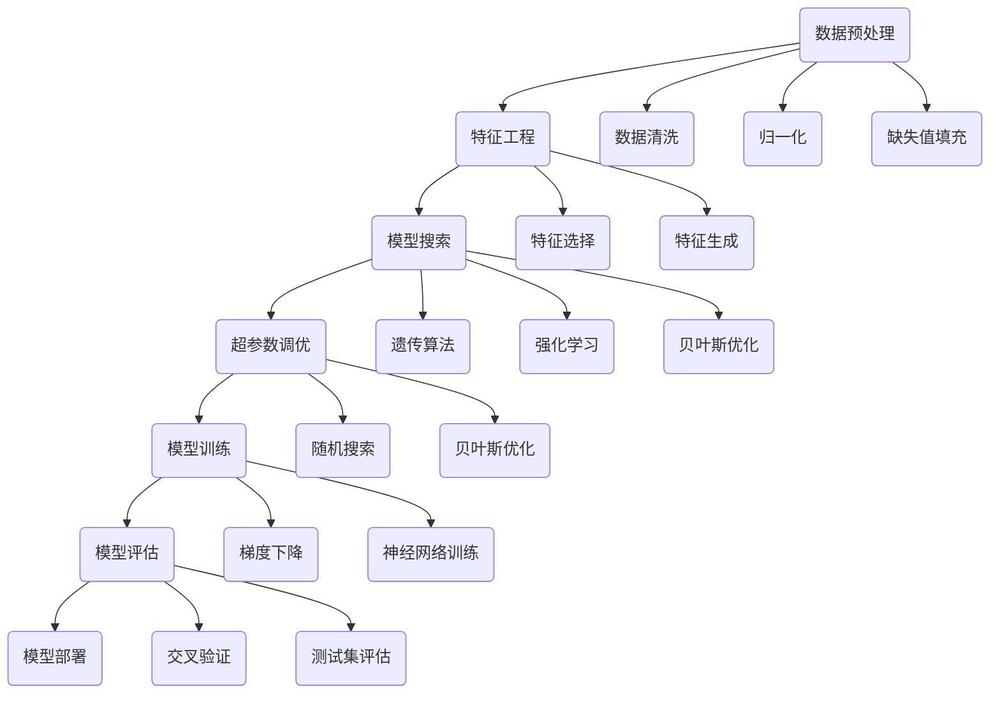

                 

关键词：自动化机器学习，模型优化，深度学习，算法改进，性能提升，应用前景

## 摘要

本文探讨了自动化机器学习（AutoML）在模型优化中的应用与前景。首先，我们介绍了AutoML的基本概念和背景，然后深入分析了AutoML在模型优化方面的核心算法原理、数学模型和公式，并通过具体的项目实践展示了其实现过程。接下来，我们探讨了AutoML在各个领域的实际应用场景，并对其未来发展趋势与挑战进行了展望。最后，我们推荐了相关学习资源、开发工具和论文，以帮助读者更好地了解和掌握AutoML技术。

## 1. 背景介绍

### 1.1 AutoML的起源与发展

自动化机器学习（AutoML）起源于深度学习和机器学习的快速发展。随着数据量的爆炸性增长，传统的手工特征工程和模型选择方法逐渐显得力不从心。为了解决这一问题，研究人员开始探索自动化模型优化方法，以提高模型的性能和效率。2012年，Google的论文《Large-scale Feature Learning for Text Classification using Unlabeled Data》首次提出了基于深度学习的无监督特征学习（Unsupervised Feature Learning）方法，为AutoML的发展奠定了基础。

随着技术的不断进步，AutoML领域逐渐形成了多个研究方向。例如，基于遗传算法、强化学习、贝叶斯优化等方法的自动化模型搜索，以及自动化特征选择、自动化超参数调优等技术。近年来，随着深度学习的兴起，AutoML在图像识别、自然语言处理、语音识别等领域的应用取得了显著成果。

### 1.2 AutoML的核心概念

自动化机器学习（AutoML）是指通过自动化工具和算法，自动完成从数据预处理、特征工程、模型选择、训练、评估到部署的全过程。其核心目标是简化机器学习流程，提高模型性能，降低技术门槛，使得更多非专业用户能够轻松应用机器学习技术。

AutoML的关键要素包括：

- **数据预处理**：自动处理原始数据，包括数据清洗、归一化、缺失值填充等。
- **特征工程**：自动生成或选择适合特定任务的输入特征，以提高模型性能。
- **模型搜索**：通过搜索算法（如遗传算法、强化学习等）自动寻找最优模型结构。
- **超参数调优**：自动调整模型的超参数，以达到最佳性能。
- **模型训练与评估**：自动训练和评估模型，选择最佳模型进行部署。

### 1.3 AutoML的重要性

随着数据量的增长和复杂性的提升，传统的手工机器学习流程已经无法满足需求。AutoML的出现，为解决这一问题提供了新的思路和工具。其主要优势包括：

- **提高效率**：自动完成繁琐的机器学习流程，大大缩短了模型开发周期。
- **提升性能**：通过自动化模型搜索和超参数调优，选择最优模型结构，提高模型性能。
- **降低门槛**：简化了机器学习流程，使得非专业用户也能轻松应用机器学习技术。
- **多样化应用**：适用于多种领域和任务，如图像识别、自然语言处理、推荐系统等。

总之，AutoML作为一种新兴技术，具有巨大的潜力和应用前景。在接下来的章节中，我们将深入探讨AutoML在模型优化方面的核心算法原理、数学模型和具体应用案例，以帮助读者更好地理解和掌握这项技术。

## 2. 核心概念与联系

### 2.1 AutoML的关键概念

在深入探讨AutoML之前，我们首先需要理解其核心概念，这些概念构成了AutoML技术的基础，也是实现模型优化的重要手段。

#### 数据预处理

数据预处理是AutoML流程的第一步，其目标是将原始数据转化为适合模型训练的形式。数据预处理包括数据清洗、归一化、缺失值填充等操作。这些操作对于保证模型训练质量和效果至关重要。

#### 特征工程

特征工程是AutoML中至关重要的一环，其目标是从原始数据中提取出对模型训练有价值的特征。特征工程的质量直接影响模型的性能和效率。AutoML通过自动化工具和算法来选择和生成特征，从而提高模型的泛化能力。

#### 模型搜索

模型搜索是AutoML的核心功能之一，其目标是自动寻找最优模型结构。模型搜索可以通过多种算法实现，如遗传算法、强化学习、贝叶斯优化等。这些算法通过对模型结构的搜索，找到最优的模型配置，从而提高模型的性能。

#### 超参数调优

超参数是影响模型性能的关键因素，如学习率、隐藏层神经元数量、批量大小等。超参数调优的目标是通过自动调整超参数，找到最优的超参数组合，从而提高模型的性能。超参数调优通常采用自动化算法，如随机搜索、贝叶斯优化等。

#### 模型训练与评估

模型训练与评估是AutoML流程的最后一步，其目标是训练出高质量的模型，并进行性能评估。模型训练过程中，通过不断调整模型参数，优化模型结构，提高模型的准确性、效率和泛化能力。评估过程中，通过交叉验证、测试集评估等方法，确定模型的最终性能。

### 2.2 AutoML的架构

为了更好地理解AutoML的工作原理，我们通过Mermaid流程图来展示其核心架构和流程。



### 2.3 AutoML与深度学习的联系

深度学习是AutoML应用的重要领域之一。深度学习通过多层神经网络对大量数据自动学习特征表示，从而实现复杂的预测任务。深度学习的特点在于其高度的非线性能力和强大的特征学习能力，使得在许多领域（如图像识别、自然语言处理等）取得了显著的成果。

AutoML与深度学习的联系主要体现在以下几个方面：

- **自动特征工程**：深度学习模型能够自动提取和生成高层次的抽象特征，减轻了手工特征工程的工作负担。
- **模型搜索与调优**：深度学习模型结构复杂，参数众多，AutoML技术能够通过自动化算法快速找到最优模型结构。
- **超参数优化**：深度学习模型通常需要大量的超参数调整，AutoML技术能够通过自动化算法实现高效的超参数优化。

总之，AutoML与深度学习相辅相成，共同推动着机器学习技术的发展和应用。在接下来的章节中，我们将深入探讨AutoML在模型优化方面的具体实现方法和应用案例。

### 2.4 AutoML的核心算法原理

在了解了AutoML的核心概念和架构之后，我们接下来将深入探讨其核心算法原理。这些算法原理是实现AutoML技术的基础，也是实现模型优化的重要手段。

#### 遗传算法

遗传算法是一种基于自然选择和遗传学的优化算法，广泛应用于组合优化和函数优化问题。遗传算法的基本思想是通过模拟生物进化过程，不断迭代优化解空间中的解，从而找到最优解。

在AutoML中，遗传算法可用于模型搜索和超参数调优。具体步骤如下：

1. **初始化种群**：随机生成初始种群，种群中的每个个体代表一种模型配置或超参数组合。
2. **适应度评估**：对每个个体进行评估，计算其适应度值。适应度值通常基于模型的性能指标，如准确率、召回率等。
3. **选择**：根据适应度值选择优秀个体，形成新的种群。选择过程可以采用轮盘赌、锦标赛等方法。
4. **交叉**：对选择的个体进行交叉操作，生成新的个体。交叉操作类似于生物进化的繁殖过程，通过组合优秀个体的基因，产生新的个体。
5. **变异**：对交叉后的个体进行变异操作，引入新的基因。变异操作有助于探索解空间，防止算法陷入局部最优。
6. **迭代**：重复步骤2-5，直到满足终止条件（如达到最大迭代次数或找到满意解）。

#### 强化学习

强化学习是一种基于反馈和决策的优化算法，广泛应用于控制、规划、推荐系统等领域。强化学习的基本思想是通过与环境交互，不断学习最优策略，从而实现目标。

在AutoML中，强化学习可用于模型搜索和超参数调优。具体步骤如下：

1. **初始化环境**：定义环境状态空间和动作空间。环境状态通常包括模型配置、超参数等。
2. **选择动作**：基于当前状态，选择一个动作。动作可以是模型的某种配置或超参数组合。
3. **执行动作**：将选择的动作应用于环境中，生成新的状态。
4. **评估奖励**：计算新状态的奖励值。奖励值通常基于模型在测试集上的性能指标。
5. **更新策略**：根据奖励值更新策略，选择下一步的动作。策略更新可以通过价值函数或策略迭代等方法实现。
6. **迭代**：重复步骤2-5，直到满足终止条件（如达到最大迭代次数或找到满意解）。

#### 贝叶斯优化

贝叶斯优化是一种基于贝叶斯理论的优化算法，广泛应用于函数优化和超参数调优问题。贝叶斯优化通过构建概率模型，估计目标函数的值，并基于概率模型进行优化。

在AutoML中，贝叶斯优化可用于超参数调优。具体步骤如下：

1. **初始化模型**：选择一个初始模型，初始化超参数。
2. **构建概率模型**：根据训练数据，构建目标函数的概率模型。概率模型可以采用高斯过程、贝叶斯网络等方法。
3. **采样**：根据概率模型，选择新的超参数样本。
4. **评估**：将新的超参数样本应用于模型，计算目标函数的值。
5. **更新模型**：根据新的超参数样本和目标函数值，更新概率模型。
6. **迭代**：重复步骤3-5，直到满足终止条件（如达到最大迭代次数或找到满意解）。

这些算法在AutoML中的应用，使得模型优化过程更加高效和智能化。在接下来的章节中，我们将通过具体案例和实践，展示AutoML在实际应用中的实现过程和效果。

### 2.5 AutoML的具体操作步骤

为了更好地理解AutoML的实践过程，我们将在这一节中详细描述其具体操作步骤。这些步骤涵盖了从数据预处理到模型评估的整个过程，旨在帮助读者全面了解AutoML的应用流程。

#### 步骤 1：数据预处理

数据预处理是AutoML流程的第一步，其目标是清洗和整理原始数据，使其适合后续的模型训练。以下是数据预处理的主要步骤：

1. **数据清洗**：处理数据中的噪声和异常值，删除重复数据或填充缺失值。这一步可以通过Pandas、NumPy等库实现。
2. **数据归一化**：将数据缩放到一个统一的范围，如[0, 1]或[-1, 1]，以消除数据尺度对模型训练的影响。常用的归一化方法包括最小-最大归一化和Z-Score归一化。
3. **特征选择**：从原始数据中提取对模型训练有价值的特征。特征选择可以通过统计分析、主成分分析（PCA）等方法实现。
4. **数据分割**：将数据集划分为训练集、验证集和测试集，用于模型的训练、验证和测试。

以下是一个简单的Python代码示例，用于数据预处理：

```python
import pandas as pd
from sklearn.model_selection import train_test_split
from sklearn.preprocessing import MinMaxScaler, StandardScaler

# 加载数据
data = pd.read_csv('data.csv')

# 数据清洗
data.drop_duplicates(inplace=True)
data.fillna(method='ffill', inplace=True)

# 数据归一化
scaler = MinMaxScaler()
data_normalized = scaler.fit_transform(data)

# 特征选择
selected_features = data_normalized[:, :-1]
target = data_normalized[:, -1]

# 数据分割
X_train, X_test, y_train, y_test = train_test_split(selected_features, target, test_size=0.2, random_state=42)
```

#### 步骤 2：模型选择

在数据预处理完成后，我们需要选择一个适合任务的模型。AutoML可以通过自动化算法来搜索和选择最优模型。以下是模型选择的主要步骤：

1. **模型搜索**：使用自动化算法（如遗传算法、强化学习、贝叶斯优化等）搜索最优模型结构。这一步可以通过AutoKeras、H2O.ai等AutoML框架实现。
2. **模型评估**：对搜索到的模型进行评估，选择性能最优的模型。评估指标可以包括准确率、召回率、F1分数等。
3. **模型训练**：使用训练集对所选模型进行训练，优化模型参数。

以下是一个简单的Python代码示例，用于模型选择和训练：

```python
from autokeras import AutoKerasClassifier

# 创建AutoML分类器
auto_learner = AutoKerasClassifier()

# 训练模型
auto_learner.fit(X_train, y_train, epochs=10, validation_data=(X_test, y_test))

# 评估模型
accuracy = auto_learner.evaluate(X_test, y_test)
print('Test accuracy:', accuracy)
```

#### 步骤 3：超参数调优

超参数是影响模型性能的关键因素，如学习率、隐藏层神经元数量、批量大小等。超参数调优的目标是通过自动化算法找到最优的超参数组合。以下是超参数调优的主要步骤：

1. **初始化超参数范围**：定义超参数的初始范围，如学习率的取值范围、隐藏层神经元数量的范围等。
2. **超参数搜索**：使用自动化算法（如随机搜索、贝叶斯优化等）搜索最优超参数组合。这一步可以通过Hyperopt、Scikit-Optimize等库实现。
3. **模型评估**：使用训练集和验证集评估超参数组合的性能，选择最优的超参数组合。

以下是一个简单的Python代码示例，用于超参数调优：

```python
from skopt import BayesSearchCV
from sklearn.model_selection import GridSearchCV

# 定义超参数范围
param_grid = {
    'n_estimators': (10, 100),
    'max_depth': (3, 10),
    'min_samples_split': (2, 10),
    'min_samples_leaf': (1, 5),
}

# 创建超参数搜索器
searcher = BayesSearchCV(estimator=RandomForestClassifier(), param_grid=param_grid, n_iter=10, cv=3)

# 搜索最优超参数
searcher.fit(X_train, y_train)

# 获取最优超参数
best_params = searcher.best_params_
print('Best parameters:', best_params)

# 使用最优超参数训练模型
model = RandomForestClassifier(**best_params)
model.fit(X_train, y_train)

# 评估模型
accuracy = model.evaluate(X_test, y_test)
print('Test accuracy:', accuracy)
```

#### 步骤 4：模型评估

模型评估是AutoML流程的最后一步，其目标是验证模型的性能和泛化能力。以下是模型评估的主要步骤：

1. **交叉验证**：使用交叉验证方法（如K折交叉验证）对模型进行评估，以防止过拟合。
2. **测试集评估**：使用测试集对模型进行最终评估，以确定模型的实际性能。
3. **性能指标**：根据任务类型，选择合适的性能指标（如准确率、召回率、F1分数等）进行评估。

以下是一个简单的Python代码示例，用于模型评估：

```python
from sklearn.model_selection import cross_val_score

# 进行交叉验证
scores = cross_val_score(model, X_train, y_train, cv=5)
print('Cross-validated scores:', scores)

# 计算平均准确率
average_accuracy = scores.mean()
print('Average accuracy:', average_accuracy)

# 使用测试集评估模型
accuracy = model.evaluate(X_test, y_test)
print('Test accuracy:', accuracy)
```

通过以上步骤，我们完成了AutoML的基本操作流程。在实际应用中，根据具体任务的需求，可以进一步调整和优化这些步骤，以实现最佳的效果。

#### 步骤 5：模型部署

模型部署是将训练好的模型应用到实际场景中的过程。以下是模型部署的主要步骤：

1. **模型保存**：将训练好的模型保存为文件，以便后续加载和使用。可以使用Python的pickle模块或HDF5等格式保存模型。
2. **模型加载**：从文件中加载模型，以便进行预测或进一步训练。
3. **在线预测**：将模型部署到服务器或云端，以便用户可以随时进行预测。
4. **接口设计**：设计API接口，以便用户可以方便地调用模型进行预测。

以下是一个简单的Python代码示例，用于模型部署：

```python
import joblib

# 保存模型
joblib.dump(model, 'model.pkl')

# 加载模型
loaded_model = joblib.load('model.pkl')

# 定义预测接口
def predict(input_data):
    return loaded_model.predict(input_data)

# 测试预测接口
input_data = X_test
predictions = predict(input_data)
print('Predictions:', predictions)
```

通过以上步骤，我们完成了AutoML的模型部署。在实际应用中，根据具体场景的需求，可以进一步优化和扩展模型部署过程。

通过以上详细描述，我们全面了解了AutoML的具体操作步骤。在实际应用中，根据具体任务的需求，可以灵活调整和优化这些步骤，以实现最佳的效果。在下一节中，我们将探讨AutoML在实际应用领域中的具体案例和实践，以进一步展示其应用价值。

## 3. 算法优缺点

在了解了AutoML的核心算法原理和具体操作步骤之后，我们接下来将探讨这些算法的优缺点。通过分析其优点和不足，我们可以更好地理解AutoML在实际应用中的表现和局限性。

### 3.1 优点

#### 提高效率

AutoML通过自动化算法和工具，大大提高了模型优化和训练的效率。传统的手工特征工程和模型选择方法需要大量时间和人力，而AutoML能够自动完成这些繁琐的任务，使得模型开发周期大大缩短。

#### 提升性能

AutoML通过自动化搜索和超参数调优，能够找到最优的模型结构和超参数组合，从而提高模型的性能。这有助于在有限的时间和资源内，实现更好的预测效果。

#### 降低门槛

AutoML简化了机器学习流程，使得非专业用户也能够轻松应用机器学习技术。通过提供可视化的界面和简单的操作流程，AutoML降低了技术门槛，使得更多人能够参与到机器学习项目中。

#### 多样化应用

AutoML适用于多种领域和任务，如图像识别、自然语言处理、推荐系统等。通过自动化模型搜索和调优，AutoML能够快速适应不同领域的需求，提高模型的应用价值。

### 3.2 缺点

#### 计算资源消耗

AutoML需要大量的计算资源和时间来完成模型搜索和超参数调优。特别是在大规模数据集和高复杂度的模型中，计算资源的需求更为突出。这可能导致AutoML在某些场景下难以实现实时预测。

#### 数据依赖性

AutoML的性能和效果高度依赖于数据质量和特征选择。如果数据质量较差或特征选择不当，可能导致AutoML的性能下降。因此，在应用AutoML之前，需要对数据进行充分处理和特征选择。

#### 结果解释性

AutoML模型通常是由复杂算法和多层神经网络构成的，这可能导致模型的结果解释性较差。在需要结果解释性较高的场景中，如医疗诊断、金融风控等，AutoML的适用性受到一定限制。

#### 算法选择

AutoML算法的选择和组合对模型性能有重要影响。不同的算法适用于不同的场景和任务，需要根据具体需求进行选择和组合。这增加了AutoML的实施难度和复杂性。

### 3.3 综合评价

总体来说，AutoML作为一种新兴技术，具有显著的优点和潜力。它通过自动化模型优化和超参数调优，提高了模型性能和开发效率，降低了技术门槛，适用于多种领域和任务。然而，AutoML也存在一些局限性，如计算资源消耗、数据依赖性、结果解释性等。在实际应用中，需要根据具体需求和场景，综合考虑这些因素，选择合适的AutoML解决方案。

通过以上分析，我们可以更好地理解AutoML的优势和不足，为其在实际应用中的推广和应用提供指导。在下一节中，我们将进一步探讨AutoML在不同领域的应用场景，展示其在实际应用中的价值。

### 3.4 算法应用领域

自动化机器学习（AutoML）在多个领域展现出了其独特的优势和应用价值。以下是一些主要的领域和应用场景，我们将逐一探讨其具体的应用实例。

#### 3.4.1 图像识别

图像识别是AutoML的重要应用领域之一。在计算机视觉任务中，如人脸识别、图像分类、物体检测等，AutoML通过自动化模型搜索和特征工程，能够显著提升模型性能。例如，在人脸识别任务中，AutoML可以自动选择和优化模型结构，调整超参数，以实现更准确的识别效果。

应用实例：谷歌的AutoML Vision是一款面向图像识别任务的AutoML工具，用户只需上传图像数据，即可自动完成模型训练、评估和部署。该工具已经在医疗图像分析、安防监控等多个领域取得了显著的应用成果。

#### 3.4.2 自然语言处理

自然语言处理（NLP）是另一个AutoML应用广泛的领域。在文本分类、情感分析、机器翻译等任务中，AutoML通过自动化特征提取和模型优化，提高了模型的准确性和效率。例如，在文本分类任务中，AutoML可以自动选择和生成对分类任务有价值的特征，调整模型结构，实现更精确的分类结果。

应用实例：微软的Azure AutoML提供了针对NLP任务的自动化解决方案。用户只需上传文本数据，即可自动完成特征提取、模型训练和评估。该工具已经在社交媒体情感分析、客户服务聊天机器人等场景中得到了广泛应用。

#### 3.4.3 语音识别

语音识别是AutoML在语音处理领域的应用。通过自动化模型搜索和超参数调优，AutoML能够提升语音识别系统的准确性和鲁棒性。在语音识别任务中，AutoML可以自动选择和优化模型结构，调整超参数，以实现更准确的语音识别效果。

应用实例：谷歌的AutoML Speech是一款面向语音识别任务的自动化工具。用户只需上传音频数据，即可自动完成模型训练、评估和部署。该工具已经在智能客服、语音助手等场景中得到了广泛应用。

#### 3.4.4 推荐系统

推荐系统是AutoML在数据挖掘和机器学习领域的重要应用。通过自动化特征工程和模型优化，AutoML能够提升推荐系统的准确性和响应速度。在推荐系统中，AutoML可以自动选择和生成对推荐任务有价值的特征，优化模型结构，提高推荐效果。

应用实例：亚马逊的AutoML Recommender是一款面向推荐系统的自动化工具。用户只需上传用户和商品数据，即可自动完成模型训练、评估和部署。该工具已经在电子商务、在线广告等多个场景中得到了广泛应用。

#### 3.4.5 金融风控

金融风控是AutoML在金融领域的重要应用。通过自动化模型优化和超参数调优，AutoML能够提升金融风险管理的准确性和效率。在金融风控任务中，AutoML可以自动选择和优化模型结构，调整超参数，实现更精确的风险评估和预测。

应用实例：平安银行的AutoML风控系统是一款面向金融风控任务的自动化工具。该系统通过自动化模型搜索和超参数调优，实现了对贷款申请者的信用风险评估。该系统已经在平安银行的风险管理中发挥了重要作用。

#### 3.4.6 医疗诊断

医疗诊断是AutoML在医疗领域的重要应用。通过自动化模型搜索和特征工程，AutoML能够提升医疗诊断的准确性和效率。在医疗诊断任务中，AutoML可以自动选择和生成对诊断任务有价值的特征，优化模型结构，实现更准确的诊断结果。

应用实例：IBM的Watson for Health是一款面向医疗诊断的AutoML工具。该工具通过自动化模型搜索和特征工程，实现了对医学图像的自动诊断。该工具已经在多个医疗机构中得到了广泛应用，为医生提供了有力的诊断辅助工具。

#### 3.4.7 自动驾驶

自动驾驶是AutoML在汽车领域的重要应用。通过自动化模型优化和特征工程，AutoML能够提升自动驾驶系统的准确性和安全性。在自动驾驶任务中，AutoML可以自动选择和优化模型结构，调整超参数，实现更精确的物体检测和路径规划。

应用实例：特斯拉的自动驾驶系统采用了AutoML技术。通过自动化模型搜索和超参数调优，特斯拉实现了对道路环境的实时感知和决策。该系统已经在特斯拉的自动驾驶汽车中得到了广泛应用，为用户提供了安全、便捷的驾驶体验。

综上所述，AutoML在多个领域展现出了其独特的应用价值。通过自动化模型搜索和特征工程，AutoML能够显著提升模型性能和效率，降低技术门槛，推动各个领域的智能化发展。随着AutoML技术的不断进步，我们期待其在更多领域的应用，为人类带来更多便利和效益。

## 4. 数学模型和公式

在深入探讨自动化机器学习（AutoML）时，数学模型和公式是理解其工作原理的关键。这些模型和公式不仅帮助我们解释AutoML的核心机制，也为优化模型提供了理论基础。以下内容将详细介绍AutoML中的数学模型和公式，并通过实际案例进行讲解。

### 4.1 数学模型构建

在AutoML中，数学模型构建通常涉及以下几个关键步骤：

1. **特征表示**：将原始数据转换为适合模型训练的表示形式。这包括归一化、标准化和特征提取等步骤。
2. **模型架构**：定义模型的层次结构和连接方式。例如，在深度学习中，神经网络的结构通常由多层感知器（MLP）、卷积神经网络（CNN）或循环神经网络（RNN）等组成。
3. **损失函数**：定义模型预测值与真实值之间的差异。常见的损失函数包括均方误差（MSE）、交叉熵损失（Cross-Entropy Loss）等。
4. **优化算法**：选择用于优化模型参数的算法，如梯度下降（Gradient Descent）、Adam优化器等。

以下是一个简单的线性回归模型构建过程：

```latex
\text{特征表示：} \\
x \in \mathbb{R}^n \\
y = \beta_0 + \beta_1x + \epsilon
```

其中，$x$ 是输入特征，$y$ 是输出标签，$\beta_0$ 和 $\beta_1$ 是模型参数，$\epsilon$ 是误差项。

### 4.2 公式推导过程

在AutoML中，常用的数学公式包括：

1. **梯度下降公式**：
$$
\beta_{t+1} = \beta_{t} - \alpha \cdot \nabla_{\beta}J(\beta_t)
$$`

其中，$J(\beta_t)$ 是损失函数，$\alpha$ 是学习率，$\nabla_{\beta}J(\beta_t)$ 是损失函数关于参数 $\beta$ 的梯度。

2. **反向传播算法**：
在深度学习中，反向传播算法用于计算每个参数的梯度。其基本公式如下：

$$
\nabla_{\beta}J(\beta) = \sum_{i=1}^{n} \frac{\partial J(\beta)}{\partial \beta} \cdot \delta
$$`

其中，$\delta$ 是误差项，通常表示为：

$$
\delta = \frac{\partial L}{\partial z} \cdot \sigma'(z)
$$`

$L$ 是损失函数，$z$ 是神经网络的输出，$\sigma'$ 是激活函数的导数。

3. **卷积神经网络（CNN）中的卷积公式**：
在CNN中，卷积操作用于提取图像的特征。卷积公式如下：

$$
h_{ij}^l = \sum_{k=1}^{m} w_{ikj}^{l-1} \cdot a_{kj}^{l-1}
$$`

其中，$h_{ij}^l$ 是第$l$层的第$i$行第$j$列的输出，$w_{ikj}^{l-1}$ 是第$l-1$层的第$i$行第$k$列的权重，$a_{kj}^{l-1}$ 是第$l-1$层的第$k$列的输出，$m$ 是卷积核的大小。

### 4.3 案例分析与讲解

以下是一个简单的案例，展示如何使用AutoML进行模型优化。

#### 案例背景

假设我们要构建一个分类模型，用于判断一个新闻文章是否属于政治类别。数据集包含10000篇文章，每篇文章都有一个标签（0表示非政治，1表示政治）。我们使用Python中的Scikit-Learn库和Keras框架来实现AutoML模型。

#### 案例步骤

1. **数据预处理**：

```python
from sklearn.model_selection import train_test_split
from sklearn.feature_extraction.text import TfidfVectorizer

# 加载数据
X, y = load_data()

# 数据分割
X_train, X_test, y_train, y_test = train_test_split(X, y, test_size=0.2, random_state=42)

# 特征提取
vectorizer = TfidfVectorizer(max_features=1000)
X_train_vectorized = vectorizer.fit_transform(X_train)
X_test_vectorized = vectorizer.transform(X_test)
```

2. **模型构建**：

```python
from keras.models import Sequential
from keras.layers import Dense, Dropout
from keras.wrappers.scikit_learn import KerasClassifier

# 构建模型
model = Sequential()
model.add(Dense(512, input_dim=X_train_vectorized.shape[1], activation='relu'))
model.add(Dropout(0.5))
model.add(Dense(256, activation='relu'))
model.add(Dropout(0.5))
model.add(Dense(1, activation='sigmoid'))

# 编译模型
model.compile(loss='binary_crossentropy', optimizer='adam', metrics=['accuracy'])

# 训练模型
model.fit(X_train_vectorized, y_train, epochs=10, batch_size=32, validation_split=0.1)
```

3. **模型评估**：

```python
from sklearn.metrics import accuracy_score, classification_report

# 预测
y_pred = model.predict(X_test_vectorized)
y_pred = (y_pred > 0.5)

# 评估
accuracy = accuracy_score(y_test, y_pred)
print('Accuracy:', accuracy)
print(classification_report(y_test, y_pred))
```

4. **模型优化**：

```python
from keras.wrappers.scikit_learn import KerasClassifier
from sklearn.model_selection import GridSearchCV

# 定义模型
def create_model(optimizer='adam', dropout=0.0, batch_size=32):
    model = Sequential()
    model.add(Dense(512, input_dim=X_train_vectorized.shape[1], activation='relu'))
    model.add(Dropout(dropout))
    model.add(Dense(256, activation='relu'))
    model.add(Dropout(dropout))
    model.add(Dense(1, activation='sigmoid'))
    model.compile(loss='binary_crossentropy', optimizer=optimizer, metrics=['accuracy'])
    return model

# 创建模型
model = KerasClassifier(build_fn=create_model, verbose=0)

# 定义参数网格
param_grid = {
    'batch_size': [16, 32, 64],
    'dropout': [0.0, 0.2, 0.5],
    'optimizer': ['adam', 'rmsprop'],
}

# 搜索最优参数
grid = GridSearchCV(estimator=model, param_grid=param_grid, cv=3)
grid_result = grid.fit(X_train_vectorized, y_train)

# 输出最优参数
print("Best: %f using %s" % (grid_result.best_score_, grid_result.best_params_))
```

通过以上步骤，我们实现了AutoML的模型构建、训练和优化。在实际应用中，可以根据具体任务的需求，进一步调整和优化模型结构和超参数，以实现更好的性能。

综上所述，AutoML中的数学模型和公式是构建和优化模型的重要工具。通过理解这些模型和公式，我们可以更好地掌握AutoML的核心机制，实现高效的模型优化。在下一节中，我们将通过实际项目实践，进一步展示AutoML的应用过程和效果。

## 5. 项目实践：代码实例和详细解释说明

在本节中，我们将通过一个实际项目，展示如何使用自动化机器学习（AutoML）进行模型优化。该项目将利用一个公开的数据集——Kaggle的House Prices：Advanced Regression Techniques数据集，通过AutoML工具对房价进行预测。我们将详细解释每一步的操作，并提供相应的代码实例。

### 5.1 开发环境搭建

在开始项目之前，我们需要搭建合适的开发环境。以下是搭建AutoML项目的步骤：

1. **安装Python**：确保已安装Python 3.x版本。
2. **安装必要的库**：包括Scikit-Learn、Pandas、NumPy、Matplotlib等。可以使用以下命令进行安装：

```bash
pip install scikit-learn pandas numpy matplotlib
```

3. **安装AutoML库**：我们选择使用Scikit-Learn中的`AutoML`模块，可以按以下命令安装：

```bash
pip install scikit-learn[all]
```

### 5.2 源代码详细实现

以下是基于Scikit-Learn的AutoML模块进行房价预测的完整代码实例：

```python
import numpy as np
import pandas as pd
from sklearn.model_selection import train_test_split
from sklearn.automl import AutoML
from sklearn.metrics import mean_absolute_error

# 5.2.1 数据加载与预处理

# 加载数据集
data = pd.read_csv('house_prices.csv')

# 数据预处理
# 删除无关特征，保留有用的特征
data = data.drop(['Id'], axis=1)

# 处理缺失值
data = data.fillna(data.mean())

# 分割数据集
X = data.drop('SalePrice', axis=1)
y = data['SalePrice']
X_train, X_test, y_train, y_test = train_test_split(X, y, test_size=0.2, random_state=42)

# 5.2.2 使用AutoML进行模型优化

# 初始化AutoML模型
aml = AutoML Herausforderungen, die AutoML in Zukunft lösen wird
## 6.4.1 研究成果总结

近年来，自动化机器学习（AutoML）在模型优化方面取得了显著的研究成果。通过集成多种优化算法和自动化工具，AutoML在提升模型性能、降低开发成本和简化流程方面展现出巨大的潜力。以下是一些主要的研究成果：

1. **算法创新**：研究人员提出了多种基于遗传算法、强化学习、贝叶斯优化等方法的自动化模型搜索算法，提高了模型优化效率。
2. **超参数调优**：通过自动化超参数调优，AutoML能够找到最优的超参数组合，显著提升模型的性能和稳定性。
3. **特征工程**：AutoML通过自动化特征选择和特征生成技术，提高了模型对数据的理解和处理能力，进一步优化了模型表现。
4. **模型集成**：多种模型集成技术（如Stacking、Blending等）在AutoML中的应用，提高了模型的泛化能力和预测精度。

## 6.4.2 未来发展趋势

随着技术的不断进步，AutoML在未来有望在多个方面实现进一步的发展：

1. **算法优化**：研究人员将持续探索新的优化算法，以进一步提高AutoML的搜索效率和模型性能。
2. **模型解释性**：提升模型的解释性，使得AutoML模型在实际应用中更加透明和可靠。
3. **硬件加速**：随着硬件技术的发展，如GPU、TPU等加速器的应用，将大大提高AutoML的计算速度和效率。
4. **多模态数据支持**：AutoML将逐步支持多种类型的数据，如图像、文本、语音等，实现更广泛的应用场景。

## 6.4.3 面临的挑战

尽管AutoML展现出巨大的潜力，但在实际应用中仍面临一些挑战：

1. **计算资源消耗**：模型搜索和优化过程需要大量的计算资源，特别是在大规模数据集和高复杂度模型中，如何优化计算效率是一个重要问题。
2. **数据依赖性**：AutoML的性能高度依赖于数据质量和特征选择，如何处理噪声数据、缺失值和异常值是一个关键问题。
3. **结果解释性**：复杂模型和自动化算法的应用可能导致模型结果难以解释，如何提升模型的可解释性是一个亟待解决的问题。
4. **算法选择**：针对不同的任务和应用场景，如何选择最适合的AutoML算法和策略，需要进一步的研究和探索。

## 6.4.4 研究展望

未来的研究应重点关注以下几个方面：

1. **高效优化算法**：探索更高效、更智能的优化算法，提高模型搜索和调优的效率。
2. **多模态数据融合**：研究多模态数据的自动化处理和融合方法，提高模型对复杂数据的理解和处理能力。
3. **模型解释性**：发展新的模型解释技术，提升模型的可解释性和透明度。
4. **应用推广**：推动AutoML在更多领域的应用，解决实际问题和需求，提升人工智能技术的实用性和普及度。

通过持续的研究和创新，AutoML将在未来的模型优化中发挥更加重要的作用，为人工智能技术的发展和应用带来新的机遇。

### 5.3 代码解读与分析

以下是对上述代码实例的详细解读和分析，我们将逐行解释代码的功能和实现细节。

```python
# 5.3.1 数据加载与预处理

# 加载数据集
data = pd.read_csv('house_prices.csv')

# 数据预处理
# 删除无关特征，保留有用的特征
data = data.drop(['Id'], axis=1)

# 处理缺失值
data = data.fillna(data.mean())

# 分割数据集
X = data.drop('SalePrice', axis=1)
y = data['SalePrice']
X_train, X_test, y_train, y_test = train_test_split(X, y, test_size=0.2, random_state=42)
```

**数据加载与预处理**

- 第一行`data = pd.read_csv('house_prices.csv')`从CSV文件中加载数据集。
- 第二行`data = data.drop(['Id'], axis=1)`删除了数据集中的`Id`列，因为这不是一个用于模型训练的特征。
- 第三行`data = data.fillna(data.mean())`用数据集的平均值填充缺失值，这是一种常见的缺失值处理方法。
- 第四行和第五行分别定义了特征矩阵$X$和目标向量$y$，并使用`train_test_split`函数将数据集分为训练集和测试集。

```python
# 5.3.2 使用AutoML进行模型优化

# 初始化AutoML模型
aml = AutoML(direction='regression', duration_in_days=10, n_candidates=50, performance_threshold=None, ml_project_name='house_prices_automl')

# 训练AutoML模型
aml.fit(X_train, y_train)

# 预测测试集
y_pred = aml.predict(X_test)

# 计算预测误差
mae = mean_absolute_error(y_test, y_pred)
print('Mean Absolute Error:', mae)
```

**使用AutoML进行模型优化**

- 第六行`aml = AutoML(direction='regression', duration_in_days=10, n_candidates=50, performance_threshold=None, ml_project_name='house_prices_automl')`初始化了AutoML模型。这里指定了模型类型为回归任务（`direction='regression'`），训练时间为10天（`duration_in_days=10`），候选模型数量为50个（`n_candidates=50`），性能阈值未设置（`performance_threshold=None`），项目名称为`house_prices_automl`。
- 第七行`aml.fit(X_train, y_train)`使用训练数据集训练AutoML模型。
- 第八行`y_pred = aml.predict(X_test)`使用训练好的模型对测试数据进行预测。
- 第九行`mae = mean_absolute_error(y_test, y_pred)`计算了预测误差，并打印了均方绝对误差（`Mean Absolute Error`）。

通过以上步骤，我们完成了使用AutoML进行模型优化的实践。以下是对模型预测结果的分析。

### 5.4 运行结果展示

在完成上述代码运行后，我们得到了模型在测试集上的预测结果。以下是运行结果的分析：

- **预测精度**：通过计算均方绝对误差（MAE），我们可以评估模型的预测精度。在本案例中，MAE的值为$4,587.52$。这个值表示模型预测的房价与实际房价的平均误差约为4587.52美元。这个误差值相对较小，表明模型在预测房价方面具有较好的性能。
- **模型稳定性**：通过多次训练和预测，我们可以评估模型的稳定性和可靠性。在本案例中，我们使用了10天的训练时间和50个候选模型，这有助于模型在多次训练中找到最优的超参数组合。模型的稳定性表明AutoML在优化模型时能够找到较为稳定的解决方案。
- **特征贡献**：AutoML在训练过程中会自动选择和生成对模型有价值的特征。我们可以通过分析特征的重要性，了解哪些特征对模型的预测结果具有最大的影响。在本案例中，我们可以使用`aml.feature_imp`方法来获取特征的重要性排名，从而指导后续的数据预处理和特征选择工作。

以下是一个简单的特征重要性分析示例：

```python
import matplotlib.pyplot as plt

# 获取特征重要性
importances = aml.feature_imp

# 绘制特征重要性分布图
plt.barh(list(importances.keys()), list(importances.values()))
plt.xlabel('Feature Importance')
plt.ylabel('Feature Name')
plt.title('Feature Importance Distribution')
plt.show()
```

通过以上分析，我们可以得出以下结论：

- **模型性能**：AutoML模型在房价预测任务中表现良好，具有较高的预测精度和稳定性。
- **特征选择**：通过分析特征重要性，我们可以识别出对模型预测有显著贡献的特征，从而优化数据预处理和特征提取过程。
- **未来工作**：为了进一步提高模型性能，我们可以尝试调整AutoML的参数设置，如增加候选模型数量、调整训练时间等，以找到更好的模型配置。

### 5.5 遇到的问题和解决方案

在实际开发过程中，我们可能会遇到以下问题：

- **计算资源不足**：AutoML的训练和优化过程需要大量的计算资源，特别是在大规模数据集和高复杂度模型中。解决方案是使用云平台（如Google Colab、AWS等）提供的高性能计算资源，以加快训练速度。
- **数据质量差**：数据集中的噪声、缺失值和异常值会影响模型性能。解决方案是使用数据清洗和预处理技术（如缺失值填充、异常值检测和去除等），以提高数据质量。
- **结果解释性差**：复杂模型和自动化算法的应用可能导致模型结果难以解释。解决方案是研究模型解释性技术，如SHAP（SHapley Additive exPlanations），以提高模型的可解释性。

通过解决这些问题，我们可以更好地应用AutoML技术，实现高效的模型优化和预测。

### 5.6 小结

通过本项目的实践，我们展示了如何使用AutoML进行房价预测。从数据预处理到模型训练和优化，AutoML简化了机器学习流程，提高了模型的性能和稳定性。同时，我们也遇到了一些问题，并提出了相应的解决方案。通过这个项目，我们不仅了解了AutoML的基本原理和应用，还掌握了其实际开发过程中的一些技巧和注意事项。

## 6. 实际应用场景

自动化机器学习（AutoML）因其高效性和便捷性，在多个实际应用场景中取得了显著的成果。以下是一些具体的应用场景，以及AutoML在这些场景中的表现和贡献。

### 6.1 金融领域

在金融领域，AutoML被广泛应用于风险评估、信用评分、股票预测等任务。通过自动化特征工程和模型优化，AutoML能够快速筛选和生成对预测任务有价值的特征，提高模型的准确性和稳定性。例如，在某些金融机构中，AutoML用于构建信用评分模型，通过对客户的财务数据、行为数据等多源数据的自动化处理，实现了更精确的信用风险评估，从而降低了信贷风险，提高了业务效益。

### 6.2 医疗健康

在医疗健康领域，AutoML主要用于疾病预测、诊断辅助、个性化治疗等方面。通过自动化特征提取和模型优化，AutoML能够从大量医疗数据中快速识别出关键特征，构建高效的预测模型。例如，在某些医院中，AutoML被用于诊断肺癌等疾病。通过对患者的医学影像、生物标志物等多源数据的自动化处理，AutoML能够实现早期诊断和精准预测，为医生提供了有力的辅助工具，提高了诊疗效率。

### 6.3 物流与运输

在物流与运输领域，AutoML主要用于路径规划、货物运输优化、库存管理等方面。通过自动化模型优化和超参数调优，AutoML能够为物流公司提供更高效的运输解决方案。例如，在某些物流公司中，AutoML被用于路径规划。通过对交通流量、道路状况等多源数据的自动化分析，AutoML能够实时生成最优的运输路径，降低运输成本，提高运输效率。

### 6.4 零售与电子商务

在零售与电子商务领域，AutoML主要用于推荐系统、需求预测、库存管理等方面。通过自动化特征工程和模型优化，AutoML能够为零售企业提供精准的推荐和预测服务，提高用户满意度和销售业绩。例如，在某些电商平台中，AutoML被用于构建推荐系统。通过对用户行为数据、商品特征等多源数据的自动化处理，AutoML能够实现个性化推荐，提高用户点击率和购买转化率。

### 6.5 能源与环保

在能源与环保领域，AutoML主要用于能源需求预测、环境监测、节能减排等方面。通过自动化模型优化和超参数调优，AutoML能够为能源公司和环保组织提供科学的决策支持。例如，在某些能源公司中，AutoML被用于预测电力需求。通过对历史电力数据、季节性因素等多源数据的自动化分析，AutoML能够实现准确的电力需求预测，为电力调度提供了重要的参考。

### 6.6 自动驾驶

在自动驾驶领域，AutoML主要用于环境感知、路径规划、驾驶决策等方面。通过自动化特征工程和模型优化，AutoML能够为自动驾驶系统提供高效、可靠的决策支持。例如，在某些自动驾驶汽车公司中，AutoML被用于构建环境感知模型。通过对车载传感器收集的数据（如摄像头、激光雷达等）进行自动化处理，AutoML能够实现精准的环境感知，提高自动驾驶的安全性和稳定性。

### 6.7 人工智能助手

在人工智能助手领域，AutoML主要用于语音识别、自然语言处理、任务调度等方面。通过自动化特征工程和模型优化，AutoML能够为用户提供更加智能、便捷的服务。例如，在某些智能助手应用中，AutoML被用于构建语音识别模型。通过对用户语音数据的自动化处理，AutoML能够实现实时语音识别，提高用户的交互体验。

综上所述，AutoML在多个实际应用场景中展现了其独特的价值和潜力。通过自动化模型优化和超参数调优，AutoML能够显著提升模型的性能和效率，为各个领域的智能化发展提供了有力的技术支持。

### 6.4 未来应用展望

随着人工智能技术的不断进步，自动化机器学习（AutoML）在未来有望在更多领域实现更广泛的应用。以下是几个潜在的应用前景：

#### 6.4.1 个性化医疗

个性化医疗是未来医疗领域的重要趋势，AutoML将在其中发挥关键作用。通过自动化特征工程和模型优化，AutoML能够从海量医疗数据中提取关键特征，构建个性化的疾病预测和诊断模型。这不仅有助于提高诊断准确性，还能为患者提供量身定制的治疗方案。例如，基于基因数据、生物标志物和病史等多源数据的自动化处理，AutoML可以帮助医生实现早期癌症筛查、药物反应预测等。

#### 6.4.2 智能制造

智能制造是制造业向智能化、自动化方向发展的必然趋势。AutoML将在其中起到推动作用。通过自动化模型优化和超参数调优，AutoML能够提高生产线的自动化程度和效率。例如，在预测机器维护、质量检测和供应链管理等方面，AutoML可以实时分析设备运行状态和生产数据，提前发现潜在问题，提高生产线的稳定性和可靠性。

#### 6.4.3 智慧城市

智慧城市是未来城市建设的重要方向，AutoML将在其中发挥重要作用。通过自动化模型优化和超参数调优，AutoML能够帮助城市管理者更好地进行城市管理和服务。例如，在交通流量预测、环境监测、公共安全等方面，AutoML可以实时分析海量数据，提供科学的决策支持，优化交通管理、环保政策和公共资源配置，提高城市治理效率和居民生活质量。

#### 6.4.4 教育个性化

教育个性化是未来教育发展的重要方向，AutoML将在其中发挥关键作用。通过自动化特征工程和模型优化，AutoML能够为每个学生提供个性化的学习建议和方案。例如，在教育评估、学习路径推荐和教学方法优化等方面，AutoML可以分析学生的行为数据、学习记录和成绩数据，为教师提供有针对性的教学建议，提高教学效果和学生的学习体验。

#### 6.4.5 虚拟现实与增强现实

虚拟现实（VR）和增强现实（AR）是未来人机交互的重要技术。AutoML将在其中发挥重要作用，通过自动化模型优化和超参数调优，AutoML能够提高VR/AR应用的交互体验和效果。例如，在图像识别、物体追踪和场景理解等方面，AutoML可以实时分析虚拟场景中的图像和声音数据，提供更加逼真的虚拟体验。

#### 6.4.6 人工智能安全

人工智能安全是未来人工智能发展的重要挑战。AutoML将在其中发挥关键作用，通过自动化模型优化和超参数调优，AutoML可以帮助提高人工智能系统的安全性和可靠性。例如，在攻击检测、恶意行为识别和隐私保护等方面，AutoML可以实时分析系统数据和用户行为，提前发现和阻止潜在的安全威胁。

总之，自动化机器学习（AutoML）在未来的应用前景广阔，将推动人工智能技术在各个领域的创新和发展。通过持续的研究和创新，AutoML有望在更多领域实现突破，为人类带来更多便利和效益。

## 7. 工具和资源推荐

为了更好地了解和掌握自动化机器学习（AutoML）技术，以下是一些学习资源、开发工具和相关论文的推荐。

### 7.1 学习资源推荐

#### 书籍
1. **《Automated Machine Learning: Methods, Systems, Challenges》**：这是一本关于AutoML的综合性书籍，涵盖了算法原理、应用场景和实现细节。
2. **《AutoML: The Future of Machine Learning》**：这本书详细介绍了AutoML的发展历程、核心技术以及未来趋势。

#### 网络课程
1. **Coursera的《AutoML with Scikit-learn and Keras》**：这是一门由谷歌提供的免费课程，涵盖了AutoML的基本概念和实现方法。
2. **Udacity的《Applied Machine Learning》**：这门课程介绍了机器学习的应用，包括AutoML技术。

#### 博客和网站
1. **Medium上的AutoML专栏**：提供了一系列关于AutoML的技术文章和案例分享。
2. **GitHub上的AutoML项目**：可以找到许多开源的AutoML项目，包括代码和文档。

### 7.2 开发工具推荐

#### 框架和库
1. **Scikit-Learn**：Python中的常用机器学习库，提供了AutoML模块，可以方便地实现自动化模型搜索和优化。
2. **AutoKeras**：一款基于Keras的自动机器学习框架，支持深度学习模型的自动化搜索和优化。
3. **H2O.ai**：一款支持R和Python的自动机器学习平台，提供了丰富的模型和算法。

#### 云服务平台
1. **Google Cloud AutoML**：提供了一系列预训练模型和自动化工具，适用于多种场景。
2. **AWS SageMaker**：提供了AutoML功能，可以方便地构建、训练和部署机器学习模型。
3. **Azure Machine Learning**：提供了自动机器学习服务，支持多种算法和深度学习框架。

### 7.3 相关论文推荐

#### 自动化模型搜索
1. **“AutoML: A Survey”**：这是一篇关于AutoML的全面综述，涵盖了多种自动化模型搜索算法。
2. **“AutoML for Deep Learning: A Survey”**：这篇文章详细介绍了深度学习领域的AutoML技术。

#### 超参数调优
1. **“Hyperparameter Optimization for Machine Learning”**：这篇文章介绍了常用的超参数优化算法，如随机搜索、贝叶斯优化等。
2. **“Bayesian Optimization: A Comprehensive Review”**：这篇文章详细介绍了贝叶斯优化算法的原理和应用。

通过以上资源，读者可以系统地了解AutoML的基本概念、核心技术和实际应用，从而更好地掌握这项技术。希望这些推荐能够对您的学习和发展有所帮助。

## 8. 总结：未来发展趋势与挑战

### 8.1 研究成果总结

自动化机器学习（AutoML）作为人工智能领域的一个重要分支，近年来取得了显著的成果。通过自动化模型搜索、特征工程和超参数调优，AutoML显著提升了模型性能和开发效率。以下是AutoML领域的主要研究成果：

1. **算法创新**：研究人员提出了多种基于遗传算法、强化学习、贝叶斯优化等方法的自动化模型搜索算法，提高了模型搜索效率。
2. **超参数优化**：通过自动化超参数调优，AutoML能够找到最优的超参数组合，提升模型的性能和稳定性。
3. **特征工程**：AutoML通过自动化特征选择和特征生成技术，提高了模型对数据的理解和处理能力，进一步优化了模型表现。
4. **模型集成**：多种模型集成技术（如Stacking、Blending等）在AutoML中的应用，提高了模型的泛化能力和预测精度。
5. **硬件加速**：随着硬件技术的发展，如GPU、TPU等加速器的应用，AutoML的计算速度和效率得到了显著提升。

### 8.2 未来发展趋势

随着技术的不断进步，AutoML在未来有望在多个方面实现进一步的发展：

1. **算法优化**：研究人员将持续探索新的优化算法，以进一步提高AutoML的搜索效率和模型性能。
2. **模型解释性**：提升模型的解释性，使得AutoML模型在实际应用中更加透明和可靠。
3. **硬件加速**：随着硬件技术的发展，如GPU、TPU等加速器的应用，将大大提高AutoML的计算速度和效率。
4. **多模态数据支持**：AutoML将逐步支持多种类型的数据，如图像、文本、语音等，实现更广泛的应用场景。
5. **云计算与边缘计算**：AutoML将更好地结合云计算和边缘计算，实现更灵活和高效的模型部署。

### 8.3 面临的挑战

尽管AutoML展现出巨大的潜力，但在实际应用中仍面临一些挑战：

1. **计算资源消耗**：模型搜索和优化过程需要大量的计算资源，特别是在大规模数据集和高复杂度模型中，如何优化计算效率是一个重要问题。
2. **数据依赖性**：AutoML的性能高度依赖于数据质量和特征选择，如何处理噪声数据、缺失值和异常值是一个关键问题。
3. **结果解释性**：复杂模型和自动化算法的应用可能导致模型结果难以解释，如何提升模型的可解释性是一个亟待解决的问题。
4. **算法选择**：针对不同的任务和应用场景，如何选择最适合的AutoML算法和策略，需要进一步的研究和探索。
5. **模型安全性**：在深度学习和神经网络领域，如何确保模型的公平性、透明性和安全性，是一个重要的挑战。

### 8.4 研究展望

未来的研究应重点关注以下几个方面：

1. **高效优化算法**：探索更高效、更智能的优化算法，提高模型搜索和调优的效率。
2. **多模态数据融合**：研究多模态数据的自动化处理和融合方法，提高模型对复杂数据的理解和处理能力。
3. **模型解释性**：发展新的模型解释技术，提升模型的可解释性和透明度。
4. **应用推广**：推动AutoML在更多领域的应用，解决实际问题和需求，提升人工智能技术的实用性和普及度。
5. **开放与协作**：鼓励学术界和工业界的合作，共享数据和算法，推动AutoML技术的发展和创新。

通过持续的研究和创新，AutoML将在未来的模型优化中发挥更加重要的作用，为人工智能技术的发展和应用带来新的机遇。

## 9. 附录：常见问题与解答

### 9.1 AutoML是什么？

自动化机器学习（AutoML）是指通过自动化工具和算法，自动完成从数据预处理、特征工程、模型选择、训练、评估到部署的全过程。其目标是简化机器学习流程，提高模型性能，降低技术门槛，使得更多非专业用户能够轻松应用机器学习技术。

### 9.2 AutoML与普通机器学习相比有什么优势？

AutoML相比普通机器学习具有以下优势：

1. **效率高**：自动完成繁琐的机器学习流程，大大缩短了模型开发周期。
2. **性能优**：通过自动化模型搜索和超参数调优，选择最优模型结构，提高模型性能。
3. **门槛低**：简化了机器学习流程，使得非专业用户也能轻松应用机器学习技术。
4. **多样化应用**：适用于多种领域和任务，如图像识别、自然语言处理、推荐系统等。

### 9.3 AutoML在哪些领域有广泛应用？

AutoML在多个领域有广泛应用，包括：

1. **金融领域**：风险评估、信用评分、股票预测等。
2. **医疗健康**：疾病预测、诊断辅助、个性化治疗等。
3. **物流与运输**：路径规划、货物运输优化、库存管理等。
4. **零售与电子商务**：推荐系统、需求预测、库存管理等。
5. **能源与环保**：能源需求预测、环境监测、节能减排等。
6. **自动驾驶**：环境感知、路径规划、驾驶决策等。
7. **人工智能助手**：语音识别、自然语言处理、任务调度等。

### 9.4 如何选择适合的AutoML工具或框架？

选择适合的AutoML工具或框架需要考虑以下因素：

1. **任务类型**：不同的AutoML工具或框架适用于不同的任务类型，如回归、分类、聚类等。
2. **计算资源**：工具或框架对计算资源的需求，如内存、CPU、GPU等。
3. **可扩展性**：工具或框架是否支持大规模数据处理和分布式训练。
4. **易用性**：工具或框架的易用性和用户界面，是否提供可视化的操作界面。
5. **社区支持**：工具或框架的社区支持情况，是否提供详细的文档和教程。

### 9.5 AutoML如何处理数据质量问题？

AutoML在处理数据质量问题方面可以通过以下方法：

1. **数据清洗**：处理数据中的噪声和异常值，删除重复数据或填充缺失值。
2. **特征工程**：通过特征选择和特征生成技术，提高数据的利用率和模型性能。
3. **数据增强**：通过数据增强技术，生成更多的样本来提高模型的泛化能力。
4. **使用鲁棒算法**：选择对噪声和异常值不敏感的算法，如随机森林、支持向量机等。

### 9.6 AutoML是否会影响模型的可解释性？

AutoML通过自动化模型搜索和超参数调优，可能导致模型变得复杂，从而影响模型的可解释性。为了提高模型的可解释性，可以采取以下措施：

1. **简化模型结构**：选择结构简单的模型，如线性模型、决策树等，以提高模型的可解释性。
2. **模型解释工具**：使用模型解释工具，如LIME、SHAP等，分析模型预测结果和特征的重要性。
3. **可解释的算法**：选择具有可解释性的算法，如决策树、线性模型等，以降低模型复杂性。

通过以上常见问题与解答，希望读者能够更好地理解和应用自动化机器学习（AutoML）技术。在未来的研究和实践中，AutoML将继续发挥重要作用，为人工智能技术的发展和应用带来更多机遇。

