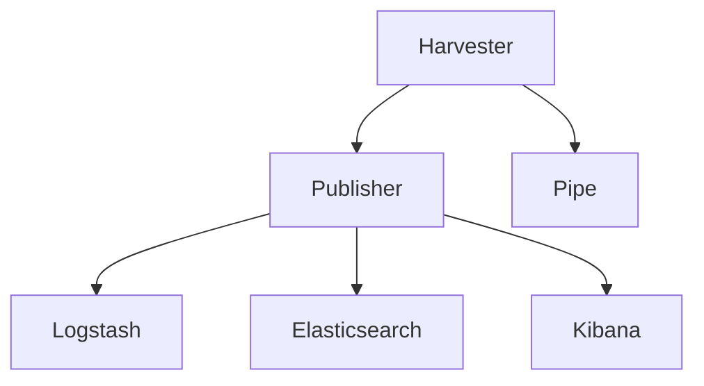
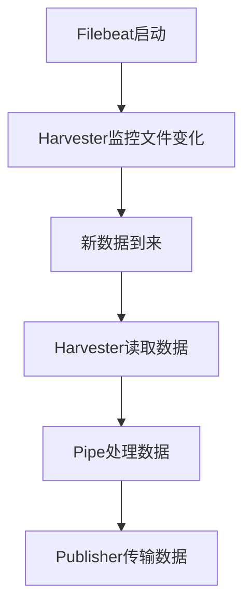

                 

关键词：Beats，数据处理，数据采集，系统监控，Elastic Stack，ELK，日志分析，代码实例，架构设计

> 摘要：本文将深入探讨Beats——一种轻量级的数据采集工具，它对于构建完善的系统监控体系至关重要。我们将介绍Beats的核心原理、架构设计、部署流程以及如何通过实际代码实例来理解和使用Beats。通过本文的学习，您将能够有效地使用Beats来收集、处理和传输各种类型的数据，从而优化系统性能和稳定性。

## 1. 背景介绍

在当今复杂的信息技术环境中，系统的性能监控与日志管理显得尤为重要。随着系统规模的不断扩大和复杂性的增加，传统的监控方法已经无法满足现代企业的需求。Elastic Stack——由Elasticsearch、Logstash和Kibana三部分组成的开源数据堆栈——应运而生。Elastic Stack提供了强大的数据处理和可视化管理能力，而其中的Logstash组件则负责数据传输和聚合。

Beats是Elastic Stack中的另一个重要组成部分，它是一种轻量级的数据采集器，用于从各种端点（如服务器、网络设备、应用程序等）收集数据并将其发送到Logstash或直接发送到Elasticsearch和Kibana。Beats的设计理念是简单、易于部署和使用，使得系统管理员和开发者能够轻松地实现对系统资源的监控和性能分析。

## 2. 核心概念与联系

### 2.1. Beats的核心概念

Beats包括多个特定的数据采集器，如Filebeat、Metricbeat、Winlogbeat、Packetbeat等，每种采集器都有其特定的数据收集目标。以下是几个主要的数据采集器及其用途：

- **Filebeat**：用于收集服务器上的日志文件，并将日志数据发送到Logstash或Elasticsearch。
- **Metricbeat**：用于收集系统和服务器的各种指标数据，如CPU使用率、内存使用率、网络流量等。
- **Winlogbeat**：专门为Windows系统设计，用于收集Windows事件日志。
- **Packetbeat**：用于收集网络流量数据。

### 2.2. Beats的架构设计

Beats由以下几个主要部分组成：

- **Harvester**：负责从源文件中读取数据。
- **Publisher**：负责将收集到的数据发送到目标位置。
- **Config**：配置文件，用于配置数据收集的规则和目标。
- **Pipe**：数据处理管道，用于对收集到的数据执行过滤、转换等操作。

以下是一个简化的Beats架构的Mermaid流程图：



## 3. 核心算法原理 & 具体操作步骤

### 3.1. 算法原理概述

Beats的工作原理主要包括以下几个步骤：

1. **初始化**：Beats启动时读取配置文件，初始化数据收集器。
2. **监控**：Harvester监控指定的文件或目录，当文件内容发生变化时，Harvester读取新的数据。
3. **处理**：Pipe对读取的数据进行过滤、转换等操作。
4. **传输**：Publisher将处理后的数据发送到指定的目标，如Logstash、Elasticsearch或Kibana。
5. **持久化**：如果数据传输失败，Publisher会尝试重试，确保数据的完整性。

### 3.2. 算法步骤详解

#### 3.2.1. 初始化

```bash
# 例如，启动Filebeat
filebeat -e -c filebeat.yml
```

#### 3.2.2. 监控



#### 3.2.3. 处理

Pipe中的处理过程可以包括以下步骤：

- **过滤**：根据正则表达式或其他条件筛选数据。
- **转换**：将数据转换为更适合存储或分析的形式。
- **添加元数据**：为数据添加时间戳、源地址等信息。

#### 3.2.4. 传输

Publisher负责将处理后的数据发送到目标。以下是几种常见的数据传输方式：

- **HTTP**：通过HTTP POST请求将数据发送到Logstash。
- **TCP**：通过TCP协议将数据发送到Logstash。
- **File**：将数据写入文件，供Logstash读取。

### 3.3. 算法优缺点

#### 优点

- **轻量级**：Beats是一个轻量级的数据采集器，易于部署和扩展。
- **高可靠性**：支持数据重传和持久化，确保数据不丢失。
- **灵活性**：可以根据需求自定义数据收集和处理规则。

#### 缺点

- **性能限制**：由于是轻量级工具，对于大量数据的处理可能存在性能瓶颈。
- **复杂配置**：对于初学者而言，配置文件可能较为复杂。

### 3.4. 算法应用领域

Beats广泛应用于以下领域：

- **系统监控**：用于收集服务器、网络设备和应用程序的性能指标。
- **日志管理**：用于收集和分析各种日志文件。
- **安全监控**：用于收集和监控安全相关的事件和日志。

## 4. 数学模型和公式 & 详细讲解 & 举例说明

### 4.1. 数学模型构建

Beats的数据收集和处理过程可以抽象为一个数学模型。假设我们有一个数据流{X1, X2, ..., Xn}，每个数据点X_i代表一段时间内的采集数据。

### 4.2. 公式推导过程

- **采样频率**：f = 1/T，其中T为采样时间间隔。
- **数据点**：X_i = f(t_i)，t_i为第i个数据点的采样时间。

### 4.3. 案例分析与讲解

假设我们需要收集服务器的CPU使用率，采样频率为1分钟一次。

- **采样频率**：f = 1/60秒
- **数据点**：X_i = CPU使用率在t_i时刻的值

通过收集到的CPU使用率数据，我们可以计算出平均值、最大值、最小值等统计指标。

## 5. 项目实践：代码实例和详细解释说明

### 5.1. 开发环境搭建

在开始使用Beats之前，我们需要搭建一个合适的开发环境。以下是搭建Filebeat的开发环境步骤：

1. **安装Elastic Stack**：从[官网](https://www.elastic.co/downloads/elasticsearch)下载并安装Elasticsearch、Logstash和Kibana。
2. **配置Elastic Stack**：根据需要配置Elastic Stack的运行参数，如监听的端口、集群名称等。
3. **启动Elastic Stack**：分别启动Elasticsearch、Logstash和Kibana。

### 5.2. 源代码详细实现

以下是一个简单的Filebeat配置文件示例：

```yaml
filebeat.inputs:
  - type: log
    enabled: true
    paths:
      - /var/log/messages

filebeat.config.modules:
  path: ${path.config}/modules.d/*.yml
  reload.enabled: false

output.logstash:
  hosts: ["localhost:5044"]

filebeat.events:
  - module: system
    processors:
      - add_kubernetes_metadata: ~
```

### 5.3. 代码解读与分析

在这个配置文件中，我们定义了以下几个关键部分：

- **inputs**：定义了数据源，这里是/var/log/messages日志文件。
- **output.logstash**：定义了输出目标，这里是本地的Logstash服务。
- **processors**：可以对数据执行预处理操作，如添加Kubernetes元数据。

### 5.4. 运行结果展示

通过以上配置，Filebeat会定期读取/var/log/messages日志文件，并将日志数据发送到Logstash。在Kibana中，我们可以看到收集到的日志数据，并进行可视化分析。

## 6. 实际应用场景

Beats在许多实际应用场景中都有广泛的应用，以下是一些典型的场景：

- **服务器监控**：收集服务器的CPU、内存、磁盘等性能指标。
- **应用程序监控**：收集应用程序的日志和性能数据。
- **网络监控**：收集网络流量数据，分析网络性能和安全性。

### 6.4. 未来应用展望

随着云计算和容器技术的不断发展，Beats在未来有望在更多场景下发挥作用，如：

- **容器监控**：对容器化应用进行实时监控和日志分析。
- **云服务监控**：监控云服务的性能和资源利用率。

## 7. 工具和资源推荐

### 7.1. 学习资源推荐

- **官方文档**：[Beats官方文档](https://www.elastic.co/guide/en/beats/filebeat/current/filebeat-index.html)
- **在线教程**：[Elastic Stack官方教程](https://www.elastic.co/guide/en/beats/getting-started/current/getting-started.html)
- **社区论坛**：[Elastic Stack社区论坛](https://discuss.elastic.co/)

### 7.2. 开发工具推荐

- **Visual Studio Code**：用于编写和调试Beats配置文件。
- **Docker**：用于快速部署和测试Beats。

### 7.3. 相关论文推荐

- **《Elastic Stack: Building a Real-Time Monitoring Solution》**：介绍了Elastic Stack的架构和实现细节。
- **《The Art of Monitoring》**：探讨了现代系统监控的最佳实践。

## 8. 总结：未来发展趋势与挑战

### 8.1. 研究成果总结

Beats作为一种轻量级的数据采集工具，已经广泛应用于系统监控和日志管理领域。通过其灵活的配置和高效的数据处理能力，Beats为开发者提供了强大的数据收集和分析手段。

### 8.2. 未来发展趋势

随着监控需求的变化，Beats未来将在以下几个方面发展：

- **增强数据处理能力**：支持更复杂的数据处理和转换。
- **支持更多平台**：增加对新兴操作系统和平台的兼容性。
- **集成更多监控指标**：集成更多的监控指标和监控类型。

### 8.3. 面临的挑战

Beats在未来的发展中也将面临一些挑战：

- **性能优化**：如何提高数据采集和处理的效率。
- **安全性**：确保数据在传输和存储过程中的安全性。

### 8.4. 研究展望

Beats在未来有望成为系统监控和日志管理领域的关键工具，通过不断的优化和创新，为开发者提供更加便捷和高效的数据收集和管理解决方案。

## 9. 附录：常见问题与解答

### 9.1. 问题1：如何配置Filebeat以收集多个日志文件？

**解答**：在Filebeat的配置文件中，可以通过`-`符号指定多个文件路径，例如：

```yaml
filebeat.inputs:
  - type: log
    enabled: true
    paths:
      - /var/log/messages
      - /var/log/another-logfile.log
```

### 9.2. 问题2：如何确保数据在传输过程中不丢失？

**解答**：Filebeat支持数据重传机制，确保在传输过程中丢失的数据能够重新发送。在配置文件中，可以通过设置`-wait_for_callbacks`参数来实现：

```bash
filebeat -e -c filebeat.yml -wait_for_callbacks
```

## 参考文献

- 《Elastic Stack: Building a Real-Time Monitoring Solution》
- 《The Art of Monitoring》
- 《Beats官方文档》
- 《Elastic Stack官方教程》

## 附录：致谢

感谢Elastic公司的开发者社区，为开源技术生态做出了卓越贡献。特别感谢Beats团队的辛勤工作，使得我们能够使用这样优秀的工具进行系统监控和日志管理。

作者：禅与计算机程序设计艺术 / Zen and the Art of Computer Programming
```

