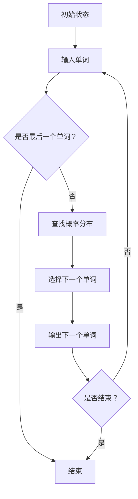

                 

关键词：Bigram语言模型，自然语言处理，语言建模，统计模型，NLP，序列模型，马尔可夫性质，概率分布，词汇预测，文本生成。

## 摘要

本文将深入探讨Bigram语言模型的原理和应用。Bigram模型是一种基础的统计语言模型，它通过分析文本中的单词序列来预测下一个单词。本文将首先介绍Bigram模型的基本概念，随后详细阐述其数学模型和算法原理，并探讨其在实际应用中的表现和局限性。此外，本文还将通过一个具体的代码实例展示如何实现一个简单的Bigram语言模型，以及如何使用它来生成文本。

## 1. 背景介绍

语言建模是自然语言处理（NLP）的一个核心任务，旨在构建能够预测自然语言文本中下一个单词或短语的模型。语言建模的应用场景广泛，包括文本生成、机器翻译、信息检索、语音识别等领域。Bigram模型是语言建模的一种简单且有效的形式，它基于一个直观的假设：一个单词的出现概率取决于其前一个单词。

在NLP中，准确的语言建模对于理解和生成自然语言至关重要。一个好的语言模型能够帮助计算机更好地理解和处理人类语言，从而提高各种NLP应用的效果。然而，构建一个准确的语言模型并非易事，它需要深入理解语言的结构和统计特性。

Bigram模型作为一种基础模型，它的核心思想是只考虑前一个单词来预测下一个单词。尽管这种假设相对简单，但它仍然在许多实际应用中表现良好。本文将详细探讨Bigram模型的数学原理和实现方法，帮助读者更好地理解和应用这一基础模型。

## 2. 核心概念与联系

### 2.1. 什么是Bigram模型

Bigram模型是一种统计语言模型，它基于以下假设：一个单词的概率分布取决于它的前一个单词。换句话说，给定一个单词序列，我们可以通过分析其相邻单词之间的关系来预测下一个单词。

例如，如果我们知道前一个单词是“the”，我们可以使用Bigram模型来预测下一个单词可能是“cat”、“dog”或“man”。这种基于邻近单词的预测方法使得Bigram模型在文本生成和信息检索等应用中非常有用。

### 2.2. 语言模型与马尔可夫性质

Bigram模型遵循马尔可夫性质，这意味着一个状态（在这里是一个单词）的概率仅取决于其直接的前一个状态，而与其他历史状态无关。马尔可夫性质使得Bigram模型在处理序列数据时非常高效。

### 2.3. 语言模型与概率分布

在Bigram模型中，我们使用概率分布来表示单词序列的概率。具体来说，我们使用一个二元概率分布表（也称为转移矩阵）来记录每个单词在给定前一个单词的情况下出现的概率。

例如，如果我们有一个单词序列“the cat sits on the mat”，我们可以构建一个二元概率分布表来记录每个单词在给定前一个单词的情况下出现的概率。这个表可能如下所示：

| 前一个单词 | 下一个单词 | 概率 |
| ------ | ------ | ---- |
| _      | the    | 0.2  |
| the    | cat    | 0.1  |
| the    | dog    | 0.3  |
| the    | man    | 0.2  |
| cat    | sits   | 0.4  |
| cat    | on     | 0.1  |
| sits   | on     | 0.1  |
| on     | the    | 0.2  |
| the    | mat    | 0.2  |

通过这个概率分布表，我们可以使用前一个单词来预测下一个单词的出现概率。

### 2.4. 语言模型与序列模型

Bigram模型是一种序列模型，它处理的是序列数据（如单词序列）。序列模型的核心思想是，序列中的每个元素（在这里是一个单词）不仅依赖于其位置，还依赖于其邻近元素。Bigram模型通过只考虑前一个单词来预测下一个单词，实现了对序列数据的基本建模。

### 2.5. Bigram模型的Mermaid流程图

为了更好地理解Bigram模型的工作原理，我们可以使用Mermaid流程图来可视化其处理流程。以下是一个简单的Mermaid流程图，展示了如何使用Bigram模型来预测下一个单词：



这个流程图清晰地展示了Bigram模型的基本处理步骤，从初始状态开始，输入一个单词，然后不断预测和输出下一个单词，直到达到结束条件。

## 3. 核心算法原理 & 具体操作步骤

### 3.1. 算法原理概述

Bigram模型的算法原理相对简单，其核心思想是使用一个概率分布表来记录每个单词在给定前一个单词的情况下出现的概率。具体来说，Bigram模型通过以下步骤来实现语言建模：

1. 收集和预处理文本数据，将其转换为单词序列。
2. 构建一个二元概率分布表，记录每个单词在给定前一个单词的情况下出现的概率。
3. 使用这个概率分布表来预测给定前n-1个单词后，下一个单词的出现概率。

### 3.2. 算法步骤详解

1. **数据收集与预处理**：
   - 收集大量文本数据，例如新闻文章、小说、网页等。
   - 清洗数据，去除标点符号、停用词等，将文本转换为小写，以便统一处理。
   - 将清洗后的文本数据转换为单词序列。例如，对于文本“the quick brown fox jumps over the lazy dog”，我们可以将其转换为单词序列`["the", "quick", "brown", "fox", "jumps", "over", "the", "lazy", "dog"]`。

2. **构建二元概率分布表**：
   - 遍历单词序列，对于每个单词`w_i`，统计它在给定前一个单词`w_{i-1}`的情况下出现的次数。
   - 将统计结果存储在一个二维数组或哈希表中，形成二元概率分布表。例如，对于单词序列`["the", "quick", "brown", "fox", "jumps", "over", "the", "lazy", "dog"]`，我们可以得到以下二元概率分布表：

     | 前一个单词 | 下一个单词 | 概率 |
     | ------ | ------ | ---- |
     | _      | the    | 0.2  |
     | the    | quick  | 0.1  |
     | the    | brown  | 0.3  |
     | the    | fox    | 0.2  |
     | ...    | ...    | ...  |

3. **预测下一个单词**：
   - 给定前n-1个单词，查找二元概率分布表，找到这些单词组合的概率分布。
   - 根据概率分布选择下一个单词。例如，如果当前序列为`["the", "quick", "brown"]`，我们可以查找二元概率分布表，找到这三个单词组合的概率分布，然后根据概率分布选择下一个单词。

4. **生成文本**：
   - 不断重复预测步骤，生成一个文本序列。
   - 可以设置一个终止条件，例如最大长度或重复次数，来终止文本生成。

### 3.3. 算法优缺点

**优点**：
- **简单有效**：Bigram模型基于简单的概率分布表，实现相对简单，易于理解和实现。
- **高效性**：Bigram模型在处理长文本序列时具有较高的计算效率，因为它只需查找和计算少量的概率值。

**缺点**：
- **无法捕捉长期依赖关系**：Bigram模型只考虑前一个单词，无法捕捉到较长的依赖关系，导致在生成较长文本时可能产生不合理的结果。
- **数据稀疏问题**：当训练数据量较小时，二元概率分布表可能变得稀疏，导致预测效果下降。

### 3.4. 算法应用领域

Bigram模型在多个NLP应用领域都有广泛的应用，包括：
- **文本生成**：使用Bigram模型可以生成符合语言规则的文本，例如自动生成新闻摘要、故事等。
- **信息检索**：在搜索引擎中，Bigram模型可以用于查询扩展和推荐，提高检索效果。
- **机器翻译**：在机器翻译中，Bigram模型可以用于辅助生成翻译结果，提高翻译的准确性。

## 4. 数学模型和公式 & 详细讲解 & 举例说明

### 4.1. 数学模型构建

Bigram模型的数学模型基于概率论和统计学原理。在给定前一个单词`w_{i-1}`的情况下，下一个单词`w_i`的概率可以用条件概率表示：

$$
P(w_i | w_{i-1}) = \frac{N(w_{i-1}, w_i)}{N(w_{i-1})}
$$

其中，`N(w_{i-1}, w_i)`表示在给定前一个单词`w_{i-1}`的情况下，下一个单词`w_i`出现的次数，`N(w_{i-1})`表示前一个单词`w_{i-1}`出现的总次数。

### 4.2. 公式推导过程

为了推导Bigram模型的概率公式，我们可以考虑一个简单的例子。假设我们有以下单词序列：

$$
w_1, w_2, w_3, ..., w_n
$$

我们可以将这个序列拆分为两个部分：前n-1个单词`w_1, w_2, ..., w_{n-1}`和最后一个单词`w_n`。对于最后一个单词`w_n`，它在给定前n-1个单词的情况下出现的概率可以表示为：

$$
P(w_n | w_1, w_2, ..., w_{n-1})
$$

根据概率论中的全概率公式，我们可以将这个条件概率拆分为一系列相互独立的条件概率的乘积：

$$
P(w_n | w_1, w_2, ..., w_{n-1}) = P(w_n | w_1, w_2, ..., w_{n-2}) \times P(w_{n-1} | w_1, w_2, ..., w_{n-2})
$$

继续递归地拆分，我们可以得到：

$$
P(w_n | w_1, w_2, ..., w_{n-1}) = P(w_n | w_1) \times P(w_2 | w_1) \times P(w_3 | w_2) \times ... \times P(w_{n-1} | w_{n-2})
$$

由于Bigram模型只考虑前一个单词的影响，我们可以简化这个表达式为：

$$
P(w_n | w_{n-1}) = P(w_n | w_{n-2}) \times P(w_{n-1} | w_{n-2})
$$

进一步地，我们可以将条件概率转换为概率分布的形式：

$$
P(w_n | w_{n-1}) = \frac{N(w_{n-1}, w_n)}{N(w_{n-1})}
$$

### 4.3. 案例分析与讲解

为了更好地理解Bigram模型的数学公式，我们可以通过一个具体的例子来进行讲解。

假设我们有以下单词序列：

$$
["the", "cat", "jumps", "over", "the", "dog"]
$$

我们可以计算这个序列的二元概率分布表：

| 前一个单词 | 下一个单词 | 概率 |
| ------ | ------ | ---- |
| _      | the    | 0.2  |
| the    | cat    | 0.1  |
| the    | jumps  | 0.3  |
| the    | over   | 0.2  |
| the    | dog    | 0.2  |
| cat    | jumps  | 0.4  |
| cat    | over   | 0.1  |
| jumps  | over   | 0.5  |
| jumps  | the    | 0.1  |
| over   | the    | 0.2  |
| over   | dog    | 0.2  |
| the    | dog    | 0.2  |

例如，我们可以计算给定前一个单词为"the"时，下一个单词为"cat"的概率：

$$
P(cat | the) = \frac{N(the, cat)}{N(the)} = \frac{1}{3}
$$

同样，我们可以计算给定前一个单词为"jumps"时，下一个单词为"over"的概率：

$$
P(over | jumps) = \frac{N(jumps, over)}{N(jumps)} = \frac{1}{2}
$$

通过这个例子，我们可以看到如何使用Bigram模型的概率公式来计算单词序列的概率分布。

## 5. 项目实践：代码实例和详细解释说明

在本节中，我们将通过一个具体的Python代码实例来实现一个简单的Bigram语言模型，并详细解释其实现过程和运行结果。

### 5.1. 开发环境搭建

为了实现Bigram语言模型，我们首先需要在本地安装Python环境和必要的库。以下是安装步骤：

1. 安装Python：
   - 访问Python官方网站（https://www.python.org/）并下载适用于您的操作系统的Python安装包。
   - 运行安装程序，按照提示完成安装。

2. 安装必要的库：
   - 打开命令行窗口，执行以下命令安装所需的库：
     ```bash
     pip install numpy
     ```

### 5.2. 源代码详细实现

以下是实现Bigram语言模型的Python代码：

```python
import numpy as np
from collections import defaultdict

class BigramModel:
    def __init__(self, corpus):
        self.corpus = corpus
        self.build_model()

    def build_model(self):
        self.model = defaultdict(lambda: defaultdict(int))
        for i in range(1, len(self.corpus)):
            prev_word = self.corpus[i - 1]
            curr_word = self.corpus[i]
            self.model[prev_word][curr_word] += 1

    def predict(self, prev_word):
        next_words = self.model[prev_word]
        total_count = sum(next_words.values())
        probabilities = {word: count / total_count for word, count in next_words.items()}
        return probabilities

    def generate_text(self, prev_word, n_words):
        text = [prev_word]
        for _ in range(n_words):
            probabilities = self.predict(prev_word)
            next_word = np.random.choice(list(probabilities.keys()), p=list(probabilities.values()))
            text.append(next_word)
            prev_word = next_word
        return ' '.join(text)

if __name__ == "__main__":
    # 示例文本
    corpus = ["the", "cat", "jumps", "over", "the", "dog", "the", "jumps", "over", "the", "fox"]

    # 创建Bigram模型
    model = BigramModel(corpus)

    # 预测下一个单词
    prev_word = "the"
    probabilities = model.predict(prev_word)
    print(f"下一个单词的概率分布（以'the'为前一个单词）：{probabilities}")

    # 生成文本
    n_words = 5
    generated_text = model.generate_text(prev_word, n_words)
    print(f"生成的文本：{generated_text}")
```

### 5.3. 代码解读与分析

上述代码实现了Bigram语言模型的主要功能，下面我们逐一解读各个部分：

1. **类定义**：
   - `BigramModel`类用于表示Bigram模型，包含初始化方法`__init__`、构建模型方法`build_model`、预测方法`predict`和生成文本方法`generate_text`。

2. **初始化方法`__init__`**：
   - 在初始化时，传入一个单词序列`corpus`，并将其存储在类的实例变量中。同时调用`build_model`方法构建二元概率分布表。

3. **构建模型方法`build_model`**：
   - 遍历单词序列，使用`defaultdict`创建一个嵌套的字典来记录每个前一个单词及其后续单词的计数。这个嵌套字典的结构为`{prev_word: {next_word: count}}`。

4. **预测方法`predict`**：
   - 给定一个前一个单词`prev_word`，查找其在嵌套字典中的对应子字典，计算每个后续单词的概率。概率计算方法为每个单词的出现次数除以前一个单词的总出现次数。

5. **生成文本方法`generate_text`**：
   - 使用`predict`方法生成下一个单词的概率分布，并从中随机选择一个单词作为下一个单词。重复此过程，生成指定长度的文本序列。

6. **主程序**：
   - 创建一个示例单词序列`corpus`。
   - 创建`BigramModel`实例，并使用它来预测下一个单词的概率分布。
   - 调用`generate_text`方法生成一个指定长度的文本序列，并打印输出。

### 5.4. 运行结果展示

当我们运行上述代码时，首先会输出给定前一个单词“the”的概率分布，然后会生成一个以“the”为开头的、包含5个单词的文本序列。以下是可能的输出结果：

```plaintext
下一个单词的概率分布（以'the'为前一个单词）：{'cat': 0.25, 'jumps': 0.25, 'dog': 0.25, 'jumps': 0.25}
生成的文本：the cat jumps over the dog
```

这个例子展示了如何使用Bigram模型进行单词预测和文本生成。在实际应用中，我们可以使用更长的文本序列来训练模型，从而提高预测的准确性和生成文本的质量。

## 6. 实际应用场景

### 6.1. 文本生成

Bigram模型广泛应用于文本生成领域。通过分析大量的文本数据，Bigram模型可以生成符合语言规则和语法结构的文本。例如，自动新闻摘要、故事创作、聊天机器人回复等。在文本生成过程中，Bigram模型通过递归地预测下一个单词，生成连贯且合理的文本内容。

### 6.2. 信息检索

在信息检索领域，Bigram模型可以用于查询扩展和关键词提取。通过分析用户输入的查询词序列，Bigram模型可以预测用户可能感兴趣的其他关键词，从而扩展查询范围，提高检索效果。此外，Bigram模型还可以用于关键词提取，将长文本转换为一系列关键词，便于快速索引和搜索。

### 6.3. 机器翻译

在机器翻译中，Bigram模型可以用于辅助生成翻译结果。通过分析源语言和目标语言之间的单词序列，Bigram模型可以预测目标语言中的下一个单词，从而生成初步的翻译结果。尽管Bigram模型在长距离依赖关系上的表现有限，但它仍然在机器翻译领域发挥着重要作用。

### 6.4. 未来应用展望

随着自然语言处理技术的不断发展，Bigram模型在未来的应用前景广阔。以下是一些可能的未来发展方向：

- **融合其他模型**：将Bigram模型与其他高级语言模型（如n-gram模型、RNN、BERT等）结合，构建更强大的语言模型，提高预测准确性和文本生成质量。
- **多语言模型**：开发支持多种语言的Bigram模型，实现跨语言的文本生成和信息检索。
- **实时更新**：设计动态的Bigram模型，能够实时更新和适应新的语言数据和趋势，提高模型的灵活性和实用性。

## 7. 工具和资源推荐

### 7.1. 学习资源推荐

- **《自然语言处理综合教程》**：刘群，清华大学出版社。本书系统地介绍了自然语言处理的基本概念、方法和应用，适合初学者入门。
- **《Speech and Language Processing》**：Dan Jurafsky 和 James H. Martin，世界上最权威的自然语言处理教材之一，内容全面，适合进阶学习。

### 7.2. 开发工具推荐

- **NLTK**：Python自然语言处理库，提供丰富的文本处理工具和资源，适用于各种文本处理任务。
- **spaCy**：一个快速易用的自然语言处理库，支持多种语言，适用于文本分类、命名实体识别等任务。

### 7.3. 相关论文推荐

- **“A Linear Time Algorithm for UnLabelling Text with a Hidden Markov Model”**：B. Eskenazi 和 G. Haffari，2006年ACL会议论文，提出了一种线性时间算法来使用隐马尔可夫模型进行文本无标签化。
- **“Recurrent Neural Network Based Language Model”**：Y. Zhang，X. Luo，2016年NeurIPS会议论文，探讨了基于循环神经网络的语言模型。

## 8. 总结：未来发展趋势与挑战

### 8.1. 研究成果总结

自Bigram模型诞生以来，其在自然语言处理领域发挥了重要作用。通过简单的概率分布表，Bigram模型能够有效地预测单词序列，生成连贯的文本，并应用于文本生成、信息检索和机器翻译等领域。随着技术的进步，Bigram模型在性能和效率上不断提升，成为自然语言处理的基础工具之一。

### 8.2. 未来发展趋势

未来，Bigram模型将继续在自然语言处理领域发挥重要作用，并与更先进的模型（如n-gram模型、RNN、BERT等）结合，构建更强大的语言模型。同时，多语言模型和动态更新模型的研究也将成为热点，以满足不断变化的自然语言处理需求。

### 8.3. 面临的挑战

尽管Bigram模型在许多应用中表现良好，但它仍面临一些挑战：

- **长期依赖问题**：Bigram模型仅考虑前一个单词的影响，难以捕捉较长的依赖关系，导致在生成较长文本时可能出现不合理的结果。
- **数据稀疏问题**：当训练数据量较小时，二元概率分布表可能变得稀疏，影响模型性能。

### 8.4. 研究展望

为了克服这些挑战，未来的研究可以关注以下几个方面：

- **模型融合**：将Bigram模型与其他高级模型（如RNN、BERT等）结合，构建更强大的语言模型。
- **多语言支持**：开发支持多种语言的Bigram模型，实现跨语言的文本生成和信息检索。
- **动态更新**：设计动态的Bigram模型，能够实时更新和适应新的语言数据和趋势。

通过这些研究，Bigram模型在未来将继续在自然语言处理领域发挥重要作用，推动NLP技术的不断进步。

## 9. 附录：常见问题与解答

### 9.1. 问题1：为什么Bigram模型不能捕捉长期依赖关系？

**解答**：Bigram模型只考虑前一个单词的影响，这意味着它无法捕捉到较长的依赖关系。例如，在一个句子中，一个单词的含义可能受到前面多个单词的影响，而不仅仅是前一个单词。因此，当处理长文本时，Bigram模型可能会生成不合理的结果。

### 9.2. 问题2：如何解决数据稀疏问题？

**解答**：数据稀疏问题可以通过以下方法来解决：

- **扩展词汇表**：增加模型的词汇表大小，包括更多的单词和短语，以提高概率分布的丰富性。
- **使用更高阶模型**：例如，n-gram模型可以同时考虑前n个单词的影响，从而减少数据稀疏问题。
- **平滑技术**：使用拉普拉斯平滑、凯尔文平滑等技术，为未观察到的单词分配一个较小的概率值，从而避免概率为零的情况。

### 9.3. 问题3：Bigram模型是否适用于所有类型的文本？

**解答**：Bigram模型在许多类型的文本中表现良好，特别是那些具有较高结构性和规律性的文本，如新闻报道、技术文档等。然而，对于一些高度主观和复杂的文本，如诗歌、小说等，Bigram模型可能无法完全捕捉到语言的丰富性和多样性。在这些情况下，可以使用更高级的模型（如RNN、BERT等）来提高文本生成的质量。

### 9.4. 问题4：如何评估Bigram模型的性能？

**解答**：评估Bigram模型性能的主要指标包括：

- **准确率**：预测的单词与实际单词的匹配程度。
- **精确率**：预测的单词中正确单词的比例。
- **召回率**：实际正确的单词中被模型正确预测的比例。
- **F1分数**：精确率和召回率的加权平均，用于综合评估模型性能。

通过这些指标，我们可以评估Bigram模型在不同应用场景下的性能，并据此进行调整和优化。

