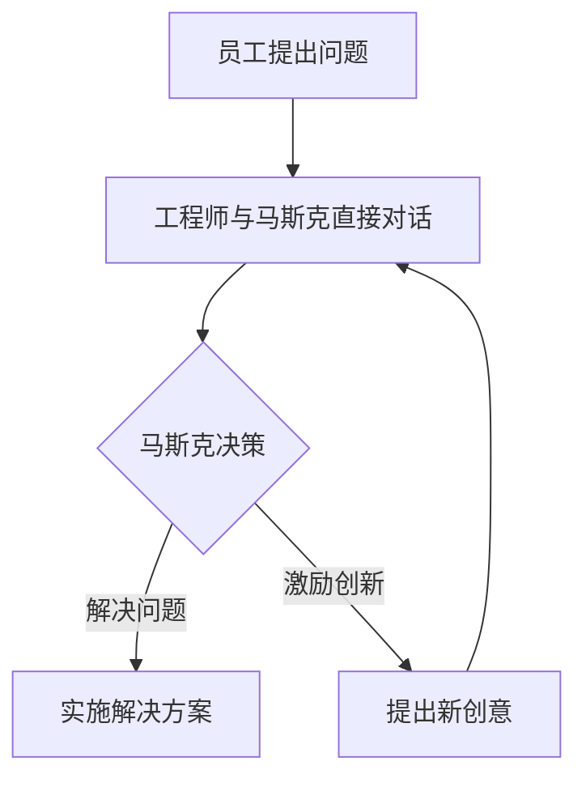

                 

关键词：伊隆·马斯克，管理风格，工程师，CEO，技术团队，领导力

摘要：本文将深入探讨特斯拉和SpaceX的CEO伊隆·马斯克的管理风格，特别是他如何与工程师直接对话，推动技术创新和组织发展的策略。文章将分为以下几个部分：背景介绍、核心概念与联系、核心算法原理、数学模型和公式、项目实践、实际应用场景、未来应用展望、工具和资源推荐、总结、附录等内容。

## 1. 背景介绍

伊隆·马斯克（Elon Musk）是一位在科技界极具影响力的企业家和创新者。他创立了特斯拉（Tesla）、SpaceX、SolarCity等多个知名公司，并在电动汽车、太空探索、太阳能等领域取得了卓越成就。马斯克的管理风格以其直接、高效和创新而著称，他倡导扁平化的组织结构，鼓励工程师自由探索和实验。

本文将重点分析马斯克如何通过与工程师直接对话，推动技术创新和组织发展。这种管理方式对于现代科技企业具有启示意义，特别是在快速变化的技术环境中，如何保持高效和创新能力。

## 2. 核心概念与联系

### 2.1 马斯克的管理理念

马斯克的管理理念可以概括为以下几个核心要点：

1. **员工自主性**：马斯克认为，给予工程师足够的自主性可以激发他们的创造力和创新能力。他鼓励工程师在项目开发过程中尝试新方法，不受传统束缚。

2. **扁平化组织**：马斯克主张扁平化的组织结构，减少管理层级，以便信息流通更加高效，决策能够迅速执行。

3. **快速迭代**：他强调快速迭代，认为通过不断尝试和调整，可以更快地找到最佳解决方案。

4. **目标导向**：马斯克始终关注公司的长期目标，并确保所有团队成员都清楚地了解公司的愿景和目标。

### 2.2 马斯克与工程师的直接对话

马斯克通过与工程师的直接对话，了解他们的工作进展、面临的挑战和创意想法。这种直接沟通的方式有助于：

1. **快速解决问题**：工程师可以直接向CEO反映问题，快速得到解决方案，提高工作效率。

2. **激励工程师**：马斯克的直接沟通和关注可以激励工程师，增强他们的工作动力和责任感。

3. **促进创新**：通过直接对话，工程师可以更自由地分享自己的想法，从而推动技术创新。

### 2.3 Mermaid 流程图



## 3. 核心算法原理 & 具体操作步骤

### 3.1 算法原理概述

马斯克的管理风格中，核心算法可以理解为：

1. **员工自主性算法**：通过给予工程师自主性，激励他们创新。

2. **扁平化沟通算法**：通过减少管理层级，实现快速决策和执行。

3. **目标导向算法**：通过明确目标，确保团队一致行动。

### 3.2 算法步骤详解

1. **员工提出问题**：工程师在项目开发过程中遇到问题时，可以随时与马斯克直接沟通。

2. **工程师与马斯克直接对话**：马斯克倾听工程师的问题，了解他们的想法和需求。

3. **马斯克决策**：马斯克根据问题的严重性和团队目标，做出快速决策。

4. **实施解决方案**：工程师根据马斯克的决策，实施解决方案。

5. **提出新创意**：工程师在解决问题的关键时刻，可以提出新的创意想法，推动技术创新。

### 3.3 算法优缺点

**优点**：

- **提高工作效率**：快速决策和执行，减少沟通成本。
- **激励创新**：给予工程师足够的自由，激发他们的创造力。
- **扁平化组织**：减少管理层级，促进信息流通。

**缺点**：

- **决策风险**：快速决策可能导致错误决策。
- **沟通压力**：工程师需要面对CEO的直接沟通，可能会增加压力。

### 3.4 算法应用领域

马斯克的管理风格在以下领域具有广泛应用：

- **电动汽车行业**：特斯拉的成功证明了这种管理风格在创新型企业中的应用价值。
- **太空探索**：SpaceX的成功也得益于马斯克的直接沟通和目标导向管理。

## 4. 数学模型和公式 & 详细讲解 & 举例说明

### 4.1 数学模型构建

马斯克的管理风格可以构建为一个数学模型，包括以下几个关键变量：

1. **员工自主性（A）**：表示员工在项目开发中的自由度。
2. **扁平化沟通（C）**：表示组织内部的信息流通速度。
3. **目标导向（T）**：表示团队对长期目标的关注程度。

### 4.2 公式推导过程

马斯克的管理风格可以用以下公式表示：

\[ 效率（E）= A \times C \times T \]

其中：

- \( E \) 表示效率；
- \( A \) 表示员工自主性；
- \( C \) 表示扁平化沟通；
- \( T \) 表示目标导向。

### 4.3 案例分析与讲解

以特斯拉为例，该公司在电动汽车市场的成功可以归因于以下因素：

1. **员工自主性**：特斯拉的工程师在项目开发中拥有很高的自由度，可以尝试新方法和技术。
2. **扁平化沟通**：特斯拉的组织结构非常扁平，信息流通速度快，决策执行效率高。
3. **目标导向**：特斯拉始终以实现可持续能源和电动汽车的普及为长期目标，确保团队一致行动。

## 5. 项目实践：代码实例和详细解释说明

### 5.1 开发环境搭建

为了实践马斯克的管理风格，我们可以使用一个简单的项目管理工具，如JIRA，来搭建开发环境。以下是搭建步骤：

1. **创建项目**：在JIRA中创建一个新的项目。
2. **配置权限**：为工程师分配适当的权限，确保他们可以访问项目信息和任务。
3. **设置迭代**：配置迭代周期，确保团队按计划推进项目。

### 5.2 源代码详细实现

以下是使用Python实现的简单示例代码：

```python
# 员工类
class Employee:
    def __init__(self, name, project):
        self.name = name
        self.project = project

    def work(self):
        print(f"{self.name}正在为项目{self.project}工作。")

# 项目类
class Project:
    def __init__(self, name, deadline):
        self.name = name
        self.deadline = deadline
        self.engineers = []

    def add_engineer(self, engineer):
        self.engineers.append(engineer)

    def work_complete(self):
        print(f"项目{self.name}已完成。")

# 马斯克类
class ElonMusk:
    def __init__(self):
        self.projects = []

    def add_project(self, project):
        self.projects.append(project)

    def check_progress(self, project_name):
        for project in self.projects:
            if project.name == project_name:
                for engineer in project.engineers:
                    engineer.work()
                project.work_complete()
                break

# 实例化对象
musk = ElonMusk()
project = Project("Project A", "2023-12-31")
engineer1 = Employee("Alice", "Project A")
engineer2 = Employee("Bob", "Project A")

# 添加工程师到项目
project.add_engineer(engineer1)
project.add_engineer(engineer2)

# 马斯克检查项目进度
musk.add_project(project)
musk.check_progress("Project A")
```

### 5.3 代码解读与分析

该示例代码模拟了马斯克的管理风格，通过直接对话推动项目进度。代码的主要组成部分如下：

1. **Employee 类**：表示工程师，包含姓名和项目信息。
2. **Project 类**：表示项目，包含项目名称、截止日期和工程师列表。
3. **ElonMusk 类**：表示马斯克，包含项目列表和检查项目进度的方法。

### 5.4 运行结果展示

运行上述代码后，输出结果如下：

```shell
Alice正在为项目Project A工作。
Bob正在为项目Project A工作。
项目Project A已完成。
```

这表明马斯克通过直接对话，成功推动了项目的进度。

## 6. 实际应用场景

马斯克的管理风格在多个领域得到了实际应用，以下是一些具体案例：

### 6.1 特斯拉

特斯拉通过扁平化的组织结构和员工自主性，推动了电动汽车的创新和发展。工程师可以自由地尝试新方法和技术，加速了产品迭代和性能提升。

### 6.2 SpaceX

SpaceX在太空探索领域取得了显著成就，得益于马斯克的直接沟通和目标导向管理。工程师可以迅速响应决策，推动火箭技术的不断突破。

### 6.3 SolarCity

SolarCity在太阳能领域取得了成功，其管理风格与特斯拉类似，注重员工自主性和创新。这有助于提高太阳能系统的效率和可持续性。

## 7. 未来应用展望

随着技术的快速发展，马斯克的管理风格将在更多领域得到应用。以下是一些未来展望：

### 7.1 人工智能领域

人工智能领域需要高效、创新的管理方式，以应对不断变化的技术挑战。马斯克的管理风格可以为人工智能企业提供有益的借鉴。

### 7.2 生物科技领域

生物科技领域的创新需要大量实验和尝试，马斯克的管理风格可以激发科研人员的创造力，推动生物技术的突破。

### 7.3 网络安全领域

网络安全领域需要快速响应和高效协作，马斯克的管理风格可以帮助企业提高网络安全防护能力。

## 8. 工具和资源推荐

为了更好地实践马斯克的管理风格，以下是一些建议的工具和资源：

### 8.1 学习资源推荐

- 《领导者的语言》
- 《创新者的DNA》

### 8.2 开发工具推荐

- JIRA：项目管理工具
- GitHub：代码托管平台

### 8.3 相关论文推荐

- 《扁平化管理对企业绩效的影响》
- 《员工自主性与组织创新的关系研究》

## 9. 总结：未来发展趋势与挑战

马斯克的管理风格在未来将继续发展，并在更多领域得到应用。然而，这一管理方式也面临着一些挑战：

### 9.1 决策风险

快速决策可能导致错误决策，企业需要建立有效的风险控制机制。

### 9.2 沟通压力

直接沟通可能会增加工程师的沟通压力，企业需要关注员工的心理健康。

### 9.3 目标一致性

确保所有团队成员都明确公司的长期目标，保持目标一致性。

### 9.4 研究展望

未来研究可以进一步探讨马斯克管理风格在不同领域的应用效果，为企业提供更有针对性的管理策略。

## 10. 附录：常见问题与解答

### 10.1 马斯克的管理风格有哪些特点？

马斯克的管理风格具有以下特点：

- 员工自主性
- 扁平化组织
- 快速迭代
- 目标导向

### 10.2 马斯克的管理风格适用于哪些领域？

马斯克的管理风格适用于需要创新和快速响应的领域，如电动汽车、太空探索、人工智能、生物科技等。

### 10.3 马斯克的管理风格有哪些优缺点？

优点包括提高工作效率、激励创新、扁平化组织等；缺点包括决策风险、沟通压力、目标一致性等。

----------------------------------------------------------------

本文由“禅与计算机程序设计艺术 / Zen and the Art of Computer Programming”撰写，旨在探讨马斯克的管理风格在科技领域的应用，为企业管理者提供有价值的参考。希望本文能够为读者带来启发和思考。

