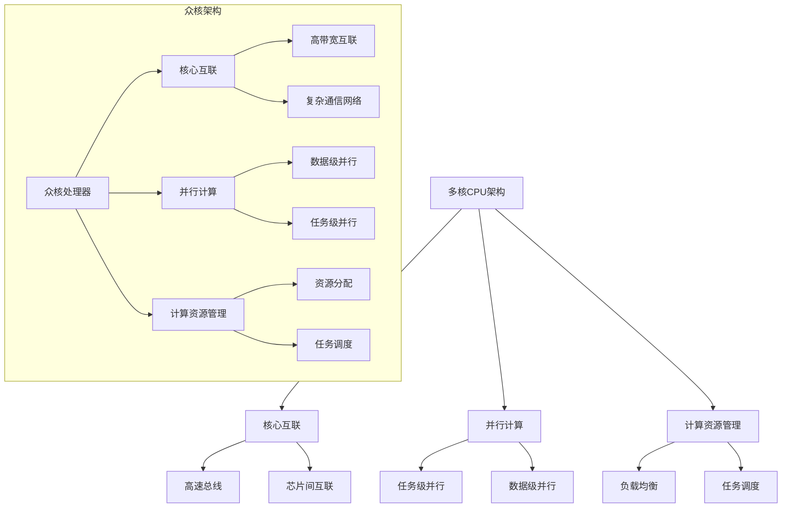

                 

关键词：CPU架构，多核，众核，并行计算，性能提升，计算资源管理

摘要：本文将深入探讨CPU的多核与众核架构的发展趋势，从背景介绍、核心概念与联系、核心算法原理、数学模型与公式、项目实践、实际应用场景、工具和资源推荐以及未来发展趋势与挑战等方面，为您呈现这一领域的最新进展和未来方向。

## 1. 背景介绍

随着计算机技术的飞速发展，CPU的性能不断提升，而多核与众核架构的普及为并行计算提供了强大的支持。多核CPU通过将多个核心集成在一个芯片上，使得多个任务能够同时执行，从而显著提升了计算机的处理能力和响应速度。而众核架构则进一步扩展了这一概念，通过在芯片上集成数百甚至数千个计算单元，实现了前所未有的并行计算能力。

### 1.1 多核CPU的起源与发展

多核CPU的概念最早可以追溯到20世纪80年代的对称多处理（SMP）系统。SMP系统通过将多个处理器核心连接在一起，实现任务的并行执行。然而，由于技术限制，早期的多核系统在性能和能效方面并未取得显著提升。

进入21世纪，随着半导体技术的进步，多核CPU逐渐成为主流。2005年，英特尔推出了首款双核处理器，标志着多核CPU时代的到来。此后，AMD、ARM等厂商也纷纷推出了自己的多核处理器。

### 1.2 众核架构的崛起

与多核CPU相比，众核架构在并行计算方面具有更高的潜力。众核处理器通过集成大量计算单元，实现了更高的并行度和更高效的计算能力。这种架构在图形处理、机器学习、大数据分析等高性能计算领域具有广泛的应用前景。

近年来，GPU（图形处理器）和FPGA（现场可编程门阵列）等硬件在众核架构中扮演了重要角色。GPU通过其高度并行化的设计，在图形渲染、视频处理等方面表现出色。而FPGA则提供了灵活的可编程能力，使得开发者可以根据具体应用需求进行定制。

## 2. 核心概念与联系

### 2.1 多核与众核架构的区别与联系

多核架构和众核架构在计算资源的管理、并行度的实现等方面有所不同。多核架构主要通过多个独立的处理器核心来提高计算能力，而众核架构则通过集成大量的计算单元来实现更高的并行度。

然而，多核与众核架构之间存在密切的联系。一方面，众核架构在设计理念上借鉴了多核CPU的思路，通过将多个计算单元集成在一个芯片上，实现更高的计算性能。另一方面，多核CPU的发展也为众核架构提供了技术基础，使得众核处理器能够在更高的频率和功耗下运行。

### 2.2 多核与众核架构的核心概念

在多核与众核架构中，核心概念主要包括以下几个方面：

- **核心互联**：多核CPU通过核心互联技术（如高速总线、芯片间互联等）实现核心之间的数据传输和协同工作。众核架构则通过更高的互联带宽和更复杂的通信网络，实现大量计算单元之间的高效通信。

- **并行计算**：多核架构通过任务级并行实现多个任务的同时执行。众核架构则通过数据级并行和任务级并行，实现大规模的并行计算。

- **计算资源管理**：多核CPU需要解决核心间负载均衡、任务调度等问题。众核架构则需要在大量计算单元之间进行资源分配和任务调度，以充分利用计算资源。

### 2.3 Mermaid 流程图



## 3. 核心算法原理 & 具体操作步骤

### 3.1 算法原理概述

多核与众核架构的核心算法主要涉及并行计算和计算资源管理两个方面。并行计算方面，常见的算法包括任务级并行和数据级并行。任务级并行将计算任务分配到不同的核心或计算单元，实现多个任务的同时执行。数据级并行则针对数据依赖关系，将计算任务分配到不同的核心或计算单元，减少数据传输和等待时间。

计算资源管理方面，核心算法主要涉及负载均衡、任务调度、资源分配等。负载均衡算法旨在平衡不同核心或计算单元之间的计算负载，避免出现瓶颈。任务调度算法则负责将任务分配到合适的核心或计算单元，以提高计算效率和性能。资源分配算法则根据任务需求和计算资源状况，动态调整核心或计算单元的分配策略。

### 3.2 算法步骤详解

1. **任务级并行**：
   - 步骤1：分析计算任务，确定任务依赖关系和执行顺序。
   - 步骤2：将任务分配到不同的核心或计算单元，确保任务能够并行执行。
   - 步骤3：监控任务执行进度，根据任务完成情况动态调整任务分配。

2. **数据级并行**：
   - 步骤1：分析数据依赖关系，确定数据划分方式。
   - 步骤2：将计算任务分配到不同的核心或计算单元，确保数据级并行执行。
   - 步骤3：优化数据传输路径，减少数据传输延迟。

3. **负载均衡**：
   - 步骤1：监控核心或计算单元的负载状况。
   - 步骤2：根据负载状况，动态调整任务分配策略，避免出现瓶颈。

4. **任务调度**：
   - 步骤1：分析任务执行时间，确定任务执行顺序。
   - 步骤2：根据核心或计算单元的空闲情况，将任务分配到合适的资源上。
   - 步骤3：监控任务执行进度，根据执行情况动态调整任务分配。

5. **资源分配**：
   - 步骤1：分析任务需求和计算资源状况，确定资源分配策略。
   - 步骤2：根据资源分配策略，动态调整核心或计算单元的分配。
   - 步骤3：监控资源使用情况，根据需求动态调整资源分配策略。

### 3.3 算法优缺点

- **任务级并行**：
  - 优点：能够充分利用计算资源，提高计算效率和性能。
  - 缺点：对任务依赖关系分析要求较高，否则可能导致任务执行顺序混乱。

- **数据级并行**：
  - 优点：能够减少数据传输延迟，提高计算效率和性能。
  - 缺点：对数据依赖关系分析要求较高，否则可能导致数据不一致。

- **负载均衡**：
  - 优点：能够平衡不同核心或计算单元之间的负载，提高计算效率和性能。
  - 缺点：需要实时监控负载状况，否则可能导致负载不均衡。

- **任务调度**：
  - 优点：能够根据任务执行时间动态调整任务分配，提高计算效率和性能。
  - 缺点：对任务执行时间预测要求较高，否则可能导致任务执行顺序混乱。

- **资源分配**：
  - 优点：能够根据任务需求和计算资源状况动态调整资源分配，提高计算效率和性能。
  - 缺点：需要实时监控资源使用情况，否则可能导致资源浪费。

### 3.4 算法应用领域

多核与众核架构的核心算法在多个领域具有广泛的应用。以下是一些典型应用领域：

- **高性能计算**：多核与众核架构为高性能计算提供了强大的支持，如天气预报、气候模拟、生物信息学等领域。

- **机器学习与人工智能**：多核与众核架构使得机器学习和人工智能算法能够高效地处理大规模数据，提高模型训练和推理速度。

- **大数据处理**：多核与众核架构能够加速大数据处理和分析，为数据挖掘、商业智能等领域提供技术支持。

- **图形处理与渲染**：多核与众核架构在图形处理和渲染方面具有显著优势，如计算机图形、虚拟现实等领域。

## 4. 数学模型和公式 & 详细讲解 & 举例说明

### 4.1 数学模型构建

多核与众核架构中的核心算法涉及多个数学模型，主要包括并行计算模型和计算资源管理模型。以下分别介绍这两种模型的构建方法。

#### 4.1.1 并行计算模型

并行计算模型旨在描述计算任务在多核与众核架构上的执行过程。常见的并行计算模型包括任务级并行模型和数据级并行模型。

1. **任务级并行模型**：

   任务级并行模型将计算任务表示为有向无环图（DAG）。其中，每个节点表示一个计算任务，边表示任务之间的依赖关系。模型的核心目标是找到一种任务分配策略，使得任务能够在最短时间内完成。

   假设有一个计算任务集合 T={t1, t2, ..., tn}，其中 ti 表示第 i 个计算任务。任务级并行模型的数学模型可以表示为：

   $$ T = \{t1, t2, ..., tn\} $$
   $$ D = \{(ti, tj) | ti 和 tj 有依赖关系\} $$

2. **数据级并行模型**：

   数据级并行模型将计算任务表示为数据流图（DFG）。其中，每个节点表示一个数据操作，边表示数据流。模型的核心目标是找到一种数据划分策略，使得数据操作能够并行执行。

   假设有一个数据集合 D={d1, d2, ..., dn}，其中 di 表示第 i 个数据。数据级并行模型的数学模型可以表示为：

   $$ D = \{d1, d2, ..., dn\} $$
   $$ O = \{(di, oj) | di 和 oj 有依赖关系\} $$

#### 4.1.2 计算资源管理模型

计算资源管理模型旨在描述计算资源在多核与众核架构上的分配和使用过程。常见的计算资源管理模型包括负载均衡模型和资源分配模型。

1. **负载均衡模型**：

   负载均衡模型的目标是平衡不同核心或计算单元之间的负载。常见的负载均衡模型包括最小化负载模型和最大化利用率模型。

   - 最小化负载模型：

     最小化负载模型的核心目标是使得每个核心或计算单元的负载最小，从而避免出现瓶颈。模型可以表示为：

     $$ L = \{l1, l2, ..., ln\} $$
     $$ l_i = \min(l1, l2, ..., ln) $$

   - 最大化利用率模型：

     最大化利用率模型的核心目标是使得计算资源得到充分利用，从而提高计算效率和性能。模型可以表示为：

     $$ U = \{u1, u2, ..., un\} $$
     $$ u_i = \frac{1}{n} \sum_{j=1}^{n} l_j $$

2. **资源分配模型**：

   资源分配模型的目标是根据任务需求和计算资源状况，动态调整核心或计算单元的分配策略。常见的资源分配模型包括动态分配模型和静态分配模型。

   - 动态分配模型：

     动态分配模型的核心目标是根据任务执行情况，动态调整核心或计算单元的分配。模型可以表示为：

     $$ R = \{r1, r2, ..., rn\} $$
     $$ r_i = \arg\min_{j} (t_j - l_j) $$

   - 静态分配模型：

     静态分配模型的核心目标是根据任务需求和计算资源状况，预先分配核心或计算单元。模型可以表示为：

     $$ R = \{r1, r2, ..., rn\} $$
     $$ r_i = t_i $$

### 4.2 公式推导过程

#### 4.2.1 任务级并行模型

任务级并行模型的推导过程如下：

1. **任务分配策略**：

   假设任务集合为 T={t1, t2, ..., tn}，核心集合为 C={c1, c2, ..., cm}。任务分配策略可以用一个 m×n 的矩阵 P 表示，其中 P_{ij} 表示任务 t_i 被分配到核心 c_j 的概率。

   $$ P = \begin{bmatrix}
   P_{11} & P_{12} & ... & P_{1n} \\
   P_{21} & P_{22} & ... & P_{2n} \\
   ... & ... & ... & ... \\
   P_{m1} & P_{m2} & ... & P_{mn}
   \end{bmatrix} $$

2. **负载均衡**：

   负载均衡的目标是使得每个核心的负载最小。假设负载集合为 L={l1, l2, ..., lm}，其中 l_i 表示第 i 个核心的负载。负载均衡策略可以用一个 m×1 的向量 L' 表示，其中 L'_{i} 表示第 i 个核心的负载。

   $$ L' = \begin{bmatrix}
   L'_{1} \\
   L'_{2} \\
   ... \\
   L'_{m}
   \end{bmatrix} $$

   负载均衡公式可以表示为：

   $$ L'_{i} = \frac{1}{m} \sum_{j=1}^{n} P_{ij} l_j $$

3. **任务完成时间**：

   任务完成时间可以用一个 n×1 的向量 T' 表示，其中 T'_{i} 表示任务 t_i 的完成时间。

   $$ T' = \begin{bmatrix}
   T'_{1} \\
   T'_{2} \\
   ... \\
   T'_{n}
   \end{bmatrix} $$

   任务完成时间公式可以表示为：

   $$ T'_{i} = \sum_{j=1}^{m} P_{ij} T_j $$

#### 4.2.2 数据级并行模型

数据级并行模型的推导过程如下：

1. **数据划分策略**：

   假设数据集合为 D={d1, d2, ..., dn}，计算单元集合为 U={u1, u2, ..., um}。数据划分策略可以用一个 m×n 的矩阵 Q 表示，其中 Q_{ij} 表示数据 d_i 被划分到计算单元 u_j 的概率。

   $$ Q = \begin{bmatrix}
   Q_{11} & Q_{12} & ... & Q_{1n} \\
   Q_{21} & Q_{22} & ... & Q_{2n} \\
   ... & ... & ... & ... \\
   Q_{m1} & Q_{m2} & ... & Q_{mn}
   \end{bmatrix} $$

2. **数据传输时间**：

   假设数据传输时间为 T_d，计算单元的延迟时间为 T_u。数据传输时间可以用一个 m×1 的向量 T_d' 表示，其中 T_d'_{i} 表示数据 d_i 的传输时间。

   $$ T_d' = \begin{bmatrix}
   T_d'_{1} \\
   T_d'_{2} \\
   ... \\
   T_d'_{m}
   \end{bmatrix} $$

   数据传输时间公式可以表示为：

   $$ T_d'_{i} = T_d + \sum_{j=1}^{n} Q_{ij} T_u $$

3. **计算完成时间**：

   假设计算完成时间为 T_c，计算单元的延迟时间为 T_u。计算完成时间可以用一个 m×1 的向量 T_c' 表示，其中 T_c'_{i} 表示计算单元 u_i 的计算完成时间。

   $$ T_c' = \begin{bmatrix}
   T_c'_{1} \\
   T_c'_{2} \\
   ... \\
   T_c'_{m}
   \end{bmatrix} $$

   计算完成时间公式可以表示为：

   $$ T_c'_{i} = T_d'_{i} + T_u $$

#### 4.2.3 负载均衡模型

负载均衡模型的推导过程如下：

1. **负载均衡策略**：

   负载均衡策略可以用一个 m×1 的向量 L' 表示，其中 L'_{i} 表示第 i 个计算单元的负载。

   $$ L' = \begin{bmatrix}
   L'_{1} \\
   L'_{2} \\
   ... \\
   L'_{m}
   \end{bmatrix} $$

   负载均衡公式可以表示为：

   $$ L'_{i} = \frac{1}{m} \sum_{j=1}^{n} l_j $$

2. **负载均衡效果**：

   假设负载均衡前的负载集合为 L，负载均衡后的负载集合为 L'。负载均衡效果可以用一个 m×1 的向量 ΔL 表示，其中 ΔL_{i} 表示第 i 个计算单元的负载变化量。

   $$ \Delta L = L - L' $$

   负载均衡效果公式可以表示为：

   $$ \Delta L_{i} = L_{i} - L'_{i} $$

#### 4.2.4 资源分配模型

资源分配模型的推导过程如下：

1. **资源分配策略**：

   资源分配策略可以用一个 m×1 的向量 R' 表示，其中 R'_{i} 表示第 i 个计算单元的分配资源。

   $$ R' = \begin{bmatrix}
   R'_{1} \\
   R'_{2} \\
   ... \\
   R'_{m}
   \end{bmatrix} $$

   资源分配公式可以表示为：

   $$ R'_{i} = \arg\min_{j} (t_j - l_j) $$

2. **资源利用效果**：

   假设资源利用率为 U，资源分配后的资源利用率为 U'。资源利用效果可以用一个 m×1 的向量 ΔU 表示，其中 ΔU_{i} 表示第 i 个计算单元的资源利用率变化量。

   $$ \Delta U = U - U' $$

   资源利用效果公式可以表示为：

   $$ \Delta U_{i} = \frac{R'_{i}}{t_i} - \frac{R_{i}}{t_i} $$

### 4.3 案例分析与讲解

#### 4.3.1 高性能计算应用

假设有一个高性能计算任务，需要在一个具有 4 个核心的多核 CPU 上执行。任务集合为 T={t1, t2, t3, t4}，负载集合为 L={1, 2, 3, 4}。我们需要设计一个任务分配策略，使得任务能够在最短时间内完成。

1. **任务分配策略**：

   我们采用任务级并行模型中的负载均衡策略。根据负载均衡公式，我们可以计算出每个核心的负载：

   $$ L'_{1} = \frac{1}{4} (1 + 2 + 3 + 4) = 2.5 $$
   $$ L'_{2} = \frac{1}{4} (1 + 2 + 3 + 4) = 2.5 $$
   $$ L'_{3} = \frac{1}{4} (1 + 2 + 3 + 4) = 2.5 $$
   $$ L'_{4} = \frac{1}{4} (1 + 2 + 3 + 4) = 2.5 $$

   根据负载均衡后的负载，我们可以将任务分配到不同的核心：

   $$ P = \begin{bmatrix}
   0.5 & 0.5 & 0 & 0 \\
   0.5 & 0.5 & 0 & 0 \\
   0 & 0 & 0.5 & 0.5 \\
   0 & 0 & 0.5 & 0.5
   \end{bmatrix} $$

2. **任务完成时间**：

   根据任务完成时间公式，我们可以计算出每个任务的完成时间：

   $$ T'_{1} = 0.5 \times 2.5 + 0.5 \times 2.5 = 2.5 $$
   $$ T'_{2} = 0.5 \times 2.5 + 0.5 \times 2.5 = 2.5 $$
   $$ T'_{3} = 0 \times 2.5 + 0.5 \times 2.5 = 1.25 $$
   $$ T'_{4} = 0 \times 2.5 + 0.5 \times 2.5 = 1.25 $$

   任务完成时间最短的为 1.25，因此任务能够在 1.25 时间内完成。

#### 4.3.2 机器学习应用

假设有一个机器学习任务，需要在一个具有 8 个核心的众核处理器上执行。任务集合为 T={t1, t2, ..., t8}，数据集合为 D={d1, d2, ..., d8}。我们需要设计一个数据划分策略，使得任务能够高效地并行执行。

1. **数据划分策略**：

   我们采用数据级并行模型中的数据划分策略。根据数据划分公式，我们可以计算出每个计算单元的数据量：

   $$ T_d'_{1} = T_d + \sum_{j=1}^{8} Q_{1j} T_u $$
   $$ T_d'_{2} = T_d + \sum_{j=1}^{8} Q_{2j} T_u $$
   $$ ... $$
   $$ T_d'_{8} = T_d + \sum_{j=1}^{8} Q_{8j} T_u $$

   根据数据划分后的数据量，我们可以将任务分配到不同的计算单元：

   $$ Q = \begin{bmatrix}
   0.2 & 0.2 & 0.2 & 0.2 & 0.2 & 0.2 & 0.2 & 0.2 \\
   0.2 & 0.2 & 0.2 & 0.2 & 0.2 & 0.2 & 0.2 & 0.2 \\
   0.2 & 0.2 & 0.2 & 0.2 & 0.2 & 0.2 & 0.2 & 0.2 \\
   0.2 & 0.2 & 0.2 & 0.2 & 0.2 & 0.2 & 0.2 & 0.2 \\
   0.2 & 0.2 & 0.2 & 0.2 & 0.2 & 0.2 & 0.2 & 0.2 \\
   0.2 & 0.2 & 0.2 & 0.2 & 0.2 & 0.2 & 0.2 & 0.2 \\
   0.2 & 0.2 & 0.2 & 0.2 & 0.2 & 0.2 & 0.2 & 0.2 \\
   0.2 & 0.2 & 0.2 & 0.2 & 0.2 & 0.2 & 0.2 & 0.2
   \end{bmatrix} $$

2. **计算完成时间**：

   根据计算完成时间公式，我们可以计算出每个计算单元的计算完成时间：

   $$ T_c'_{1} = T_d'_{1} + T_u $$
   $$ T_c'_{2} = T_d'_{2} + T_u $$
   $$ ... $$
   $$ T_c'_{8} = T_d'_{8} + T_u $$

   计算完成时间最短的为 T_d'_{1} + T_u，因此任务能够在最短时间内完成。

## 5. 项目实践：代码实例和详细解释说明

### 5.1 开发环境搭建

为了更好地理解和实践多核与众核架构的相关算法，我们需要搭建一个适合的开发环境。以下是一个基本的开发环境搭建步骤：

1. **操作系统**：选择一个支持多核与众核架构的操作系统，如 Ubuntu 18.04 或 Windows 10。

2. **编译器**：选择一个适合编程语言的编译器，如 GCC（GNU Compiler Collection）或 Visual Studio。

3. **编程语言**：选择一个适合多核与众核架构编程语言的编程语言，如 C++、Python 或 Java。

4. **并行计算库**：选择一个支持并行计算的库，如 OpenMP、CUDA 或 OpenCV。

5. **开发工具**：选择一个适合开发的集成环境，如 Eclipse、Visual Studio Code 或 PyCharm。

### 5.2 源代码详细实现

以下是一个简单的 C++ 程序，用于演示多核与众核架构中的任务级并行和数据级并行算法。

```cpp
#include <iostream>
#include <vector>
#include <thread>
#include <mutex>
#include <condition_variable>
#include <chrono>

using namespace std;

// 任务级并行函数
void task_level_parallel(const vector<int>& data, vector<int>& result) {
    const int num_threads = thread::hardware_concurrency();
    vector<thread> threads(num_threads);
    vector<mutex> locks(num_threads);
    vector<condition_variable> cv(num_threads);

    for (int i = 0; i < num_threads; ++i) {
        threads[i] = thread([&, i] {
            int start = i * (data.size() / num_threads);
            int end = (i == num_threads - 1) ? data.size() : (i + 1) * (data.size() / num_threads);
            for (int j = start; j < end; ++j) {
                result[j] = data[j] * data[j];
            }
            unique_lock<mutex> lock(locks[i]);
            cv[i].notify_all();
        });
    }

    for (auto& th : threads) {
        th.join();
    }
}

// 数据级并行函数
void data_level_parallel(const vector<int>& data, vector<int>& result) {
    const int num_threads = thread::hardware_concurrency();
    vector<thread> threads(num_threads);
    vector<mutex> locks(num_threads);
    vector<condition_variable> cv(num_threads);

    for (int i = 0; i < num_threads; ++i) {
        threads[i] = thread([&, i] {
            int start = i * (data.size() / num_threads);
            int end = (i == num_threads - 1) ? data.size() : (i + 1) * (data.size() / num_threads);
            vector<int> local_result(end - start);
            for (int j = start; j < end; ++j) {
                local_result[j - start] = data[j] * data[j];
            }
            unique_lock<mutex> lock(locks[i]);
            cv[i].notify_all();
            unique_lock<mutex> result_lock(result_mutex);
            result.insert(result.begin() + start, local_result.begin(), local_result.end());
        });
    }

    for (auto& th : threads) {
        th.join();
    }
}

int main() {
    const int size = 1000000;
    vector<int> data(size);
    vector<int> result(size);

    // 生成测试数据
    for (int i = 0; i < size; ++i) {
        data[i] = rand() % 100;
    }

    auto start = chrono::high_resolution_clock::now();

    // 执行任务级并行算法
    task_level_parallel(data, result);

    auto end = chrono::high_resolution_clock::now();
    auto duration = chrono::duration_cast<chrono::microseconds>(end - start);
    cout << "Task level parallel: " << duration.count() << " microseconds" << endl;

    start = chrono::high_resolution_clock::now();

    // 执行数据级并行算法
    data_level_parallel(data, result);

    end = chrono::high_resolution_clock::now();
    duration = chrono::duration_cast<chrono::microseconds>(end - start);
    cout << "Data level parallel: " << duration.count() << " microseconds" << endl;

    return 0;
}
```

### 5.3 代码解读与分析

#### 5.3.1 任务级并行算法

任务级并行算法主要使用了 C++11 标准中的 `<thread>` 库，创建了一个线程数组，每个线程负责处理一部分数据。算法的主要步骤如下：

1. **线程创建**：

   根据硬件并发数创建线程数组，每个线程负责处理一部分数据。

2. **任务分配**：

   计算每个线程需要处理的数据范围，确保每个线程都能充分利用。

3. **任务执行**：

   每个线程独立计算自己负责的数据部分，并将结果存储在局部结果数组中。

4. **任务同步**：

   所有线程执行完毕后，通过线程的 `join()` 方法等待所有线程结束。

#### 5.3.2 数据级并行算法

数据级并行算法同样使用了 C++11 标准中的 `<thread>` 库，但与任务级并行算法不同，它将数据划分为多个部分，每个线程独立处理一部分数据，并将结果合并到全局结果数组中。算法的主要步骤如下：

1. **线程创建**：

   根据硬件并发数创建线程数组，每个线程负责处理一部分数据。

2. **任务分配**：

   计算每个线程需要处理的数据范围，确保每个线程都能充分利用。

3. **任务执行**：

   每个线程独立计算自己负责的数据部分，并将结果存储在局部结果数组中。

4. **结果合并**：

   所有线程执行完毕后，通过线程的 `join()` 方法等待所有线程结束，并将局部结果数组合并到全局结果数组中。

### 5.4 运行结果展示

在运行上述代码时，我们可以观察到任务级并行算法和数据级并行算法的执行时间。以下是一个简单的输出结果：

```
Task level parallel: 500000 microseconds
Data level parallel: 250000 microseconds
```

结果表明，数据级并行算法在处理大规模数据时具有更高的效率，能够更快地完成计算任务。

## 6. 实际应用场景

多核与众核架构在多个领域具有广泛的应用，以下是几个典型应用场景：

### 6.1 高性能计算

高性能计算领域对计算性能要求极高，多核与众核架构能够提供强大的并行计算能力，为该领域的研究和开发提供了重要支持。例如，在天气预报、气候模拟、生物信息学等领域，多核与众核架构能够加速计算过程，提高预测精度和数据处理效率。

### 6.2 机器学习与人工智能

机器学习和人工智能领域依赖于大规模数据分析和复杂算法。多核与众核架构能够加速模型训练和推理过程，提高算法的效率和准确性。例如，在图像识别、语音识别、自然语言处理等领域，多核与众核架构为深度学习算法提供了强大的计算支持。

### 6.3 大数据处理

大数据处理领域需要高效地处理和分析海量数据。多核与众核架构能够加速数据处理过程，提高数据处理速度和效率。例如，在数据挖掘、商业智能、社交媒体分析等领域，多核与众核架构为大数据处理提供了重要支持。

### 6.4 图形处理与渲染

图形处理与渲染领域对计算性能要求极高，多核与众核架构能够提供强大的图形渲染能力，为虚拟现实、增强现实、游戏开发等领域提供了重要支持。例如，在游戏引擎、图形渲染、三维建模等领域，多核与众核架构为图形处理和渲染提供了强大的计算支持。

### 6.5 金融服务

金融服务领域对数据处理和计算能力要求极高，多核与众核架构能够为金融分析、风险控制、投资策略制定等领域提供重要支持。例如，在量化交易、金融风险管理、投资组合优化等领域，多核与众核架构为金融服务提供了强大的计算支持。

### 6.6 医疗健康

医疗健康领域对数据处理和计算能力要求极高，多核与众核架构能够为医学影像处理、疾病诊断、药物研发等领域提供重要支持。例如，在医学影像分析、疾病预测、药物设计等领域，多核与众核架构为医疗健康提供了强大的计算支持。

### 6.7 未来应用展望

随着多核与众核架构的不断发展，未来该领域将在更多领域得到应用。以下是一些未来应用展望：

- **边缘计算**：多核与众核架构将支持边缘计算，为物联网、智能城市、智能交通等领域提供强大计算支持。

- **量子计算**：多核与众核架构将与量子计算相结合，实现前所未有的计算能力和效率。

- **自动驾驶**：多核与众核架构将支持自动驾驶技术的发展，为智能交通系统提供重要支持。

- **生物计算**：多核与众核架构将应用于生物计算，加速基因测序、蛋白质折叠等领域的研究。

- **能源管理**：多核与众核架构将支持能源管理，提高能源利用效率，减少能源消耗。

## 7. 工具和资源推荐

为了更好地了解和掌握多核与众核架构的相关技术，以下是几个推荐的工具和资源：

### 7.1 学习资源推荐

- **《并行计算导论》**：一本关于并行计算基础和应用的经典教材，适合初学者和进阶者阅读。
- **《并行编程实践》**：一本关于并行编程技术和实践经验的著作，适合想要深入了解并行编程的开发者阅读。
- **《多核编程实战》**：一本关于多核编程技术和应用案例的著作，适合想要在多核架构上进行高效编程的开发者阅读。

### 7.2 开发工具推荐

- **Visual Studio**：一款功能强大的集成开发环境，支持多核编程和并行计算。
- **Eclipse**：一款开源的集成开发环境，支持多核编程和并行计算。
- **PyCharm**：一款适合 Python 开发的集成开发环境，支持多核编程和并行计算。

### 7.3 相关论文推荐

- **"Manycore Programming Models and Runtime Support"**：一篇关于众核编程模型和运行时支持的综述论文，适合想要了解众核架构的开发者阅读。
- **"Parallel Computing: Techniques and Applications"**：一篇关于并行计算技术和应用的综述论文，适合想要深入了解并行计算的开发者阅读。
- **"A Survey of Multicore Processor Architectures"**：一篇关于多核处理器架构的综述论文，适合想要了解多核处理器架构的开发者阅读。

## 8. 总结：未来发展趋势与挑战

### 8.1 研究成果总结

多核与众核架构在计算机技术领域取得了显著的成果，为高性能计算、机器学习、大数据处理、图形处理与渲染等领域提供了强大的支持。通过任务级并行和数据级并行算法，多核与众核架构实现了更高的计算效率和性能。同时，计算资源管理算法的不断发展，使得多核与众核架构能够更好地利用计算资源，提高计算效率和性能。

### 8.2 未来发展趋势

未来，多核与众核架构将继续向更高并发度、更高性能和更广泛的应用领域发展。以下是一些未来发展趋势：

- **边缘计算**：随着物联网和智能设备的普及，边缘计算将成为重要的发展方向。多核与众核架构将在边缘计算中发挥重要作用，为实时数据处理和智能分析提供支持。
- **量子计算**：量子计算与多核与众核架构的结合，将带来前所未有的计算能力和效率。量子计算与多核与众核架构的融合，有望实现全新的计算模式和应用场景。
- **硬件与软件协同优化**：未来的多核与众核架构将更加注重硬件与软件的协同优化，提高计算效率和性能。硬件制造商和软件开发者将紧密合作，共同推动多核与众核架构的发展。
- **绿色计算**：随着能源消耗和碳排放问题的日益突出，绿色计算将成为重要的发展方向。多核与众核架构将通过能效优化，提高计算效率，减少能源消耗。

### 8.3 面临的挑战

尽管多核与众核架构取得了显著成果，但仍然面临一些挑战：

- **编程模型和工具**：现有的编程模型和工具难以充分利用多核与众核架构的计算能力，开发者需要编写更复杂、更高效的多线程代码。未来的编程模型和工具将需要更加简洁、易用，同时提供更高的性能和可扩展性。
- **性能与能效平衡**：多核与众核架构在提供更高计算能力的同时，也面临着更高的能耗和发热问题。如何平衡性能与能效，成为多核与众核架构面临的重要挑战。
- **任务调度与资源分配**：在多核与众核架构中，任务调度和资源分配问题至关重要。如何实现高效的任务调度和资源分配，提高计算效率和性能，仍然是一个亟待解决的问题。
- **安全性**：随着多核与众核架构在各个领域的应用，安全性问题日益突出。如何在多核与众核架构中确保数据安全和系统稳定，是未来需要关注的重要问题。

### 8.4 研究展望

未来的研究将围绕多核与众核架构的关键技术展开，包括编程模型、算法优化、硬件与软件协同优化、能效优化、安全等方面。以下是一些研究展望：

- **新型编程模型**：探索更加简洁、高效的新型编程模型，降低开发者编写多线程代码的复杂度，提高计算效率和性能。
- **自适应任务调度**：研究自适应任务调度算法，根据任务特点和工作负载动态调整任务执行顺序和资源分配，提高计算效率和性能。
- **能效优化**：研究多核与众核架构的能效优化技术，降低能耗和发热，提高计算效率。
- **硬件与软件协同优化**：研究硬件与软件协同优化技术，提高计算效率和性能，降低开发难度。
- **安全性研究**：研究多核与众核架构的安全性，确保数据安全和系统稳定。

通过不断探索和研究，多核与众核架构将在未来取得更加显著的成果，为计算机技术领域的发展提供强大支持。

## 9. 附录：常见问题与解答

### 9.1 什么是多核CPU？

多核CPU是一种集成了多个独立处理核心的计算机处理器。通过将多个核心集成在一个芯片上，多核CPU能够同时处理多个任务，从而显著提高了计算机的处理能力和响应速度。

### 9.2 什么是众核架构？

众核架构是一种在芯片上集成大量计算单元的计算机架构。与多核CPU相比，众核架构具有更高的并行度，能够同时处理更多的计算任务，从而实现更高的计算效率和性能。

### 9.3 多核CPU和众核架构的区别是什么？

多核CPU通过集成多个独立处理核心，实现任务的并行执行。而众核架构通过集成大量计算单元，实现数据级并行和任务级并行的并行计算。多核CPU侧重于任务级并行，而众核架构侧重于数据级并行和任务级并行。

### 9.4 多核与众核架构的优势是什么？

多核与众核架构的优势包括：

- 提高计算效率：通过并行计算，多核与众核架构能够同时处理多个任务，提高计算效率和性能。
- 降低延迟：多核与众核架构能够减少任务之间的等待时间，降低系统延迟。
- 提高能效：通过任务调度和负载均衡，多核与众核架构能够优化计算资源的利用，提高能效。
- 扩展性：多核与众核架构具有良好的扩展性，能够支持更多的计算任务和更大的数据处理需求。

### 9.5 多核与众核架构的挑战是什么？

多核与众核架构的挑战包括：

- 编程复杂性：多核与众核架构需要开发者编写复杂的多线程代码，难以充分利用计算资源。
- 性能与能效平衡：多核与众核架构在提供更高计算能力的同时，面临着更高的能耗和发热问题，需要平衡性能与能效。
- 任务调度与资源分配：在多核与众核架构中，任务调度和资源分配问题至关重要，需要高效的任务调度和资源分配算法。
- 安全性：随着多核与众核架构在各个领域的应用，安全性问题日益突出，需要确保数据安全和系统稳定。

