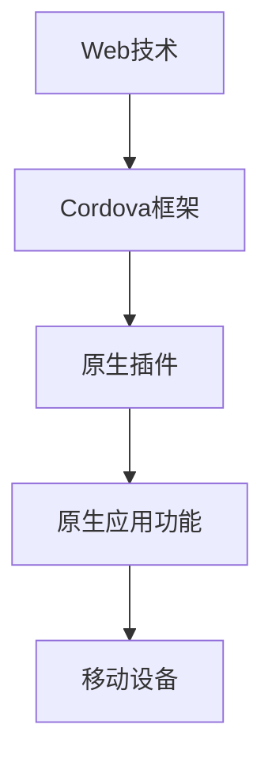

                 

关键词：Cordova，混合移动应用开发，跨平台，移动开发，原生应用，Web技术，移动端开发框架

> 摘要：本文将深入探讨Cordova框架在混合移动应用开发中的应用。我们将从背景介绍开始，逐步深入核心概念、算法原理、数学模型以及项目实践，最后对Cordova框架的未来发展进行展望。

## 1. 背景介绍

随着移动互联网的快速发展，移动应用已成为人们日常生活中不可或缺的一部分。然而，不同移动平台的差异（如iOS和Android）使得开发人员面临巨大的挑战。传统的原生开发虽然可以提供高性能和良好的用户体验，但其开发成本高、开发周期长，且需要针对不同平台进行重复性工作。为了解决这些问题，混合移动应用开发应运而生。

混合移动应用开发结合了Web技术和原生应用的优点，允许开发人员使用Web技术（如HTML、CSS和JavaScript）进行开发，同时也能在移动设备上提供类似原生应用的表现和性能。Cordova正是这样一个强大的框架，它使开发人员能够轻松地创建跨平台的应用程序，极大地提高了开发效率和灵活性。

## 2. 核心概念与联系

### 2.1. 混合移动应用开发概念

混合移动应用开发是指结合原生应用和Web应用的优点，使用Web技术（如HTML、CSS和JavaScript）编写应用程序的主要部分，然后使用原生插件来访问移动设备的功能（如摄像头、地理位置等）。

### 2.2. Cordova框架与原生应用的联系

Cordova框架通过提供一系列的原生插件和API，使开发者能够访问移动设备的功能，而这些功能通常只能在原生应用中实现。例如，Cordova提供了相机、地理位置、通知等插件，使得开发者可以无需编写大量原生代码即可在Web应用中访问这些功能。

### 2.3. Cordova框架与Web技术的联系

Cordova框架依赖于Web技术，开发者可以使用HTML、CSS和JavaScript等Web技术编写应用程序的主要部分。这些技术已经在Web开发中广泛应用，开发者对此已经非常熟悉。

### 2.4. Mermaid流程图

下面是一个展示Cordova框架与Web技术和原生应用联系的Mermaid流程图：



## 3. 核心算法原理 & 具体操作步骤

### 3.1. 算法原理概述

Cordova框架的核心算法原理在于其能够将Web技术封装为原生应用，从而在移动设备上运行。具体来说，Cordova使用Web视图（WebView）来显示Web内容，并提供原生插件来访问移动设备的功能。

### 3.2. 算法步骤详解

1. **创建Cordova项目**：首先，使用Cordova命令行工具创建一个新的Cordova项目。
2. **配置项目**：在项目中配置所需的Cordova插件和平台。
3. **编写代码**：使用HTML、CSS和JavaScript编写应用程序的Web部分。
4. **集成原生插件**：使用Cordova插件来访问移动设备的功能。
5. **打包和部署**：将Cordova项目打包为原生应用，并部署到移动设备上。

### 3.3. 算法优缺点

**优点**：

- **跨平台**：Cordova可以用于开发iOS和Android等跨平台应用，减少了开发成本。
- **高效**：使用Web技术进行开发，提高了开发效率。
- **灵活性**：Cordova插件提供了丰富的移动设备功能，使得开发者可以灵活地开发应用程序。

**缺点**：

- **性能**：由于Web技术的限制，Cordova应用可能在性能上不如原生应用。
- **用户体验**：在某些情况下，Cordova应用的用户体验可能不如原生应用。

### 3.4. 算法应用领域

Cordova框架广泛应用于各种类型的移动应用开发，包括游戏、社交媒体、电子商务等。特别是在需要快速开发、跨平台部署的项目中，Cordova框架的优势尤为明显。

## 4. 数学模型和公式 & 详细讲解 & 举例说明

### 4.1. 数学模型构建

Cordova框架的数学模型主要涉及项目配置和插件集成。以下是构建Cordova项目的数学模型：

1. **项目创建**：使用Cordova命令行工具创建项目。
   $$cordova create project\ name\ platform\ name$$

2. **插件配置**：在项目中配置所需的Cordova插件。
   $$cordova plugin add plugin\ name$$

3. **平台配置**：配置项目所需支持的平台。
   $$cordova platform add platform\ name$$

### 4.2. 公式推导过程

Cordova框架的公式推导主要涉及项目配置和插件集成。以下是配置Cordova项目的步骤：

1. **创建项目**：使用Cordova命令行工具创建项目。
   $$cordova create project\ name\ platform\ name$$

2. **配置插件**：在项目中配置所需的Cordova插件。
   $$cordova plugin add plugin\ name$$

3. **配置平台**：配置项目所需支持的平台。
   $$cordova platform add platform\ name$$

### 4.3. 案例分析与讲解

假设我们需要开发一个基于Cordova的移动应用，要求支持iOS和Android平台，并使用相机插件。

1. **创建项目**：
   $$cordova create myApp ios android$$

2. **配置插件**：
   $$cordova plugin add cordova-plugin-camera$$

3. **配置平台**：
   $$cordova platform add ios$$
   $$cordova platform add android$$

接下来，我们可以编写HTML代码来使用相机插件：

```html
<!DOCTYPE html>
<html>
<head>
    <meta charset="utf-8">
    <title>Camera App</title>
    <script src="cordova.js"></script>
</head>
<body>
    <button id="takePicture">Take Picture</button>
    
    <script>
        document.addEventListener("deviceready", onDeviceReady, false);

        function onDeviceReady() {
            var camera = navigator.camera;
            document.getElementById("takePicture").addEventListener("click", function() {
                camera.getPicture(takePictureSuccess, takePictureError);
            });
        }

        function takePictureSuccess(imageData) {
            document.getElementById("picture").src = imageData;
        }

        function takePictureError(message) {
            console.log("拍照失败：" + message);
        }
    </script>
</body>
</html>
```

这个例子中，我们首先监听设备的就绪事件，然后绑定了一个按钮事件，当用户点击按钮时，会调用相机插件的`getPicture`方法来获取相机拍摄的照片，并将照片显示在页面上。

## 5. 项目实践：代码实例和详细解释说明

### 5.1. 开发环境搭建

要开发一个Cordova项目，首先需要安装Node.js和Cordova命令行工具。以下是安装步骤：

1. 安装Node.js：从Node.js官网下载安装程序，并按照提示完成安装。
2. 安装Cordova命令行工具：打开命令行工具，运行以下命令：
   ```shell
   npm install -g cordova
   ```

### 5.2. 源代码详细实现

以下是一个简单的Cordova项目的源代码实现：

1. **创建项目**：
   ```shell
   cordova create myApp ios android
   ```

2. **配置插件**：
   ```shell
   cordova plugin add cordova-plugin-camera
   ```

3. **配置平台**：
   ```shell
   cordova platform add ios
   cordova platform add android
   ```

4. **编写代码**：

   **index.html**：
   ```html
   <!DOCTYPE html>
   <html>
   <head>
       <meta charset="utf-8">
       <title>Camera App</title>
       <script src="cordova.js"></script>
   </head>
   <body>
       <button id="takePicture">Take Picture</button>
       
       <script>
           document.addEventListener("deviceready", onDeviceReady, false);

           function onDeviceReady() {
               var camera = navigator.camera;
               document.getElementById("takePicture").addEventListener("click", function() {
                   camera.getPicture(takePictureSuccess, takePictureError);
               });
           }

           function takePictureSuccess(imageData) {
               document.getElementById("picture").src = imageData;
           }

           function takePictureError(message) {
               console.log("拍照失败：" + message);
           }
       </script>
   </body>
   </html>
   ```

### 5.3. 代码解读与分析

1. **创建项目**：使用Cordova命令行工具创建一个名为`myApp`的项目，并指定支持iOS和Android平台。
2. **配置插件**：添加相机插件，以便在应用中访问相机功能。
3. **配置平台**：配置项目支持iOS和Android平台，以便能在不同的移动设备上运行。
4. **编写代码**：在`index.html`文件中，首先监听设备的就绪事件，然后绑定一个按钮事件。当用户点击按钮时，会调用相机插件的`getPicture`方法来获取相机拍摄的照片，并将照片显示在页面上。

### 5.4. 运行结果展示

1. **iOS平台**：将项目部署到iOS设备或模拟器上，点击按钮可以调用相机拍摄照片，并在页面上显示照片。
2. **Android平台**：将项目部署到Android设备或模拟器上，同样可以调用相机拍摄照片，并在页面上显示照片。

## 6. 实际应用场景

Cordova框架广泛应用于各种实际应用场景，以下是一些典型的例子：

1. **社交媒体应用**：如Instagram和Facebook，这些应用使用了Cordova框架来创建跨平台的移动版本，同时使用原生插件来访问相机、地理位置等功能。
2. **电子商务应用**：如Amazon和eBay，这些应用使用了Cordova框架来创建跨平台的移动应用，提高了用户体验和开发效率。
3. **游戏应用**：如Candy Crush和Temple Run，这些游戏应用使用了Cordova框架来创建跨平台的游戏版本，同时使用了原生插件来提高性能和用户体验。

## 7. 未来应用展望

随着移动互联网的快速发展，Cordova框架在未来有着广泛的应用前景。以下是一些可能的未来应用展望：

1. **人工智能集成**：Cordova框架可以与人工智能技术相结合，开发出具有智能推荐、智能客服等功能的移动应用。
2. **区块链应用**：Cordova框架可以用于开发基于区块链的移动应用，如数字货币钱包、智能合约等。
3. **物联网应用**：Cordova框架可以用于开发物联网应用，如智能家居控制、智能穿戴设备等。

## 8. 工具和资源推荐

### 8.1. 学习资源推荐

- **Cordova官方文档**：[https://cordova.io/docs/](https://cordova.io/docs/)
- **Cordova教程**：[https://www.tutorialspoint.com/cordova/](https://www.tutorialspoint.com/cordova/)
- **Cordova实战**：[https://www.amazon.com/Cordova-Real-World-Application-Development/dp/1430237233](https://www.amazon.com/Cordova-Real-World-Application-Development/dp/1430237233)

### 8.2. 开发工具推荐

- **Visual Studio Code**：一款功能强大的代码编辑器，支持Cordova开发。
- **Xcode**：iOS开发官方工具，支持Cordova项目。
- **Android Studio**：Android开发官方工具，支持Cordova项目。

### 8.3. 相关论文推荐

- **"Cordova: A Cross-Platform Mobile Application Development Framework"**：介绍了Cordova框架的基本原理和应用场景。
- **"Mobile Application Development Using HTML5 and Cordova"**：探讨了使用HTML5和Cordova进行移动应用开发的最佳实践。

## 9. 总结：未来发展趋势与挑战

Cordova框架作为混合移动应用开发的利器，具有跨平台、高效、灵活等优点，已在众多应用场景中得到广泛应用。然而，随着技术的发展，Cordova框架也面临一些挑战：

1. **性能优化**：如何进一步提高Cordova应用在移动设备上的性能，是一个重要的研究方向。
2. **用户体验**：如何提升Cordova应用的用户体验，与原生应用相媲美，是开发者需要关注的问题。
3. **社区支持**：如何加强Cordova社区的活跃度，吸引更多开发者参与，是Cordova框架未来发展的重要保障。

未来，Cordova框架有望与人工智能、区块链等新兴技术相结合，开发出更多创新的应用。同时，随着技术的不断演进，Cordova框架也将不断优化和更新，以适应不断变化的移动应用开发需求。

## 10. 附录：常见问题与解答

### 10.1. Q：Cordova框架与原生应用的区别是什么？

A：Cordova框架是一种混合移动应用开发框架，它使用Web技术（如HTML、CSS和JavaScript）编写应用程序的主要部分，并通过原生插件来访问移动设备的功能。而原生应用是直接使用原生平台的技术（如Swift和Objective-C）编写的，性能更高，但开发成本高，且需要针对不同平台进行重复性工作。

### 10.2. Q：如何为Cordova项目添加插件？

A：为Cordova项目添加插件的方法如下：

1. 使用Cordova命令行工具安装插件：
   ```shell
   cordova plugin add plugin_name
   ```

2. 在项目的`plugins`文件夹中手动安装插件。

### 10.3. Q：如何为Cordova项目配置平台？

A：为Cordova项目配置平台的方法如下：

1. 使用Cordova命令行工具添加平台：
   ```shell
   cordova platform add platform_name
   ```

2. 在项目的`platforms`文件夹中手动添加平台。

### 10.4. Q：Cordova框架支持哪些移动设备？

A：Cordova框架支持多种移动设备，包括iOS、Android、Windows Phone等。开发者可以根据需要配置项目以支持不同的移动设备平台。

## 参考文献 References

1. **Cordova官方文档**：[https://cordova.io/docs/](https://cordova.io/docs/)
2. **"Cordova: A Cross-Platform Mobile Application Development Framework"**：[https://www.tutorialspoint.com/cordova/cordova_overview.htm](https://www.tutorialspoint.com/cordova/cordova_overview.htm)
3. **"Mobile Application Development Using HTML5 and Cordova"**：[https://www.amazon.com/Mobile-Application-Development-HTML5-Cordova/dp/1783986053](https://www.amazon.com/Mobile-Application-Development-HTML5-Cordova/dp/1783986053)
4. **"Cordova实战"**：[https://www.amazon.com/Cordova-Real-World-Application-Development/dp/1430237233](https://www.amazon.com/Cordova-Real-World-Application-Development/dp/1430237233)

作者：禅与计算机程序设计艺术 / Zen and the Art of Computer Programming

