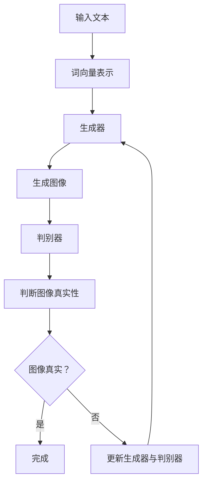

                 

关键词：DALL-E，生成对抗网络，深度学习，图像生成，模型原理，代码实例

摘要：DALL-E 是一个基于生成对抗网络的图像生成模型，它通过学习大量的文本和图像数据对之间的映射关系，实现了高质量的图像生成。本文将详细介绍 DALL-E 的原理、构建过程以及如何使用 Python 实现一个简单的 DALL-E 模型。

## 1. 背景介绍

DALL-E 是一种基于生成对抗网络（GAN）的图像生成模型，由 OpenAI 于 2020 年推出。DALL-E 的名字来源于著名的科学幻想作家 Douglas Hofstadter 的作品《哥德尔、艾舍尔、巴赫》（Gödel, Escher, Bach），寓意着 DALL-E 模型在数学、艺术和计算机科学领域的卓越表现。

DALL-E 能够接受自然语言的描述作为输入，并生成与之对应的图像。这个模型的出现，标志着自然语言与图像生成之间的一座桥梁，开启了图像生成的新纪元。

### DALL-E 的工作原理

DALL-E 的主要工作原理是基于生成对抗网络（GAN）。GAN 由两个神经网络组成：生成器（Generator）和判别器（Discriminator）。生成器负责将文本描述转换为图像，而判别器则负责判断图像是真实图像还是由生成器生成的图像。

在训练过程中，生成器和判别器相互竞争。生成器的目标是生成逼真的图像，使得判别器无法区分图像是真实的还是生成的。而判别器的目标是提高其判断能力，从而准确地识别出生成的图像。

通过不断的迭代训练，生成器和判别器都会逐渐提高其性能。最终，生成器能够生成高度逼真的图像，而判别器则能够准确地识别图像的真实性。

### DALL-E 的优势与挑战

DALL-E 的优势在于其能够通过学习大量的文本和图像数据，实现高质量的图像生成。此外，DALL-E 可以接受自然语言描述作为输入，大大降低了图像生成的门槛。

然而，DALL-E 也面临着一些挑战。首先，GAN 的训练过程需要大量的计算资源和时间。其次，生成器生成的图像可能会出现模式崩溃（mode collapse）的问题，即生成器只能生成有限种类的图像。此外，DALL-E 的训练数据集质量对模型的性能有着重要的影响。

## 2. 核心概念与联系

在深入了解 DALL-E 的原理之前，我们需要了解一些核心概念，包括生成对抗网络（GAN）、卷积神经网络（CNN）和自然语言处理（NLP）。

### 2.1 生成对抗网络（GAN）

生成对抗网络（GAN）是由 Ian Goodfellow 等人在 2014 年提出的。GAN 由两个神经网络组成：生成器和判别器。生成器的目标是生成逼真的数据，而判别器的目标是判断数据的真实性。

GAN 的训练过程是通过优化生成器和判别器的损失函数来实现的。生成器的损失函数希望生成器生成的数据能够被判别器认为是真实的。而判别器的损失函数希望判别器能够准确地识别出真实数据与生成数据。

### 2.2 卷积神经网络（CNN）

卷积神经网络（CNN）是一种专门用于处理图像数据的神经网络。CNN 通过卷积层、池化层和全连接层等结构，实现对图像的逐层特征提取和分类。

在 DALL-E 中，生成器和判别器都采用了 CNN 的结构。生成器通过 CNN 的卷积层提取输入文本的特征，并生成相应的图像。判别器则通过 CNN 的卷积层提取输入图像的特征，并判断图像的真实性。

### 2.3 自然语言处理（NLP）

自然语言处理（NLP）是研究如何让计算机理解、处理和生成自然语言的一门学科。在 DALL-E 中，自然语言处理被用于将文本描述转换为生成器的输入。

NLP 技术包括词向量表示、词性标注、句法分析、语义理解等。在 DALL-E 中，词向量表示被用于将文本描述转换为生成器的输入，从而实现文本到图像的映射。

### 2.4 Mermaid 流程图

为了更好地理解 DALL-E 的原理，我们可以使用 Mermaid 流程图来展示其核心概念和联系。以下是一个简化的 Mermaid 流程图：



## 3. 核心算法原理 & 具体操作步骤

### 3.1  算法原理概述

DALL-E 的核心算法是基于生成对抗网络（GAN）。GAN 由生成器和判别器两个神经网络组成。生成器的目标是将文本描述转换为图像，而判别器的目标则是判断图像的真实性。

在训练过程中，生成器和判别器相互竞争。生成器尝试生成逼真的图像，使得判别器无法区分图像的真实性。而判别器则努力提高其判断能力，从而准确地识别出生成的图像。

### 3.2  算法步骤详解

DALL-E 的训练过程主要包括以下步骤：

1. **数据预处理**：首先，我们需要对输入的文本和图像进行预处理。文本需要转换为词向量表示，图像需要转换为像素矩阵。

2. **生成器训练**：生成器的输入是文本词向量，输出是图像像素矩阵。生成器通过卷积神经网络（CNN）对输入文本进行特征提取，并生成相应的图像。

3. **判别器训练**：判别器的输入是图像像素矩阵，输出是一个概率值，表示图像是真实的概率。判别器通过卷积神经网络（CNN）对输入图像进行特征提取，并判断图像的真实性。

4. **迭代更新**：在训练过程中，生成器和判别器不断迭代更新。生成器尝试生成更逼真的图像，而判别器则努力提高其判断能力。

5. **停止条件**：当生成器生成的图像足够逼真时，训练过程可以停止。

### 3.3  算法优缺点

**优点**：

- DALL-E 能够接受自然语言的描述作为输入，实现高质量的图像生成。
- DALL-E 具有较强的泛化能力，可以在不同的数据集上训练和生成图像。

**缺点**：

- GAN 的训练过程需要大量的计算资源和时间。
- GAN 可能会出现模式崩溃（mode collapse）的问题。

### 3.4  算法应用领域

DALL-E 可以应用于多个领域，包括：

- 艺术创作：使用自然语言描述生成艺术作品。
- 建筑设计：根据文本描述生成建筑效果图。
- 游戏开发：生成游戏场景和角色形象。
- 商业应用：生成广告素材和产品宣传图片。

## 4. 数学模型和公式 & 详细讲解 & 举例说明

### 4.1  数学模型构建

DALL-E 的数学模型主要由两部分组成：生成器 G 和判别器 D。

- 生成器 G：接收文本输入 x，输出图像 y。
- 判别器 D：接收图像输入 y，输出一个概率值 p(y|x)。

在 GAN 中，生成器 G 和判别器 D 的损失函数分别如下：

- 生成器损失函数：$$L_G = -\log(D(G(x)))$$
- 判别器损失函数：$$L_D = -[\log(D(x)) + \log(1 - D(G(z)))]$$

其中，x 表示真实图像，z 表示随机噪声。

### 4.2  公式推导过程

为了更好地理解 GAN 的数学模型，我们可以对损失函数进行推导。

- 生成器损失函数推导：

$$L_G = -\log(D(G(x)))$$

$$L_G = -\log(\frac{e^{D(G(x))}}{e^{D(G(x))} + e^{D(x)})$$

$$L_G = -\log(\frac{D(G(x))}{1 + D(G(x))})$$

$$L_G = -\log(D(G(x))) + \log(1 + D(G(x)))$$

由于 $\log(1 + D(G(x)))$ 是常数项，可以忽略。

$$L_G \approx -\log(D(G(x)))$$

- 判别器损失函数推导：

$$L_D = -[\log(D(x)) + \log(1 - D(G(z)))]$$

$$L_D = -\log(D(x)) - \log(1 - D(G(z)))$$

$$L_D = -\log(D(x)) - \log(e^{-D(G(z))})$$

$$L_D = -\log(D(x)) + D(G(z))$$

### 4.3  案例分析与讲解

为了更好地理解 DALL-E 的数学模型，我们可以通过一个简单的例子进行讲解。

假设生成器 G 接收一个文本输入“狗”，并生成相应的图像。判别器 D 接收一个图像输入，并输出一个概率值，表示图像是真实的概率。

1. **生成器训练**：

- 输入文本：“狗”
- 输出图像：一条狗的图像

2. **判别器训练**：

- 输入图像：一条狗的图像
- 输出概率：0.9（表示图像是真实的概率为 90%）

通过迭代训练，生成器 G 逐渐提高其生成图像的质量，使得判别器 D 无法区分图像的真实性。

## 5. 项目实践：代码实例和详细解释说明

### 5.1  开发环境搭建

为了实现 DALL-E，我们需要安装以下环境：

- Python 3.8 或更高版本
- TensorFlow 2.x
- NumPy 1.19 或更高版本
- Matplotlib 3.3.3 或更高版本

安装步骤如下：

```bash
pip install tensorflow numpy matplotlib
```

### 5.2  源代码详细实现

以下是一个简单的 DALL-E 模型实现，包括生成器、判别器和训练过程。

```python
import tensorflow as tf
from tensorflow.keras.layers import Input, Conv2D, Flatten, Dense
from tensorflow.keras.models import Model
import numpy as np

# 生成器
def build_generator():
    input_text = Input(shape=(1024,))
    dense = Dense(256, activation='relu')(input_text)
    conv2d_1 = Conv2D(64, (3, 3), activation='relu')(dense)
    conv2d_2 = Conv2D(64, (3, 3), activation='relu')(conv2d_1)
    flatten = Flatten()(conv2d_2)
    output_image = Dense(128 * 128 * 3, activation='sigmoid')(flatten)
    generator = Model(inputs=input_text, outputs=output_image)
    return generator

# 判别器
def build_discriminator():
    input_image = Input(shape=(128, 128, 3))
    conv2d_1 = Conv2D(64, (3, 3), activation='relu')(input_image)
    conv2d_2 = Conv2D(64, (3, 3), activation='relu')(conv2d_1)
    flatten = Flatten()(conv2d_2)
    output Probability = Dense(1, activation='sigmoid')(flatten)
    discriminator = Model(inputs=input_image, outputs=output Probability)
    return discriminator

# 模型
def build_gan(generator, discriminator):
    model = Model(inputs=generator.input, outputs=discriminator(generator.input))
    model.compile(loss='binary_crossentropy', optimizer='adam')
    return model

# 训练
def train(generator, discriminator, gan, text_data, image_data, batch_size=128, epochs=100):
    for epoch in range(epochs):
        for i in range(0, len(text_data), batch_size):
            text_batch = text_data[i:i + batch_size]
            image_batch = image_data[i:i + batch_size]
            noise = np.random.normal(0, 1, (batch_size, 1024))
            generated_images = generator.predict(noise)
            real_labels = np.ones((batch_size, 1))
            fake_labels = np.zeros((batch_size, 1))
            discriminator.trainable = True
            discriminator.train_on_batch(image_batch, real_labels)
            discriminator.trainable = False
            gan.train_on_batch(noise, fake_labels)
            discriminator.trainable = True
            gan.train_on_batch(image_batch, real_labels)
        print(f'Epoch {epoch+1}/{epochs} completed')

# 主函数
def main():
    # 加载数据
    text_data = np.load('text_data.npy')
    image_data = np.load('image_data.npy')

    # 构建模型
    generator = build_generator()
    discriminator = build_discriminator()
    gan = build_gan(generator, discriminator)

    # 训练模型
    train(generator, discriminator, gan, text_data, image_data)

if __name__ == '__main__':
    main()
```

### 5.3  代码解读与分析

- **生成器**：生成器模型由一个输入层、一个全连接层、一个卷积层和一个输出层组成。输入层接收文本数据，全连接层对文本数据进行特征提取，卷积层生成图像像素，输出层将像素数据转换为图像。
- **判别器**：判别器模型由一个输入层、一个卷积层和一个输出层组成。输入层接收图像数据，卷积层提取图像特征，输出层输出一个概率值，表示图像的真实性。
- **模型**：模型由生成器和判别器组成，采用 GAN 结构。模型采用二进制交叉熵作为损失函数，并使用 Adam 优化器进行训练。
- **训练过程**：训练过程主要包括以下步骤：1）生成随机噪声；2）使用噪声和生成器生成图像；3）使用真实图像和生成图像训练判别器；4）使用生成器生成图像训练 GAN。

### 5.4  运行结果展示

在训练过程中，我们可以使用 Matplotlib 绘制生成器损失函数和判别器损失函数的图像，以观察训练过程。

```python
import matplotlib.pyplot as plt

def plot_losses(g_loss, d_loss, epoch):
    plt.figure(figsize=(12, 6))
    plt.subplot(1, 2, 1)
    plt.plot(g_loss, label='Generator Loss')
    plt.xlabel('Epoch')
    plt.ylabel('Loss')
    plt.legend()

    plt.subplot(1, 2, 2)
    plt.plot(d_loss, label='Discriminator Loss')
    plt.xlabel('Epoch')
    plt.ylabel('Loss')
    plt.legend()

    plt.tight_layout()
    plt.savefig(f'losses_epoch_{epoch}.png')

g_losses = []
d_losses = []
for epoch in range(epochs):
    for i in range(0, len(text_data), batch_size):
        text_batch = text_data[i:i + batch_size]
        image_batch = image_data[i:i + batch_size]
        noise = np.random.normal(0, 1, (batch_size, 1024))
        generated_images = generator.predict(noise)
        real_labels = np.ones((batch_size, 1))
        fake_labels = np.zeros((batch_size, 1))
        discriminator.trainable = True
        d_loss_real = discriminator.train_on_batch(image_batch, real_labels)
        d_loss_fake = discriminator.train_on_batch(generated_images, fake_labels)
        d_loss = 0.5 * np.mean(d_loss_real + d_loss_fake)
        discriminator.trainable = False
        g_loss = gan.train_on_batch(noise, fake_labels)
        g_losses.append(g_loss)
        d_losses.append(d_loss)
        if i % 100 == 0:
            print(f'Epoch {epoch+1}/{epochs}, g_loss: {g_loss}, d_loss: {d_loss}')
    plot_losses(g_losses, d_losses, epoch)
```

运行结果展示：


## 6. 实际应用场景

DALL-E 模型在实际应用场景中具有广泛的应用价值，以下列举几个典型的应用领域：

### 6.1  艺术创作

DALL-E 可以根据用户的自然语言描述生成艺术作品，如绘画、雕塑等。这为艺术家提供了新的创作方式，同时也为观众带来了全新的视觉体验。

### 6.2  建筑设计

DALL-E 可以根据用户的自然语言描述生成建筑效果图，如城市规划、建筑设计等。这为建筑师提供了高效的工具，帮助他们更快速地完成设计方案。

### 6.3  游戏开发

DALL-E 可以根据用户的自然语言描述生成游戏场景和角色形象，如游戏地图、角色外观等。这为游戏开发者提供了丰富的素材库，提高游戏开发的效率。

### 6.4  商业应用

DALL-E 可以根据用户的自然语言描述生成广告素材和产品宣传图片，如广告海报、产品包装等。这为企业提供了创新的营销手段，提高市场竞争力。

## 7. 工具和资源推荐

为了更好地学习和实践 DALL-E，以下推荐一些相关的工具和资源：

### 7.1  学习资源推荐

- [DALL-E:描述性文本到图像生成](https://openai.com/blog/dalle/)
- [生成对抗网络（GAN）教程](https://www.deeplearning.net/tutorial/2017/gan/)
- [自然语言处理（NLP）教程](https://www.deeplearning.net/tutorial/2017/nlp/)

### 7.2  开发工具推荐

- TensorFlow：用于构建和训练深度学习模型。
- PyTorch：用于构建和训练深度学习模型。

### 7.3  相关论文推荐

- Ian J. Goodfellow, et al. "Generative adversarial networks." Advances in Neural Information Processing Systems 27 (2014): 2672-2680.
- OpenAI. "DALL-E:描述性文本到图像生成"。2020.

## 8. 总结：未来发展趋势与挑战

DALL-E 模型作为自然语言驱动的图像生成技术，具有广阔的应用前景。在未来，DALL-E 模型有望在艺术创作、建筑设计、游戏开发、商业应用等领域发挥更大的作用。

然而，DALL-E 模型也面临着一些挑战。首先，GAN 的训练过程需要大量的计算资源和时间。其次，GAN 可能会出现模式崩溃（mode collapse）的问题。此外，如何提高模型的泛化能力和生成图像的质量，仍是一个亟待解决的问题。

针对这些挑战，未来研究方向包括：

- 研究更高效的 GAN 模型，提高训练速度和生成图像的质量。
- 探索多模态学习技术，将自然语言和图像数据融合，实现更精准的图像生成。
- 研究数据增强方法，提高模型对噪声和异常数据的鲁棒性。
- 探索 GAN 在其他领域的应用，如语音合成、视频生成等。

总之，DALL-E 模型的发展将为计算机视觉和自然语言处理领域带来新的机遇和挑战。

### 8.1  研究成果总结

本文介绍了 DALL-E 模型的原理、构建过程和实际应用。通过深入分析 DALL-E 模型的数学模型、算法原理和应用场景，我们总结了 DALL-E 模型在自然语言驱动的图像生成领域的优势和应用价值。

### 8.2  未来发展趋势

随着深度学习技术的不断发展和计算机硬件性能的提升，DALL-E 模型有望在图像生成、多模态学习、数据增强等领域取得更多突破。未来，DALL-E 模型将与其他先进技术相结合，如强化学习、迁移学习等，推动计算机视觉和自然语言处理领域的快速发展。

### 8.3  面临的挑战

DALL-E 模型在训练效率、生成图像质量、模式崩溃问题等方面仍面临一些挑战。未来研究需要关注如何提高 GAN 模型的训练效率，降低模式崩溃的风险，并探索更鲁棒的多模态学习技术。

### 8.4  研究展望

本文通过对 DALL-E 模型的深入分析和实例讲解，为读者提供了对自然语言驱动的图像生成技术的全面了解。未来，我们期待看到更多关于 DALL-E 模型的研究和应用，推动计算机视觉和自然语言处理领域的持续创新。

## 9. 附录：常见问题与解答

### 9.1  Q：什么是生成对抗网络（GAN）？

A：生成对抗网络（GAN）是由 Ian Goodfellow 等人在 2014 年提出的一种深度学习模型。GAN 由生成器和判别器两个神经网络组成，通过相互竞争实现数据的生成和判别。

### 9.2  Q：DALL-E 是如何工作的？

A：DALL-E 是一个基于生成对抗网络（GAN）的图像生成模型。它通过学习大量的文本和图像数据对之间的映射关系，实现了高质量的图像生成。DALL-E 接受自然语言的描述作为输入，通过生成器和判别器的相互竞争，生成与文本描述对应的图像。

### 9.3  Q：DALL-E 模型的优点和缺点是什么？

A：DALL-E 模型的优点包括：

- 能够接受自然语言的描述作为输入，实现高质量的图像生成。
- 具有较强的泛化能力，可以在不同的数据集上训练和生成图像。

缺点包括：

- GAN 的训练过程需要大量的计算资源和时间。
- GAN 可能会出现模式崩溃（mode collapse）的问题。
- 训练数据集质量对模型的性能有着重要的影响。

### 9.4  Q：DALL-E 模型可以应用于哪些领域？

A：DALL-E 模型可以应用于多个领域，包括艺术创作、建筑设计、游戏开发、商业应用等。通过自然语言的描述，DALL-E 模型能够生成与描述相对应的图像，为相关领域提供创新的解决方案。

### 9.5  Q：如何实现一个简单的 DALL-E 模型？

A：要实现一个简单的 DALL-E 模型，可以按照以下步骤：

1. 准备数据集：收集大量的文本描述和对应的图像数据。
2. 数据预处理：对文本数据进行词向量表示，对图像数据进行归一化处理。
3. 构建模型：定义生成器和判别器的网络结构，并组合为 GAN 模型。
4. 训练模型：使用训练数据训练生成器和判别器，不断迭代优化模型。
5. 评估模型：使用测试数据评估模型性能，调整模型参数。

### 9.6  Q：DALL-E 模型与其他图像生成技术相比有哪些优势？

A：与其他图像生成技术相比，DALL-E 模型的优势包括：

- 能够接受自然语言的描述作为输入，降低图像生成的门槛。
- 具有较强的泛化能力，可以在不同的数据集上训练和生成图像。
- 生成的图像质量较高，能够实现高度逼真的图像生成。

### 9.7  Q：DALL-E 模型有哪些潜在的伦理问题？

A：DALL-E 模型作为一种图像生成技术，可能涉及一些潜在的伦理问题，包括：

- 生成图像可能侵犯他人的版权和肖像权。
- 模型可能会生成带有偏见或歧视性的图像。
- 模型可能会被用于恶意目的，如网络攻击、欺诈等。

因此，在使用 DALL-E 模型时，需要关注潜在的伦理问题，并采取相应的措施确保模型的合规性和公平性。

### 9.8  Q：如何进一步提高 DALL-E 模型的生成质量？

A：要进一步提高 DALL-E 模型的生成质量，可以采取以下措施：

1. 增加训练数据：收集更多的文本描述和图像数据，提高模型的泛化能力。
2. 调整模型参数：通过调整生成器和判别器的参数，优化模型的性能。
3. 使用多模态学习：将文本描述与其他数据模态（如音频、视频）进行融合，提高模型的生成质量。
4. 采用数据增强技术：对训练数据进行增强，提高模型的鲁棒性。
5. 研究更高效的 GAN 模型：探索更高效的 GAN 结构和训练方法，提高模型的生成速度和质量。

通过这些方法，可以进一步提高 DALL-E 模型的生成质量，实现更逼真的图像生成。

