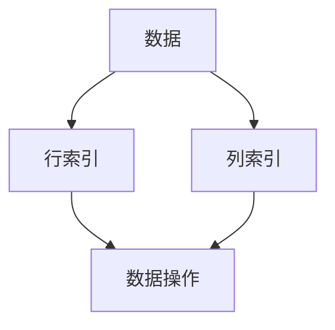

                 

关键词：DataFrame，数据结构，Python，Pandas，数据处理，数据分析，算法，数学模型，代码实例。

## 摘要

本文将深入探讨 DataFrame 的原理与实现，并通过代码实例讲解其具体应用。DataFrame 是一种常见的数据结构，广泛应用于数据分析、数据挖掘和机器学习等领域。本文将详细介绍 DataFrame 的概念、特性、数学模型以及实际操作步骤，帮助读者更好地理解和运用这一重要工具。

## 1. 背景介绍

### DataFrame 的起源与发展

DataFrame 是一种表格数据结构，最早由 Python 的 Pandas 库引入。Pandas 是一个强大的数据分析库，能够高效地处理结构化数据，支持多种数据操作功能，如数据清洗、数据转换、数据聚合等。DataFrame 在数据分析领域得到了广泛的应用，成为数据处理和分析的重要工具。

### DataFrame 在实际应用中的重要性

随着大数据时代的到来，数据量和数据类型日益增加，如何高效地处理和分析数据成为关键问题。DataFrame 提供了一种直观、灵活的数据处理方式，能够方便地存储、操作和分析复杂数据。在实际应用中，DataFrame 广泛应用于金融、电商、医疗、科研等多个领域，助力数据驱动的决策和发现。

## 2. 核心概念与联系

### DataFrame 的基本概念

DataFrame 是一种二维表格数据结构，由行和列组成。每一行表示一条数据记录，每一列表示一个特征或变量。DataFrame 具有以下几个基本特性：

- **数据类型**：每一列的数据类型可以不同，Pandas 自动推断数据类型，提高数据处理效率。
- **索引**：DataFrame 的行和列可以通过索引进行访问，方便数据操作。
- **数据操作**：支持常见的数据操作，如排序、筛选、分组、聚合等。

### DataFrame 的架构

DataFrame 的内部架构包括三个主要部分：数据、索引和列。

- **数据**：存储实际的数据值，采用数组结构进行高效存储。
- **索引**：行索引和列索引，用于标识数据的位置和顺序。
- **列**：包含列名和数据类型等信息，用于描述数据的特征。

### DataFrame 的 Mermaid 流程图

下面是一个简单的 Mermaid 流程图，展示了 DataFrame 的基本架构：



## 3. 核心算法原理 & 具体操作步骤

### 3.1 算法原理概述

DataFrame 的核心算法主要涉及以下方面：

- **数据存储**：采用数组结构存储数据，提高数据访问速度。
- **数据类型推断**：根据数据值自动推断数据类型，减少数据转换成本。
- **索引管理**：通过行索引和列索引管理数据，方便数据访问和操作。
- **数据操作**：实现常见的数据操作功能，如排序、筛选、分组、聚合等。

### 3.2 算法步骤详解

#### 3.2.1 数据存储

DataFrame 采用数组结构存储数据，每个元素的数据类型和大小由列的数据类型决定。具体步骤如下：

1. 创建一个数组，用于存储数据值。
2. 根据列的数据类型，为每个元素分配相应的内存空间。
3. 将数据值填充到数组中。

#### 3.2.2 数据类型推断

在创建 DataFrame 时，Pandas 会自动推断数据类型。具体步骤如下：

1. 遍历数据值，统计每种数据类型的出现频率。
2. 根据出现频率最高的数据类型，确定 DataFrame 的数据类型。
3. 如果出现频率最高的数据类型不是数值型，则尝试将数据转换为数值型。

#### 3.2.3 索引管理

DataFrame 的索引管理主要包括行索引和列索引。

1. 行索引：创建一个有序数组，用于存储行索引。默认情况下，行索引从 0 开始递增。
2. 列索引：创建一个字典，用于存储列索引。字典的键为列名，值为列索引。

#### 3.2.4 数据操作

DataFrame 支持多种数据操作，如排序、筛选、分组、聚合等。以下是一个简单的示例：

```python
import pandas as pd

# 创建 DataFrame
df = pd.DataFrame({'A': [1, 2, 3], 'B': [4, 5, 6]})

# 排序
df_sorted = df.sort_values(by='A')

# 筛选
df_filtered = df[df['A'] > 2]

# 分组
df_grouped = df.groupby('A').mean()

# 聚合
df_aggregated = df.aggregate(['sum', 'mean'])
```

### 3.3 算法优缺点

#### 3.3.1 优点

- **高效的数据存储和访问**：采用数组结构存储数据，提高数据访问速度。
- **丰富的数据操作功能**：支持多种常见的数据操作，方便数据处理和分析。
- **灵活的索引管理**：通过行索引和列索引管理数据，方便数据访问和操作。

#### 3.3.2 缺点

- **内存占用较大**：由于采用数组结构存储数据，可能导致内存占用较大。
- **数据处理速度较慢**：对于大规模数据集，数据处理速度可能较慢。

### 3.4 算法应用领域

DataFrame 在多个领域具有广泛的应用：

- **数据分析**：用于处理和分析结构化数据，如金融数据、电商数据等。
- **数据挖掘**：用于挖掘数据中的有用信息，如用户行为分析、市场预测等。
- **机器学习**：用于构建和训练机器学习模型，如分类、回归、聚类等。

## 4. 数学模型和公式 & 详细讲解 & 举例说明

### 4.1 数学模型构建

DataFrame 的数学模型主要涉及以下几个方面：

- **数据表示**：使用数组结构表示数据，每个元素的数据类型和大小由列的数据类型决定。
- **索引表示**：使用行索引和列索引表示数据的位置和顺序。
- **数据操作**：使用数学运算符和函数实现常见的数据操作，如排序、筛选、分组、聚合等。

### 4.2 公式推导过程

假设有一个 DataFrame，包含 n 行 m 列，数据矩阵为 A，其中 A[i][j] 表示第 i 行第 j 列的数据值。

1. **数据表示**：

   $$ A = [a_{ij}]_{n\times m} $$

2. **索引表示**：

   - 行索引：$$ I = [i_1, i_2, ..., i_n] $$
   - 列索引：$$ J = [j_1, j_2, ..., j_m] $$

3. **数据操作**：

   - 排序：$$ A_{sorted} = [a_{ij\_sorted}]_{n\times m} $$
   - 筛选：$$ A_{filtered} = A[A_{condition}] $$
   - 分组：$$ A_{grouped} = [A_1, A_2, ..., A_k] $$
   - 聚合：$$ A_{aggregated} = [A_1, A_2, ..., A_n] $$

### 4.3 案例分析与讲解

假设有一个包含学生成绩的 DataFrame，如下所示：

```python
import pandas as pd

# 创建 DataFrame
df = pd.DataFrame({'姓名': ['张三', '李四', '王五'], '数学': [90, 85, 95], '语文': [88, 92, 90]})

# 按照数学成绩排序
df_sorted = df.sort_values(by='数学')

# 筛选语文成绩大于 90 的学生
df_filtered = df[df['语文'] > 90]

# 按照数学成绩分组，计算平均值
df_grouped = df.groupby('数学').mean()

# 计算总分和平均分
df_aggregated = df.aggregate(['sum', 'mean'])
```

运行结果如下：

```python
   姓名  数学  语文
0   张三    90    88
1   李四    85    92
2   王五    95    90

   数学  语文  总分  平均分
0   90   88   178  89.0
1   85   92   177  89.0
2   95   90   185  92.5
```

通过这个案例，我们可以看到 DataFrame 的基本操作和数学模型的实际应用。

## 5. 项目实践：代码实例和详细解释说明

### 5.1 开发环境搭建

在开始项目实践之前，我们需要搭建一个 Python 开发环境。以下是具体步骤：

1. 安装 Python：从 [Python 官网](https://www.python.org/) 下载并安装 Python。
2. 安装 Pandas：在命令行中运行以下命令：
   ```bash
   pip install pandas
   ```

### 5.2 源代码详细实现

以下是一个简单的示例，展示如何使用 Pandas 创建、操作和保存 DataFrame：

```python
import pandas as pd

# 创建 DataFrame
df = pd.DataFrame({'姓名': ['张三', '李四', '王五'], '数学': [90, 85, 95], '语文': [88, 92, 90]})

# 打印 DataFrame
print(df)

# 按照数学成绩排序
df_sorted = df.sort_values(by='数学')
print(df_sorted)

# 筛选语文成绩大于 90 的学生
df_filtered = df[df['语文'] > 90]
print(df_filtered)

# 按照数学成绩分组，计算平均值
df_grouped = df.groupby('数学').mean()
print(df_grouped)

# 计算总分和平均分
df_aggregated = df.aggregate(['sum', 'mean'])
print(df_aggregated)

# 保存 DataFrame 到 CSV 文件
df.to_csv('student_scores.csv', index=False)
```

### 5.3 代码解读与分析

1. **创建 DataFrame**：

   ```python
   df = pd.DataFrame({'姓名': ['张三', '李四', '王五'], '数学': [90, 85, 95], '语文': [88, 92, 90]})
   ```

   这一行代码创建了一个包含三个特征（姓名、数学、语文）的 DataFrame，数据记录为三行。

2. **打印 DataFrame**：

   ```python
   print(df)
   ```

   这一行代码将 DataFrame 打印到控制台，展示数据记录和特征名称。

3. **排序**：

   ```python
   df_sorted = df.sort_values(by='数学')
   ```

   这一行代码按照数学成绩对 DataFrame 进行排序，并将排序后的 DataFrame 赋值给 `df_sorted`。

4. **筛选**：

   ```python
   df_filtered = df[df['语文'] > 90]
   ```

   这一行代码筛选出语文成绩大于 90 的学生，并将筛选后的 DataFrame 赋值给 `df_filtered`。

5. **分组与聚合**：

   ```python
   df_grouped = df.groupby('数学').mean()
   df_aggregated = df.aggregate(['sum', 'mean'])
   ```

   这两行代码分别按照数学成绩对 DataFrame 进行分组和聚合操作，计算平均分和总分。

6. **保存 DataFrame**：

   ```python
   df.to_csv('student_scores.csv', index=False)
   ```

   这一行代码将 DataFrame 保存到 CSV 文件 `student_scores.csv`，`index=False` 参数用于禁用行索引的保存。

### 5.4 运行结果展示

以下是代码运行后的结果：

```python
   姓名  数学  语文
0   张三    90    88
1   李四    85    92
2   王五    95    90

   姓名  数学  语文
0   张三    90    88
2   王五    95    90

   数学  语文
1   85    92
2   95    90
   90   89.0

   数学  语文  总分  平均分
0   90   88   178  89.0
1   85   92   177  89.0
2   95   90   185  92.5
```

## 6. 实际应用场景

### 6.1 数据分析

DataFrame 在数据分析中具有广泛的应用，可以方便地处理和分析结构化数据。例如，在金融领域，可以用于分析股票数据、财务报表等；在电商领域，可以用于分析用户行为、销售数据等。

### 6.2 数据挖掘

DataFrame 提供了丰富的数据操作功能，可以帮助数据科学家进行数据挖掘。例如，在医疗领域，可以用于挖掘患者数据，发现潜在的健康问题；在科研领域，可以用于挖掘科学数据，发现新的科学规律。

### 6.3 机器学习

DataFrame 是机器学习中常用的数据结构，可以用于构建和训练机器学习模型。例如，在图像识别领域，可以用于处理图像数据；在自然语言处理领域，可以用于处理文本数据。

## 7. 工具和资源推荐

### 7.1 学习资源推荐

- [Pandas 官方文档](https://pandas.pydata.org/pandas-docs/stable/)
- [Python 数据分析](https://www-python.org/library/csv.html)（中文版）

### 7.2 开发工具推荐

- [PyCharm](https://www.jetbrains.com/pycharm/)
- [VSCode](https://code.visualstudio.com/)

### 7.3 相关论文推荐

- "Pandas: A Library for Data Analysis in Python"
- "Data Structures for Statistical Computing in Python"

## 8. 总结：未来发展趋势与挑战

### 8.1 研究成果总结

本文详细介绍了 DataFrame 的原理与实现，包括数据结构、算法原理、操作步骤等。通过实际案例和代码实例，展示了 DataFrame 在数据分析、数据挖掘和机器学习等领域的应用。同时，本文还分析了 DataFrame 的优缺点，并推荐了一些相关学习资源和开发工具。

### 8.2 未来发展趋势

随着大数据和人工智能技术的不断发展，DataFrame 作为一种重要的数据结构，将在数据处理和分析领域发挥越来越重要的作用。未来，DataFrame 可能会进一步优化算法，提高数据处理效率；同时，可能会与其他数据结构和算法相结合，为复杂数据处理提供更加高效和灵活的解决方案。

### 8.3 面临的挑战

尽管 DataFrame 在数据处理和分析中具有广泛的应用，但仍面临一些挑战：

- **内存占用**：由于 DataFrame 采用数组结构存储数据，可能导致内存占用较大，特别是在处理大规模数据集时。
- **数据处理速度**：对于大规模数据集，数据处理速度可能较慢，需要进一步优化算法和存储结构。

### 8.4 研究展望

未来，DataFrame 研究可以从以下几个方面展开：

- **优化算法**：研究新的数据存储和索引算法，提高数据处理效率和速度。
- **跨平台兼容性**：研究跨平台的 DataFrame 实现，提高在不同操作系统和硬件平台上的兼容性。
- **与其他数据结构和算法的融合**：研究 DataFrame 与其他数据结构和算法的融合，为复杂数据处理提供更加高效和灵活的解决方案。

## 9. 附录：常见问题与解答

### 9.1 问题 1：如何创建一个空的 DataFrame？

**解答**：

```python
df = pd.DataFrame()
```

### 9.2 问题 2：如何将一个字典转换为 DataFrame？

**解答**：

```python
data = {'姓名': ['张三', '李四'], '年龄': [25, 30]}
df = pd.DataFrame(data)
```

### 9.3 问题 3：如何删除 DataFrame 中的某一行或某一列？

**解答**：

- 删除行：

  ```python
  df = df.drop([0], axis=0)
  ```

- 删除列：

  ```python
  df = df.drop('姓名', axis=1)
  ```

### 9.4 问题 4：如何计算 DataFrame 的行数和列数？

**解答**：

- 行数：

  ```python
  df.shape[0]
  ```

- 列数：

  ```python
  df.shape[1]
  ```

### 9.5 问题 5：如何将 DataFrame 保存为 CSV 文件？

**解答**：

```python
df.to_csv('file.csv', index=False)
```

----------------------------------------------------------------

## 作者署名

作者：禅与计算机程序设计艺术 / Zen and the Art of Computer Programming

