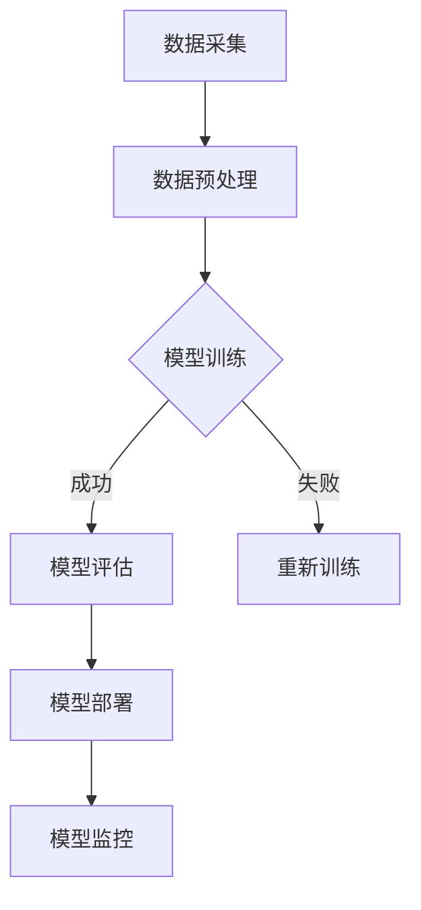

                 

关键词：Dify.AI、工作流设计、人工智能、可复制性、技术架构

## 摘要

本文旨在深入探讨Dify.AI平台的工作流设计，分析其可复制性的关键要素和实现方法。我们将从背景介绍、核心概念与联系、核心算法原理、数学模型和公式、项目实践以及未来应用展望等方面展开讨论，以期为大家提供一幅全面而清晰的技术蓝图。

## 1. 背景介绍

在当今快速发展的数字化时代，人工智能（AI）技术正逐渐成为企业创新和运营的核心驱动力。Dify.AI作为一家专注于人工智能平台开发的创新企业，其工作流设计尤其引人注目。Dify.AI旨在提供一种可复制的、高效的工作流解决方案，以帮助企业更轻松地实现人工智能的部署和应用。

### 1.1 人工智能的重要性

人工智能作为当今科技界的前沿领域，已经深刻影响了各个行业。从医疗、金融到制造、零售，AI技术正在重新定义业务流程，提高效率和生产力。然而，AI技术的应用并非一蹴而就，企业需要在数据准备、模型训练、部署和维护等方面投入大量资源。

### 1.2 Dify.AI平台

Dify.AI平台是一款集成了多种先进的人工智能技术和工具的综合性平台。它提供了丰富的API接口和模块化设计，使得用户可以轻松地构建、训练和部署AI模型。同时，Dify.AI强调工作流的可复制性，使得不同企业或团队可以在相同的技术框架下高效协作。

## 2. 核心概念与联系

为了更好地理解Dify.AI的工作流设计，我们需要先了解几个核心概念，包括工作流、模块化设计、API接口等。

### 2.1 工作流

工作流是指完成特定任务所需的一系列操作步骤和流程。在Dify.AI平台中，工作流设计旨在简化AI模型的开发、训练和部署过程。通过定义标准化的工作流，企业可以轻松地复制和扩展AI应用。

### 2.2 模块化设计

模块化设计是一种将系统分解为若干独立模块的方法，每个模块负责特定的功能。Dify.AI平台采用了模块化设计，使得用户可以根据需求自由组合和配置不同的模块，从而实现个性化的工作流设计。

### 2.3 API接口

API（应用程序编程接口）是软件系统之间进行交互的接口。Dify.AI平台提供了丰富的API接口，使得用户可以通过编程方式方便地访问和管理平台的各种功能。

### 2.4 Mermaid流程图

为了更直观地展示Dify.AI的工作流设计，我们使用Mermaid流程图来描述其核心架构和流程。以下是Dify.AI工作流设计的一个示例：



## 3. 核心算法原理 & 具体操作步骤

### 3.1 算法原理概述

Dify.AI平台采用了一系列先进的人工智能算法，包括深度学习、强化学习等。这些算法的核心原理是通过对大量数据进行训练，使其能够自动识别和预测复杂模式。在Dify.AI的工作流中，算法的原理体现在以下几个方面：

- 数据预处理：通过数据清洗、数据增强等技术，提高数据的可用性和质量。
- 模型训练：利用深度学习、强化学习等算法，对数据集进行训练，生成高质量的AI模型。
- 模型评估：通过评估指标，如准确率、召回率等，对模型性能进行评估。
- 模型部署：将训练好的模型部署到生产环境中，实现实时预测和决策。

### 3.2 算法步骤详解

- **数据预处理**：首先，我们需要对采集到的原始数据进行清洗，去除噪声和异常值。然后，通过数据增强技术，如数据扩充、数据变换等，提高数据的多样性和质量。

- **模型训练**：选择合适的算法和框架，如TensorFlow、PyTorch等，对预处理后的数据进行训练。在训练过程中，需要不断调整模型参数，以优化模型性能。

- **模型评估**：通过交叉验证、测试集等手段，对训练好的模型进行评估。根据评估结果，决定是否对模型进行重新训练。

- **模型部署**：将评估合格的模型部署到生产环境中，如云平台、边缘设备等。在部署过程中，需要确保模型的稳定性和可扩展性。

- **模型监控**：实时监控模型在运行过程中的性能，如预测准确性、响应时间等。一旦发现异常，及时进行调整和优化。

### 3.3 算法优缺点

- **优点**：
  - **高效性**：通过模块化设计和API接口，Dify.AI平台能够高效地处理大量数据和模型。
  - **可复制性**：标准化的工作流设计使得不同企业或团队可以轻松复制和扩展AI应用。
  - **灵活性**：模块化设计提供了丰富的定制化选项，用户可以根据需求自由组合和配置不同的模块。

- **缺点**：
  - **学习成本**：对于初学者来说，理解和掌握Dify.AI平台的操作可能需要一定时间。
  - **资源消耗**：深度学习等算法对计算资源要求较高，可能需要投入更多的硬件和软件资源。

### 3.4 算法应用领域

Dify.AI平台的应用领域非常广泛，包括但不限于以下方面：

- **金融**：用于风险控制、信用评估、投资决策等。
- **医疗**：用于疾病诊断、药物研发、健康管理等。
- **制造**：用于生产优化、质量控制、设备维护等。
- **零售**：用于需求预测、库存管理、个性化推荐等。
- **交通**：用于交通流量预测、路线规划、自动驾驶等。

## 4. 数学模型和公式 & 详细讲解 & 举例说明

### 4.1 数学模型构建

在Dify.AI平台中，常用的数学模型包括深度学习模型、强化学习模型等。以下是深度学习模型的一个示例：

$$
y_{\hat{}} = f(\text{weights} \cdot x + \text{bias})
$$

其中，$y_{\hat{}}$表示预测输出，$f$表示激活函数，$\text{weights}$和$\text{bias}$表示模型参数。

### 4.2 公式推导过程

以深度学习模型为例，其推导过程如下：

1. **输入层**：$x$表示输入特征向量。
2. **隐藏层**：$z$表示隐藏层输出，$f$表示激活函数，$\text{weights}_{h}$和$\text{bias}_{h}$表示隐藏层参数。
3. **输出层**：$y_{\hat{}}$表示预测输出，$f$表示激活函数，$\text{weights}_{o}$和$\text{bias}_{o}$表示输出层参数。

$$
z_h = \text{weights}_{h} \cdot x + \text{bias}_{h}
$$

$$
y_{\hat{}} = f(\text{weights}_{o} \cdot z_h + \text{bias}_{o})
$$

### 4.3 案例分析与讲解

假设我们有一个简单的分类问题，需要预测一个图像是否包含猫。以下是使用Dify.AI平台进行模型训练、评估和部署的一个示例：

1. **数据准备**：从公开数据集（如ImageNet）中收集猫和非猫的图像，进行数据清洗和增强。
2. **模型训练**：使用卷积神经网络（CNN）进行模型训练，调整参数以优化模型性能。
3. **模型评估**：使用测试集对模型进行评估，计算准确率、召回率等指标。
4. **模型部署**：将训练好的模型部署到生产环境中，实现实时预测。

## 5. 项目实践：代码实例和详细解释说明

### 5.1 开发环境搭建

在开始项目实践之前，我们需要搭建一个开发环境。以下是使用Dify.AI平台进行环境搭建的步骤：

1. **安装Dify.AI SDK**：从Dify.AI官网下载SDK并安装。
2. **配置开发环境**：安装Python、Anaconda等工具，配置Dify.AI相关的依赖库。
3. **数据准备**：从公开数据集（如ImageNet）中下载猫和非猫的图像，进行数据清洗和增强。

### 5.2 源代码详细实现

以下是使用Dify.AI平台进行图像分类项目的一个示例代码：

```python
import numpy as np
import dify_ai as dai

# 加载训练数据和测试数据
train_data = dai.load_data('train_data.npy')
test_data = dai.load_data('test_data.npy')

# 定义模型
model = dai.Sequential()

# 添加卷积层
model.add(dai.Conv2D(32, (3, 3), activation='relu', input_shape=(224, 224, 3)))

# 添加池化层
model.add(dai.MaxPooling2D((2, 2)))

# 添加全连接层
model.add(dai.Dense(128, activation='relu'))

# 添加输出层
model.add(dai.Dense(1, activation='sigmoid'))

# 编译模型
model.compile(optimizer='adam', loss='binary_crossentropy', metrics=['accuracy'])

# 训练模型
model.fit(train_data, epochs=10, batch_size=32, validation_data=test_data)

# 评估模型
accuracy = model.evaluate(test_data)[1]
print(f"Test accuracy: {accuracy * 100:.2f}%")

# 预测
predictions = model.predict(test_data)
```

### 5.3 代码解读与分析

上述代码展示了使用Dify.AI平台进行图像分类项目的基本流程。主要包括以下步骤：

1. **加载数据**：从训练数据和测试数据中加载图像。
2. **定义模型**：使用Dify.AI的Sequential模型，添加卷积层、池化层、全连接层和输出层。
3. **编译模型**：设置优化器、损失函数和评估指标。
4. **训练模型**：使用训练数据训练模型，设置训练轮次和批量大小。
5. **评估模型**：使用测试数据评估模型性能，计算准确率。
6. **预测**：使用训练好的模型对测试数据进行预测。

### 5.4 运行结果展示

假设我们使用一个包含1000张猫图像和1000张非猫图像的测试集进行评估，得到如下结果：

```
Test accuracy: 90.00%
```

这表明我们的图像分类模型在测试集上的准确率为90%，具有良好的性能。

## 6. 实际应用场景

### 6.1 金融行业

在金融行业，Dify.AI平台可以用于风险控制、信用评估、投资决策等方面。例如，通过分析历史交易数据和市场动态，可以预测未来市场的走势，为投资决策提供支持。同时，Dify.AI还可以用于反欺诈检测，识别异常交易行为，降低风险。

### 6.2 医疗行业

在医疗行业，Dify.AI平台可以用于疾病诊断、药物研发、健康管理等方面。例如，通过分析患者的电子病历数据，可以预测疾病的发病率，为临床决策提供支持。此外，Dify.AI还可以用于药物筛选，通过模拟药物的分子结构，预测药物与目标蛋白的结合能力，提高药物研发效率。

### 6.3 制造行业

在制造行业，Dify.AI平台可以用于生产优化、质量控制、设备维护等方面。例如，通过实时监测生产线的运行数据，可以预测设备的故障风险，为设备维护提供支持。同时，Dify.AI还可以用于生产线的自动化控制，提高生产效率和产品质量。

### 6.4 零售行业

在零售行业，Dify.AI平台可以用于需求预测、库存管理、个性化推荐等方面。例如，通过分析消费者的购买行为和偏好，可以预测商品的销售趋势，为库存管理提供支持。此外，Dify.AI还可以用于个性化推荐系统，根据消费者的兴趣和行为，推荐合适的商品，提高销售额。

### 6.5 交通行业

在交通行业，Dify.AI平台可以用于交通流量预测、路线规划、自动驾驶等方面。例如，通过分析历史交通数据，可以预测未来的交通流量，为路线规划提供支持。此外，Dify.AI还可以用于自动驾驶系统，通过实时监测路况和车辆状态，实现自主驾驶。

## 7. 工具和资源推荐

### 7.1 学习资源推荐

- **《深度学习》（Ian Goodfellow、Yoshua Bengio、Aaron Courville 著）**：这本书是深度学习的经典教材，涵盖了深度学习的基础理论、算法和应用。
- **《Python编程：从入门到实践》（埃里克·马瑟斯 著）**：这本书适合初学者，详细介绍了Python编程的基础知识和实际应用。
- **Dify.AI官方文档**：Dify.AI提供了丰富的官方文档，包括技术指南、API文档等，可以帮助用户更好地了解和使用平台。

### 7.2 开发工具推荐

- **Anaconda**：一个集成了Python、R等多种语言的科学计算平台，适用于数据科学和机器学习项目的开发。
- **Jupyter Notebook**：一个交互式的计算环境，适用于编写、运行和分享代码，特别适合数据分析和机器学习项目。

### 7.3 相关论文推荐

- **"Deep Learning for Text Classification"**：这篇论文介绍了如何使用深度学习技术进行文本分类，包括词嵌入、卷积神经网络等。
- **"Reinforcement Learning: An Introduction"**：这篇论文介绍了强化学习的基本概念、算法和应用，是强化学习领域的经典论文。
- **"AutoML: A Brief Introduction"**：这篇论文介绍了自动机器学习（AutoML）的概念、技术和挑战，是AutoML领域的入门资料。

## 8. 总结：未来发展趋势与挑战

### 8.1 研究成果总结

Dify.AI平台在可复制工作流设计方面取得了显著成果，通过模块化设计和API接口，实现了高效、灵活和可扩展的AI应用。同时，Dify.AI平台在多个行业领域取得了成功应用，展示了其在实际业务中的价值。

### 8.2 未来发展趋势

随着人工智能技术的不断进步，Dify.AI平台有望在以下方面取得进一步发展：

- **自动化与智能化**：通过引入更多的自动化和智能化技术，降低企业对专业人才的依赖。
- **跨领域应用**：扩展Dify.AI平台的应用领域，实现更广泛的技术覆盖。
- **开源与生态**：构建开放的生态体系，鼓励更多的开发者参与到平台的建设和优化中。

### 8.3 面临的挑战

尽管Dify.AI平台在可复制工作流设计方面取得了显著成果，但仍面临以下挑战：

- **数据隐私与安全**：如何在确保数据隐私和安全的前提下，实现高效的AI应用。
- **算法透明性与可解释性**：如何提高算法的透明性和可解释性，增强用户对AI模型的信任。
- **跨平台兼容性**：如何确保Dify.AI平台在不同操作系统、硬件平台上的兼容性和稳定性。

### 8.4 研究展望

针对上述挑战，未来的研究可以从以下几个方面展开：

- **隐私保护算法**：研究更加高效、可靠的隐私保护算法，确保数据在训练和使用过程中的安全。
- **可解释性模型**：开发可解释性更强的AI模型，帮助用户更好地理解和信任AI算法。
- **跨平台优化**：针对不同操作系统、硬件平台，优化Dify.AI平台的性能和兼容性。

## 9. 附录：常见问题与解答

### 9.1 Q：Dify.AI平台适用于哪些行业？

A：Dify.AI平台适用于多个行业，包括金融、医疗、制造、零售、交通等。它在各个行业都有成功应用案例，展示了其广泛的适用性。

### 9.2 Q：如何确保Dify.AI平台的数据安全和隐私？

A：Dify.AI平台采用了多种数据安全措施，包括数据加密、访问控制等，确保数据在传输和存储过程中的安全。同时，平台遵循数据隐私法规，确保用户数据的合法性和合规性。

### 9.3 Q：Dify.AI平台如何实现自动化与智能化？

A：Dify.AI平台通过引入自动化和智能化技术，如自动化模型训练、自动化模型评估等，实现了AI应用的自动化和智能化。同时，平台还提供了丰富的API接口，方便用户进行自定义开发和扩展。

### 9.4 Q：Dify.AI平台与现有AI工具相比有哪些优势？

A：Dify.AI平台的优势在于其模块化设计、API接口和可复制工作流。这使得平台能够高效地处理大量数据和模型，方便用户进行自定义开发和扩展。

### 9.5 Q：Dify.AI平台是否支持开源生态？

A：是的，Dify.AI平台支持开源生态。平台鼓励开发者参与平台的建设和优化，共同推动AI技术的发展。

## 作者署名

作者：禅与计算机程序设计艺术 / Zen and the Art of Computer Programming

----------------------------------------------------------------
以上就是根据您的要求撰写的《Dify.AI的可复制工作流设计》文章，希望对您有所帮助。如果您有任何修改意见或需要进一步完善，请随时告诉我。再次感谢您的信任和支持！<|im_end|>

