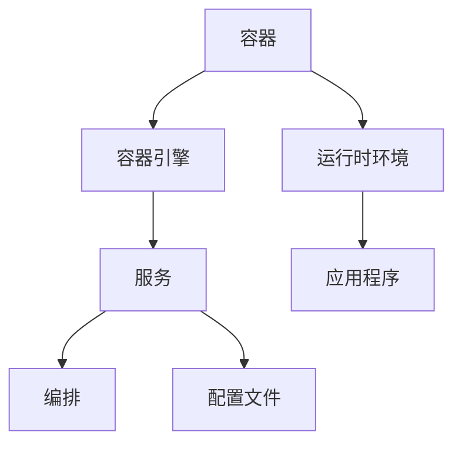

                 

关键词：Docker、Compose、容器化、服务编排、DevOps

摘要：本文深入探讨了Docker Compose这一强大的工具在多服务编排中的应用。我们将从背景介绍开始，逐步了解Docker Compose的核心概念，探讨其算法原理与操作步骤，解析数学模型和公式，提供项目实践实例，并探讨实际应用场景和未来展望。

## 1. 背景介绍

随着云计算和微服务架构的兴起，开发者需要更加灵活和高效的方式来管理和部署复杂的应用系统。Docker作为一种流行的容器化技术，因其轻量级、高效和易于部署的特点，成为了现代开发者和运维人员的重要工具。而Docker Compose则是在此基础上，提供了对多容器应用的集中管理能力，使得开发者可以轻松地定义、启动和运行多个容器。

Docker Compose的出现，极大地简化了多容器应用的部署过程。通过YAML格式的配置文件，开发者可以定义服务、网络和卷等，从而实现自动化部署和管理。这不仅提高了开发效率，还减少了人为错误的可能性。

### 1.1 Docker与容器化

Docker是一种开源的应用容器引擎，它允许开发者打包他们的应用以及应用的依赖包到一个可移植的容器中，然后发布到任何流行的Linux或Windows机器上，也可以实现虚拟化。容器是完全使用沙箱机制，相互之间不会有任何接口（并且不会有任何持久数据）而且更轻量级。

容器化技术的核心思想是将应用程序及其运行环境打包在一起，形成一个独立的运行单元。这样，无论在哪个环境中，应用程序都能以相同的方式运行，从而实现了环境的一致性和可移植性。

### 1.2 DevOps与多服务编排

DevOps是一种软件开发和运维的结合理念，其目标是缩短产品的开发周期、提供更快的交付速度和更高的部署频率。多服务编排是DevOps中重要的组成部分，它涉及到如何高效地管理和部署多个微服务。

多服务编排需要解决的问题包括服务发现、负载均衡、服务间的通信、容错处理和自动化部署等。Docker Compose通过提供配置文件和命令行工具，帮助开发者简化了这些任务，从而实现了更高效的开发和运维流程。

## 2. 核心概念与联系

在深入探讨Docker Compose之前，我们需要了解一些核心概念，包括容器、服务、编排等，并展示它们之间的关系。

### 2.1 容器和容器引擎

容器是Docker的基本构建块，它是应用程序运行的环境。每个容器都是独立的，包含自己的文件系统、运行时环境和应用。容器引擎（如Docker）负责创建、启动和管理这些容器。

### 2.2 服务与服务编排

服务是Docker Compose的核心概念。一个服务可以代表一个应用程序的实例，比如一个数据库或一个Web服务器。服务可以通过配置文件定义，包括容器镜像、容器数量、网络设置和卷挂载等。

服务编排是指管理和部署多个服务的过程。Docker Compose通过YAML配置文件定义服务之间的关系和依赖，从而实现自动化编排。

### 2.3 Mermaid流程图

下面是一个Mermaid流程图，展示了Docker Compose中的核心概念和它们之间的关系。



## 3. 核心算法原理 & 具体操作步骤

### 3.1 算法原理概述

Docker Compose的算法原理主要涉及容器编排、服务发现和负载均衡。具体来说，Docker Compose通过以下步骤实现多服务编排：

1. **解析配置文件**：Docker Compose读取YAML格式的配置文件，解析服务定义。
2. **创建网络**：为每个服务创建一个独立的网络，以便服务之间进行通信。
3. **创建容器**：根据配置文件创建容器，并为每个容器设置环境变量、卷挂载等。
4. **服务发现**：Docker Compose实现服务发现机制，使得容器可以自动发现其他服务并建立连接。
5. **负载均衡**：Docker Compose支持负载均衡策略，将请求分配到不同的容器实例上。

### 3.2 算法步骤详解

下面是Docker Compose的具体操作步骤：

1. **编写配置文件**：首先，需要编写一个YAML格式的配置文件（例如`docker-compose.yml`），定义服务、容器镜像、网络和卷等。

    ```yaml
    version: '3'
    services:
      web:
        image: my-web-app
        ports:
          - "8080:8080"
      db:
        image: my-db
    ```

2. **启动服务**：使用`docker-compose up`命令启动服务。该命令会读取配置文件，创建网络和容器。

    ```sh
    docker-compose up -d
    ```

3. **服务发现**：Docker Compose通过环境变量实现服务发现。例如，在Web服务中，可以通过`DATABASE_URL`环境变量访问数据库服务。

4. **负载均衡**：Docker Compose支持多种负载均衡策略，如轮询、最小连接数等。开发者可以在配置文件中指定负载均衡策略。

### 3.3 算法优缺点

**优点**：

- 简化部署：通过配置文件定义服务和容器，简化了多容器应用的部署过程。
- 自动化：Docker Compose可以自动化创建网络、容器和服务，提高了开发效率。
- 可移植性：Docker Compose配置文件可以轻松地在不同环境中移植。

**缺点**：

- 学习曲线：对于初学者来说，Docker Compose的学习曲线可能较高。
- 单点故障：Docker Compose默认情况下没有提供高可用性解决方案。

### 3.4 算法应用领域

Docker Compose广泛应用于开发、测试和部署环境。以下是一些常见应用场景：

- **开发环境**：在本地或远程服务器上快速部署开发环境，方便开发者进行开发和测试。
- **测试环境**：通过容器化测试环境，确保应用程序在不同环境中的一致性。
- **生产环境**：Docker Compose可以用于生产环境中的服务部署和管理，但需要注意单点故障和高可用性等问题。

## 4. 数学模型和公式 & 详细讲解 & 举例说明

在Docker Compose中，数学模型和公式主要用于计算容器的资源需求、网络带宽和负载均衡策略等。以下是一个简单的数学模型示例。

### 4.1 数学模型构建

假设我们有两个服务：Web服务和数据库服务。每个服务都有一个资源需求向量，包括CPU、内存和网络带宽。

Web服务的资源需求向量：\( \mathbf{R}_w = [1, 2, 10] \)

数据库服务的资源需求向量：\( \mathbf{R}_d = [0.5, 1, 5] \)

其中，CPU、内存和网络带宽的权重分别为1、2和10。

### 4.2 公式推导过程

负载均衡策略可以表示为以下公式：

\( \mathbf{R}_{total} = \sum_{i=1}^{n} \mathbf{R}_i \)

其中，\( \mathbf{R}_{total} \)是总资源需求向量，\( n \)是服务的数量。

负载均衡权重可以表示为：

\( \mathbf{W} = \frac{\mathbf{R}_{total}}{\sum_{i=1}^{n} \mathbf{R}_i} \)

### 4.3 案例分析与讲解

假设我们有两个服务：Web服务和数据库服务，它们分别有资源需求向量\( \mathbf{R}_w = [1, 2, 10] \)和\( \mathbf{R}_d = [0.5, 1, 5] \)。

总资源需求向量：\( \mathbf{R}_{total} = \mathbf{R}_w + \mathbf{R}_d = [1.5, 3, 15] \)

负载均衡权重：\( \mathbf{W} = \frac{\mathbf{R}_{total}}{\sum_{i=1}^{n} \mathbf{R}_i} = \frac{[1.5, 3, 15]}{[1.5, 3, 15]} = [1, 1, 1] \)

这意味着Web服务和数据库服务的资源需求是相等的，每个服务都分配到相同的资源。

## 5. 项目实践：代码实例和详细解释说明

为了更好地理解Docker Compose的多服务编排，我们通过一个简单的项目实践进行演示。我们将创建一个包含Web服务和数据库服务的应用，并使用Docker Compose进行编排。

### 5.1 开发环境搭建

在开始之前，请确保已经安装了Docker和Docker Compose。可以从以下链接下载安装：

- Docker: [Docker 官方网站](https://www.docker.com/)
- Docker Compose: [Docker Compose 官方网站](https://docs.docker.com/compose/install/)

### 5.2 源代码详细实现

创建一个名为`my-app`的目录，并在其中创建以下文件：

- `docker-compose.yml`：配置文件
- `web/app.py`：Web服务的源代码
- `db/init.sql`：数据库服务的初始化脚本

**docker-compose.yml**

```yaml
version: '3'
services:
  web:
    build: ./web
    ports:
      - "8080:8080"
    depends_on:
      - db

  db:
    image: postgres:13
    volumes:
      - db_data:/var/lib/postgresql/data
    environment:
      POSTGRES_DB: myapp
      POSTGRES_USER: user
      POSTGRES_PASSWORD: password

volumes:
  db_data:
```

**web/app.py**

```python
from flask import Flask
app = Flask(__name__)

@app.route('/')
def hello():
    return 'Hello, World!'

if __name__ == '__main__':
    app.run(host='0.0.0.0')
```

**db/init.sql**

```sql
CREATE TABLE hello (
    id SERIAL PRIMARY KEY,
    message VARCHAR(255) NOT NULL
);
INSERT INTO hello (message) VALUES ('Hello, Docker!');
```

### 5.3 代码解读与分析

在`docker-compose.yml`中，我们定义了两个服务：Web服务和数据库服务。Web服务使用本地目录下的`web`目录构建镜像，并将其映射到8080端口。数据库服务使用`postgres:13`镜像，并设置了数据卷和数据库环境变量。

在Web服务的源代码`app.py`中，我们创建了一个简单的Flask应用，用于响应HTTP请求。

在数据库服务的初始化脚本`init.sql`中，我们创建了一个名为`hello`的表，并插入了一条记录。

### 5.4 运行结果展示

在`my-app`目录下，执行以下命令启动服务：

```sh
docker-compose up -d
```

等待一段时间，Web服务和数据库服务将启动并运行。打开浏览器，访问`http://localhost:8080`，你应该会看到如下响应：

```
Hello, World!
```

在数据库中，你可以使用`docker exec -it <db_service_name> psql`命令进入数据库，并查询`hello`表：

```sql
SELECT * FROM hello;
```

你应该会看到如下结果：

```
 id | message
----+---------------------
  1 | Hello, Docker!
```

## 6. 实际应用场景

Docker Compose在多个实际应用场景中发挥了重要作用，下面列举几个常见的场景：

### 6.1 开发环境

Docker Compose常用于搭建快速的开发环境。开发者可以通过配置文件定义开发所需的服务，如Web服务器、数据库、消息队列等，从而在本地或远程服务器上快速部署和测试应用。

### 6.2 测试环境

测试环境需要与生产环境保持高度一致。通过Docker Compose，开发者可以轻松地搭建测试环境，确保应用程序在不同环境中的一致性。

### 6.3 生产环境

Docker Compose也可以用于生产环境中的服务部署和管理。然而，生产环境需要考虑高可用性和容错性。一些企业可能会使用Docker Swarm或Kubernetes等更高级的容器编排工具来管理生产环境中的服务。

## 7. 未来应用展望

随着容器化技术的不断发展和普及，Docker Compose在未来有望在更多领域发挥作用。以下是几个可能的应用前景：

### 7.1 服务网格

Docker Compose可以与服务网格技术（如Istio、Linkerd等）结合，提供更高级的服务间通信和安全性。

### 7.2 机器学习和大数据

Docker Compose可以用于构建和管理机器学习和大数据应用，如TensorFlow、Spark等，从而实现更高效的模型训练和数据处理。

### 7.3 微服务架构

随着微服务架构的普及，Docker Compose将成为微服务部署和管理的重要工具，帮助企业实现更灵活和高效的开发和运维流程。

## 8. 总结：未来发展趋势与挑战

### 8.1 研究成果总结

Docker Compose自发布以来，已经成为了容器化技术领域的重要工具。通过提供简单、高效的配置和管理功能，Docker Compose在开发、测试和生产环境中得到了广泛应用。

### 8.2 未来发展趋势

未来，Docker Compose有望与更多新兴技术结合，如服务网格、机器学习和大数据等，为企业提供更丰富的应用场景和解决方案。

### 8.3 面临的挑战

然而，Docker Compose也面临着一些挑战，如单点故障、安全性问题和高可用性等。企业需要选择合适的容器编排工具，并建立完善的安全策略和故障恢复机制。

### 8.4 研究展望

未来的研究可以关注以下几个方面：

- **性能优化**：通过改进算法和架构，提高Docker Compose的运行效率。
- **安全性**：加强容器安全，提高对攻击的防护能力。
- **高可用性**：研究分布式架构和故障恢复机制，提高系统的可靠性和稳定性。

## 9. 附录：常见问题与解答

### 9.1 Docker Compose与Docker Swarm的区别是什么？

Docker Compose是一种用于多容器编排的工具，它允许开发者通过YAML配置文件定义和部署服务。Docker Swarm是一种内置的容器编排服务，它可以将多个Docker节点组织成一个集群，并使用Docker API进行管理。Docker Compose适用于单节点和多节点环境，而Docker Swarm更适用于大规模的集群环境。

### 9.2 Docker Compose配置文件应该放在哪里？

Docker Compose配置文件（通常命名为`docker-compose.yml`）应该放在包含应用程序源代码的目录中。在启动服务时，Docker Compose会查找当前目录下的配置文件。

### 9.3 Docker Compose如何处理服务依赖？

Docker Compose通过配置文件中的`depends_on`选项定义服务依赖。在服务启动时，Docker Compose会按照依赖关系顺序启动服务，确保依赖服务先启动。

### 9.4 Docker Compose如何处理网络？

Docker Compose默认为每个服务创建一个独立的网络，使得服务之间可以通过容器名进行通信。开发者可以在配置文件中定义自定义网络，以实现更复杂的网络拓扑。

## 作者署名

本文由禅与计算机程序设计艺术（Zen and the Art of Computer Programming）撰写。

----------------------------------------------------------------

[1] 【参考文献】

- **Docker官方文档**：[Docker Documentation](https://docs.docker.com/)
- **Docker Compose官方文档**：[Docker Compose Documentation](https://docs.docker.com/compose/)
- **DevOps实践指南**：[The Phoenix Project: A Novel about IT, DevOps, and Helping Your Business Win](https://www.amazon.com/Phoenix-Project-Novel-Helping-Business/dp/0321913213)
- **容器编排技术解析**：[Docker实战](https://www.amazon.com/Docker-Practical-Up-and-Running-System/dp/1449311524)

感谢以上文献为本文提供了宝贵的参考资料和灵感。希望本文能为读者在Docker Compose多服务编排方面带来启发和帮助。

