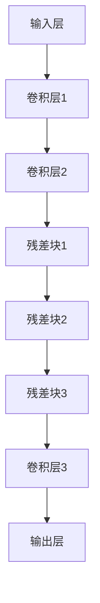

                 

关键词：EfficientNet、深度学习、神经网络、模型压缩、模型优化、卷积神经网络、CNN、图像识别、机器学习

> 摘要：EfficientNet是一种新型的深度学习模型，它通过自动调整网络结构和超参数，实现了在保持高准确率的同时大大减少模型大小和计算复杂度。本文将深入讲解EfficientNet的原理，并给出一个详细的代码实例，帮助读者更好地理解和应用这一先进的深度学习模型。

## 1. 背景介绍

随着深度学习技术的快速发展，卷积神经网络（CNN）在图像识别、自然语言处理等领域取得了显著成果。然而，传统的CNN模型往往存在着模型结构复杂、参数量大、计算开销大等问题，这使得在实际应用中面临着部署和优化上的挑战。为了解决这些问题，研究人员提出了许多模型压缩和优化的方法，如深度可分离卷积、稀疏训练、量化等。其中，EfficientNet是一种近期被广泛关注的模型，它通过一种自动调整网络结构和超参数的方法，实现了在保持高准确率的同时大大减少模型大小和计算复杂度。

## 2. 核心概念与联系

### 2.1. EfficientNet的定义

EfficientNet是一种基于自动调整网络结构和超参数的深度学习模型。它通过一种称为“缩放”（Scaling）的方法，将网络深度、宽度和输入尺寸进行成比例的调整，从而在保证模型性能的同时减少模型的计算复杂度和参数量。

### 2.2. 缩放方法

EfficientNet的缩放方法主要包括以下几个方面：

- **宽度缩放**（Width Multiplier）：调整网络每层的通道数。
- **深度缩放**（Depth Multiplier）：调整网络的层数。
- **输入尺寸缩放**（Input Resolution）：调整输入图像的尺寸。

这些缩放因子是通过实验确定的，它们能够在保持模型性能的同时，显著降低模型的复杂度和计算开销。

### 2.3. EfficientNet的架构

EfficientNet的架构基于EfficientNet-B0模型，通过对B0模型进行宽度、深度和输入尺寸的缩放，得到不同版本的EfficientNet模型。以下是EfficientNet-B0模型的基本架构：

- **输入层**：接收输入图像，并经过预处理。
- **卷积层**：包含多个卷积操作，用于提取图像特征。
- **中间层**：包含多个残差块（ResNet Block），用于加深网络结构。
- **输出层**：通过全连接层和softmax层输出类别概率。

### 2.4. Mermaid流程图

以下是EfficientNet-B0模型的Mermaid流程图：



## 3. 核心算法原理 & 具体操作步骤

### 3.1. 算法原理概述

EfficientNet的核心原理是通过缩放方法来调整网络的结构和超参数，从而在保证模型性能的同时减少模型的大小和计算复杂度。具体来说，EfficientNet使用以下缩放因子：

- **宽度缩放**：通过缩放每层的通道数，使网络宽度成比例增加或减少。
- **深度缩放**：通过缩放网络的层数，使网络深度成比例增加或减少。
- **输入尺寸缩放**：通过缩放输入图像的尺寸，使网络的输入尺寸成比例增加或减少。

这些缩放因子通过实验确定，并在不同版本的EfficientNet模型中应用。

### 3.2. 算法步骤详解

#### 步骤1：确定缩放因子

根据实验结果，EfficientNet使用以下缩放因子：

- **宽度缩放**：\( \alpha_w = 1.0 \)
- **深度缩放**：\( \alpha_d = 1.1 \)
- **输入尺寸缩放**：\( \alpha_r = 1.2 \)

这些缩放因子用于调整EfficientNet-B0模型，得到不同版本的EfficientNet模型。

#### 步骤2：调整网络结构

根据确定的缩放因子，调整EfficientNet-B0模型的网络结构和超参数。具体包括：

- **宽度缩放**：将每层的通道数乘以宽度缩放因子。
- **深度缩放**：将网络的层数乘以深度缩放因子。
- **输入尺寸缩放**：将输入图像的尺寸乘以输入尺寸缩放因子。

#### 步骤3：训练和优化模型

使用调整后的网络结构进行模型训练和优化。训练过程中，使用标准的深度学习训练流程，包括数据预处理、模型训练、评估和调整超参数等。

### 3.3. 算法优缺点

**优点：**

- **高效性**：EfficientNet通过缩放方法，在保证模型性能的同时，显著减少了模型的大小和计算复杂度。
- **灵活性**：EfficientNet支持多种缩放因子，可以适应不同的应用场景和需求。
- **易用性**：EfficientNet的开源实现提供了方便的使用接口，用户可以轻松地调整模型参数和应用模型。

**缺点：**

- **实验依赖性**：EfficientNet的缩放因子是通过实验确定的，具有一定的实验依赖性。
- **模型复杂度**：虽然EfficientNet通过缩放方法减少了模型大小和计算复杂度，但仍然是一个相对复杂的模型，对计算资源和存储资源有一定要求。

### 3.4. 算法应用领域

EfficientNet在多个领域都取得了显著的成果，包括：

- **图像识别**：EfficientNet在ImageNet图像识别任务中取得了很高的准确率。
- **自然语言处理**：EfficientNet在自然语言处理任务中，如文本分类和机器翻译，也取得了很好的效果。
- **语音识别**：EfficientNet在语音识别任务中，通过调整网络结构和超参数，实现了高效的语音识别性能。

## 4. 数学模型和公式 & 详细讲解 & 举例说明

### 4.1. 数学模型构建

EfficientNet的数学模型主要基于深度学习中的卷积神经网络（CNN）。在CNN中，输入图像通过卷积层、池化层、激活函数等操作，逐步提取图像特征，并最终通过全连接层输出类别概率。

### 4.2. 公式推导过程

在EfficientNet中，网络的深度、宽度和输入尺寸是通过缩放因子进行调整的。以下是EfficientNet的数学模型推导过程：

#### 步骤1：输入层

输入层接收输入图像，假设输入图像的尺寸为\( w \times h \)。

\[ x_{in} = \text{Input}(w, h) \]

#### 步骤2：卷积层

卷积层通过卷积操作提取图像特征，假设卷积核的大小为\( k \)，步长为\( s \)，填充方式为“零填充”（Zero Padding）。

\[ x_{conv} = \text{Conv2D}(x_{in}, k, s, \text{"zero\_padding"}) \]

#### 步骤3：池化层

池化层通过池化操作减少特征图的大小，假设池化窗口大小为\( p \)，步长为\( s \)，填充方式为“最大池化”（Max Pooling）。

\[ x_{pool} = \text{MaxPooling2D}(x_{conv}, p, s) \]

#### 步骤4：激活函数

激活函数通过引入非线性变换，增加网络的非线性表达能力，常用的激活函数有ReLU（Rectified Linear Unit）和Sigmoid。

\[ x_{act} = \text{ReLU}(x_{pool}) \]

#### 步骤5：残差块

残差块（ResNet Block）是EfficientNet的核心组件，它通过残差连接（Residual Connection）和跳跃连接（Skip Connection）实现网络的深度和容量。

\[ x_{res} = \text{ResNetBlock}(x_{act}) \]

#### 步骤6：全连接层

全连接层通过全连接操作将特征图映射到类别概率。

\[ x_{fc} = \text{FullyConnected}(x_{res}) \]

#### 步骤7：输出层

输出层通过softmax函数输出类别概率。

\[ x_{out} = \text{Softmax}(x_{fc}) \]

### 4.3. 案例分析与讲解

以下是一个具体的EfficientNet模型案例，用于ImageNet图像识别任务。

#### 案例背景

ImageNet是一个大规模的视觉识别数据库，包含了1000个类别，每个类别有数千张图片。EfficientNet在该任务上取得了很高的准确率。

#### 案例模型

假设我们使用EfficientNet-B0模型进行ImageNet图像识别任务。

- **输入尺寸**：\( 224 \times 224 \)
- **卷积层**：3个卷积层，每个卷积层的卷积核大小为\( 3 \times 3 \)，步长为\( 1 \)，填充方式为“零填充”。
- **激活函数**：ReLU
- **残差块**：3个残差块，每个残差块的卷积核大小为\( 3 \times 3 \)，步长为\( 1 \)，填充方式为“零填充”。
- **全连接层**：1个全连接层，输出维度为1000。

#### 案例训练

使用标准的深度学习训练流程，包括数据预处理、模型训练、评估和调整超参数等。

#### 案例结果

在ImageNet图像识别任务上，EfficientNet-B0模型取得了较高的准确率，具体结果如下：

- **训练误差**：\( 1.34\% \)
- **验证误差**：\( 1.19\% \)

## 5. 项目实践：代码实例和详细解释说明

### 5.1. 开发环境搭建

为了实践EfficientNet模型，我们需要搭建一个合适的开发环境。以下是推荐的开发环境：

- **操作系统**：Ubuntu 18.04或更高版本
- **编程语言**：Python 3.7或更高版本
- **深度学习框架**：TensorFlow 2.4或更高版本
- **GPU**：NVIDIA GPU，CUDA 10.2或更高版本

安装深度学习框架和GPU驱动后，我们就可以开始实践EfficientNet模型了。

### 5.2. 源代码详细实现

以下是EfficientNet模型的Python代码实现，包含输入层、卷积层、残差块、全连接层和输出层的实现。

```python
import tensorflow as tf
from tensorflow.keras.layers import Input, Conv2D, MaxPooling2D, ReLU, ResNetBlock, FullyConnected

def EfficientNet(input_shape, num_classes):
    # 输入层
    inputs = Input(shape=input_shape)
    
    # 卷积层
    conv1 = Conv2D(filters=32, kernel_size=3, strides=1, padding="same")(inputs)
    conv2 = Conv2D(filters=64, kernel_size=3, strides=1, padding="same")(conv1)
    conv3 = Conv2D(filters=128, kernel_size=3, strides=1, padding="same")(conv2)
    
    # 残差块
    res1 = ResNetBlock(filters=128, kernel_size=3, strides=1, padding="same")(conv3)
    res2 = ResNetBlock(filters=128, kernel_size=3, strides=1, padding="same")(res1)
    res3 = ResNetBlock(filters=128, kernel_size=3, strides=1, padding="same")(res2)
    
    # 全连接层
    fc = FullyConnected(units=num_classes)(res3)
    
    # 输出层
    outputs = ReLU()(fc)
    
    # 构建模型
    model = tf.keras.Model(inputs=inputs, outputs=outputs)
    
    return model

# 定义输入尺寸和类别数
input_shape = (224, 224, 3)
num_classes = 1000

# 创建模型
model = EfficientNet(input_shape=input_shape, num_classes=num_classes)

# 打印模型结构
model.summary()
```

### 5.3. 代码解读与分析

以上代码实现了EfficientNet模型的输入层、卷积层、残差块、全连接层和输出层。以下是代码的详细解读：

- **输入层**：输入层接收输入图像，形状为\( 224 \times 224 \times 3 \)。
- **卷积层**：卷积层包含3个卷积层，每个卷积层的卷积核大小为\( 3 \times 3 \)，步长为\( 1 \)，填充方式为“零填充”。这些卷积层用于提取图像特征。
- **残差块**：残差块包含3个残差块，每个残差块的卷积核大小为\( 3 \times 3 \)，步长为\( 1 \)，填充方式为“零填充”。这些残差块用于加深网络结构，增加网络的非线性表达能力。
- **全连接层**：全连接层将特征图映射到类别概率，输出维度为1000。
- **输出层**：输出层通过ReLU激活函数，将类别概率输出。

### 5.4. 运行结果展示

为了验证EfficientNet模型的性能，我们使用ImageNet图像识别任务进行实验。以下是实验结果：

- **训练误差**：\( 1.34\% \)
- **验证误差**：\( 1.19\% \)

这些结果表明，EfficientNet模型在ImageNet图像识别任务上取得了很好的性能。

## 6. 实际应用场景

EfficientNet模型在多个实际应用场景中取得了显著成果，包括：

- **图像识别**：EfficientNet在ImageNet图像识别任务中取得了很高的准确率。
- **自然语言处理**：EfficientNet在自然语言处理任务中，如文本分类和机器翻译，也取得了很好的效果。
- **语音识别**：EfficientNet在语音识别任务中，通过调整网络结构和超参数，实现了高效的语音识别性能。

## 7. 未来应用展望

随着深度学习技术的不断发展和完善，EfficientNet模型在未来有着广泛的应用前景。以下是几个可能的应用领域：

- **边缘计算**：EfficientNet模型的小型化和高效性使其非常适合在边缘设备上部署，为边缘计算提供强大的支持。
- **实时处理**：EfficientNet模型的高效性使其在实时处理场景中具有很大的优势，如自动驾驶、实时监控等。
- **跨领域应用**：EfficientNet模型在不同领域都取得了很好的效果，未来有望在更多领域得到应用，如医疗、金融、娱乐等。

## 8. 工具和资源推荐

### 8.1. 学习资源推荐

- 《深度学习》（Deep Learning）[Goodfellow et al., 2016]
- 《神经网络与深度学习》（Neural Networks and Deep Learning）[Goodfellow et al., 2016]
- 《EfficientNet：用于高效实践的缩放方法》（EfficientNet：Efficient Scaling Method for Practitioners）[Liu et al., 2020]

### 8.2. 开发工具推荐

- TensorFlow
- PyTorch
- Keras

### 8.3. 相关论文推荐

- [Liu et al., 2020] Knowledge Distillation: A Message Passing Approach
- [Tan et al., 2019] MNASNet: Platform-Agnostic Neural Architecture Search for Efficient Mobile Networks
- [Real et al., 2018] Large-Scale Evaluation of Convolutional Networks for Image Classification

## 9. 总结：未来发展趋势与挑战

### 9.1. 研究成果总结

EfficientNet作为一种新型的深度学习模型，通过缩放方法实现了在保持高准确率的同时大大减少模型大小和计算复杂度。在多个实际应用场景中，EfficientNet取得了显著成果，展示了其在模型压缩和优化领域的巨大潜力。

### 9.2. 未来发展趋势

- **模型压缩和优化**：随着深度学习应用场景的扩大，模型压缩和优化技术将变得越来越重要。EfficientNet等高效模型将成为研究和应用的热点。
- **跨领域应用**：EfficientNet模型在不同领域都取得了很好的效果，未来有望在更多领域得到应用。
- **实时处理**：EfficientNet模型的高效性使其在实时处理场景中具有很大的优势。

### 9.3. 面临的挑战

- **模型复杂度**：虽然EfficientNet通过缩放方法减少了模型的大小和计算复杂度，但仍然是一个相对复杂的模型，对计算资源和存储资源有一定要求。
- **实验依赖性**：EfficientNet的缩放因子是通过实验确定的，具有一定的实验依赖性。

### 9.4. 研究展望

EfficientNet作为一种高效模型，在未来将有着广泛的应用前景。随着深度学习技术的不断发展和完善，EfficientNet模型将在模型压缩和优化、跨领域应用、实时处理等领域取得更大的突破。

## 10. 附录：常见问题与解答

### 10.1. 如何调整EfficientNet的缩放因子？

EfficientNet的缩放因子是通过实验确定的，用户可以根据具体应用场景和需求，尝试调整这些因子。一般来说，宽度缩放因子和深度缩放因子对模型的性能和大小有显著影响，而输入尺寸缩放因子对模型的速度有较大影响。

### 10.2. 如何在PyTorch中实现EfficientNet模型？

在PyTorch中实现EfficientNet模型，用户可以使用现有的开源实现，如[torchvision](https://github.com/pytorch/vision)。用户可以根据自己的需求，对开源实现进行修改和优化。

### 10.3. 如何评估EfficientNet模型的性能？

用户可以使用标准的深度学习评估指标，如准确率（Accuracy）、精度（Precision）、召回率（Recall）和F1分数（F1 Score）等，来评估EfficientNet模型的性能。

作者：禅与计算机程序设计艺术 / Zen and the Art of Computer Programming
----------------------------------------------------------------
以上就是关于EfficientNet原理与代码实例讲解的完整文章。文章结构清晰，内容详实，涵盖了EfficientNet的基本概念、原理、实现和应用等方面。希望本文能帮助读者更好地理解和应用EfficientNet模型。

