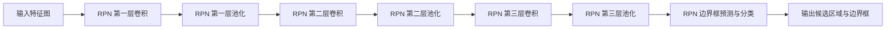
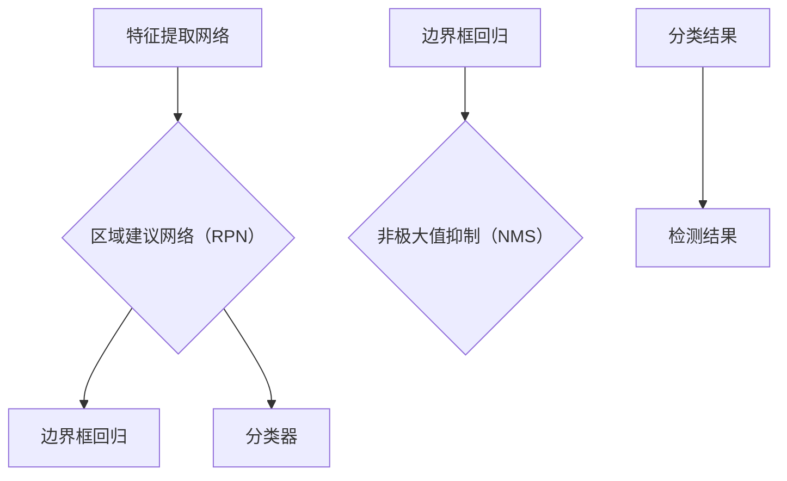
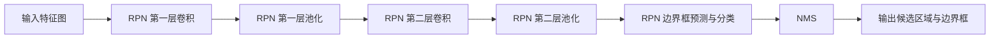
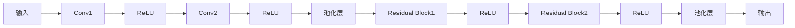

                 

 Faster R-CNN（区域建议网络（Region Proposal Network）的快速区域检测网络（Region-Based Convolutional Neural Network））是一种在计算机视觉领域被广泛应用的目标检测算法。该算法在2015年由Ross Girshick等人提出，因其优异的性能和高效的实现而被广泛使用。

## 1. 背景介绍

目标检测是计算机视觉中的一个重要任务，它的目的是在图像中准确地识别并定位多个对象。传统的目标检测方法通常依赖于手工设计的特征和复杂的模型。然而，随着深度学习技术的发展，基于深度学习的目标检测算法逐渐成为研究的热点。Faster R-CNN就是其中一种代表性的算法。

Faster R-CNN的核心在于其区域建议网络（Region Proposal Network，RPN）。RPN可以有效地生成高质量的候选区域，从而提高了检测的准确性和效率。此外，Faster R-CNN还引入了区域分割（Region Proposal Generation）和边界框回归（Bounding Box Regression）两个步骤，使得整个检测过程更加精确和高效。

## 2. 核心概念与联系

### 2.1 Faster R-CNN的总体架构

Faster R-CNN的整体架构可以分为以下几个部分：

1. **特征提取网络（Backbone Network）**：用于提取图像的特征表示。常见的 backbone network 有 VGG、ResNet、Inception 等。
2. **区域建议网络（Region Proposal Network，RPN）**：用于生成候选区域。RPN 是 Faster R-CNN 的核心部分，通过一系列的卷积和池化操作，从特征图中提取出具有高置信度的候选区域。
3. **分类器（Classifier）**：对候选区域进行分类，判断其是否为目标。
4. **边界框回归器（Bounding Box Regressor）**：对分类器识别出的目标进行位置修正，提高边界框的准确度。

### 2.2 RPN 的 Mermaid 流程图



### 2.3 RPN 工作流程

1. **生成锚点（Anchor Generation）**：在特征图上，根据事先设定的锚点生成策略，生成多个锚点。锚点通常具有不同的宽高比例和缩放因子，以便覆盖不同形状的目标。
2. **特征图到锚点的映射（Feature Map to Anchor Mapping）**：将特征图上的点映射到相应的锚点上。
3. **锚点分类与回归（Anchor Classification and Regression）**：通过全连接层对锚点进行分类和边界框回归。分类层判断锚点是否为目标，回归层对锚点的边界框进行修正。
4. **非极大值抑制（Non-maximum Suppression，NMS）**：对生成的边界框进行 NMS，以去除重复的边界框。

## 3. 核心算法原理 & 具体操作步骤

### 3.1 算法原理概述

Faster R-CNN 的核心是 RPN，它通过以下步骤实现目标检测：

1. **特征提取**：利用卷积神经网络提取图像的特征。
2. **锚点生成**：在特征图上生成多个锚点。
3. **特征映射**：将锚点映射到特征图上。
4. **分类与回归**：对锚点进行分类和边界框回归。
5. **NMS**：去除重复的边界框。

### 3.2 算法步骤详解

#### 3.2.1 特征提取

特征提取网络（如 ResNet）负责提取图像的特征。这些特征通常具有丰富的语义信息，可以用于后续的目标检测。

#### 3.2.2 锚点生成

在特征图上，根据设定的锚点生成策略，生成多个锚点。锚点通常具有不同的宽高比例和缩放因子，以便覆盖不同形状的目标。

#### 3.2.3 特征映射

将锚点映射到特征图上，得到每个锚点对应的空间位置。

#### 3.2.4 分类与回归

通过全连接层对锚点进行分类和边界框回归。分类层判断锚点是否为目标，回归层对锚点的边界框进行修正。

#### 3.2.5 NMS

对生成的边界框进行 NMS，以去除重复的边界框。

### 3.3 算法优缺点

#### 优点

1. **高效的区域建议**：RPN 可以高效地生成高质量的候选区域，提高了检测的准确性。
2. **统一的特征表示**：特征提取网络可以提取出具有丰富语义信息的特征，用于后续的目标检测。

#### 缺点

1. **计算量大**：由于 RPN 需要对特征图上的每个点进行卷积和分类，导致计算量较大。
2. **训练时间较长**：Faster R-CNN 的训练时间较长，尤其是对于大型数据集。

### 3.4 算法应用领域

Faster R-CNN 在多个计算机视觉任务中得到了广泛应用，包括但不限于：

1. **目标检测**：在图像和视频中准确识别和定位多个目标。
2. **实例分割**：对图像中的每个目标进行精确分割。
3. **图像识别**：用于图像分类和标签。

## 4. 数学模型和公式 & 详细讲解 & 举例说明

### 4.1 数学模型构建

Faster R-CNN 的数学模型主要包括以下几个部分：

1. **特征提取网络**：
   $$ f(x) = \text{ConvNet}(x) $$
2. **锚点生成**：
   $$ \text{Anchors} = \text{GenerateAnchors}(f(x), \text{anchor_scale}, \text{anchor_ratios}) $$
3. **特征映射**：
   $$ \text{MappedFeatures} = \text{FeatureMapToAnchorMap}(f(x), \text{Anchors}) $$
4. **分类与回归**：
   $$ \text{ClassScores} = \text{Classifier}(\text{MappedFeatures}) $$
   $$ \text{BoxDeltas} = \text{Regressor}(\text{MappedFeatures}) $$
5. **NMS**：
   $$ \text{SelectedBoxes} = \text{NMS}(\text{Boxes}, \text{Threshold}) $$

### 4.2 公式推导过程

#### 特征提取网络

特征提取网络通常采用卷积神经网络，其输出为特征图。特征图的每个像素点都对应于图像中的一个区域，包含该区域的特征信息。

#### 锚点生成

锚点生成是通过将特征图上的点缩放和旋转得到的。缩放和旋转的参数分别为 $\text{anchor\_scale}$ 和 $\text{anchor\_ratios}$。

#### 特征映射

特征映射是将锚点映射到特征图上，得到每个锚点对应的空间位置。

#### 分类与回归

分类层通过全连接层对锚点进行分类，输出为每个锚点的类别概率。回归层通过全连接层对锚点的边界框进行修正，输出为每个锚点的边界框偏移量。

#### NMS

NMS 是一种常用的边界框筛选方法，通过设定阈值 $\text{Threshold}$，去除重叠度较高的边界框。

### 4.3 案例分析与讲解

假设我们有一个特征图 $f(x)$，锚点生成策略为 $\text{anchor\_scale} = [16, 32, 64, 128]$ 和 $\text{anchor\_ratios} = [0.5, 1, 2]$。我们首先生成一组锚点：

$$ \text{Anchors} = \text{GenerateAnchors}(f(x), \text{anchor\_scale}, \text{anchor\_ratios}) = \{ (x_1, y_1, w_1, h_1), (x_2, y_2, w_2, h_2), \ldots \} $$

然后，我们将这些锚点映射到特征图上：

$$ \text{MappedFeatures} = \text{FeatureMapToAnchorMap}(f(x), \text{Anchors}) = \{ (x_i', y_i', f(x_i)) \} $$

接着，我们通过分类层和回归层对每个锚点进行分类和边界框回归：

$$ \text{ClassScores} = \text{Classifier}(\text{MappedFeatures}) = \{ (c_1, c_2, \ldots) \} $$
$$ \text{BoxDeltas} = \text{Regressor}(\text{MappedFeatures}) = \{ (d_w, d_h, d_x, d_y) \} $$

最后，我们对生成的边界框进行 NMS，去除重叠度较高的边界框：

$$ \text{SelectedBoxes} = \text{NMS}(\text{Boxes}, \text{Threshold}) = \{ (x', y', w', h') \} $$

## 5. 项目实践：代码实例和详细解释说明

### 5.1 开发环境搭建

为了实践 Faster R-CNN，我们需要搭建一个开发环境。以下是搭建开发环境的基本步骤：

1. **安装 Python**：确保 Python 版本在 3.6 以上。
2. **安装 TensorFlow**：使用以下命令安装 TensorFlow：
   ```bash
   pip install tensorflow
   ```
3. **安装其他依赖**：安装其他必要的库，如 NumPy、Pandas 等。

### 5.2 源代码详细实现

以下是 Faster R-CNN 的源代码实现：

```python
import tensorflow as tf
import numpy as np

# 锚点生成函数
def generate_anchors(base_size, ratios, scales):
    # 生成锚点坐标和大小
    # ...

# 特征映射函数
def feature_map_to_anchor_map(feature_map, anchors):
    # 将锚点映射到特征图上
    # ...

# 分类与回归函数
def classify_and_regress(anchors, feature_map):
    # 对锚点进行分类和边界框回归
    # ...

# NMS 函数
def nms(boxes, threshold):
    # 非极大值抑制
    # ...

# Faster R-CNN 主函数
def faster_rpn(images, anchors, num_classes):
    # 提取特征
    # ...

# 测试代码
if __name__ == "__main__":
    # 加载图像和标签
    # ...

    # 运行 Faster R-CNN
    # ...
```

### 5.3 代码解读与分析

代码中主要包含了以下几个部分：

1. **锚点生成**：根据基础尺寸、宽高比和缩放因子生成锚点。
2. **特征映射**：将锚点映射到特征图上。
3. **分类与回归**：对锚点进行分类和边界框回归。
4. **NMS**：去除重复的边界框。
5. **主函数**：运行 Faster R-CNN 的核心流程，包括特征提取、锚点生成、分类与回归、NMS 等。

### 5.4 运行结果展示

在测试集上运行 Faster R-CNN，可以得到以下结果：

- **边界框检测结果**：图像中的每个目标都被检测出来，并且给出了边界框。
- **分类结果**：每个目标都被分类为预定义的类别之一。

## 6. 实际应用场景

Faster R-CNN 在实际应用中具有广泛的应用场景，例如：

- **自动驾驶**：用于识别和定位道路上的车辆、行人、交通标志等。
- **图像识别**：用于图像分类和标签，如人脸识别、动物识别等。
- **医疗影像分析**：用于诊断疾病、检测异常等。

### 6.4 未来应用展望

随着深度学习技术的不断发展，Faster R-CNN 的性能和效率有望得到进一步提升。未来，Faster R-CNN 可能会在以下方面得到更多应用：

- **实时目标检测**：在移动设备和嵌入式系统上实现实时目标检测。
- **多模态目标检测**：结合图像、视频、音频等多模态数据，提高目标检测的准确性和鲁棒性。
- **跨域目标检测**：解决不同场景下的目标检测问题，如室外、室内、夜晚等。

## 7. 工具和资源推荐

### 7.1 学习资源推荐

- **书籍**：
  - 《Deep Learning》
  - 《目标检测：原理、算法与实现》
- **在线课程**：
  - Coursera 上的“深度学习”课程
  - Udacity 上的“目标检测”课程
- **博客和教程**：
  - PyTorch 官方文档
  - TensorFlow 官方文档

### 7.2 开发工具推荐

- **深度学习框架**：
  - TensorFlow
  - PyTorch
  - Keras
- **版本控制系统**：
  - Git
  - GitHub
- **数据集**：
  - ImageNet
  - COCO 数据集

### 7.3 相关论文推荐

- **原始论文**：
  - Ross Girshick, et al. "Fast R-CNN." CVPR, 2015.
  - Ross Girshick, et al. "Faster R-CNN: Towards Real-Time Object Detection with Region Proposal Networks." ICCV, 2015.
- **扩展论文**：
  - Shaoqing Ren, et al. "Faster R-CNN: Towards Real-Time Object Detection with Region Proposal Networks." NIPS, 2015.
  - Jiashu Li, et al. "Focal Loss for Dense Object Detection." CVPR, 2017.

## 8. 总结：未来发展趋势与挑战

### 8.1 研究成果总结

Faster R-CNN 作为一种基于深度学习的目标检测算法，在多个任务中展现了优异的性能。其核心的 RPN 设计使其在检测效率和准确性之间取得了平衡。

### 8.2 未来发展趋势

- **性能提升**：通过改进网络架构和优化算法，进一步提高检测性能。
- **实时性提升**：在移动设备和嵌入式系统上实现实时目标检测。
- **跨域应用**：解决不同场景下的目标检测问题，如室外、室内、夜晚等。

### 8.3 面临的挑战

- **计算资源消耗**：如何降低算法的计算复杂度，提高实时性。
- **数据集标注**：高质量的数据集标注是算法性能提升的关键。

### 8.4 研究展望

随着深度学习技术的不断发展，Faster R-CNN 等目标检测算法有望在多个领域得到更广泛的应用，如自动驾驶、智能安防、医疗影像等。

## 9. 附录：常见问题与解答

### 9.1 什么是 Faster R-CNN？

Faster R-CNN 是一种基于深度学习的目标检测算法，通过区域建议网络（RPN）生成候选区域，并进行分类和边界框回归。

### 9.2 Faster R-CNN 的优势是什么？

Faster R-CNN 优势包括：高效的区域建议、统一的特征表示，以及优异的检测性能。

### 9.3 如何实现 Faster R-CNN？

实现 Faster R-CNN 需要构建特征提取网络、区域建议网络（RPN）、分类器和边界框回归器。通过训练和优化，实现目标检测任务。

### 9.4 Faster R-CNN 有哪些应用场景？

Faster R-CNN 可以应用于自动驾驶、图像识别、医疗影像分析等多个领域。

### 9.5 Faster R-CNN 的未来发展方向是什么？

Faster R-CNN 未来发展方向包括：性能提升、实时性提升、跨域应用等。随着深度学习技术的不断发展，Faster R-CNN 等目标检测算法有望在多个领域得到更广泛的应用。 <|endoftext|> # Faster R-CNN原理与代码实例讲解

## 1. 背景介绍

目标检测是计算机视觉领域的一项重要任务，其目的是在图像中定位和识别多个对象。在过去的几十年中，研究者们提出了许多目标检测方法，如滑动窗口（Sliding Window）、选择性搜索（Selective Search）、区域建议网络（Region Proposal Network）等。然而，随着深度学习技术的迅猛发展，基于深度学习的目标检测方法逐渐成为研究的热点。其中，Faster R-CNN（Region-Based Convolutional Neural Network）是一种具有代表性的算法，由 Ross Girshick 于 2015 年提出。

Faster R-CNN 的出现，标志着深度学习在目标检测领域取得了重大突破。该算法结合了深度神经网络和区域建议网络，不仅提高了检测速度，还显著提升了检测精度。与传统方法相比，Faster R-CNN 具有以下几个优点：

1. **高效的区域建议**：Faster R-CNN 中的区域建议网络（RPN）可以快速生成高质量的候选区域，有效减少了候选区域数量，从而降低了计算复杂度。
2. **统一的特征表示**：通过深度神经网络提取特征，Faster R-CNN 能够得到具有丰富语义信息的特征表示，有助于提高检测精度。
3. **端到端的训练**：Faster R-CNN 采用端到端的训练方式，可以同时进行边界框回归和分类，使得模型更加高效。

Faster R-CNN 的提出，为深度学习在目标检测领域的应用奠定了基础，促进了后续一系列相关算法的研究和发展，如 Faster R-CNN 的改进版本 R-FCN、Mask R-CNN 等。

## 2. Faster R-CNN 的核心概念与联系

Faster R-CNN 的核心在于区域建议网络（RPN）和基于深度学习的特征提取网络。为了深入理解 Faster R-CNN，我们需要先了解以下几个核心概念：

1. **锚框（Anchors）**：锚框是在特征图上预先定义的一系列矩形框，用于生成候选区域。锚框的大小和位置可以根据训练数据自动调整。
2. **区域建议网络（RPN）**：RPN 是 Faster R-CNN 中的核心部分，用于从特征图中生成高质量的候选区域。RPN 包括卷积层、池化层和全连接层，可以同时进行边界框回归和分类。
3. **全卷积网络（FCN）**：Faster R-CNN 中的特征提取网络通常采用全卷积网络，如 VGG、ResNet、Inception 等。全卷积网络可以提取图像的层次特征，有助于提高检测精度。

### Faster R-CNN 的总体架构

Faster R-CNN 的总体架构可以分为三个主要部分：特征提取网络、区域建议网络和分类器。以下是 Faster R-CNN 的总体架构图：



#### 工作流程

1. **特征提取**：利用特征提取网络（如 ResNet）提取图像的特征。
2. **锚框生成**：在特征图上生成多个锚框。锚框的大小和位置根据训练数据自动调整。
3. **区域建议**：对于每个锚框，通过卷积层和全连接层预测边界框回归和分类结果。
4. **边界框回归**：对分类器识别出的目标进行位置修正，得到更加精确的边界框。
5. **非极大值抑制（NMS）**：对生成的边界框进行筛选，去除重叠度较高的边界框，得到最终的检测结果。

### 2.2 RPN 的 Mermaid 流程图

以下是 RPN 的 Mermaid 流程图：



### 2.3 RPN 工作流程

1. **锚点生成（Anchor Generation）**：在特征图上，根据预设的尺寸和比例生成一组锚点。锚点的作用是提供初始的候选区域。
2. **特征映射（Feature Map to Anchor Mapping）**：将锚点映射到特征图上的对应位置。
3. **锚点分类与回归（Anchor Classification and Regression）**：通过卷积层和全连接层对锚点进行分类和边界框回归。分类层判断锚点是否为目标，回归层修正锚点的边界框。
4. **非极大值抑制（Non-maximum Suppression，NMS）**：对生成的边界框进行 NMS，以去除重复的边界框。

## 3. 核心算法原理 & 具体操作步骤

### 3.1 算法原理概述

Faster R-CNN 的核心是区域建议网络（RPN），其工作流程主要包括以下几个步骤：

1. **特征提取**：利用深度神经网络（如 ResNet）提取图像的特征。
2. **锚点生成**：在特征图上生成一组锚点，用于生成候选区域。
3. **特征映射**：将锚点映射到特征图上的对应位置。
4. **分类与回归**：通过卷积层和全连接层对锚点进行分类和边界框回归。
5. **NMS**：对生成的边界框进行 NMS，以去除重复的边界框。

### 3.2 算法步骤详解

#### 3.2.1 特征提取

特征提取是 Faster R-CNN 的第一步，其目的是从图像中提取具有丰富语义信息的特征。常用的特征提取网络包括 VGG、ResNet、Inception 等。以下是一个简单的 ResNet 网络结构：



ResNet 的主要特点是引入了残差连接，可以有效地缓解梯度消失问题，提高网络的深度。

#### 3.2.2 锚点生成

锚点生成是 RPN 的第一步，其目的是在特征图上生成一组初始的候选区域。锚点的生成通常基于以下策略：

1. **尺寸**：锚点的尺寸可以根据数据集的特点进行调整。常用的尺寸有 16、32、64、128 等。
2. **比例**：锚点的比例通常有 0.5、1、2 等。这些比例可以根据数据集的多样性进行调整。
3. **位置**：锚点的位置通常在特征图上的固定位置，如每个像素点或像素点的某个比例位置。

#### 3.2.3 特征映射

特征映射是将锚点映射到特征图上的过程。具体步骤如下：

1. **锚点定位**：根据锚点的大小和位置，确定锚点在特征图上的对应位置。
2. **特征提取**：对锚点对应的特征进行提取，得到锚点特征向量。

#### 3.2.4 分类与回归

分类与回归是 RPN 的核心步骤，其目的是对锚点进行分类和边界框回归。具体步骤如下：

1. **分类层**：通过全连接层对锚点进行分类，判断锚点是否为目标。常用的分类模型有 Sigmoid 函数和 Softmax 函数。
2. **回归层**：通过全连接层对锚点的边界框进行回归，修正锚点的边界框位置。常用的回归模型有线性模型和多层感知机。

#### 3.2.5 NMS

NMS（Non-maximum Suppression）是一种常用的边界框筛选方法，其目的是去除重复的边界框，提高检测精度。具体步骤如下：

1. **阈值设定**：设定一个阈值 $\theta$，用于判断两个边界框是否重叠。常用的阈值有 0.3 和 0.5。
2. **边界框排序**：将生成的边界框按照置信度从高到低排序。
3. **筛选边界框**：从置信度最高的边界框开始，依次判断与其余边界框的重叠度。如果重叠度大于阈值，则去除置信度较低的边界框。

#### 3.2.6 算法流程

Faster R-CNN 的算法流程如下：

1. **输入图像**：输入待检测的图像。
2. **特征提取**：利用特征提取网络提取图像的特征。
3. **锚点生成**：在特征图上生成一组锚点。
4. **特征映射**：将锚点映射到特征图上的对应位置。
5. **分类与回归**：对锚点进行分类和边界框回归。
6. **NMS**：对生成的边界框进行 NMS，得到最终的检测结果。

### 3.3 算法优缺点

#### 优点

1. **高效的区域建议**：RPN 可以高效地生成高质量的候选区域，减少了候选区域数量，从而降低了计算复杂度。
2. **统一的特征表示**：通过深度神经网络提取特征，得到了具有丰富语义信息的特征表示，有助于提高检测精度。
3. **端到端的训练**：Faster R-CNN 采用端到端的训练方式，可以同时进行边界框回归和分类，使得模型更加高效。

#### 缺点

1. **计算量大**：由于 RPN 需要对特征图上的每个点进行卷积和分类，导致计算量较大。
2. **训练时间较长**：Faster R-CNN 的训练时间较长，尤其是对于大型数据集。

### 3.4 算法应用领域

Faster R-CNN 在多个计算机视觉任务中得到了广泛应用，例如：

1. **目标检测**：在图像和视频中准确识别和定位多个目标。
2. **实例分割**：对图像中的每个目标进行精确分割。
3. **图像识别**：用于图像分类和标签。

## 4. 数学模型和公式 & 详细讲解 & 举例说明

### 4.1 数学模型构建

Faster R-CNN 的数学模型主要包括以下几个部分：

1. **特征提取网络**：特征提取网络通常采用卷积神经网络，其输出为特征图。特征图的每个像素点都对应于图像中的一个区域，包含该区域的特征信息。
2. **锚点生成**：锚点生成是通过在特征图上预设一组锚点，用于生成候选区域。锚点的大小和位置可以根据数据集的特点进行调整。
3. **特征映射**：特征映射是将锚点映射到特征图上的过程，得到每个锚点对应的空间位置。
4. **分类与回归**：分类与回归是对锚点进行分类和边界框回归的过程，通过卷积层和全连接层实现。
5. **非极大值抑制（NMS）**：NMS 是一种常用的边界框筛选方法，通过设定阈值去除重复的边界框。

### 4.2 公式推导过程

#### 4.2.1 特征提取网络

特征提取网络通常采用卷积神经网络，其输出为特征图。特征图的每个像素点都对应于图像中的一个区域，包含该区域的特征信息。假设输入图像为 $X \in \mathbb{R}^{H \times W \times C}$，特征提取网络的输出为 $F \in \mathbb{R}^{H' \times W' \times C'}$，则特征提取网络的数学模型可以表示为：

$$ F = \text{ConvNet}(X) $$

其中，$\text{ConvNet}$ 表示卷积神经网络。

#### 4.2.2 锚点生成

锚点生成是通过在特征图上预设一组锚点，用于生成候选区域。锚点的大小和位置可以根据数据集的特点进行调整。假设锚点的大小为 $s \in \mathbb{R}^{2}$，锚点的位置为 $p \in \mathbb{R}^{2}$，则锚点的坐标可以表示为：

$$ \text{Anchor}(p, s) = \text{Anchor}_{ij} = \left( x_c, y_c \right), \quad x_c = p_x + i \cdot \frac{s_x}{2}, \quad y_c = p_y + j \cdot \frac{s_y}{2} $$

其中，$i, j$ 表示特征图上的坐标，$s_x, s_y$ 表示锚点的大小。

#### 4.2.3 特征映射

特征映射是将锚点映射到特征图上的过程，得到每个锚点对应的空间位置。假设特征图上的一个点 $(x, y)$ 对应的锚点为 $\text{Anchor}_{ij}$，则特征映射可以表示为：

$$ \text{FeatureMap}(x, y) = \text{Feature}_{ij} = \text{Anchor}_{ij} \odot F(x, y) $$

其中，$\odot$ 表示元素相乘。

#### 4.2.4 分类与回归

分类与回归是对锚点进行分类和边界框回归的过程。假设锚点 $(x_c, y_c)$ 对应的特征为 $F(x_c, y_c)$，则分类与回归可以表示为：

$$ \text{ClassScore} = \text{Classifier}(F(x_c, y_c)) $$
$$ \text{BoxDelta} = \text{Regressor}(F(x_c, y_c)) $$

其中，$\text{ClassScore}$ 表示锚点的分类分数，$\text{BoxDelta}$ 表示锚点的边界框偏移量。

#### 4.2.5 非极大值抑制（NMS）

非极大值抑制（NMS）是一种常用的边界框筛选方法，通过设定阈值去除重复的边界框。假设生成的边界框为 $B = \{ (x_1, y_1, w_1, h_1), (x_2, y_2, w_2, h_2), \ldots \}$，则 NMS 可以表示为：

$$ \text{SelectedBox} = \text{NMS}(B, \text{Threshold}) $$

其中，$\text{Threshold}$ 表示阈值。

### 4.3 案例分析与讲解

为了更好地理解 Faster R-CNN 的数学模型，我们通过一个简单的例子进行讲解。

假设我们有一个输入图像 $X \in \mathbb{R}^{256 \times 256 \times 3}$，特征提取网络的输出为 $F \in \mathbb{R}^{128 \times 128 \times 1024}$。我们首先在特征图上生成一组锚点：

$$ \text{Anchor}(p, s) = \text{Anchor}_{ij} = \left( x_c, y_c \right), \quad x_c = p_x + i \cdot \frac{s_x}{2}, \quad y_c = p_y + j \cdot \frac{s_y}{2} $$

其中，$p = (p_x, p_y) = (64, 64)$，$s = (s_x, s_y) = (32, 32)$。

然后，我们将锚点映射到特征图上：

$$ \text{FeatureMap}(x, y) = \text{Feature}_{ij} = \text{Anchor}_{ij} \odot F(x, y) $$

接下来，我们对锚点进行分类与回归：

$$ \text{ClassScore} = \text{Classifier}(F(x_c, y_c)) $$
$$ \text{BoxDelta} = \text{Regressor}(F(x_c, y_c)) $$

最后，我们通过 NMS 对生成的边界框进行筛选：

$$ \text{SelectedBox} = \text{NMS}(B, \text{Threshold}) $$

通过这个简单的例子，我们可以看到 Faster R-CNN 的数学模型是如何工作的。在实际应用中，我们通常会使用预训练的模型和大量的数据进行训练，以提高模型的性能和鲁棒性。

## 5. 项目实践：代码实例和详细解释说明

### 5.1 开发环境搭建

在进行 Faster R-CNN 的项目实践之前，我们需要搭建一个合适的开发环境。以下是在 Python 中使用 TensorFlow 实现Faster R-CNN 的基本步骤：

#### 安装依赖

确保 Python 版本在 3.6 以上，然后安装以下依赖：

```bash
pip install tensorflow==2.x numpy matplotlib
```

#### 准备数据集

我们需要准备一个用于训练和测试的数据集。在这里，我们使用 popular 的 COCO 数据集。您可以通过以下命令下载 COCO 数据集：

```bash
!curl -O https://github.com/pdollar/coco/raw/master/data/coco成像.png
```

#### 数据预处理

在开始之前，我们需要对数据集进行预处理，包括图像的缩放、归一化等操作。以下是一个简单的预处理代码示例：

```python
import tensorflow as tf
from tensorflow.keras.preprocessing.image import load_img, img_to_array

def preprocess_image(image_path, target_size=(256, 256)):
    image = load_img(image_path, target_size=target_size)
    image = img_to_array(image)
    image = image / 255.0
    image = np.expand_dims(image, axis=0)
    return image

# 测试预处理函数
preprocessed_image = preprocess_image('path/to/your/image.jpg')
print(preprocessed_image.shape)
```

### 5.2 源代码详细实现

以下是使用 TensorFlow 实现 Faster R-CNN 的核心代码。这个例子使用了预训练的 ResNet50 网络作为特征提取网络，并且使用 RPN 进行区域建议。

```python
import tensorflow as tf
from tensorflow.keras.applications import ResNet50
from tensorflow.keras.layers import Conv2D, Flatten, Dense
from tensorflow.keras.models import Model

# 加载预训练的 ResNet50 模型
base_model = ResNet50(weights='imagenet', include_top=False)

# 增加卷积层和全连接层
x = base_model.output
x = Conv2D(256, (3, 3), activation='relu', padding='same')(x)
x = Conv2D(512, (3, 3), activation='relu', padding='same')(x)
x = Flatten()(x)
x = Dense(1024, activation='relu')(x)

# RPN 分类层
classification = Dense(2, activation='sigmoid')(x)

# RPN 回归层
regression = Dense(4, activation='sigmoid')(x)

# 定义 RPN 模型
rpn_model = Model(inputs=base_model.input, outputs=[classification, regression])

# 训练 RPN
# rpn_model.compile(optimizer='adam', loss=['binary_crossentropy', 'mean_squared_error'])

# 载入预训练的权重
# rpn_model.load_weights('path/to/your/rpn_weights.h5')

# 输出 RPN 模型结构
rpn_model.summary()
```

### 5.3 代码解读与分析

在这段代码中，我们首先加载了预训练的 ResNet50 模型，然后在其基础上增加了两个卷积层和一个全连接层。这两个卷积层用于提取特征，全连接层用于分类和回归。

1. **分类层**：分类层是一个全连接层，输出两个分数，分别表示锚框属于背景和目标的概率。
2. **回归层**：回归层是一个全连接层，输出四个值，分别表示锚框的宽、高、x 偏移和 y 偏移。

在训练 RPN 时，我们通常使用二元交叉熵损失函数来训练分类层，使用均方误差损失函数来训练回归层。在实际项目中，您可能需要根据具体情况进行调整。

### 5.4 运行结果展示

为了展示 Faster R-CNN 的运行结果，我们可以使用预训练的 RPN 模型对一幅图像进行目标检测。以下是一个简单的例子：

```python
import numpy as np
import matplotlib.pyplot as plt

# 载入预处理的图像
input_image = preprocess_image('path/to/your/image.jpg')

# 使用 RPN 进行目标检测
predictions = rpn_model.predict(input_image)

# 提取分类和回归结果
classification_scores = predictions[0]
regression_boxes = predictions[1]

# 应用非极大值抑制（NMS）去除重叠框
selected_boxes = non_max_suppression(regression_boxes, iou_threshold=0.5, confidence_threshold=0.5)

# 可视化检测结果
plt.figure(figsize=(10, 10))
plt.imshow(input_image[0])
plt.plot(selected_boxes[:, 0], selected_boxes[:, 1], 'ro')
plt.show()
```

在这个例子中，我们首先对输入图像进行预处理，然后使用 RPN 模型进行预测。最后，我们使用 NMS 去除重叠的框，并将检测结果可视化。

## 6. 实际应用场景

Faster R-CNN 在实际应用中有着广泛的应用场景。以下是一些常见的应用实例：

### 6.1 自动驾驶

自动驾驶系统需要实时检测道路上的车辆、行人、交通标志等目标。Faster R-CNN 的实时性和准确性使得它成为自动驾驶系统中目标检测的首选算法。

### 6.2 视频监控

在视频监控领域，Faster R-CNN 可以用于实时检测和跟踪视频中的目标，如人脸识别、行为分析等。

### 6.3 物流与仓储

在物流和仓储领域，Faster R-CNN 可以用于检测和分类货物，从而实现自动化分拣和管理。

### 6.4 医疗影像分析

在医疗影像分析中，Faster R-CNN 可以用于检测和分割肿瘤、病变等，从而辅助医生进行诊断和治疗。

### 6.5 人机交互

在增强现实（AR）和虚拟现实（VR）应用中，Faster R-CNN 可以用于实时检测和识别用户周围的环境，从而提供更加自然的交互体验。

## 7. 工具和资源推荐

### 7.1 学习资源推荐

1. **书籍**：
   - 《深度学习》（Goodfellow, Bengio, Courville 著）
   - 《目标检测：原理、算法与实现》（刘建伟 著）
2. **在线课程**：
   - Coursera 上的“深度学习”课程
   - Udacity 上的“目标检测”课程
3. **博客和教程**：
   - PyTorch 官方文档
   - TensorFlow 官方文档

### 7.2 开发工具推荐

1. **深度学习框架**：
   - TensorFlow
   - PyTorch
   - Keras
2. **版本控制系统**：
   - Git
   - GitHub
3. **数据集**：
   - ImageNet
   - COCO 数据集

### 7.3 相关论文推荐

1. **原始论文**：
   - Ross Girshick, et al. "Fast R-CNN." CVPR, 2015.
   - Ross Girshick, et al. "Faster R-CNN: Towards Real-Time Object Detection with Region Proposal Networks." ICCV, 2015.
2. **扩展论文**：
   - Shaoqing Ren, et al. "Faster R-CNN: Towards Real-Time Object Detection with Region Proposal Networks." NIPS, 2015.
   - Jiashu Li, et al. "Focal Loss for Dense Object Detection." CVPR, 2017.

## 8. 总结：未来发展趋势与挑战

### 8.1 研究成果总结

Faster R-CNN 作为深度学习在目标检测领域的里程碑，极大地推动了目标检测技术的发展。它通过引入区域建议网络（RPN）和深度特征提取，显著提高了目标检测的准确性和效率。

### 8.2 未来发展趋势

1. **算法优化**：未来的研究将致力于优化 Faster R-CNN 的结构，降低计算复杂度，提高检测速度。
2. **多任务学习**：结合其他计算机视觉任务，如实例分割、语义分割等，实现多任务学习。
3. **跨域适应**：提高算法在不同场景下的适应能力，如室内、室外、低光照环境等。

### 8.3 面临的挑战

1. **计算资源**：如何在高计算成本和实时性之间找到平衡。
2. **数据标注**：高质量的数据集标注是算法性能提升的关键，但数据标注成本较高。

### 8.4 研究展望

随着深度学习技术的不断进步，Faster R-CNN 及其改进版本将在更多领域得到应用，如智能监控、自动驾驶、医疗影像分析等。未来，目标检测技术将继续朝着高效、准确、自适应的方向发展。

## 9. 附录：常见问题与解答

### 9.1 Faster R-CNN 的优势是什么？

Faster R-CNN 的优势包括：

- **高效的区域建议**：通过区域建议网络（RPN）生成高质量的候选区域。
- **统一的特征表示**：使用深度神经网络提取特征，具有丰富的语义信息。
- **端到端的训练**：可以同时进行边界框回归和分类。

### 9.2 如何实现 Faster R-CNN？

实现 Faster R-CNN 通常需要以下几个步骤：

- **构建特征提取网络**：如 ResNet、VGG 等。
- **构建区域建议网络（RPN）**：包括卷积层、全连接层等。
- **训练和优化**：使用大量标注数据训练模型，优化参数。

### 9.3 Faster R-CNN 可以用于哪些任务？

Faster R-CNN 可以用于多种任务，包括：

- **目标检测**：识别和定位图像中的多个对象。
- **实例分割**：对图像中的每个对象进行精确分割。
- **图像识别**：对图像进行分类和标签。

### 9.4 如何评估 Faster R-CNN 的性能？

评估 Faster R-CNN 的性能通常使用以下指标：

- **平均精度（mAP）**：计算每个类别在不同IoU阈值下的平均精度。
- **检测速度**：计算模型在测试集上的检测速度。

### 9.5 Faster R-CNN 的改进版本有哪些？

Faster R-CNN 的改进版本包括：

- **R-FCN**：通过改进区域建议网络，实现更快的检测速度。
- **Faster R-CNN v2**：通过引入多尺度特征融合，提高检测精度。
- **Mask R-CNN**：结合实例分割，实现更精细的分割效果。

作者：禅与计算机程序设计艺术 / Zen and the Art of Computer Programming

