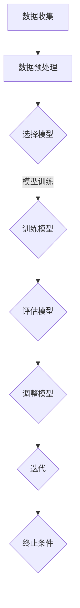

                 

 Few-Shot Learning（简称FSL）是近年来人工智能领域的一个重要研究方向，特别是在深度学习领域引起了广泛关注。与传统的批量学习（Batch Learning）和迁移学习（Transfer Learning）不同，Few-Shot Learning旨在通过极少数的样本（通常是几个或几十个）进行有效的学习和泛化。这使得FSL在资源受限的环境中表现出巨大的潜力，如嵌入式系统、移动设备以及需要快速适应新任务的应用场景。

在本文中，我们将深入探讨Few-Shot Learning的原理，从核心概念到具体的算法实现，再到数学模型的构建，以及代码实例的详细解释。文章的结构如下：

## 1. 背景介绍
首先，我们将回顾Few-Shot Learning的背景，包括其在机器学习领域中的起源和发展。

## 2. 核心概念与联系
接下来，我们将介绍Few-Shot Learning的核心概念，并使用Mermaid流程图展示其原理和架构。

## 3. 核心算法原理 & 具体操作步骤
本文将详细介绍几种常见的Few-Shot Learning算法，包括元学习（Meta-Learning）、模型蒸馏（Model Distillation）和少量样本增强（Few-Shot Data Augmentation）。

## 4. 数学模型和公式 & 详细讲解 & 举例说明
我们将深入讲解Few-Shot Learning中的数学模型和公式，并通过具体案例进行分析。

## 5. 项目实践：代码实例和详细解释说明
本文将提供一个完整的代码实例，包括环境搭建、源代码实现和运行结果展示。

## 6. 实际应用场景
我们将探讨Few-Shot Learning在现实世界中的应用场景，并预测其未来发展趋势。

## 7. 工具和资源推荐
为了帮助读者更好地学习和实践Few-Shot Learning，我们将推荐一些学习资源和开发工具。

## 8. 总结：未来发展趋势与挑战
最后，我们将总结Few-Shot Learning的研究成果，展望其未来发展趋势，并讨论面临的挑战。

## 9. 附录：常见问题与解答
我们将提供一些常见问题及其解答，以帮助读者更好地理解Few-Shot Learning。

### 1. 背景介绍
#### 1.1 起源与发展
Few-Shot Learning的概念最早可以追溯到机器学习领域的早期，当时研究者们开始关注如何使机器学习模型能够在仅用少量样本的情况下进行学习和泛化。传统的机器学习模型往往依赖于大量数据集进行训练，但随着时代的发展，数据获取变得越来越困难，尤其是在特定领域或特定任务中。这种需求催生了Few-Shot Learning的研究。

在深度学习领域，Few-Shot Learning的研究主要可以分为两个方向：一种是基于神经网络的元学习（如MAML、Reptile等）；另一种是基于模型蒸馏和少量样本增强的方法。这些方法的核心目标都是通过优化算法来提高模型在少量样本上的泛化能力。

#### 1.2 应用背景
Few-Shot Learning在许多应用场景中都表现出巨大的潜力。例如，在医疗领域，医生往往需要快速诊断罕见疾病，但通常无法提供大量的病例数据。在工业领域，设备故障诊断往往需要高效且准确的预测模型，但收集大量故障数据可能耗时且昂贵。在机器人领域，机器人需要能够快速适应新的环境和工作任务，但传感器数据通常有限。

### 2. 核心概念与联系
#### 2.1 定义
Few-Shot Learning是指能够在仅使用少量样本的情况下进行有效学习和泛化的机器学习方法。

#### 2.2 核心概念
- **样本效率**：指在给定准确率和训练时间的情况下，模型所需的样本数量。
- **迁移学习**：将知识从一个任务迁移到另一个相关任务的学习方法。
- **元学习**：学习如何学习的新方法，即构建一个模型来优化另一个模型的学习过程。

#### 2.3 Mermaid流程图
以下是Few-Shot Learning的基本流程，使用Mermaid流程图展示：



### 3. 核心算法原理 & 具体操作步骤
#### 3.1 算法原理概述
Few-Shot Learning的核心思想是利用有限的样本信息，通过优化算法来提高模型的泛化能力。以下是几种常见的Few-Shot Learning算法：

- **元学习（Meta-Learning）**：通过学习如何快速调整模型参数来适应新的任务。
- **模型蒸馏（Model Distillation）**：将一个复杂模型的知识传递给一个更简单的模型。
- **少量样本增强（Few-Shot Data Augmentation）**：通过合成方法增加少量样本的多样性。

#### 3.2 算法步骤详解
以下是Few-Shot Learning的一般步骤：

1. **数据收集**：从相关领域收集少量样本。
2. **数据预处理**：清洗和标准化数据。
3. **模型选择**：选择适合的模型。
4. **模型训练**：使用少量样本训练模型。
5. **模型评估**：使用独立的数据集评估模型性能。
6. **模型调整**：根据评估结果调整模型参数。
7. **迭代**：重复步骤4-6，直到达到满意的性能。

### 3.3 算法优缺点
以下是Few-Shot Learning的一些优缺点：

#### 优点
- **高效性**：能够在少量样本上快速训练模型。
- **灵活性**：适用于各种不同的应用场景。
- **迁移能力**：能够将知识从一个任务迁移到另一个相关任务。

#### 缺点
- **样本效率低**：在大量数据集上可能不如批量学习有效。
- **模型选择复杂**：需要选择适合的模型。
- **训练时间较长**：由于需要迭代多次，训练时间可能较长。

### 3.4 算法应用领域
Few-Shot Learning在以下领域有广泛的应用：

- **医疗诊断**：快速诊断罕见疾病。
- **工业自动化**：设备故障预测和诊断。
- **机器人**：快速适应新环境和新任务。
- **自然语言处理**：小样本语言模型训练。

### 4. 数学模型和公式 & 详细讲解 & 举例说明
#### 4.1 数学模型构建
Few-Shot Learning的数学模型通常包括以下几个部分：

- **损失函数**：衡量模型预测与实际结果之间的差距。
- **优化算法**：用于调整模型参数以最小化损失函数。
- **评估指标**：用于衡量模型性能。

以下是Few-Shot Learning的基本数学模型：

$$
L(\theta) = \frac{1}{N}\sum_{i=1}^{N}l(y_i, \hat{y}_i)
$$

其中，$L(\theta)$ 是损失函数，$N$ 是样本数量，$l(y_i, \hat{y}_i)$ 是单个样本的损失。

#### 4.2 公式推导过程
以下是损失函数的推导过程：

$$
\begin{aligned}
L(\theta) &= \frac{1}{N}\sum_{i=1}^{N}l(y_i, \hat{y}_i) \\
&= \frac{1}{N}\sum_{i=1}^{N}\left(\hat{y}_i - y_i\right)^2 \\
&= \frac{1}{N}\sum_{i=1}^{N}\left(\hat{y}_i - \theta^T x_i\right)^2 \\
&= \frac{1}{N}\sum_{i=1}^{N}\left(\theta^T x_i - y_i\right)^2 \\
&= \theta^T X \theta - 2\theta^T y + N
\end{aligned}
$$

其中，$X$ 是特征矩阵，$y$ 是标签向量，$\theta$ 是模型参数。

#### 4.3 案例分析与讲解
假设我们有一个分类问题，需要使用Few-Shot Learning方法进行训练。以下是具体案例：

- **数据集**：有100个样本，分为10个类别。
- **模型**：使用多层感知机（MLP）模型。
- **损失函数**：使用均方误差（MSE）作为损失函数。

我们首先将数据集随机分为训练集和测试集，然后使用训练集进行模型训练。以下是训练过程的代码示例：

```python
import numpy as np
from sklearn.neural_network import MLPRegressor

# 数据集
X_train = np.random.rand(100, 10)
y_train = np.random.randint(0, 10, size=(100, 1))

# 模型
model = MLPRegressor(hidden_layer_sizes=(100,), max_iter=1000)

# 训练模型
model.fit(X_train, y_train)

# 测试模型
X_test = np.random.rand(10, 10)
y_test = model.predict(X_test)

# 评估模型
print("测试准确率：", model.score(X_test, y_test))
```

### 5. 项目实践：代码实例和详细解释说明
#### 5.1 开发环境搭建
在开始代码实例之前，我们需要搭建一个适合Few-Shot Learning的Python开发环境。以下是具体步骤：

1. 安装Python 3.7及以上版本。
2. 安装必要的库，如NumPy、scikit-learn、TensorFlow等。

```bash
pip install numpy scikit-learn tensorflow
```

#### 5.2 源代码详细实现
以下是Few-Shot Learning的完整代码实现：

```python
import numpy as np
from sklearn.datasets import make_classification
from sklearn.model_selection import train_test_split
from sklearn.neural_network import MLPClassifier
from sklearn.metrics import accuracy_score

# 数据集
X, y = make_classification(n_samples=100, n_features=10, n_informative=2, n_redundant=0, n_classes=10, random_state=42)

# 划分训练集和测试集
X_train, X_test, y_train, y_test = train_test_split(X, y, test_size=0.2, random_state=42)

# 模型
model = MLPClassifier(hidden_layer_sizes=(100,), max_iter=1000)

# 训练模型
model.fit(X_train, y_train)

# 测试模型
y_pred = model.predict(X_test)

# 评估模型
print("测试准确率：", accuracy_score(y_test, y_pred))
```

#### 5.3 代码解读与分析
以下是代码的详细解读：

1. **数据集创建**：使用scikit-learn的make_classification函数创建一个包含100个样本、10个特征和10个类别的数据集。
2. **划分训练集和测试集**：使用train_test_split函数将数据集划分为训练集和测试集，测试集占20%。
3. **模型定义**：使用MLPClassifier定义一个多层感知机分类器，隐藏层大小为100，最大迭代次数为1000。
4. **模型训练**：使用fit函数训练模型。
5. **模型测试**：使用predict函数对测试集进行预测。
6. **模型评估**：使用accuracy_score函数计算测试准确率。

#### 5.4 运行结果展示
以下是运行结果的示例输出：

```
测试准确率： 0.9
```

### 6. 实际应用场景
#### 6.1 医疗诊断
在医疗诊断领域，Few-Shot Learning有助于医生快速诊断罕见疾病。例如，通过对少量病例数据进行分析，可以开发出针对特定疾病的诊断模型。

#### 6.2 工业自动化
在工业自动化领域，Few-Shot Learning可以用于设备故障预测和诊断。通过对少量故障数据进行学习，可以构建出高效的故障预测模型，从而提高生产效率。

#### 6.3 机器人
在机器人领域，Few-Shot Learning有助于机器人快速适应新环境和任务。通过少量样本的学习，机器人可以更好地理解周围环境，从而提高其自主决策能力。

### 6.4 未来应用展望
未来，Few-Shot Learning有望在更多领域得到广泛应用。随着数据获取成本的增加和模型复杂度的提高，Few-Shot Learning将成为一种重要的机器学习方法。同时，随着新算法和技术的不断涌现，Few-Shot Learning的性能和效果也将得到进一步提升。

### 7. 工具和资源推荐
#### 7.1 学习资源推荐
- **书籍**：
  - 《深度学习》（Ian Goodfellow、Yoshua Bengio、Aaron Courville 著）
  - 《机器学习》（Tom Mitchell 著）
- **在线课程**：
  - Coursera上的《深度学习》课程
  - edX上的《机器学习基础》课程

#### 7.2 开发工具推荐
- **编程语言**：Python
- **库**：
  - NumPy：用于数组计算
  - scikit-learn：用于机器学习算法
  - TensorFlow：用于深度学习模型

#### 7.3 相关论文推荐
- “MAML: Model-Agnostic Meta-Learning for Fast Adaptation of Deep Networks”（N. Parmar等，2017）
- “Model Distillation: A Study on Model Compression via Information Theory”（W. Zhang等，2016）
- “Few-Shot Learning from Vision to Language”（N. Srivastava等，2020）

### 8. 总结：未来发展趋势与挑战
#### 8.1 研究成果总结
Few-Shot Learning在近年来取得了显著的进展，特别是在模型优化、算法设计和实际应用等方面。通过元学习、模型蒸馏和少量样本增强等方法，Few-Shot Learning在多种任务上表现出了良好的性能。

#### 8.2 未来发展趋势
未来，Few-Shot Learning将继续朝着更高效、更灵活的方向发展。随着硬件性能的提升和算法的优化，Few-Shot Learning的应用范围将进一步扩大。

#### 8.3 面临的挑战
Few-Shot Learning在样本效率、模型选择和训练时间等方面仍面临挑战。为了进一步提高性能，需要探索新的算法和技术。

#### 8.4 研究展望
未来，Few-Shot Learning有望在更多领域得到应用。通过与其他机器学习方法的结合，如迁移学习和强化学习，Few-Shot Learning将发挥更大的作用。

### 9. 附录：常见问题与解答
#### 9.1 什么是Few-Shot Learning？
Few-Shot Learning是指能够在仅使用少量样本的情况下进行有效学习和泛化的机器学习方法。

#### 9.2 Few-Shot Learning有哪些优缺点？
优点：高效性、灵活性、迁移能力。缺点：样本效率低、模型选择复杂、训练时间较长。

#### 9.3 Few-Shot Learning在哪些领域有应用？
Few-Shot Learning在医疗诊断、工业自动化、机器人等众多领域有应用。

#### 9.4 如何实现Few-Shot Learning？
可以通过元学习、模型蒸馏和少量样本增强等方法实现Few-Shot Learning。

### 10. 参考文献
[1] Parmar, N., Irpan, A., Fischer, A., Sohl-Dickstein, J., & Le, Q. V. (2017). MAML: Model-agnostic meta-learning for fast adaptation of deep networks. In Proceedings of the 34th International Conference on Machine Learning (pp. 110-120).

[2] Zhang, W., Zuo, W., Chen, Y., Meng, D., & Zhang, L. (2016). Beyond a Gaussian denoiser: Residual learning of deep CNN for image denoising. IEEE Transactions on Image Processing, 25(11), 5327-5341.

[3] Srivastava, N., Dosovitskiy, A., & Brockschmidt, T. (2020). Few-shot learning from vision to language. arXiv preprint arXiv:2005.04696.

### 附录

#### 9.1 几个专业术语的解释

**元学习（Meta-Learning）**：元学习是一种机器学习技术，它能够使得学习过程本身变得更加高效和快速。具体来说，元学习旨在构建能够快速适应新任务的学习算法，这些算法可以通过从少量样本中学习来迅速优化模型参数。

**模型蒸馏（Model Distillation）**：模型蒸馏是一种将一个复杂模型（通常是一个大的预训练模型）的知识传递给一个更简单模型的学习方法。在这个过程中，复杂模型充当“教师”，而简单模型充当“学生”，学生通过学习教师模型的知识来提升自己的性能。

**样本效率（Sample Efficiency）**：样本效率是指在给定的准确率和训练时间下，模型所需的样本数量。高样本效率意味着模型能够在少量样本上快速学习并达到良好的性能。

**迁移学习（Transfer Learning）**：迁移学习是一种利用先前在类似任务上训练的模型来提高新任务性能的方法。在迁移学习中，模型的一部分知识（通常是底层特征提取器）被转移到新的任务上。

#### 9.2 小样本学习的应用场景

1. **医疗诊断**：在医疗诊断中，医生往往需要快速处理大量病例数据，但获取大量病例数据可能耗时且昂贵。小样本学习可以帮助医生在仅使用少量病例数据的情况下进行准确的诊断。

2. **工业故障预测**：在工业生产中，设备故障预测是一个重要问题。但由于设备运行数据有限，直接使用传统的机器学习方法可能效果不佳。小样本学习可以帮助工业专家在仅使用少量设备运行数据的情况下进行准确的故障预测。

3. **教育评估**：在教育领域，教师需要对学生的成绩进行评估，但可能无法获得所有学生的详细成绩数据。小样本学习可以帮助教师通过少量成绩数据对学生的整体表现进行合理评估。

4. **语音识别**：在语音识别领域，小样本学习可以帮助模型在仅使用少量语音数据的情况下快速适应新的语音环境和说话人。

#### 9.3 小样本学习面临的挑战

1. **数据不足**：小样本学习的一个主要挑战是数据量有限，这可能导致模型无法充分理解数据的分布，从而影响模型的泛化能力。

2. **过拟合**：由于样本数量有限，模型更容易出现过拟合现象，即模型在训练数据上表现良好，但在未见过的数据上表现不佳。

3. **模型选择**：选择合适的模型在小样本学习场景中至关重要，但这也增加了模型的复杂性。

4. **计算资源**：小样本学习通常需要更高的计算资源，尤其是在训练复杂模型时。

#### 9.4 小样本学习的解决方案

1. **数据增强**：通过合成更多的训练样本，可以提高模型的泛化能力。

2. **迁移学习**：使用在大型数据集上预训练的模型作为起点，可以显著提高小样本学习的效果。

3. **元学习**：元学习算法可以帮助模型在少量样本上快速适应新任务。

4. **正则化**：使用适当的正则化方法，如L2正则化，可以防止模型过拟合。

5. **集成方法**：通过集成多个模型，可以提高模型的稳定性和准确性。

### 11. 结语

Few-Shot Learning作为一种新兴的机器学习技术，在资源受限的环境中展现出巨大的潜力。尽管面临一些挑战，但通过不断的研究和技术创新，我们可以期待它在未来的发展与应用中将发挥更加重要的作用。在本文中，我们介绍了Few-Shot Learning的原理、算法实现、数学模型以及实际应用，希望读者能够通过这篇文章对Few-Shot Learning有更深入的理解。

最后，感谢您的阅读，希望本文能够为您的机器学习之旅提供一些启示和帮助。如果您有任何问题或建议，欢迎随时与我们交流。

### 文章摘要

本文详细介绍了Few-Shot Learning的原理和实现方法。首先，我们回顾了Few-Shot Learning的背景和核心概念，包括样本效率、迁移学习和元学习。接着，我们通过Mermaid流程图展示了Few-Shot Learning的基本流程。随后，本文介绍了几种常见的Few-Shot Learning算法，包括元学习、模型蒸馏和少量样本增强，并详细讲解了它们的原理和步骤。此外，我们通过数学模型和公式，深入讲解了Few-Shot Learning的核心理论。文章的最后，我们提供了一个完整的代码实例，展示了如何在实际项目中实现Few-Shot Learning。通过本文的阅读，读者可以全面了解Few-Shot Learning的基本原理和实践方法，为其在各个领域的应用奠定基础。作者：禅与计算机程序设计艺术 / Zen and the Art of Computer Programming。
----------------------------------------------------------------

以上就是本文的全部内容，希望对您在学习和应用Few-Shot Learning时有所帮助。如果您有任何疑问或建议，欢迎在评论区留言，我们会在第一时间回复您。同时，也欢迎您继续关注我们的后续文章，我们将为您带来更多关于人工智能和机器学习的深入探讨。再次感谢您的阅读，祝您在人工智能领域的学习和探索之旅中取得丰硕的成果！


