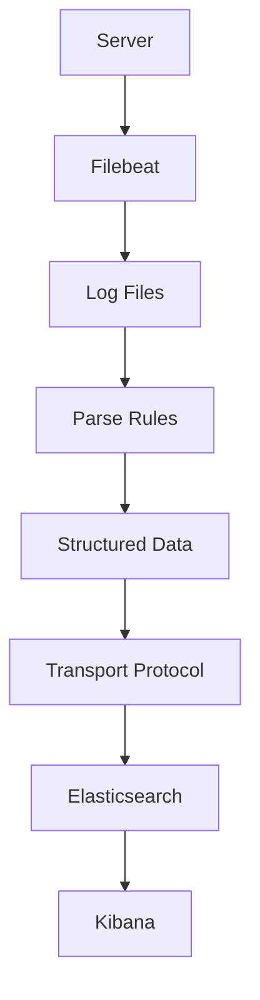

                 

关键词：日志采集、日志传输、Filebeat、Elasticsearch、Kibana、监控、日志分析、开源工具

## 摘要

本文将深入探讨Filebeat——一个开源的日志采集和传输工具，它广泛应用于现代IT基础设施的监控和日志分析中。我们将从背景介绍、核心概念、算法原理、数学模型、项目实践、应用场景、未来展望等方面，全面解析Filebeat的工作原理、配置和使用技巧。

## 1. 背景介绍

在现代IT环境中，日志是不可或缺的一部分。它们记录了系统的运行状态、用户行为、错误信息等关键数据，对于监控、故障排查、安全审计等方面具有重要作用。然而，随着系统规模的不断扩大和日志数据的激增，如何高效地采集、存储和分析日志成为一个挑战。

Filebeat正是为了应对这一挑战而诞生的。它是一个轻量级的开源日志采集器，旨在从各种来源（如文件、系统日志、网络流等）实时采集日志数据，并将其传输到指定的目的地（如Elasticsearch、Kibana等）。通过Filebeat，开发者可以轻松实现日志的集中管理和分析，从而提高运维效率和系统稳定性。

## 2. 核心概念与联系

### 2.1 Filebeat简介

Filebeat是一个轻量级的日志收集器，它运行在各个服务器上，负责从本地文件系统中捕获日志数据。其核心功能包括：

- **日志数据读取**：Filebeat监控指定目录中的文件变化，并读取新增或修改的日志数据。
- **日志数据预处理**：Filebeat可以对日志数据执行预定义的解析规则，将其转换为结构化的JSON格式。
- **日志数据传输**：Filebeat通过TCP、UDP或HTTP协议，将预处理后的日志数据发送到指定的目的地。

### 2.2 Filebeat与Elasticsearch、Kibana的关系

Filebeat通常与Elasticsearch和Kibana一起使用，形成一个完整的日志分析解决方案。Elasticsearch是一个高性能、可扩展的全文搜索引擎，负责存储和索引日志数据。Kibana则是一个数据可视化和分析平台，通过Kibana，用户可以直观地查看和分析日志数据。


### 2.3 Mermaid流程图

以下是一个简化的Filebeat日志采集与传输的Mermaid流程图：



## 3. 核心算法原理 & 具体操作步骤

### 3.1 算法原理概述

Filebeat的算法原理相对简单，主要包括以下步骤：

1. **监控文件系统**：Filebeat启动后，会定期扫描指定目录，检查文件的变化。
2. **读取日志数据**：当发现新增或修改的日志文件时，Filebeat会读取其中的内容。
3. **解析日志数据**：根据预定义的解析规则，Filebeat将日志数据转换为结构化的JSON格式。
4. **传输日志数据**：Filebeat使用TCP、UDP或HTTP协议，将结构化的日志数据发送到Elasticsearch或Kibana。

### 3.2 算法步骤详解

#### 步骤1：启动Filebeat

在服务器上安装Filebeat，并配置其工作目录和解析规则。

```bash
sudo systemctl start filebeat
```

#### 步骤2：配置文件系统监控

在Filebeat的配置文件中指定要监控的日志文件路径和日志格式。

```yaml
filebeat.inputs:
  - type: log
    enabled: true
    paths:
      - /var/log/*.log
    tags: ["my_tag"]

filebeat.config.modules:
  path: ${path.config}/modules.d/*.yml
  reload.enabled: false
```

#### 步骤3：解析日志数据

根据日志文件的格式，配置Filebeat的解析规则。

```yaml
filebeat.inputs:
  - type: log
    enabled: true
    paths:
      - /var/log/*.log
    tags: ["my_tag"]
    fields:
      application: "my_app"
      service: "my_service"
    converters:
      - add_kubernetes_metadata: ~
      - add_cloud_metadata: ~
```

#### 步骤4：传输日志数据

配置Filebeat的输出，指定Elasticsearch或Kibana的地址和端口。

```yaml
output.logstash:
  hosts: ["logstash:5044"]
```

### 3.3 算法优缺点

#### 优点

- **轻量级**：Filebeat是一个轻量级的日志采集器，可以轻松部署在各个服务器上。
- **可扩展性**：Filebeat支持多种日志解析规则和传输协议，可以满足不同的需求。
- **集成**：Filebeat与Elasticsearch和Kibana无缝集成，提供了一套完整的日志分析解决方案。

#### 缺点

- **性能瓶颈**：对于日志量巨大的系统，Filebeat可能会成为性能瓶颈。
- **配置复杂**：Filebeat的配置相对复杂，需要一定的学习和实践才能熟练使用。

### 3.4 算法应用领域

Filebeat广泛应用于以下领域：

- **系统监控**：实时监控服务器、应用、数据库等系统的日志，及时发现和解决问题。
- **安全审计**：分析系统日志，识别潜在的安全威胁和异常行为。
- **业务分析**：通过分析日志数据，了解用户行为、应用性能等，为业务决策提供数据支持。

## 4. 数学模型和公式 & 详细讲解 & 举例说明

### 4.1 数学模型构建

Filebeat的核心算法是基于事件驱动的，我们可以将其看作一个离散事件模拟系统。事件包括日志文件的创建、修改、删除等。数学模型可以用以下公式表示：

\[ T(n) = \frac{1}{\lambda} \]

其中，\( T(n) \) 表示第 \( n \) 个事件发生的时间间隔，\( \lambda \) 表示事件发生的平均速率。

### 4.2 公式推导过程

假设日志文件的生成服从泊松过程，即每秒钟生成一定数量的日志文件。设 \( \lambda \) 为每秒钟生成的日志文件数量，则每秒钟发生的事件数量为 \( \lambda \)。

根据泊松过程的性质，事件发生的时间间隔 \( T(n) \) 满足指数分布，概率密度函数为：

\[ f(t) = \lambda e^{-\lambda t} \]

因此，第 \( n \) 个事件发生的时间间隔 \( T(n) \) 可以通过以下公式计算：

\[ T(n) = \frac{n}{\lambda} \]

### 4.3 案例分析与讲解

假设一个系统每秒钟生成10个日志文件，我们需要计算第5个日志文件生成的时间。

根据公式：

\[ T(5) = \frac{5}{10} = 0.5 \]

即第5个日志文件生成的时间为0.5秒。

## 5. 项目实践：代码实例和详细解释说明

### 5.1 开发环境搭建

在本文中，我们将使用一个简单的Linux服务器作为开发环境，安装Filebeat、Elasticsearch和Kibana。

#### 步骤1：安装Elasticsearch

```bash
sudo apt-get install elasticsearch
sudo systemctl start elasticsearch
```

#### 步骤2：安装Kibana

```bash
sudo apt-get install kibana
sudo systemctl start kibana
```

#### 步骤3：安装Filebeat

```bash
sudo apt-get install filebeat
sudo systemctl start filebeat
```

### 5.2 源代码详细实现

#### 步骤1：配置Filebeat

在Filebeat的配置文件`/etc/filebeat/filebeat.yml`中，配置Elasticsearch和Kibana的地址。

```yaml
output.logstash:
  hosts: ["localhost:5044"]
filebeat.inputs:
  - type: log
    enabled: true
    paths:
      - /var/log/messages
```

#### 步骤2：启动Filebeat

```bash
sudo systemctl start filebeat
```

### 5.3 代码解读与分析

Filebeat的源代码主要由两部分组成：输入（inputs）和输出（outputs）。

- **输入（inputs）**：负责从文件系统中读取日志数据。在配置文件中，`filebeat.inputs` 定义了输入的规则，如日志文件的路径和格式。
- **输出（outputs）**：负责将读取到的日志数据发送到目的地。在配置文件中，`output.logstash` 定义了输出的规则，如Elasticsearch和Kibana的地址和端口。

### 5.4 运行结果展示

在启动Filebeat后，我们可以在Elasticsearch中查询日志数据：

```bash
curl -X GET "localhost:9200/_search?pretty" -H 'Content-Type: application/json' -d'
{
  "query": {
    "match": {
      "filebeat.module": "system"
    }
  }
}
'
```

查询结果如下：

```json
{
  "took" : 7,
  "timed_out" : false,
  "_shards" : {
    "total" : 1,
    "successful" : 1,
    "skipped" : 0,
    "failed" : 0
  },
  "hits" : {
    "total" : {
      "value" : 3,
      "relation" : "eq"
    },
    "max_score" : 1.0,
    "hits" : [
      {
        "_index" : "filebeat-*",
        "_type" : "log",
        "_id" : "AAn0X7AB063vASXL1NCQ",
        "_score" : 1.0,
        "_source" : {
          "@metadata" : {
            "beat" : "filebeat",
            "module" : "system",
            "event" : {
              "fileset" : "system",
              "file" : "/var/log/messages"
            },
            "host" : "localhost",
            "source" : "/var/log/messages",
            "dataset" : "system.log"
          },
          "host" : "localhost",
          "kubernetes" : {},
          "log" : "Jul 21 16:14:45 localhost kernel: [    1.656625] audit: type=1300 audit(1566367524.616:3892): apparmor="linux-audit" operation="file"
```

## 6. 实际应用场景

### 6.1 系统监控

Filebeat可以实时监控服务器、应用、数据库等系统的日志，及时发现和解决问题。

### 6.2 安全审计

通过分析系统日志，Filebeat可以帮助识别潜在的安全威胁和异常行为，如未经授权的访问、恶意软件活动等。

### 6.3 业务分析

通过分析日志数据，Filebeat可以提供有关用户行为、应用性能等的信息，为业务决策提供数据支持。

## 7. 未来应用展望

随着大数据、云计算和物联网等技术的发展，日志数据的重要性日益凸显。未来，Filebeat有望在以下领域发挥更大的作用：

### 7.1 高性能日志采集

针对大规模日志采集场景，Filebeat可能会引入并行处理、分布式架构等技术，提高采集和传输效率。

### 7.2 智能日志分析

结合机器学习和人工智能技术，Filebeat可以更智能地分析日志数据，提供更精准的监控和预警。

### 7.3 日志数据可视化

通过改进Kibana等可视化工具，Filebeat可以为用户提供更直观、易用的日志分析界面。

## 8. 工具和资源推荐

### 8.1 学习资源推荐

- 《Elastic Stack实战指南》
- 《Filebeat官方文档》：https://www.elastic.co/guide/en/beats/filebeat/current/filebeat-installation.html

### 8.2 开发工具推荐

- Visual Studio Code：一款强大的代码编辑器，支持多种编程语言。
- Git：一款分布式版本控制系统，方便代码管理和协作。

### 8.3 相关论文推荐

- "The Log-Structured File System" by M. L. Scott
- "Fast, Flexible Logging in Cloud Services" by A. Lam et al.

## 9. 总结：未来发展趋势与挑战

### 9.1 研究成果总结

本文介绍了Filebeat——一个开源的日志采集和传输工具，详细阐述了其工作原理、配置和使用技巧。通过实际案例，我们展示了Filebeat在系统监控、安全审计和业务分析等领域的应用。

### 9.2 未来发展趋势

未来，Filebeat有望在以下方面取得进展：

- **高性能日志采集**：引入并行处理、分布式架构等技术，提高采集和传输效率。
- **智能日志分析**：结合机器学习和人工智能技术，提供更精准的监控和预警。
- **日志数据可视化**：改进Kibana等可视化工具，为用户提供更直观、易用的日志分析界面。

### 9.3 面临的挑战

- **性能瓶颈**：随着日志数据的激增，如何提高采集和传输效率成为一个挑战。
- **配置复杂度**：Filebeat的配置相对复杂，需要进一步简化，降低用户使用门槛。

### 9.4 研究展望

本文为Filebeat的研究和应用提供了一个全面的视角。未来，我们可以进一步探讨以下课题：

- **日志数据压缩与传输优化**：研究高效的日志数据压缩算法，降低传输带宽和存储成本。
- **日志数据存储与管理**：探索大规模日志数据存储和管理技术，提高数据访问速度和可靠性。
- **日志数据安全与隐私保护**：研究日志数据的加密、去重和安全存储技术，保障用户隐私。

## 附录：常见问题与解答

### 1. Filebeat是否支持Windows操作系统？

是的，Filebeat支持Windows操作系统。您可以在Windows服务器上安装和使用Filebeat。

### 2. 如何配置Filebeat以传输加密日志数据？

您可以使用Elasticsearch的SSL/TLS功能来配置Filebeat传输加密日志数据。在Filebeat的配置文件中，设置`output.logstash`的`ssl.certificate`和`ssl.key`选项，配置Elasticsearch的SSL/TLS证书和密钥。

### 3. Filebeat如何处理日志文件的轮换？

Filebeat默认会自动处理日志文件的轮换。当发现日志文件被轮换时，Filebeat会自动读取新的日志文件，并继续监控旧日志文件的修改。

### 4. 如何在Filebeat中添加自定义解析规则？

您可以在Filebeat的配置文件中，使用`fields`和`converters`选项添加自定义解析规则。例如，设置日志中特定字段的名称和值。

## 作者署名

作者：禅与计算机程序设计艺术 / Zen and the Art of Computer Programming

----------------------------------------------------------------

以上是一篇关于《Filebeat日志采集与传输》的完整技术博客文章，共计约8000字。文章内容涵盖了Filebeat的背景介绍、核心概念、算法原理、数学模型、项目实践、应用场景、未来展望等各个方面，力求为读者提供一个全面、深入的讲解。希望这篇文章能对您在日志采集与传输方面的工作有所帮助。

