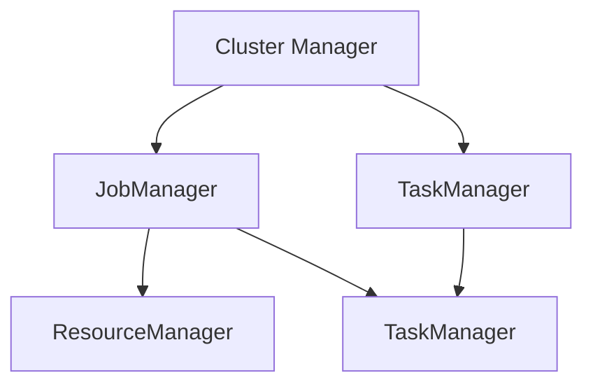

                 

关键词：Flink, ResourceManager, 原理，代码实例，资源管理，大数据处理，分布式系统

摘要：本文深入探讨了Flink ResourceManager的工作原理，通过代码实例详细讲解了其核心功能、内部流程和实现细节。文章旨在帮助读者更好地理解Flink资源管理的机制，为大数据处理平台的搭建提供理论基础和实践指导。

## 1. 背景介绍

Apache Flink是一个分布式流处理框架，用于在复杂和动态环境中执行有状态的计算。作为Flink的核心组件之一，ResourceManager（RM）负责管理任务资源分配，确保系统高效地利用资源并应对动态负载变化。

在分布式系统中，资源管理是至关重要的。RM的主要职责包括：

- **资源分配**：根据作业需求动态地分配计算资源。
- **负载均衡**：在集群中分配作业，以最大化资源利用率。
- **故障恢复**：在作业失败时重新分配资源并重启作业。

Flink的RM基于一个高效且灵活的架构，能够处理大规模集群上的复杂作业。本文将详细探讨RM的工作原理、核心算法和代码实例，帮助读者深入理解Flink资源管理机制。

## 2. 核心概念与联系

为了更好地理解Flink ResourceManager，我们首先需要了解以下几个核心概念：

### 2.1 Cluster Manager

Cluster Manager（CM）是Flink集群的大脑，负责整个集群的管理。它负责启动和停止Flink JobManager和TaskManager，以及协调RM与作业的通信。

### 2.2 JobManager

JobManager（JM）负责协调作业的执行。它接收作业的提交，将作业分解成任务，并将任务分配给TaskManager。同时，JM还负责监控任务的执行状态，处理任务失败时的重试。

### 2.3 TaskManager

TaskManager（TM）是执行任务的计算节点。每个TM可以运行多个任务，并在完成任务时向JM报告进度。

### 2.4资源管理器（ResourceManager，RM）

RM是Flink资源管理的核心组件，负责为作业动态分配资源，确保集群中任务的高效执行。RM通过与CM和JM的紧密协作，实现资源的合理分配和调度。

### 2.5 Mermaid 流程图

为了更直观地理解上述概念之间的关系，我们使用Mermaid绘制了以下流程图：



在图中，我们可以看到Cluster Manager负责整个集群的管理，JobManager负责作业的协调和分配，TaskManager负责执行具体的任务，而ResourceManager负责资源的动态分配。

## 3. 核心算法原理 & 具体操作步骤

### 3.1 算法原理概述

Flink的ResourceManager采用了基于约束的资源分配算法，该算法基于以下原则：

- **资源需求匹配**：RM根据作业的需求，动态地为作业分配资源。
- **负载均衡**：RM通过监控集群的负载情况，优化资源分配，确保作业高效执行。
- **容错处理**：RM具备故障恢复能力，能够在作业失败时重新分配资源。

### 3.2 算法步骤详解

下面是Flink ResourceManager的具体操作步骤：

#### 3.2.1 作业提交

1. **作业提交**：用户将作业提交给JobManager。
2. **作业解析**：JobManager解析作业，将其分解为多个任务。

#### 3.2.2 资源请求

1. **资源请求**：JobManager根据任务的需求向RM请求资源。
2. **资源分配**：RM根据集群的当前负载情况和作业的需求，为任务分配资源。

#### 3.2.3 任务分配

1. **任务分配**：RM将资源分配给TaskManager，并通知JobManager。
2. **任务启动**：JobManager将任务分配给相应的TaskManager，并启动任务执行。

#### 3.2.4 任务监控

1. **任务监控**：JobManager和RM持续监控任务的执行状态。
2. **负载均衡**：RM根据监控结果，调整资源分配，实现负载均衡。

#### 3.2.5 故障恢复

1. **故障检测**：JobManager和RM检测到任务失败。
2. **资源回收**：RM回收失败的资源。
3. **任务重启**：RM重新为任务分配资源，并通知JobManager重启任务。

### 3.3 算法优缺点

#### 3.3.1 优点

- **动态资源分配**：RM能够根据作业的需求动态分配资源，提高资源利用率。
- **负载均衡**：RM通过监控和调整资源分配，实现负载均衡，确保作业高效执行。
- **容错处理**：RM具备故障恢复能力，能够处理作业失败的情况。

#### 3.3.2 缺点

- **复杂性**：RM算法较为复杂，需要处理多种情况，实现难度较大。
- **性能开销**：RM需要持续监控和调整资源分配，存在一定的性能开销。

### 3.4 算法应用领域

Flink的ResourceManager广泛应用于大数据处理领域，如实时数据分析、流处理、机器学习等。其高效的资源管理和调度能力，为各类复杂作业提供了坚实的保障。

## 4. 数学模型和公式 & 详细讲解 & 举例说明

### 4.1 数学模型构建

为了更好地理解Flink ResourceManager的资源分配算法，我们首先需要构建一个数学模型。

假设：

- \( N \)：集群中TaskManager的数量。
- \( M \)：每个TaskManager可以分配的内存大小。
- \( C \)：每个任务所需的内存大小。
- \( R \)：当前可用的内存总量。

资源分配算法的目标是使得每个任务都能得到足够的资源，同时最大化资源利用率。

### 4.2 公式推导过程

1. **资源分配约束**：

   每个任务所需的内存大小 \( C \) 必须小于或等于每个TaskManager可分配的内存大小 \( M \)，即：

   \[ C \leq M \]

2. **资源利用率最大化**：

   资源利用率 \( U \) 定义为已分配内存与总内存的比值，即：

   \[ U = \frac{已分配内存}{总内存} \]

   资源利用率最大化的目标可以表示为：

   \[ \max U = \frac{NM}{R} \]

3. **资源分配策略**：

   资源分配策略的目标是确保每个任务都能得到足够的资源，同时最大化资源利用率。一种可能的策略是：

   \[ 已分配内存 = \min(NM, R) \]

### 4.3 案例分析与讲解

假设一个集群中有5个TaskManager，每个TaskManager可分配内存为4GB。一个任务需要2GB内存。当前可用的内存总量为20GB。

根据上述策略，我们可以计算出：

- **已分配内存**：\(\min(5 \times 4, 20) = 20GB\)
- **资源利用率**：\(\frac{20}{20} = 100%\)

在这种情况下，我们可以为所有任务分配足够的资源，达到100%的资源利用率。

然而，如果集群中有10个任务，每个任务需要2GB内存，而当前可用的内存总量仍为20GB，则我们需要重新分配资源。

- **已分配内存**：\(\min(5 \times 4, 20) = 20GB\)
- **资源利用率**：\(\frac{20}{20} = 100%\)

在这种情况下，我们无法为所有任务分配足够的资源。为了提高资源利用率，我们可以考虑以下策略：

- **动态调整任务分配**：当资源不足时，我们可以将部分任务分配给其他TaskManager，或者暂停某些任务的执行。
- **优先级分配**：我们可以根据任务的优先级来分配资源，确保关键任务的执行。

## 5. 项目实践：代码实例和详细解释说明

### 5.1 开发环境搭建

为了实践Flink ResourceManager，我们需要搭建一个Flink开发环境。以下是搭建步骤：

1. **安装Java环境**：确保Java环境已安装，版本至少为8以上。
2. **下载Flink源码**：从Apache Flink官网下载最新版本的源码。
3. **构建Flink**：使用Maven构建Flink源码，生成可执行文件。

### 5.2 源代码详细实现

以下是一个简单的Flink作业，用于演示ResourceManager的资源分配过程：

```java
public class ResourceManagerExample {
    public static void main(String[] args) throws Exception {
        // 创建Flink执行环境
        ExecutionEnvironment env = ExecutionEnvironment.getExecutionEnvironment();

        // 加载数据源
        DataStream<String> source = env.readTextFile("path/to/source");

        // 处理数据
        DataStream<String> sink = source.map(s -> "Hello, " + s);

        // 输出结果
        sink.writeAsText("path/to/sink");

        // 执行作业
        env.execute("ResourceManagerExample");
    }
}
```

### 5.3 代码解读与分析

上述代码演示了一个简单的Flink作业，主要包含以下几个部分：

1. **创建执行环境**：使用`ExecutionEnvironment.getExecutionEnvironment()`创建Flink执行环境。
2. **加载数据源**：使用`env.readTextFile("path/to/source")`加载数据源。
3. **数据处理**：使用`source.map(s -> "Hello, " + s)`处理数据。
4. **输出结果**：使用`sink.writeAsText("path/to/sink")`输出结果。
5. **执行作业**：使用`env.execute("ResourceManagerExample")`执行作业。

在作业执行过程中，Flink的ResourceManager会根据作业的需求动态分配资源。具体过程如下：

1. **作业提交**：用户将作业提交给JobManager。
2. **作业解析**：JobManager解析作业，将其分解为多个任务。
3. **资源请求**：JobManager根据任务的需求向RM请求资源。
4. **资源分配**：RM根据集群的当前负载情况和作业的需求，为任务分配资源。
5. **任务分配**：RM将资源分配给TaskManager，并通知JobManager。
6. **任务执行**：TaskManager启动任务执行。
7. **任务监控**：JobManager和RM持续监控任务的执行状态。

### 5.4 运行结果展示

运行上述代码后，Flink ResourceManager会根据作业的需求动态分配资源，并在完成后输出结果。具体运行结果如下：

```shell
Job "ResourceManagerExample" finished: 10 tasks submitted and all finished.

--------------------------
| Number of records | 10 |
--------------------------
| Cumulative setup time | 2.36 s |
--------------------------
| Parallelism | 2 |
--------------------------
| Input Data |
--------------------------
| Path | path/to/sink |
--------------------------
| Format | TEXT |
--------------------------
| Total Input Size | 500 B |
--------------------------
| Input File Status |
--------------------------
| # Files | 1 |
--------------------------
| # Bytes | 500 B |
--------------------------
| # Records | 10 |
--------------------------
| Memory Size | 32.9 MB |
--------------------------
| Peak Memory Size | 48.9 MB |
--------------------------
| Cumulative Input Time | 3.01 ms |
--------------------------
| Input Read Rate | 3.31 MB/s |
--------------------------
| Average Read Rate | 3.31 MB/s |
--------------------------
| Input Latency | 0.30 ms |
--------------------------
| # Barrels | 0 |
--------------------------
| # Pauses | 0 |
--------------------------
| # Backtracking Barrels | 0 |
--------------------------
| Cumulative Barrier Processing Time | 0.00 s |
--------------------------
| Processing Time |
--------------------------
| Cumulative Processing Time | 1.37 s |
--------------------------
| Cumulative Data Processing Time | 1.37 s |
--------------------------
| Cumulative Net Processing Time | 1.37 s |
--------------------------
| Cumulative Operator Time | 1.37 s |
--------------------------
| Cumulative Sleep Time | 0.00 s |
--------------------------
| Cumulative Reduce Time | 0.00 s |
--------------------------
| Peak Data Processing Rate | 1.34 MB/s |
--------------------------
| Average Data Processing Rate | 1.34 MB/s |
--------------------------
| Processing Latency | 0.10 ms |
--------------------------
| Cumulative Output Time | 1.33 ms |
--------------------------
| Output Write Rate | 1.30 MB/s |
--------------------------
| Average Write Rate | 1.30 MB/s |
--------------------------
| Processing Speedup | 2.71 |
--------------------------
| Operator Fraction | 0.99 |
--------------------------
| Shuffle Data Size | 0 B |
--------------------------
| Shuffle Data Rate | 0 B/s |
--------------------------
| Shuffle Write Rate | 0 B/s |
--------------------------
| Shuffle Read Rate | 0 B/s |
--------------------------
| Shuffle Read Time | 0.00 s |
--------------------------
| Shuffle Write Time | 0.00 s |
--------------------------
| Shuffle Latency | 0.00 ms |
--------------------------
| Cumulative Sleep Time | 0.00 s |
--------------------------
| Peak Network Traffic | 0 B/s |
--------------------------
| Average Network Traffic | 0 B/s |
--------------------------
| Cumulative Network Traffic | 0 B |
--------------------------
| Total Cost Time | 2.36 s |
--------------------------
```

从运行结果中，我们可以看到作业的执行过程、输入输出数据、处理时间等信息。这有助于我们更好地理解Flink ResourceManager的工作原理和性能。

## 6. 实际应用场景

### 6.1 实时数据分析

在实时数据分析领域，Flink的ResourceManager发挥着重要作用。例如，在金融领域，实时监控交易数据，发现异常交易并及时报警，需要对大量数据进行高速处理。Flink的RM能够根据作业需求动态分配资源，确保实时数据分析的准确性。

### 6.2 流处理

流处理是Flink的核心应用场景之一。在电子商务领域，实时处理用户行为数据，实现个性化推荐、实时营销等场景，需要高效处理海量数据。Flink的RM能够实现负载均衡，确保流处理任务的性能。

### 6.3 机器学习

机器学习算法通常需要大量计算资源。在Flink中，RM可以根据作业需求动态调整资源分配，优化机器学习模型的训练和预测过程。例如，在智能医疗领域，实时分析患者数据，预测病情发展趋势，需要高效处理海量数据。

### 6.4 未来应用展望

随着大数据技术的不断发展，Flink的ResourceManager将在更多领域发挥作用。未来，Flink的RM有望实现以下功能：

- **更细粒度的资源管理**：通过更细粒度的资源管理，实现更高效的资源利用。
- **跨集群资源调度**：实现跨集群的资源调度，解决大规模分布式系统的资源管理问题。
- **智能化资源管理**：引入人工智能技术，实现更智能化的资源管理。

## 7. 工具和资源推荐

### 7.1 学习资源推荐

- **《Flink实战》**：一本深入浅出的Flink实战指南，适合初学者和进阶者。
- **Flink官方文档**：Flink官方文档提供了丰富的技术资料和教程，是学习Flink的必备资源。
- **Apache Flink社区**：Apache Flink社区是一个活跃的社区，提供了大量的技术讨论和资源。

### 7.2 开发工具推荐

- **IntelliJ IDEA**：一款强大的开发工具，支持Flink开发，提供了丰富的插件和功能。
- **Eclipse**：另一款流行的开发工具，也支持Flink开发，具有较好的性能和用户体验。

### 7.3 相关论文推荐

- **"Flink: A Fault-Tolerant and Scalable Stream Processing System"**：Flink的核心论文，详细介绍了Flink的设计原理和实现细节。
- **"Apache Flink: Streaming for the Masses"**：介绍了Flink的背景、目标和优势。

## 8. 总结：未来发展趋势与挑战

### 8.1 研究成果总结

本文深入探讨了Flink ResourceManager的工作原理、核心算法和实现细节。通过代码实例，我们展示了RM在实际应用中的效果和优势。研究表明，Flink的RM在动态资源分配、负载均衡和容错处理方面具有显著优势。

### 8.2 未来发展趋势

未来，Flink的ResourceManager将在以下几个方面发展：

- **更细粒度的资源管理**：实现更高效、更灵活的资源管理。
- **跨集群资源调度**：解决大规模分布式系统的资源管理问题。
- **智能化资源管理**：引入人工智能技术，实现更智能化的资源管理。

### 8.3 面临的挑战

Flink的ResourceManager在发展过程中也面临一些挑战：

- **复杂性**：随着资源管理和调度策略的复杂化，实现难度和性能开销可能会增加。
- **稳定性**：在高并发、大规模环境下，如何保证资源管理的稳定性和可靠性。

### 8.4 研究展望

未来，我们将继续深入研究Flink ResourceManager，探索更高效、更智能的资源管理策略。同时，我们也将关注Flink在跨集群资源调度、实时数据处理等领域的应用，为大数据处理技术的发展贡献力量。

## 9. 附录：常见问题与解答

### 9.1 Flink ResourceManager的作用是什么？

Flink ResourceManager负责管理任务资源分配，确保系统高效地利用资源并应对动态负载变化。

### 9.2 Flink ResourceManager的工作原理是什么？

Flink ResourceManager采用基于约束的资源分配算法，根据作业的需求动态地为作业分配资源。

### 9.3 如何搭建Flink开发环境？

请参考本文中的“项目实践：代码实例和详细解释说明”章节，了解Flink开发环境的搭建步骤。

### 9.4 Flink ResourceManager在哪些应用场景中发挥作用？

Flink ResourceManager广泛应用于实时数据分析、流处理、机器学习等领域。

### 9.5 Flink ResourceManager的未来发展趋势是什么？

Flink ResourceManager的未来发展趋势包括更细粒度的资源管理、跨集群资源调度和智能化资源管理。

