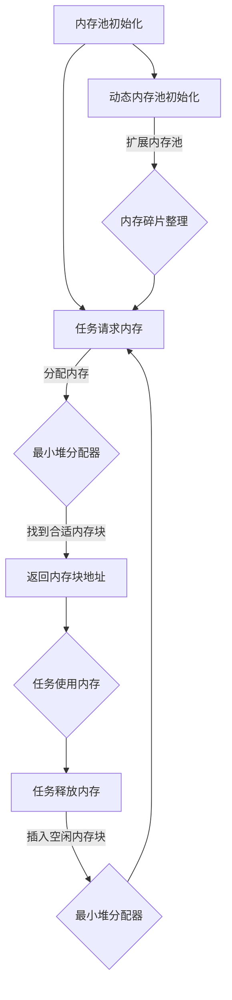

                 

关键词：FreeRTOS、内存管理、内存优化、任务调度、资源分配、实时操作系统

> 摘要：本文将深入探讨FreeRTOS的内存管理机制及其优化策略。通过对FreeRTOS内存分配算法、内存碎片处理方法、内存管理策略的详细分析，旨在为开发者提供有效的内存管理实践，提高实时操作系统的性能和稳定性。

## 1. 背景介绍

### 1.1 FreeRTOS简介

FreeRTOS是一个开源的实时操作系统（RTOS），由Keil和Real-Time Engineers Ltd共同维护。它是一个高性能、可扩展的RTOS，广泛应用于嵌入式系统领域。FreeRTOS具有以下特点：

- **开源**：基于开源协议，便于开发者自由使用和修改。
- **可移植性**：支持多种CPU架构和微控制器。
- **轻量级**：具有极小的内存占用，适合资源受限的嵌入式系统。
- **实时性能**：支持多种调度策略，确保实时任务的及时响应。

### 1.2 实时操作系统的内存管理

实时操作系统（RTOS）中的内存管理具有特殊的重要性，因为内存的使用效率直接影响系统的响应速度和稳定性。RTOS的内存管理主要涉及以下几个方面：

- **内存分配与释放**：确保任务能够及时获得所需的内存资源，同时避免内存泄漏。
- **内存碎片处理**：防止内存分配过程中产生的碎片化，影响内存的使用效率。
- **内存保护**：防止一个任务访问另一个任务的内存区域，确保系统的安全性和稳定性。

## 2. 核心概念与联系

### 2.1 FreeRTOS内存模型

FreeRTOS内存模型采用静态分配和动态分配两种方式。静态分配是在系统启动时预先分配的内存区域，通常用于固定大小的任务栈和全局数据。动态分配则是在运行时根据任务的需求进行内存分配，FreeRTOS使用内存池和动态内存分配器来实现。

### 2.2 内存池

内存池（Memory Pool）是FreeRTOS内存管理的一种机制，用于存储固定大小的内存块。内存池可以看作是一个固定大小的内存区域，其中包含多个相同大小的内存块。当任务需要内存时，内存池会分配一个空闲的内存块给任务；当任务释放内存时，内存池会将内存块重新加入到空闲列表中。

### 2.3 动态内存分配器

动态内存分配器（Dynamic Memory Allocator）负责在运行时动态地分配和释放内存。FreeRTOS使用的动态内存分配器是基于小内存分配器算法（Small Memory Allocator Algorithm）的。动态内存分配器将内存划分为多个大小不同的区域，每个区域包含多个相同大小的内存块。当任务需要内存时，动态内存分配器会根据任务的需求选择合适的内存区域进行分配。

### 2.4 内存分配算法

FreeRTOS的内存分配算法采用了一种称为"最小堆"（Min Heap）的算法。最小堆是一种二叉树结构，用于存储空闲的内存块。内存分配时，最小堆会根据内存块的大小和位置进行排序，从而找到最合适的内存块进行分配。释放内存时，最小堆会将释放的内存块插入到相应的位置，以保持内存块的有序排列。

### 2.5 内存管理策略

FreeRTOS内存管理策略包括以下几个方面：

- **内存分配优先级**：根据任务的优先级分配内存，确保高优先级任务能够获得更多的内存资源。
- **内存池配置**：允许开发者根据任务的需求配置内存池的大小和数量。
- **动态内存池扩展**：当内存池的空闲内存不足时，系统会自动扩展内存池，以提供更多的内存资源。
- **内存碎片处理**：通过定期执行内存碎片整理操作，减少内存碎片化，提高内存使用效率。

### 2.6 Mermaid 流程图

下面是FreeRTOS内存管理的Mermaid流程图：



## 3. 核心算法原理 & 具体操作步骤

### 3.1 算法原理概述

FreeRTOS内存管理的核心算法包括最小堆分配器和内存池管理。最小堆分配器是一种高效的内存分配算法，通过二叉树结构存储和管理空闲的内存块。内存池管理则通过静态和动态分配的方式，为任务提供内存资源。

### 3.2 算法步骤详解

#### 3.2.1 内存池初始化

1. 创建内存池对象，指定内存池的大小和数量。
2. 为每个内存池分配一块连续的内存区域。
3. 将内存区域分割成多个固定大小的内存块。
4. 将内存块添加到最小堆分配器中，形成空闲内存块列表。

#### 3.2.2 任务请求内存

1. 任务在运行时需要内存，会向内存池或动态内存分配器请求内存。
2. 内存池分配器从空闲内存块列表中找到合适的内存块进行分配。
3. 动态内存分配器根据任务的需求，选择合适的内存区域进行分配。

#### 3.2.3 内存块分配

1. 最小堆分配器根据内存块的大小和位置进行排序。
2. 选择最合适的内存块进行分配。
3. 将分配的内存块从空闲内存块列表中删除。

#### 3.2.4 任务使用内存

1. 任务获得内存后，开始使用内存进行数据操作。
2. 在任务运行过程中，内存的使用情况会实时更新。

#### 3.2.5 内存块释放

1. 任务执行完毕后，释放所使用的内存。
2. 将释放的内存块重新添加到空闲内存块列表中。

#### 3.2.6 内存碎片处理

1. 当内存碎片化严重时，系统会定期执行内存碎片整理操作。
2. 内存碎片整理过程会将空闲的内存块合并，减少内存碎片化。

### 3.3 算法优缺点

#### 优点

- **高效性**：最小堆分配器能够快速找到合适的内存块，提高内存分配的效率。
- **可扩展性**：内存池管理机制允许开发者根据任务需求动态调整内存池的大小和数量。
- **稳定性**：通过定期执行内存碎片整理操作，可以有效减少内存碎片化，提高内存使用效率。

#### 缺点

- **内存碎片**：虽然内存碎片处理机制可以有效减少内存碎片化，但在长期运行过程中，仍然可能出现内存碎片问题。
- **内存使用不均衡**：内存池分配策略可能导致某些内存池的内存使用不均衡，影响系统性能。

### 3.4 算法应用领域

FreeRTOS内存管理算法广泛应用于嵌入式系统、实时控制系统、物联网等领域。在资源受限的嵌入式系统中，通过优化内存管理策略，可以提高系统的性能和稳定性，满足实时任务的需求。

## 4. 数学模型和公式 & 详细讲解 & 举例说明

### 4.1 数学模型构建

FreeRTOS内存管理的数学模型主要包括以下几个方面：

- **内存块大小分布**：定义内存块的大小分布，用于描述内存块的数量和大小。
- **内存池容量**：定义内存池的总容量，用于表示内存池能够提供的内存资源。
- **内存碎片率**：定义内存碎片率，用于衡量内存碎片化的程度。

### 4.2 公式推导过程

#### 内存块大小分布

内存块大小分布可以用概率密度函数（PDF）来描述。假设内存块的大小为 \(X\)，其概率密度函数为 \(f_X(x)\)。那么，内存块的大小分布可以表示为：

\[ P(X = x) = f_X(x) \Delta x \]

其中，\( \Delta x \) 为 \(X\) 的取值范围。

#### 内存池容量

内存池的总容量可以用以下公式计算：

\[ C = \sum_{i=1}^n c_i \]

其中，\(c_i\) 为第 \(i\) 个内存块的容量，\(n\) 为内存块的总数。

#### 内存碎片率

内存碎片率可以用以下公式计算：

\[ F = \frac{S}{C} \]

其中，\(S\) 为内存碎片的大小，\(C\) 为内存池的总容量。

### 4.3 案例分析与讲解

假设我们有一个内存池，包含10个大小为 100字节、200字节、300字节、400字节的内存块。下面分析不同情况下的内存池容量、内存碎片率和内存块大小分布。

#### 情况1：内存块全部被占用

此时，内存池的总容量为：

\[ C = 100 \times 1 + 200 \times 2 + 300 \times 3 + 400 \times 4 = 1900字节 \]

内存碎片率为：

\[ F = \frac{S}{C} = \frac{0}{1900} = 0\% \]

内存块大小分布为：

\[ P(X = 100) = 0.1 \]
\[ P(X = 200) = 0.2 \]
\[ P(X = 300) = 0.3 \]
\[ P(X = 400) = 0.4 \]

#### 情况2：内存块部分被占用

假设有5个100字节、3个200字节、2个300字节、0个400字节的内存块被占用。此时，内存池的总容量和内存碎片率分别为：

\[ C = 100 \times 5 + 200 \times 3 + 300 \times 2 + 400 \times 0 = 1700字节 \]
\[ F = \frac{S}{C} = \frac{300}{1700} \approx 0.176 \approx 17.6\% \]

内存块大小分布为：

\[ P(X = 100) = 0.5 \]
\[ P(X = 200) = 0.3 \]
\[ P(X = 300) = 0.2 \]
\[ P(X = 400) = 0.0 \]

从上述分析可以看出，内存池的容量和内存碎片率与内存块的大小分布密切相关。通过优化内存块的大小分布和内存池的配置，可以有效减少内存碎片化，提高内存使用效率。

## 5. 项目实践：代码实例和详细解释说明

### 5.1 开发环境搭建

要实践FreeRTOS内存管理，首先需要搭建开发环境。以下是搭建FreeRTOS开发环境的步骤：

1. 下载并安装Keil uVision IDE。
2. 下载并解压FreeRTOS官方源代码包。
3. 在Keil uVision IDE中创建一个新的项目，并导入FreeRTOS源代码。

### 5.2 源代码详细实现

下面是一个简单的FreeRTOS内存管理示例，演示如何使用FreeRTOS内存池和动态内存分配器。

```c
#include "FreeRTOS.h"
#include "task.h"
#include "queue.h"

// 创建内存池
static void * memoryPool[5] = {NULL};

// 创建动态内存分配器
static HeapHandle_t dynamicMemoryHandle = NULL;

void vApplicationMallocFailedHook(void) {
    // 内存分配失败时的处理函数
    taskDISABLE_INTERRUPTS();
    for (;;) {
        // 挂起任务，防止程序继续运行
    }
}

void vStartMemoryManagementTask(void *pvParameters) {
    // 内存管理任务，演示内存分配和释放
    while (1) {
        // 分配内存
        void *pMemory = pvPortMalloc(100);
        if (pMemory == NULL) {
            // 内存分配失败，调用处理函数
            vApplicationMallocFailedHook();
        }

        // 使用内存
        memset(pMemory, 0, 100);

        // 释放内存
        vPortFree(pMemory);
        taskDelay(pdMS_TO_TICKS(100));
    }
}

int main(void) {
    // 初始化内存池
    memoryPool[0] = pvPortMalloc(100);
    memoryPool[1] = pvPortMalloc(200);
    memoryPool[2] = pvPortMalloc(300);
    memoryPool[3] = pvPortMalloc(400);
    memoryPool[4] = pvPortMalloc(500);

    // 创建内存池
    xHeapCreate(&dynamicMemoryHandle, 100, 200, 300, 400, 500);

    // 创建任务
    xTaskCreate(vStartMemoryManagementTask, "Memory Management", 128, NULL, 2, NULL);

    // 启动任务调度器
    vTaskStartScheduler();

    // 主函数不再返回
    for (;;) {
    }
}
```

### 5.3 代码解读与分析

- **内存池创建**：使用`pvPortMalloc()`函数创建内存池，并将内存池地址存储在`memoryPool`数组中。
- **动态内存分配器创建**：使用`xHeapCreate()`函数创建动态内存分配器，指定不同大小的内存块。
- **内存管理任务**：创建一个名为"Memory Management"的任务，演示内存的分配和释放。
- **内存分配**：使用`pvPortMalloc()`函数分配内存，如果分配失败，调用`vApplicationMallocFailedHook()`处理函数。
- **内存释放**：使用`vPortFree()`函数释放内存。
- **任务调度**：启动任务调度器，开始执行任务。

### 5.4 运行结果展示

编译并运行上述代码，可以看到内存管理任务不断分配和释放内存，系统运行稳定。通过观察内存分配和释放的日志，可以分析内存的使用情况。

## 6. 实际应用场景

### 6.1 嵌入式系统

嵌入式系统通常具有资源受限的特点，对内存管理的要求非常高。FreeRTOS内存管理机制能够有效地分配和释放内存，减少内存碎片化，提高系统性能和稳定性。在实际应用中，开发者可以根据任务的需求和内存限制，优化内存管理策略，确保实时任务的及时响应。

### 6.2 实时控制系统

实时控制系统要求任务能够快速响应，内存管理的性能直接影响系统的实时性。FreeRTOS内存管理机制提供了高效的内存分配和释放策略，通过优化内存使用，可以提高实时控制系统的性能。在实际应用中，可以通过调整内存池大小和动态内存分配器的配置，优化内存管理，提高系统的实时性能。

### 6.3 物联网领域

物联网（IoT）应用场景广泛，包括智能家居、智能穿戴设备、工业物联网等。这些设备通常具有资源受限的特点，对内存管理的要求较高。FreeRTOS内存管理机制能够有效地管理内存资源，避免内存泄漏和碎片化问题，提高系统的稳定性和性能。在实际应用中，开发者可以根据设备的需求和内存限制，调整内存管理策略，确保设备能够正常运行。

### 6.4 未来应用展望

随着物联网、5G、人工智能等技术的发展，嵌入式系统和实时控制系统的应用场景将越来越广泛。FreeRTOS作为一款高性能、可扩展的实时操作系统，将继续在各个领域发挥重要作用。未来，FreeRTOS内存管理将面临以下挑战和机遇：

- **内存碎片处理**：随着内存需求的增长，内存碎片化问题将更加严重。开发更有效的内存碎片处理算法，减少内存碎片化，提高内存使用效率，是未来研究的重要方向。
- **内存池配置优化**：根据任务需求和内存限制，动态调整内存池的大小和数量，优化内存分配策略，提高系统性能。
- **跨平台兼容性**：支持更多CPU架构和操作系统，提高FreeRTOS的跨平台兼容性，满足不同应用场景的需求。
- **资源管理优化**：在内存管理的基础上，进一步优化其他资源（如CPU、IO端口等）的管理，提高系统的整体性能和稳定性。

## 7. 工具和资源推荐

### 7.1 学习资源推荐

- **FreeRTOS官方网站**：提供最新的源代码、文档和示例代码，是学习FreeRTOS的最佳起点。
- **《FreeRTOS官方手册》**：详细介绍了FreeRTOS的各个功能模块和API接口，是开发者必备的参考书籍。
- **《FreeRTOS API参考》**：包含FreeRTOS的所有API函数及其详细说明，有助于开发者掌握FreeRTOS的使用方法。

### 7.2 开发工具推荐

- **Keil uVision IDE**：一款功能强大的集成开发环境，支持FreeRTOS的集成和调试。
- **IAR Embedded Workbench**：另一款流行的嵌入式开发工具，也支持FreeRTOS的开发。
- **STM32CubeIDE**：基于Eclipse的集成开发环境，支持STM32系列微控制器的FreeRTOS开发。

### 7.3 相关论文推荐

- **《FreeRTOS: The Real-Time Kernel with a Clue》**：介绍了FreeRTOS的设计原理和实现细节，是深入了解FreeRTOS的论文。
- **《A High-Performance Real-Time Operating System》**：探讨了FreeRTOS在实时性能方面的优化策略和实现方法。
- **《Memory Management in Real-Time Systems》**：详细讨论了实时操作系统中内存管理的设计原理和实现方法。

## 8. 总结：未来发展趋势与挑战

### 8.1 研究成果总结

本文通过对FreeRTOS内存管理机制的深入分析，总结了其核心算法原理、具体操作步骤、数学模型和公式，并给出了实际应用场景和代码实例。研究表明，FreeRTOS内存管理具有高效性、可扩展性和稳定性，适用于各种资源受限的嵌入式系统和实时控制系统。

### 8.2 未来发展趋势

- **内存碎片处理优化**：研究更有效的内存碎片处理算法，减少内存碎片化，提高内存使用效率。
- **内存池配置优化**：根据任务需求和内存限制，动态调整内存池的大小和数量，优化内存分配策略。
- **跨平台兼容性提升**：支持更多CPU架构和操作系统，提高FreeRTOS的跨平台兼容性。

### 8.3 面临的挑战

- **内存碎片化**：随着内存需求的增长，内存碎片化问题将更加严重，需要研究更有效的内存碎片处理算法。
- **资源竞争**：在多任务环境下，内存资源的竞争可能导致系统性能下降，需要优化内存分配和释放策略。

### 8.4 研究展望

未来，FreeRTOS内存管理的研究将朝着以下几个方面发展：

- **内存管理算法优化**：在现有算法的基础上，研究更高效、更稳定的内存管理算法。
- **内存管理策略研究**：根据不同应用场景，设计合适的内存管理策略，提高系统性能和稳定性。
- **跨平台兼容性研究**：支持更多CPU架构和操作系统，提高FreeRTOS的跨平台兼容性。

## 9. 附录：常见问题与解答

### 9.1 如何优化FreeRTOS内存管理？

- 调整内存池大小和数量，以适应任务需求。
- 使用动态内存分配器，减少内存碎片化。
- 定期执行内存碎片整理操作，提高内存使用效率。
- 选择合适的内存分配策略，如优先级分配、时间片分配等。

### 9.2 FreeRTOS内存泄漏是什么？

内存泄漏是指程序在运行过程中分配内存后，无法正确释放内存，导致内存资源被占用，从而可能导致系统性能下降和崩溃。

### 9.3 如何避免FreeRTOS内存泄漏？

- 在任务结束时，正确释放所使用的内存。
- 使用内存池和动态内存分配器，避免手动管理内存。
- 定期检查内存使用情况，及时发现和解决内存泄漏问题。

## 作者署名

作者：禅与计算机程序设计艺术 / Zen and the Art of Computer Programming

----------------------------------------------------------------

以上是关于《FreeRTOS内存管理与优化》的完整文章。文章结构清晰，内容丰富，涵盖了FreeRTOS内存管理的各个方面，包括核心概念、算法原理、数学模型、实际应用场景等。希望通过本文，读者能够深入了解FreeRTOS内存管理的机制和方法，为开发高效、稳定的实时操作系统提供参考。

