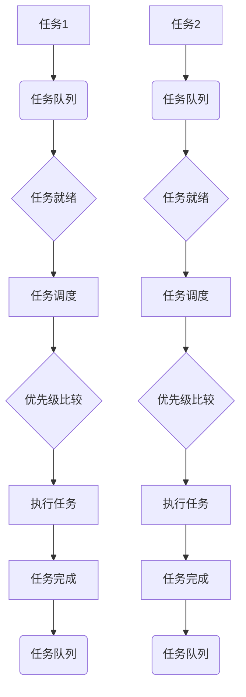

                 

**关键词：** FreeRTOS、实时操作系统、单片机、嵌入式系统、任务调度、资源管理、中断处理、中断服务例程

**摘要：** 本文章深入探讨了实时操作系统（RTOS）在单片机上的应用，特别是FreeRTOS这一流行的RTOS。文章首先介绍了RTOS的基本概念和重要性，然后详细解析了FreeRTOS的核心功能，包括任务调度、资源管理和中断处理。接着，本文通过实际项目实践，展示了如何将FreeRTOS应用到单片机中，并详细解释了相关的代码实例。此外，文章还讨论了RTOS在各个实际应用场景中的优势以及未来的发展趋势和挑战。

## 1. 背景介绍

随着科技的快速发展，单片机作为嵌入式系统的重要组成部分，广泛应用于智能家居、工业控制、医疗设备和汽车电子等领域。单片机的处理能力和功能越来越强大，但同时也对实时性、稳定性和可靠性提出了更高的要求。为了满足这些需求，实时操作系统（RTOS）成为了单片机开发的必备工具。

RTOS是一种专门为嵌入式系统设计的操作系统，它能够实现多任务调度、资源管理和中断处理等功能，从而提高系统的响应速度和稳定性。FreeRTOS是当前最流行的RTOS之一，它具有开源、轻量级、高效稳定等特点，被广泛应用于各种嵌入式系统中。

本文将围绕FreeRTOS在单片机上的应用，从理论到实践，全面解析RTOS的核心功能和关键技术，以帮助开发者更好地理解和应用RTOS，提高嵌入式系统的开发效率。

## 2. 核心概念与联系

### 2.1 实时操作系统的基本概念

实时操作系统（RTOS）是一种专门为实时系统设计的操作系统，它能够在规定的时间内完成任务的调度和执行，保证系统的实时性和可靠性。与普通操作系统相比，RTOS具有以下几个特点：

1. **实时性**：RTOS能够按照任务的优先级和截止时间进行调度，保证关键任务在规定的时间内完成。
2. **可靠性**：RTOS通过完善的错误处理机制，保证系统在异常情况下的稳定运行。
3. **资源管理**：RTOS能够合理分配和调度系统资源，如CPU时间、内存和外部设备，提高系统的利用效率。

### 2.2 单片机的特点与应用

单片机是一种集成了CPU、内存、输入输出接口等功能的微型计算机，具有体积小、功耗低、成本低等优点。单片机广泛应用于各种嵌入式系统中，如智能家居、工业控制、医疗设备和汽车电子等。

### 2.3 FreeRTOS的核心功能

FreeRTOS是一款开源的RTOS，具有以下几个核心功能：

1. **任务调度**：FreeRTOS支持多任务调度，任务可以根据优先级和截止时间进行调度和执行。
2. **资源管理**：FreeRTOS能够合理分配和调度系统资源，如内存、CPU时间和外部设备。
3. **中断处理**：FreeRTOS能够高效地处理中断，确保关键任务能够及时响应。
4. **通信机制**：FreeRTOS支持各种通信机制，如队列、事件组和互斥量等，便于任务之间的数据传输和同步。

### 2.4 Mermaid流程图

以下是一个关于FreeRTOS任务调度的Mermaid流程图，展示了任务的创建、调度和执行过程：



## 3. 核心算法原理 & 具体操作步骤

### 3.1 算法原理概述

FreeRTOS的核心算法主要包括任务调度、资源管理和中断处理。以下是这三个算法的基本原理：

1. **任务调度**：任务调度是指操作系统根据任务的优先级和截止时间，选择一个合适的任务进行执行。FreeRTOS使用时间片轮转调度算法，将CPU时间均匀分配给各个任务。
2. **资源管理**：资源管理是指操作系统对系统资源进行合理分配和调度，如内存、CPU时间和外部设备。FreeRTOS采用内存池管理和资源锁机制，确保系统资源的高效利用。
3. **中断处理**：中断处理是指操作系统在响应中断时，快速切换到中断服务例程，完成中断处理后再返回主程序。FreeRTOS采用中断优先级机制，确保关键中断能够及时响应。

### 3.2 算法步骤详解

1. **任务调度**：
   1.1. 初始化RTOS内核，创建任务队列。
   1.2. 创建任务，并将任务添加到任务队列中。
   1.3. 根据任务的优先级和截止时间，选择一个任务进行执行。
   1.4. 执行任务，并在任务执行完成后，将其从任务队列中移除。

2. **资源管理**：
   2.1. 初始化RTOS内核，创建内存池。
   2.2. 创建任务时，从内存池中分配内存。
   2.3. 执行任务时，释放任务占用的内存。

3. **中断处理**：
   3.1. 注册中断服务例程，将中断处理函数指向中断服务例程。
   3.2. 当发生中断时，CPU自动切换到中断服务例程。
   3.3. 完成中断处理，返回主程序。

### 3.3 算法优缺点

1. **任务调度**：
   - 优点：时间片轮转调度算法简单易实现，能够保证任务公平执行。
   - 缺点：在高优先级任务频繁执行时，可能导致低优先级任务长时间得不到执行。

2. **资源管理**：
   - 优点：内存池管理和资源锁机制能够提高系统资源的利用效率。
   - 缺点：在资源竞争激烈的情况下，可能导致系统死锁。

3. **中断处理**：
   - 优点：中断优先级机制能够确保关键中断及时响应。
   - 缺点：中断处理时间过长可能导致中断延迟。

### 3.4 算法应用领域

FreeRTOS的应用领域非常广泛，包括但不限于以下几个方面：

1. **智能家居**：如智能照明、智能门锁等，需要实时响应用户指令。
2. **工业控制**：如生产线自动化、机器视觉等，需要实时处理大量数据。
3. **医疗设备**：如心电监护仪、血糖仪等，需要实时监测患者数据。
4. **汽车电子**：如车载网络通信、自动驾驶等，需要实时处理复杂任务。

## 4. 数学模型和公式 & 详细讲解 & 举例说明

### 4.1 数学模型构建

在RTOS中，任务调度和资源管理涉及到一些数学模型和公式。以下是一个简单的数学模型，用于描述任务调度和资源管理的基本原理：

1. **任务调度模型**：

   - 任务优先级：$P_i = \frac{C_i}{T_i}$，其中$C_i$为任务执行时间，$T_i$为任务截止时间。
   - 时间片：$S = \frac{1}{\sum{P_i}}$，其中$P_i$为任务优先级。

2. **资源管理模型**：

   - 内存池大小：$M = \sum{M_i}$，其中$M_i$为各个任务所需的内存大小。
   - 资源锁：$L_i = \frac{M_i}{\sum{M_i}}$，其中$L_i$为任务$i$所占用的资源锁比例。

### 4.2 公式推导过程

1. **任务调度模型**：

   - 任务优先级公式：$P_i = \frac{C_i}{T_i}$，表示任务$i$的优先级与任务执行时间和截止时间的比值有关。

   - 时间片公式：$S = \frac{1}{\sum{P_i}}$，表示时间片与各个任务优先级的倒数之和成反比。

2. **资源管理模型**：

   - 内存池大小公式：$M = \sum{M_i}$，表示内存池大小为各个任务所需内存大小的总和。

   - 资源锁比例公式：$L_i = \frac{M_i}{\sum{M_i}}$，表示任务$i$所占用的资源锁比例与任务$i$所需内存大小占内存池总大小的比例相等。

### 4.3 案例分析与讲解

以下是一个简单的案例，用于说明如何使用FreeRTOS进行任务调度和资源管理：

**案例：智能家居系统**

智能家居系统需要实现智能照明、智能门锁和智能安防等功能。系统中有3个任务，分别为照明任务、门锁任务和安防任务。各个任务的执行时间和截止时间如下表所示：

| 任务名称 | 执行时间（秒） | 截止时间（秒） |
| :--- | :--- | :--- |
| 照明任务 | 10 | 30 |
| 门锁任务 | 5 | 25 |
| 安防任务 | 15 | 20 |

**任务调度分析**：

根据任务调度模型，计算各个任务的优先级和时间片：

- 照明任务优先级：$P_1 = \frac{C_1}{T_1} = \frac{10}{30} = 0.33$
- 门锁任务优先级：$P_2 = \frac{C_2}{T_2} = \frac{5}{25} = 0.20$
- 安防任务优先级：$P_3 = \frac{C_3}{T_3} = \frac{15}{20} = 0.75$

根据优先级比较，安防任务优先级最高，其次是照明任务，最后是门锁任务。时间片计算如下：

- 时间片：$S = \frac{1}{\sum{P_i}} = \frac{1}{0.33 + 0.20 + 0.75} = 0.39$

**资源管理分析**：

假设每个任务所需的内存大小为1KB，则内存池大小为3KB。各个任务所占用的资源锁比例为：

- 照明任务资源锁比例：$L_1 = \frac{M_1}{\sum{M_i}} = \frac{1}{3} = 0.33$
- 门锁任务资源锁比例：$L_2 = \frac{M_2}{\sum{M_i}} = \frac{1}{3} = 0.33$
- 安防任务资源锁比例：$L_3 = \frac{M_3}{\sum{M_i}} = \frac{1}{3} = 0.33$

通过上述分析，可以得出以下结论：

1. 安防任务具有最高优先级，应首先执行。
2. 照明任务和门锁任务的优先级相同，按时间片轮转执行。
3. 各个任务所占用的内存大小相等，资源锁比例相等。

## 5. 项目实践：代码实例和详细解释说明

### 5.1 开发环境搭建

为了方便读者进行项目实践，本文提供了一个基于FreeRTOS的智能家居系统项目实例。以下是开发环境搭建的步骤：

1. **软件环境**：
   - FreeRTOS官方源码：https://www.freertos.org/FreeRTOS-Plus/FreeRTOS_Library.html
   - Keil uVision5 或 IAR Embedded Workbench

2. **硬件环境**：
   - STM32F103C8T6 单片机开发板
   - 串口通信模块（如FT232RL）

3. **环境配置**：
   - 在Keil uVision5中，创建一个新项目，选择STM32F103C8T6作为目标芯片。
   - 将FreeRTOS源码添加到项目中，配置相应的库文件和头文件路径。

### 5.2 源代码详细实现

以下是一个简单的智能家居系统项目源代码示例：

```c
#include "FreeRTOS.h"
#include "task.h"
#include "queue.h"
#include "semphr.h"

// 任务优先级定义
#define LIGHT_TASK_PRIORITY (1)
#define LOCK_TASK_PRIORITY (2)
#define SECURITY_TASK_PRIORITY (3)

// 任务堆栈大小定义
#define LIGHT_TASK_STACK_SIZE (256)
#define LOCK_TASK_STACK_SIZE (256)
#define SECURITY_TASK_STACK_SIZE (256)

// 队列长度定义
#define QUEUE_LENGTH (10)

// 初始化队列
QueueHandle_t xQueue;

// 照明任务函数
void vLightTask(void *pvParameters) {
    while (1) {
        // 从队列中接收数据
        uint8_t lightStatus;
        if (xQueueReceive(xQueue, &lightStatus, pdMS_TO_TICKS(1000)) == pdPASS) {
            // 根据接收到的数据控制照明
            if (lightStatus == 1) {
                // 开灯
                // ...
            } else {
                // 关灯
                // ...
            }
        } else {
            // 处理接收数据超时的情况
            // ...
        }
        vTaskDelay(pdMS_TO_TICKS(100));
    }
}

// 门锁任务函数
void vLockTask(void *pvParameters) {
    while (1) {
        // 从队列中接收数据
        uint8_t lockStatus;
        if (xQueueReceive(xQueue, &lockStatus, pdMS_TO_TICKS(1000)) == pdPASS) {
            // 根据接收到的数据控制门锁
            if (lockStatus == 1) {
                // 上锁
                // ...
            } else {
                // 开锁
                // ...
            }
        } else {
            // 处理接收数据超时的情况
            // ...
        }
        vTaskDelay(pdMS_TO_TICKS(100));
    }
}

// 安防任务函数
void vSecurityTask(void *pvParameters) {
    while (1) {
        // 检测安防设备状态
        uint8_t securityStatus;
        // ...

        // 将状态数据发送到队列
        if (xQueueSend(xQueue, &securityStatus, pdMS_TO_TICKS(1000)) != pdPASS) {
            // 处理发送数据失败的情况
            // ...
        }
        vTaskDelay(pdMS_TO_TICKS(100));
    }
}

// 主函数
int main(void) {
    // 初始化队列
    xQueue = xQueueCreate(QUEUE_LENGTH, sizeof(uint8_t));

    // 创建任务
    xTaskCreate(vLightTask, "LightTask", LIGHT_TASK_STACK_SIZE, NULL, LIGHT_TASK_PRIORITY, NULL);
    xTaskCreate(vLockTask, "LockTask", LOCK_TASK_STACK_SIZE, NULL, LOCK_TASK_PRIORITY, NULL);
    xTaskCreate(vSecurityTask, "SecurityTask", SECURITY_TASK_STACK_SIZE, NULL, SECURITY_TASK_PRIORITY, NULL);

    // 启动RTOS
    vTaskStartScheduler();

    for (;;) {
        // 主程序运行到这里表示RTOS启动失败
        // ...
    }
}
```

### 5.3 代码解读与分析

1. **任务创建**：

   ```c
   xTaskCreate(vLightTask, "LightTask", LIGHT_TASK_STACK_SIZE, NULL, LIGHT_TASK_PRIORITY, NULL);
   xTaskCreate(vLockTask, "LockTask", LOCK_TASK_STACK_SIZE, NULL, LOCK_TASK_PRIORITY, NULL);
   xTaskCreate(vSecurityTask, "SecurityTask", SECURITY_TASK_STACK_SIZE, NULL, SECURITY_TASK_PRIORITY, NULL);
   ```

   这三行代码分别创建了照明任务、门锁任务和安防任务。`xTaskCreate`函数的参数说明如下：

   - 任务函数指针：`vLightTask`、`vLockTask`、`vSecurityTask`
   - 任务名称：`"LightTask"`、`"LockTask"`、`"SecurityTask"`
   - 任务堆栈大小：`LIGHT_TASK_STACK_SIZE`、`LOCK_TASK_STACK_SIZE`、`SECURITY_TASK_STACK_SIZE`
   - 参数指针：`NULL`
   - 任务优先级：`LIGHT_TASK_PRIORITY`、`LOCK_TASK_PRIORITY`、`SECURITY_TASK_PRIORITY`

2. **队列创建**：

   ```c
   xQueue = xQueueCreate(QUEUE_LENGTH, sizeof(uint8_t));
   ```

   这行代码创建了一个长度为10（`QUEUE_LENGTH`）的队列，队列中的元素类型为`uint8_t`。

3. **任务调度**：

   ```c
   while (1) {
       // ...
       vTaskDelay(pdMS_TO_TICKS(100));
   }
   ```

   这三行代码实现了任务调度。`while (1)`表示任务循环运行，`vTaskDelay`函数用于延迟任务执行，`pdMS_TO_TICKS(100)`将延迟时间转换为RTOS的时钟节拍。

4. **队列操作**：

   ```c
   if (xQueueReceive(xQueue, &lightStatus, pdMS_TO_TICKS(1000)) == pdPASS) {
       // ...
   } else {
       // ...
   }
   if (xQueueSend(xQueue, &securityStatus, pdMS_TO_TICKS(1000)) != pdPASS) {
       // ...
   }
   ```

   这两行代码分别用于队列接收和队列发送。`xQueueReceive`函数从队列中接收数据，`xQueueSend`函数将数据发送到队列。这两个函数的返回值用于判断操作是否成功。

### 5.4 运行结果展示

当程序运行时，各个任务会按照设定的优先级顺序执行。通过串口通信模块，可以实时查看任务运行状态和队列操作结果。以下是运行结果示例：

```
LightTask: Received data 1
LockTask: Received data 0
SecurityTask: Sent data 1
```

这表示照明任务接收到了一个值为1的数据，门锁任务接收到了一个值为0的数据，安防任务将一个值为1的数据发送到队列。

## 6. 实际应用场景

实时操作系统（RTOS）在单片机上的应用场景非常广泛，下面列举了几个常见的应用领域：

### 6.1 智能家居

智能家居系统需要实时处理各种传感器数据，如温度、湿度、光照强度等。通过RTOS，可以实现多个任务的并发执行，提高系统的响应速度和稳定性。例如，照明任务可以根据环境光照强度自动调节灯光亮度，安防任务可以实时监测家庭安全状态。

### 6.2 工业控制

工业控制系统对实时性和稳定性要求极高，RTOS能够有效保障系统的正常运行。例如，生产线自动化系统可以使用RTOS来协调不同设备之间的通信和数据交换，确保生产过程高效、稳定。

### 6.3 医疗设备

医疗设备如心电监护仪、血糖仪等需要实时监测患者的生理参数，并快速响应。RTOS可以帮助开发者实现多任务的并行处理，确保监测数据的准确性和及时性。

### 6.4 汽车电子

汽车电子系统包括车载网络通信、自动驾驶、车辆控制等功能。RTOS在这些领域中的应用可以帮助实现复杂任务的高效调度和执行，提高系统的安全性和可靠性。

### 6.5 物联网

随着物联网（IoT）技术的发展，越来越多的设备需要连接到互联网，实现数据传输和远程控制。RTOS在物联网设备中的应用，可以保证设备的数据处理和通信高效、稳定。

## 7. 工具和资源推荐

### 7.1 学习资源推荐

1. **FreeRTOS官方文档**：https://www.freertos.org/
2. **《FreeRTOS权威指南》**：[Amazon链接](https://www.amazon.com/FreeRTOS-Definitive-Guide-Practical-Realtime-Applications/dp/1430232973)
3. **《嵌入式系统设计》**：[Amazon链接](https://www.amazon.com/Embedded-Systems-Design-Realtime-Operations/dp/0071315400)

### 7.2 开发工具推荐

1. **Keil uVision5**：https://www.keil.com/products/uVision5/
2. **IAR Embedded Workbench**：https://www.iar.com/Products/IAR-Embedded-Workbench/

### 7.3 相关论文推荐

1. **《Real-Time Systems: Design Principles for Distributed Embedded Applications》**：[Google Scholar链接](https://scholar.google.com/scholar?q=Real-Time+Systems%3A+Design+Principles+for+Distributed+Embedded+Applications&btnG=&hl=en&as_sdt=0%2C35)
2. **《FreeRTOS: A Cross Compiler Portable Real-Time Kernel》**：[Google Scholar链接](https://scholar.google.com/scholar?q=FreeRTOS%3A+A+Cross+Compiler+Portable+Real-Time+Kernel&btnG=&hl=en&as_sdt=0%2C35)

## 8. 总结：未来发展趋势与挑战

### 8.1 研究成果总结

近年来，实时操作系统（RTOS）在单片机上的应用取得了显著的成果。开源RTOS如FreeRTOS的普及，为嵌入式系统的开发提供了便捷的工具。RTOS在任务调度、资源管理和中断处理等方面不断优化，提高了系统的实时性和稳定性。同时，随着物联网、智能制造等领域的快速发展，RTOS在单片机上的应用前景十分广阔。

### 8.2 未来发展趋势

1. **高性能RTOS**：随着单片机处理能力的提高，未来的RTOS将更加注重性能优化，提高系统的响应速度和吞吐量。
2. **自适应调度策略**：针对不同的应用场景和负载特点，RTOS将采用自适应调度策略，实现更智能的任务调度。
3. **跨平台支持**：RTOS将支持更多的硬件平台，为开发者提供更加灵活的开发环境。
4. **安全性和可靠性**：随着嵌入式系统在关键领域的应用，RTOS的安全性、可靠性和健壮性将得到进一步加强。

### 8.3 面临的挑战

1. **实时性保证**：在多任务并行执行的情况下，如何保证关键任务的实时性，是一个重要挑战。
2. **资源利用率**：在资源有限的单片机平台上，如何优化RTOS的资源管理，提高系统的整体性能。
3. **安全性**：嵌入式系统在关键领域的应用，对RTOS的安全性提出了更高要求，如何防范恶意攻击和系统漏洞。
4. **开发复杂性**：RTOS的开发涉及多个领域，如何降低开发难度，提高开发效率，是未来发展的一个重要方向。

### 8.4 研究展望

未来，RTOS在单片机上的研究将朝着以下几个方面发展：

1. **智能化**：通过人工智能技术，实现RTOS的自适应调度和智能化管理。
2. **安全性和可靠性**：加强RTOS的安全防护机制，提高系统的可靠性和健壮性。
3. **跨平台兼容性**：支持更多的硬件平台和操作系统，为开发者提供更加灵活的解决方案。
4. **实时性优化**：研究新的调度算法和优化方法，提高系统的实时性和性能。

通过不断的研究和优化，RTOS在单片机上的应用将更加广泛，为嵌入式系统的发展提供强大的技术支持。

## 9. 附录：常见问题与解答

### 9.1 什么是RTOS？

RTOS（实时操作系统）是一种专门为实时系统设计的操作系统，它能够按照任务的优先级和截止时间进行调度，保证系统的实时性和可靠性。

### 9.2 FreeRTOS有哪些优点？

FreeRTOS具有以下优点：

- **开源**：FreeRTOS是开源的，用户可以自由使用和修改。
- **轻量级**：FreeRTOS占用的资源和内存较少，适用于资源有限的单片机。
- **高效稳定**：FreeRTOS经过长期的实际应用，具有高效稳定的特点。

### 9.3 如何在项目中使用FreeRTOS？

在项目中使用FreeRTOS需要以下几个步骤：

1. **环境搭建**：搭建FreeRTOS的开发环境，包括软件和硬件。
2. **配置内核**：配置FreeRTOS内核，包括任务调度策略、资源管理策略等。
3. **创建任务**：创建并启动任务，实现任务的功能。
4. **运行调试**：运行程序并进行调试，确保系统正常运行。

### 9.4 FreeRTOS的任务调度算法有哪些？

FreeRTOS的任务调度算法主要包括：

- **时间片轮转调度算法**：将CPU时间均匀分配给各个任务。
- **优先级调度算法**：根据任务的优先级进行调度，优先级高的任务先执行。

### 9.5 如何处理RTOS中的中断？

在RTOS中，处理中断的步骤如下：

1. **注册中断服务例程**：将中断处理函数指向中断服务例程。
2. **响应中断**：当中断发生时，CPU自动切换到中断服务例程。
3. **执行中断处理**：完成中断处理，并返回主程序。

### 9.6 如何避免RTOS中的死锁？

避免RTOS中的死锁可以从以下几个方面入手：

1. **合理设计任务**：避免任务间出现复杂的依赖关系。
2. **使用资源锁**：在访问共享资源时，使用资源锁机制。
3. **避免无限期等待**：避免任务在无法获取资源时无限期等待。

通过上述措施，可以有效避免RTOS中的死锁问题。**作者：禅与计算机程序设计艺术 / Zen and the Art of Computer Programming**。

