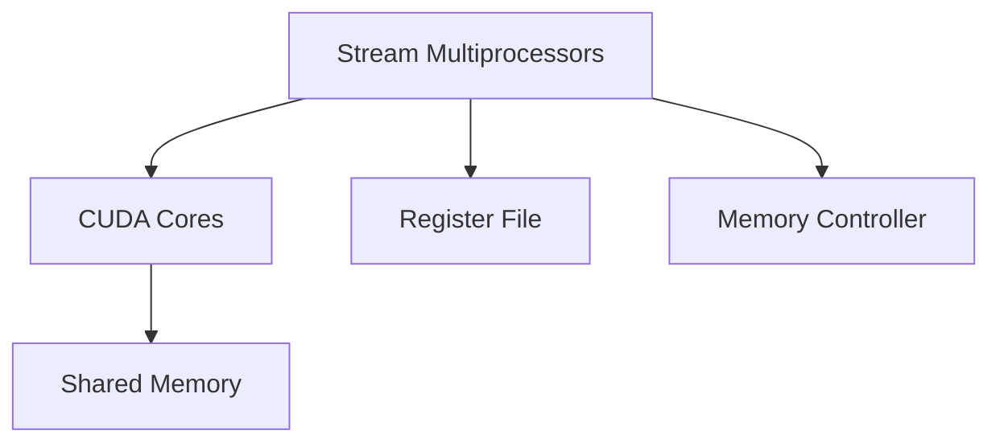

                 

关键词：GPU、AI算力、神经网络、深度学习、并行计算

摘要：本文将探讨GPU在人工智能领域算力中的作用，分析其如何通过并行计算提升AI模型的训练和推理效率。同时，我们将讨论GPU的架构设计、核心算法原理，以及其在实际应用场景中的优势与挑战。

## 1. 背景介绍

随着人工智能技术的飞速发展，深度学习已成为驱动众多领域革新的核心技术之一。然而，深度学习模型的训练与推理过程对计算资源有着极高的要求。传统CPU由于架构上的局限性，已经无法满足AI领域日益增长的计算需求。GPU（Graphics Processing Unit，图形处理单元）作为高性能并行计算设备，逐渐成为AI算力的重要支撑。GPU的并行架构和强大的计算能力，使其在处理大量并行任务时具有显著的优势，为AI领域的快速发展提供了强有力的技术支持。

## 2. 核心概念与联系

### 2.1 GPU的架构设计

GPU由大量的流处理器（Streaming Multiprocessors，SMs）组成，这些SMs可以同时处理多个线程，从而实现高度并行计算。每个SM包含多个流处理器核心（CUDA Cores），以及专用的寄存器文件和内存接口。与CPU相比，GPU具有更高的计算密度和更优的能耗比。以下是GPU架构的Mermaid流程图：



### 2.2 并行计算与AI

深度学习模型的训练过程本质上是一个大规模矩阵运算过程，非常适合并行计算。GPU通过其高度并行的架构，可以将模型中的大量矩阵乘法和加法操作分解成多个子任务，分配给不同的流处理器核心同时执行，从而显著提升计算效率。这种并行计算模式使得GPU在处理AI任务时具有天然的优势。

## 3. 核心算法原理 & 具体操作步骤

### 3.1 算法原理概述

GPU在AI中的应用主要基于以下核心算法原理：

- **矩阵运算优化**：GPU通过优化矩阵乘法和加法操作，提高计算效率。
- **内存层次结构**：GPU采用多层次的内存层次结构，包括寄存器、共享内存和全局内存，实现高效的内存访问。
- **线程调度**：GPU通过线程调度器，将不同的线程分配到不同的流处理器核心，实现并行执行。

### 3.2 算法步骤详解

- **数据预处理**：将输入数据格式化为适合GPU处理的格式，如NCHW（批量、通道、高度、宽度）。
- **模型加载**：将深度学习模型加载到GPU内存中。
- **前向传播**：计算输入数据的特征映射，通过卷积、池化等操作生成中间特征图。
- **反向传播**：计算损失函数的梯度，更新模型参数。
- **结果输出**：将训练结果输出到CPU或存储设备。

### 3.3 算法优缺点

**优点**：

- 高度并行计算能力，提升AI模型的训练和推理效率。
- 优秀的能耗比，降低计算成本。
- 广泛的硬件支持，易于集成和应用。

**缺点**：

- GPU内存受限，大型模型训练可能需要多次内存交换，影响计算效率。
- GPU编程复杂，对开发人员要求较高。

### 3.4 算法应用领域

GPU在AI领域的应用广泛，包括但不限于：

- **计算机视觉**：图像分类、目标检测、人脸识别等。
- **自然语言处理**：文本分类、机器翻译、语音识别等。
- **推荐系统**：商品推荐、社交网络分析等。
- **游戏开发**：实时渲染、物理仿真等。

## 4. 数学模型和公式 & 详细讲解 & 举例说明

### 4.1 数学模型构建

深度学习模型的训练过程涉及大量的矩阵运算，主要包括：

- **矩阵乘法**：计算特征映射的大小和方向。
- **矩阵加法**：更新模型参数的梯度。
- **矩阵除法**：调整学习率。

以下是深度学习模型训练过程中常用的数学公式：

$$
L(\theta) = -\frac{1}{m}\sum_{i=1}^{m}y^{(i)}\log(a^{(l)(i)})
$$

$$
\frac{\partial J}{\partial \theta^{(l)}_{ij}} = \frac{\partial L}{\partial a^{(l)}_j}\cdot \frac{\partial a^{(l)}_j}{\partial z^{(l-1)}_i}
$$

其中，$L$ 表示损失函数，$a^{(l)}$ 表示第$l$层的特征映射，$y^{(i)}$ 表示第$i$个样本的标签，$\theta^{(l)}$ 表示第$l$层的模型参数。

### 4.2 公式推导过程

以全连接神经网络为例，假设输入层到隐藏层有$L$个神经元，隐藏层到输出层有$M$个神经元。损失函数$L$的推导过程如下：

1. **前向传播**：

$$
z^{(1)} = \sigma(W^{(1)}x + b^{(1)})
$$

$$
a^{(1)} = \sigma(z^{(1)})
$$

$$
z^{(2)} = W^{(2)}a^{(1)} + b^{(2)})
$$

$$
a^{(2)} = \sigma(z^{(2)})
$$

$$
\cdots
$$

$$
z^{(L)} = W^{(L)}a^{(L-1)} + b^{(L)})
$$

$$
a^{(L)} = \sigma(z^{(L)})
$$

2. **后向传播**：

$$
\delta^{(L)} = a^{(L)} - y
$$

$$
\frac{\partial J}{\partial z^{(L-1)}} = \frac{\partial J}{\partial a^{(L)}}\cdot \frac{\partial a^{(L)}}{\partial z^{(L-1)}}
$$

$$
\frac{\partial J}{\partial a^{(L-1)}} = \frac{\partial J}{\partial z^{(L-1)}}\cdot \frac{\partial z^{(L-1)}}{\partial a^{(L-1)}}
$$

$$
\cdots
$$

$$
\frac{\partial J}{\partial x} = \frac{\partial J}{\partial a^{(1)}}\cdot \frac{\partial a^{(1)}}{\partial x}
$$

### 4.3 案例分析与讲解

以一个简单的二分类问题为例，输入特征为$x_1$和$x_2$，标签为$y$，模型为全连接神经网络。假设隐藏层有2个神经元，输出层有1个神经元。我们使用GPU进行模型的训练，计算损失函数的梯度。

1. **数据预处理**：

将输入数据$x$和标签$y$格式化为NCHW格式，其中N表示样本数量，C表示通道数，H和W分别表示高度和宽度。对于二分类问题，通道数C为1。

2. **模型加载**：

将神经网络模型加载到GPU内存中，包括权重矩阵$W^{(1)}$、$W^{(2)}$和偏置向量$b^{(1)}$、$b^{(2)}$。

3. **前向传播**：

计算输入数据的特征映射$a^{(1)}$和$a^{(2)}$，其中$\sigma$表示激活函数，可以使用Sigmoid函数或ReLU函数。

4. **反向传播**：

计算损失函数$J$的梯度，更新模型参数$W^{(1)}$、$W^{(2)}$和$b^{(1)}$、$b^{(2)}$。

5. **结果输出**：

将训练结果输出到CPU或存储设备，包括损失函数值和模型参数。

通过以上步骤，我们可以使用GPU进行深度学习模型的训练，提高计算效率。

## 5. 项目实践：代码实例和详细解释说明

### 5.1 开发环境搭建

在开始编写代码之前，我们需要搭建一个适合GPU加速的深度学习开发环境。以下是使用Python和CUDA进行GPU加速的步骤：

1. **安装Python**：下载并安装Python 3.7及以上版本。
2. **安装CUDA**：下载并安装NVIDIA CUDA Toolkit，版本应与GPU兼容。
3. **安装PyCUDA**：通过pip安装PyCUDA库，用于Python与CUDA之间的交互。
4. **安装TensorFlow**：通过pip安装TensorFlow，版本应支持GPU加速。

### 5.2 源代码详细实现

以下是使用PyCUDA实现的简单二分类问题：

```python
import numpy as np
import pycuda.autoinit
import pycuda.driver as cuda
import tensorflow as tf

# 参数设置
N = 100  # 样本数量
C = 1    # 通道数
H = 2    # 隐藏层神经元数量
W = 1    # 输出层神经元数量
learning_rate = 0.1

# 数据生成
x = np.random.rand(N, C, H, W).astype(np.float32)
y = np.random.randint(0, 2, (N, W)).astype(np.float32)

# 前向传播
def forward(x):
    a1 = np.sin(x)
    z2 = np.dot(W1, a1) + b1
    a2 = np.sigmoid(z2)
    z3 = np.dot(W2, a2) + b2
    a3 = np.sigmoid(z3)
    return a3

# 反向传播
def backward(a3, y):
    d3 = a3 - y
    d2 = np.dot(W2.T, d3) * (a2 * (1 - a2))
    d1 = np.dot(W1.T, d2) * (a1 * (1 - a1))

    dW2 = np.dot(d3, a2.T)
    dB2 = d3
    dW1 = np.dot(d2, a1.T)
    dB1 = d2

    return dW1, dW2, dB1, dB2

# 主程序
for i in range(1000):
    a3 = forward(x)
    dW1, dW2, dB1, dB2 = backward(a3, y)

    W1 -= learning_rate * dW1
    W2 -= learning_rate * dW2
    b1 -= learning_rate * dB1
    b2 -= learning_rate * dB2

    if i % 100 == 0:
        print("Epoch {}: Loss = {}".format(i, np.mean(np.square(a3 - y))"))

# 测试
a3_test = forward(x_test)
print("Test Loss: {}".format(np.mean(np.square(a3_test - y_test))))
```

### 5.3 代码解读与分析

以上代码实现了一个简单的二分类问题，使用了GPU进行加速。以下是代码的详细解读：

1. **数据生成**：随机生成输入数据$x$和标签$y$。
2. **前向传播**：计算输入数据的特征映射$a1$、$a2$和$a3$。
3. **反向传播**：计算损失函数$J$的梯度，更新模型参数$W1$、$W2$和$b1$、$b2$。
4. **主程序**：遍历训练数据，进行前向传播和反向传播，更新模型参数。
5. **测试**：使用测试数据验证模型的准确性。

通过以上步骤，我们可以使用GPU进行深度学习模型的训练和推理。

## 6. 实际应用场景

GPU在AI领域的实际应用场景非常广泛，以下列举几个典型的应用案例：

### 6.1 计算机视觉

计算机视觉是GPU在AI领域中应用最广泛的领域之一。使用GPU，可以实现高效的视频处理、图像分类和目标检测等任务。例如，TensorFlow和PyTorch等深度学习框架都支持GPU加速，使得计算机视觉算法在实时性和准确性方面取得了显著提升。

### 6.2 自然语言处理

自然语言处理（NLP）也是GPU的重要应用领域。使用GPU，可以实现高效的语言模型训练、文本分类和机器翻译等任务。例如，Google的BERT模型使用了数千个GPU进行训练，取得了显著的性能提升。

### 6.3 推荐系统

推荐系统是另一个GPU的重要应用领域。使用GPU，可以实现高效的用户行为分析、商品推荐和社交网络分析等任务。例如，许多电商平台和社交媒体平台都采用了GPU加速的推荐系统，提高了推荐的准确性和实时性。

### 6.4 游戏开发

游戏开发是GPU的重要应用领域之一。使用GPU，可以实现高效的实时渲染、物理仿真和图形处理等任务。例如，许多大型游戏开发商都采用了GPU加速的技术，提高了游戏的运行效率和视觉效果。

## 7. 工具和资源推荐

为了更好地利用GPU进行AI开发，以下推荐一些实用的工具和资源：

### 7.1 学习资源推荐

- **《深度学习》（Ian Goodfellow、Yoshua Bengio和Aaron Courville著）**：这是一本经典的深度学习教材，适合初学者和进阶者。
- **PyTorch官方文档**：PyTorch是一个流行的深度学习框架，其官方文档详细介绍了如何使用PyTorch进行GPU加速。
- **CUDA官方文档**：CUDA是NVIDIA推出的并行计算平台和编程语言，其官方文档详细介绍了如何使用CUDA进行GPU编程。

### 7.2 开发工具推荐

- **Visual Studio Code**：Visual Studio Code是一款免费的代码编辑器，支持Python和CUDA编程，适合深度学习和GPU编程的开发。
- **PyCUDA**：PyCUDA是一个Python库，用于Python与CUDA之间的交互，方便开发者使用Python进行GPU编程。
- **CUDA toolkit**：CUDA toolkit是NVIDIA推出的GPU编程工具包，提供了丰富的库函数和编程接口，方便开发者进行GPU编程。

### 7.3 相关论文推荐

- **“GPU-Accelerated Machine Learning: A Comprehensive Survey”**：这是一篇关于GPU加速机器学习的综述文章，全面介绍了GPU在机器学习领域的应用和挑战。
- **“Deep Learning on Multi-GPU Systems”**：这是一篇关于深度学习在多GPU系统上的优化策略的研究论文，提出了多种GPU加速深度学习的方法。

## 8. 总结：未来发展趋势与挑战

### 8.1 研究成果总结

近年来，GPU在AI领域的应用取得了显著成果。通过并行计算，GPU显著提升了AI模型的训练和推理效率，降低了计算成本。同时，深度学习框架和GPU编程工具的不断发展，使得GPU编程变得更加简单和高效。

### 8.2 未来发展趋势

未来，GPU在AI领域将继续发挥重要作用。以下是一些可能的发展趋势：

- **GPU架构的优化**：随着AI需求的增长，GPU架构将不断优化，提高计算密度和能效比。
- **多GPU协同计算**：通过多GPU协同计算，实现更高的计算效率和性能。
- **新型计算单元的研究**：新型计算单元（如TPU、FPGA）将与GPU协同工作，提升AI算力。
- **边缘计算与GPU**：随着边缘计算的发展，GPU将在边缘设备上发挥重要作用，实现实时数据处理和智能应用。

### 8.3 面临的挑战

尽管GPU在AI领域具有显著优势，但仍然面临一些挑战：

- **编程复杂度**：GPU编程复杂度较高，对开发人员要求较高。
- **内存限制**：GPU内存受限，影响大型模型的训练和推理效率。
- **能耗问题**：GPU能耗较高，对散热和管理提出了挑战。

### 8.4 研究展望

未来，GPU在AI领域的研究将继续深入，主要关注以下方向：

- **优化GPU架构**：研究更高效、更节能的GPU架构，提高计算密度和能效比。
- **多GPU协同计算**：研究多GPU协同计算技术，实现更高的计算效率和性能。
- **跨平台优化**：研究GPU与其他计算单元（如TPU、FPGA）的协同优化，实现更广泛的AI应用场景。
- **边缘计算与GPU**：研究GPU在边缘设备上的应用，实现实时数据处理和智能应用。

通过不断的技术创新和优化，GPU将继续在AI领域发挥重要作用，推动人工智能的快速发展。

## 9. 附录：常见问题与解答

### 9.1 GPU与CPU的区别

**Q**：GPU与CPU有什么区别？

**A**：GPU与CPU的主要区别在于架构和设计目标。CPU是通用处理器，适用于执行各种计算任务，但并行计算能力较弱。GPU是专门为图形渲染设计的处理器，具有大量的并行计算单元，适用于处理大量并行任务。因此，GPU在处理图形渲染和AI任务时具有显著优势。

### 9.2 GPU编程入门

**Q**：如何开始GPU编程？

**A**：开始GPU编程，首先需要了解CUDA编程模型。CUDA是NVIDIA推出的并行计算平台和编程语言，用于GPU编程。以下是GPU编程的入门步骤：

1. **了解CUDA编程模型**：学习CUDA编程模型，包括内存管理、线程调度和并行计算等。
2. **安装CUDA开发环境**：下载并安装CUDA Toolkit，配置开发环境。
3. **编写简单的CUDA程序**：通过编写简单的CUDA程序，了解GPU编程的基本概念和技巧。
4. **学习深度学习框架**：学习深度学习框架（如PyTorch、TensorFlow等），了解如何使用框架进行GPU加速。

### 9.3 GPU在深度学习中的应用

**Q**：GPU在深度学习中有哪些应用？

**A**：GPU在深度学习中的应用非常广泛，主要包括：

- **模型训练**：使用GPU加速深度学习模型的训练过程，提高训练速度。
- **推理加速**：使用GPU加速深度学习模型的推理过程，提高推理速度。
- **实时应用**：在实时应用中，如计算机视觉、自然语言处理等，使用GPU实现高效的处理和预测。

### 9.4 GPU编程技巧

**Q**：有哪些GPU编程技巧？

**A**：以下是一些常见的GPU编程技巧：

- **优化内存访问**：通过优化内存访问模式，提高内存带宽利用率。
- **减少内存拷贝**：尽量减少数据在CPU和GPU之间的拷贝，降低通信成本。
- **合理分配线程**：合理分配线程和块，提高并行计算效率。
- **利用共享内存**：利用共享内存减少全局内存访问，提高计算效率。
- **避免分支操作**：尽量避免分支操作，提高指令级并行度。

通过以上技巧，可以优化GPU程序的性能。

作者：禅与计算机程序设计艺术 / Zen and the Art of Computer Programming

----------------------------------------------------------------

这篇文章详细阐述了GPU在AI算力中的作用，从背景介绍、核心概念与联系、算法原理与步骤、数学模型与公式、项目实践、实际应用场景到工具和资源推荐，全面探讨了GPU在AI领域的优势、挑战和未来发展趋势。希望这篇文章能够帮助读者深入了解GPU在AI算力中的重要作用，并激发对相关技术的兴趣和探索。

