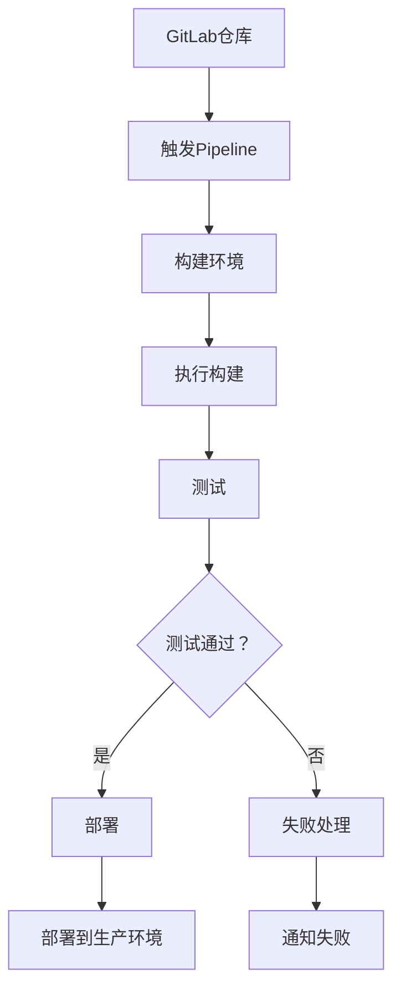

                 

关键词：GitLab，持续集成，持续交付，CI/CD流程，最佳实践，自动化部署，DevOps

## 摘要

本文将深入探讨GitLab CI/CD的最佳实践，解析其核心概念、实现步骤和操作细节。我们将通过详细的数学模型和项目实践案例，展示如何利用GitLab CI/CD实现高效的软件开发和部署流程。文章还将分析其在实际应用场景中的价值，并展望未来的发展趋势和面临的挑战。

## 1. 背景介绍

随着云计算、微服务架构和DevOps文化的兴起，持续集成（CI）和持续交付（CD）已经成为现代软件开发不可或缺的环节。GitLab CI/CD正是为了解决这些需求而诞生的，它是一款基于GitLab平台的自动化持续集成和持续交付工具。通过GitLab CI/CD，开发人员可以轻松地将代码集成、测试和部署到各种环境中，从而提高开发效率和质量。

### 1.1 GitLab CI/CD的定义

GitLab CI/CD是GitLab提供的内置持续集成和持续交付服务。它利用Git仓库中的`.gitlab-ci.yml`文件来定义项目的构建、测试和部署流程。一旦有新的代码提交，GitLab CI/CD就会自动触发相应的构建和部署任务。

### 1.2 GitLab CI/CD的优势

- **自动化**：GitLab CI/CD能够自动执行构建、测试和部署任务，减少了手动操作，降低了出错概率。
- **灵活性和可扩展性**：支持多种编程语言和平台，可以通过自定义脚本实现复杂的部署流程。
- **易于集成**：与GitLab的其他功能紧密集成，如代码审查、问题跟踪和权限管理。
- **可视化**：提供详细的项目状态报告和可视化图表，便于监控和管理。

## 2. 核心概念与联系

为了更好地理解GitLab CI/CD，我们需要先了解一些核心概念，包括CI/CD流程、GitLab CI/CD的架构和基本组成部分。

### 2.1 CI/CD流程

持续集成（Continuous Integration，CI）和持续交付（Continuous Delivery，CD）是软件开发中的两个重要概念。

- **CI**：持续集成是指通过频繁地将代码合并到主干，并自动执行测试，确保代码质量。
- **CD**：持续交付是指将代码从开发环境顺利部署到生产环境的过程。

GitLab CI/CD结合了CI和CD的优势，实现了从代码提交到生产部署的自动化流程。

### 2.2 GitLab CI/CD架构

GitLab CI/CD的架构主要由以下几个部分组成：

- **GitLab仓库**：存储代码和配置文件。
- **GitLab Runner**：执行构建和部署任务的工作节点。
- **Pipeline**：构建和部署的自动化流程。
- **Variables**：用于存储和传递敏感信息的变量。
- **Secrets**：用于存储加密后的敏感信息的工具。

### 2.3 Mermaid流程图



## 3. 核心算法原理 & 具体操作步骤

### 3.1 算法原理概述

GitLab CI/CD的核心算法基于一系列的yaml脚本，通过定义不同的job和stage来实现自动化流程。以下是基本的算法步骤：

- **初始化**：读取`.gitlab-ci.yml`文件，初始化构建环境。
- **构建**：执行构建任务，包括编译、打包等。
- **测试**：运行测试用例，确保代码质量。
- **部署**：将构建好的应用部署到测试或生产环境。
- **通知**：根据流程结果发送通知。

### 3.2 算法步骤详解

以下是`.gitlab-ci.yml`文件的基本结构和示例：

```yaml
image: node:12

stages:
  - build
  - test
  - deploy

build:
  stage: build
  script:
    - npm install
    - npm run build
  only:
    - master

test:
  stage: test
  script:
    - npm test
  only:
    - master

deploy:
  stage: deploy
  script:
    - npm run deploy
  only:
    - master
```

### 3.3 算法优缺点

#### 优点：

- **自动化**：显著减少了手动操作，提高了效率。
- **灵活性**：支持多种编程语言和平台，可以根据项目需求自定义流程。
- **可靠性**：通过自动化测试和部署，降低了人为错误。

#### 缺点：

- **配置复杂**：初次配置可能需要一定的时间和精力。
- **性能问题**：大量并发构建可能导致性能瓶颈。

### 3.4 算法应用领域

GitLab CI/CD广泛应用于各种类型的软件开发，包括Web应用、移动应用和云计算平台等。它特别适合于大型项目和团队合作，能够显著提高开发效率和质量。

## 4. 数学模型和公式 & 详细讲解 & 举例说明

GitLab CI/CD的数学模型主要涉及任务调度和资源分配。以下是一个简化的数学模型：

### 4.1 数学模型构建

假设有n个任务需要调度，每个任务有起始时间s、结束时间f和执行时间t，资源限制为R。我们需要找到一个调度方案，使得总等待时间最短。

### 4.2 公式推导过程

我们定义总等待时间为：

$$
W = \sum_{i=1}^{n} \max(s_i, s) - s_i
$$

其中，$s_i$是第i个任务的起始时间，$s$是所有任务的最早开始时间。

### 4.3 案例分析与讲解

假设我们有两个任务：

- 任务1：s=1，f=4，t=3
- 任务2：s=2，f=5，t=2

我们首先计算总等待时间：

$$
W = \max(1, 2) - 1 + \max(2, 1) - 2 = 1 + 0 = 1
$$

这意味着我们可以将任务1和任务2按顺序执行，总等待时间为1。

## 5. 项目实践：代码实例和详细解释说明

### 5.1 开发环境搭建

在本节中，我们将使用一个简单的Web应用项目作为示例，演示如何在GitLab CI/CD中实现自动化构建和部署。

首先，我们需要安装GitLab Runner。GitLab Runner是一个守护程序，用于执行构建任务。

```bash
git clone https://gitlab.com/gitlab-org/gitlab-runner.git
cd gitlab-runner
make install
```

然后，我们配置GitLab Runner：

```bash
gitlab-runner register
```

### 5.2 源代码详细实现

接下来，我们创建一个简单的Web应用项目，并在项目中添加`.gitlab-ci.yml`文件。

```yaml
image: node:12

stages:
  - build
  - test
  - deploy

build:
  stage: build
  script:
    - npm install
    - npm run build
  only:
    - master

test:
  stage: test
  script:
    - npm test
  only:
    - master

deploy:
  stage: deploy
  script:
    - npm run deploy
  only:
    - master
```

### 5.3 代码解读与分析

在这个`.gitlab-ci.yml`文件中，我们定义了三个阶段：build、test和deploy。每个阶段都包含相应的脚本和条件。

- **build阶段**：使用Node.js的12版作为基础镜像，安装依赖和构建应用。
- **test阶段**：运行测试用例。
- **deploy阶段**：部署应用到生产环境。

### 5.4 运行结果展示

一旦有新的代码提交到master分支，GitLab CI/CD就会自动执行这些任务。我们可以通过GitLab的Web界面查看构建和部署的状态。

```bash
git push origin master
```

## 6. 实际应用场景

GitLab CI/CD在软件开发中的实际应用场景非常广泛。以下是一些常见场景：

- **新建项目**：在新项目启动时，利用GitLab CI/CD自动化构建和测试，确保代码质量。
- **持续集成**：在开发过程中，通过CI/CD自动化测试和部署，确保每次提交的代码都是可用的。
- **环境管理**：通过CI/CD在不同的环境中部署应用，如开发环境、测试环境和生产环境。
- **代码审查**：结合GitLab的代码审查功能，实现自动化测试和部署，确保代码质量。

## 7. 工具和资源推荐

### 7.1 学习资源推荐

- [GitLab 官方文档](https://docs.gitlab.com/ce/ci/README.html)
- [GitLab CI/CD 深入了解](https://www.gitlab.com/gitlab-experiences/topics/ci-cd)
- [DevOps 实践指南](https://devops.com/devops-practice-guide/)

### 7.2 开发工具推荐

- [GitLab Runner](https://gitlab.com/gitlab-org/gitlab-runner)
- [Jenkins](https://www.jenkins.io/)
- [CircleCI](https://circleci.com/)

### 7.3 相关论文推荐

- "Continuous Integration in the Agile Process" by Per Kroll and Mik Van der Lee
- "Achieving Continuous Delivery in the Enterprise" by Jez Humble and David Farley

## 8. 总结：未来发展趋势与挑战

GitLab CI/CD在未来的发展中将继续扮演重要角色。随着云计算、容器化和AI技术的不断发展，CI/CD将变得更加智能化和自动化。然而，也面临一些挑战，如复杂的配置、性能瓶颈和安全问题。因此，开发人员需要不断学习和适应新的技术，以提高CI/CD的效率和质量。

## 9. 附录：常见问题与解答

### Q：如何配置GitLab Runner？

A：在安装GitLab Runner后，使用以下命令进行注册：

```bash
gitlab-runner register
```

### Q：如何在CI/CD中集成代码审查？

A：在`.gitlab-ci.yml`文件中，添加代码审查的阶段和脚本：

```yaml
code_review:
  stage: review
  script:
    - gitlab-ce/runner:code-review
  only:
    - master
```

### Q：如何处理构建失败？

A：在`.gitlab-ci.yml`文件中，添加失败处理脚本：

```yaml
deploy:
  stage: deploy
  script:
    - npm run deploy
    - echo "Build failed, deploy skipped" >> /var/log/deploy.log
  only:
    - master
```

通过以上设置，构建失败时将记录日志并停止部署。

## 作者署名

作者：禅与计算机程序设计艺术 / Zen and the Art of Computer Programming

----------------------------------------------------------------

<|im_end|>

