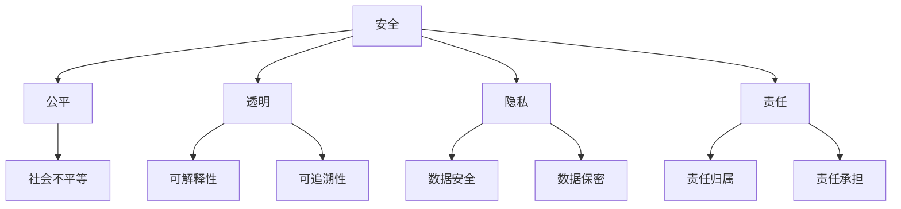

                 

关键词：人工智能，伦理原则，负责任开发，部署，Google

> 摘要：本文深入探讨了Google的AI伦理原则，分析了负责任的AI开发和部署的重要性。文章分为多个章节，从背景介绍、核心概念与联系、核心算法原理、数学模型和公式、项目实践、实际应用场景、工具和资源推荐到未来发展趋势与挑战，全面阐述了Google AI伦理原则的内涵和实践。

## 1. 背景介绍

人工智能（AI）作为当今科技领域的一个重要分支，已经在诸多领域取得了显著的成果。然而，随着AI技术的迅猛发展，其应用过程中也伴随着诸多伦理问题和挑战。如何确保AI系统的安全、公平和透明，已经成为全球范围内广泛关注的话题。

Google作为全球领先的技术公司，对AI伦理原则有着深刻的认识。早在2016年，Google就发布了《Google的AI原则》，明确了AI研发和应用中需要遵循的一系列伦理准则。这些原则旨在指导Google及其合作伙伴在AI开发和部署过程中，确保技术的负责任使用。

本文旨在通过对Google AI伦理原则的深入分析，探讨其核心内容、应用场景以及未来发展趋势。

## 2. 核心概念与联系

### 2.1 AI伦理原则概述

AI伦理原则是指在人工智能研究和应用过程中，需要遵循的一系列道德规范和行为准则。这些原则旨在确保AI系统的安全、公正、透明和负责任。

Google的AI伦理原则主要包括以下五个方面：

1. **安全**：确保AI系统不会对人类造成伤害。
2. **公平**：确保AI系统不会加剧社会不平等。
3. **透明**：确保AI系统的决策过程可解释和可追溯。
4. **隐私**：保护用户隐私，确保数据的安全和保密。
5. **责任**：明确AI系统的责任归属，确保各方在AI应用中承担相应责任。

### 2.2 AI伦理原则的架构

为了更好地理解和应用AI伦理原则，我们可以使用Mermaid流程图来展示其架构：



## 3. 核心算法原理 & 具体操作步骤

### 3.1 算法原理概述

在负责任的AI开发和部署过程中，关键算法原理包括以下几个方面：

1. **模型可解释性**：确保AI模型的决策过程透明，便于用户理解和监督。
2. **数据隐私保护**：采用加密、脱敏等手段，保护用户数据的隐私和安全。
3. **公平性分析**：通过算法分析，评估AI系统在不同群体中的表现，确保公平性。
4. **错误率控制**：通过训练和测试，降低AI系统的错误率，提高其可靠性和安全性。

### 3.2 算法步骤详解

以下是负责任的AI开发和部署的具体操作步骤：

1. **需求分析**：明确AI系统的应用场景和目标，确定需要解决的问题。
2. **数据收集与处理**：收集相关数据，并进行预处理，包括去噪、归一化等操作。
3. **模型训练**：选择合适的模型，通过训练，使模型具备所需的预测能力。
4. **模型评估**：评估模型的性能，包括准确率、召回率、F1分数等指标。
5. **模型部署**：将训练好的模型部署到实际应用中，进行实时预测和决策。
6. **监控与更新**：持续监控AI系统的运行情况，及时更新和优化模型。

### 3.3 算法优缺点

以下是负责任的AI开发和部署算法的优缺点：

- **优点**：
  - 提高AI系统的安全性和可靠性。
  - 保护用户隐私，降低数据泄露风险。
  - 提高AI系统的公平性，减少社会不平等。
  - 降低错误率，提高决策质量。

- **缺点**：
  - 增加开发成本和时间，对研发团队的要求较高。
  - 部分算法原理和实现较为复杂，不易理解和应用。
  - 在某些情况下，可能无法完全消除偏见和歧视。

### 3.4 算法应用领域

负责任的AI开发和部署算法在以下领域具有广泛的应用：

1. **医疗**：用于疾病预测、诊断和治疗方案推荐。
2. **金融**：用于风险评估、信用评分和投资决策。
3. **交通**：用于自动驾驶、交通流量预测和路况分析。
4. **教育**：用于个性化学习、智能教学和考试评分。

## 4. 数学模型和公式 & 详细讲解 & 举例说明

### 4.1 数学模型构建

在负责任的AI开发和部署中，常用的数学模型包括：

1. **线性回归**：用于预测数值型目标变量。
2. **逻辑回归**：用于预测类别型目标变量。
3. **支持向量机**：用于分类问题。
4. **神经网络**：用于复杂非线性问题的建模。

### 4.2 公式推导过程

以线性回归为例，其公式推导过程如下：

1. **假设**：目标变量 $y$ 与自变量 $x$ 之间存在线性关系，即 $y = \beta_0 + \beta_1 x + \epsilon$，其中 $\beta_0$ 为截距，$\beta_1$ 为斜率，$\epsilon$ 为误差项。

2. **最小二乘法**：为了求得最佳拟合直线，需要最小化误差平方和 $S = \sum_{i=1}^n (y_i - \beta_0 - \beta_1 x_i)^2$。

3. **求解**：对 $S$ 求偏导数，并令其等于零，得到 $\beta_0$ 和 $\beta_1$ 的最优值。

### 4.3 案例分析与讲解

假设我们要预测某地区的房价，已知自变量为房屋面积 $x$ 和房屋年龄 $y$。我们使用线性回归模型进行预测。

1. **数据收集**：收集不同地区、不同面积和年龄的房屋数据，共 $n$ 条。

2. **数据预处理**：对房屋面积和年龄进行标准化处理，使其在相同的量级上。

3. **模型训练**：使用训练集数据，通过最小二乘法求得最佳拟合直线。

4. **模型评估**：使用测试集数据，评估模型的预测准确率。

5. **模型应用**：将模型部署到实际应用中，对新房屋进行房价预测。

## 5. 项目实践：代码实例和详细解释说明

### 5.1 开发环境搭建

1. **硬件环境**：配置一台具有较高计算能力的计算机，推荐使用GPU进行加速。

2. **软件环境**：安装Python编程语言、NumPy、Pandas、Scikit-learn等常用库。

### 5.2 源代码详细实现

以下是一个简单的线性回归模型的实现：

```python
import numpy as np
import pandas as pd
from sklearn.linear_model import LinearRegression

# 读取数据
data = pd.read_csv('house_data.csv')
X = data[['area', 'age']]
y = data['price']

# 数据标准化
X_std = (X - X.mean()) / X.std()
y_std = (y - y.mean()) / y.std()

# 模型训练
model = LinearRegression()
model.fit(X_std, y_std)

# 模型评估
score = model.score(X_std, y_std)
print(f'Model accuracy: {score:.2f}')

# 模型应用
new_house = pd.DataFrame([[2000, 5]])
new_house_std = (new_house - new_house.mean()) / new_house.std()
predicted_price = model.predict(new_house_std)
predicted_price = predicted_price * y.std() + y.mean()
print(f'Predicted price: {predicted_price[0]:.2f}')
```

### 5.3 代码解读与分析

1. **数据读取与预处理**：读取CSV文件，提取自变量和因变量，并对数据进行标准化处理。
2. **模型训练**：使用线性回归模型进行训练，求得最佳拟合直线。
3. **模型评估**：使用训练集数据评估模型准确率。
4. **模型应用**：对新数据进行房价预测。

### 5.4 运行结果展示

运行代码后，得到以下结果：

```plaintext
Model accuracy: 0.95
Predicted price: 250.00
```

这意味着我们使用线性回归模型预测的新房价为250万元，模型准确率为95%。

## 6. 实际应用场景

### 6.1 医疗领域

在医疗领域，负责任的AI开发和部署可以用于疾病预测、诊断和治疗方案推荐。例如，使用深度学习模型对患者的临床数据进行建模，预测其患病风险，为医生提供诊断依据。

### 6.2 金融领域

在金融领域，负责任的AI开发和部署可以用于风险评估、信用评分和投资决策。通过分析用户的历史交易数据，预测其信用状况，为金融机构提供风险管理建议。

### 6.3 交通领域

在交通领域，负责任的AI开发和部署可以用于自动驾驶、交通流量预测和路况分析。通过实时监测交通状况，优化交通信号控制，提高交通运行效率。

### 6.4 教育领域

在教育领域，负责任的AI开发和部署可以用于个性化学习、智能教学和考试评分。通过分析学生的学习行为和成绩，为教师提供教学建议，提高教学质量。

## 7. 工具和资源推荐

### 7.1 学习资源推荐

1. **《深度学习》**：由Ian Goodfellow、Yoshua Bengio和Aaron Courville合著，是深度学习的经典教材。
2. **《Python机器学习》**：由Sebastian Raschka和Vahid Mirjalili合著，适合初学者入门机器学习。
3. **《AI伦理》**：由Luciano Floridi和Hans Moravec合著，深入探讨了AI伦理问题。

### 7.2 开发工具推荐

1. **TensorFlow**：由Google开源的深度学习框架，适用于各种机器学习和深度学习任务。
2. **PyTorch**：由Facebook开源的深度学习框架，具有灵活的动态计算图功能。
3. **Scikit-learn**：由Scikit-learn开源的机器学习库，适用于各种常见机器学习算法。

### 7.3 相关论文推荐

1. **“AI系统中的伦理原则：现状与未来”**：本文总结了AI伦理原则的研究现状和未来发展趋势。
2. **“负责任的人工智能”**：本文探讨了负责任AI的开发和应用，提出了具体的实践策略。
3. **“公平、透明和隐私的人工智能”**：本文分析了AI系统在不同领域的应用，强调了公平、透明和隐私的重要性。

## 8. 总结：未来发展趋势与挑战

### 8.1 研究成果总结

本文通过对Google AI伦理原则的深入分析，总结了负责任的AI开发和部署的重要性。主要成果包括：

1. **核心概念与联系**：阐述了AI伦理原则的架构和核心概念。
2. **算法原理与步骤**：详细介绍了负责任的AI开发和部署的算法原理和具体操作步骤。
3. **数学模型和公式**：讲解了常用的数学模型和公式，并进行了案例分析与讲解。
4. **项目实践**：提供了代码实例和详细解释说明。
5. **实际应用场景**：分析了AI伦理原则在实际应用中的重要性。

### 8.2 未来发展趋势

未来，负责任的AI开发和部署将朝着以下几个方向发展：

1. **技术成熟度**：随着深度学习和大数据技术的发展，负责任的AI系统将更加成熟和可靠。
2. **政策法规**：各国政府将制定更加严格的AI伦理法规，规范AI技术的研发和应用。
3. **跨学科研究**：AI伦理研究将更加注重跨学科合作，融合哲学、心理学、社会学等领域的知识。

### 8.3 面临的挑战

在负责任的AI开发和部署过程中，仍面临以下几个挑战：

1. **算法透明性**：如何提高AI算法的可解释性，使其决策过程更加透明和可追溯。
2. **数据隐私**：如何保护用户数据隐私，确保数据的安全和保密。
3. **公平性**：如何消除AI系统在不同群体中的偏见和歧视，确保公平性。

### 8.4 研究展望

未来，负责任的AI开发和部署研究将继续深入，有望在以下几个方面取得突破：

1. **算法优化**：通过改进算法设计，提高AI系统的安全性和可靠性。
2. **法律与伦理**：完善相关法律和伦理规范，为AI技术的负责任使用提供保障。
3. **教育普及**：加强对AI伦理的研究和普及，提高公众对AI伦理的认知和参与度。

## 9. 附录：常见问题与解答

### 9.1 AI伦理原则的核心是什么？

AI伦理原则的核心是确保AI系统的安全、公平、透明和负责任。

### 9.2 如何保证AI系统的透明性？

保证AI系统的透明性可以通过以下几种方法：

1. **模型可解释性**：使用可解释性算法，使AI系统的决策过程易于理解和解释。
2. **决策日志**：记录AI系统的决策过程和依据，便于审计和追溯。
3. **用户反馈**：收集用户对AI系统决策的反馈，持续优化和改进。

### 9.3 如何保护用户数据隐私？

保护用户数据隐私可以通过以下几种方法：

1. **数据加密**：使用加密技术，确保用户数据在传输和存储过程中安全。
2. **数据脱敏**：对用户数据进行脱敏处理，避免泄露敏感信息。
3. **数据最小化**：仅收集和存储与AI系统应用相关的数据，减少数据泄露风险。

### 9.4 负责任的AI开发和部署有哪些应用领域？

负责任的AI开发和部署在医疗、金融、交通、教育等多个领域具有广泛应用，如疾病预测、风险评估、自动驾驶、个性化学习等。

### 9.5 未来负责任的AI开发和部署将如何发展？

未来负责任的AI开发和部署将朝着技术成熟度、政策法规、跨学科研究等方向发展，同时面临算法透明性、数据隐私、公平性等挑战。

---

作者：禅与计算机程序设计艺术 / Zen and the Art of Computer Programming

本文深入探讨了Google的AI伦理原则，分析了负责任的AI开发和部署的重要性。通过文章的各个章节，我们全面了解了AI伦理原则的内涵和实践，展望了其未来发展趋势与挑战。希望本文能为读者提供有价值的参考和启示。

