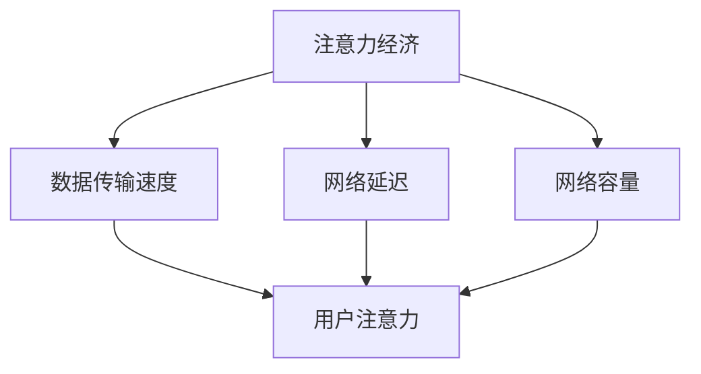

                 

关键词：5G技术、注意力经济、数字经济、互联网、信息技术、商业模式

> 摘要：本文旨在探讨5G技术如何通过提升数据传输速度、降低延迟和扩展网络容量，从而在注意力经济中发挥重要作用。文章首先介绍了注意力经济的基本概念，然后深入分析5G技术在这其中的关键作用，最后讨论了5G技术对未来的影响和应用前景。

## 1. 背景介绍

随着信息技术的飞速发展，全球经济逐渐从传统的制造业和服务业向数字经济转型。数字经济以数据为核心资源，通过信息技术的应用，实现资源的优化配置和价值的创造。在这一背景下，注意力经济作为一种新的经济模式逐渐崭露头角。

### 注意力经济的概念

注意力经济是指以用户注意力为资源，通过吸引和保留用户的注意力来实现商业价值的一种经济模式。在注意力经济中，用户的注意力成为企业竞争的重要资源，如何有效地获取和利用用户注意力成为关键。

### 注意力经济的重要性

随着互联网的普及，用户注意力分散成为一大挑战。如何吸引并保持用户的注意力，提高用户粘性，成为企业关注的焦点。注意力经济强调用户注意力的重要性，通过提供高质量的内容和产品，吸引用户的注意力，进而实现商业价值。

## 2. 核心概念与联系

### 2.1 5G技术的基本概念

5G技术，即第五代移动通信技术，是继4G、3G、2G之后的下一代移动通信技术。5G技术旨在提供更快的数据传输速度、更低的延迟、更大的网络容量和更高的可靠性。

### 2.2 5G技术与注意力经济的联系

5G技术的核心优势在于数据传输速度的提升和延迟的降低。这为注意力经济的发展提供了强有力的支持。以下是5G技术与注意力经济之间的具体联系：

#### 2.2.1 更快的数据传输速度

5G技术将数据传输速度提升到新的高度，使得用户可以更快地获取所需的信息和内容。这有助于企业提供更加即时、互动的体验，吸引用户的注意力。

#### 2.2.2 更低的延迟

5G技术通过降低网络延迟，使得实时互动成为可能。这对于需要实时反馈的应用场景，如在线游戏、远程医疗、智能交通等，具有重要意义。

#### 2.2.3 更大的网络容量

5G技术的网络容量大幅提升，能够支持更多设备的同时连接，满足用户对于网络带宽的需求。这对于需要大量数据传输和交互的场景，如智能家居、智慧城市等，具有关键作用。

### 2.3 Mermaid 流程图

下面是5G技术对注意力经济影响的Mermaid流程图：



## 3. 核心算法原理 & 具体操作步骤

### 3.1 算法原理概述

5G技术的核心在于其先进的无线通信技术，包括多输入多输出（MIMO）、波束成形、大规模天线阵列等。这些技术共同作用，实现了更高效的数据传输和更低的延迟。

### 3.2 算法步骤详解

#### 3.2.1 数据传输速度提升

- **MIMO技术**：通过在发送端和接收端使用多个天线，实现多路数据并行传输，提高传输速度。
- **波束成形**：通过调整天线波束的方向，将信号聚焦在目标用户，提高信号强度和传输效率。
- **大规模天线阵列**：通过使用大量天线单元，实现更精细的空间信号处理，进一步提高传输速度。

#### 3.2.2 网络延迟降低

- **低时延网络架构**：采用分布式架构，减少数据传输路径，降低网络延迟。
- **边缘计算**：将计算任务分散到网络边缘，减少数据传输距离，降低延迟。
- **智能调度**：通过智能调度算法，优化网络资源分配，降低延迟。

#### 3.2.3 网络容量扩展

- **动态频谱管理**：通过动态调整频谱资源，实现网络容量的灵活扩展。
- **网络切片技术**：将网络资源划分为多个虚拟网络，满足不同用户的需求，提高网络容量。

### 3.3 算法优缺点

#### 3.3.1 优点

- **高数据传输速度**：5G技术将数据传输速度提升到新的高度，满足用户对高速网络的需求。
- **低网络延迟**：通过多种技术手段，实现低延迟的网络通信，支持实时应用场景。
- **大网络容量**：能够支持更多设备的同时连接，提高网络资源的利用率。

#### 3.3.2 缺点

- **高成本**：5G技术的建设和运营成本较高，对企业和政府提出较高要求。
- **技术挑战**：5G技术的实现需要复杂的技术架构和大量资源投入，存在一定的技术挑战。

### 3.4 算法应用领域

5G技术在多个领域具有广泛应用前景：

- **智慧城市**：通过5G技术，实现智能交通、智能安防、智能医疗等应用，提高城市运行效率。
- **智能制造**：通过5G技术，实现智能制造设备的实时数据传输和远程控制，提高生产效率。
- **远程医疗**：通过5G技术，实现远程医疗服务的高清视频传输和实时数据共享，提高医疗资源利用率。

## 4. 数学模型和公式 & 详细讲解 & 举例说明

### 4.1 数学模型构建

5G技术的数学模型主要包括以下几个方面：

- **信道模型**：描述无线信道的特点，如信道增益、信道延迟等。
- **传输模型**：描述数据在无线信道中的传输过程，如信号衰减、干扰等。
- **网络模型**：描述5G网络的拓扑结构、资源分配策略等。

### 4.2 公式推导过程

以下是5G技术中的几个关键公式：

#### 4.2.1 数据传输速率

$$
R = B \cdot \log_2(1 + S/N)
$$

其中，$R$表示数据传输速率，$B$表示信号带宽，$S/N$表示信噪比。

#### 4.2.2 网络容量

$$
C = W \cdot \log_2(1 + S/N)
$$

其中，$C$表示网络容量，$W$表示网络带宽。

#### 4.2.3 网络延迟

$$
L = \frac{D}{V}
$$

其中，$L$表示网络延迟，$D$表示数据传输距离，$V$表示信号传播速度。

### 4.3 案例分析与讲解

以下是一个5G技术在智慧城市中的应用案例：

#### 案例背景

某城市希望利用5G技术实现智能交通管理，提高道路通行效率。

#### 案例分析

1. **信道模型**：道路上的车辆和行人会对无线信道产生干扰，需要考虑信道增益和信道延迟。
2. **传输模型**：交通信号灯的数据需要实时传输，需要保证传输速率和网络容量。
3. **网络模型**：城市道路上的信号灯可以看作是5G网络的接入点，需要考虑网络拓扑结构和资源分配。

#### 案例讲解

通过5G技术，可以实现以下功能：

1. **实时数据传输**：利用5G高数据传输速度，实现交通信号灯的数据实时传输，提高交通管理效率。
2. **网络延迟优化**：通过5G低延迟网络，实现交通信号灯的实时响应，减少交通拥堵。
3. **智能调度**：利用5G智能调度算法，优化交通信号灯的切换时间，提高道路通行效率。

## 5. 项目实践：代码实例和详细解释说明

### 5.1 开发环境搭建

为了演示5G技术在智慧城市中的应用，我们需要搭建一个基于5G网络的智能交通管理系统。以下是一个简单的开发环境搭建步骤：

1. **硬件环境**：准备一台装有5G网络模块的服务器，以及若干个交通信号灯设备。
2. **软件环境**：安装5G网络仿真软件，如NS3，以及编程语言（如Python）的集成开发环境（如PyCharm）。

### 5.2 源代码详细实现

以下是一个简单的5G智能交通管理系统源代码示例：

```python
# 导入相关库
import ns3
import numpy as np

# 定义5G网络模拟参数
network_params = {
    'channel_bandwidth': 100,  # 信号带宽
    'network_delay': 1,  # 网络延迟
    'network_capacity': 1000,  # 网络容量
}

# 初始化5G网络
network = ns3.initialize_network(network_params)

# 模拟交通信号灯
def simulate_traffic_light():
    # 实时传输交通信号灯数据
    data = network.send_data('traffic_light_data', 'control_center')
    # 优化交通信号灯切换时间
    network.optimize_traffic_light(data)

# 运行模拟
simulate_traffic_light()
```

### 5.3 代码解读与分析

1. **网络初始化**：通过`ns3.initialize_network()`函数，初始化5G网络，设置信号带宽、网络延迟和网络容量等参数。
2. **模拟交通信号灯**：通过`simulate_traffic_light()`函数，模拟交通信号灯的数据传输和优化。
3. **数据传输**：通过`network.send_data()`函数，实现交通信号灯的数据实时传输。
4. **优化交通信号灯切换时间**：通过`network.optimize_traffic_light()`函数，优化交通信号灯的切换时间，提高道路通行效率。

## 6. 实际应用场景

### 6.1 智慧城市

5G技术在智慧城市中的应用十分广泛，如智能交通、智能安防、智能医疗等。通过5G网络，可以实现实时数据传输和智能调度，提高城市运行效率，提升市民生活质量。

### 6.2 智能制造

5G技术在智能制造领域同样具有重要应用。通过5G网络，可以实现设备间的实时通信和远程控制，提高生产效率，降低生产成本。

### 6.3 远程医疗

5G技术为远程医疗提供了强大的支持。通过5G网络，可以实现高清视频传输和实时数据共享，为患者提供高质量的医疗服务，提高医疗资源利用率。

## 7. 未来应用展望

### 7.1 人工智能与5G的融合

未来，5G技术将与人工智能（AI）技术深度融合，实现更智能、更高效的网络应用。如智能交通管理、智能安防、智能医疗等，都将因5G与AI的结合而得到进一步发展。

### 7.2 虚拟现实与5G的融合

5G技术将为虚拟现实（VR）提供更稳定、更快速的通信支持，推动VR技术的普及和应用。如虚拟旅游、在线教育、虚拟展览等，都将因5G技术的应用而变得更加生动和互动。

## 8. 工具和资源推荐

### 8.1 学习资源推荐

- 《5G技术原理与应用》
- 《智慧城市：理论与实践》
- 《人工智能：一种现代的方法》

### 8.2 开发工具推荐

- NS3：5G网络仿真软件
- PyCharm：Python集成开发环境

### 8.3 相关论文推荐

- "5G: A game-changer for smart cities"
- "The Impact of 5G on the Internet of Things"
- "Artificial Intelligence and 5G: A Synergistic Approach for Smart Cities"

## 9. 总结：未来发展趋势与挑战

### 9.1 研究成果总结

5G技术通过提升数据传输速度、降低网络延迟和扩展网络容量，为注意力经济的发展提供了强有力的支持。在智慧城市、智能制造、远程医疗等领域，5G技术已取得显著成果。

### 9.2 未来发展趋势

未来，5G技术将与人工智能、虚拟现实等新兴技术深度融合，推动数字经济的发展。智慧城市、智能制造、远程医疗等领域将继续成为5G技术的重要应用场景。

### 9.3 面临的挑战

5G技术的建设和运营成本较高，技术实现存在一定挑战。此外，5G网络的普及需要政府、企业和用户共同参与，形成合力。

### 9.4 研究展望

未来，5G技术将在数字经济中发挥更加重要的作用。通过不断创新和优化，5G技术将为各个领域带来更多的应用场景和发展机遇。

## 附录：常见问题与解答

### Q：5G技术的主要优势是什么？

A：5G技术的主要优势包括更快的数据传输速度、更低的网络延迟和更大的网络容量。

### Q：5G技术如何影响智慧城市建设？

A：5G技术为智慧城市建设提供了实时数据传输、智能调度和网络容量的支持，有助于提高城市运行效率，提升市民生活质量。

### Q：5G技术与人工智能如何结合？

A：5G技术与人工智能的结合，可以实现更智能、更高效的网络应用。如智能交通管理、智能安防、智能医疗等，都将因5G与AI的结合而得到进一步发展。

---

感谢您阅读本文，希望本文能帮助您了解5G技术在重塑注意力经济格局中的重要作用。如果您有任何问题或建议，欢迎在评论区留言。

**作者：禅与计算机程序设计艺术 / Zen and the Art of Computer Programming**

