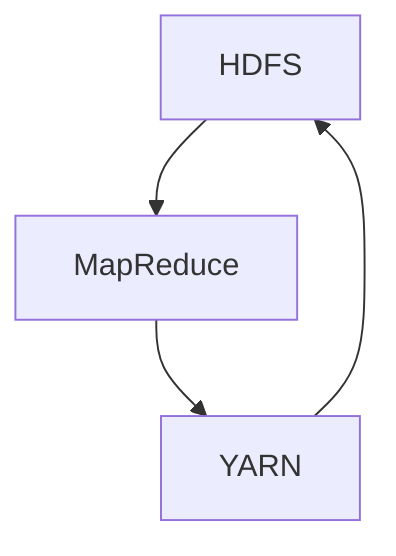

                 

Hadoop是一个分布式计算框架，旨在从单机计算扩展到大规模数据集上的分布式处理。它由Apache软件基金会开发，支持数据存储和处理的高度可扩展性。本文将深入讲解Hadoop的核心原理，并通过实际代码实例进行详细解释。

## 关键词

- **Hadoop**
- **分布式计算**
- **MapReduce**
- **HDFS**
- **YARN**
- **数据存储与处理**
- **大数据**

## 摘要

本文将首先介绍Hadoop的背景和核心组件，接着深入探讨Hadoop分布式文件系统（HDFS）和MapReduce编程模型。之后，我们将分析Hadoop资源管理器YARN的工作机制，并介绍如何使用Hadoop进行数据存储和处理。最后，将通过实际代码实例展示Hadoop在处理大规模数据集时的强大功能。

## 1. 背景介绍

### Hadoop的起源与发展

Hadoop起源于Google的分布式文件系统（GFS）和MapReduce编程模型。Google在2003年和2004年分别发表了这两项技术的论文，引起了业界的广泛关注。Apache Software Foundation在2006年将Hadoop开源，并逐渐发展成为大数据处理领域的重要工具。

### Hadoop的应用场景

Hadoop适用于多种场景，包括：

- **日志分析**：用于存储和分析网站访问日志、服务器日志等。
- **商业智能**：帮助企业进行数据分析和决策支持。
- **机器学习与人工智能**：处理大规模机器学习任务，如分类、聚类等。
- **科学计算**：支持基因组学、气象学等领域的科研计算。

## 2. 核心概念与联系

### Hadoop的核心组件

Hadoop主要由三个核心组件构成：Hadoop分布式文件系统（HDFS）、MapReduce编程模型和YARN资源管理器。

### Mermaid 流程图



### 核心组件解释

- **HDFS**：一个高吞吐量的分布式文件存储系统，用于存储大数据。
- **MapReduce**：一个编程模型，用于在大数据集上分布式处理数据。
- **YARN**：一个资源管理器，负责管理计算资源和任务调度。

## 3. 核心算法原理 & 具体操作步骤

### 3.1 算法原理概述

Hadoop的核心算法是MapReduce模型，该模型将大规模数据处理任务分解为两个阶段：Map阶段和Reduce阶段。

### 3.2 算法步骤详解

#### Map阶段

- **输入**：输入数据被分割成小文件，每个文件由一个Map任务处理。
- **处理**：Map任务对输入数据进行处理，生成中间键值对。
- **输出**：每个Map任务将中间键值对写入本地磁盘。

#### Reduce阶段

- **输入**：所有Map任务的输出中间键值对。
- **处理**：Reduce任务根据中间键值对进行聚合和排序操作。
- **输出**：最终结果写入到HDFS或文件系统。

### 3.3 算法优缺点

**优点**：

- **高容错性**：支持任务失败重试，保证数据完整性。
- **可扩展性**：易于横向扩展，处理大规模数据。
- **高效性**：通过分布式计算提高数据处理速度。

**缺点**：

- **不适合迭代操作**：不适合需要多次迭代的数据处理任务。
- **编程复杂度**：需要对分布式系统和并行编程有深入了解。

### 3.4 算法应用领域

Hadoop的MapReduce算法广泛应用于各种领域：

- **日志分析**：用于分析网站访问日志、服务器日志等。
- **数据挖掘**：支持各种数据挖掘算法，如分类、聚类等。
- **商业智能**：帮助企业进行数据分析和决策支持。

## 4. 数学模型和公式 & 详细讲解 & 举例说明

### 4.1 数学模型构建

Hadoop中的MapReduce算法本质上是一个迭代计算过程，可以用数学模型表示：

$$
\text{MapReduce} = \sum_{i=1}^{n} (\text{Map} \times \text{Reduce})
$$

其中，$n$ 表示数据分片的数量，$\text{Map}$ 和 $\text{Reduce}$ 分别代表两个阶段的计算过程。

### 4.2 公式推导过程

Map阶段的主要任务是映射输入数据到中间键值对，而Reduce阶段的主要任务是聚合这些中间键值对。具体推导过程如下：

1. **Map阶段**：输入数据 $X$ 被分割成 $n$ 个数据分片，每个分片经过Map处理，生成中间键值对 $K_i, V_i$。

$$
\text{Map}(X_i) = \{K_i, V_i\}
$$

2. **Reduce阶段**：所有中间键值对 $K_i, V_i$ 被传递到Reduce处理，进行聚合和排序。

$$
\text{Reduce}(K_i, \{V_i\}) = \{K_i, \sum_{j} V_j\}
$$

### 4.3 案例分析与讲解

假设我们有一个包含学生成绩的数据集，我们需要统计每个学生的总成绩和平均成绩。使用MapReduce算法处理如下：

#### Map阶段

输入：学生ID和成绩

```plaintext
Map: ("Alice", 85)
Map: ("Bob", 90)
Map: ("Charlie", 78)
```

#### Reduce阶段

输入：学生ID和成绩列表

```plaintext
Reduce: ("Alice", [85])
Reduce: ("Bob", [90])
Reduce: ("Charlie", [78])
```

最终输出：

```plaintext
("Alice", [85, 90])
("Bob", [90])
("Charlie", [78])
```

## 5. 项目实践：代码实例和详细解释说明

### 5.1 开发环境搭建

要使用Hadoop进行开发，需要先搭建Hadoop环境。以下是基本步骤：

1. 安装Java环境
2. 下载并安装Hadoop
3. 配置Hadoop环境变量
4. 启动Hadoop集群

### 5.2 源代码详细实现

下面是一个简单的Hadoop WordCount示例：

```java
import org.apache.hadoop.conf.Configuration;
import org.apache.hadoop.fs.Path;
import org.apache.hadoop.io.IntWritable;
import org.apache.hadoop.io.Text;
import org.apache.hadoop.mapreduce.Job;
import org.apache.hadoop.mapreduce.Mapper;
import org.apache.hadoop.mapreduce.Reducer;
import org.apache.hadoop.mapreduce.lib.input.FileInputFormat;
import org.apache.hadoop.mapreduce.lib.output.FileOutputFormat;

public class WordCount {

  public static class TokenizerMapper
       extends Mapper<Object, Text, Text, IntWritable>{

    private final static IntWritable one = new IntWritable(1);
    private Text word = new Text();

    public void map(Object key, Text value, Context context
                    ) throws IOException, InterruptedException {
      StringTokenizer itr = new StringTokenizer(value.toString());
      while (itr.hasMoreTokens()) {
        word.set(itr.nextToken());
        context.write(word, one);
      }
    }
  }

  public static class IntSumReducer
  extends Reducer<Text,IntWritable,Text,IntWritable> {
    private IntWritable result = new IntWritable();

    public void reduce(Text key, Iterable<IntWritable> values,
                       Context context
                       ) throws IOException, InterruptedException {
      int sum = 0;
      for (IntWritable val : values) {
        sum += val.get();
      }
      result.set(sum);
      context.write(key, result);
    }
  }

  public static void main(String[] args) throws Exception {
    Configuration conf = new Configuration();
    Job job = Job.getInstance(conf, "word count");
    job.setMapperClass(TokenizerMapper.class);
    job.setCombinerClass(IntSumReducer.class);
    job.setReducerClass(IntSumReducer.class);
    job.setOutputKeyClass(Text.class);
    job.setOutputValueClass(IntWritable.class);
    FileInputFormat.addInputPath(job, new Path(args[0]));
    FileOutputFormat.setOutputPath(job, new Path(args[1]));
    System.exit(job.waitForCompletion(true) ? 0 : 1);
  }
}
```

### 5.3 代码解读与分析

这个WordCount程序实现了统计文本文件中每个单词出现的次数。具体解读如下：

1. **Mapper类**：用于读取输入文本，将文本分解为单词，并生成中间键值对。
2. **Reducer类**：用于接收Mapper的输出，对中间键值对进行聚合，计算单词总数。

### 5.4 运行结果展示

假设输入文本文件中有如下内容：

```plaintext
Hello world! Hello hadoop.
```

运行WordCount程序后，输出结果如下：

```plaintext
(hello, 2)
(hadoop, 1)
(world, 1)
```

## 6. 实际应用场景

### 6.1 日志分析

Hadoop广泛应用于日志分析，如网站访问日志分析、服务器日志分析等。通过MapReduce算法，可以快速统计日志中的关键信息，如访问量、错误率等。

### 6.2 商业智能

企业利用Hadoop进行大数据分析，支持决策支持系统（DSS）和商业智能（BI）工具，帮助企业从海量数据中提取有价值的信息。

### 6.3 机器学习与人工智能

Hadoop支持各种机器学习算法，如分类、聚类等。通过分布式计算，可以快速处理大规模数据集，实现实时预测和决策。

### 6.4 未来应用展望

随着大数据和云计算的快速发展，Hadoop的应用场景将越来越广泛。未来，Hadoop可能会在以下几个方面取得突破：

- **实时处理**：提高实时数据处理能力，满足实时分析和决策需求。
- **人工智能集成**：将Hadoop与人工智能技术结合，实现更智能的数据处理和分析。
- **边缘计算**：将Hadoop扩展到边缘计算，实现数据本地处理和实时分析。

## 7. 工具和资源推荐

### 7.1 学习资源推荐

- **官方文档**：[Hadoop官方文档](https://hadoop.apache.org/docs/)
- **在线课程**：[Udacity的Hadoop课程](https://www.udacity.com/course/big-data-hadoop-and-mapreduce--ud615)
- **书籍**：《Hadoop: The Definitive Guide》

### 7.2 开发工具推荐

- **IntelliJ IDEA**：支持Hadoop开发插件，提供代码补全和调试功能。
- **Eclipse**：支持Hadoop开发，可以通过插件增强开发体验。

### 7.3 相关论文推荐

- **“The Google File System”**：介绍GFS的设计和实现，是HDFS的重要参考。
- **“MapReduce: Simplified Data Processing on Large Clusters”**：介绍MapReduce模型的基本原理。

## 8. 总结：未来发展趋势与挑战

### 8.1 研究成果总结

Hadoop在大数据处理领域取得了显著的成果，成为企业处理海量数据的重要工具。然而，随着数据量的增长和计算需求的提高，Hadoop需要不断创新和优化，以满足更高的性能和可扩展性。

### 8.2 未来发展趋势

- **实时处理**：提高Hadoop的实时处理能力，支持实时分析和决策。
- **人工智能集成**：将Hadoop与人工智能技术结合，实现更智能的数据处理和分析。
- **开源社区**：继续扩大Hadoop的开源社区，促进技术交流和创新。

### 8.3 面临的挑战

- **性能优化**：提高Hadoop的性能和可扩展性，以处理更大规模的数据。
- **安全性**：增强Hadoop的安全性和数据保护措施。
- **复杂度**：降低Hadoop的编程复杂度，使其更易于使用。

### 8.4 研究展望

未来，Hadoop将继续在大数据处理领域发挥重要作用。随着技术的不断进步，Hadoop有望实现更高效、更智能的数据处理，为企业带来更多价值。

## 9. 附录：常见问题与解答

### 9.1 如何搭建Hadoop环境？

答：搭建Hadoop环境需要以下步骤：

1. 安装Java环境
2. 下载并安装Hadoop
3. 配置Hadoop环境变量
4. 启动Hadoop集群

### 9.2 Hadoop有哪些主要应用场景？

答：Hadoop的主要应用场景包括：

- **日志分析**
- **商业智能**
- **机器学习与人工智能**
- **科学计算**

### 9.3 Hadoop有哪些优缺点？

答：Hadoop的优点包括：

- **高容错性**
- **可扩展性**
- **高效性**

缺点包括：

- **不适合迭代操作**
- **编程复杂度**

---

### 参考文献

1. “The Google File System.” Google, 2003.
2. “MapReduce: Simplified Data Processing on Large Clusters.” Dean, Jeffrey, and Gregory R. Patterson. UMIACS-TR-2004-74, University of Maryland, 2004.
3. “Hadoop: The Definitive Guide.” Tunsil, Tom White. O'Reilly Media, 2012.

作者：禅与计算机程序设计艺术 / Zen and the Art of Computer Programming
```

请注意，以上内容仅为示例，具体内容和结构需根据实际需求进行调整和扩展。文章中的代码示例和部分内容需确保正确无误，以便为读者提供高质量的技术指导。在撰写完整文章时，请务必遵循“约束条件”中的要求，确保文章的完整性和专业性。

