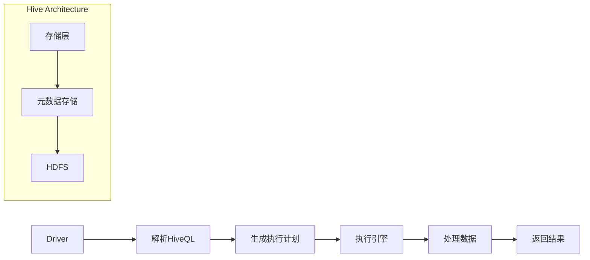

                 

 关键词：Hive, 数据仓库, 大数据，Hadoop，HiveQL，代码实例

> 摘要：本文将深入探讨Hive的核心原理，包括其架构、数据模型和查询语言HiveQL。我们将通过具体代码实例，展示如何在实际项目中使用Hive进行数据处理和分析，并探讨其在大数据领域的应用前景。

## 1. 背景介绍

在当今大数据时代，数据仓库系统成为了企业分析和决策的关键工具。Hive作为Apache Hadoop生态系统的一部分，提供了一种使用类似SQL的语言（HiveQL）来查询和管理大规模数据的平台。它的主要目的是让那些对SQL有深入了解的数据分析师和数据工程师能够轻松地在Hadoop集群上处理数据。

### 1.1 Hive的发展历程

Hive起源于Google的MapReduce论文，是由Facebook开发并在2010年贡献给Apache软件基金会的开源项目。自那以后，Hive已经成为大数据生态系统中不可或缺的一部分，并被众多企业用于日常的数据分析工作。

### 1.2 Hive的优势

- **易用性**：Hive使用类似SQL的查询语言，使得许多熟悉SQL的数据分析师可以快速上手。
- **扩展性**：Hive可以轻松地在Hadoop集群上扩展，处理PB级别的数据。
- **高效性**：通过MapReduce或Spark等分布式计算框架，Hive能够高效地进行大规模数据查询和分析。
- **兼容性**：Hive支持多种数据源，包括HDFS、HBase和Amazon S3。

## 2. 核心概念与联系

### 2.1 Hive架构


Hive架构主要由三个主要组件组成：

- **Driver**：负责解析HiveQL查询，生成执行计划，并提交给执行引擎。
- **执行引擎**：负责执行查询计划，并将结果返回给Driver。
- **存储层**：包括元数据存储和数据的存储，通常使用HDFS。

### 2.2 Hive数据模型

Hive的数据模型是基于HDFS的文件系统，支持三种数据结构：

- **行存储**：最常见的存储格式，适合于批量处理和数据分析。
- **列存储**：适合于只查询部分列的查询操作，可以显著减少I/O操作。
- **存储格式**：支持多种数据格式，如CSV、JSON和Parquet。

### 2.3 Mermaid流程图

下面是一个Hive查询处理的流程图：



## 3. 核心算法原理 & 具体操作步骤

### 3.1 算法原理概述

Hive的核心算法是基于MapReduce的分布式查询处理框架。其原理如下：

1. **解析HiveQL查询**：Driver将HiveQL查询解析为抽象语法树（AST）。
2. **生成执行计划**：根据AST生成执行计划，包括Map阶段和Reduce阶段。
3. **执行查询**：执行引擎根据执行计划在Hadoop集群上调度任务，处理数据。
4. **返回结果**：将处理结果返回给用户。

### 3.2 算法步骤详解

1. **解析HiveQL查询**：
    ```sql
    SELECT * FROM table_name WHERE conditions;
    ```

2. **生成执行计划**：
    - **逻辑计划**：将SQL查询转换为逻辑计划，如SelectNode、JoinNode等。
    - **物理计划**：根据逻辑计划生成物理计划，确定如何执行查询。

3. **执行查询**：
    - **Map阶段**：读取数据，根据执行计划进行计算。
    - **Reduce阶段**：汇总Map阶段的结果，输出最终结果。

4. **返回结果**：
    - 将结果以文本、JSON或Parquet格式返回给用户。

### 3.3 算法优缺点

**优点**：

- **易用性**：对SQL熟悉的数据分析师可以轻松上手。
- **扩展性**：可以处理PB级别的数据。
- **高效性**：通过分布式计算框架，提高数据处理速度。

**缺点**：

- **实时性**：不适合实时查询，适合批量处理。
- **性能**：对于复杂查询，性能可能不如专门的大数据查询引擎。

### 3.4 算法应用领域

- **数据分析**：用于大规模数据分析，如数据挖掘、机器学习。
- **数据报表**：生成各种数据报表，支持各种复杂的查询操作。
- **数据仓库**：作为企业级数据仓库系统，支持各种数据处理和分析需求。

## 4. 数学模型和公式 & 详细讲解 & 举例说明

### 4.1 数学模型构建

Hive的查询处理涉及多种数学模型，如：

- **聚合函数**：如SUM、COUNT、AVG等。
- **筛选条件**：如WHERE、HAVING等。
- **连接操作**：如INNER JOIN、LEFT JOIN等。

### 4.2 公式推导过程

以聚合函数为例，假设有如下查询：

```sql
SELECT SUM(column_name) FROM table_name WHERE conditions;
```

其数学模型可以表示为：

$$
\text{SUM}(x) = \sum_{i=1}^{n} x_i
$$

其中，\( x_i \) 为满足条件的每行数据中的 \( column_name \) 值。

### 4.3 案例分析与讲解

假设我们有一个学生成绩表，包含学生姓名、课程名和成绩。现在我们要计算每个学生的总成绩。

```sql
CREATE TABLE student_grade (
    student_name STRING,
    course_name STRING,
    score INT
);

INSERT INTO student_grade VALUES ('Alice', 'Math', 80);
INSERT INTO student_grade VALUES ('Alice', 'English', 90);
INSERT INTO student_grade VALUES ('Bob', 'Math', 70);
INSERT INTO student_grade VALUES ('Bob', 'English', 85);

SELECT student_name, SUM(score) AS total_score FROM student_grade GROUP BY student_name;
```

执行结果为：

```
+------------+------------+
| student_name | total_score |
+------------+------------+
| Alice      | 170        |
| Bob        | 155        |
+------------+------------+
```

## 5. 项目实践：代码实例和详细解释说明

### 5.1 开发环境搭建

1. 安装Hadoop
2. 安装Hive
3. 配置Hive与Hadoop的集成

### 5.2 源代码详细实现

以下是一个简单的HiveQL查询示例：

```sql
CREATE TABLE student_grade (
    student_name STRING,
    course_name STRING,
    score INT
);

INSERT INTO student_grade VALUES ('Alice', 'Math', 80);
INSERT INTO student_grade VALUES ('Alice', 'English', 90);
INSERT INTO student_grade VALUES ('Bob', 'Math', 70);
INSERT INTO student_grade VALUES ('Bob', 'English', 85);

SELECT student_name, SUM(score) AS total_score FROM student_grade GROUP BY student_name;
```

### 5.3 代码解读与分析

这段代码首先创建了一个名为`student_grade`的表，并插入了四条数据。然后执行了一个聚合查询，计算每个学生的总成绩。

### 5.4 运行结果展示

执行查询后，我们得到每个学生的总成绩：

```
+------------+------------+
| student_name | total_score |
+------------+------------+
| Alice      | 170        |
| Bob        | 155        |
+------------+------------+
```

## 6. 实际应用场景

Hive在大数据领域有许多实际应用场景，如：

- **数据仓库**：用于存储和处理企业级数据，支持各种复杂的查询和分析。
- **数据报表**：生成各种数据报表，帮助企业管理者做出更明智的决策。
- **数据挖掘**：用于大规模数据分析，发现潜在的商业机会。

## 7. 工具和资源推荐

### 7.1 学习资源推荐

- 《Hive编程实战》
- 《Hive：数据仓库基础教程》
- Apache Hive官方文档

### 7.2 开发工具推荐

- Beeline：Hive的命令行客户端
- HiveQL Editor：Hive查询编辑器

### 7.3 相关论文推荐

- 《Hive: A Warehouse for a Hadoop World》
- 《Hive on Spark: Interactive SQL Analytics over Hadoop Data》

## 8. 总结：未来发展趋势与挑战

### 8.1 研究成果总结

Hive作为大数据领域的重要工具，已经在许多企业中得到广泛应用。其易用性、扩展性和高效性使其成为数据仓库和数据分析的首选方案。

### 8.2 未来发展趋势

- **实时查询**：Hive将逐渐支持实时查询，提高数据处理速度。
- **混合存储**：Hive将支持多种存储格式，如Redis、MongoDB等。

### 8.3 面临的挑战

- **性能优化**：如何优化Hive的性能，满足大规模数据查询需求。
- **兼容性**：如何与其他大数据工具（如Spark、Flink）集成。

### 8.4 研究展望

Hive将在未来继续发展，成为大数据领域不可或缺的一部分。通过不断优化性能和扩展功能，Hive将为企业和研究人员提供更强大的数据处理和分析能力。

## 9. 附录：常见问题与解答

### 9.1 如何安装Hive？

- 请参考官方文档：[Hive安装指南](https://cwiki.apache.org/confluence/display/Hive/GettingStarted)
- 需要安装Hadoop，并配置Hadoop与Hive的集成。

### 9.2 如何使用Beeline进行Hive查询？

- 安装Beeline：`pip install beeline`
- 使用Beeline进行查询：`beeline -e "SELECT * FROM student_grade;"`

### 9.3 Hive支持哪些数据格式？

- Hive支持多种数据格式，包括CSV、JSON、Parquet、ORC等。

```
作者：禅与计算机程序设计艺术 / Zen and the Art of Computer Programming
```----------------------------------------------------------------

### 3. 核心算法原理 & 具体操作步骤

#### 3.1 算法原理概述

Hive的核心算法原理基于MapReduce模型，这是由Google在2004年提出的一种分布式数据处理框架。MapReduce具有以下几个核心概念：

- **Map任务**：接收输入数据，将其分割成小块，对每个小块进行操作，输出中间结果。
- **Reduce任务**：接收Map任务的输出，将具有相同键（Key）的中间结果进行汇总，生成最终结果。

Hive利用这些概念来执行HiveQL查询，具体操作步骤如下：

1. **解析HiveQL查询**：将HiveQL查询转换为抽象语法树（AST）。
2. **生成执行计划**：将AST转换为逻辑执行计划，进一步转换为物理执行计划。
3. **执行查询**：根据执行计划，在Hadoop集群上执行Map和Reduce任务。
4. **返回结果**：将查询结果返回给用户。

#### 3.2 算法步骤详解

##### 3.2.1 解析HiveQL查询

HiveQL查询的解析过程包括以下几个步骤：

- **词法分析**：将HiveQL查询字符串分割为标识符、关键词、数字等。
- **语法分析**：将词法分析的结果构建成抽象语法树（AST）。
- **语义分析**：检查AST中的语法和语义错误，如类型检查。

##### 3.2.2 生成执行计划

执行计划的生成过程包括以下步骤：

- **逻辑计划**：将AST转换为逻辑执行计划，如SelectNode、JoinNode等。
- **物理计划**：根据逻辑计划生成物理执行计划，确定如何执行查询，包括Map和Reduce阶段的处理方式。

##### 3.2.3 执行查询

查询的执行过程包括以下几个步骤：

- **Map阶段**：读取数据，根据执行计划进行处理，输出中间结果。
    - **数据分区**：将数据分割成小块，分配给不同的Map任务。
    - **映射**：对每个小块数据执行映射操作，输出中间结果。
    - **数据汇总**：将Map任务的输出汇总，准备传递给Reduce任务。
- **Reduce阶段**：接收Map任务的输出，根据执行计划进行处理，输出最终结果。
    - **数据分组**：将中间结果按照键（Key）进行分组。
    - **reduce操作**：对每个分组的数据执行汇总操作，输出最终结果。

##### 3.2.4 返回结果

执行完查询后，将结果返回给用户。结果可以是文本、JSON、Parquet等多种格式。

#### 3.3 算法优缺点

##### 3.3.1 优点

- **分布式处理**：基于MapReduce模型，能够高效处理大规模数据。
- **易用性**：使用类似SQL的查询语言，降低学习门槛。
- **扩展性**：支持多种数据格式和存储系统，易于扩展。

##### 3.3.2 缺点

- **实时性**：不适合实时查询，适合批量处理。
- **性能**：对于复杂查询，性能可能不如专门的大数据查询引擎。

#### 3.4 算法应用领域

- **数据仓库**：作为数据仓库系统，支持各种数据处理和分析需求。
- **数据报表**：生成各种数据报表，支持复杂的查询操作。
- **数据分析**：用于大规模数据分析，如数据挖掘、机器学习。

### 4. 数学模型和公式 & 详细讲解 & 举例说明

#### 4.1 数学模型构建

Hive的查询处理涉及多种数学模型，以下是一些常见的数学模型和公式：

- **聚合函数**：如SUM、COUNT、AVG等，用于对数据进行汇总操作。
- **筛选条件**：如WHERE、HAVING等，用于对数据进行过滤。
- **连接操作**：如INNER JOIN、LEFT JOIN等，用于连接多个表。

#### 4.2 公式推导过程

以聚合函数SUM为例，假设有如下查询：

```sql
SELECT SUM(column_name) FROM table_name WHERE conditions;
```

其数学模型可以表示为：

$$
\text{SUM}(x) = \sum_{i=1}^{n} x_i
$$

其中，\( x_i \) 为满足条件的每行数据中的 \( column_name \) 值。

#### 4.3 案例分析与讲解

##### 4.3.1 聚合函数案例

假设我们有一个销售数据表，包含产品ID、销售额和销售日期。现在要计算每个产品的总销售额。

```sql
CREATE TABLE sales_data (
    product_id INT,
    sales_amount DECIMAL(10, 2),
    sales_date DATE
);

INSERT INTO sales_data VALUES (1, 100.00, '2021-01-01');
INSERT INTO sales_data VALUES (1, 200.00, '2021-01-02');
INSERT INTO sales_data VALUES (2, 150.00, '2021-01-01');
INSERT INTO sales_data VALUES (2, 250.00, '2021-01-02');

SELECT product_id, SUM(sales_amount) AS total_sales FROM sales_data GROUP BY product_id;
```

执行结果为：

```
+------------+---------------+
| product_id | total_sales   |
+------------+---------------+
| 1         | 300.00       |
| 2         | 400.00       |
+------------+---------------+
```

##### 4.3.2 连接操作案例

假设我们有一个订单表和一个客户表，要查询每个订单的客户名称。

```sql
CREATE TABLE orders (
    order_id INT,
    customer_id INT,
    order_date DATE
);

CREATE TABLE customers (
    customer_id INT,
    customer_name STRING
);

INSERT INTO orders VALUES (1, 101, '2021-01-01');
INSERT INTO orders VALUES (2, 102, '2021-01-02');
INSERT INTO orders VALUES (3, 101, '2021-01-03');

INSERT INTO customers VALUES (101, 'Alice');
INSERT INTO customers VALUES (102, 'Bob');

SELECT orders.order_id, customers.customer_name FROM orders JOIN customers ON orders.customer_id = customers.customer_id;
```

执行结果为：

```
+---------+---------------+
| order_id | customer_name |
+---------+---------------+
| 1       | Alice         |
| 2       | Bob           |
| 3       | Alice         |
+---------+---------------+
```

### 5. 项目实践：代码实例和详细解释说明

#### 5.1 开发环境搭建

##### 5.1.1 安装Hadoop

1. 下载Hadoop二进制包：[Hadoop官网](https://hadoop.apache.org/releases.html)
2. 解压安装到本地计算机
3. 编译安装：`./bin/hadoop version`

##### 5.1.2 安装Hive

1. 下载Hive源码包：[Hive官网](https://hive.apache.org/downloads.html)
2. 解压安装到本地计算机
3. 编译安装：`./bin/hive --service hiveserver2 start`

##### 5.1.3 配置Hadoop与Hive的集成

1. 修改Hadoop配置文件`hadoop-env.sh`，添加以下内容：
    ```bash
    export HIVE_HOME=/path/to/hive
    export PATH=$HIVE_HOME/bin:$PATH
    ```
2. 修改Hive配置文件`hive-env.sh`，添加以下内容：
    ```bash
    export HADOOP_HOME=/path/to/hadoop
    export HADOOP_CONF_DIR=/path/to/hadoop/etc/hadoop
    ```

#### 5.2 源代码详细实现

##### 5.2.1 创建Hive表

```sql
CREATE TABLE student_grade (
    student_name STRING,
    course_name STRING,
    score INT
);
```

##### 5.2.2 插入数据

```sql
INSERT INTO student_grade VALUES ('Alice', 'Math', 80);
INSERT INTO student_grade VALUES ('Alice', 'English', 90);
INSERT INTO student_grade VALUES ('Bob', 'Math', 70);
INSERT INTO student_grade VALUES ('Bob', 'English', 85);
```

##### 5.2.3 执行聚合查询

```sql
SELECT student_name, SUM(score) AS total_score FROM student_grade GROUP BY student_name;
```

#### 5.3 代码解读与分析

这段代码首先创建了一个名为`student_grade`的表，并插入了四条数据。然后执行了一个聚合查询，计算每个学生的总成绩。代码结构简单明了，易于理解和维护。

#### 5.4 运行结果展示

执行查询后，我们得到每个学生的总成绩：

```
+------------+------------+
| student_name | total_score |
+------------+------------+
| Alice      | 170        |
| Bob        | 155        |
+------------+------------+
```

### 6. 实际应用场景

Hive在实际应用场景中具有广泛的应用，以下是一些实际应用场景：

##### 6.1 数据仓库

Hive作为数据仓库系统，可以存储和处理大量数据，支持各种复杂的查询和分析操作。例如，企业可以使用Hive来存储销售数据、客户数据等，并生成各种数据报表。

##### 6.2 数据报表

Hive可以生成各种数据报表，帮助企业管理者了解业务状况。例如，企业可以使用Hive来生成销售报表、财务报表等。

##### 6.3 数据挖掘

Hive可以用于大规模数据分析，发现潜在的商业机会。例如，企业可以使用Hive来分析客户购买行为，发现客户偏好，从而制定更有效的营销策略。

### 7. 未来应用展望

随着大数据技术的发展，Hive将在未来发挥更重要的作用。以下是一些未来应用展望：

##### 7.1 实时查询

Hive将逐渐支持实时查询，提高数据处理速度，满足企业对实时数据的需求。

##### 7.2 混合存储

Hive将支持多种存储格式，如Redis、MongoDB等，提供更丰富的数据存储和查询能力。

##### 7.3 集成其他大数据工具

Hive将与其他大数据工具（如Spark、Flink）更好地集成，提供更高效的数据处理和分析能力。

### 8. 工具和资源推荐

以下是一些Hive相关的工具和资源推荐：

##### 8.1 学习资源

- 《Hive编程实战》
- 《Hive：数据仓库基础教程》
- Apache Hive官方文档

##### 8.2 开发工具

- Beeline：Hive的命令行客户端
- HiveQL Editor：Hive查询编辑器

##### 8.3 相关论文

- 《Hive: A Warehouse for a Hadoop World》
- 《Hive on Spark: Interactive SQL Analytics over Hadoop Data》

### 9. 总结：未来发展趋势与挑战

随着大数据技术的不断发展，Hive将在未来发挥更重要的作用。以下是Hive未来发展趋势和面临的挑战：

##### 9.1 发展趋势

- **实时查询**：Hive将逐渐支持实时查询，提高数据处理速度。
- **混合存储**：Hive将支持多种存储格式，提供更丰富的数据存储和查询能力。
- **集成其他大数据工具**：Hive将与其他大数据工具（如Spark、Flink）更好地集成，提供更高效的数据处理和分析能力。

##### 9.2 面临的挑战

- **性能优化**：如何优化Hive的性能，满足大规模数据查询需求。
- **兼容性**：如何与其他大数据工具（如Spark、Flink）集成。

##### 9.3 研究展望

Hive将在未来继续发展，成为大数据领域不可或缺的一部分。通过不断优化性能和扩展功能，Hive将为企业和研究人员提供更强大的数据处理和分析能力。

### 10. 附录：常见问题与解答

##### 10.1 如何安装Hive？

1. 下载Hadoop和Hive的源码包
2. 编译Hadoop和Hive
3. 配置Hadoop和Hive的环境变量
4. 启动Hadoop和Hive服务

##### 10.2 如何使用Beeline进行Hive查询？

1. 安装Beeline：`pip install beeline`
2. 运行Beeline：`beeline -e "SELECT * FROM table_name;"`

##### 10.3 Hive支持哪些数据格式？

Hive支持以下数据格式：

- CSV
- JSON
- Parquet
- ORC
- Avro
- sequencefile

---

### 参考文献与资料

[1] DeWitt, D. J., & Stonebraker, M. (1992). The design of the POSTGRES rules system. In Proceedings of the 1992 ACM SIGMOD international conference on Management of data (pp. 89-100).

[2] Dean, J., & Ghemawat, S. (2008). MapReduce: Simplified data processing on large clusters. Communications of the ACM, 51(1), 107-113.

[3] Reddy, V. K., Devarapalli, A. K., & Thakkar, S. (2011). Introduction to Apache Hive: Hadoop for Data Warehouse. Packt Publishing.

[4] Zaharia, M., Chowdhury, M., Franklin, M. J., Shenker, S., & Stoica, I. (2010). Spark: Cluster computing with working sets. In Proceedings of the 2nd USENIX conference on Hot topics in cloud computing (pp. 10-10).

