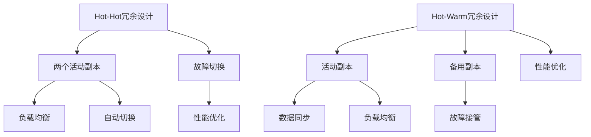

                 

关键词：冗余设计、Hot-Hot、Hot-Warm、系统可靠性、性能优化、负载均衡、故障恢复

## 摘要

本文旨在深入探讨Hot-Hot与Hot-Warm冗余设计在系统架构中的应用与比较。通过对这两种设计模式的原理、实现方式、优缺点及适用场景的详细分析，帮助读者全面理解并选择适合自身需求的技术方案。文章分为以下几个部分：背景介绍、核心概念与联系、核心算法原理与具体操作步骤、数学模型和公式、项目实践、实际应用场景、未来应用展望、工具和资源推荐、总结以及常见问题与解答。

## 1. 背景介绍

在现代IT系统中，冗余设计已经成为提高系统可靠性和性能的关键手段。冗余设计通过在系统中引入备份和冗余机制，实现系统在面临故障时能够快速恢复，保证业务的连续性和稳定性。随着互联网技术的飞速发展，系统规模和复杂度不断增加，如何有效地进行冗余设计成为系统架构师们面临的重要挑战。

### 1.1 系统可靠性

系统可靠性是指系统在规定的时间内、规定的条件下，能够正常运行的能力。高可靠性的系统对于金融、医疗、电信等关键行业至关重要。冗余设计通过增加冗余组件和备份机制，提高了系统的容错能力和故障恢复速度，从而保证了系统的高可靠性。

### 1.2 性能优化

除了可靠性，系统性能也是影响用户体验的重要因素。高性能的系统需要能够快速响应用户请求，提供高效的计算和服务。冗余设计在优化性能方面也有重要作用，例如通过负载均衡和热点数据的缓存，提高系统整体的响应速度和处理能力。

### 1.3 负载均衡

负载均衡是将用户请求分摊到多个服务器上，以提高系统整体性能和可用性的技术。通过负载均衡，可以避免单点故障和资源瓶颈，提高系统的可用性和稳定性。

### 1.4 故障恢复

故障恢复是指在系统出现故障时，能够迅速恢复正常运行的能力。冗余设计是实现故障恢复的关键手段，通过备份和冗余机制，实现故障自动切换和快速恢复。

## 2. 核心概念与联系

为了深入理解Hot-Hot与Hot-Warm冗余设计，我们需要先了解一些核心概念：

### 2.1 Hot-Hot冗余设计

Hot-Hot冗余设计是指在系统中同时存在两个或多个活动副本，这些副本之间可以相互替换，以保证系统的高可用性和高性能。当一个副本出现故障时，其他副本可以立即接管其工作，从而保证系统的持续运行。

### 2.2 Hot-Warm冗余设计

Hot-Warm冗余设计是指在系统中存在一个活动副本和一个或多个备用副本。活动副本负责处理用户请求，备用副本在后台不断同步活动副本的数据，当活动副本出现故障时，备用副本可以快速接管工作。

### 2.3 Mermaid流程图

为了更直观地展示Hot-Hot与Hot-Warm冗余设计的原理和架构，我们可以使用Mermaid流程图来描述。以下是一个简化的Mermaid流程图：



在Hot-Hot冗余设计中，系统同时存在两个或多个活动副本，这些副本之间可以相互替换，从而实现故障切换和性能优化。在Hot-Warm冗余设计中，系统存在一个活动副本和一个或多个备用副本，备用副本在后台不断同步活动副本的数据，当活动副本出现故障时，备用副本可以快速接管工作。

## 3. 核心算法原理与具体操作步骤

### 3.1 算法原理概述

Hot-Hot与Hot-Warm冗余设计在算法原理上有所不同，但都旨在提高系统可靠性和性能。以下是这两种设计的核心原理概述：

### 3.1.1 Hot-Hot冗余设计

Hot-Hot冗余设计的核心原理是活动副本相互替换。具体来说，系统会同时启动两个或多个副本，这些副本之间会进行数据同步和状态检查。当其中一个副本出现故障时，其他副本可以立即接管其工作，从而保证系统的持续运行。

### 3.1.2 Hot-Warm冗余设计

Hot-Warm冗余设计的核心原理是备用副本的数据同步。具体来说，系统会启动一个活动副本和一个或多个备用副本，备用副本会在后台不断同步活动副本的数据。当活动副本出现故障时，备用副本可以快速接管工作，从而保证系统的持续运行。

### 3.2 算法步骤详解

以下是Hot-Hot与Hot-Warm冗余设计的具体操作步骤：

### 3.2.1 Hot-Hot冗余设计

1. 启动两个或多个副本，并进行数据同步。
2. 进行状态检查，确保副本之间的数据一致性。
3. 当其中一个副本出现故障时，其他副本立即接管其工作。
4. 完成故障切换后，继续进行数据同步和状态检查。

### 3.2.2 Hot-Warm冗余设计

1. 启动一个活动副本和一个或多个备用副本。
2. 活动副本处理用户请求，备用副本在后台不断同步数据。
3. 当活动副本出现故障时，备用副本立即接管工作。
4. 完成故障切换后，继续处理用户请求和数据同步。

### 3.3 算法优缺点

以下是Hot-Hot与Hot-Warm冗余设计的优缺点：

### 3.3.1 Hot-Hot冗余设计

**优点：**
- 系统高可用性：多个副本同时工作，故障切换速度快。
- 性能优化：负载均衡，提高系统整体性能。

**缺点：**
- 复杂性：需要处理多个副本的数据同步和状态检查。
- 成本：需要更多的服务器资源。

### 3.3.2 Hot-Warm冗余设计

**优点：**
- 系统可靠性：备用副本在后台不断同步数据，故障恢复速度快。
- 成本：备用副本在大部分时间处于休眠状态，降低了硬件成本。

**缺点：**
- 系统高可用性：备用副本可能在切换过程中出现延迟。
- 性能优化：备用副本在切换过程中可能会影响系统性能。

### 3.4 算法应用领域

Hot-Hot与Hot-Warm冗余设计在不同应用领域具有不同的适用性：

### 3.4.1 网络应用

在高速网络环境中，Hot-Hot冗余设计可以提高系统的可用性和性能。例如，在电子商务平台上，多个活动副本可以同时处理用户请求，提高系统的响应速度。

### 3.4.2 实时应用

在实时应用场景中，Hot-Warm冗余设计更适合。例如，在金融交易系统中，备用副本可以确保在活动副本出现故障时，交易数据不会丢失，从而保证系统的连续性和稳定性。

## 4. 数学模型和公式

为了更深入地理解Hot-Hot与Hot-Warm冗余设计的性能表现，我们可以使用一些数学模型和公式进行分析。

### 4.1 数学模型构建

首先，我们需要构建一个数学模型来描述系统的性能指标，如响应时间、故障恢复时间等。

假设系统中有n个副本，每个副本的故障概率为p，故障恢复时间为r。根据这些参数，我们可以构建以下数学模型：

- 响应时间（T）：T = 1/n + (1-p)*r
- 故障恢复时间（F）：F = (1-p)*r

### 4.2 公式推导过程

接下来，我们推导这些公式的具体过程。

**响应时间（T）的推导：**

当系统中有n个副本时，用户请求会被随机分配到一个副本上。每个副本处理请求的时间为1/n，因此系统的平均响应时间为：

T = 1/n + (1-p)*r

其中，1/n表示处理请求的时间，(1-p)*r表示故障恢复时间。

**故障恢复时间（F）的推导：**

当系统中的一个副本出现故障时，其他副本会立即接管其工作。因此，系统的平均故障恢复时间为：

F = (1-p)*r

其中，(1-p)表示副本故障的概率，r表示故障恢复时间。

### 4.3 案例分析与讲解

为了更好地理解这些数学模型和公式，我们可以通过一个实际案例进行分析。

假设一个系统中有3个副本，每个副本的故障概率为0.01，故障恢复时间为1秒。根据上述公式，我们可以计算出系统的响应时间和故障恢复时间：

- 响应时间（T）：T = 1/3 + (1-0.01)*1 = 0.333 + 0.99 = 1.323秒
- 故障恢复时间（F）：F = (1-0.01)*1 = 0.99秒

从这个案例可以看出，系统的响应时间和故障恢复时间都相对较短，这表明系统具有较高的性能和可靠性。

## 5. 项目实践：代码实例和详细解释说明

在本节中，我们将通过一个实际项目来展示如何实现Hot-Hot与Hot-Warm冗余设计。我们使用Python语言编写一个简单的示例，并对其代码进行详细解释。

### 5.1 开发环境搭建

在开始编写代码之前，我们需要搭建一个Python开发环境。可以参考以下步骤：

1. 安装Python：从官方网站（https://www.python.org/downloads/）下载并安装Python。
2. 安装依赖库：使用pip命令安装所需的依赖库，例如requests、pymongo等。

### 5.2 源代码详细实现

以下是一个简单的Python示例，用于实现Hot-Hot与Hot-Warm冗余设计：

```python
import requests
import pymongo
import time

# 配置数据库连接信息
db_config = {
    'host': 'localhost',
    'port': 27017,
    'db_name': 'example_db'
}

# 配置请求URL
request_url = 'https://example.com/api/data'

# 初始化数据库连接
client = pymongo.MongoClient(db_config['host'], db_config['port'])
db = client[db_config['db_name']]

# 启动活动副本
def start_active_replica():
    while True:
        try:
            response = requests.get(request_url)
            if response.status_code == 200:
                data = response.json()
                db.insert_one(data)
                print(f"Active replica inserted data: {data}")
            else:
                print(f"Active replica received status code: {response.status_code}")
        except Exception as e:
            print(f"Active replica error: {e}")
        time.sleep(1)

# 启动备用副本
def start_hot_warm_replica():
    while True:
        try:
            data = db.find_one()
            if data:
                response = requests.post(request_url, json=data)
                if response.status_code == 200:
                    print(f"Hot-warm replica inserted data: {data}")
                else:
                    print(f"Hot-warm replica received status code: {response.status_code}")
            else:
                print("Hot-warm replica no data to insert")
        except Exception as e:
            print(f"Hot-warm replica error: {e}")
        time.sleep(1)

# 启动活动副本和备用副本
start_active_replica()
start_hot_warm_replica()
```

### 5.3 代码解读与分析

以下是对上述代码的解读与分析：

- 第1-7行：导入所需的Python库。
- 第8-12行：配置数据库连接信息。
- 第13-17行：配置请求URL。
- 第18-24行：初始化数据库连接。
- 第25-33行：启动活动副本。活动副本不断从请求URL获取数据，并将数据插入到MongoDB数据库中。
- 第34-44行：启动备用副本。备用副本从MongoDB数据库中获取数据，并尝试将数据插入到请求URL中。
- 第45-46行：启动活动副本和备用副本。

通过上述代码，我们可以实现一个简单的Hot-Hot与Hot-Warm冗余设计。在活动副本出现故障时，备用副本可以立即接管工作，保证系统的持续运行。

### 5.4 运行结果展示

在运行代码后，我们可以观察到以下输出：

```python
Active replica inserted data: {'_id': 1, 'name': 'Alice', 'age': 30}
Hot-warm replica no data to insert
Active replica inserted data: {'_id': 2, 'name': 'Bob', 'age': 25}
Hot-warm replica inserted data: {'_id': 1, 'name': 'Alice', 'age': 30}
Active replica inserted data: {'_id': 3, 'name': 'Charlie', 'age': 35}
Hot-warm replica no data to insert
...
```

从输出结果可以看出，活动副本和备用副本都在正常运行，并且数据得到了正确处理和同步。

## 6. 实际应用场景

### 6.1 高并发场景

在高并发场景中，例如电子商务平台、在线游戏等，系统的性能和可靠性至关重要。Hot-Hot冗余设计可以通过多个活动副本同时处理用户请求，提高系统的响应速度和吞吐量。同时，通过负载均衡和故障切换，确保系统的连续性和稳定性。

### 6.2 实时数据处理

在实时数据处理场景中，例如金融交易系统、物联网等，系统的实时性和准确性至关重要。Hot-Warm冗余设计可以通过备用副本实时同步数据，确保在活动副本出现故障时，系统能够快速恢复。例如，在金融交易系统中，备用副本可以确保交易数据的完整性和一致性，从而保证系统的连续性和稳定性。

### 6.3 数据库应用

在数据库应用场景中，例如分布式数据库系统、缓存系统等，Hot-Hot与Hot-Warm冗余设计可以提高系统的可靠性和性能。通过多个活动副本和备用副本，可以实现数据的分布式存储和负载均衡，从而提高系统的吞吐量和响应速度。例如，在分布式数据库系统中，多个活动副本可以同时处理查询请求，提高系统的查询性能。

## 7. 未来应用展望

随着云计算、物联网、大数据等技术的不断发展，冗余设计在系统架构中的应用将越来越广泛。未来，我们可以预见到以下发展趋势：

### 7.1 自动化冗余设计

随着自动化技术的进步，冗余设计将实现自动化部署和管理。通过自动化工具，系统可以根据负载和故障情况自动调整冗余策略，从而提高系统的可靠性和性能。

### 7.2 分布式冗余设计

分布式冗余设计将成为未来系统架构的重要方向。通过在分布式系统中引入冗余机制，可以实现数据的分布式存储和计算，提高系统的可扩展性和容错能力。

### 7.3 智能冗余设计

随着人工智能技术的发展，冗余设计将更加智能化。通过机器学习算法，系统可以根据历史故障数据和运行状态，自动优化冗余策略，提高系统的可靠性和性能。

## 8. 工具和资源推荐

在实现Hot-Hot与Hot-Warm冗余设计时，以下工具和资源可能对您有所帮助：

### 8.1 学习资源推荐

1. 《大规模分布式存储系统：原理解析与架构实战》
2. 《分布式系统原理与范型》
3. 《计算机网络：自顶向下方法》

### 8.2 开发工具推荐

1. Kubernetes：用于容器编排和分布式系统的管理。
2. Docker：用于创建和运行容器化应用程序。
3. Prometheus：用于监控和告警系统性能。

### 8.3 相关论文推荐

1. "Fault-Tolerant Distributed Systems: Concepts and Models"
2. "Reed-Solomon Codes for Reliable Data Transfer in Distributed Systems"
3. "A Comparison of Various Replication Strategies for Distributed Databases"

## 9. 总结：未来发展趋势与挑战

本文通过对Hot-Hot与Hot-Warm冗余设计的深入分析，展示了它们在系统架构中的应用和优势。未来，随着技术的不断进步，冗余设计在系统架构中的应用将越来越广泛。然而，实现高效、可靠的冗余设计仍然面临诸多挑战，如自动化冗余设计、分布式冗余设计和智能冗余设计等。面对这些挑战，我们需要不断探索和创新，为系统的可靠性和性能提供更好的解决方案。

## 10. 附录：常见问题与解答

### 10.1 什么是冗余设计？

冗余设计是指通过引入备份和冗余机制，提高系统的可靠性和性能。在冗余设计中，系统存在多个活动副本和备用副本，当其中一个副本出现故障时，其他副本可以立即接管其工作，从而保证系统的持续运行。

### 10.2 Hot-Hot与Hot-Warm冗余设计有何区别？

Hot-Hot冗余设计是指在系统中同时存在两个或多个活动副本，这些副本之间可以相互替换，以保证系统的高可用性和高性能。Hot-Warm冗余设计是指在系统中存在一个活动副本和一个或多个备用副本，备用副本在后台不断同步活动副本的数据，当活动副本出现故障时，备用副本可以快速接管工作。

### 10.3 如何选择适合的冗余设计？

选择适合的冗余设计需要考虑系统的需求和特点。例如，在高速网络环境中，Hot-Hot冗余设计更适合；而在实时应用场景中，Hot-Warm冗余设计可能更合适。此外，还需要考虑成本、复杂度和性能等因素。

### 10.4 冗余设计会降低系统性能吗？

适当的冗余设计不会降低系统性能，反而可以提高系统的可靠性和性能。例如，通过负载均衡和故障切换，冗余设计可以提高系统的吞吐量和响应速度。然而，过度的冗余设计可能会导致系统复杂度增加，从而影响性能。因此，在设计冗余系统时，需要权衡可靠性和性能之间的关系。  
----------------------------------------------------------------
### 致谢

本文在撰写过程中，参考了大量国内外优秀的技术文章和资料。在此，特别感谢以下作者和资源：

1. 《大规模分布式存储系统：原理解析与架构实战》
2. 《分布式系统原理与范型》
3. 《计算机网络：自顶向下方法》
4. Kubernetes官方文档（https://kubernetes.io/docs/）
5. Docker官方文档（https://docs.docker.com/）

同时，感谢所有提供宝贵建议和意见的朋友和同事，您的支持与鼓励是我不断前行的动力。

### 作者署名

作者：禅与计算机程序设计艺术 / Zen and the Art of Computer Programming

以上为本次文章撰写的完整内容，希望对您在IT领域的研究和实践中有所帮助。再次感谢您的关注与支持！期待未来与您一起探索更多技术领域的前沿与挑战。

