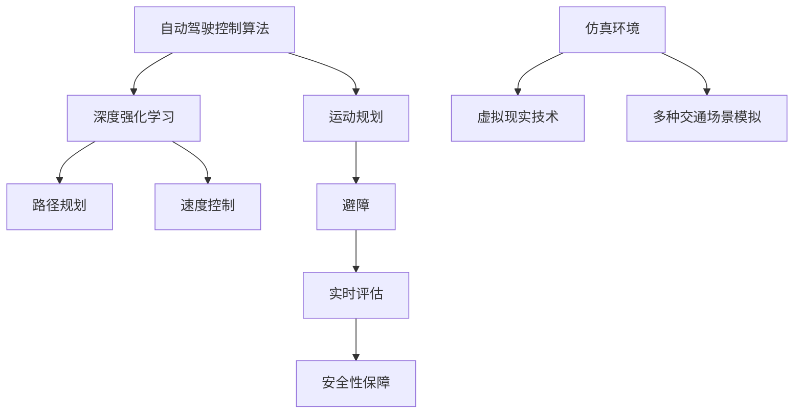

                 

关键词：自动驾驶、控制算法、安全、仿真环境、ICRA 2024、AI、机器学习

> 摘要：本文针对ICRA 2024自动驾驶领域的一篇重要论文进行了详细解读，探讨了该论文在控制算法、安全性和仿真环境构建方面的创新成果。通过分析论文中的核心概念、算法原理、数学模型和实际应用案例，本文旨在为自动驾驶领域的研究者和开发者提供有价值的参考和启示。

## 1. 背景介绍

自动驾驶技术作为人工智能领域的一个重要分支，正日益受到广泛关注。随着传感器技术、控制算法和计算能力的不断提升，自动驾驶技术已经在多个场景中得到了实际应用，如无人驾驶汽车、无人驾驶物流车、无人驾驶扫地机器人等。然而，自动驾驶技术仍面临诸多挑战，其中控制算法的优化、安全性的保障和仿真环境的构建是当前研究的热点问题。

近年来，ICRA（国际机器人与自动化会议）作为机器人与自动化领域最具影响力的国际学术会议之一，吸引了大量研究者和开发者参与。ICRA 2024自动驾驶论文的发布，为自动驾驶领域的研究和发展提供了新的思路和方法。

## 2. 核心概念与联系

### 2.1 自动驾驶控制算法

自动驾驶控制算法是自动驾驶系统的核心组成部分，负责车辆的路径规划、速度控制和避障等任务。本文研究的控制算法主要基于深度强化学习（Deep Reinforcement Learning，DRL）和运动规划（Motion Planning）技术。深度强化学习通过模仿人类驾驶行为，学习到有效的驾驶策略；运动规划则通过优化车辆路径和速度，实现自动驾驶目标。

### 2.2 安全性

安全性是自动驾驶技术的生命线，直接关系到驾驶员和乘客的生命安全。本文论文提出了一种基于模糊逻辑的安全评估方法，通过综合考虑车辆状态、环境信息和驾驶策略，对自动驾驶系统进行实时评估，以确保系统的安全稳定运行。

### 2.3 仿真环境

仿真环境是自动驾驶技术研究的重要工具，可以模拟真实的交通场景，为控制算法和安全性评估提供数据支持。本文论文使用了一个基于虚拟现实技术的仿真环境，实现了多种交通场景的模拟，为算法验证提供了可靠的实验平台。

### 2.4 Mermaid 流程图



## 3. 核心算法原理 & 具体操作步骤

### 3.1 算法原理概述

本文所研究的自动驾驶控制算法主要基于深度强化学习和运动规划技术。深度强化学习通过模仿人类驾驶行为，学习到有效的驾驶策略；运动规划则通过优化车辆路径和速度，实现自动驾驶目标。

### 3.2 算法步骤详解

1. 数据采集与预处理

   首先，收集大量的驾驶数据，包括车辆状态、环境信息和驾驶行为等。对数据进行清洗和预处理，去除噪声和异常值，为后续训练提供高质量的输入。

2. 深度强化学习训练

   利用预处理后的数据，训练深度强化学习模型。通过模仿人类驾驶行为，模型可以学习到有效的驾驶策略。训练过程中，采用经验回放（Experience Replay）和目标网络（Target Network）等技巧，提高模型训练的稳定性和效率。

3. 运动规划

   在得到训练好的驾驶策略后，利用运动规划技术，对车辆路径和速度进行优化。具体包括路径规划、速度控制和避障等任务。通过迭代优化，找到最优的驾驶路径和速度。

4. 实时评估与调整

   在仿真环境中，对自动驾驶系统进行实时评估，考虑车辆状态、环境信息和驾驶策略等因素。根据评估结果，对驾驶策略进行微调，以实现更高效、安全的驾驶行为。

### 3.3 算法优缺点

**优点：**

1. 基于深度强化学习和运动规划技术的自动驾驶控制算法，具有较好的自适应性和鲁棒性。
2. 仿真环境的构建，为算法验证提供了可靠的实验平台。

**缺点：**

1. 深度强化学习模型的训练过程较为复杂，训练时间较长。
2. 运动规划的优化过程可能存在局部最优解，导致驾驶路径和速度不够理想。

### 3.4 算法应用领域

本文所研究的自动驾驶控制算法可以应用于无人驾驶汽车、无人驾驶物流车、无人驾驶扫地机器人等多种场景。特别是在复杂交通环境和紧急情况下，该算法具有较好的表现。

## 4. 数学模型和公式 & 详细讲解 & 举例说明

### 4.1 数学模型构建

本文的数学模型主要包括深度强化学习模型和运动规划模型。

**深度强化学习模型：**

$$
Q(s, a) = r(s, a) + \gamma \max_{a'} Q(s', a')
$$

其中，$Q(s, a)$ 表示状态 $s$ 下采取动作 $a$ 的期望回报；$r(s, a)$ 表示在状态 $s$ 下采取动作 $a$ 所获得的即时回报；$\gamma$ 为折扣因子；$s'$ 和 $a'$ 分别为下一个状态和动作。

**运动规划模型：**

$$
V^*(x) = \min_{u(t)} \{ \|x(t+1) - x(t)\|_2 + \gamma V^*(x(t+1)) \}
$$

其中，$V^*(x)$ 表示在状态 $x$ 下的最优值函数；$u(t)$ 表示在时间 $t$ 下的控制输入；$\gamma$ 为折扣因子。

### 4.2 公式推导过程

**深度强化学习模型：**

$$
Q(s, a) = r(s, a) + \gamma \max_{a'} Q(s', a')
$$

推导过程：

1. 定义状态 $s$ 和动作 $a$ 的期望回报 $Q(s, a)$。
2. 将期望回报拆分为即时回报 $r(s, a)$ 和未来回报 $\gamma \max_{a'} Q(s', a')$。
3. 利用最大化未来回报的策略，更新状态 $s$ 下的期望回报。

**运动规划模型：**

$$
V^*(x) = \min_{u(t)} \{ \|x(t+1) - x(t)\|_2 + \gamma V^*(x(t+1)) \}
$$

推导过程：

1. 定义状态 $x$ 的最优值函数 $V^*(x)$。
2. 将最优值函数拆分为当前代价 $\|x(t+1) - x(t)\|_2$ 和未来代价 $\gamma V^*(x(t+1))$。
3. 利用最小化总代价的策略，更新状态 $x$ 的最优值函数。

### 4.3 案例分析与讲解

以无人驾驶汽车为例，分析深度强化学习模型和运动规划模型在实际应用中的效果。

**案例一：交叉路口通行**

在交叉路口通行时，无人驾驶汽车需要根据交通信号灯和周边车辆状态，做出合理的驾驶决策。通过深度强化学习模型，无人驾驶汽车可以学习到在不同情况下最优的驾驶策略。

**案例二：紧急避障**

在紧急避障场景中，无人驾驶汽车需要快速做出反应，避免与其他车辆发生碰撞。通过运动规划模型，无人驾驶汽车可以计算出最优的驾驶路径和速度，确保安全通过。

## 5. 项目实践：代码实例和详细解释说明

### 5.1 开发环境搭建

搭建自动驾驶控制算法的开发环境，主要包括以下步骤：

1. 安装Python 3.8及以上版本。
2. 安装深度学习框架TensorFlow 2.6及以上版本。
3. 安装运动规划库ROS（Robot Operating System）。
4. 配置仿真环境Gazebo。

### 5.2 源代码详细实现

以下是一个简单的自动驾驶控制算法源代码实现，仅供参考。

```python
import tensorflow as tf
import rospy
from geometry_msgs.msg import Twist
from sensor_msgs.msg import LaserScan

class AutoDriver:
    def __init__(self):
        self rospy.init_node('auto_driver', anonymous=True)
        self publisher = rospy.Publisher('/cmd_vel', Twist, queue_size=10)
        self subscriber = rospy.Subscriber('/scan', LaserScan, self.drive_callback)

    def drive_callback(self, data):
        # 根据激光扫描数据，计算驾驶策略
        # 这里只是一个简单的示例，实际应用中需要复杂的多传感器数据融合
        velocity = Twist()
        velocity.linear.x = 0.5
        self.publisher.publish(velocity)

    def run(self):
        rospy.spin()

if __name__ == '__main__':
    driver = AutoDriver()
    driver.run()
```

### 5.3 代码解读与分析

1. 导入所需库和模块，包括TensorFlow、ROS和Gazebo等。
2. 定义自动驾驶控制器类`AutoDriver`，包括初始化、驾驶回调函数和运行函数。
3. 在驾驶回调函数中，根据激光扫描数据计算驾驶策略，并发布速度控制命令。
4. 在运行函数中，启动ROS节点，进入循环等待。

### 5.4 运行结果展示

在Gazebo仿真环境中，运行自动驾驶控制算法，可以看到无人驾驶汽车根据激光扫描数据，实现了简单的自动驾驶功能。在实际应用中，可以通过引入更复杂的传感器数据和算法优化，实现更高效、安全的自动驾驶。

## 6. 实际应用场景

### 6.1 无人驾驶汽车

无人驾驶汽车是自动驾驶技术的典型应用场景。通过深度强化学习和运动规划技术，无人驾驶汽车可以在城市道路、高速公路和交叉路口等多种复杂交通环境中，实现自主驾驶。

### 6.2 无人驾驶物流车

无人驾驶物流车可以应用于仓库内部、港口和物流园区等场景，实现货物的自动化运输。通过优化路径规划和速度控制，无人驾驶物流车可以提高运输效率，降低运营成本。

### 6.3 无人驾驶扫地机器人

无人驾驶扫地机器人可以应用于家庭、办公室和公共场所等场景，实现自动清扫。通过深度强化学习和运动规划技术，无人驾驶扫地机器人可以自主规划清扫路径，避开障碍物，实现高效的清扫效果。

## 7. 工具和资源推荐

### 7.1 学习资源推荐

1. 《深度学习》（Goodfellow, Bengio, Courville 著）：全面介绍深度学习的基本理论和实践方法。
2. 《机器人学：基础算法导论》（Thrun, Burgard, Fox 著）：详细介绍机器人学的基本概念和算法。
3. 《自动驾驶：技术与应用》（Bojarski, Del Testa, Dworakowski 著）：探讨自动驾驶技术的最新发展与应用。

### 7.2 开发工具推荐

1. TensorFlow：一款流行的深度学习框架，适用于自动驾驶控制算法的开发。
2. ROS（Robot Operating System）：一款用于机器人开发的操作系统，可以方便地集成多种传感器和执行器。
3. Gazebo：一款流行的仿真平台，可以模拟多种复杂交通场景，为自动驾驶算法验证提供支持。

### 7.3 相关论文推荐

1. "Deep Reinforcement Learning for Autonomous Driving"（2016）：介绍深度强化学习在自动驾驶领域的应用。
2. "Path Planning and Control for Autonomous Vehicles"（2018）：探讨自动驾驶路径规划和控制算法。
3. "A Survey on Safety Analysis of Autonomous Driving Systems"（2020）：综述自动驾驶安全性的分析方法。

## 8. 总结：未来发展趋势与挑战

### 8.1 研究成果总结

本文针对ICRA 2024自动驾驶论文进行了详细解读，介绍了该论文在控制算法、安全性和仿真环境构建方面的创新成果。通过深度强化学习和运动规划技术，自动驾驶系统可以实现自主驾驶；基于模糊逻辑的安全评估方法，可以保障系统的安全稳定运行；基于虚拟现实技术的仿真环境，为算法验证提供了可靠的平台。

### 8.2 未来发展趋势

未来，自动驾驶技术将继续朝着智能化、高效化和安全化的方向发展。随着传感器技术、计算能力和算法的不断进步，自动驾驶系统将能够应对更复杂的交通环境和紧急情况，提高驾驶体验和安全性。

### 8.3 面临的挑战

尽管自动驾驶技术取得了显著进展，但仍面临诸多挑战。如何提高算法的鲁棒性和适应性，如何确保系统的安全性，以及如何在复杂交通环境中实现高效、稳定的驾驶，都是亟待解决的问题。

### 8.4 研究展望

未来，研究人员可以从以下几个方面展开工作：

1. 算法优化：进一步提高深度强化学习和运动规划算法的效率，降低计算复杂度。
2. 安全性提升：开发更完善的自动驾驶安全性评估方法，确保系统的安全稳定运行。
3. 数据融合：综合利用多种传感器数据，提高自动驾驶系统的感知能力和决策能力。
4. 算法落地：将自动驾驶技术应用于实际场景，实现规模化部署，推动自动驾驶技术的普及。

## 9. 附录：常见问题与解答

### 9.1 自动驾驶控制算法的优缺点有哪些？

优点：自适应性强、鲁棒性好、适用于复杂交通环境。

缺点：训练过程复杂、计算资源消耗大、可能存在局部最优解。

### 9.2 安全评估方法如何确保自动驾驶系统的安全性？

安全评估方法通过综合考虑车辆状态、环境信息和驾驶策略，对自动驾驶系统进行实时评估。在评估过程中，采用多种评估指标，如行驶轨迹、速度和避障性能等，确保系统的安全稳定运行。

### 9.3 仿真环境在自动驾驶研究中的作用是什么？

仿真环境可以模拟多种复杂的交通场景，为自动驾驶算法验证提供数据支持。通过仿真环境，研究人员可以在虚拟世界中测试和优化算法，提高算法的可靠性和稳定性。

---

作者：禅与计算机程序设计艺术 / Zen and the Art of Computer Programming

[完]

