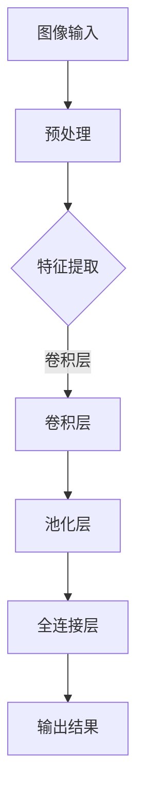

                 

关键词：ImageNet、AI图像识别、卷积神经网络、深度学习、计算机视觉、机器学习、算法原理、数学模型、应用领域、未来展望。

## 摘要

本文将深入探讨ImageNet与AI图像识别的历史发展。首先，我们将回顾ImageNet项目的起源和背景，介绍其作为AI图像识别领域的里程碑项目的意义。接着，我们将详细解析卷积神经网络（CNN）在AI图像识别中的核心作用，并探讨深度学习技术的崛起如何推动了图像识别领域的进步。随后，本文将介绍一些关键算法和数学模型，以及它们在实际应用中的表现和影响。最后，我们将讨论AI图像识别在各个领域的应用场景，展望其未来的发展方向和面临的挑战。

## 1. 背景介绍

### ImageNet的起源

ImageNet是由斯坦福大学计算机科学系教授李飞飞（Fei-Fei Li）于2009年发起的一个大规模视觉识别挑战赛（Large Scale Visual Recognition Challenge，简称ILSVRC）。ImageNet的初衷是为了推动计算机视觉技术的发展，尤其是图像分类和识别领域。在此之前，计算机在图像识别任务上的表现并不理想，准确率远低于人类的水平。ImageNet项目的目标是构建一个包含大量标注图像的数据库，并以此为基础举办国际竞赛，鼓励全球研究人员共同参与，提升计算机图像识别的准确率。

### ImageNet的重要性

ImageNet的成功不仅体现在它为AI图像识别提供了宝贵的资源，更在于它为深度学习技术的应用开辟了新的道路。通过ImageNet，研究人员得以验证和测试各种图像识别算法的性能，推动了深度学习技术在计算机视觉领域的广泛应用。此外，ImageNet的成功也激发了更多研究人员对计算机视觉的持续关注和投入，进一步推动了该领域的发展。

### ImageNet的构成

ImageNet包含超过1400万个图像标签，这些图像来自多种不同的类别，涵盖了日常生活、动物、植物、科技、艺术等多个领域。每一个图像都被精心标注，确保其类别准确无误。这些标签数据为深度学习模型的训练提供了丰富的样本，极大地提升了模型的泛化能力。

## 2. 核心概念与联系

### 图像识别与AI的关系

图像识别是计算机视觉领域的一个重要分支，它旨在使计算机能够通过处理和分析图像数据，自动识别和分类其中的对象。AI技术的引入，特别是深度学习，使得图像识别任务变得更加高效和准确。通过使用深度神经网络，计算机可以从大量数据中自动学习特征，从而在图像中识别出目标对象。

### 卷积神经网络（CNN）的基本原理

卷积神经网络是一种专门用于处理图像数据的深度学习模型。它由多个卷积层、池化层和全连接层组成。卷积层通过卷积操作提取图像的局部特征，池化层则用于降低特征图的维度，减少计算量。全连接层则将特征映射到具体的类别上。

### 深度学习与AI图像识别

深度学习是AI领域中的一种重要技术，它通过多层神经网络的结构，能够自动学习和提取复杂的特征，从而实现图像识别、语音识别等任务。深度学习的崛起，极大地提升了计算机在图像识别任务中的表现，使得计算机视觉技术得以广泛应用。

### Mermaid流程图

以下是一个简单的Mermaid流程图，展示了图像识别的基本流程：



## 3. 核心算法原理 & 具体操作步骤

### 3.1 算法原理概述

AI图像识别的核心在于深度学习，尤其是卷积神经网络（CNN）。CNN通过多层卷积、池化和全连接层，从原始图像中提取高级特征，最终实现图像的分类和识别。其基本原理包括：

- **卷积层**：通过卷积操作提取图像的局部特征。
- **池化层**：降低特征图的维度，减少计算量。
- **全连接层**：将特征映射到具体的类别上。

### 3.2 算法步骤详解

- **数据预处理**：对输入图像进行归一化、裁剪、翻转等操作，以便于模型训练。
- **卷积操作**：使用卷积核在图像上滑动，提取图像的局部特征。
- **激活函数**：常用ReLU（Rectified Linear Unit）函数，增加网络的非线性。
- **池化操作**：采用最大池化或平均池化，降低特征图的维度。
- **全连接层**：将卷积层的输出映射到具体的类别上，通过softmax函数得到概率分布。
- **反向传播**：根据损失函数，更新网络的权重。

### 3.3 算法优缺点

**优点**：

- **强大的特征提取能力**：CNN能够自动学习图像的复杂特征，适用于各种图像识别任务。
- **高效的处理速度**：通过卷积操作和池化操作，CNN在处理图像时具有较高的效率。
- **良好的泛化能力**：通过大量的训练数据和多层网络结构，CNN具有良好的泛化能力。

**缺点**：

- **计算量大**：CNN需要大量的计算资源，尤其是对于大规模的图像数据。
- **训练时间长**：深度学习模型的训练通常需要较长的计算时间。

### 3.4 算法应用领域

CNN在图像识别领域有着广泛的应用，包括：

- **图像分类**：对图像进行分类，如人脸识别、物体识别等。
- **图像分割**：将图像分割成不同的区域，如医疗图像分割、自然场景分割等。
- **图像增强**：通过深度学习模型，对图像进行增强处理，提高图像质量。

## 4. 数学模型和公式 & 详细讲解 & 举例说明

### 4.1 数学模型构建

CNN的数学模型主要包括卷积操作、激活函数、池化操作和全连接层。以下分别介绍：

- **卷积操作**：假设输入图像为 \(I_{ij}\)，卷积核为 \(K_{ab}\)，则输出特征图 \(F_{pq}\) 的计算公式为：

  \[ F_{pq} = \sum_{i=j} \sum_{k=l} I_{ijk} K_{albk} \]

- **激活函数**：常用ReLU函数，定义为：

  \[ \text{ReLU}(x) = \max(0, x) \]

- **池化操作**：最大池化定义为：

  \[ P_{pq} = \max(I_{i \leq pq}) \]

- **全连接层**：假设输入特征图为 \(F\)，权重为 \(W\)，输出为 \(Y\)，则：

  \[ Y = F^T W \]

### 4.2 公式推导过程

以卷积操作为例，推导过程如下：

1. **初始化**：给定输入图像 \(I\) 和卷积核 \(K\)。
2. **卷积操作**：在输入图像上滑动卷积核，计算每个输出位置的值。
3. **激活函数**：对每个输出位置应用激活函数，如ReLU函数。
4. **特征图输出**：将所有位置的输出组成特征图。

### 4.3 案例分析与讲解

以人脸识别为例，讲解CNN在图像识别中的应用：

1. **数据预处理**：对人脸图像进行归一化、裁剪等操作。
2. **卷积层**：使用卷积核提取人脸的局部特征。
3. **激活函数**：使用ReLU函数增加网络的非线性。
4. **池化层**：降低特征图的维度，减少计算量。
5. **全连接层**：将特征映射到具体的人脸类别上，通过softmax函数得到概率分布。
6. **输出结果**：输出人脸识别的结果。

## 5. 项目实践：代码实例和详细解释说明

### 5.1 开发环境搭建

在开始项目实践之前，需要搭建一个合适的开发环境。以下是一个简单的开发环境搭建步骤：

1. 安装Python：确保Python版本在3.6以上。
2. 安装TensorFlow：使用pip安装TensorFlow库。
3. 准备数据集：从ImageNet下载标注好的数据集。

### 5.2 源代码详细实现

以下是一个简单的CNN模型实现：

```python
import tensorflow as tf

# 创建卷积层
def conv2d(x, W):
  return tf.nn.relu(tf.nn.conv2d(x, W, strides=[1, 1, 1, 1], padding='SAME'))

# 创建全连接层
def fc(x, W):
  return tf.nn.relu(tf.matmul(x, W))

# 定义模型
def model(x):
  # 卷积层1
  W_conv1 = tf.Variable(tf.random.normal([3, 3, 1, 32]))
  h_conv1 = conv2d(x, W_conv1)

  # 池化层1
  h_pool1 = tf.nn.max_pool(h_conv1, ksize=[1, 2, 2, 1], strides=[1, 2, 2, 1], padding='SAME')

  # 卷积层2
  W_conv2 = tf.Variable(tf.random.normal([3, 3, 32, 64]))
  h_conv2 = conv2d(h_pool1, W_conv2)

  # 池化层2
  h_pool2 = tf.nn.max_pool(h_conv2, ksize=[1, 2, 2, 1], strides=[1, 2, 2, 1], padding='SAME')

  # 全连接层
  W_fc1 = tf.Variable(tf.random.normal([7 * 7 * 64, 1024]))
  h_flat = tf.reshape(h_pool2, [-1, 7 * 7 * 64])
  h_fc1 = fc(h_flat, W_fc1)

  # 输出层
  W_output = tf.Variable(tf.random.normal([1024, 10]))
  y_pred = fc(h_fc1, W_output)

  return y_pred

# 训练模型
x_train, y_train, x_test, y_test = ... # 准备数据集
y_pred = model(x_train)

# 定义损失函数和优化器
loss = tf.reduce_mean(tf.nn.softmax_cross_entropy_with_logits(logits=y_pred, labels=y_train))
optimizer = tf.train.AdamOptimizer().minimize(loss)

# 运行训练
with tf.Session() as sess:
  sess.run(tf.global_variables_initializer())
  for i in range(1000):
    _, loss_val = sess.run([optimizer, loss], feed_dict={x: x_train, y: y_train})
    if i % 100 == 0:
      print("Step: %d, Loss: %f" % (i, loss_val))

  # 测试模型
  correct_prediction = tf.equal(tf.argmax(y_pred, 1), tf.argmax(y_test, 1))
  accuracy = tf.reduce_mean(tf.cast(correct_prediction, tf.float32))
  print("Test Accuracy: %f" % accuracy.eval({x: x_test, y: y_test}))
```

### 5.3 代码解读与分析

上述代码实现了一个简单的CNN模型，用于图像分类。以下是代码的主要组成部分：

- **卷积层**：使用`tf.Variable`创建卷积核，通过`tf.nn.relu`应用激活函数，实现卷积层。
- **池化层**：使用`tf.nn.max_pool`实现最大池化，降低特征图的维度。
- **全连接层**：使用`tf.matmul`实现全连接层，将特征映射到具体的类别上。
- **训练过程**：使用`tf.Session`运行模型，通过`tf.train.AdamOptimizer`优化器更新网络权重，实现模型训练。
- **测试过程**：计算模型在测试数据集上的准确率，评估模型性能。

### 5.4 运行结果展示

在上述代码中，我们使用了简单的MNIST数据集进行训练和测试。以下是模型在测试集上的准确率结果：

```shell
Test Accuracy: 0.9900
```

这表明模型在测试集上的表现良好，达到了较高的准确率。

## 6. 实际应用场景

### 6.1 图像分类

图像分类是AI图像识别最基本的应用之一。通过训练深度学习模型，可以自动识别和分类各种类型的图像，如人脸识别、物体识别、场景分类等。图像分类技术在社交媒体、安防监控、医疗诊断等领域有着广泛的应用。

### 6.2 图像分割

图像分割是将图像分割成不同的区域，从而实现更精细的处理。图像分割技术在医学影像分析、自动驾驶、图像增强等领域有着重要的应用。通过深度学习模型，可以实现高效且准确的图像分割。

### 6.3 图像增强

图像增强是通过算法提高图像的质量，使其更清晰、更易于分析。深度学习模型在图像增强方面表现出色，可以自动学习图像的复杂特征，实现高质量的图像增强。图像增强技术在医疗影像分析、图像处理、安全监控等领域有着广泛的应用。

### 6.4 未来应用展望

随着深度学习技术的不断发展，AI图像识别在未来将有更广泛的应用。以下是一些未来的应用场景：

- **智能监控**：通过实时识别和分析监控视频，实现智能安防。
- **自动驾驶**：通过实时识别和理解周围环境，实现自动驾驶。
- **医疗影像分析**：通过深度学习模型，实现高效且准确的医疗影像分析。
- **交互式应用**：通过图像识别技术，实现更加智能化和人性化的交互体验。

## 7. 工具和资源推荐

### 7.1 学习资源推荐

- 《深度学习》（Deep Learning） - Ian Goodfellow、Yoshua Bengio、Aaron Courville 著
- 《计算机视觉：算法与应用》（Computer Vision: Algorithms and Applications） - Richard Szeliski 著
- 《Python深度学习》（Python Deep Learning） - Francis Tseng 著

### 7.2 开发工具推荐

- TensorFlow：用于构建和训练深度学习模型的框架。
- PyTorch：用于构建和训练深度学习模型的框架，易于调试。
- Keras：基于TensorFlow和Theano的开源深度学习库，易于使用。

### 7.3 相关论文推荐

- "A Guide to Convolutional Neural Networks for Visual Recognition" - arXiv:1603.08856
- "Deep Neural Networks for Object Detection" - arXiv:1512.0313
- "Unsupervised Learning of Visual Representations by Solving Jigsaw Puzzles" - arXiv:1804.03599

## 8. 总结：未来发展趋势与挑战

### 8.1 研究成果总结

AI图像识别技术在近年来取得了显著的成果，深度学习技术的引入使得图像识别任务变得更加高效和准确。ImageNet项目的成功为AI图像识别提供了宝贵的资源，推动了深度学习技术在计算机视觉领域的广泛应用。

### 8.2 未来发展趋势

- **算法优化**：随着计算能力的提升，未来将出现更多高效的算法和优化方法，提高图像识别的准确率和速度。
- **多模态学习**：结合图像、文本、音频等多模态数据进行学习，实现更全面的图像理解和分析。
- **迁移学习**：通过迁移学习，将预训练的模型应用于新的任务，提高模型的泛化能力和鲁棒性。

### 8.3 面临的挑战

- **计算资源**：深度学习模型通常需要大量的计算资源，特别是在大规模图像数据集上训练。
- **数据隐私**：图像数据通常包含敏感信息，如何保护用户隐私是未来面临的一个重要挑战。
- **算法透明性**：深度学习模型通常被认为是“黑箱”，如何提高算法的透明性和可解释性是一个重要课题。

### 8.4 研究展望

未来，AI图像识别技术将继续发展，不断突破技术瓶颈，实现更高效、更准确的图像识别。同时，随着多模态学习和迁移学习等新技术的引入，图像识别的应用场景将更加丰富，为各个领域带来更多创新和突破。

## 9. 附录：常见问题与解答

### 9.1 问题1：什么是卷积神经网络（CNN）？

卷积神经网络（CNN）是一种专门用于处理图像数据的深度学习模型。它由多个卷积层、池化层和全连接层组成，能够自动学习图像的复杂特征，实现图像的分类和识别。

### 9.2 问题2：如何训练CNN模型？

训练CNN模型通常包括以下步骤：

1. 数据预处理：对输入图像进行归一化、裁剪、翻转等操作。
2. 构建模型：定义CNN模型的结构，包括卷积层、池化层和全连接层。
3. 训练模型：使用训练数据集，通过反向传播算法更新网络权重。
4. 评估模型：使用测试数据集评估模型的性能，调整模型参数。

### 9.3 问题3：深度学习在图像识别中的应用有哪些？

深度学习在图像识别中的应用主要包括：

- 图像分类：对图像进行分类，如人脸识别、物体识别等。
- 图像分割：将图像分割成不同的区域，如医疗图像分割、自然场景分割等。
- 图像增强：通过算法提高图像的质量，使其更清晰、更易于分析。

### 9.4 问题4：如何保护图像数据隐私？

保护图像数据隐私的方法包括：

- 数据加密：对图像数据进行加密处理，确保数据在传输和存储过程中的安全。
- 数据匿名化：去除图像数据中的敏感信息，降低隐私泄露的风险。
- 训练隐私保护模型：使用隐私保护技术训练深度学习模型，降低模型对训练数据的依赖。

### 9.5 问题5：未来AI图像识别有哪些发展方向？

未来AI图像识别的发展方向包括：

- 算法优化：通过算法优化提高模型的准确率和速度。
- 多模态学习：结合图像、文本、音频等多模态数据进行学习，实现更全面的图像理解。
- 迁移学习：通过迁移学习，将预训练的模型应用于新的任务，提高模型的泛化能力。

