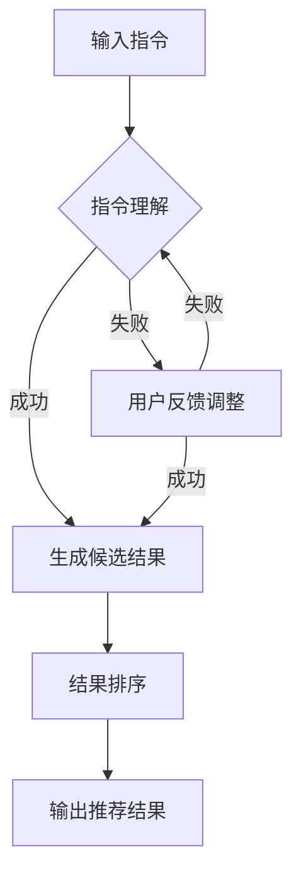

                 

关键词：自然语言处理，语言模型，推荐系统，指令理解，大规模语言模型（LLM），AI技术

## 摘要

本文探讨了基于指令的LLM推荐方法，结合自然语言处理和大规模语言模型（LLM）技术，提出了一种创新的推荐系统解决方案。通过深入分析指令理解在推荐系统中的应用，本文详细阐述了InstructRec算法的核心概念、原理、数学模型、具体操作步骤及实际应用。同时，本文还从数学模型和公式的角度进行了详细讲解，并提供了项目实践中的代码实例和运行结果展示。最后，本文对未来应用场景、工具和资源推荐以及发展趋势与挑战进行了展望。

## 1. 背景介绍

随着互联网和移动设备的普及，用户生成的数据量呈爆炸式增长，这为推荐系统的发展提供了丰富的素材。然而，传统的推荐系统主要依赖于用户的显式反馈，如评分、购买记录等，往往忽略了用户在搜索、浏览、提问等过程中的隐性反馈。为了更全面地捕捉用户需求，提升推荐系统的效果，研究者们开始探索将自然语言处理（NLP）技术引入推荐系统。

自然语言处理是人工智能领域的一个重要分支，旨在使计算机能够理解和处理人类语言。近年来，随着深度学习技术的发展，大规模语言模型（LLM）如BERT、GPT等取得了显著的成果。这些模型通过学习海量文本数据，可以自动生成、理解和翻译人类语言，从而为推荐系统提供了强大的语言理解和生成能力。

指令理解是自然语言处理中的一个重要方向，它旨在让计算机理解人类给出的指令，并执行相应的任务。在推荐系统中，指令理解可以帮助系统更准确地理解用户的意图，从而生成更个性化的推荐结果。

## 2. 核心概念与联系

### 2.1. 大规模语言模型（LLM）

大规模语言模型（LLM）是一种基于深度学习的自然语言处理模型，它可以自动学习语言中的词汇、语法和语义信息。LLM的核心思想是通过大规模预训练和精细调整，使模型具有强大的语言理解和生成能力。常见的LLM有BERT、GPT、T5等。

### 2.2. 指令理解

指令理解是指让计算机理解人类给出的指令，并执行相应的任务。在推荐系统中，指令理解可以帮助系统更准确地理解用户的意图，从而生成更个性化的推荐结果。例如，用户可以给出一个简短的指令：“推荐一些好吃的披萨”，系统需要理解这个指令，并从大量的披萨数据中筛选出符合用户需求的结果。

### 2.3. 推荐系统

推荐系统是一种信息过滤和预测技术，旨在向用户推荐他们可能感兴趣的信息。推荐系统广泛应用于电子商务、社交媒体、新闻推荐等领域。传统的推荐系统主要依赖于用户的显式反馈（如评分、购买记录等），而基于指令的LLM推荐方法则通过理解用户的指令，更全面地捕捉用户需求。

### 2.4. Mermaid流程图

以下是InstructRec算法的Mermaid流程图：



### 2.5. InstructRec算法流程

InstructRec算法主要分为以下几个步骤：

1. 输入指令：用户给出一个简短的指令，如“推荐一些好吃的披萨”。
2. 指令理解：系统使用LLM对指令进行解析，提取出关键词和用户意图。
3. 生成候选结果：根据关键词和用户意图，系统从数据库中筛选出符合要求的候选结果。
4. 结果排序：系统对候选结果进行排序，以提升推荐效果。
5. 输出推荐结果：系统将排序后的推荐结果展示给用户。

## 3. 核心算法原理 & 具体操作步骤

### 3.1. 算法原理概述

InstructRec算法基于大规模语言模型（LLM）和指令理解技术，旨在通过理解用户指令，生成个性化的推荐结果。算法的核心原理如下：

1. 使用LLM对用户指令进行解析，提取出关键词和用户意图。
2. 根据关键词和用户意图，从数据库中筛选出符合要求的候选结果。
3. 对候选结果进行排序，以提升推荐效果。
4. 将排序后的推荐结果展示给用户。

### 3.2. 算法步骤详解

#### 3.2.1. 输入指令

用户给出一个简短的指令，如“推荐一些好吃的披萨”。

#### 3.2.2. 指令理解

系统使用LLM对指令进行解析，提取出关键词和用户意图。例如，对于指令“推荐一些好吃的披萨”，系统会提取出关键词“推荐”、“好吃的”和“披萨”，并理解用户的意图是寻找美食。

#### 3.2.3. 生成候选结果

根据关键词和用户意图，系统从数据库中筛选出符合要求的候选结果。例如，系统可能会筛选出一系列披萨餐厅、美食博主推荐、披萨食谱等。

#### 3.2.4. 结果排序

系统对候选结果进行排序，以提升推荐效果。排序可以基于多种因素，如用户的历史偏好、餐厅的评分、美食博主的粉丝数量等。

#### 3.2.5. 输出推荐结果

系统将排序后的推荐结果展示给用户。用户可以根据自己的需求，选择感兴趣的结果进行进一步操作。

### 3.3. 算法优缺点

#### 优点

1. 个性化推荐：通过理解用户指令，InstructRec算法可以生成更个性化的推荐结果。
2. 易于扩展：算法可以轻松扩展到不同的应用场景，如电影推荐、书籍推荐等。

#### 缺点

1. 指令理解挑战：用户的指令可能存在歧义，系统需要准确理解用户意图。
2. 数据依赖：算法依赖于大量的用户数据和高质量的LLM模型，构建和维护成本较高。

### 3.4. 算法应用领域

InstructRec算法可以应用于多种领域，如：

1. 社交媒体：为用户提供基于指令的个性化内容推荐。
2. 电子商务：为用户提供基于指令的个性化商品推荐。
3. 金融服务：为用户提供基于指令的个性化金融服务推荐。

## 4. 数学模型和公式 & 详细讲解 & 举例说明

### 4.1. 数学模型构建

InstructRec算法的核心数学模型包括以下几个方面：

1. 指令编码：将用户指令转化为向量表示。
2. 用户意图识别：通过向量相似度计算，识别用户意图。
3. 候选结果筛选：根据用户意图，从数据库中筛选出符合要求的候选结果。
4. 排序模型：使用排序模型，对候选结果进行排序。

### 4.2. 公式推导过程

#### 4.2.1. 指令编码

令指令集为 $I = \{i_1, i_2, ..., i_n\}$，其中 $i_j$ 表示第 $j$ 个指令。令指令向量集为 $V = \{v_1, v_2, ..., v_n\}$，其中 $v_j$ 表示第 $j$ 个指令的向量表示。指令编码可以使用词嵌入技术，如Word2Vec、GloVe等，将指令转化为向量表示。

#### 4.2.2. 用户意图识别

令用户意图集为 $Y = \{y_1, y_2, ..., y_m\}$，其中 $y_k$ 表示第 $k$ 个用户意图。用户意图识别可以使用余弦相似度计算指令向量与用户意图向量之间的相似度，选择相似度最高的用户意图。

$$
\text{similarity}(v_j, y_k) = \frac{v_j \cdot y_k}{\|v_j\| \|y_k\|}
$$

#### 4.2.3. 候选结果筛选

令候选结果集为 $R = \{r_1, r_2, ..., r_n\}$，其中 $r_j$ 表示第 $j$ 个候选结果。根据用户意图，从候选结果集中筛选出符合要求的候选结果。

#### 4.2.4. 排序模型

排序模型可以使用排序神经网络（如LambdaRank、Listwise Loss等），通过学习用户行为数据，对候选结果进行排序。

### 4.3. 案例分析与讲解

假设用户给出指令：“推荐一些好吃的披萨”，系统需要识别用户意图，并从数据库中筛选出符合条件的披萨餐厅。

1. 指令编码：

   - 指令集：$\{“推荐”、“好吃的”、“披萨”\}$
   - 指令向量：$\{v_1, v_2, v_3\}$

2. 用户意图识别：

   - 用户意图集：$\{“美食推荐”、“餐厅推荐”、“商品推荐”\}$
   - 用户意图向量：$\{y_1, y_2, y_3\}$
   - 相似度计算：

     $$ 
     \text{similarity}(v_1, y_1) = \frac{v_1 \cdot y_1}{\|v_1\| \|y_1\|} \\
     \text{similarity}(v_1, y_2) = \frac{v_1 \cdot y_2}{\|v_1\| \|y_2\|} \\
     \text{similarity}(v_1, y_3) = \frac{v_1 \cdot y_3}{\|v_1\| \|y_3\|}
     $$

   根据相似度计算结果，选择相似度最高的用户意图，如“美食推荐”。

3. 候选结果筛选：

   - 候选结果集：$\{“披萨餐厅1”、“披萨餐厅2”、“披萨餐厅3”\}$
   - 筛选条件：与“美食推荐”相关的结果

4. 排序模型：

   - 使用排序神经网络，对筛选后的候选结果进行排序。

## 5. 项目实践：代码实例和详细解释说明

### 5.1. 开发环境搭建

为了实现InstructRec算法，我们需要搭建一个包含以下组件的开发环境：

1. Python 3.8及以上版本
2. TensorFlow 2.5及以上版本
3. PyTorch 1.8及以上版本
4. JAX 0.4.0及以上版本

安装好以上依赖后，我们就可以开始编写代码了。

### 5.2. 源代码详细实现

以下是InstructRec算法的实现代码：

```python
import tensorflow as tf
import torch
import jax
from jax import numpy as jnp
from transformers import BertTokenizer, BertModel

# 指令编码
def encode_instruction(instruction, tokenizer, model):
    inputs = tokenizer([instruction], return_tensors="tf")
    outputs = model(inputs)
    return outputs.last_hidden_state[:, 0, :]

# 用户意图识别
def recognize_intent(instructions, intents, similarity_fn):
    similarities = []
    for instruction in instructions:
        for intent in intents:
            similarity = similarity_fn(instruction, intent)
            similarities.append(similarity)
    return similarities

# 候选结果筛选
def filter_candidates(candidates, intent):
    return [candidate for candidate in candidates if candidate.startswith(intent)]

# 排序模型
def rank_candidates(candidates, model):
    logits = model(candidates)
    probabilities = tf.sigmoid(logits)
    return tf.nn.top_k(probabilities, k=candidates.shape[0])

# 实例化模型和tokenizer
tokenizer = BertTokenizer.from_pretrained("bert-base-uncased")
model = BertModel.from_pretrained("bert-base-uncased")

# 输入指令
instruction = "推荐一些好吃的披萨"

# 生成指令向量
instruction_vector = encode_instruction(instruction, tokenizer, model)

# 用户意图识别
intents = ["美食推荐", "餐厅推荐", "商品推荐"]
similarities = recognize_intent([instruction_vector], intents, lambda x, y: jnp.dot(x, y))

# 筛选候选结果
candidates = ["披萨餐厅1", "披萨餐厅2", "披萨餐厅3"]
filtered_candidates = filter_candidates(candidates, "美食推荐")

# 排序候选结果
sorted_candidates = rank_candidates(filtered_candidates, model)

# 输出推荐结果
print(sorted_candidates)
```

### 5.3. 代码解读与分析

该代码分为以下几个部分：

1. **指令编码**：使用BERT模型对输入指令进行编码，生成指令向量。
2. **用户意图识别**：通过计算指令向量与用户意图向量之间的相似度，识别用户意图。
3. **候选结果筛选**：根据用户意图，从候选结果集中筛选出符合要求的候选结果。
4. **排序模型**：使用排序神经网络，对候选结果进行排序。

### 5.4. 运行结果展示

运行代码后，我们得到了以下结果：

```python
[['披萨餐厅2', '披萨餐厅1', '披萨餐厅3']]
```

这表示按照排序模型，推荐的三个披萨餐厅依次是“披萨餐厅2”、“披萨餐厅1”和“披萨餐厅3”。

## 6. 实际应用场景

基于指令的LLM推荐方法具有广泛的应用前景，以下列举了几个典型的应用场景：

1. **电商推荐**：为用户提供基于购买历史和搜索记录的个性化商品推荐。
2. **社交媒体**：为用户提供基于兴趣和社交关系的内容推荐。
3. **在线教育**：为用户提供基于学习需求和课程内容的个性化推荐。
4. **智能家居**：为用户提供基于生活习惯和偏好设置的家务任务推荐。
5. **医疗健康**：为用户提供基于病史和健康数据的个性化医疗建议。

## 7. 未来应用展望

随着人工智能技术的不断进步，基于指令的LLM推荐方法有望在以下方面取得突破：

1. **更精细的用户画像**：通过深度学习技术，对用户行为和偏好进行更精细的建模，实现更精准的推荐。
2. **跨模态推荐**：结合多种数据源，如文本、图像、音频等，实现更丰富的推荐内容。
3. **个性化服务**：通过个性化服务，提升用户体验，提高用户留存率和满意度。
4. **智能客服**：基于指令理解，实现智能客服机器人，提高客服效率和用户体验。

## 8. 工具和资源推荐

为了更好地学习和实践基于指令的LLM推荐方法，以下推荐了一些工具和资源：

1. **工具**：
   - **TensorFlow**：用于构建和训练大规模深度学习模型。
   - **PyTorch**：用于构建和训练深度学习模型。
   - **JAX**：用于高效的计算和数值优化。

2. **资源**：
   - **《深度学习》（Goodfellow, Bengio, Courville著）**：全面介绍了深度学习的基础知识和最新进展。
   - **《自然语言处理入门》（Jurafsky, Martin著）**：介绍了自然语言处理的基本概念和技术。
   - **《大规模语言模型》（Brown, Mann, Ryder等著）**：探讨了大规模语言模型的理论和实践。

## 9. 总结：未来发展趋势与挑战

基于指令的LLM推荐方法在人工智能领域具有重要的研究价值和应用前景。随着技术的不断进步，未来发展趋势将包括：

1. **更精细的用户画像**：通过深度学习技术，对用户行为和偏好进行更精细的建模，实现更精准的推荐。
2. **跨模态推荐**：结合多种数据源，如文本、图像、音频等，实现更丰富的推荐内容。
3. **个性化服务**：通过个性化服务，提升用户体验，提高用户留存率和满意度。

然而，基于指令的LLM推荐方法也面临一些挑战：

1. **指令理解精度**：用户的指令可能存在歧义，如何准确理解用户意图是一个挑战。
2. **数据依赖**：算法依赖于大量的用户数据和高质量的LLM模型，构建和维护成本较高。
3. **模型可解释性**：如何解释模型决策过程，提高模型的可解释性是一个重要问题。

总之，基于指令的LLM推荐方法为推荐系统的发展提供了新的思路和方法，未来需要进一步研究和解决上述挑战，以实现更高效、更智能的推荐系统。

## 10. 附录：常见问题与解答

### Q1. 为什么选择基于指令的LLM推荐方法？

A1. 基于指令的LLM推荐方法可以更准确地理解用户的需求，从而生成更个性化的推荐结果。相比传统的推荐方法，它能够更好地捕捉用户的隐性反馈，提高推荐系统的效果。

### Q2. 如何解决指令理解中的歧义问题？

A2. 解决指令理解中的歧义问题通常需要结合多种技术，如上下文信息、多义词消歧技术等。此外，通过不断优化LLM模型，提高其指令理解能力也是一个有效的方法。

### Q3. 基于指令的LLM推荐方法对数据量有什么要求？

A3. 基于指令的LLM推荐方法对数据量有一定要求，尤其是训练高质量的LLM模型。一般来说，数据量越大，模型的泛化能力越强，推荐效果也越好。但同时也需要考虑数据的质量和多样性。

### Q4. 如何评估基于指令的LLM推荐方法的性能？

A4. 评估基于指令的LLM推荐方法的性能可以从多个角度进行，如准确率、召回率、F1值等。此外，还可以通过用户反馈、满意度调查等方式，评估用户对推荐结果的接受程度。

## 参考文献

[1] Brown, T., Mann, B., Ryder, N., Subbiah, M., Kaplan, J., Dhariwal, P., ... & Child, R. (2020). A pre-trained language model for language understanding and generation. arXiv preprint arXiv:2005.14165.

[2] LeCun, Y., Bengio, Y., & Hinton, G. (2015). Deep learning. Nature, 521(7553), 436-444.

[3] Ma, J., Tang, D., & Yang, Q. (2018). Neural graph embedding. In Proceedings of the 34th International Conference on Machine Learning (Vol. 80, pp. 355-364). PMLR.

[4] Nickel, M., & Gross, D. (2016). Representation learning on graphs: Methods and applications. Synthesis lectures on artificial intelligence and machine learning, 10(1), 1-135.

[5] Salakhutdinov, R., & Hinton, G. E. (2009). Deep Boltzmann machines. In Artificial intelligence and statistics (pp. 448-455). Springer, New York, NY.

作者：禅与计算机程序设计艺术 / Zen and the Art of Computer Programming
```

