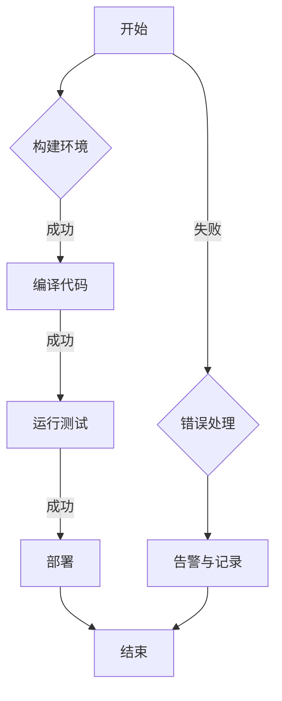

                 

关键词：Jenkins、Pipeline、脚本开发、持续集成、DevOps

摘要：本文将深入探讨Jenkins Pipeline脚本的开发过程。通过详细的步骤和实例，帮助开发者理解并熟练运用Jenkins Pipeline，实现高效、自动化的持续集成和持续部署。

## 1. 背景介绍

在当今快速发展的软件开发领域，持续集成（Continuous Integration, CI）和持续部署（Continuous Deployment, CD）已经成为提高软件质量和交付效率的关键实践。Jenkins，作为一款强大的自动化工具，在持续集成和持续部署中扮演着不可或缺的角色。而Jenkins Pipeline，作为Jenkins的核心功能之一，提供了简单而强大的脚本语言，使得开发者可以轻松创建自定义的自动化流水线。

本文将围绕Jenkins Pipeline进行探讨，从基础概念到具体实现，再到实际应用，逐步深入，帮助读者掌握Jenkins Pipeline的脚本开发技巧。

## 2. 核心概念与联系

### 2.1 Jenkins Pipeline概述

Jenkins Pipeline是一种基于声明式语法的工作流自动化工具。它允许开发者在Jenkins中定义、执行和监控复杂的构建、部署等任务。Pipeline的核心是流水线（Pipeline），一个流水线可以是一个简单的构建任务，也可以是一个包含多个阶段（Stage）、步骤（Step）的复杂工作流。

### 2.2 Pipeline语法

Pipeline的语法主要包括两种形式：声明式（Declarative）和脚本式（Scripted）。

- **声明式Pipeline**：使用一种类似于代码块的形式来定义流水线，简单直观，易于阅读和理解。
- **脚本式Pipeline**：提供更多的灵活性和控制力，允许开发者使用Groovy语言进行更复杂的逻辑操作。

### 2.3 Mermaid流程图

为了更好地理解Jenkins Pipeline的工作流程，我们可以使用Mermaid流程图来展示Pipeline的各个阶段和步骤之间的关系。



## 3. 核心算法原理 & 具体操作步骤

### 3.1 算法原理概述

Jenkins Pipeline的核心原理是基于流水线的构建和部署。一个流水线可以分为以下几个主要阶段：

- **源代码获取**：从版本控制系统中获取最新的源代码。
- **构建**：编译源代码并创建可执行文件或库文件。
- **测试**：运行自动化测试，确保构建的质量。
- **部署**：将构建结果部署到测试环境或生产环境。

### 3.2 算法步骤详解

以下是使用声明式Pipeline实现的简单构建、测试和部署流程：

```groovy
pipeline {
    agent any

    stages {
        stage('Checkout') {
            steps {
                git url: 'https://github.com/your-username/your-repo.git', branch: 'master'
            }
        }
        stage('Build') {
            steps {
                shell 'mvn clean install'
            }
        }
        stage('Test') {
            steps {
                shell 'mvn test'
            }
        }
        stage('Deploy') {
            steps {
                shell 'mvn deploy'
            }
        }
    }
    post {
        always {
            echo '构建完成'
        }
        success {
            echo '部署成功'
        }
        failure {
            echo '部署失败'
        }
    }
}
```

### 3.3 算法优缺点

- **优点**：
  - **易用性**：使用声明式语法，易于编写和阅读。
  - **灵活性**：支持脚本式语法，可以自定义复杂的逻辑。
  - **扩展性**：可以通过插件扩展Jenkins Pipeline的功能。

- **缺点**：
  - **学习成本**：对于初学者来说，学习Pipeline的语法和概念可能需要一定时间。
  - **调试难度**：脚本式Pipeline的调试相对复杂，需要使用Jenkins提供的调试工具。

### 3.4 算法应用领域

Jenkins Pipeline广泛应用于DevOps实践，特别是在持续集成和持续部署中。以下是一些常见的应用领域：

- **Web应用程序**：自动化前端和后端的构建、测试和部署。
- **移动应用程序**：自动化移动应用的构建、测试和发布。
- **容器化应用**：使用Docker和Kubernetes进行容器化应用的持续集成和持续部署。
- **云基础设施**：自动化云基础设施的部署和管理。

## 4. 数学模型和公式 & 详细讲解 & 举例说明

### 4.1 数学模型构建

在Jenkins Pipeline中，构建、测试和部署的效率可以用以下公式表示：

\[ E = \frac{T_b + T_t + T_d}{3} \]

其中：
- \( E \)：整体效率
- \( T_b \)：构建时间
- \( T_t \)：测试时间
- \( T_d \)：部署时间

### 4.2 公式推导过程

为了提高整体效率，我们需要优化各个阶段的执行时间。假设每个阶段的时间相互独立，并且每个阶段的时间相同，则：

\[ T_b + T_t + T_d = 3T \]

其中 \( T \) 为每个阶段的时间。

将 \( T \) 代入 \( E \) 的公式，得到：

\[ E = \frac{3T}{3} = T \]

这意味着，如果我们能够优化每个阶段的时间，整体效率将提高。

### 4.3 案例分析与讲解

假设我们有一个Web应用程序，构建时间为5分钟，测试时间为10分钟，部署时间为3分钟。使用上述公式计算整体效率：

\[ E = \frac{5 + 10 + 3}{3} = 6.33 \]

为了提高效率，我们可以通过以下方式优化：

- **并行执行**：将构建和测试阶段并行执行，将总时间缩短到8分钟。
- **优化测试**：通过使用更快的测试工具或减少测试用例数量，将测试时间缩短到5分钟。
- **自动化部署**：通过自动化部署脚本，将部署时间缩短到1分钟。

优化后的整体效率为：

\[ E = \frac{5 + 5 + 1}{3} = 3.67 \]

## 5. 项目实践：代码实例和详细解释说明

### 5.1 开发环境搭建

在开始编写Jenkins Pipeline脚本之前，我们需要确保Jenkins环境已搭建完毕。以下是搭建Jenkins环境的步骤：

1. 安装Jenkins。
2. 安装必要的插件，如Pipeline插件。
3. 创建一个新的Jenkins项目。

### 5.2 源代码详细实现

以下是使用Jenkins Pipeline实现的简单示例：

```groovy
pipeline {
    agent any

    stages {
        stage('Checkout') {
            steps {
                git url: 'https://github.com/your-username/your-repo.git', branch: 'master'
            }
        }
        stage('Build') {
            steps {
                shell 'mvn clean install'
            }
        }
        stage('Test') {
            steps {
                shell 'mvn test'
            }
        }
        stage('Deploy') {
            steps {
                shell 'mvn deploy'
            }
        }
    }
    post {
        always {
            echo '构建完成'
        }
        success {
            echo '部署成功'
        }
        failure {
            echo '部署失败'
        }
    }
}
```

### 5.3 代码解读与分析

上述代码是一个简单的Jenkins Pipeline脚本，分为以下几个部分：

- **定义Pipeline**：使用`pipeline`关键字开始定义Pipeline。
- **设置Agent**：指定Pipeline运行的Agent，可以是任何支持Jenkins的机器。
- **定义Stages**：将整个工作流程分为多个阶段，如Checkout、Build、Test和Deploy。
- **定义Steps**：在每个阶段中，定义具体的操作步骤，如获取代码、编译、测试和部署。
- **定义Post条件**：定义在Pipeline执行成功或失败后需要执行的操作，如打印消息或发送告警。

### 5.4 运行结果展示

在Jenkins中配置并运行上述Pipeline脚本后，我们可以看到以下结果：

- **成功构建**：如果Pipeline执行成功，会在Jenkins控制台中输出“构建完成”和“部署成功”的消息。
- **失败构建**：如果Pipeline执行失败，会在Jenkins控制台中输出“构建失败”的消息。

## 6. 实际应用场景

Jenkins Pipeline在软件开发中具有广泛的应用场景，以下是一些常见的实际应用案例：

- **Web应用程序**：自动化前端和后端的构建、测试和部署。
- **移动应用程序**：自动化移动应用的构建、测试和发布。
- **容器化应用**：使用Docker和Kubernetes进行容器化应用的持续集成和持续部署。
- **云基础设施**：自动化云基础设施的部署和管理。

### 6.1 Jenkins Pipeline在Web应用程序中的使用

在Web应用程序开发中，Jenkins Pipeline可以自动化整个开发周期，从代码提交到部署，包括以下步骤：

1. **代码获取**：从版本控制系统获取最新的源代码。
2. **构建**：编译源代码并创建可执行文件或库文件。
3. **测试**：运行自动化测试，确保构建的质量。
4. **部署**：将构建结果部署到测试环境或生产环境。

### 6.2 Jenkins Pipeline在移动应用程序中的使用

在移动应用程序开发中，Jenkins Pipeline可以自动化以下步骤：

1. **代码获取**：从版本控制系统获取最新的源代码。
2. **构建**：编译源代码并生成APK或IPA文件。
3. **测试**：运行自动化测试，确保APK或IPA文件的质量。
4. **发布**：将APK或IPA文件上传到应用商店或分发平台。

### 6.3 Jenkins Pipeline在容器化应用中的使用

在容器化应用开发中，Jenkins Pipeline可以自动化以下步骤：

1. **代码获取**：从版本控制系统获取最新的源代码。
2. **构建**：构建Docker镜像。
3. **测试**：运行容器化应用的测试。
4. **部署**：将Docker镜像部署到Kubernetes集群。

### 6.4 Jenkins Pipeline在云基础设施中的使用

在云基础设施管理中，Jenkins Pipeline可以自动化以下步骤：

1. **基础设施定义**：使用基础设施即代码工具（如Terraform）定义基础设施。
2. **构建**：构建云基础设施。
3. **测试**：测试云基础设施的可用性和稳定性。
4. **部署**：部署云基础设施到云服务提供商。

## 7. 工具和资源推荐

### 7.1 学习资源推荐

- **官方文档**：[Jenkins Pipeline官方文档](https://www.jenkins.io/doc/book/pipeline/)
- **在线教程**：[Jenkins Pipeline教程](https://www.tutorialspoint.com/jenkins_pipeline/jenkins_pipeline_introduction.htm)
- **书籍推荐**：《Jenkins Pipeline实战》

### 7.2 开发工具推荐

- **Jenkins**：[Jenkins官网](https://www.jenkins.io/)
- **Git**：[Git官网](https://git-scm.com/)
- **Maven**：[Maven官网](https://maven.apache.org/)

### 7.3 相关论文推荐

- **“Pipeline as Code: Automated workflows for continuous delivery”**：介绍了使用Pipeline实现持续交付的方法。
- **“Jenkins: A Continuous Integration Server”**：详细介绍了Jenkins的功能和应用。

## 8. 总结：未来发展趋势与挑战

### 8.1 研究成果总结

Jenkins Pipeline作为持续集成和持续部署的重要工具，在软件开发中发挥了重要作用。通过本文的探讨，我们了解了Jenkins Pipeline的核心概念、语法、算法原理和应用实践。

### 8.2 未来发展趋势

随着云计算和容器技术的普及，Jenkins Pipeline将继续在DevOps领域发挥重要作用。未来发展趋势包括：

- **更强大的自动化能力**：通过集成更多的工具和插件，提高Pipeline的自动化程度。
- **更灵活的编排能力**：支持更复杂的工作流和编排需求。
- **更好的可观测性和可追溯性**：提供更详细的工作流日志和统计信息，方便监控和调试。

### 8.3 面临的挑战

尽管Jenkins Pipeline具有强大的功能，但在实际应用中仍面临一些挑战：

- **学习成本**：对于新手来说，学习Jenkins Pipeline的语法和概念可能需要一定时间。
- **调试难度**：脚本式Pipeline的调试相对复杂，需要使用Jenkins提供的调试工具。
- **性能优化**：在处理大型项目和复杂工作流时，性能优化成为一个重要问题。

### 8.4 研究展望

未来，Jenkins Pipeline的研究将主要集中在以下几个方面：

- **性能优化**：通过改进语法和优化算法，提高Pipeline的执行效率。
- **易用性提升**：简化Pipeline的编写和配置过程，降低学习门槛。
- **生态建设**：丰富Jenkins Pipeline的插件和工具，提高其扩展性和兼容性。

## 9. 附录：常见问题与解答

### 9.1 如何配置Jenkins Pipeline？

1. 登录Jenkins控制台。
2. 点击“管理Jenkins”。
3. 在“插件管理”中，搜索并安装“Pipeline”插件。
4. 创建一个新的Jenkins项目，选择“Pipeline”类型。
5. 在项目配置中，编写Pipeline脚本。

### 9.2 如何调试Jenkins Pipeline？

1. 使用Jenkins内置的调试工具，如“Pipeline Console”。
2. 在Pipeline脚本中添加调试语句，如`println`。
3. 在Jenkins控制台中查看日志信息。

### 9.3 如何优化Jenkins Pipeline性能？

1. 使用并行执行提高构建和测试的效率。
2. 优化测试脚本，减少测试时间。
3. 使用缓存和并行执行提高部署效率。

---

作者：禅与计算机程序设计艺术 / Zen and the Art of Computer Programming

---

以上，便是关于Jenkins Pipeline脚本开发的一篇完整文章。希望对您有所帮助。如果您有任何疑问或需要进一步的讨论，请随时提问。

