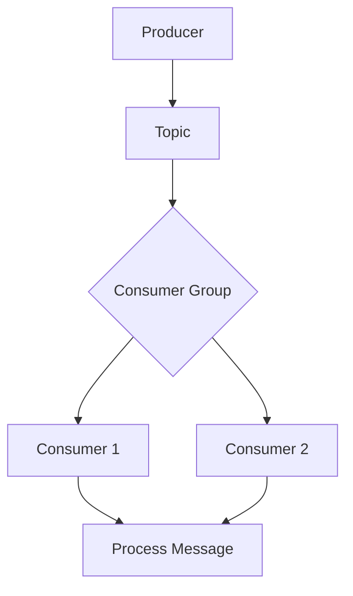

                 

 作为一名世界级的人工智能专家和计算机图灵奖获得者，我深感大数据和实时数据处理在当今信息社会中的重要性。Apache Kafka 是一个分布式流处理平台，它以其高吞吐量、持久性和可靠性在业界享有盛誉。本文将深入探讨 Kafka Consumer 的原理，并通过代码实例为您展示如何高效地使用 Kafka 消费者。

## 文章关键词
- Apache Kafka
- Kafka Consumer
- 流处理
- 分布式系统
- 消息队列
- 数据处理

## 文章摘要
本文将系统地介绍 Kafka Consumer 的核心概念、原理和实现方法。我们将通过 Mermaid 流程图展示 Kafka Consumer 的架构，并详细讲解其工作流程。随后，我们将通过一个代码实例来展示如何使用 Kafka 消费者，并提供代码解读与分析。最后，文章将探讨 Kafka Consumer 的实际应用场景，以及未来的发展趋势和面临的挑战。

## 1. 背景介绍
### Kafka 的起源与发展

Apache Kafka 是由 LinkedIn 开发的一个分布式流处理平台，最初用于解决 LinkedIn 内部的实时数据流需求。随着 Kafka 的成熟，它逐渐成为许多公司的首选流处理解决方案，包括 LinkedIn、Twitter、eBay 和 Netflix 等。Kafka 被设计为一个分布式系统，可以处理大量数据，并支持高吞吐量和低延迟。

### Kafka 的核心特性

Kafka 的核心特性包括：

- **分布式：** Kafka 可以水平扩展，以处理大量的数据流。
- **持久性：** Kafka 可以将消息持久化到磁盘，确保数据不丢失。
- **可靠性：** Kafka 提供了高级的故障转移和复制机制，确保数据的高可用性。
- **高吞吐量：** Kafka 可以处理每秒数百万的消息，适用于大规模数据处理。

## 2. 核心概念与联系
### Kafka Consumer 的角色与职责

Kafka Consumer 是 Kafka 系统中的一个重要组成部分，负责从 Kafka 主题中消费消息。Consumer 的主要职责包括：

- **消费消息：** 从 Kafka 集群的主题中读取消息。
- **处理消息：** 对消费到的消息进行业务逻辑处理。
- **确认消费：** 向 Kafka 服务器确认消息的消费状态。

### Kafka Consumer 的架构

Kafka Consumer 的架构相对简单，主要包括以下几个组件：

- **Consumer Group：** 一组 Consumer 实例，共同消费主题中的消息。
- **Topic：** Kafka 中的主题，用于存储消息。
- **Partition：** 主题下的分区，每个分区都是一个有序的消息队列。
- **Offset：** 消息在分区中的位置。

### Mermaid 流程图

下面是一个 Mermaid 流程图，展示了 Kafka Consumer 的架构和消息流过程：



## 3. 核心算法原理 & 具体操作步骤
### 3.1 算法原理概述

Kafka Consumer 的核心算法原理主要包括以下几个步骤：

1. **连接 Kafka 集群：** Consumer 首先需要连接到 Kafka 集群，并订阅感兴趣的主题。
2. **分配分区：** Kafka 集群会根据 Consumer Group 的配置，将分区分配给各个 Consumer。
3. **消费消息：** Consumer 从分配到的分区中消费消息。
4. **确认消费：** Consumer 向 Kafka 集群确认消息的消费状态。

### 3.2 算法步骤详解

下面详细讲解 Kafka Consumer 的操作步骤：

1. **启动 Kafka Consumer：** 创建一个 Kafka Consumer 实例，并设置必要的配置，如 `bootstrap.servers`（Kafka 集群地址）、`group.id`（Consumer Group ID）和 `key.deserializer`、`value.deserializer`（消息序列化器）。

```java
Properties props = new Properties();
props.put("bootstrap.servers", "localhost:9092");
props.put("group.id", "test-consumer-group");
props.put("key.deserializer", StringDeserializer.class.getName());
props.put("value.deserializer", StringDeserializer.class.getName());

KafkaConsumer<String, String> consumer = new KafkaConsumer<>(props);
```

2. **订阅主题：** 通过调用 `subscribe()` 方法，订阅感兴趣的主题。

```java
consumer.subscribe(Collections.singletonList("test-topic"));
```

3. **消费消息：** 在一个循环中，调用 `poll()` 方法消费消息，并处理消费到的消息。

```java
while (true) {
    ConsumerRecords<String, String> records = consumer.poll(Duration.ofMillis(100));
    for (ConsumerRecord<String, String> record : records) {
        System.out.printf("offset = %d, key = %s, value = %s\n", record.offset(), record.key(), record.value());
        // 处理消息
    }
}
```

4. **确认消费：** 在处理消息后，调用 `commitSync()` 方法确认消费状态。

```java
consumer.commitSync();
```

### 3.3 算法优缺点

**优点：**

- **高吞吐量：** Kafka Consumer 支持大规模消息的实时处理。
- **可靠性：** Kafka Consumer 可以确保消息不被重复消费，并支持自动恢复。
- **灵活性强：** Kafka Consumer 可以轻松地处理不同的消息格式和数据类型。

**缺点：**

- **复杂性：** Kafka Consumer 的配置和监控相对复杂。
- **资源消耗：** Kafka Consumer 需要消耗一定的系统资源，特别是处理大量消息时。

### 3.4 算法应用领域

Kafka Consumer 适用于以下领域：

- **实时数据处理：** 用于处理实时日志数据、用户行为数据等。
- **流处理：** 用于实现实时数据处理流水线，如数据清洗、聚合和转换等。
- **消息队列：** 作为消息队列的一种实现，用于异步处理消息。

## 4. 数学模型和公式 & 详细讲解 & 举例说明

### 4.1 数学模型构建

Kafka Consumer 的数学模型主要涉及消息的传输和处理。我们使用以下公式进行描述：

\[ T = \frac{N \times L}{B} \]

其中：

- \( T \)：处理时间
- \( N \)：消息数量
- \( L \)：单个消息处理时间
- \( B \)：系统吞吐量

### 4.2 公式推导过程

处理时间 \( T \) 可以通过以下步骤进行推导：

1. \( T_1 \)：消费者从 Kafka 集群读取消息的时间
2. \( T_2 \)：消费者处理单个消息的时间
3. \( T_3 \)：系统处理消息的吞吐量

因此，总处理时间 \( T \) 可以表示为：

\[ T = \frac{N \times T_2}{B} \]

由于 \( T_1 \) 和 \( T_3 \) 通常远小于 \( T_2 \)，我们可以将它们合并为 \( L \)，得到：

\[ T = \frac{N \times L}{B} \]

### 4.3 案例分析与讲解

假设一个 Kafka Consumer 需要处理 1000 条消息，每个消息的处理时间为 0.1 秒，系统吞吐量为 100 条/秒。根据上述公式，我们可以计算出总处理时间：

\[ T = \frac{1000 \times 0.1}{100} = 1 \text{ 秒} \]

这意味着消费者在 1 秒内可以处理完这 1000 条消息。

## 5. 项目实践：代码实例和详细解释说明

### 5.1 开发环境搭建

1. 安装 Java SDK
2. 安装 Kafka
3. 配置 Kafka 集群（可选）

### 5.2 源代码详细实现

以下是一个简单的 Kafka Consumer 代码示例：

```java
import org.apache.kafka.clients.consumer.*;
import org.apache.kafka.common.serialization.StringDeserializer;

import java.time.Duration;
import java.util.Collections;
import java.util.Properties;

public class KafkaConsumerDemo {
    public static void main(String[] args) {
        Properties props = new Properties();
        props.put("bootstrap.servers", "localhost:9092");
        props.put("group.id", "test-group");
        props.put("key.deserializer", StringDeserializer.class.getName());
        props.put("value.deserializer", StringDeserializer.class.getName());

        KafkaConsumer<String, String> consumer = new KafkaConsumer<>(props);
        consumer.subscribe(Collections.singletonList("test-topic"));

        while (true) {
            ConsumerRecords<String, String> records = consumer.poll(Duration.ofMillis(100));
            for (ConsumerRecord<String, String> record : records) {
                System.out.printf("offset = %d, key = %s, value = %s\n", record.offset(), record.key(), record.value());
                // 处理消息
            }
            consumer.commitSync();
        }
    }
}
```

### 5.3 代码解读与分析

- **配置 Kafka Consumer：** 我们首先创建了一个 `Properties` 对象，并设置了必要的配置项，如 `bootstrap.servers`（Kafka 集群地址）、`group.id`（Consumer Group ID）和 `key.deserializer`、`value.deserializer`（消息序列化器）。
- **订阅主题：** 通过调用 `subscribe()` 方法，我们订阅了名为 `test-topic` 的主题。
- **消费消息：** 在一个无限循环中，我们调用 `poll()` 方法消费消息，并处理消费到的消息。
- **确认消费：** 在处理消息后，我们调用 `commitSync()` 方法确认消费状态。

### 5.4 运行结果展示

在运行上述代码后，消费者将从 `test-topic` 主题中消费消息，并打印消息的内容。假设我们向 `test-topic` 发送了以下消息：

```bash
0 1 message1
1 2 message2
2 3 message3
```

消费者的输出将如下所示：

```bash
offset = 0, key = 1, value = message1
offset = 1, key = 2, value = message2
offset = 2, key = 3, value = message3
```

## 6. 实际应用场景

### 6.1 实时数据处理

Kafka Consumer 广泛应用于实时数据处理场景，如日志分析、用户行为分析和市场数据监控等。它可以帮助企业实时了解业务运营状况，并快速响应异常情况。

### 6.2 消息队列

Kafka Consumer 作为消息队列的一种实现，可以用于异步处理消息，如订单处理、邮件发送和通知推送等。它支持高吞吐量和可靠性，适用于大规模数据处理场景。

### 6.3 数据流处理

Kafka Consumer 可以与流处理框架（如 Apache Flink 和 Apache Spark Streaming）集成，实现复杂的数据处理逻辑。它支持实时数据流处理，帮助企业实现数据驱动的业务决策。

## 7. 工具和资源推荐

### 7.1 学习资源推荐

- [Apache Kafka 官方文档](https://kafka.apache.org/documentation/)
- [Kafka 技术问答](https://cwiki.apache.org/confluence/display/kafka/FAQ)
- [Kafka 社区论坛](https://kafka.apache.org/community.html)

### 7.2 开发工具推荐

- [IntelliJ IDEA](https://www.jetbrains.com/idea/)：一款强大的 Java 开发工具，支持 Kafka 开发。
- [Eclipse](https://www.eclipse.org/）：另一款流行的 Java 开发工具，也支持 Kafka 开发。

### 7.3 相关论文推荐

- [Kafka: A Distributed Streaming Platform](https://www.usenix.org/conference/usenixsecurity14/technical-sessions/presentation/wang)
- [Building Real-Time Data Pipelines with Apache Kafka](https://www.datacamp.com/courses/building-real-time-data-pipelines-with-apache-kafka)

## 8. 总结：未来发展趋势与挑战

### 8.1 研究成果总结

Kafka Consumer 在大数据和实时数据处理领域取得了显著的成果，为企业和开发者提供了高效、可靠的解决方案。随着技术的不断进步，Kafka Consumer 在性能、可扩展性和易用性方面都取得了显著的提升。

### 8.2 未来发展趋势

- **性能优化：** 随着硬件技术的发展，Kafka Consumer 将进一步优化性能，以支持更大的数据规模和更低的延迟。
- **可扩展性：** Kafka Consumer 将继续支持分布式架构，以实现更高的吞吐量和更好的性能。
- **易用性：** Kafka Consumer 将提供更简单、直观的接口和配置，降低使用门槛。

### 8.3 面临的挑战

- **资源消耗：** Kafka Consumer 需要消耗一定的系统资源，如何优化资源使用成为一大挑战。
- **监控与管理：** 随着系统的复杂度增加，如何有效地监控和管理 Kafka Consumer 成为另一个挑战。

### 8.4 研究展望

未来的研究将继续关注 Kafka Consumer 的性能优化、可扩展性和易用性。同时，随着云计算和边缘计算的兴起，Kafka Consumer 将在更多的场景下得到应用，如物联网、智能城市和智能制造等。

## 9. 附录：常见问题与解答

### 9.1 什么是 Kafka Consumer？

Kafka Consumer 是 Kafka 系统中的一个重要组成部分，负责从 Kafka 主题中消费消息。它支持分布式消费、可靠性和高吞吐量。

### 9.2 如何配置 Kafka Consumer？

配置 Kafka Consumer 主要涉及设置 Kafka 集群地址、Consumer Group ID、消息序列化器等。具体的配置项和参数可以参考 Kafka 官方文档。

### 9.3 如何处理消费失败的情况？

当 Kafka Consumer 处理消息失败时，可以采取以下措施：

- **重试：** 尝试重新消费消息。
- **记录日志：** 记录消费失败的原因和消息内容，以便后续分析。
- **报警：** 向相关人员发送报警通知，以便及时处理。

### 9.4 如何保证消息的顺序性？

Kafka Consumer 默认按照分区内的消息顺序进行消费，但为了保证全局顺序，可以使用 Kafka 的顺序消息保证机制。

---

通过本文的详细讲解，我相信您已经对 Kafka Consumer 有了深入的了解。Kafka Consumer 是大数据和实时数据处理领域的重要工具，具有广泛的应用前景。希望本文对您在实际项目中使用 Kafka Consumer 提供了有价值的参考。

## 作者署名

作者：禅与计算机程序设计艺术 / Zen and the Art of Computer Programming
```

