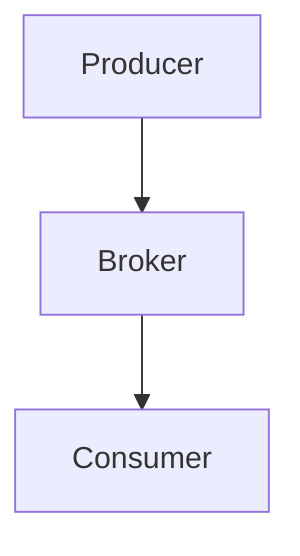
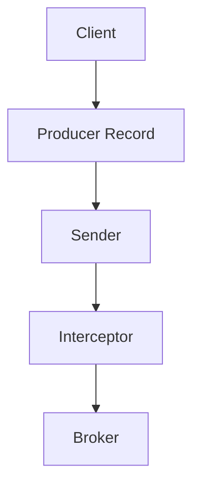

                 

 **关键词：** Kafka，Producer，分布式系统，消息队列，性能优化，代码实例，原理讲解。

**摘要：** 本文将深入探讨Kafka Producer的原理，包括其架构设计、工作流程、性能优化策略等，并通过具体代码实例展示如何使用Kafka Producer进行数据生产。此外，还将探讨Kafka Producer在实际应用中的场景及其未来发展趋势。

## 1. 背景介绍

Kafka是一种分布式流处理平台和消息队列系统，由LinkedIn开发，目前由Apache Software Foundation维护。它最初被设计用于处理LinkedIn的网站点击流数据，但由于其高效、可靠和可扩展的特性，很快被许多公司采用。

Kafka Producer是Kafka系统中的核心组件之一，负责将数据推送到Kafka集群。Producer的设计目标是高效、可靠地将数据发送到Kafka topic，并且能够支持高吞吐量和低延迟。

本文将围绕Kafka Producer展开，首先介绍其基本概念和架构设计，然后深入探讨其工作流程、性能优化策略，并通过代码实例展示其使用方法。

## 2. 核心概念与联系

### 2.1 Kafka架构

Kafka系统由多个组件构成，其中Producer、Broker和Consumer是最核心的三个组件。以下是一个简化的Kafka架构图：



- **Producer**：负责将数据推送到Kafka topic。
- **Broker**：负责存储和管理topic分区，并向Producer和Consumer提供服务。
- **Consumer**：从Kafka topic中读取数据。

### 2.2 Producer核心概念

- **Topic**：Kafka中的消息分类，类似于数据库中的表。
- **Partition**：Topic的分区，每个分区是顺序存储的消息集合，可以提高并发性和可靠性。
- **Offset**：消息在分区中的唯一标识，用于标记消费者的消费位置。
- **Key**：消息的唯一标识，用于保证消息的顺序性。
- **Value**：消息的具体数据内容。

### 2.3 Producer架构设计

Kafka Producer主要由以下几个部分组成：

- **Client**：负责发送数据到Kafka集群。
- **Producer Record**：包含消息的key、value和其他元数据。
- **Sender**：负责将Producer Record发送到Kafka集群。
- **Interceptor**：用于在发送消息前或后对消息进行拦截和处理。

以下是一个简化的Kafka Producer架构图：



## 3. 核心算法原理 & 具体操作步骤

### 3.1 算法原理概述

Kafka Producer的核心算法原理是分布式数据流处理。它通过将数据流分为多个批次，并将每个批次的数据发送到不同的分区，从而实现高吞吐量和低延迟。

### 3.2 算法步骤详解

- **初始化Client**：首先需要初始化Kafka Producer Client，配置连接信息、序列化器等。
- **构建Producer Record**：构建要发送的消息，包括key、value和其他元数据。
- **发送消息**：将Producer Record发送到Sender，Sender负责将消息发送到Kafka集群。
- **处理响应**：处理Kafka集群的响应，包括发送成功、发送失败等。
- **重试机制**：在发送失败时，根据策略进行重试。

### 3.3 算法优缺点

- **优点**：支持高吞吐量和低延迟，易于扩展和部署。
- **缺点**：可能存在消息丢失的风险，需要实现重试和幂等性。

### 3.4 算法应用领域

Kafka Producer主要应用于实时数据处理、日志收集、流处理等领域。

## 4. 数学模型和公式 & 详细讲解 & 举例说明

### 4.1 数学模型构建

Kafka Producer的数学模型主要涉及概率论和统计学。以下是一个简化的数学模型：

- **消息发送概率**：$P(\text{发送成功}) = 1 - P(\text{发送失败})$
- **发送失败概率**：$P(\text{发送失败}) = P(\text{网络错误}) + P(\text{服务器错误})$

### 4.2 公式推导过程

假设网络错误概率为$p_1$，服务器错误概率为$p_2$，则有：

- **发送失败概率**：$P(\text{发送失败}) = p_1 + p_2$
- **发送成功概率**：$P(\text{发送成功}) = 1 - (p_1 + p_2)$

### 4.3 案例分析与讲解

假设网络错误概率为$p_1 = 0.01$，服务器错误概率为$p_2 = 0.02$，则：

- **发送失败概率**：$P(\text{发送失败}) = 0.01 + 0.02 = 0.03$
- **发送成功概率**：$P(\text{发送成功}) = 1 - 0.03 = 0.97$

这意味着，每次发送消息时，有97%的概率发送成功，3%的概率发送失败。

## 5. 项目实践：代码实例和详细解释说明

### 5.1 开发环境搭建

为了演示Kafka Producer的使用，我们需要先搭建一个简单的开发环境。以下是一个基于Docker的简单示例：

1. 安装Docker。
2. 下载并运行Kafka镜像：`docker pull bitnami/kafka`。
3. 启动Kafka容器：`docker run -d --name kafka -p 9092:9092 bitnami/kafka`。

### 5.2 源代码详细实现

以下是一个简单的Java代码实例，用于演示如何使用Kafka Producer发送消息：

```java
import org.apache.kafka.clients.producer.*;
import java.util.Properties;

public class KafkaProducerExample {
    public static void main(String[] args) {
        // 创建Kafka Producer配置
        Properties props = new Properties();
        props.put("bootstrap.servers", "localhost:9092");
        props.put("key.serializer", "org.apache.kafka.common.serialization.StringSerializer");
        props.put("value.serializer", "org.apache.kafka.common.serialization.StringSerializer");

        // 创建Kafka Producer
        KafkaProducer<String, String> producer = new KafkaProducer<>(props);

        // 发送消息
        for (int i = 0; i < 10; i++) {
            String key = "key-" + i;
            String value = "value-" + i;
            producer.send(new ProducerRecord<>("test-topic", key, value));
        }

        // 关闭Kafka Producer
        producer.close();
    }
}
```

### 5.3 代码解读与分析

1. **配置Kafka Producer**：通过Properties对象配置Kafka Producer，包括Kafka集群地址、序列化器等。
2. **创建Kafka Producer**：使用配置创建Kafka Producer实例。
3. **发送消息**：使用ProducerRecord对象构建要发送的消息，并调用send方法发送。
4. **关闭Kafka Producer**：在程序结束时关闭Kafka Producer，释放资源。

### 5.4 运行结果展示

运行上述Java代码，将发送10条消息到Kafka集群的`test-topic`主题。可以使用Kafka命令行工具查看发送的消息：

```bash
kafka-console-producer --broker-list localhost:9092 --topic test-topic
```

## 6. 实际应用场景

### 6.1 实时数据处理

Kafka Producer广泛应用于实时数据处理场景，例如网站点击流数据、社交媒体数据等。通过Kafka Producer，可以高效地将海量数据实时推送至Kafka集群，实现实时数据分析和处理。

### 6.2 日志收集

Kafka Producer可以用于收集各种日志数据，例如Web日志、系统日志等。通过Kafka Producer，可以将日志数据实时推送至Kafka集群，方便后续的数据分析和处理。

### 6.3 流处理

Kafka Producer是流处理系统中的重要组件。例如，Apache Flink和Apache Storm等流处理框架可以使用Kafka Producer接收实时数据流，进行实时计算和分析。

## 7. 工具和资源推荐

### 7.1 学习资源推荐

- 《Kafka权威指南》
- 《深入理解Kafka》
- Kafka官方文档：[https://kafka.apache.org/documentation/]

### 7.2 开发工具推荐

- IntelliJ IDEA
- Eclipse
- Maven

### 7.3 相关论文推荐

- "Kafka: A Distributed Streaming Platform"
- "Kafka: A Pr

