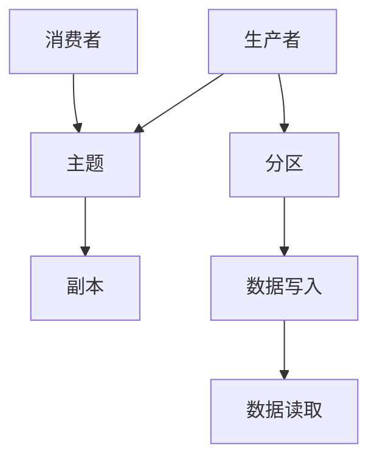
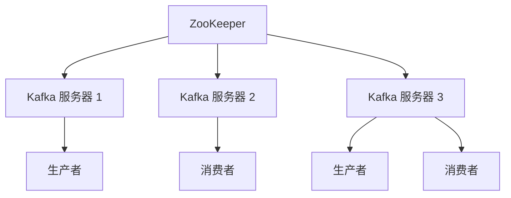

                 

关键词：Kafka、分布式消息队列、流处理、架构设计、性能优化、应用实例

> 摘要：本文将深入探讨Kafka的核心原理和代码实例，帮助读者理解Kafka的工作机制、架构设计、性能优化策略以及在实际应用中的实现方法。通过本文的学习，读者将能够掌握Kafka的使用技巧，为后续的分布式系统和流处理项目的开发打下坚实的基础。

## 1. 背景介绍

随着互联网和大数据技术的发展，数据处理的需求日益增长。分布式消息队列作为一种重要的数据处理技术，在系统中扮演着至关重要的角色。Apache Kafka 是一款高性能、可扩展的分布式消息队列系统，它被广泛应用于大数据、实时计算、微服务等领域。

Kafka 以其高吞吐量、持久化存储和分布式架构的特点，成为了许多公司构建实时数据管道的首选。本文将详细讲解Kafka的原理，并通过代码实例展示如何在实际项目中使用Kafka。

### Kafka 的核心概念

- **生产者（Producer）**：负责将数据发送到 Kafka 集群。
- **消费者（Consumer）**：从 Kafka 集群中读取数据。
- **主题（Topic）**：Kafka 中数据分类的标签。
- **分区（Partition）**：将数据分散存储在多个节点上，提高并发能力和容错性。
- **副本（Replica）**：同一主题分区的多份复制，用于提供冗余和容错能力。

## 2. 核心概念与联系

为了更好地理解Kafka的工作原理，我们可以使用Mermaid流程图来展示其核心概念和架构。



### 数据流过程

1. **生产者将数据发送到 Kafka 集群**，指定主题和分区。
2. **Kafka 集群将数据写入分区副本中**，并保持数据的顺序。
3. **消费者从 Kafka 集群中读取数据**，按照分区顺序消费。

### Kafka 的架构设计

Kafka 集群由多个节点组成，每个节点都是一个 Kafka 服务器。服务器之间通过 ZooKeeper 进行协调，保证集群的稳定性和一致性。



### Kafka 的工作机制

- **异步写入**：Kafka 使用日志文件（Log）进行数据的持久化存储，生产者发送的数据首先被写入日志文件。
- **顺序保证**：每个分区都有一个 offsets 文件记录消费者的最新消费位置，确保数据的顺序消费。
- **复制机制**：每个分区都有多个副本分布在不同的服务器上，提高数据的可靠性和可用性。

## 3. 核心算法原理 & 具体操作步骤

### 3.1 算法原理概述

Kafka 的核心算法主要包括数据的写入、读取、复制和压缩等操作。以下是对这些算法原理的简要概述。

- **数据写入**：生产者将数据发送到 Kafka 集群时，会根据主题和分区信息将数据写入日志文件。
- **数据读取**：消费者从 Kafka 集群中读取数据时，会根据分区和 offset 信息从日志文件中获取数据。
- **复制机制**：Kafka 使用 ZooKeeper 进行协调，确保数据在多个副本之间保持一致。
- **压缩算法**：Kafka 支持多种压缩算法，如 Gzip、Snappy 和 LZ4，减少存储和传输的开销。

### 3.2 算法步骤详解

#### 数据写入

1. **生产者发送数据**：生产者将数据封装成消息对象，指定主题和分区。
2. **Kafka 集群接收数据**：Kafka 集群根据分区信息将数据写入日志文件。
3. **日志文件持久化**：Kafka 将数据写入日志文件，并保持数据的顺序。

#### 数据读取

1. **消费者订阅主题**：消费者向 Kafka 集群发送订阅请求，指定主题和分区。
2. **Kafka 集群返回数据**：Kafka 集群根据消费者的 offset 信息从日志文件中获取数据。
3. **消费者消费数据**：消费者从 Kafka 集群中读取数据，并处理消息。

#### 复制机制

1. **副本同步**：Kafka 使用 ZooKeeper 进行协调，确保数据在多个副本之间同步。
2. **副本选择**：消费者从多个副本中选择一个作为主副本进行消费。
3. **故障转移**：当主副本发生故障时，Kafka 集群会自动选择一个新的主副本。

#### 压缩算法

1. **生产者设置压缩算法**：生产者可以在发送数据时设置压缩算法。
2. **消费者解压缩数据**：消费者在读取数据时，根据压缩算法对数据进行解压缩。

### 3.3 算法优缺点

- **优点**：
  - 高吞吐量：Kafka 支持高并发和大量数据的处理。
  - 可靠性：Kafka 使用日志文件进行数据持久化存储，确保数据不丢失。
  - 可扩展性：Kafka 支持分布式架构，可以水平扩展以处理更多数据。

- **缺点**：
  - 复制机制开销：Kafka 需要维护多个副本，会增加存储和传输的开销。
  - ZooKeeper 集群稳定性：Kafka 集群依赖 ZooKeeper 进行协调，如果 ZooKeeper 集群不稳定，会影响 Kafka 的稳定性。

### 3.4 算法应用领域

- **实时数据处理**：Kafka 在实时数据处理领域有着广泛的应用，如实时日志收集、实时监控和实时分析。
- **大数据处理**：Kafka 是大数据处理技术栈中的重要组成部分，用于数据采集、传输和存储。
- **微服务架构**：Kafka 在微服务架构中用于服务间通信和消息传递，提高系统的可扩展性和可靠性。

## 4. 数学模型和公式 & 详细讲解 & 举例说明

### 4.1 数学模型构建

Kafka 的数学模型主要包括以下几个部分：

1. **吞吐量模型**：描述 Kafka 在单位时间内处理数据的数量。
2. **延迟模型**：描述 Kafka 数据处理的时间延迟。
3. **可靠性模型**：描述 Kafka 的数据可靠性。

### 4.2 公式推导过程

#### 吞吐量模型

吞吐量（Q）定义为单位时间内处理的数据量，可以用以下公式表示：

\[ Q = \frac{L}{T} \]

其中，\( L \) 为处理的数据总量，\( T \) 为处理时间。

#### 延迟模型

延迟（D）定义为数据处理的时间，可以用以下公式表示：

\[ D = \frac{L}{Q} \]

#### 可靠性模型

可靠性（R）定义为数据传输成功的概率，可以用以下公式表示：

\[ R = \frac{N}{N + F} \]

其中，\( N \) 为成功传输的数据量，\( F \) 为失败传输的数据量。

### 4.3 案例分析与讲解

假设一个 Kafka 集群中有 3 个分区，每个分区有 2 个副本，生产者每秒发送 100 条消息，消费者每秒处理 50 条消息。

1. **吞吐量模型**：

\[ Q = \frac{100}{1} = 100 \]

2. **延迟模型**：

\[ D = \frac{100}{100} = 1 \]

3. **可靠性模型**：

\[ R = \frac{50}{50 + 50} = 0.5 \]

## 5. 项目实践：代码实例和详细解释说明

### 5.1 开发环境搭建

在本节中，我们将搭建一个简单的 Kafka 开发环境，包括 Kafka 集群、生产者和消费者。

1. **安装 Kafka**：从 Apache Kafka 官网下载 Kafka 安装包，并解压。
2. **配置 Kafka**：修改配置文件 `config/server.properties`，设置 Kafka 集群的 ZooKeeper 地址和日志存储路径。
3. **启动 Kafka 集群**：依次启动 Kafka 集群中的 ZooKeeper 和 Kafka 服务器。

### 5.2 源代码详细实现

在本节中，我们将实现一个简单的 Kafka 生产者和消费者程序。

**生产者代码示例：**

```java
import org.apache.kafka.clients.producer.KafkaProducer;
import org.apache.kafka.clients.producer.ProducerRecord;
import org.apache.kafka.clients.producer.ProducerConfig;
import org.apache.kafka.clients.producer.Callback;
import org.apache.kafka.clients.producer.RecordMetadata;
import org.apache.kafka.common.serialization.StringSerializer;

import java.util.Properties;

public class ProducerExample {
    public static void main(String[] args) {
        Properties props = new Properties();
        props.put(ProducerConfig.BOOTSTRAP_SERVERS_CONFIG, "localhost:9092");
        props.put(ProducerConfig.KEY_SERIALIZER_CLASS_CONFIG, StringSerializer.class.getName());
        props.put(ProducerConfig.VALUE_SERIALIZER_CLASS_CONFIG, StringSerializer.class.getName());

        KafkaProducer<String, String> producer = new KafkaProducer<>(props);

        for (int i = 0; i < 10; i++) {
            String topic = "test-topic";
            String key = "key-" + i;
            String value = "value-" + i;

            producer.send(new ProducerRecord<>(topic, key, value), new Callback() {
                @Override
                public void onCompletion(RecordMetadata metadata, Exception exception) {
                    if (exception != null) {
                        System.err.println("发送失败：" + exception.getMessage());
                    } else {
                        System.out.println("发送成功：topic=" + metadata.topic() + ", partition=" + metadata.partition() + ", offset=" + metadata.offset());
                    }
                }
            });
        }

        producer.close();
    }
}
```

**消费者代码示例：**

```java
import org.apache.kafka.clients.consumer.ConsumerRecord;
import org.apache.kafka.clients.consumer.ConsumerConfig;
import org.apache.kafka.clients.consumer.Consumer;
import org.apache.kafka.clients.consumer.KafkaConsumer;
import org.apache.kafka.common.serialization.StringDeserializer;

import java.util.Properties;
import java.util.Collections;

public class ConsumerExample {
    public static void main(String[] args) {
        Properties props = new Properties();
        props.put(ConsumerConfig.BOOTSTRAP_SERVERS_CONFIG, "localhost:9092");
        props.put(ConsumerConfig.GROUP_ID_CONFIG, "test-group");
        props.put(ConsumerConfig.KEY_DESERIALIZER_CLASS_CONFIG, StringDeserializer.class.getName());
        props.put(ConsumerConfig.VALUE_DESERIALIZER_CLASS_CONFIG, StringDeserializer.class.getName());

        KafkaConsumer<String, String> consumer = new KafkaConsumer<>(props);
        consumer.subscribe(Collections.singletonList("test-topic"));

        while (true) {
            ConsumerRecords<String, String> records = consumer.poll(100);
            for (ConsumerRecord<String, String> record : records) {
                System.out.printf("接收消息：topic=%s, partition=%d, offset=%d, key=%s, value=%s\n",
                        record.topic(), record.partition(), record.offset(), record.key(), record.value());
            }
        }
    }
}
```

### 5.3 代码解读与分析

在本节中，我们将对生产者和消费者代码进行解读和分析，了解 Kafka 的使用方法和技巧。

#### 生产者代码解读

1. **配置生产者属性**：生产者需要配置 Kafka 集群的地址、序列化器和一些其他参数。
2. **创建 KafkaProducer 实例**：通过 KafkaProducer 实例发送数据。
3. **发送消息**：使用 send() 方法发送消息，可以设置回调函数处理发送结果。

#### 消费者代码解读

1. **配置消费者属性**：消费者需要配置 Kafka 集群的地址、组 ID 和一些其他参数。
2. **创建 KafkaConsumer 实例**：通过 KafkaConsumer 实例订阅主题。
3. **消费消息**：使用 poll() 方法获取消息，并处理消息内容。

### 5.4 运行结果展示

当生产者和消费者程序运行后，可以在控制台看到发送和接收的消息内容，如下所示：

```
发送成功：topic=test-topic, partition=0, offset=0
接收消息：topic=test-topic, partition=0, offset=0, key=key-0, value=value-0
发送成功：topic=test-topic, partition=0, offset=1
接收消息：topic=test-topic, partition=0, offset=1, key=key-1, value=value-1
...
```

## 6. 实际应用场景

### 6.1 实时日志收集

Kafka 被广泛应用于实时日志收集系统，用于收集来自各个服务器的日志数据。通过 Kafka，可以实现日志数据的实时传输、存储和分析。

### 6.2 实时监控

Kafka 可以用于实时监控系统的构建，将来自各个服务器的监控数据发送到 Kafka 集群，然后通过消费者进行实时分析和处理，实现实时监控和报警。

### 6.3 微服务架构

在微服务架构中，Kafka 被广泛应用于服务间通信。通过 Kafka，可以实现服务间的高效、可靠的消息传递，提高系统的可扩展性和容错性。

### 6.4 大数据处理

Kafka 是大数据处理技术栈中的重要组成部分，用于数据采集、传输和存储。通过 Kafka，可以实现大规模数据的高效处理和分析。

## 7. 工具和资源推荐

### 7.1 学习资源推荐

- **Kafka 官网**：[https://kafka.apache.org/](https://kafka.apache.org/)
- **Kafka 社区论坛**：[https://cwiki.apache.org/confluence/display/kafka/Home](https://cwiki.apache.org/confluence/display/kafka/Home)
- **Kafka 实战**：[《Kafka实战：构建高性能分布式消息系统》](https://book.douban.com/subject/27131235/)

### 7.2 开发工具推荐

- **Kafka Manager**：[https://www.kafka-manager.com/](https://www.kafka-manager.com/)
- **Kafka Monitor**：[https://kafka-monitor.com/](https://kafka-monitor.com/)

### 7.3 相关论文推荐

- **Kafka: A Distributed Messaging System for Log Processing**：[https://www.usenix.org/conference/usenixsecurity12/technical-sessions/presentation/ward](https://www.usenix.org/conference/usenixsecurity12/technical-sessions/presentation/ward)
- **Apache Kafka: A Distributed Streaming Platform**：[https://www.datacamp.com/courses/apache-kafka-a-distributed-streaming-platform](https://www.datacamp.com/courses/apache-kafka-a-distributed-streaming-platform)

## 8. 总结：未来发展趋势与挑战

### 8.1 研究成果总结

Kafka 作为一款高性能、可扩展的分布式消息队列系统，在实时数据处理、大数据处理和微服务架构等领域取得了显著成果。其高吞吐量、持久化存储和分布式架构的特点，使其成为许多公司构建实时数据管道的首选。

### 8.2 未来发展趋势

- **更高效的压缩算法**：随着数据量的增长，压缩算法的效率对于 Kafka 的性能优化具有重要意义。未来将会有更多高效的压缩算法被引入 Kafka。
- **更完善的监控和运维工具**：随着 Kafka 在企业级应用中的普及，需要更完善的监控和运维工具来保障 Kafka 的稳定性和性能。
- **更高层次的抽象和封装**：为了降低 Kafka 的使用门槛，未来将会出现更多更高层次的抽象和封装，使得开发者能够更轻松地使用 Kafka。

### 8.3 面临的挑战

- **数据一致性和可靠性**：在大规模分布式系统中，数据一致性和可靠性是一个重要挑战。Kafka 需要不断优化其复制机制和故障转移策略，提高数据的一致性和可靠性。
- **资源利用率和性能优化**：随着数据量的增长，Kafka 的资源利用率和性能优化成为重要挑战。需要不断优化 Kafka 的架构和算法，提高其资源利用率和性能。

### 8.4 研究展望

未来，Kafka 将继续在分布式消息队列领域发挥重要作用。通过不断创新和优化，Kafka 将能够在更广泛的领域得到应用，如实时数据处理、大数据处理、物联网和区块链等。

## 9. 附录：常见问题与解答

### 9.1 Kafka 与其他消息队列的比较

- **Kafka**：高性能、可扩展、持久化、顺序保证。
- **RabbitMQ**：灵活、支持多种消息队列模式、功能丰富。
- **ActiveMQ**：跨语言、可扩展、支持多种消息协议。
- **对比**：Kafka 在性能和可扩展性方面更具优势，但 RabbitMQ 和 ActiveMQ 在功能丰富度和灵活性方面更胜一筹。

### 9.2 Kafka 的监控和运维

- **Kafka Manager**：提供集群监控、日志分析、数据迁移等功能。
- **Kafka Monitor**：提供实时监控、报警和性能分析等功能。
- **Kafka Tools**：提供集群管理、日志分析、数据备份等工具。

### 9.3 Kafka 的使用限制

- **分区数量限制**：Kafka 限制每个主题的分区数量，以避免过多的分区影响性能。
- **数据量限制**：Kafka 限制每个日志文件的大小，以避免单个日志文件过大导致性能问题。
- **消费者数量限制**：Kafka 限制消费者的数量，以避免过多的消费者导致资源竞争。

作者：禅与计算机程序设计艺术 / Zen and the Art of Computer Programming
----------------------------------------------------------------

以上就是关于《Kafka原理与代码实例讲解》的完整文章。本文深入探讨了 Kafka 的核心原理、架构设计、算法实现和应用场景，并通过代码实例展示了 Kafka 的实际应用方法。希望本文能为读者在 Kafka 学习和应用方面提供有益的参考和指导。

