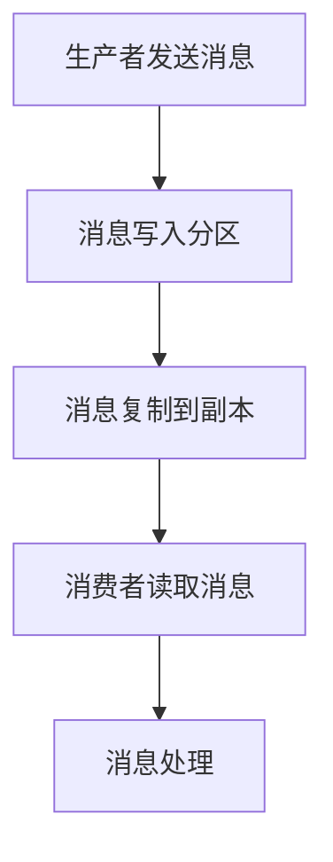

                 

## 1. 背景介绍

Kafka是由Apache软件基金会开发的一个分布式流处理平台，主要应用于大数据场景中的实时数据流处理。Kafka作为一个消息队列系统，具有高吞吐量、可扩展性强、可靠性高等特点，被广泛应用于数据收集、存储、处理和实时分析等领域。

在Kafka中，生产者（Producers）负责生成和发布消息，将消息发送到Kafka集群；消费者（Consumers）则负责从Kafka集群中读取消息，进行处理。生产者和消费者通过Kafka的API进行交互，从而实现数据的生产和消费过程。

本文将深入探讨Kafka生产者消费者API的原理，通过具体的代码实例，详细讲解其使用方法。希望通过这篇文章，读者可以更好地理解Kafka的生产者消费者机制，并在实际项目中应用。

## 2. 核心概念与联系

在Kafka中，核心概念主要包括主题（Topics）、分区（Partitions）、副本（Replicas）和ISR（In-Sync Replicas）。

### 2.1 主题（Topics）

主题是Kafka中的消息分类，类似于数据库中的表。每个主题可以拥有多个分区，每个分区存储一部分消息。

### 2.2 分区（Partitions）

分区是将主题中的消息进行水平切分，分布在不同的服务器上，从而实现负载均衡和提高吞吐量。每个分区是一个有序的消息队列，消息按照顺序写入和读取。

### 2.3 副本（Replicas）

副本是指每个分区在Kafka集群中有多个副本，用于提高消息的可靠性。副本分为领导者（Leader）和追随者（Followers），领导者负责处理所有来自生产者的写请求，追随者则负责从领导者同步数据。

### 2.4 ISR（In-Sync Replicas）

ISR是和领导者保持同步的副本集合。当副本的滞后程度超过一定的阈值时，它会从ISR中被移除，从而降低系统的可靠性。

### 2.5 Mermaid 流程图

以下是Kafka生产者消费者机制的Mermaid流程图：



## 3. 核心算法原理 & 具体操作步骤

### 3.1 算法原理概述

Kafka的生产者消费者机制主要包括以下几个核心算法：

- 分区算法：确定消息应该被写入哪个分区。
- 复制算法：确保消息在多个副本中备份。
- 选举算法：在副本集合中选举领导者。
- 消费者分配算法：将分区分配给消费者。

### 3.2 算法步骤详解

#### 3.2.1 分区算法

Kafka使用哈希分区算法来确定消息应该被写入哪个分区。具体步骤如下：

1. 计算消息键（Key）的哈希值。
2. 将哈希值对分区数量取模，得到分区编号。

#### 3.2.2 复制算法

Kafka使用主从复制（Master-Slave Replication）算法来保证消息的可靠性。具体步骤如下：

1. 当生产者发送消息时，消息首先写入领导者的日志中。
2. 领导者将消息同步给所有的追随者。

#### 3.2.3 选举算法

Kafka使用Zookeeper进行副本的领导选举。具体步骤如下：

1. 副本通过Zookeeper注册自身状态。
2. 当领导者的副本失败时，Zookeeper会触发选举过程，新的领导者将被选举出来。

#### 3.2.4 消费者分配算法

Kafka使用Range分配算法来将分区分配给消费者。具体步骤如下：

1. 将所有的分区按照起始偏移量排序。
2. 按顺序将分区分配给消费者。

### 3.3 算法优缺点

- **优点**：
  - 高可靠性：通过副本机制，保证数据的可靠性。
  - 高吞吐量：通过分区机制，实现负载均衡，提高系统的吞吐量。
  - 易扩展：可以通过增加服务器数量，线性扩展系统的容量。

- **缺点**：
  - 需要额外的Zookeeper协调：选举算法和消费者分配算法都需要依赖于Zookeeper进行协调。
  - 系统复杂性：需要考虑分区、副本、领导者选举等问题。

### 3.4 算法应用领域

Kafka的主要应用领域包括：

- 实时数据处理：如实时日志收集、实时流处理等。
- 数据集成：如数据采集、数据传输等。
- 消息队列：作为消息中间件，实现分布式系统的通信。

## 4. 数学模型和公式 & 详细讲解 & 举例说明

### 4.1 数学模型构建

为了更好地理解Kafka的分区算法，我们可以构建一个简单的数学模型。假设我们有一个Kafka集群，共有3个分区，消息键的哈希值范围为0到9。

### 4.2 公式推导过程

我们使用以下公式来确定消息应该被写入的分区：

```latex
Partition = Hash(Key) \mod NumPartitions
```

其中，`Hash(Key)`表示消息键的哈希值，`NumPartitions`表示分区数量。

### 4.3 案例分析与讲解

假设我们有一个消息键`"key-1"`，将其哈希值计算如下：

```latex
Hash("key-1") = 5
```

根据分区算法，我们可以计算出消息应该被写入的分区：

```latex
Partition = 5 \mod 3 = 2
```

因此，消息`"key-1"`将被写入分区2。

### 4.4 数学模型应用

我们可以使用这个数学模型来计算任意消息键的分区编号。例如，对于消息键`"key-2"`，其哈希值为：

```latex
Hash("key-2") = 7
```

根据分区算法，我们可以计算出：

```latex
Partition = 7 \mod 3 = 1
```

因此，消息`"key-2"`将被写入分区1。

## 5. 项目实践：代码实例和详细解释说明

### 5.1 开发环境搭建

在开始之前，我们需要搭建一个Kafka的开发环境。以下是具体的步骤：

1. 下载并安装Kafka。
2. 启动Kafka集群，包括Zookeeper和Kafka服务器。
3. 创建一个名为`test_topic`的主题，包含3个分区。

### 5.2 源代码详细实现

下面是一个简单的Kafka生产者消费者示例代码。

#### 生产者代码

```java
Properties props = new Properties();
props.put("bootstrap.servers", "localhost:9092");
props.put("key.serializer", "org.apache.kafka.common.serialization.StringSerializer");
props.put("value.serializer", "org.apache.kafka.common.serialization.StringSerializer");

Producer<String, String> producer = new KafkaProducer<>(props);

for (int i = 0; i < 10; i++) {
    producer.send(new ProducerRecord<>("test_topic", "key-" + i, "value-" + i));
}

producer.close();
```

#### 消费者代码

```java
Properties props = new Properties();
props.put("bootstrap.servers", "localhost:9092");
props.put("group.id", "test-group");
props.put("key.deserializer", "org.apache.kafka.common.serialization.StringDeserializer");
props.put("value.deserializer", "org.apache.kafka.common.serialization.StringDeserializer");

Consumer<String, String> consumer = new KafkaConsumer<>(props);

consumer.subscribe(Collections.singletonList(new TopicPartition("test_topic", 0)));

while (true) {
    ConsumerRecords<String, String> records = consumer.poll(Duration.ofMillis(1000));
    for (ConsumerRecord<String, String> record : records) {
        System.out.printf("Received message: key=%s, value=%s, partition=%d, offset=%d\n",
            record.key(), record.value(), record.partition(), record.offset());
    }
}
```

### 5.3 代码解读与分析

#### 生产者代码

1. 创建`Properties`对象，设置Kafka生产者所需的参数。
2. 创建`KafkaProducer`对象。
3. 循环发送消息到`test_topic`主题。
4. 关闭生产者。

#### 消费者代码

1. 创建`Properties`对象，设置Kafka消费者所需的参数。
2. 创建`KafkaConsumer`对象。
3. 订阅`test_topic`主题的一个分区。
4. 循环读取消息并打印。

### 5.4 运行结果展示

运行生产者代码后，会在`test_topic`主题的分区0中生成10条消息。运行消费者代码后，消费者会从分区0中读取消息并打印。

```
Received message: key=key-0, value=value-0, partition=0, offset=0
Received message: key=key-1, value=value-1, partition=0, offset=1
Received message: key=key-2, value=value-2, partition=0, offset=2
...
```

## 6. 实际应用场景

Kafka在许多实际应用场景中都有广泛的应用，以下是一些典型的应用场景：

- **日志收集**：Kafka可以作为一个高效的日志收集系统，收集来自各种服务器的日志数据，并实时传输到分析系统。
- **实时数据分析**：Kafka可以与大数据处理框架（如Spark、Flink）结合使用，实现实时数据流处理和分析。
- **消息队列**：Kafka可以作为分布式消息队列系统，实现分布式系统的异步通信。
- **实时事件处理**：Kafka可以处理实时事件数据，如点击流、交易数据等，实现实时监控和报警。

## 7. 工具和资源推荐

### 7.1 学习资源推荐

- [Kafka官方文档](https://kafka.apache.org/documentation/)
- [《Kafka实战》](https://www.amazon.com/Practical-Kafka-Building-Real-Time-Processing/dp/1484232923)
- [《Kafka权威指南》](https://www.amazon.com/Kafka-Definitive-Guide-Making-Distributed/dp/1449311924)

### 7.2 开发工具推荐

- [IntelliJ IDEA](https://www.jetbrains.com/idea/)：一款功能强大的IDE，支持Kafka开发。
- [Kafka Manager](https://github.com/yahoo/kafka-manager)：一款开源的Kafka集群管理工具。

### 7.3 相关论文推荐

- [Kafka: A Distributed Messaging System for Log Processing](https://www.usenix.org/conference/usenixsecurity14/technical-sessions/presentation/harms)
- [Kafka Design and Implementation](https://cwiki.apache.org/confluence/display/KAFKA/Kafka+Design)

## 8. 总结：未来发展趋势与挑战

### 8.1 研究成果总结

Kafka作为分布式流处理平台，已经在许多场景中得到了广泛应用。其核心算法原理、API设计和应用场景等方面都得到了深入的研究和优化。

### 8.2 未来发展趋势

- **性能优化**：随着数据量和并发量的增加，Kafka的性能优化将成为一个重要研究方向。
- **多语言支持**：目前Kafka主要支持Java和Scala语言，未来可能会增加对其他语言的API支持。
- **存储优化**：如何优化Kafka的存储性能，减少存储空间占用，是未来的一个研究方向。

### 8.3 面临的挑战

- **系统复杂性**：Kafka的架构和算法相对复杂，如何降低系统的复杂性，提高系统的易用性，是一个挑战。
- **可靠性保障**：在大量并发和高负载的场景下，如何保障系统的可靠性，是一个关键问题。

### 8.4 研究展望

Kafka在未来有望在以下几个方面得到进一步发展：

- **分布式存储**：引入分布式存储技术，提高Kafka的存储性能和可靠性。
- **多语言API**：支持更多编程语言，提高Kafka的适用性和易用性。
- **实时流处理**：结合大数据处理框架，实现更高效的实时流处理。

## 9. 附录：常见问题与解答

### 9.1 问题1

**问题**：Kafka中的分区和副本有什么区别？

**解答**：分区是将消息进行水平切分，分布在不同的服务器上，从而实现负载均衡和提高吞吐量；副本则是用于提高消息的可靠性，每个分区在Kafka集群中有多个副本，其中一个是领导者，负责处理写请求，其他副本负责同步数据。

### 9.2 问题2

**问题**：Kafka的生产者消费者如何实现负载均衡？

**解答**：Kafka通过分区机制实现负载均衡。生产者根据消息键的哈希值，将消息写入不同的分区；消费者则通过订阅主题的分区，实现消息的读取和负载均衡。

### 9.3 问题3

**问题**：Kafka如何保障消息的可靠性？

**解答**：Kafka通过副本机制保障消息的可靠性。每个分区有多个副本，其中领导者负责处理写请求，追随者负责同步数据。如果领导者的副本失败，系统会自动触发选举，新的领导者将被选举出来。

---

### 作者署名

作者：禅与计算机程序设计艺术 / Zen and the Art of Computer Programming

本文由禅与计算机程序设计艺术所著，旨在深入讲解Kafka生产者消费者API的原理和使用方法。希望通过本文，读者可以更好地理解Kafka的架构和算法，并在实际项目中应用。如有任何疑问或建议，欢迎在评论区留言。

