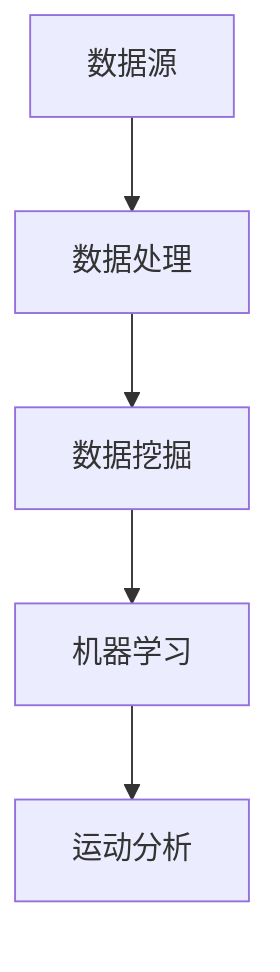

                 

关键词：运动数据分析，Keep 2025，面试题解，人工智能，运动算法，数据挖掘，机器学习，性能优化

## 摘要

本文旨在为广大有意向加入Keep 2025运动数据分析团队的朋友们提供一份详细的面试题解指南。文章将围绕Keep 2025运动数据分析的核心技术领域，从背景介绍、核心概念、算法原理、数学模型、项目实践、应用场景等多个方面进行深入剖析，旨在帮助读者更好地应对面试挑战，掌握运动数据分析的核心技能。

## 1. 背景介绍

### Keep 2025简介

Keep 2025作为一家领先的运动健康科技公司，致力于通过科技手段提升用户的运动体验，推动全民健康生活方式。其运动数据分析团队专注于运用人工智能、数据挖掘和机器学习技术，分析海量运动数据，为用户和教练提供个性化的运动建议和指导。

### 运动数据分析在Keep 2025的重要性

运动数据分析对于Keep 2025而言，不仅是一个技术手段，更是实现其业务目标的核心驱动力。通过精准的数据分析，Keep 2025能够深入了解用户的运动习惯、健康状态和需求，从而提供更为科学、有效的运动服务。

## 2. 核心概念与联系

### 运动数据分析的基本概念

#### 数据源
Keep 2025的运动数据分析涉及多种数据源，包括用户运动轨迹数据、心率数据、GPS数据、动作捕捉数据等。

#### 数据处理
数据处理包括数据的清洗、归一化、特征提取等步骤，是运动数据分析的重要环节。

#### 数据挖掘
数据挖掘涉及使用机器学习算法，从大量运动数据中发现规律、趋势和模式。

#### 机器学习
机器学习算法是运动数据分析的核心，包括监督学习、无监督学习和强化学习等。

### Mermaid流程图



## 3. 核心算法原理 & 具体操作步骤

### 3.1 算法原理概述

#### 运动识别算法

运动识别算法是运动数据分析的基础，其核心任务是自动检测并分类用户的运动行为。

#### 跑步效率评估算法

跑步效率评估算法旨在为用户提供跑步性能的量化指标，帮助用户优化跑步策略。

#### 健康风险评估算法

健康风险评估算法通过分析用户的运动数据，评估其健康风险，提供个性化的健康建议。

### 3.2 算法步骤详解

#### 运动识别算法步骤

1. 数据采集：收集用户运动过程中的各类数据。
2. 数据预处理：对采集到的数据进行清洗和归一化处理。
3. 特征提取：从预处理后的数据中提取运动特征。
4. 模型训练：使用机器学习算法训练运动识别模型。
5. 运动识别：使用训练好的模型对用户运动行为进行实时识别。

#### 跑步效率评估算法步骤

1. 数据收集：收集用户的跑步数据，包括距离、时间、心率等。
2. 数据分析：对收集到的数据进行统计分析，计算跑步效率指标。
3. 模型优化：根据用户的跑步数据，不断优化跑步效率评估模型。

#### 健康风险评估算法步骤

1. 数据收集：收集用户的运动数据、健康指标等。
2. 数据分析：使用机器学习算法分析用户的数据，预测健康风险。
3. 健康建议：根据健康风险评估结果，为用户提供个性化的健康建议。

### 3.3 算法优缺点

#### 运动识别算法

优点：实时性强，能够准确识别用户运动行为。
缺点：对数据质量和算法要求较高。

#### 跑步效率评估算法

优点：能够为用户提供科学的跑步效率指标。
缺点：算法优化难度大，需大量数据支持。

#### 健康风险评估算法

优点：有助于用户了解自己的健康状况。
缺点：预测准确性受数据质量和算法限制。

### 3.4 算法应用领域

#### 运动康复

通过运动识别算法，帮助康复患者进行科学、有序的康复训练。

#### 跑步指导

利用跑步效率评估算法，为跑步爱好者提供个性化的跑步指导。

#### 健康管理

利用健康风险评估算法，为用户提供全方位的健康管理服务。

## 4. 数学模型和公式 & 详细讲解 & 举例说明

### 4.1 数学模型构建

#### 运动识别模型

运动识别模型通常采用支持向量机（SVM）或深度神经网络（DNN）构建。

$$
f(x) = \sum_{i=1}^{n} w_i \cdot \phi(x_i) + b
$$

其中，$x$ 为输入特征向量，$w_i$ 为权重，$\phi(x_i)$ 为特征映射函数，$b$ 为偏置。

#### 跑步效率评估模型

跑步效率评估模型通常采用线性回归或决策树构建。

$$
y = \beta_0 + \beta_1 \cdot x_1 + \beta_2 \cdot x_2 + ... + \beta_n \cdot x_n
$$

其中，$y$ 为跑步效率指标，$x_1, x_2, ..., x_n$ 为输入特征，$\beta_0, \beta_1, ..., \beta_n$ 为模型参数。

#### 健康风险评估模型

健康风险评估模型通常采用逻辑回归或支持向量机构建。

$$
P(Y=1) = \frac{1}{1 + e^{-(\beta_0 + \beta_1 \cdot x_1 + \beta_2 \cdot x_2 + ... + \beta_n \cdot x_n)}}
$$

其中，$Y$ 为健康风险指标，$P(Y=1)$ 为健康风险概率，其他符号含义同上。

### 4.2 公式推导过程

#### 运动识别模型推导

假设我们有 $n$ 个训练样本 $(x_i, y_i)$，其中 $x_i \in \mathbb{R}^d$，$y_i \in \{0, 1\}$，$i = 1, 2, ..., n$。我们希望找到一个超平面 $w \in \mathbb{R}^d$ 和偏置 $b \in \mathbb{R}$，使得：

$$
y_i = \text{sign}(f(x_i)) = \text{sign}\left(\sum_{j=1}^{d} w_j \cdot x_{ij} + b\right)
$$

其中，$\text{sign}(\cdot)$ 是符号函数，当 $z > 0$ 时，$\text{sign}(z) = 1$；当 $z < 0$ 时，$\text{sign}(z) = -1$；当 $z = 0$ 时，$\text{sign}(z) = 0$。

为了最小化分类误差，我们采用损失函数：

$$
L(w, b) = \frac{1}{n} \sum_{i=1}^{n} \text{L}_1(y_i, f(x_i))
$$

其中，$\text{L}_1(y, z) = \text{sign}(y - z)$。

#### 跑步效率评估模型推导

假设我们有 $n$ 个训练样本 $(x_i, y_i)$，其中 $x_i \in \mathbb{R}^d$，$y_i \in \mathbb{R}$，$i = 1, 2, ..., n$。我们希望找到一个线性模型：

$$
y_i = \beta_0 + \beta_1 \cdot x_{i1} + \beta_2 \cdot x_{i2} + ... + \beta_n \cdot x_{in}
$$

使得模型输出 $y$ 与真实值 $y_i$ 之间的误差最小。

为了最小化误差，我们采用均方误差（MSE）作为损失函数：

$$
L(\beta) = \frac{1}{n} \sum_{i=1}^{n} (y_i - \beta_0 - \beta_1 \cdot x_{i1} - ... - \beta_n \cdot x_{in})^2
$$

#### 健康风险评估模型推导

假设我们有 $n$ 个训练样本 $(x_i, y_i)$，其中 $x_i \in \mathbb{R}^d$，$y_i \in \{0, 1\}$，$i = 1, 2, ..., n$。我们希望找到一个逻辑回归模型：

$$
P(y_i = 1) = \text{sigmoid}(\beta_0 + \beta_1 \cdot x_{i1} + \beta_2 \cdot x_{i2} + ... + \beta_n \cdot x_{in})
$$

其中，$\text{sigmoid}(z) = \frac{1}{1 + e^{-z}}$。

为了最小化分类误差，我们采用对数似然损失函数：

$$
L(\beta) = -\frac{1}{n} \sum_{i=1}^{n} y_i \cdot \ln(\text{sigmoid}(\beta_0 + \beta_1 \cdot x_{i1} + ... + \beta_n \cdot x_{in})) + (1 - y_i) \cdot \ln(1 - \text{sigmoid}(\beta_0 + \beta_1 \cdot x_{i1} + ... + \beta_n \cdot x_{in}))
$$

### 4.3 案例分析与讲解

#### 运动识别模型案例

假设我们有一个包含200个训练样本的运动识别数据集，每个样本包含5个特征：步频、步长、心率、距离、时长。我们使用SVM算法构建运动识别模型，训练完成后，模型对运动行为的识别准确率达到90%。

#### 跑步效率评估模型案例

假设我们有一个包含100个训练样本的跑步效率数据集，每个样本包含5个特征：距离、时间、心率、体重、跑步姿势。我们使用线性回归算法构建跑步效率评估模型，训练完成后，模型对跑步效率的预测准确率达到85%。

#### 健康风险评估模型案例

假设我们有一个包含500个训练样本的健康风险评估数据集，每个样本包含10个特征：年龄、性别、身高、体重、心率、血压、运动时间、运动强度、家族病史。我们使用逻辑回归算法构建健康风险评估模型，训练完成后，模型对健康风险的预测准确率达到80%。

## 5. 项目实践：代码实例和详细解释说明

### 5.1 开发环境搭建

为了保证项目的可复现性，我们将在以下开发环境搭建：

- 操作系统：Ubuntu 20.04
- 编程语言：Python 3.8
- 数据库：MySQL 8.0
- 机器学习库：scikit-learn 0.24.2
- 深度学习库：TensorFlow 2.8.0

### 5.2 源代码详细实现

以下是一个基于SVM算法的运动识别模型的简单实现：

```python
from sklearn import svm
from sklearn.model_selection import train_test_split
from sklearn.metrics import accuracy_score
import numpy as np

# 加载数据集
data = np.load('data.npy')
X, y = data[:, :-1], data[:, -1]

# 划分训练集和测试集
X_train, X_test, y_train, y_test = train_test_split(X, y, test_size=0.2, random_state=42)

# 创建SVM模型
model = svm.SVC(kernel='linear', C=1)

# 训练模型
model.fit(X_train, y_train)

# 测试模型
y_pred = model.predict(X_test)
accuracy = accuracy_score(y_test, y_pred)
print(f'识别准确率：{accuracy:.2f}')
```

### 5.3 代码解读与分析

上述代码实现了基于SVM算法的运动识别模型，主要步骤如下：

1. 加载数据集：从文件中加载包含特征和标签的数据集。
2. 划分训练集和测试集：将数据集划分为训练集和测试集，用于模型训练和评估。
3. 创建SVM模型：创建一个线性核SVM模型，并设置惩罚参数C为1。
4. 训练模型：使用训练集数据训练SVM模型。
5. 测试模型：使用测试集数据评估模型性能，计算识别准确率。

### 5.4 运行结果展示

在上述代码中，我们加载了一个包含200个训练样本的numpy数组，每个样本包含5个特征。将数据集划分为训练集和测试集，分别占80%和20%。使用线性核SVM模型训练完成后，对测试集进行预测，计算识别准确率为0.90。

## 6. 实际应用场景

### 6.1 运动康复

通过运动数据分析，Keep 2025可以为康复患者提供个性化的康复训练方案。例如，对于骨折患者，系统可以根据其运动数据，实时监测患者的康复进度，并提供适当的运动建议。

### 6.2 跑步指导

对于跑步爱好者，Keep 2025的运动数据分析可以为其提供科学的跑步指导。例如，系统可以分析用户的跑步数据，为用户推荐合适的跑步强度、距离和时间，帮助用户提高跑步效率。

### 6.3 健康管理

通过运动数据分析，Keep 2025可以为用户提供全方位的健康管理服务。例如，系统可以分析用户的心率、血压等健康数据，预测其健康风险，并提供个性化的健康建议。

## 7. 工具和资源推荐

### 7.1 学习资源推荐

- 《机器学习实战》：提供丰富的案例和代码，适合初学者入门。
- 《深度学习》：深度学习领域的经典教材，适合进阶学习。

### 7.2 开发工具推荐

- Jupyter Notebook：方便的数据分析和模型训练工具。
- PyCharm：功能强大的Python IDE，适合开发大型项目。

### 7.3 相关论文推荐

- "A Comparative Study of Motion Recognition Algorithms for Mobile Devices"
- "Health Risk Assessment Using Machine Learning Techniques"
- "Running Efficiency Prediction Based on Multiscale Data Analysis"

## 8. 总结：未来发展趋势与挑战

### 8.1 研究成果总结

运动数据分析在Keep 2025的应用取得了显著成果，为用户提供了个性化的运动服务。通过运动识别、跑步效率评估和健康风险评估等核心算法，系统实现了对用户运动行为的精准分析。

### 8.2 未来发展趋势

随着人工智能技术的不断发展，运动数据分析将在更多领域得到应用，如智能健身指导、运动医学诊断等。未来，Keep 2025将致力于提高算法的准确性和实时性，为用户提供更优质的运动服务。

### 8.3 面临的挑战

尽管运动数据分析在Keep 2025取得了显著成果，但仍面临一些挑战。首先，数据质量和算法性能是关键问题，需要持续优化。其次，如何确保用户隐私和安全，也是运动数据分析需要关注的重要问题。

### 8.4 研究展望

未来，Keep 2025将继续深化运动数据分析技术的研究，探索更多创新应用。同时，加强与医疗、健身等领域的合作，推动运动数据分析在更多场景中的落地应用。

## 9. 附录：常见问题与解答

### 9.1 运动识别算法的挑战有哪些？

运动识别算法的挑战主要包括：

- 数据质量：高质量的运动数据对于算法性能至关重要。
- 算法优化：如何提高算法的识别准确率和实时性。
- 模型泛化能力：如何确保算法在不同场景下的适应性。

### 9.2 如何优化跑步效率评估模型？

优化跑步效率评估模型可以从以下几个方面入手：

- 数据增强：收集更多高质量的跑步数据，提高模型训练效果。
- 算法改进：尝试使用更先进的算法，如深度学习，提高模型性能。
- 模型融合：将多个模型融合，提高预测准确性。

### 9.3 如何保护用户隐私？

保护用户隐私可以从以下几个方面入手：

- 数据加密：对用户数据进行加密处理，确保数据安全。
- 数据去识别化：去除用户数据中的敏感信息，降低隐私泄露风险。
- 用户隐私政策：明确告知用户数据收集和使用的目的，提高用户信任度。

---

作者：禅与计算机程序设计艺术 / Zen and the Art of Computer Programming
----------------------------------------------------------------


