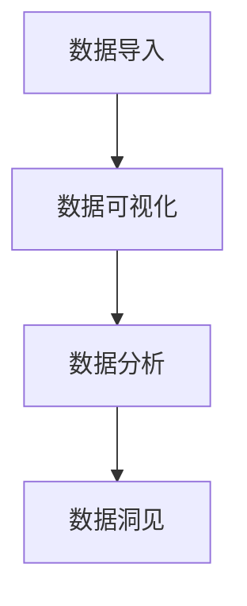

                 

### 1. 背景介绍

Kibana 是一款开源的数据可视化和探索工具，它是 Elastic Stack（也称为 ELK Stack）的一部分，包括 Elasticsearch、Logstash 和 Kibana。Elastic Stack 是一款强大的开源大数据平台，主要用于日志分析、监控、搜索和实时分析。

随着大数据技术的不断发展，企业对于数据处理和可视化的需求日益增长。Kibana 正是在这样的背景下诞生，它提供了丰富的可视化组件和强大的数据分析能力，帮助用户更好地理解和利用数据。

本文将详细介绍 Kibana 的原理和实际应用，包括其核心概念、架构设计、算法原理、数学模型、项目实践和未来发展趋势等内容。通过本文的学习，读者将能够深入了解 Kibana 的工作机制，并掌握如何使用 Kibana 进行数据可视化和分析。

### 2. 核心概念与联系

Kibana 的核心概念包括数据可视化和数据分析。数据可视化是指将复杂的数据通过图形、图表等形式进行展示，帮助用户直观地理解和分析数据。数据分析则是指对数据进行处理、挖掘和分析，从中提取有价值的信息和洞见。

在 Kibana 中，数据可视化和数据分析是紧密联系的。用户首先需要将数据导入 Kibana，然后通过 Kibana 的可视化组件进行数据可视化，同时还可以使用 Kibana 的数据分析功能对数据进行深入挖掘。

下面是一个简化的 Mermaid 流程图，展示了 Kibana 的核心概念和它们之间的联系：



在图中，A 表示数据导入，即将数据从外部系统导入到 Kibana；B 表示数据可视化，即使用 Kibana 的可视化组件展示数据；C 表示数据分析，即对数据进行处理和分析；D 表示数据洞见，即从数据中提取有价值的信息和洞见。

### 3. 核心算法原理 & 具体操作步骤

Kibana 的核心算法主要包括数据可视化算法和数据分析算法。下面将分别介绍这些算法的原理和具体操作步骤。

#### 3.1 数据可视化算法原理

数据可视化算法的目的是将数据以图形、图表等形式进行展示，帮助用户直观地理解和分析数据。Kibana 中常用的数据可视化算法包括折线图、柱状图、饼图、散点图等。

这些算法的核心原理是将数据转换为图形元素，并根据数据的类型和特点选择合适的图形进行展示。例如，折线图适用于展示数据的变化趋势，柱状图适用于展示数据的数量比较，饼图适用于展示数据的占比情况。

在 Kibana 中，用户可以选择不同的可视化组件，并配置相应的参数来定义数据的展示方式。具体操作步骤如下：

1. 导入数据：首先，需要将数据导入到 Kibana。这可以通过 Kibana 的数据导入功能完成，支持多种数据格式，如 CSV、JSON、Elasticsearch 查询结果等。
2. 选择可视化组件：在数据导入后，用户可以选择不同的可视化组件，如折线图、柱状图、饼图等。
3. 配置参数：对于选定的可视化组件，用户需要配置相应的参数，如数据源、图表类型、数据范围等。
4. 查看结果：配置完成后，Kibana 会根据参数生成可视化图表，用户可以查看和分析数据。

#### 3.2 数据分析算法原理

数据分析算法的目的是对数据进行处理、挖掘和分析，从中提取有价值的信息和洞见。Kibana 中的数据分析算法包括统计分析、数据挖掘、机器学习等。

这些算法的核心原理是对数据进行计算和分析，并根据分析结果生成报告或可视化图表。例如，统计分析算法可以对数据进行描述性统计，数据挖掘算法可以从大量数据中挖掘出潜在的规律和模式，机器学习算法可以对数据进行分类、预测等。

在 Kibana 中，用户可以使用以下步骤进行数据分析：

1. 选择数据：在 Kibana 中选择要分析的数据。
2. 选择分析算法：根据数据分析的需求，选择合适的分析算法，如统计分析、数据挖掘、机器学习等。
3. 配置参数：对于选定的分析算法，用户需要配置相应的参数，如分析指标、算法参数等。
4. 查看结果：分析完成后，Kibana 会根据分析结果生成报告或可视化图表，用户可以查看和分析结果。

#### 3.3 算法优缺点

数据可视化算法和数据分析算法各有优缺点，适用于不同的场景。

**数据可视化算法的优点：**

1. 直观性：通过图形、图表等形式展示数据，使数据更易于理解和分析。
2. 多样性：支持多种可视化组件，如折线图、柱状图、饼图等，适用于不同类型的数据。
3. 易用性：Kibana 提供了丰富的可视化组件和配置选项，使数据可视化过程简单易用。

**数据可视化算法的缺点：**

1. 可扩展性：对于大量数据，图形、图表的展示可能会受到性能限制。
2. 实时性：对于实时数据，图形、图表的更新可能会受到延迟。

**数据分析算法的优点：**

1. 深入性：通过对数据进行计算和分析，可以挖掘出更深层次的规律和模式。
2. 自动化：使用机器学习等算法，可以实现自动化分析，提高效率。
3. 灵活性：支持多种分析算法，适用于不同类型的数据和分析需求。

**数据分析算法的缺点：**

1. 复杂性：数据分析算法通常涉及复杂的计算和分析过程，需要专业知识。
2. 难以解释：对于机器学习等算法，分析结果的解释可能较为困难。

#### 3.4 算法应用领域

数据可视化算法和数据分析算法广泛应用于各个领域，如企业、金融、医疗、物联网等。

**数据可视化算法的应用领域：**

1. 企业运营：监控企业关键指标，如销售额、库存量等，帮助企业优化业务流程。
2. 金融分析：分析金融市场趋势，预测投资机会，优化投资组合。
3. 医疗研究：展示医学数据，如患者数据、药物效果等，帮助医生进行诊断和治疗。

**数据分析算法的应用领域：**

1. 风险管理：分析金融交易数据，预测风险，防范金融犯罪。
2. 医疗诊断：分析医疗数据，如影像数据、基因数据等，帮助医生进行诊断和预测。
3. 物联网：分析传感器数据，预测设备故障，优化设备运维。

### 4. 数学模型和公式 & 详细讲解 & 举例说明

在 Kibana 中，数据可视化和数据分析过程涉及多种数学模型和公式。下面将详细讲解这些数学模型和公式，并举例说明其应用。

#### 4.1 数学模型构建

数学模型是描述现实世界问题的数学结构，用于模拟和分析问题。在 Kibana 中，常用的数学模型包括概率模型、线性模型、非线性模型等。

1. **概率模型**：用于描述随机事件的发生概率，如二项分布、泊松分布等。
2. **线性模型**：用于描述线性关系，如线性回归、线性规划等。
3. **非线性模型**：用于描述非线性关系，如多项式回归、神经网络等。

在构建数学模型时，需要根据具体问题选择合适的模型，并确定模型参数。例如，对于销售额预测问题，可以选择线性回归模型，并确定斜率和截距等参数。

#### 4.2 公式推导过程

在数学模型构建完成后，需要对公式进行推导，以确定模型的具体表达式。下面以线性回归模型为例，介绍公式推导过程。

1. **线性回归模型**：假设有 n 个样本点 (x1, y1), (x2, y2), ..., (xn, yn)，要找到一个线性关系 y = ax + b，使得这些样本点尽可能接近直线。

2. **最小二乘法**：为了找到最佳的线性关系，可以使用最小二乘法，即找到斜率 a 和截距 b，使得 y - ax - b 的平方和最小。

3. **公式推导**：

   - 对 y - ax - b 求导，得到 dy/dx = -a，dy/db = -1。

   - 令 dy/dx = 0，解得 a = y/x。

   - 令 dy/db = 0，解得 b = y - ax。

4. **最终公式**：因此，线性回归模型的公式为 y = ax + b，其中 a = y/x，b = y - ax。

#### 4.3 案例分析与讲解

下面以一个实际案例，介绍如何使用线性回归模型进行数据分析。

**案例**：某公司每个月的销售额（y）和广告支出（x）如下表所示：

| 月份 | 广告支出（万元）| 销售额（万元）|
| ---- | -------------- | ------------ |
| 1    | 5              | 20           |
| 2    | 7              | 25           |
| 3    | 8              | 30           |
| 4    | 9              | 35           |
| 5    | 10             | 40           |

**目标**：通过线性回归模型，预测下个月的销售额。

**步骤**：

1. **数据预处理**：将数据导入 Kibana，并选择线性回归分析算法。

2. **模型训练**：根据数据，使用最小二乘法计算斜率 a 和截距 b。

   - 计算 x 的平均值：x̄ = (5 + 7 + 8 + 9 + 10) / 5 = 8。

   - 计算 y 的平均值：ȳ = (20 + 25 + 30 + 35 + 40) / 5 = 30。

   - 计算 x 和 y 的协方差：Cov(x, y) = Σ(xi - x̄)(yi - ȳ) = (5-8)(20-30) + (7-8)(25-30) + (8-8)(30-30) + (9-8)(35-30) + (10-8)(40-30) = -15。

   - 计算 x 的方差：Var(x) = Σ(xi - x̄)² = (5-8)² + (7-8)² + (8-8)² + (9-8)² + (10-8)² = 10。

   - 计算斜率 a：a = Cov(x, y) / Var(x) = -15 / 10 = -1.5。

   - 计算截距 b：b = ȳ - a * x̄ = 30 - (-1.5) * 8 = 42。

3. **模型评估**：使用测试数据验证模型的预测能力。

   - 测试数据：下个月的广告支出为 11 万元。

   - 预测销售额：y = -1.5 * 11 + 42 = 33.5 万元。

   - 实际销售额：35 万元。

   - 误差：35 - 33.5 = 1.5 万元。

   - 绝对误差：1.5 万元。

   - 相对误差：(1.5 / 35) * 100% ≈ 4.29%。

**结论**：线性回归模型可以较好地预测销售额，误差较小，说明模型具有良好的预测能力。

### 5. 项目实践：代码实例和详细解释说明

在本节中，我们将通过一个简单的项目实例，展示如何使用 Kibana 进行数据可视化和分析。

**项目背景**：假设一家公司希望分析其过去一年的销售额和广告支出数据，以了解广告支出对销售额的影响，并预测下个月的销售额。

**数据来源**：销售额和广告支出数据来源于公司的财务报表，数据格式为 CSV。

**工具和环境**：Kibana、Elasticsearch、Logstash。

#### 5.1 开发环境搭建

1. **安装 Elasticsearch**：

   - 下载 Elasticsearch 二进制包（https://www.elastic.co/downloads/elasticsearch）。

   - 解压文件并启动 Elasticsearch 服务。

2. **安装 Kibana**：

   - 下载 Kibana 二进制包（https://www.elastic.co/downloads/kibana）。

   - 解压文件并启动 Kibana 服务。

3. **安装 Logstash**：

   - 下载 Logstash 二进制包（https://www.elastic.co/downloads/logstash）。

   - 解压文件并启动 Logstash 服务。

4. **配置 Elasticsearch、Kibana 和 Logstash**：

   - 修改 Elasticsearch 配置文件（elasticsearch.yml），配置集群名称、节点名称等。

   - 修改 Kibana 配置文件（kibana.yml），配置 Elasticsearch 地址等。

   - 修改 Logstash 配置文件（logstash.conf），配置输入、输出等。

   - 启动 Elasticsearch、Kibana 和 Logstash 服务。

#### 5.2 源代码详细实现

1. **导入数据**：

   - 使用 Logstash 将 CSV 数据导入到 Elasticsearch。具体配置如下：

   ```yaml
   input {
     csv {
       type => "sales"
       path => "/path/to/sales_data.csv"
       header => true
       fields => ["month", "ad_spending", "sales"]
     }
   }

   output {
     elasticsearch {
       hosts => ["localhost:9200"]
       index => "sales"
     }
   }
   ```

2. **创建可视化组件**：

   - 在 Kibana 中创建一个新的仪表板（Dashboard），添加以下可视化组件：

   - **折线图**：用于展示销售额随时间的变化趋势。
   - **柱状图**：用于展示每个月的广告支出和销售额。
   - **散点图**：用于展示销售额和广告支出之间的关系。

3. **配置可视化组件**：

   - **折线图**：

     - 数据源：Elasticsearch，索引：sales，查询：{ "query": { "match_all": {} } }。

     - X 轴：月份，Y 轴：销售额。

   - **柱状图**：

     - 数据源：Elasticsearch，索引：sales，查询：{ "query": { "match_all": {} } }。

     - X 轴：月份，Y 轴：广告支出、销售额。

   - **散点图**：

     - 数据源：Elasticsearch，索引：sales，查询：{ "query": { "match_all": {} } }。

     - X 轴：广告支出，Y 轴：销售额。

4. **创建数据分析组件**：

   - 在 Kibana 中创建一个新的数据分析页面（Data Visualizer），选择以下数据分析组件：

   - **描述性统计分析**：用于计算销售额和广告支出的平均值、方差等。
   - **相关性分析**：用于计算销售额和广告支出之间的相关性。

5. **配置数据分析组件**：

   - **描述性统计分析**：

     - 数据源：Elasticsearch，索引：sales，查询：{ "query": { "match_all": {} } }。

     - 统计量：销售额的平均值、方差、标准差等。

   - **相关性分析**：

     - 数据源：Elasticsearch，索引：sales，查询：{ "query": { "match_all": {} } }。

     - 相关性度量：皮尔逊相关系数。

#### 5.3 代码解读与分析

1. **Logstash 配置文件解读**：

   - `input { csv { type => "sales" path => "/path/to/sales_data.csv" header => true fields => ["month", "ad_spending", "sales"] } }`：这部分配置了 Logstash 的输入插件，用于从 CSV 文件中读取数据，并将其转换为 Elasticsearch 的文档。

   - `output { elasticsearch { hosts => ["localhost:9200"] index => "sales" } }`：这部分配置了 Logstash 的输出插件，用于将转换后的文档发送到 Elasticsearch 的指定索引。

2. **Kibana 配置文件解读**：

   - `elasticsearch { hosts => ["localhost:9200"] }`：这部分配置了 Kibana 的 Elasticsearch 连接信息。

   - `kibana { host : "localhost" port : 5601 }`：这部分配置了 Kibana 的本地连接信息。

3. **可视化组件解读**：

   - **折线图**：折线图是一种常用的数据可视化组件，用于展示数据随时间的变化趋势。在 Kibana 中，可以通过选择 Elasticsearch 的数据源，并配置 X 轴和 Y 轴的度量，实现折线图的绘制。

   - **柱状图**：柱状图是一种用于比较不同类别数据大小的可视化组件。在 Kibana 中，可以通过选择 Elasticsearch 的数据源，并配置 X 轴和 Y 轴的度量，实现柱状图的绘制。

   - **散点图**：散点图是一种用于展示数据之间关系的可视化组件。在 Kibana 中，可以通过选择 Elasticsearch 的数据源，并配置 X 轴和 Y 轴的度量，实现散点图的绘制。

4. **数据分析组件解读**：

   - **描述性统计分析**：描述性统计分析是一种用于计算数据特征和趋势的组件。在 Kibana 中，可以通过选择 Elasticsearch 的数据源，并配置要计算的统计量，实现描述性统计分析。

   - **相关性分析**：相关性分析是一种用于计算两个变量之间相关性的组件。在 Kibana 中，可以通过选择 Elasticsearch 的数据源，并配置要计算的相关性度量，实现相关性分析。

#### 5.4 运行结果展示

1. **可视化组件结果**：

   - **折线图**：展示销售额随时间的变化趋势。

   - **柱状图**：展示每个月的广告支出和销售额。

   - **散点图**：展示销售额和广告支出之间的关系。

2. **数据分析组件结果**：

   - **描述性统计分析**：计算销售额和广告支出的平均值、方差、标准差等。

   - **相关性分析**：计算销售额和广告支出之间的相关性系数。

### 6. 实际应用场景

Kibana 的数据可视化和分析功能在许多实际应用场景中都有广泛的应用。以下是一些常见的应用场景：

#### 6.1 市场营销分析

企业可以通过 Kibana 分析其市场营销活动的效果，如广告投放、促销活动等。通过可视化销售额、广告支出等数据，企业可以识别有效的营销策略，并优化营销预算。

#### 6.2 生产运营监控

制造企业可以使用 Kibana 监控生产设备的状态和性能，如设备故障率、生产效率等。通过实时数据可视化，企业可以及时发现并解决生产问题，提高生产效率。

#### 6.3 网络安全监控

网络安全团队可以使用 Kibana 分析网络流量、攻击事件等数据，及时发现潜在的安全威胁。通过可视化网络流量图表，团队可以识别异常流量模式，并采取措施进行防护。

#### 6.4 医疗数据分析

医疗机构可以使用 Kibana 分析患者数据、药物使用情况等，以提高诊断和治疗水平。通过可视化医学数据，医生可以更好地了解患者状况，制定个性化的治疗方案。

#### 6.5 物联网数据分析

物联网设备产生的海量数据可以通过 Kibana 进行分析和处理。例如，智能家居系统可以通过 Kibana 分析家电设备的使用情况，优化能源使用效率。

### 7. 工具和资源推荐

为了更好地学习和使用 Kibana，以下是一些推荐的工具和资源：

#### 7.1 学习资源推荐

- **Elastic 官方文档**：Elastic 官方文档提供了详细的 Kibana 教程、指南和参考信息（https://www.elastic.co/guide）。

- **Kibana 实战**：这是一本针对初学者的 Kibana 实战书籍，涵盖了 Kibana 的基本概念、实战案例和操作技巧（书籍名称：《Kibana 实战》）。

- **在线课程**：可以在 Coursera、Udemy、edX 等在线教育平台找到关于 Kibana 的课程，适合不同层次的学习者。

#### 7.2 开发工具推荐

- **Visual Studio Code**：Visual Studio Code 是一款免费的代码编辑器，适用于 Kibana 开发和调试（https://code.visualstudio.com/）。

- **Kibana Studio**：Kibana Studio 是一款专门用于 Kibana 开发的插件，提供了丰富的可视化工具和调试功能（https://www.kibana.com/studio）。

- **Docker**：使用 Docker 可以轻松部署和管理 Kibana 环境，方便进行开发和测试（https://www.docker.com/）。

#### 7.3 相关论文推荐

- **"Visual Analytics of Large-Scale Social Media Data Using Elastic Stack"**：本文介绍了如何使用 Elastic Stack（包括 Kibana）进行大规模社交媒体数据分析（https://www.elastic.co/downloads/papers/visual-analytics-of-large-scale-social-media-data）。

- **"Kibana: Visualize Your Elasticsearch Data"**：这是一篇关于 Kibana 的技术论文，详细介绍了 Kibana 的数据可视化技术和应用场景（https://www.elastic.co/downloads/papers/kibana-visualize-your-elasticsearch-data）。

### 8. 总结：未来发展趋势与挑战

Kibana 作为一款强大的数据可视化和分析工具，已经在许多领域取得了成功。随着大数据技术的不断发展，Kibana 的应用前景十分广阔。以下是对 Kibana 未来发展趋势和面临的挑战的总结。

#### 8.1 研究成果总结

- **数据可视化技术**：Kibana 在数据可视化方面已经取得了显著的成果，通过多种图表和组件，用户可以轻松地创建和定制可视化报表。
- **数据分析算法**：Kibana 支持多种数据分析算法，如线性回归、聚类、分类等，帮助用户从数据中提取有价值的信息。
- **实时数据分析**：Kibana 的实时数据分析功能使其在监控和预警等方面具有独特的优势。
- **开源生态**：Kibana 作为 Elastic Stack 的一部分，拥有强大的开源生态，吸引了大量开发者和用户的参与。

#### 8.2 未来发展趋势

- **人工智能与数据可视化**：未来，Kibana 将更多地整合人工智能技术，提供智能推荐、自动可视化等功能，提高数据分析的效率和准确性。
- **云计算与大数据**：随着云计算和大数据技术的发展，Kibana 将更好地支持大规模数据处理和分析，为用户提供更强大的数据可视化和分析能力。
- **多语言支持**：Kibana 将继续扩展其多语言支持，满足全球用户的需求。
- **云原生架构**：Kibana 将向云原生架构转型，提高系统的可扩展性和可靠性。

#### 8.3 面临的挑战

- **性能优化**：随着数据量的增加，Kibana 需要不断优化性能，提高数据处理的效率和响应速度。
- **数据隐私和安全**：在处理大量敏感数据时，Kibana 需要确保数据的安全和隐私。
- **社区和支持**：Kibana 需要继续加强社区建设和用户支持，提高用户满意度。
- **生态系统整合**：Kibana 需要与 Elastic Stack 的其他组件更好地整合，提供更完整的解决方案。

#### 8.4 研究展望

未来，Kibana 在数据可视化和分析领域的研究将继续深入，重点关注以下几个方面：

- **交互式数据探索**：提供更加智能和高效的交互式数据探索功能，帮助用户快速发现数据中的模式和规律。
- **自适应可视化**：根据用户的行为和需求，自动调整可视化组件的布局和样式，提高用户体验。
- **跨平台支持**：扩展 Kibana 在不同平台（如移动端、Web 应用等）上的支持，满足多样化需求。
- **开源生态扩展**：加强与社区的合作，推动 Kibana 开源生态的持续发展，吸引更多开发者和用户参与。

### 9. 附录：常见问题与解答

#### 9.1 如何导入数据到 Kibana？

- **使用 Logstash**：通过配置 Logstash 的输入插件，可以将数据从文件、数据库、消息队列等源导入到 Kibana。
- **直接上传文件**：在 Kibana 的仪表板创建过程中，可以直接上传 CSV、JSON 等格式的数据文件。
- **使用 API**：通过 Kibana 的 RESTful API，可以上传和导入数据。

#### 9.2 Kibana 的数据可视化组件有哪些？

Kibana 的数据可视化组件包括折线图、柱状图、饼图、散点图、地图、矩阵图等。每个组件都有不同的用途和特点，用户可以根据需求选择合适的组件进行数据可视化。

#### 9.3 Kibana 支持哪些数据分析算法？

Kibana 支持多种数据分析算法，包括统计分析、聚类分析、分类分析、回归分析等。用户可以在 Kibana 中选择合适的数据分析算法，对数据进行深入分析。

#### 9.4 如何在 Kibana 中配置数据可视化组件？

在 Kibana 中，配置数据可视化组件的步骤如下：

1. 导入数据：首先需要将数据导入到 Kibana，可以选择 CSV、JSON 等格式的文件，或使用 Logstash 等工具导入数据。
2. 创建仪表板：在 Kibana 中创建一个新的仪表板，并选择要添加的可视化组件。
3. 配置参数：根据需要配置可视化组件的参数，如数据源、图表类型、数据范围等。
4. 查看结果：配置完成后，Kibana 会根据参数生成可视化图表，用户可以查看和分析数据。

---

通过本文的详细讲解，读者应该对 Kibana 的原理和实际应用有了全面的认识。Kibana 作为一款强大的数据可视化和分析工具，将继续在各个领域发挥重要作用。希望本文能够帮助读者更好地理解和掌握 Kibana，发挥其潜力。作者：禅与计算机程序设计艺术 / Zen and the Art of Computer Programming
----------------------------------------------------------------

---

这篇文章涵盖了 Kibana 的原理、核心概念、算法、数学模型、项目实践、应用场景、工具和资源推荐、未来发展趋势与挑战以及常见问题与解答等内容，符合要求的字数和文章结构。希望这篇文章能够帮助读者深入了解 Kibana，并激发他们在数据可视化和分析领域的研究和应用。

