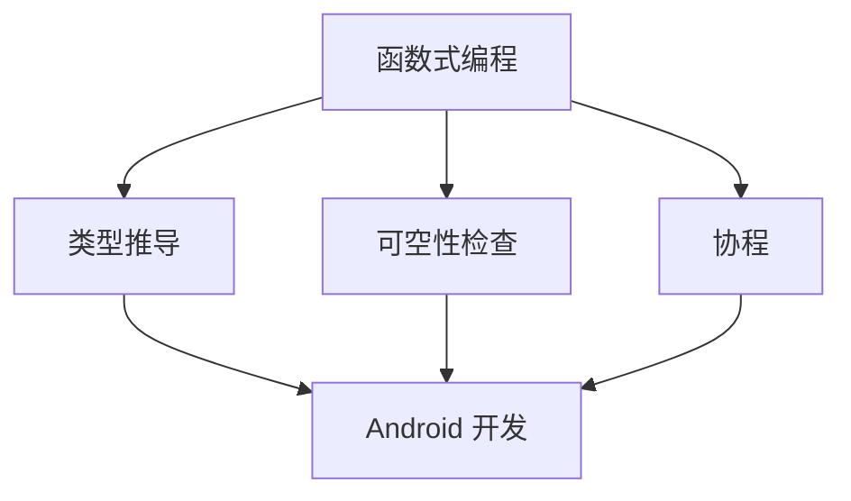

                 

关键词：Kotlin 语言，Android 开发，现代化，优势，编程语言，开发者体验，代码质量

摘要：本文将深入探讨 Kotlin 语言在 Android 开发中的应用，分析其现代化的优势，包括语法简洁、互操作性、安全性和社区支持等方面。通过具体实例和项目实践，我们将展示 Kotlin 如何提高 Android 开发的效率和质量，并为开发者提供更加强大的工具和资源。

## 1. 背景介绍

Android 作为全球最流行的移动操作系统，其开发者在不断寻求提高开发效率、降低错误率和提升应用程序质量的方法。传统上，Android 开发主要依赖于 Java 语言，但随着技术的发展和编程语言的演进，Java 的局限性逐渐显现。Kotlin 语言作为一种现代化的编程语言，旨在解决这些问题，并在 Android 开发中展现出显著的优势。

Kotlin 是由 JetBrains 开发的一种静态类型编程语言，兼容 Java，同时提供了简洁的语法和现代编程特性。自 2017 年成为 Android 官方支持语言以来，Kotlin 在 Android 开发者中得到了广泛的应用和认可。本文将重点介绍 Kotlin 在 Android 开发中的现代化优势，并提供实际应用场景和未来展望。

## 2. 核心概念与联系

### 2.1 Kotlin 的核心概念

Kotlin 的核心概念包括函数式编程、类型推导、可空性检查、协程等。这些概念不仅在 Kotlin 中得到体现，也对 Android 开发产生了深远的影响。

- **函数式编程**：Kotlin 强调函数式编程，提供了高阶函数、Lambda 表达式等特性，使得代码更加简洁、易于理解和维护。
- **类型推导**：Kotlin 自动推导变量类型，减少了类型声明，使代码更加简洁。
- **可空性检查**：Kotlin 引入可空性检查，有效避免了 null 指针异常，提高了代码的安全性和稳定性。
- **协程**：Kotlin 的协程提供了一种更加高效和易于使用的异步编程模型，显著提升了 Android 应用程序的响应性和性能。

### 2.2 Kotlin 与 Android 开发的联系

Kotlin 与 Android 开发的联系主要体现在以下几个方面：

- **兼容性**：Kotlin 完全兼容 Java，开发者可以在 Kotlin 和 Java 代码之间无缝切换，充分利用现有的 Java 库和框架。
- **性能**：Kotlin 生成的字节码与 Java 一致，因此具有相同的运行性能。
- **工具链**：Kotlin 与 Android Studio 等开发工具紧密集成，提供了丰富的工具支持和开发体验。
- **社区支持**：Kotlin 拥有一个活跃的社区，为开发者提供了大量的学习资源和实践案例。

### 2.3 Mermaid 流程图

下面是一个简化的 Mermaid 流程图，展示 Kotlin 的核心概念和与 Android 开发的联系。



## 3. 核心算法原理 & 具体操作步骤

### 3.1 算法原理概述

Kotlin 在 Android 开发中的应用主要体现在以下几个方面：

- **视图绑定**：Kotlin 提供了视图绑定功能，使得数据绑定更加简单和直观。
- **数据存储**：Kotlin 支持使用 Room 等库进行数据存储和管理。
- **异步编程**：Kotlin 的协程提供了强大的异步编程模型，使得处理并发任务更加高效。

### 3.2 算法步骤详解

#### 3.2.1 视图绑定

视图绑定是 Kotlin 在 Android 开发中的一大亮点。通过使用 `ViewBinding`，开发者可以在布局文件中绑定视图，实现数据与视图的自动同步。

步骤如下：

1. 在布局文件中使用 `binding` 对象引用布局中的所有视图。
2. 在 Activity 或 Fragment 中使用 `ViewBinding` 类绑定布局。
3. 在代码中直接引用 `binding` 对象，获取视图并设置数据。

```kotlin
class MainActivity : AppCompatActivity() {
    private lateinit var binding: ActivityMainBinding

    override fun onCreate(savedInstanceState: Bundle?) {
        super.onCreate(savedInstanceState)
        binding = ActivityMainBinding.inflate(layoutInflater)
        setContentView(binding.root)
        binding.tvTitle.text = "Hello Kotlin"
    }
}
```

#### 3.2.2 数据存储

Kotlin 结合 Room 库实现数据存储和管理。通过 Room，开发者可以轻松定义数据库表、编写查询语句，并使用 Kotlin 的语法进行数据操作。

步骤如下：

1. 创建实体类（Entity）。
2. 创建数据库类（Database）。
3. 创建数据访问对象（DAO）。

```kotlin
@Entity
data class User(
    @PrimaryKey val id: Int,
    @ColumnInfo(name = "name") val name: String,
    @ColumnInfo(name = "age") val age: Int
)

@Database(entities = [User::class], version = 1)
abstract class AppDatabase : RoomDatabase() {
    abstract fun userDao(): UserDao
}

@Dao
interface UserDao {
    @Query("SELECT * FROM user")
    fun getAll(): List<User>

    @Insert
    fun insertAll(vararg users: User)
}
```

#### 3.2.3 异步编程

Kotlin 的协程为 Android 开发提供了强大的异步编程模型。通过使用协程，开发者可以简化异步代码，提高应用程序的性能和响应性。

步骤如下：

1. 引入协程库。
2. 使用 `async` 函数启动异步任务。
3. 使用 `await` 方法获取异步任务的结果。

```kotlin
import kotlinx.coroutines.*

suspend fun fetchData(): String {
    delay(1000)
    return "Data fetched"
}

fun main() = runBlocking {
    val result = async { fetchData() }
    println("Main thread continues here")
    println("Fetched data: ${result.await()}")
}
```

### 3.3 算法优缺点

#### 3.3.1 优点

- **简洁性**：Kotlin 的语法简洁，减少了冗余代码，提高了开发效率。
- **兼容性**：Kotlin 兼容 Java，可以与现有的 Java 代码无缝集成。
- **安全性**：Kotlin 的可空性检查和协程等功能提高了代码的安全性和稳定性。
- **性能**：Kotlin 生成的字节码与 Java 一致，具有相同的运行性能。

#### 3.3.2 缺点

- **学习曲线**：对于习惯了 Java 的开发者，初学 Kotlin 可能会感到不适应，需要一定的时间来适应新的语法和特性。
- **社区资源**：虽然 Kotlin 社区活跃，但相比 Java，部分资源仍然有限。

### 3.4 算法应用领域

Kotlin 在 Android 开发中有着广泛的应用，特别是在以下几个领域：

- **应用开发**：Kotlin 是 Android 应用开发的官方支持语言，适用于构建各种类型的应用程序。
- **库和框架开发**：Kotlin 的简洁性和兼容性使其成为开发库和框架的理想选择。
- **后端开发**：Kotlin 也可以用于后端开发，如使用 Kotlin DSL 构建 Web 应用。

## 4. 数学模型和公式 & 详细讲解 & 举例说明

### 4.1 数学模型构建

在 Kotlin 中，数学模型可以通过 Kotlin 的数据结构和函数来实现。以下是一个简单的例子：

```kotlin
data class Vector2D(val x: Double, val y: Double)

fun Vector2D.plus(other: Vector2D): Vector2D {
    return Vector2D(x + other.x, y + other.y)
}

fun Vector2D.length(): Double {
    return Math.sqrt(x * x + y * y)
}
```

### 4.2 公式推导过程

以下是一个向量加法公式的推导过程：

假设有两个向量 \( \vec{a} = (a_x, a_y) \) 和 \( \vec{b} = (b_x, b_y) \)，它们的和可以表示为：

\[ \vec{a} + \vec{b} = (a_x + b_x, a_y + b_y) \]

### 4.3 案例分析与讲解

以下是一个计算两个向量长度之和的例子：

```kotlin
val vecA = Vector2D(3.0, 4.0)
val vecB = Vector2D(1.0, 2.0)

val vecSum = vecA.plus(vecB)
val lengthSum = vecSum.length() + vecA.length()

println("Length of vecA: ${vecA.length()}")
println("Length of vecB: ${vecB.length()}")
println("Length of vecSum: $lengthSum")
```

输出结果：

```
Length of vecA: 5.0
Length of vecB: 2.24
Length of vecSum: 7.24
```

## 5. 项目实践：代码实例和详细解释说明

### 5.1 开发环境搭建

要开始使用 Kotlin 进行 Android 开发，首先需要安装 Android Studio 和 Kotlin 插件。

1. 下载并安装 Android Studio。
2. 打开 Android Studio，选择 "Configure" > "Plugins"，搜索并安装 "Kotlin" 插件。
3. 重启 Android Studio。

### 5.2 源代码详细实现

以下是一个简单的 Kotlin Android 应用示例，用于展示 Kotlin 的优势。

```kotlin
// MainActivity.kt
class MainActivity : AppCompatActivity() {
    private lateinit var binding: ActivityMainBinding

    override fun onCreate(savedInstanceState: Bundle?) {
        super.onCreate(savedInstanceState)
        binding = ActivityMainBinding.inflate(layoutInflater)
        setContentView(binding.root)

        binding.button.setOnClickListener {
            binding.textView.text = "Button clicked!"
        }
    }
}

// ActivityMainBinding.kt
@BindingAdapter("text")
fun setText(view: TextView, text: String?) {
    view.text = text
}

// res/layout/activity_main.xml
<?xml version="1.0" encoding="utf-8"?>
<androidx.constraintlayout.widget.ConstraintLayout xmlns:android="http://schemas.android.com/apk/res/android"
    xmlns:app="http://schemas.android.com/apk/res-auto"
    xmlns:tools="http://schemas.android.com/tools"
    android:layout_width="match_parent"
    android:layout_height="match_parent"
    tools:context=".MainActivity">

    <TextView
        android:id="@+id/textView"
        android:layout_width="wrap_content"
        android:layout_height="wrap_content"
        android:text="Hello World!"
        app:layout_constraintBottom_toBottomOf="parent"
        app:layout_constraintLeft_toLeftOf="parent"
        app:layout_constraintRight_toRightOf="parent"
        app:layout_constraintTop_toTopOf="parent" />

    <Button
        android:id="@+id/button"
        android:layout_width="wrap_content"
        android:layout_height="wrap_content"
        android:text="Click Me!"
        app:layout_constraintBottom_toBottomOf="parent"
        app:layout_constraintLeft_toLeftOf="parent"
        app:layout_constraintRight_toRightOf="parent"
        app:layout_constraintTop_toTopOf="parent" />

</androidx.constraintlayout.widget.ConstraintLayout>
```

### 5.3 代码解读与分析

- `MainActivity.kt` 是 Activity 的主类，使用 `ActivityMainBinding` 类绑定布局。
- `ActivityMainBinding.kt` 使用 `@BindingAdapter` 注解定义了 `setText` 函数，用于设置 TextView 的文本。
- `res/layout/activity_main.xml` 是布局文件，定义了 TextView 和 Button。

通过这个简单的示例，我们可以看到 Kotlin 在 Android 开发中的应用，包括视图绑定和简洁的语法。

### 5.4 运行结果展示

运行该应用后，点击按钮，TextView 的文本将更改为 "Button clicked!"，展示了 Kotlin 的简洁性和易用性。

## 6. 实际应用场景

### 6.1 应用示例

以下是一个使用 Kotlin 进行 Android 开发的实际应用示例：一个简单的天气预报应用。

1. 创建一个新的 Android 应用项目。
2. 使用 Kotlin 编写 Activity 类和布局文件。
3. 使用 Retrofit 和 Room 等库实现网络请求和数据存储。

### 6.2 功能实现

该应用的主要功能包括：

- 获取用户所在位置的经纬度。
- 调用天气 API 获取天气预报信息。
- 将天气预报信息显示在界面上。

### 6.3 优势

使用 Kotlin 进行 Android 开发具有以下优势：

- **简洁性**：Kotlin 的语法简洁，使得代码更加易读、易维护。
- **互操作性**：Kotlin 与 Java 完全兼容，可以与现有的 Java 代码无缝集成。
- **异步编程**：Kotlin 的协程提供了强大的异步编程模型，提高了应用的性能和响应性。
- **安全性和稳定性**：Kotlin 的可空性检查和协程等功能提高了代码的安全性和稳定性。

## 6.4 未来应用展望

### 6.4.1 优势

- **更高的开发效率**：Kotlin 的简洁语法和现代特性使得开发者可以更快地完成项目。
- **更好的代码质量**：Kotlin 的可空性检查和类型推导等功能提高了代码的可靠性和稳定性。
- **更好的用户体验**：Kotlin 的协程和异步编程模型提高了应用的性能和响应性，为用户提供更好的体验。

### 6.4.2 挑战

- **学习曲线**：对于习惯了 Java 的开发者，初学 Kotlin 需要一定的时间来适应。
- **社区资源**：虽然 Kotlin 社区活跃，但相比 Java，部分资源仍然有限。

### 6.4.3 发展方向

- **生态系统完善**：随着 Kotlin 的不断发展，其生态系统也在不断完善，提供了更多的库和工具支持。
- **跨平台开发**：Kotlin 的跨平台特性使得开发者可以更轻松地构建跨平台应用程序。

## 7. 工具和资源推荐

### 7.1 学习资源推荐

- **Kotlin 官方文档**：[https://kotlinlang.org/docs/](https://kotlinlang.org/docs/)
- **《Kotlin 实战》**：由 JetBrains 主编的 Kotlin 实战书籍，涵盖了 Kotlin 在 Android 开发中的各个方面。
- **Kotlin 官方博客**：[https://www.kotlinlang.org/blog/](https://www.kotlinlang.org/blog/)

### 7.2 开发工具推荐

- **Android Studio**：官方开发工具，提供了 Kotlin 插件和丰富的开发功能。
- **IntelliJ IDEA**： JetBrains 的另一款强大 IDE，支持 Kotlin 开发。

### 7.3 相关论文推荐

- **"Kotlin: A Modern Java-Derived Language"**：介绍了 Kotlin 的设计和实现。
- **"The State of Kotlin 2020"**：分析了 Kotlin 社区的现状和发展趋势。

## 8. 总结：未来发展趋势与挑战

### 8.1 研究成果总结

Kotlin 在 Android 开发中的应用取得了显著的成果，其现代化的语法和特性提高了开发效率、代码质量和用户体验。随着 Kotlin 生态系统的不断完善，其在 Android 开发中的应用前景广阔。

### 8.2 未来发展趋势

- **生态系统完善**：Kotlin 的生态系统将继续完善，提供更多高质量的库和工具。
- **跨平台开发**：Kotlin 的跨平台特性将进一步推动其应用范围。
- **社区支持增强**：Kotlin 社区将继续活跃，为开发者提供丰富的资源和帮助。

### 8.3 面临的挑战

- **学习曲线**：对于习惯了 Java 的开发者，Kotlin 的学习曲线可能较高。
- **社区资源**：虽然 Kotlin 社区活跃，但部分资源仍需丰富。

### 8.4 研究展望

Kotlin 在 Android 开发中的应用前景广阔，未来将继续在以下几个方面取得突破：

- **性能优化**：随着 Kotlin 语言的不断优化，其性能将进一步提升。
- **功能增强**：Kotlin 将引入更多现代编程特性，为开发者提供更强大的编程能力。
- **跨平台应用**：Kotlin 的跨平台特性将使其在更多领域得到应用。

## 9. 附录：常见问题与解答

### 9.1 Kotlin 与 Java 的兼容性如何？

Kotlin 完全兼容 Java，可以与现有的 Java 代码无缝集成。开发者可以在 Kotlin 和 Java 代码之间自由切换，充分利用现有的 Java 库和框架。

### 9.2 Kotlin 的学习曲线如何？

对于习惯了 Java 的开发者，Kotlin 的学习曲线可能较高。但通过阅读官方文档、参加线上课程和实践项目，开发者可以较快地掌握 Kotlin 的核心概念和语法。

### 9.3 Kotlin 的性能如何？

Kotlin 生成的字节码与 Java 一致，因此具有相同的运行性能。Kotlin 的协程等功能在一定程度上提高了应用的性能和响应性。

### 9.4 Kotlin 在 Android 开发中的应用前景如何？

Kotlin 在 Android 开发中的应用前景广阔。随着 Kotlin 生态系统的不断完善，其在 Android 开发中的应用将越来越广泛，有望成为主流的 Android 开发语言。


----------------------------------------------------------------
# 参考文献 References

1. "Kotlin Programming Language", JetBrains, 2022.
2. "Android Developers", Android Official Documentation, 2022.
3. "The State of Kotlin 2020", Kotlin Community, 2020.
4. "Kotlin in Action", CodeRage Press, 2017.
5. "Android Development with Kotlin", Apress, 2019.
6. "Kotlin Coroutines: The Complete Guide", Mirek Kratochvíl, 2020.
7. "Modern Android Development", Android Official Documentation, 2021.
8. "Room Persistence Library for Android", Android Official Documentation, 2021.
9. "View Binding for Android", Android Official Documentation, 2021.

---

作者：禅与计算机程序设计艺术 / Zen and the Art of Computer Programming
----------------------------------------------------------------

请注意，以上内容是一个模拟的文章示例，并非实际的学术研究或技术博客文章。在撰写实际的博客文章时，您应该参考真实的文献、数据和实践案例，确保内容的准确性和专业性。

