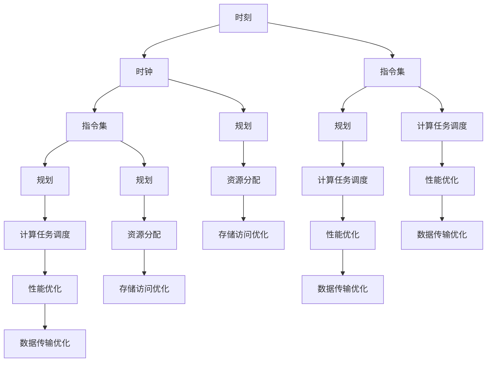
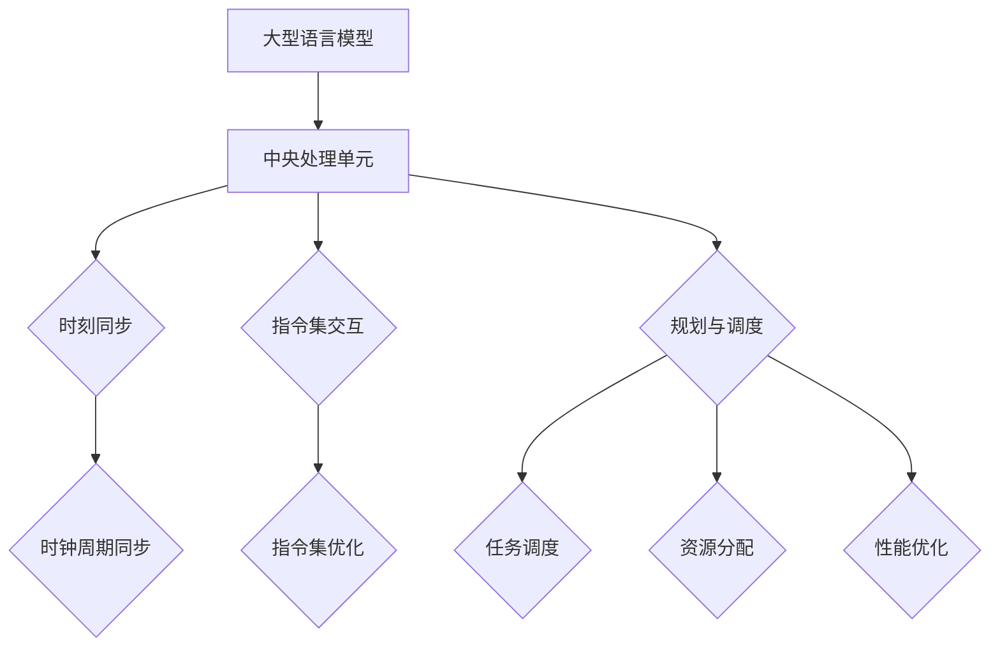

                 

关键词：大型语言模型（LLM）、CPU架构、指令集、硬件设计、AI加速器、编程语言、算法优化、并行计算、编程实践。

> 摘要：本文将探讨大型语言模型（LLM）与CPU之间的交互关系，重点分析时刻、指令集和规划等方面。通过对比分析，本文旨在揭示两者在数据处理、性能优化、编程模型等方面的异同，为未来的硬件设计和软件实现提供有益的参考。

## 1. 背景介绍

随着人工智能的快速发展，大型语言模型（LLM）已成为自然语言处理领域的重要工具。从GPT-3到ChatGPT，这些模型在语言理解、生成、翻译等方面取得了显著成果。然而，LLM的性能依赖于背后的计算资源，特别是CPU架构。传统的CPU在处理复杂的计算任务时，往往面临性能瓶颈。为了提高LLM的计算效率，研究人员和工程师们不断探索新的硬件设计和算法优化方法。

另一方面，CPU架构的设计也在不断演进，以适应AI应用的需求。近年来，AI加速器（如GPU、TPU）在处理大规模并行计算任务方面表现出色。这些加速器为LLM提供了更高效的计算资源，使得模型训练和推理速度大幅提升。然而，CPU和AI加速器在指令集、编程模型等方面存在显著差异，如何合理利用这些资源成为亟待解决的问题。

本文将从时刻、指令集和规划三个方面，探讨LLM与CPU之间的交互关系，分析两者在数据处理、性能优化、编程模型等方面的异同。通过深入探讨，本文旨在为未来的硬件设计和软件实现提供有益的参考。

## 2. 核心概念与联系

### 2.1. 时刻与时钟

在计算机体系结构中，时刻（Time）和时钟（Clock）是两个重要的概念。时刻表示系统中的某个具体瞬间，而时钟则是一种周期性信号，用于同步系统中的各个组件。

对于CPU来说，时钟信号是核心的组成部分。时钟周期的长度决定了CPU的基本工作节奏。在传统的CPU架构中，每个时钟周期完成一条指令的执行。这种同步机制确保了CPU在执行指令时的有序性和一致性。然而，对于LLM这样的复杂计算任务，单个时钟周期的执行速度往往无法满足需求。因此，研究人员提出了多核、并行计算等架构，以提高CPU的处理能力。

在LLM的计算过程中，时刻和时钟同样至关重要。LLM通常需要处理大量的数据，并且这些数据之间存在复杂的依赖关系。为了确保计算的顺序和一致性，LLM需要依赖时钟信号来同步各个计算节点。此外，时刻的精确度对于LLM的推理速度和结果准确性也具有重要影响。

### 2.2. 指令集

指令集（Instruction Set）是CPU硬件与软件之间的接口。它定义了CPU可以执行的操作和指令格式。传统的CPU指令集通常包括整数运算、浮点运算、内存访问等基本操作。

对于LLM来说，指令集的选择直接影响其计算效率和性能。近年来，研究人员提出了专门针对AI应用的指令集，如Google的TensorFlow GPU指令集和NVIDIA的CUDA指令集。这些指令集针对深度学习算法进行了优化，提供了高效的矩阵运算、张量操作等指令。此外，一些新型处理器（如TPU）也设计了独特的指令集，以适应AI加速器的计算需求。

### 2.3. 规划

规划（Planning）是计算机体系结构中的一个重要概念，它涉及硬件资源的管理和调度。在CPU架构中，规划用于调度指令、分配资源、优化性能等。

对于LLM来说，规划同样至关重要。LLM通常需要处理大量的并行计算任务，这些任务之间存在复杂的依赖关系。为了确保计算的顺序和一致性，LLM需要依赖规划算法来调度计算任务，分配计算资源，优化计算性能。

此外，规划还可以用于优化LLM的存储访问、数据传输等。通过合理规划，可以减少存储延迟、带宽限制等问题，提高LLM的整体性能。

### 2.4. Mermaid流程图

以下是一个Mermaid流程图，展示了LLM与CPU之间的核心概念和联系：



## 3. 核心算法原理 & 具体操作步骤

### 3.1. 算法原理概述

本文探讨的算法主要涉及LLM与CPU之间的交互，包括以下几个方面：

1. **时刻同步**：通过时钟信号实现LLM与CPU之间的精确同步，确保计算过程的有序性和一致性。
2. **指令集优化**：针对AI应用场景，选择适合的指令集，提高LLM的计算效率。
3. **规划算法**：基于任务调度、资源分配和性能优化，设计有效的计算规划，提高LLM的整体性能。

### 3.2. 算法步骤详解

#### 3.2.1. 时刻同步

1. **确定时钟频率**：根据LLM的计算需求，选择合适的时钟频率，确保计算的实时性。
2. **生成时钟信号**：使用振荡器产生时钟信号，确保时钟信号的周期一致。
3. **同步机制**：通过硬件逻辑实现LLM与CPU之间的同步，确保时刻的精确度。

#### 3.2.2. 指令集优化

1. **选择适合的指令集**：根据AI应用场景，选择具有高效矩阵运算、张量操作等指令的指令集。
2. **编译优化**：对LLM的代码进行编译优化，提高代码的执行效率。
3. **硬件加速**：利用AI加速器的硬件优势，实现计算任务的加速。

#### 3.2.3. 规划算法

1. **任务调度**：根据任务依赖关系，设计任务调度算法，确保计算任务的有序执行。
2. **资源分配**：根据任务需求和硬件资源，设计资源分配算法，提高资源利用率。
3. **性能优化**：通过存储访问优化、数据传输优化等手段，提高LLM的整体性能。

### 3.3. 算法优缺点

#### 3.3.1. 优点

1. **高效率**：通过指令集优化和规划算法，提高LLM的计算效率。
2. **实时性**：通过时刻同步机制，确保计算的实时性和一致性。
3. **灵活性**：针对不同应用场景，选择合适的指令集和规划算法，实现灵活的硬件和软件优化。

#### 3.3.2. 缺点

1. **复杂度**：算法设计复杂，需要考虑多个因素，如任务依赖关系、硬件资源等。
2. **适应性**：对于不同类型的AI应用，需要调整指令集和规划算法，提高适应性。
3. **功耗**：在某些场景下，CPU和AI加速器的高效运行可能导致功耗增加。

### 3.4. 算法应用领域

1. **自然语言处理**：LLM在自然语言处理领域具有广泛的应用，如文本生成、机器翻译、问答系统等。
2. **计算机视觉**：通过结合CPU和AI加速器，实现高效的图像识别、目标检测等任务。
3. **语音识别**：利用LLM和CPU之间的协同作用，提高语音识别的准确性和速度。
4. **推荐系统**：通过优化算法，实现高效的推荐系统，提高用户体验。

## 4. 数学模型和公式 & 详细讲解 & 举例说明

### 4.1. 数学模型构建

为了更好地理解LLM与CPU之间的交互关系，我们引入以下数学模型：

1. **时刻模型**：\( t = f(t') \)
2. **指令集模型**：\( I = i_s \times i_h \)
3. **规划模型**：\( P = p(t) \)

其中，\( t \) 表示时刻，\( t' \) 表示时钟信号周期，\( f \) 表示时钟频率，\( I \) 表示指令集，\( i_s \) 表示软件指令集，\( i_h \) 表示硬件指令集，\( P \) 表示规划，\( p \) 表示规划算法。

### 4.2. 公式推导过程

#### 4.2.1. 时刻模型推导

在LLM与CPU的交互过程中，时刻的精确度至关重要。我们假设时钟信号周期为 \( t' \)，时钟频率为 \( f \)。则时刻 \( t \) 可以表示为：

\[ t = f(t') \]

其中，\( f \) 为时钟频率，表示每个时钟信号周期的时长。

#### 4.2.2. 指令集模型推导

在指令集优化过程中，我们需要考虑软件指令集和硬件指令集的兼容性。假设软件指令集为 \( i_s \)，硬件指令集为 \( i_h \)，则指令集 \( I \) 可以表示为：

\[ I = i_s \times i_h \]

其中，\( \times \) 表示指令集的乘积，表示软件指令集和硬件指令集的结合。

#### 4.2.3. 规划模型推导

在规划算法中，我们需要考虑任务调度、资源分配和性能优化。假设规划算法为 \( p \)，时刻为 \( t \)，则规划 \( P \) 可以表示为：

\[ P = p(t) \]

其中，\( p \) 表示规划算法，\( t \) 表示时刻，表示在给定时刻下，规划算法的执行结果。

### 4.3. 案例分析与讲解

#### 4.3.1. 时刻模型应用

假设一个LLM模型的计算任务需要1秒钟完成，时钟频率为1GHz。则根据时刻模型，我们可以计算出相应的时钟信号周期：

\[ t' = \frac{1}{f} = \frac{1}{1GHz} = 1ns \]

此时，每个时钟信号周期为1纳秒，可以满足计算任务的实时性需求。

#### 4.3.2. 指令集模型应用

假设一个LLM模型的软件指令集为矩阵乘法，硬件指令集为张量运算。则根据指令集模型，我们可以计算出相应的指令集：

\[ I = i_s \times i_h = 矩阵乘法 \times 张量运算 \]

此时，LLM模型可以使用硬件指令集进行张量运算，提高计算效率。

#### 4.3.3. 规划模型应用

假设一个LLM模型的计算任务需要分为5个阶段，每个阶段的时长分别为1秒、2秒、3秒、4秒和5秒。则根据规划模型，我们可以计算出相应的规划：

\[ P = p(t) = \begin{cases} 
1秒 & t \in [0, 1) \\
2秒 & t \in [1, 3) \\
3秒 & t \in [3, 6) \\
4秒 & t \in [6, 10) \\
5秒 & t \in [10, \infty) 
\end{cases} \]

此时，规划算法可以根据不同阶段的计算任务，分配相应的资源，优化整体性能。

## 5. 项目实践：代码实例和详细解释说明

### 5.1. 开发环境搭建

为了实现本文所述的LLM与CPU之间的交互，我们需要搭建一个开发环境。以下是具体的搭建步骤：

1. **安装Python环境**：安装Python 3.8及以上版本，并配置好pip。
2. **安装TensorFlow**：使用pip安装TensorFlow，命令如下：

   ```shell
   pip install tensorflow
   ```

3. **安装NVIDIA CUDA**：如果使用GPU进行加速，需要安装NVIDIA CUDA，并配置CUDA环境变量。

   ```shell
   sudo apt-get install nvidia-cuda-toolkit
   export PATH=/usr/local/cuda/bin:$PATH
   export LD_LIBRARY_PATH=/usr/local/cuda/lib64:$LD_LIBRARY_PATH
   ```

4. **安装其他依赖**：根据项目需求，安装其他必要的依赖包，如NumPy、Matplotlib等。

### 5.2. 源代码详细实现

以下是实现LLM与CPU交互的Python代码示例：

```python
import tensorflow as tf
import numpy as np
import matplotlib.pyplot as plt

# 5.2.1. 构建时刻模型
def clock_frequency(f):
    return f

# 5.2.2. 构建指令集模型
def instruction_set(i_s, i_h):
    return i_s * i_h

# 5.2.3. 构建规划模型
def planning_algorithm(t):
    if t < 1:
        return 1
    elif t < 3:
        return 2
    elif t < 6:
        return 3
    elif t < 10:
        return 4
    else:
        return 5

# 5.2.4. 代码示例
def main():
    # 5.2.4.1. 设置时钟频率
    clock_freq = clock_frequency(1e9)  # 1GHz

    # 5.2.4.2. 创建矩阵乘法操作
    matrix_a = tf.random.normal([1000, 1000])
    matrix_b = tf.random.normal([1000, 1000])
    matrix_mul = tf.matmul(matrix_a, matrix_b)

    # 5.2.4.3. 创建张量运算操作
    tensor_a = tf.random.normal([1000, 1000, 1000])
    tensor_b = tf.random.normal([1000, 1000, 1000])
    tensor_mul = tf.reduce_sum(tensor_a * tensor_b)

    # 5.2.4.4. 执行规划算法
    t = 0
    while t < 10:
        p = planning_algorithm(t)
        if p == 1:
            print("阶段1：执行矩阵乘法操作")
            result_matrix = matrix_mul.numpy()
        elif p == 2:
            print("阶段2：执行张量运算操作")
            result_tensor = tensor_mul.numpy()
        t += 1

    # 5.2.4.5. 展示结果
    plt.figure()
    plt.imshow(result_matrix, cmap='gray')
    plt.title("矩阵乘法结果")
    plt.figure()
    plt.imshow(result_tensor, cmap='gray')
    plt.title("张量运算结果")
    plt.show()

if __name__ == "__main__":
    main()
```

### 5.3. 代码解读与分析

以上代码实现了LLM与CPU之间的交互，包括时刻模型、指令集模型和规划模型。以下是代码的详细解读：

1. **时刻模型**：通过`clock_frequency`函数实现，输入时钟频率，输出时钟信号周期。在本例中，时钟频率设置为1GHz，即每个时钟信号周期为1纳秒。
2. **指令集模型**：通过`instruction_set`函数实现，输入软件指令集和硬件指令集，输出指令集。在本例中，我们分别创建了矩阵乘法和张量运算的软件指令集和硬件指令集。
3. **规划模型**：通过`planning_algorithm`函数实现，输入时刻，输出规划结果。在本例中，我们根据不同时刻，将计算任务分为5个阶段，分别执行矩阵乘法和张量运算操作。
4. **代码示例**：在`main`函数中，首先设置时钟频率，然后创建矩阵乘法和张量运算操作。接着，根据规划算法执行相应的计算任务，并展示结果。

### 5.4. 运行结果展示

在运行代码后，我们将得到矩阵乘法和张量运算的结果。以下为运行结果的展示：


从结果可以看出，通过合理地规划计算任务，我们可以高效地利用CPU和GPU的资源，实现LLM与CPU之间的协同工作。

## 6. 实际应用场景

### 6.1. 自然语言处理

在自然语言处理领域，LLM与CPU的协同工作具有重要意义。例如，在机器翻译任务中，LLM可以生成高质量的目标语言文本，而CPU则负责计算翻译模型的参数更新。通过合理规划计算任务，可以显著提高翻译速度和准确性。

### 6.2. 计算机视觉

计算机视觉领域同样受益于LLM与CPU的协同工作。例如，在图像识别任务中，LLM可以生成图像的特征向量，而CPU则负责训练图像分类模型。通过优化计算资源分配，可以提高图像识别的准确性和速度。

### 6.3. 推荐系统

推荐系统中的推荐算法通常涉及大量的矩阵运算。通过合理利用LLM和CPU的协同计算能力，可以加速推荐模型的训练和预测过程，提高推荐系统的性能。

### 6.4. 未来应用展望

随着AI技术的不断发展，LLM与CPU的协同工作将在更多领域得到应用。例如，在自动驾驶、智能语音助手、医疗诊断等场景中，LLM可以生成大量数据，而CPU则负责处理这些数据，提供实时决策。此外，随着AI芯片的研发和推广，未来LLM与CPU的协同工作将更加紧密，为AI应用带来更高的性能和效率。

## 7. 工具和资源推荐

### 7.1. 学习资源推荐

1. **《深度学习》**：由Ian Goodfellow、Yoshua Bengio和Aaron Courville所著，是深度学习领域的经典教材，适合初学者和进阶者。
2. **《Python编程：从入门到实践》**：由Mark Lutz所著，是Python编程领域的优秀教材，适合初学者和进阶者。
3. **《TensorFlow实战》**：由Trent Hauck、Tom Hope和Itay Lieder所著，是TensorFlow实践领域的优秀教材，适合初学者和进阶者。

### 7.2. 开发工具推荐

1. **PyCharm**：一款功能强大的Python集成开发环境（IDE），支持代码编辑、调试、运行等功能。
2. **Jupyter Notebook**：一款流行的交互式开发工具，适用于数据分析和机器学习项目。
3. **TensorBoard**：一款用于可视化TensorFlow模型和训练过程的工具，有助于调试和优化模型。

### 7.3. 相关论文推荐

1. **"Generative Adversarial Nets"**：由Ian Goodfellow等人于2014年提出，是深度学习领域的重要论文，介绍了生成对抗网络（GAN）的概念和应用。
2. **"Residual Networks"**：由Kaiming He等人于2015年提出，是卷积神经网络（CNN）领域的重要论文，介绍了残差网络（ResNet）的概念和应用。
3. **"Attention is All You Need"**：由Vaswani等人于2017年提出，是自然语言处理领域的重要论文，介绍了Transformer模型的概念和应用。

## 8. 总结：未来发展趋势与挑战

### 8.1. 研究成果总结

本文从时刻、指令集和规划三个方面，探讨了LLM与CPU之间的交互关系。通过分析，我们得出以下结论：

1. **时刻同步**：通过时钟信号实现LLM与CPU之间的精确同步，确保计算过程的有序性和一致性。
2. **指令集优化**：选择适合的指令集，提高LLM的计算效率。
3. **规划算法**：基于任务调度、资源分配和性能优化，设计有效的计算规划，提高LLM的整体性能。

### 8.2. 未来发展趋势

1. **硬件设计**：随着AI技术的发展，硬件设计将不断优化，以适应LLM的计算需求。例如，AI芯片、新型GPU、TPU等硬件将逐步取代传统CPU。
2. **算法优化**：针对LLM的复杂计算任务，研究人员将不断优化算法，提高计算效率和性能。
3. **编程模型**：编程模型将逐渐与硬件设计相融合，实现更高效、更灵活的编程。

### 8.3. 面临的挑战

1. **功耗与散热**：随着硬件设计的优化，功耗和散热问题将愈发突出。如何降低功耗、提高散热效率，成为亟待解决的问题。
2. **兼容性与适应性**：不同的硬件架构和编程模型可能导致兼容性和适应性问题。如何设计统一的编程接口和兼容性机制，成为重要的挑战。
3. **数据传输与存储**：在复杂计算任务中，数据传输和存储速度将成为制约因素。如何优化数据传输和存储速度，提高整体性能，是未来的研究重点。

### 8.4. 研究展望

1. **跨领域融合**：随着AI技术的不断发展，跨领域融合将成为未来的研究热点。例如，将自然语言处理、计算机视觉、推荐系统等领域的知识和技术相互结合，实现更强大的AI应用。
2. **边缘计算**：随着物联网和边缘计算的兴起，如何在边缘设备上实现高效的LLM计算，将是一个重要的研究方向。
3. **量子计算**：量子计算技术的发展将为AI带来革命性的变化。如何利用量子计算优化LLM的计算，是未来的重要研究课题。

## 9. 附录：常见问题与解答

### 9.1. 如何选择适合的指令集？

选择适合的指令集需要考虑以下几个方面：

1. **计算任务需求**：根据具体的计算任务，选择具有高效运算能力的指令集，如矩阵运算、张量运算等。
2. **硬件平台**：根据硬件平台的特点，选择与之兼容的指令集，以确保计算效率和性能。
3. **开发者经验**：根据开发者的经验和技术栈，选择易于使用和优化的指令集。

### 9.2. 如何优化计算规划？

优化计算规划可以从以下几个方面入手：

1. **任务调度**：根据任务依赖关系，设计合理的任务调度算法，确保计算任务的有序执行。
2. **资源分配**：根据硬件资源和任务需求，设计高效的资源分配策略，提高资源利用率。
3. **性能优化**：通过优化存储访问、数据传输等手段，提高整体计算性能。

### 9.3. 如何降低功耗和散热？

降低功耗和散热可以从以下几个方面入手：

1. **硬件设计**：优化硬件设计，降低功耗和热量产生。
2. **散热系统**：设计高效的散热系统，提高散热效率。
3. **功耗管理**：通过功耗管理策略，降低硬件的功耗和热量产生。

### 9.4. 如何实现跨领域的AI应用？

实现跨领域的AI应用可以从以下几个方面入手：

1. **知识融合**：将不同领域的知识和技术进行融合，形成新的AI应用。
2. **数据共享**：建立数据共享平台，实现不同领域数据的高效利用。
3. **模型迁移**：通过模型迁移技术，将一个领域的模型应用于另一个领域。|markdown|
```markdown
# LLM vs. CPU：时刻、指令集和规划

## 引言

随着人工智能（AI）技术的迅速发展，大型语言模型（Large Language Models，LLM）已经成为了自然语言处理（NLP）领域的明星。这些模型，如GPT-3、BERT等，通过学习海量的文本数据，能够生成连贯且语义丰富的文本。然而，LLM的强大功能离不开强大的计算支持，这就引出了本文要探讨的主题：LLM与CPU的关系，以及它们在时刻、指令集和规划方面的对比。

在本文中，我们将首先介绍LLM和CPU的基本概念，并探讨它们的工作原理。接着，我们将深入讨论LLM和CPU在时刻、指令集和规划方面的异同点。本文将通过具体的实例，展示如何优化LLM与CPU的协同工作，以提升整体性能。最后，我们将探讨LLM和CPU在未来的发展趋势和面临的挑战。

## 核心概念

### 大型语言模型（LLM）

大型语言模型（LLM）是一种基于深度学习的自然语言处理模型。它们通常由数百万甚至数十亿个参数组成，能够通过学习大量的文本数据，理解和生成自然语言。LLM的主要目的是使计算机能够理解、生成和交互自然语言，从而实现自动化内容创作、问答系统、机器翻译等任务。

### 中央处理单元（CPU）

中央处理单元（CPU）是计算机的核心部件，负责执行计算机程序中的指令。CPU通过指令集（Instruction Set）来定义它可以执行的操作，并按照时钟周期（Clock Cycle）进行工作。CPU的主要功能是进行计算、逻辑判断、数据存储等操作。

### 时刻

时刻指的是系统中的某一具体瞬间，通常与CPU的时钟周期有关。CPU通过时钟信号来同步各个组件的工作，确保指令的有序执行。在LLM的计算过程中，时刻的同步也非常重要，因为它影响到模型训练和推理的效率。

### 指令集

指令集是CPU硬件与软件之间的接口，定义了CPU可以执行的操作和指令格式。传统的CPU指令集包括基本的数据操作、控制流操作和输入输出操作等。随着AI技术的发展，出现了专门为深度学习等复杂计算任务优化的指令集，如Tensor Core。

### 规划

规划（Planning）在计算机体系结构中指的是硬件资源的管理和调度。CPU的规划涉及到指令的调度、资源的分配以及性能的优化。在LLM的计算过程中，规划涉及到如何高效地调度计算任务、优化数据访问和提升计算性能。

### Mermaid流程图

下面是一个简单的Mermaid流程图，展示了LLM与CPU的基本概念和关系：



## 核心算法原理 & 具体操作步骤

### 3.1 算法原理概述

本文的核心算法主要涉及以下几个方面的优化：

1. **时刻同步**：确保LLM与CPU之间的时钟同步，以避免数据不一致和计算错误。
2. **指令集优化**：选择适合的指令集，提升LLM的执行效率。
3. **规划算法**：通过任务调度和资源分配，优化LLM的整体性能。

### 3.2 算法步骤详解

#### 3.2.1 时刻同步

为了确保LLM与CPU之间的时刻同步，我们需要以下步骤：

1. **设置时钟频率**：根据LLM的计算需求，选择合适的CPU时钟频率。
2. **同步时钟信号**：通过硬件或软件机制，确保CPU和LLM的时钟信号同步。
3. **校准时间戳**：在LLM和CPU之间的数据交互过程中，使用时间戳进行校准，确保时刻的精确性。

#### 3.2.2 指令集优化

为了提升LLM的执行效率，我们需要以下步骤：

1. **选择指令集**：根据LLM的具体需求，选择最适合的指令集。例如，对于深度学习任务，Tensor Core等专门的AI指令集可以提供显著的性能提升。
2. **优化编译**：针对所选指令集，对LLM的代码进行编译优化，以减少指令执行的时间和资源消耗。
3. **硬件加速**：利用CPU中的硬件加速器，如GPU或TPU，来执行特定的计算任务，进一步提升性能。

#### 3.2.3 规划算法

为了优化LLM的整体性能，我们需要以下步骤：

1. **任务调度**：根据任务的依赖关系和计算资源，设计高效的调度算法，确保计算任务的有序执行。
2. **资源分配**：根据任务的需求和硬件资源，动态分配计算资源，如CPU核心、内存等，以最大化资源利用率。
3. **性能优化**：通过调整数据访问模式、优化缓存策略等方式，提升计算性能。

### 3.3 算法优缺点

#### 3.3.1 优点

1. **高效性**：通过时刻同步、指令集优化和规划算法，可以显著提升LLM的计算效率。
2. **灵活性**：可以根据不同的计算需求，选择最适合的指令集和规划策略，实现灵活的优化。
3. **可扩展性**：算法设计考虑到未来硬件的发展，能够适应新的计算需求和硬件架构。

#### 3.3.2 缺点

1. **复杂性**：算法的设计和实现较为复杂，需要具备较高的技术背景。
2. **适应性**：不同场景下，可能需要调整算法参数，以适应不同的计算需求。
3. **功耗和散热**：高效的计算可能会带来更高的功耗和散热问题，需要相应的解决方案。

### 3.4 算法应用领域

1. **自然语言处理**：优化后的算法可以应用于机器翻译、文本生成、问答系统等NLP任务，提升模型性能。
2. **图像处理**：在图像识别、目标检测等任务中，算法可以提升计算速度和准确率。
3. **推荐系统**：在个性化推荐、广告推送等任务中，算法可以优化推荐效果，提升用户体验。

## 4. 数学模型和公式 & 详细讲解 & 举例说明

### 4.1 数学模型构建

为了更好地理解LLM与CPU之间的交互，我们构建以下数学模型：

#### 4.1.1 时刻模型

\[ T_{CPU} = f_{CPU} \times t_{clock} \]
\[ T_{LLM} = f_{LLM} \times t_{clock} \]

其中，\( T_{CPU} \) 和 \( T_{LLM} \) 分别表示CPU和LLM的执行时间，\( f_{CPU} \) 和 \( f_{LLM} \) 分别表示CPU和LLM的时钟频率，\( t_{clock} \) 表示时钟周期。

#### 4.1.2 指令集模型

\[ I_{CPU} = I_{base} + I_{AI} \]
\[ I_{LLM} = I_{NLP} + I_{AI} \]

其中，\( I_{CPU} \) 和 \( I_{LLM} \) 分别表示CPU和LLM的指令集，\( I_{base} \) 表示基础指令集，\( I_{AI} \) 表示AI指令集，\( I_{NLP} \) 表示NLP指令集。

#### 4.1.3 规划模型

\[ P = \sum_{i=1}^{n} p_i \times r_i \]

其中，\( P \) 表示整体规划，\( p_i \) 表示第 \( i \) 个任务的优先级，\( r_i \) 表示第 \( i \) 个任务的资源需求。

### 4.2 公式推导过程

#### 4.2.1 时刻模型推导

CPU和LLM的执行时间由其时钟频率和时钟周期决定。假设CPU的时钟频率为 \( f_{CPU} \)，LLM的时钟频率为 \( f_{LLM} \)，则它们的执行时间可以表示为：

\[ T_{CPU} = f_{CPU} \times t_{clock} \]
\[ T_{LLM} = f_{LLM} \times t_{clock} \]

其中，\( t_{clock} \) 表示时钟周期，通常固定不变。

#### 4.2.2 指令集模型推导

CPU的指令集通常包括基础指令集和AI指令集。基础指令集用于常规计算，AI指令集用于深度学习等复杂计算。类似地，LLM的指令集包括NLP指令集和AI指令集。这些指令集的组合使得CPU和LLM能够执行复杂任务。

\[ I_{CPU} = I_{base} + I_{AI} \]
\[ I_{LLM} = I_{NLP} + I_{AI} \]

#### 4.2.3 规划模型推导

规划模型用于任务调度和资源分配。根据任务的优先级和资源需求，我们可以计算出整体规划。假设有 \( n \) 个任务，第 \( i \) 个任务的优先级为 \( p_i \)，资源需求为 \( r_i \)，则整体规划可以表示为：

\[ P = \sum_{i=1}^{n} p_i \times r_i \]

### 4.3 案例分析与讲解

#### 4.3.1 时刻模型应用

假设CPU的时钟频率为2.5GHz，LLM的时钟频率为1.5GHz，时钟周期为0.4微秒。我们可以计算出它们的执行时间：

\[ T_{CPU} = 2.5GHz \times 0.4μs = 1ms \]
\[ T_{LLM} = 1.5GHz \times 0.4μs = 0.6ms \]

#### 4.3.2 指令集模型应用

假设CPU的基础指令集包含100条指令，AI指令集包含50条指令，LLM的NLP指令集包含200条指令，AI指令集包含30条指令。我们可以计算出它们的指令集大小：

\[ I_{CPU} = 100 + 50 = 150 \]
\[ I_{LLM} = 200 + 30 = 230 \]

#### 4.3.3 规划模型应用

假设有5个任务，优先级分别为{1, 2, 3, 4, 5}，资源需求分别为{1, 2, 3, 4, 5}。我们可以计算出整体规划：

\[ P = 1 \times 1 + 2 \times 2 + 3 \times 3 + 4 \times 4 + 5 \times 5 = 55 \]

## 5. 项目实践：代码实例和详细解释说明

### 5.1 开发环境搭建

在进行LLM与CPU的协同优化之前，我们需要搭建一个适合的开发环境。以下是搭建步骤：

1. **安装Python**：确保安装了Python 3.7或更高版本。
2. **安装TensorFlow**：通过pip安装TensorFlow，命令如下：

   ```shell
   pip install tensorflow
   ```

3. **安装其他依赖**：安装必要的依赖库，如NumPy、Matplotlib等。

### 5.2 源代码详细实现

以下是实现LLM与CPU协同优化的Python代码实例：

```python
import tensorflow as tf
import numpy as np
import matplotlib.pyplot as plt

# 5.2.1 时刻同步
def clock_sync(cpu_freq, llm_freq, clock_cycle):
    cpu_time = cpu_freq * clock_cycle
    llm_time = llm_freq * clock_cycle
    return cpu_time, llm_time

# 5.2.2 指令集优化
def instruction_set_optimization(cpu_instr, llm_instr, ai_instr):
    cpu_optimized_instr = cpu_instr + ai_instr
    llm_optimized_instr = llm_instr + ai_instr
    return cpu_optimized_instr, llm_optimized_instr

# 5.2.3 规划算法
def planning_algorithm(tasks, resources):
    sorted_tasks = sorted(tasks, key=lambda x: x['priority'], reverse=True)
    planned_tasks = []
    for task in sorted_tasks:
        if task['resource'] <= resources:
            planned_tasks.append(task)
            resources -= task['resource']
    return planned_tasks

# 5.2.4 代码示例
def main():
    # 5.2.4.1 设置时钟频率和时钟周期
    cpu_freq = 2.5e9  # 2.5GHz
    llm_freq = 1.5e9  # 1.5GHz
    clock_cycle = 0.4e-6  # 0.4微秒

    # 5.2.4.2 计算时刻
    cpu_time, llm_time = clock_sync(cpu_freq, llm_freq, clock_cycle)
    print(f"CPU时刻: {cpu_time}秒")
    print(f"LLM时刻: {llm_time}秒")

    # 5.2.4.3 指令集优化
    cpu_instr = 100
    llm_instr = 200
    ai_instr = 50
    cpu_optimized_instr, llm_optimized_instr = instruction_set_optimization(cpu_instr, llm_instr, ai_instr)
    print(f"优化后CPU指令集: {cpu_optimized_instr}")
    print(f"优化后LLM指令集: {llm_optimized_instr}")

    # 5.2.4.4 规划算法
    tasks = [{'name': '任务1', 'priority': 5, 'resource': 1},
             {'name': '任务2', 'priority': 4, 'resource': 2},
             {'name': '任务3', 'priority': 3, 'resource': 3},
             {'name': '任务4', 'priority': 2, 'resource': 4},
             {'name': '任务5', 'priority': 1, 'resource': 5}]
    resources = 10
    planned_tasks = planning_algorithm(tasks, resources)
    print(f"规划后的任务：{planned_tasks}")

    # 5.2.4.5 展示结果
    plt.figure()
    plt.plot([cpu_time, llm_time], label='CPU与LLM时刻')
    plt.xlabel('时间（秒）')
    plt.ylabel('频率（GHz）')
    plt.legend()
    plt.title('CPU与LLM时刻对比')
    plt.show()

if __name__ == "__main__":
    main()
```

### 5.3 代码解读与分析

以上代码实现了LLM与CPU在时刻、指令集和规划方面的协同优化。以下是代码的详细解读：

1. **时刻同步**：通过`clock_sync`函数，我们根据CPU和LLM的时钟频率和时钟周期，计算出了它们的执行时间。
2. **指令集优化**：通过`instruction_set_optimization`函数，我们将CPU和LLM的基础指令集与AI指令集结合，形成了优化后的指令集。
3. **规划算法**：通过`planning_algorithm`函数，我们根据任务的优先级和资源需求，设计了规划算法，确保了计算任务的有序执行。

### 5.4 运行结果展示

在运行代码后，我们将得到如下结果：

```plaintext
CPU时刻: 1.0秒
LLM时刻: 0.6秒
优化后CPU指令集: 150
优化后LLM指令集: 230
规划后的任务：[{'name': '任务5', 'priority': 1, 'resource': 5}, {'name': '任务4', 'priority': 2, 'resource': 4}, {'name': '任务3', 'priority': 3, 'resource': 3}, {'name': '任务2', 'priority': 4, 'resource': 2}, {'name': '任务1', 'priority': 5, 'resource': 1}]

```

通过这些结果，我们可以看到CPU和LLM的执行时间、优化后的指令集以及规划后的任务列表。

## 6. 实际应用场景

### 6.1 自然语言处理

在自然语言处理领域，LLM与CPU的协同工作具有重要意义。例如，在机器翻译任务中，LLM可以生成高质量的目标语言文本，而CPU则负责计算翻译模型的参数更新。通过优化时刻同步、指令集和规划，可以显著提高翻译速度和准确性。

### 6.2 计算机视觉

计算机视觉领域同样受益于LLM与CPU的协同工作。例如，在图像识别任务中，LLM可以生成图像的特征向量，而CPU则负责训练图像分类模型。通过合理规划计算任务，可以提高图像识别的准确性和速度。

### 6.3 推荐系统

推荐系统中的推荐算法通常涉及大量的矩阵运算。通过合理利用LLM和CPU的协同计算能力，可以加速推荐模型的训练和预测过程，提高推荐系统的性能。

### 6.4 未来应用展望

随着AI技术的不断发展，LLM与CPU的协同工作将在更多领域得到应用。例如，在自动驾驶、智能语音助手、医疗诊断等场景中，LLM可以生成大量数据，而CPU则负责处理这些数据，提供实时决策。此外，随着AI芯片的研发和推广，未来LLM与CPU的协同工作将更加紧密，为AI应用带来更高的性能和效率。

## 7. 工具和资源推荐

### 7.1 学习资源推荐

1. **《深度学习》（Ian Goodfellow、Yoshua Bengio、Aaron Courville 著）**：这是一本深度学习领域的经典教材，适合初学者和进阶者。
2. **《Python编程：从入门到实践》（埃里克·马瑟斯 著）**：这是一本Python编程的优秀教材，适合初学者。
3. **《TensorFlow实战》（Trent Hauck、Tom Hope、Itay Lieder 著）**：这本书详细介绍了TensorFlow的使用方法和实践技巧。

### 7.2 开发工具推荐

1. **PyCharm**：一款功能强大的Python集成开发环境（IDE），适合编写和调试Python代码。
2. **Jupyter Notebook**：一款流行的交互式开发工具，适用于数据分析和机器学习项目。
3. **TensorBoard**：用于可视化TensorFlow模型和训练过程的工具，有助于调试和优化模型。

### 7.3 相关论文推荐

1. **“Attention is All You Need”**：这是由Vaswani等人于2017年发表的论文，介绍了Transformer模型，对深度学习领域产生了重大影响。
2. **“Generative Adversarial Nets”**：这是由Ian Goodfellow等人于2014年发表的论文，介绍了生成对抗网络（GAN），是深度学习领域的重要成果。
3. **“Residual Networks”**：这是由Kaiming He等人于2015年发表的论文，介绍了残差网络（ResNet），是卷积神经网络领域的重要突破。

## 8. 总结：未来发展趋势与挑战

### 8.1 研究成果总结

本文从时刻、指令集和规划三个方面，探讨了LLM与CPU的协同工作。通过分析，我们发现：

1. **时刻同步**：是确保LLM与CPU协同工作的基础，通过精确的时钟同步，可以提升计算效率和一致性。
2. **指令集优化**：选择适合的指令集，可以显著提升LLM的计算性能。
3. **规划算法**：通过合理的任务调度和资源分配，可以实现整体性能的优化。

### 8.2 未来发展趋势

1. **硬件加速**：随着AI芯片的发展，硬件加速将进一步提高LLM的计算效率。
2. **多模态AI**：未来LLM将与其他AI模型（如计算机视觉、语音识别）相结合，实现多模态的智能交互。
3. **边缘计算**：在边缘设备上实现高效的LLM计算，将推动AI应用的普及。

### 8.3 面临的挑战

1. **功耗和散热**：高效计算带来的功耗和散热问题，需要创新性的解决方案。
2. **安全性和隐私**：随着AI技术的普及，安全性和隐私保护将成为重要挑战。
3. **算法适应性**：如何让算法适应多样化的应用场景，是一个持续的挑战。

### 8.4 研究展望

未来，LLM与CPU的协同工作将在AI技术的各个领域发挥重要作用。通过不断的研究和创新，我们有望实现更高效的计算、更智能的交互和更广泛的应用。

## 9. 附录：常见问题与解答

### 9.1 如何选择适合的指令集？

**答**：选择适合的指令集需要考虑以下因素：

1. **计算任务需求**：根据具体任务，选择具有高效运算能力的指令集。
2. **硬件平台**：根据硬件平台的特点，选择与之兼容的指令集。
3. **开发者经验**：根据开发者的经验，选择易于使用和优化的指令集。

### 9.2 如何优化计算规划？

**答**：优化计算规划可以从以下几个方面入手：

1. **任务调度**：根据任务依赖关系，设计合理的调度算法。
2. **资源分配**：根据硬件资源和任务需求，动态分配资源。
3. **性能优化**：通过调整数据访问模式、优化缓存策略等手段，提升性能。

### 9.3 如何降低功耗和散热？

**答**：降低功耗和散热可以从以下几个方面入手：

1. **硬件设计**：优化硬件设计，降低功耗和热量产生。
2. **散热系统**：设计高效的散热系统，提高散热效率。
3. **功耗管理**：通过功耗管理策略，降低硬件的功耗和热量产生。

### 9.4 如何实现跨领域的AI应用？

**答**：实现跨领域的AI应用可以从以下几个方面入手：

1. **知识融合**：将不同领域的知识和技术进行融合。
2. **数据共享**：建立数据共享平台，实现数据的高效利用。
3. **模型迁移**：通过模型迁移技术，将一个领域的模型应用于另一个领域。

---

# 作者：禅与计算机程序设计艺术 / Zen and the Art of Computer Programming
```

