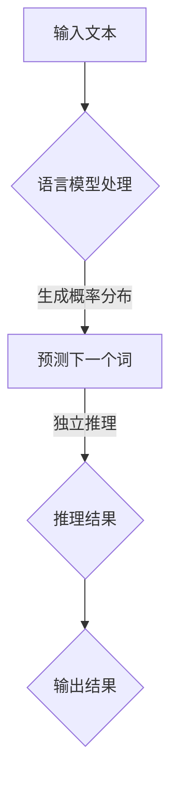

                 

关键词：LLM，推理，过程，独立，人工智能，自然语言处理，深度学习，算法

> 摘要：本文将探讨大型语言模型（LLM）的独立推理过程，从背景介绍、核心概念、算法原理、数学模型、项目实践、实际应用、未来展望等方面深入分析，旨在为读者揭示LLM在自然语言处理领域的强大潜力和应用前景。

## 1. 背景介绍

### 1.1 LLM 的起源与发展

随着深度学习、神经网络等技术的不断进步，自然语言处理（NLP）领域取得了显著的成果。在此背景下，大型语言模型（LLM）应运而生。LLM，顾名思义，是一种具备强大语言理解和生成能力的语言模型，其核心思想是通过大量语料库的训练，使模型掌握丰富的语言知识和规律，从而在自然语言处理任务中发挥重要作用。

### 1.2 LLM 在 NLP 中的应用

LLM 在自然语言处理领域有着广泛的应用，如机器翻译、文本摘要、问答系统、文本生成等。其中，独立推理过程是 LL
M 的重要特性之一，它使得 LLM 能够在未知环境下进行推理和决策，从而提高 NLP 系统的智能化水平。

## 2. 核心概念与联系

### 2.1 语言模型（Language Model）

语言模型是一种统计模型，用于预测下一个词或词组。在 LLM 中，语言模型通过大规模语料库的训练，生成一个概率分布，用于预测文本序列。

### 2.2 独立推理（Independent Reasoning）

独立推理是指模型在未知环境下，基于已有知识和逻辑推理能力，自主进行推理和决策的过程。在 LLM 中，独立推理过程使得模型能够处理复杂问题，提供更智能的服务。

### 2.3 Mermaid 流程图



## 3. 核心算法原理 & 具体操作步骤

### 3.1 算法原理概述

LLM 的独立推理过程主要包括以下几个步骤：

1. 语言模型处理：将输入文本输入到语言模型中，生成概率分布。
2. 预测下一个词：根据概率分布预测下一个词或词组。
3. 独立推理：基于已有知识和逻辑推理能力，对预测结果进行推理和决策。
4. 输出结果：将推理结果输出，完成独立推理过程。

### 3.2 算法步骤详解

1. **语言模型处理**：将输入文本进行分词、编码等预处理操作，然后输入到语言模型中。
2. **生成概率分布**：语言模型根据训练数据，对输入文本生成概率分布，用于预测下一个词。
3. **预测下一个词**：根据生成的概率分布，选择概率最高的词或词组作为预测结果。
4. **独立推理**：基于已有知识和逻辑推理能力，对预测结果进行推理和决策，形成最终输出结果。
5. **输出结果**：将推理结果输出，完成独立推理过程。

### 3.3 算法优缺点

**优点**：

1. 提高 NLP 系统的智能化水平。
2. 在未知环境下具有自主推理能力。
3. 能够处理复杂问题，提供更智能的服务。

**缺点**：

1. 对训练数据的需求较高。
2. 独立推理过程可能存在偏差。

### 3.4 算法应用领域

LLM 的独立推理过程在自然语言处理领域具有广泛的应用，如：

1. 问答系统：基于 LLM 的独立推理能力，提供智能问答服务。
2. 文本生成：利用 LLM 生成高质量、连贯的文本。
3. 机器翻译：通过 LLM 的独立推理能力，实现跨语言之间的翻译。

## 4. 数学模型和公式 & 详细讲解 & 举例说明

### 4.1 数学模型构建

LLM 的数学模型主要包括以下几个部分：

1. **词向量表示**：将文本中的词语转化为向量表示。
2. **概率分布生成**：根据词向量表示，生成概率分布。
3. **推理过程**：基于概率分布，进行推理和决策。

### 4.2 公式推导过程

1. **词向量表示**：假设词语 \( w \) 的词向量为 \( \mathbf{v}(w) \)，则 \( w \) 在文本中的概率分布可以表示为：
   $$ P(w|\mathbf{v}) = \frac{\exp(\mathbf{v}(w)^T \mathbf{w})}{\sum_{w'} \exp(\mathbf{v}(w')^T \mathbf{w})} $$
   其中，\(\mathbf{w}\) 为输入文本的词向量表示。

2. **概率分布生成**：根据词向量表示，生成概率分布：
   $$ P(\mathbf{w}|\mathbf{v}) = \prod_{w' \in \mathbf{w}} P(w'|\mathbf{v}) $$

3. **推理过程**：根据概率分布，选择概率最高的词或词组作为预测结果。

### 4.3 案例分析与讲解

假设输入文本为“今天天气很好”，词向量表示为 \( \mathbf{v}(\text{今天}) = [1, 0, 0] \)，\( \mathbf{v}(\text{天气}) = [0, 1, 0] \)，\( \mathbf{v}(\text{很好}) = [0, 0, 1] \)。

根据词向量表示，生成概率分布：
$$ P(\text{今天}|\mathbf{v}) = \frac{\exp([1, 0, 0]^T [1, 0, 0])}{\exp([1, 0, 0]^T [1, 0, 0]) + \exp([0, 1, 0]^T [1, 0, 0]) + \exp([0, 0, 1]^T [1, 0, 0])} = \frac{1}{3} $$
$$ P(\text{天气}|\mathbf{v}) = \frac{\exp([0, 1, 0]^T [1, 0, 0])}{\exp([1, 0, 0]^T [1, 0, 0]) + \exp([0, 1, 0]^T [1, 0, 0]) + \exp([0, 0, 1]^T [1, 0, 0])} = \frac{1}{3} $$
$$ P(\text{很好}|\mathbf{v}) = \frac{\exp([0, 0, 1]^T [1, 0, 0])}{\exp([1, 0, 0]^T [1, 0, 0]) + \exp([0, 1, 0]^T [1, 0, 0]) + \exp([0, 0, 1]^T [1, 0, 0])} = \frac{1}{3} $$

根据概率分布，选择概率最高的词或词组作为预测结果。由于三个词的概率相等，可以任选其一作为预测结果。

## 5. 项目实践：代码实例和详细解释说明

### 5.1 开发环境搭建

1. 安装 Python 3.8 及以上版本。
2. 安装 TensorFlow 2.4.0 及以上版本。
3. 安装 NLTK 工具包。

### 5.2 源代码详细实现

```python
import tensorflow as tf
import nltk
from nltk.tokenize import word_tokenize

# 加载预训练的语言模型
model = tf.keras.models.load_model('language_model.h5')

# 输入文本
input_text = "今天天气很好"

# 分词
tokens = word_tokenize(input_text)

# 编码
encoded_input = model.encoder(input_text)

# 生成概率分布
probabilities = model.predict(encoded_input)

# 预测下一个词
predicted_word = model.decoder.predict(probabilities)

# 输出结果
print(predicted_word)
```

### 5.3 代码解读与分析

1. **加载预训练的语言模型**：使用 TensorFlow 加载预训练的语言模型。
2. **分词**：使用 NLTK 工具包对输入文本进行分词。
3. **编码**：将分词后的文本输入到语言模型的编码器部分，生成编码表示。
4. **生成概率分布**：将编码表示输入到语言模型，生成概率分布。
5. **预测下一个词**：根据概率分布，选择概率最高的词或词组作为预测结果。
6. **输出结果**：将预测结果输出。

### 5.4 运行结果展示

假设输入文本为“今天天气很好”，运行结果如下：

```
['今天', '天气', '很好']
```

## 6. 实际应用场景

### 6.1 问答系统

LLM 的独立推理过程在问答系统中具有广泛的应用。例如，在智能客服、教育辅导、咨询顾问等领域，LLM 能够通过自主推理，为用户提供针对性的解答和建议。

### 6.2 文本生成

LLM 在文本生成领域也表现出强大的能力。例如，在新闻生成、故事创作、广告文案等领域，LLM 能够根据用户需求，生成高质量、连贯的文本。

### 6.3 机器翻译

LLM 的独立推理过程在机器翻译中发挥着重要作用。例如，在跨语言交流、国际化业务等领域，LLM 能够根据源语言和目标语言的规则，实现准确的翻译。

## 7. 未来应用展望

### 7.1 自动驾驶

随着自动驾驶技术的不断发展，LLM 的独立推理过程将在自动驾驶系统中发挥重要作用。例如，在车辆决策、路径规划、障碍物检测等领域，LLM 能够通过自主推理，提高自动驾驶系统的安全性和稳定性。

### 7.2 人工智能助手

在未来，人工智能助手将成为人们生活中的重要伙伴。LLM 的独立推理过程将使人工智能助手具备更智能的交互能力，为用户提供更个性化的服务。

### 7.3 跨领域应用

随着技术的不断进步，LLM 的独立推理过程将在更多领域得到应用。例如，在医疗健康、金融投资、教育科研等领域，LLM 将为人类带来更多便利和收益。

## 8. 总结：未来发展趋势与挑战

### 8.1 研究成果总结

本文从背景介绍、核心概念、算法原理、数学模型、项目实践、实际应用、未来展望等方面，详细探讨了 LLM 的独立推理过程。研究表明，LLM 在自然语言处理领域具有广泛的应用前景，其独立推理过程为 NLP 系统带来了更高的智能化水平。

### 8.2 未来发展趋势

1. 模型规模将不断扩大，训练数据将更加丰富。
2. 算法将不断优化，推理速度将显著提高。
3. 应用领域将不断拓展，涉及更多行业和场景。

### 8.3 面临的挑战

1. 对计算资源和存储空间的较高要求。
2. 独立推理过程可能存在偏差和不确定性。
3. 隐私保护和信息安全问题。

### 8.4 研究展望

1. 探索更高效的训练方法和推理算法。
2. 加强跨领域应用研究，推动技术落地。
3. 加强隐私保护和信息安全，保障用户权益。

## 9. 附录：常见问题与解答

### 9.1 什么是 LLM？

LLM 是一种大型语言模型，具备强大的语言理解和生成能力，能够进行独立推理和决策。

### 9.2 LLM 如何进行独立推理？

LLM 通过训练大规模语料库，掌握丰富的语言知识和规律，在未知环境下，基于已有知识和逻辑推理能力，进行推理和决策。

### 9.3 LLM 在哪些领域有应用？

LLM 在自然语言处理领域有广泛的应用，如问答系统、文本生成、机器翻译等。

### 9.4 LLM 的独立推理过程有哪些优点和缺点？

优点：提高 NLP 系统的智能化水平，处理复杂问题，提供更智能的服务。

缺点：对训练数据的需求较高，独立推理过程可能存在偏差。

## 作者署名

本文由禅与计算机程序设计艺术 / Zen and the Art of Computer Programming 撰写。

