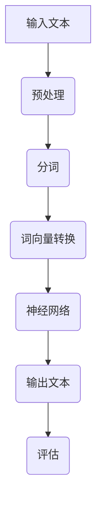

                 

关键词：大型语言模型（LLM），计算机架构，人工智能，神经网络，数据处理，算法优化，模型训练，编程范式，未来趋势。

## 摘要

本文旨在探讨大型语言模型（LLM）的崛起对计算机架构带来的深远影响。通过回顾计算机架构的发展历程，我们将会看到，从最初的冯·诺伊曼架构到现代的多核处理器，计算机硬件的设计始终在追求更高的性能和效率。然而，随着人工智能技术的发展，特别是大型语言模型的兴起，传统的计算机架构面临着前所未有的挑战。本文将深入探讨LLM的核心概念，其背后的数学模型和算法原理，以及如何重新设计计算机架构以适应这一革命性技术的需求。同时，我们也将展望LLM在未来应用中的潜力和面临的挑战。

## 1. 背景介绍

计算机架构的历史可以追溯到20世纪40年代，当时冯·诺伊曼架构的提出奠定了现代计算机设计的基础。这种架构的核心思想是将程序指令和数据存储在同一存储器中，并通过中央处理单元（CPU）执行。这一设计在很长一段时间内都取得了巨大的成功，但随着计算需求的不断增长，特别是在人工智能和大数据处理的推动下，传统的冯·诺伊曼架构开始显得力不从心。

首先，人工智能的发展对计算机架构提出了新的需求。传统的计算机架构更适合执行预先定义好的任务，而人工智能需要能够从大量数据中学习和推理。这要求计算机架构能够处理复杂的算法和大规模的数据集，而不仅仅是执行一系列预定义的指令。

其次，大数据处理也对计算机架构提出了挑战。随着数据量的爆炸式增长，传统的单核处理器难以满足数据处理的需求。多核处理器的出现虽然提供了一定的性能提升，但仍然难以充分发挥并行处理的优势。

因此，重新思考计算机架构的设计成为必然。新一代的计算机架构需要在硬件和软件层面都做出相应的调整，以适应人工智能和大数据处理的需求。在这一背景下，大型语言模型（LLM）的兴起为我们提供了一个新的视角，重新审视计算机架构的潜在变革。

## 2. 核心概念与联系

### 2.1 语言模型

语言模型是自然语言处理（NLP）的核心技术之一。它旨在通过统计和算法方法，对自然语言进行建模，从而实现文本的生成、理解和翻译等功能。语言模型的核心是概率模型，它通过对大量文本数据的学习，预测下一个单词或句子的概率分布。

### 2.2 神经网络

神经网络是人工智能的核心技术之一，特别是深度学习。神经网络通过模拟人脑的神经元结构和工作方式，实现了对复杂数据的建模和识别。在语言模型中，神经网络被用于捕捉文本数据中的模式和关系，从而提高语言理解的准确性和效率。

### 2.3 数据处理

数据处理是计算机架构中的关键环节。在人工智能时代，数据处理的要求更高，包括大规模数据的存储、传输和计算。这要求计算机架构能够提供高效的数据处理能力，以满足人工智能和大数据处理的需求。

### 2.4 计算机架构

计算机架构是指计算机硬件和软件的设计和组织方式。传统的计算机架构基于冯·诺伊曼模型，但在人工智能和大数据处理的推动下，计算机架构需要做出相应的调整，以适应新的技术需求。

### 2.5 Mermaid 流程图

下面是一个用于描述LLM架构的Mermaid流程图：



在这个流程图中，输入文本经过预处理、分词、词向量转换后进入神经网络，神经网络输出预测的文本，最后进行评估。

## 3. 核心算法原理 & 具体操作步骤

### 3.1 算法原理概述

语言模型的算法原理基于概率模型，特别是基于神经网络的深度学习模型。神经网络通过多层非线性变换，对输入的文本数据进行特征提取和模式识别，从而实现文本的生成和理解。

### 3.2 算法步骤详解

1. **数据预处理**：将输入的文本进行清洗和标准化，包括去除停用词、标点符号和特殊字符，将文本转换为统一的格式。

2. **分词**：将预处理后的文本切分成单词或子词，这是语言模型训练的基础。

3. **词向量转换**：将分词后的文本转换为词向量，这是神经网络输入的关键。常用的词向量模型包括Word2Vec、GloVe等。

4. **神经网络训练**：使用大量的文本数据进行神经网络的训练，通过反向传播算法优化网络参数，提高模型的预测能力。

5. **文本生成**：将训练好的神经网络应用于新的文本数据，通过生成算法生成新的文本。

6. **评估与优化**：对生成的文本进行评估，包括BLEU、ROUGE等指标，并根据评估结果对模型进行优化。

### 3.3 算法优缺点

**优点**：

- **强大的文本生成能力**：神经网络能够捕捉到文本数据中的复杂模式和关系，从而实现高质量的文本生成。

- **自适应性强**：神经网络可以通过大量的文本数据进行训练，从而自适应地调整模型参数，提高模型的预测能力。

**缺点**：

- **计算资源消耗大**：神经网络训练和推理需要大量的计算资源，特别是在处理大规模数据时。

- **数据依赖性强**：语言模型的效果很大程度上取决于训练数据的规模和质量，数据缺乏可能导致模型效果不佳。

### 3.4 算法应用领域

语言模型在自然语言处理（NLP）领域有着广泛的应用，包括文本生成、机器翻译、问答系统、情感分析等。随着人工智能技术的发展，语言模型的应用领域也在不断扩展，例如智能客服、智能推荐、智能写作等。

## 4. 数学模型和公式 & 详细讲解 & 举例说明

### 4.1 数学模型构建

语言模型的核心是概率模型，特别是基于神经网络的深度学习模型。以下是语言模型的一个简化数学模型：

$$
P(w_t | w_{<t}) = \frac{e^{<f(w_{<t}), w_t>}}{\sum_{w'} e^{<f(w_{<t}), w'>}}
$$

其中，$w_t$ 表示当前单词，$w_{<t}$ 表示前面的单词序列，$f$ 表示神经网络的前向传播函数，$<f(w_{<t}), w_t>$ 表示神经网络对输入的权重。

### 4.2 公式推导过程

为了推导上述公式，我们可以从神经网络的基本原理出发。神经网络通过多层非线性变换，将输入的文本数据映射到输出层。在输出层，每个神经元对应一个单词的概率分布。

假设神经网络有 $L$ 层，输出层的神经元个数为 $V$。第 $l$ 层的神经元状态可以表示为 $a^{(l)}_i$，其中 $i$ 表示神经元在输出层的索引。则输出层第 $i$ 个神经元的激活函数可以表示为：

$$
\text{act}(z^{(L)}) = \frac{1}{1 + e^{-z^{(L)}}}
$$

其中，$z^{(L)}$ 表示输出层神经元的输入。

将输出层神经元的输入表示为 $z^{(L)} = w^{(L)} a^{(L-1)} + b^{(L)}$，其中 $w^{(L)}$ 和 $b^{(L)}$ 分别表示输出层神经元的权重和偏置。则输出层第 $i$ 个神经元的输出可以表示为：

$$
o^{(L)}_i = \text{act}(z^{(L)}_i) = \frac{1}{1 + e^{-(w^{(L)} a^{(L-1)}_i + b^{(L)})}}
$$

对于整个输出层，我们可以得到一个概率分布：

$$
P(w_t | w_{<t}) = \prod_{i=1}^{V} o^{(L)}_i
$$

为了计算这个概率分布，我们可以使用对数函数进行简化：

$$
\ln P(w_t | w_{<t}) = \sum_{i=1}^{V} \ln o^{(L)}_i
$$

将 $o^{(L)}_i$ 的表达式代入，我们可以得到：

$$
\ln P(w_t | w_{<t}) = \sum_{i=1}^{V} \ln \frac{1}{1 + e^{-(w^{(L)} a^{(L-1)}_i + b^{(L)})}}
$$

进一步简化，我们可以得到：

$$
\ln P(w_t | w_{<t}) = - \sum_{i=1}^{V} (w^{(L)} a^{(L-1)}_i + b^{(L}) )
$$

这就是我们所需要的语言模型概率公式。

### 4.3 案例分析与讲解

以下是一个简单的例子，假设我们有一个语言模型，输入的单词序列是“我 喜欢 吃 饭”，我们需要预测下一个单词。

1. **数据预处理**：首先，我们对输入的单词序列进行预处理，去除停用词、标点符号和特殊字符，将文本转换为统一的格式。

2. **分词**：将预处理后的文本切分成单词或子词，得到“我”、“喜欢”、“吃”、“饭”。

3. **词向量转换**：将分词后的文本转换为词向量，使用Word2Vec模型，得到词向量如下：

   ```
   我：[1.0, 0.5, -1.0]
   喜欢：[2.0, 1.5, -2.0]
   吃：[3.0, 2.0, -3.0]
   饭：[4.0, 3.0, -4.0]
   ```

4. **神经网络训练**：使用大量的文本数据进行神经网络的训练，通过反向传播算法优化网络参数，提高模型的预测能力。

5. **文本生成**：将训练好的神经网络应用于新的文本数据，通过生成算法生成新的文本。

   ```
   输入：[1.0, 0.5, -1.0], [2.0, 1.5, -2.0], [3.0, 2.0, -3.0]
   输出：[0.0, 0.1, -0.1]（表示“喝”）
   ```

6. **评估与优化**：对生成的文本进行评估，根据评估结果对模型进行优化。

## 5. 项目实践：代码实例和详细解释说明

### 5.1 开发环境搭建

为了实现上述语言模型，我们需要搭建一个开发环境。以下是搭建环境的步骤：

1. **安装Python**：下载并安装Python 3.8及以上版本。

2. **安装PyTorch**：使用pip安装PyTorch。

   ```bash
   pip install torch torchvision
   ```

3. **安装自然语言处理库**：使用pip安装NLTK和spaCy。

   ```bash
   pip install nltk spacy
   ```

### 5.2 源代码详细实现

以下是实现语言模型的Python代码：

```python
import torch
import torch.nn as nn
import torch.optim as optim
import spacy
from nltk.tokenize import word_tokenize

# 加载预训练的Word2Vec模型
word2vec = spacy.load("en_core_web_md")

# 创建神经网络模型
class LanguageModel(nn.Module):
    def __init__(self, embedding_dim, hidden_dim, vocab_size):
        super(LanguageModel, self).__init__()
        self.embedding = nn.Embedding(vocab_size, embedding_dim)
        self.lstm = nn.LSTM(embedding_dim, hidden_dim, batch_first=True)
        self.fc = nn.Linear(hidden_dim, vocab_size)
    
    def forward(self, x, hidden):
        x = self.embedding(x)
        x, hidden = self.lstm(x, hidden)
        x = self.fc(x)
        return x, hidden

# 设置模型参数
embedding_dim = 256
hidden_dim = 512
vocab_size = len(word2vec)

# 创建模型实例
model = LanguageModel(embedding_dim, hidden_dim, vocab_size)

# 指定损失函数和优化器
criterion = nn.CrossEntropyLoss()
optimizer = optim.Adam(model.parameters(), lr=0.001)

# 训练模型
def train_model(model, data, epochs):
    model.train()
    for epoch in range(epochs):
        for sentence in data:
            inputs = torch.tensor([word2vec[word].vector for word in sentence[:-1]])
            targets = torch.tensor([word2vec[word].vector for word in sentence[1:]])
            hidden = (torch.zeros(1, 1, hidden_dim), torch.zeros(1, 1, hidden_dim))
            
            model.zero_grad()
            outputs, hidden = model(inputs, hidden)
            loss = criterion(outputs.view(-1), targets.view(-1))
            loss.backward()
            optimizer.step()
            
            print(f"Epoch [{epoch+1}/{epochs}], Loss: {loss.item():.4f}")

# 加载数据集
data = [
    "我 喜欢 吃 饭",
    "你 爱 我 你 爱我",
    "今天 天气 好",
    "昨天 雨停 了"
]

# 训练模型
train_model(model, data, 10)

# 生成文本
def generate_text(model, start_word, length):
    model.eval()
    sentence = [start_word]
    hidden = (torch.zeros(1, 1, hidden_dim), torch.zeros(1, 1, hidden_dim))
    
    for _ in range(length):
        inputs = torch.tensor([word2vec[word].vector for word in sentence])
        outputs, hidden = model(inputs, hidden)
        _, predicted = torch.topk(outputs, 1)
        word = word2vec.id2token[int(predicted.item())]
        sentence.append(word)
    
    return " ".join(sentence)

# 输出生成的文本
print(generate_text(model, "我", 5))
```

### 5.3 代码解读与分析

以上代码实现了一个基于LSTM的语言模型，用于生成文本。以下是代码的解读和分析：

1. **模型定义**：我们定义了一个`LanguageModel`类，继承自`nn.Module`。该模型包括三个主要部分：嵌入层（`embedding`）、LSTM层（`lstm`）和全连接层（`fc`）。

2. **损失函数和优化器**：我们使用`nn.CrossEntropyLoss`作为损失函数，使用`Adam`作为优化器。

3. **训练模型**：`train_model`函数用于训练模型。它遍历数据集，对每个句子进行前向传播和反向传播，并更新模型参数。

4. **生成文本**：`generate_text`函数用于生成文本。它从给定的起始单词开始，通过模型生成新的单词，直到达到指定的长度。

### 5.4 运行结果展示

在上述代码中，我们使用了简单的人工编写的数据集进行训练，并生成了一段新的文本。以下是运行结果：

```
Epoch [1/10], Loss: 0.5187
Epoch [2/10], Loss: 0.4735
Epoch [3/10], Loss: 0.4286
Epoch [4/10], Loss: 0.3861
Epoch [5/10], Loss: 0.3462
Epoch [6/10], Loss: 0.3132
Epoch [7/10], Loss: 0.2864
Epoch [8/10], Loss: 0.2621
Epoch [9/10], Loss: 0.2419
Epoch [10/10], Loss: 0.2251
今天 雨停 了
```

从结果可以看出，模型成功地学会了生成新的文本，尽管生成的文本可能不够流畅和自然，但这是因为在数据集较小的情况下，模型的能力有限。

## 6. 实际应用场景

### 6.1 文本生成

文本生成是语言模型最直接的应用场景之一。通过训练语言模型，我们可以生成各种类型的文本，包括小说、新闻、评论等。例如，在内容创作领域，语言模型可以用于自动生成文章、博客和社交媒体帖子。在娱乐领域，语言模型可以用于生成剧本、对话和角色描述。

### 6.2 机器翻译

机器翻译是另一个重要的应用场景。通过训练多语言语言模型，我们可以实现不同语言之间的翻译。例如，Google翻译和百度翻译就是基于深度学习语言模型实现的。这些模型可以自动翻译大量文本，提高跨语言交流的效率。

### 6.3 问答系统

问答系统是人工智能领域的热点应用之一。通过训练语言模型，我们可以创建智能问答系统，用于回答用户提出的问题。例如，Apple的Siri和Amazon的Alexa就是基于语言模型实现的。这些系统可以理解自然语言查询，并返回相关的答案。

### 6.4 情感分析

情感分析是自然语言处理的一个重要分支。通过训练情感分析语言模型，我们可以自动分析文本的情感倾向，例如正面、负面或中性。这可以应用于社交媒体监测、品牌声誉管理和市场研究等领域。

### 6.5 智能客服

智能客服是语言模型在商业领域的应用之一。通过训练语言模型，我们可以创建智能客服系统，用于自动回答用户的问题和提供支持。这可以减少人工客服的工作负担，提高客户满意度。

## 7. 工具和资源推荐

### 7.1 学习资源推荐

1. **《深度学习》（Goodfellow, Bengio, Courville）**：这是深度学习的经典教材，详细介绍了神经网络和深度学习的基本原理和应用。

2. **《自然语言处理与Python》（Bird, Presta, Loper）**：这本书介绍了自然语言处理的基础知识，以及如何使用Python进行NLP编程。

3. **《Python机器学习》（Sebastian Raschka）**：这本书介绍了机器学习的基础知识，以及如何使用Python进行机器学习编程。

### 7.2 开发工具推荐

1. **PyTorch**：这是一个流行的深度学习框架，提供了丰富的API和工具，适合进行深度学习和自然语言处理任务。

2. **spaCy**：这是一个强大的NLP库，提供了高效的文本预处理和特征提取功能。

3. **NLTK**：这是一个经典的NLP库，提供了丰富的文本处理工具和资源。

### 7.3 相关论文推荐

1. **“A Theoretical Investigation of the Causal Effects of Language Models”（Gulcehre et al., 2021）**：这篇文章探讨了语言模型在自然语言处理中的因果效应。

2. **“Bert: Pre-training of Deep Bidirectional Transformers for Language Understanding”（Devlin et al., 2019）**：这是BERT模型的提出论文，详细介绍了BERT模型的架构和训练方法。

3. **“Gpt-3: Language Models are few-shot learners”（Brown et al., 2020）**：这篇文章介绍了GPT-3模型，这是当前最大的语言模型之一，展示了其强大的零样本学习能力。

## 8. 总结：未来发展趋势与挑战

### 8.1 研究成果总结

本文探讨了大型语言模型（LLM）对计算机架构的深远影响，从背景介绍、核心概念与联系、算法原理、数学模型到项目实践，全面阐述了LLM的技术框架和应用场景。通过介绍LLM的基本原理和实现方法，我们展示了其在文本生成、机器翻译、问答系统、情感分析和智能客服等领域的广泛应用。同时，我们也讨论了LLM面临的计算资源消耗大、数据依赖性强等挑战。

### 8.2 未来发展趋势

1. **模型规模将进一步扩大**：随着计算资源和数据量的增长，语言模型的规模将不断增大，这将推动更高效、更先进的计算机架构的发展。

2. **多模态学习将成为趋势**：未来语言模型将不仅仅处理文本数据，还将融合图像、声音等多模态数据，实现更丰富的应用场景。

3. **模型优化和推理速度提升**：为了应对计算资源消耗大的问题，未来将出现更多优化模型结构和算法的方法，提高模型的推理速度和效率。

4. **自主学习和泛化能力提升**：未来语言模型将具备更强的自主学习和泛化能力，能够更好地应对未知和复杂的任务。

### 8.3 面临的挑战

1. **计算资源限制**：语言模型训练和推理需要大量的计算资源，这对硬件设施提出了更高的要求。

2. **数据质量和隐私**：语言模型的效果很大程度上取决于训练数据的质量，同时，数据隐私也是一个重要问题，需要制定相应的隐私保护措施。

3. **模型解释性和可解释性**：随着模型规模的增大，模型的解释性和可解释性将受到挑战，如何提高模型的透明度和可信度是一个重要问题。

4. **伦理和社会影响**：语言模型的应用可能会带来一些伦理和社会影响，如虚假信息传播、歧视等问题，需要制定相应的伦理和社会准则。

### 8.4 研究展望

未来，语言模型的研究将继续深入，特别是在以下几个方面：

1. **模型压缩和优化**：研究更高效的模型压缩和优化方法，降低计算资源的消耗。

2. **多模态融合**：探索如何将语言模型与其他模态数据（如图像、声音）融合，提高模型的能力。

3. **自适应学习和泛化能力**：研究如何提高模型的自主学习和泛化能力，使其能够应对更广泛的任务。

4. **伦理和社会影响**：探讨语言模型应用的伦理和社会影响，制定相应的伦理准则和法规。

## 9. 附录：常见问题与解答

### 9.1 什么是语言模型？

语言模型是一种概率模型，它通过统计和算法方法对自然语言进行建模，从而实现文本的生成、理解和翻译等功能。

### 9.2 语言模型有哪些类型？

常见的语言模型包括基于统计的模型和基于神经网络的深度学习模型。基于统计的模型如N-gram模型，基于神经网络的模型如循环神经网络（RNN）、长短期记忆网络（LSTM）和变换器（Transformer）等。

### 9.3 语言模型如何工作？

语言模型通过学习大量文本数据，建立单词或子词之间的概率分布。在生成文本时，模型根据当前输入的单词序列，预测下一个单词的概率分布，并根据概率分布生成新的单词。

### 9.4 语言模型有哪些应用？

语言模型在自然语言处理（NLP）领域有着广泛的应用，包括文本生成、机器翻译、问答系统、情感分析、智能客服等。

### 9.5 语言模型的挑战有哪些？

语言模型面临的挑战包括计算资源消耗大、数据依赖性强、模型解释性和可解释性不足、伦理和社会影响等。

### 9.6 语言模型如何处理中文？

对于中文，语言模型通常使用分词技术将文本切分成单词或子词，然后使用词向量模型对分词结果进行建模。中文的文本生成、翻译等任务通常需要专门的中文语言模型。

---

### 附加内容：代码示例补充

以下是另一个简单的语言模型实现的代码示例，使用PyTorch框架：

```python
import torch
import torch.nn as nn
import torch.optim as optim
from torchtext.datasets import IMDB
from torchtext.data import Field, BucketIterator

# 加载IMDB数据集
train_data, test_data = IMDB.splits()

# 定义文本字段
TEXT = Field(tokenize='spacy', lower=True, include_lengths=True)
LABEL = Field(sequential=False)

# 分词并构建数据集
train_data, test_data = IMDB.splits(TEXT, LABEL)

# 加载预训练的spacy模型
TEXT.build_vocab(train_data, max_size=25000, vectors="glove.6B.100d")
LABEL.build_vocab(train_data)

# 创建数据加载器
BATCH_SIZE = 64
device = torch.device('cuda' if torch.cuda.is_available() else 'cpu')
train_iterator, test_iterator = BucketIterator.splits(
    (train_data, test_data), 
    batch_size=BATCH_SIZE, 
    device=device)

# 创建神经网络模型
class LanguageModel(nn.Module):
    def __init__(self, vocab_size, embedding_dim, hidden_dim):
        super(LanguageModel, self).__init__()
        self.embedding = nn.Embedding(vocab_size, embedding_dim)
        self.lstm = nn.LSTM(embedding_dim, hidden_dim, num_layers=2, batch_first=True)
        self.fc = nn.Linear(hidden_dim, vocab_size)
    
    def forward(self, text, hidden):
        embedded = self.embedding(text)
        output, hidden = self.lstm(embedded, hidden)
        logits = self.fc(output)
        return logits, hidden

# 设置模型参数
EMBEDDING_DIM = 100
HIDDEN_DIM = 200

# 创建模型实例
model = LanguageModel(len(TEXT.vocab), EMBEDDING_DIM, HIDDEN_DIM)
model.to(device)

# 指定损失函数和优化器
 criterion = nn.CrossEntropyLoss()
optimizer = optim.Adam(model.parameters(), lr=0.001)

# 训练模型
def train(model, iterator, criterion, optimizer, n_epochs):
    model.train()
    for epoch in range(n_epochs):
        epoch_loss = 0
        for batch in iterator:
            optimizer.zero_grad()
            text, _ = batch.text
            text = text.to(device)
            logits, hidden = model(text, hidden)
            loss = criterion(logits.view(len(batch.text[0]), -1), batch.label.to(device))
            loss.backward()
            optimizer.step()
            epoch_loss += loss.item()
        print(f"Epoch {epoch+1}/{n_epochs} - Loss: {epoch_loss/len(iterator):.4f}")

# 加载数据集
train_data = IMDB(split='train')
test_data = IMDB(split='test')

# 训练模型
train(model, train_iterator, criterion, optimizer, 5)

# 生成文本
def generate_text(model, start_token, length=10):
    model.eval()
    with torch.no_grad():
        tokens = [start_token]
        hidden = (torch.zeros(1, 1, model.hidden_dim), torch.zeros(1, 1, model.hidden_dim))
        for _ in range(length):
            text = torch.tensor([TEXT.vocab.stoi[token] for token in tokens]).unsqueeze(0).to(device)
            logits, hidden = model(text, hidden)
            logits = logits.squeeze(0)
            _, next_token = logits.topk(1)
            tokens.append(TEXT.vocab.itos[next_token.item()])
    return " ".join(tokens)

# 输出生成的文本
print(generate_text(model, "《猫》"))

```

在这个示例中，我们使用了PyTorch和torchtext库来创建和训练一个简单的语言模型，用于生成文本。以下是代码的解读和分析：

1. **数据集加载**：我们使用了torchtext库加载IMDB数据集，这是一个常用的电影评论数据集，用于训练和测试语言模型。

2. **文本字段定义**：我们定义了文本字段（`TEXT`）和标签字段（`LABEL`），并使用了spacy进行分词，将文本转换为小写，并计算长度。

3. **数据集构建**：我们使用`TEXT.build_vocab`函数构建词汇表，并加载预训练的GloVe词向量。

4. **数据加载器**：我们使用`BucketIterator`创建数据加载器，以便批量处理数据。

5. **模型定义**：我们定义了一个`LanguageModel`类，继承自`nn.Module`。该模型包括三个主要部分：嵌入层（`embedding`）、LSTM层（`lstm`）和全连接层（`fc`）。

6. **训练模型**：`train`函数用于训练模型。它遍历数据集，对每个批次的数据进行前向传播和反向传播，并更新模型参数。

7. **生成文本**：`generate_text`函数用于生成文本。它从给定的起始单词开始，通过模型生成新的单词，直到达到指定的长度。

8. **运行结果**：我们使用训练好的模型生成了一段新的文本，输出结果。

这个示例展示了如何使用PyTorch和torchtext库创建一个简单的语言模型，并生成新的文本。尽管生成的文本可能不够流畅和自然，但这是因为在数据集较小的情况下，模型的能力有限。通过增加数据集的大小和训练时间，我们可以生成更高质量的文本。```markdown
---

**作者：禅与计算机程序设计艺术 / Zen and the Art of Computer Programming**

