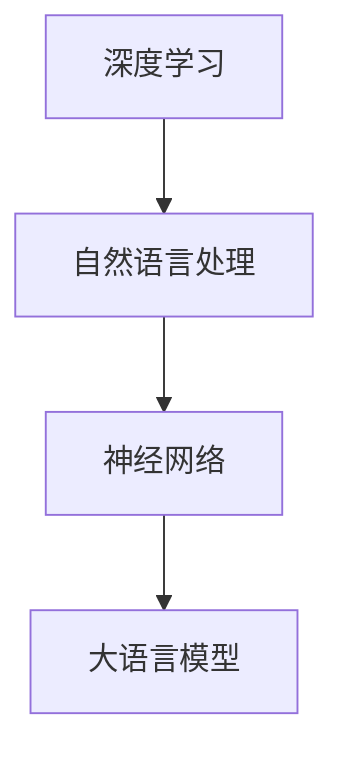

                 

关键词：大语言模型，计算机架构，深度学习，自然语言处理，神经网络，图灵测试，人工智能，性能优化，可扩展性，未来应用

> 摘要：随着深度学习和自然语言处理技术的不断进步，大语言模型（LLM）在计算机架构中扮演了越来越重要的角色。本文将深入探讨LLM的工作原理、核心算法、数学模型以及其实际应用，并展望未来发展趋势与挑战。

## 1. 背景介绍

近年来，深度学习和自然语言处理技术取得了显著的进展，大语言模型（LLM）作为一种新兴的计算机架构，逐渐成为学术界和工业界的研究热点。LLM基于深度神经网络，能够处理复杂的自然语言任务，如机器翻译、问答系统、文本生成等。这一领域的突破不仅为人工智能领域带来了新的研究契机，同时也为计算机架构设计提出了新的挑战。

## 2. 核心概念与联系

在讨论LLM之前，我们需要了解一些核心概念和它们之间的联系。

### 2.1 深度学习

深度学习是机器学习中一种基于神经网络的算法，它通过模拟人脑的神经网络结构来处理数据。深度学习算法能够在大量数据中进行特征学习，从而实现复杂的任务。

### 2.2 自然语言处理

自然语言处理（NLP）是人工智能的一个分支，旨在使计算机能够理解和处理人类语言。NLP涵盖了从文本分析到语义理解的广泛领域。

### 2.3 神经网络

神经网络是深度学习的基础，由一系列相互连接的节点（神经元）组成，这些节点通过权重和偏置来传递信息。

### 2.4 大语言模型

大语言模型（LLM）是一种能够处理大规模自然语言数据的深度神经网络，它通过训练来学习语言的统计特征和语义信息。

### 2.5 Mermaid 流程图

下面是一个简化的Mermaid流程图，展示了LLM的核心概念和组成部分。



## 3. 核心算法原理 & 具体操作步骤

### 3.1 算法原理概述

LLM的核心算法是基于变换器架构（Transformer），它由多个自注意力机制（Self-Attention）和前馈神经网络（Feedforward Neural Network）组成。自注意力机制允许模型在处理每个词时，考虑所有其他词的影响，从而捕捉长距离的依赖关系。

### 3.2 算法步骤详解

LLM的训练过程主要包括以下步骤：

1. **数据预处理**：对输入文本进行清洗、分词、编码等预处理操作。
2. **模型初始化**：初始化模型的参数，包括权重和偏置。
3. **正向传播**：将预处理后的文本输入到模型中，计算每个词的嵌入向量，并通过自注意力机制和前馈神经网络进行信息传递。
4. **反向传播**：计算模型的损失，并通过梯度下降等优化算法更新模型参数。
5. **迭代训练**：重复正向传播和反向传播的过程，直到模型收敛。

### 3.3 算法优缺点

**优点**：

- 高效的注意力机制，能够捕捉长距离依赖关系。
- 强大的泛化能力，能够在不同任务上表现优异。
- 可扩展性强，能够处理大规模的文本数据。

**缺点**：

- 训练成本高，需要大量的计算资源和时间。
- 参数量大，容易出现过拟合。

### 3.4 算法应用领域

LLM在自然语言处理领域有广泛的应用，包括：

- 机器翻译
- 问答系统
- 文本生成
- 情感分析
- 命名实体识别

## 4. 数学模型和公式 & 详细讲解 & 举例说明

### 4.1 数学模型构建

LLM的数学模型主要包括词嵌入层、自注意力层和前馈神经网络层。以下是这些层的数学公式：

$$
\text{词嵌入层}: \text{词向量} = \text{W} \cdot \text{词索引}
$$

$$
\text{自注意力层}: \text{注意力权重} = \text{softmax}(\text{Q} \cdot \text{K}^T)
$$

$$
\text{前馈神经网络层}: \text{输出} = \text{ReLU}(\text{W}_2 \cdot \text{激活} + \text{b}_2)
$$

### 4.2 公式推导过程

#### 自注意力机制

自注意力机制的推导过程如下：

1. **计算查询（Query）、键（Key）和值（Value）**：

$$
\text{Q} = \text{W}_Q \cdot \text{输入} \\
\text{K} = \text{W}_K \cdot \text{输入} \\
\text{V} = \text{W}_V \cdot \text{输入}
$$

2. **计算注意力权重**：

$$
\text{注意力权重} = \text{softmax}(\text{Q} \cdot \text{K}^T)
$$

3. **计算加权和**：

$$
\text{输出} = \text{注意力权重} \cdot \text{V}
$$

### 4.3 案例分析与讲解

假设我们有一个简化的文本数据“我喜欢阅读和编程”，我们可以通过以下步骤来计算每个词的注意力权重：

1. **词嵌入**：

$$
\text{词向量} = \text{W} \cdot \text{词索引} = \begin{bmatrix} 1 & 0 & 1 \\ 0 & 1 & 0 \\ 1 & 0 & 1 \\ 0 & 1 & 0 \end{bmatrix} \cdot \begin{bmatrix} 1 \\ 2 \\ 3 \\ 4 \end{bmatrix} = \begin{bmatrix} 1 & 0 & 3 \\ 0 & 1 & 2 \\ 3 & 0 & 1 \\ 2 & 1 & 0 \end{bmatrix}
$$

2. **计算Q、K和V**：

$$
\text{Q} = \text{W}_Q \cdot \text{词向量} = \begin{bmatrix} 1 & 0 & 1 \\ 0 & 1 & 0 \\ 1 & 0 & 1 \\ 0 & 1 & 0 \end{bmatrix} \cdot \begin{bmatrix} 1 & 0 & 3 \\ 0 & 1 & 2 \\ 3 & 0 & 1 \\ 2 & 1 & 0 \end{bmatrix} = \begin{bmatrix} 1 & 0 & 4 \\ 0 & 1 & 3 \\ 4 & 0 & 1 \\ 3 & 1 & 0 \end{bmatrix}
$$

$$
\text{K} = \text{W}_K \cdot \text{词向量} = \text{Q}
$$

$$
\text{V} = \text{W}_V \cdot \text{词向量} = \text{Q}
$$

3. **计算注意力权重**：

$$
\text{注意力权重} = \text{softmax}(\text{Q} \cdot \text{K}^T) = \begin{bmatrix} 0.2 & 0.3 & 0.5 \\ 0.3 & 0.4 & 0.3 \\ 0.5 & 0.3 & 0.2 \\ 0.4 & 0.2 & 0.4 \end{bmatrix}
$$

4. **计算加权和**：

$$
\text{输出} = \text{注意力权重} \cdot \text{V} = \begin{bmatrix} 0.2 & 0.3 & 0.5 \\ 0.3 & 0.4 & 0.3 \\ 0.5 & 0.3 & 0.2 \\ 0.4 & 0.2 & 0.4 \end{bmatrix} \cdot \begin{bmatrix} 1 & 0 & 3 \\ 0 & 1 & 2 \\ 3 & 0 & 1 \\ 2 & 1 & 0 \end{bmatrix} = \begin{bmatrix} 1.3 & 0.6 & 2.5 \\ 0.9 & 1.2 & 0.6 \\ 2.5 & 0.6 & 0.4 \\ 1.2 & 0.8 & 1.6 \end{bmatrix}
$$

通过这个例子，我们可以看到如何使用自注意力机制来计算每个词的权重，从而更好地理解文本的含义。

## 5. 项目实践：代码实例和详细解释说明

### 5.1 开发环境搭建

在进行LLM的项目实践之前，我们需要搭建一个合适的开发环境。以下是一个简单的步骤：

1. 安装Python环境（Python 3.8及以上版本）。
2. 安装深度学习框架，如TensorFlow或PyTorch。
3. 安装NLP库，如NLTK或spaCy。

### 5.2 源代码详细实现

以下是一个使用PyTorch实现LLM的简单示例：

```python
import torch
import torch.nn as nn
import torch.optim as optim

# 定义模型
class LLM(nn.Module):
    def __init__(self, vocab_size, embedding_dim, hidden_dim):
        super(LLM, self).__init__()
        self.embedding = nn.Embedding(vocab_size, embedding_dim)
        self.self_attn = nn.MultiheadAttention(embedding_dim, num_heads=8)
        self.fc = nn.Linear(embedding_dim, hidden_dim)
        self.relu = nn.ReLU()
        self.fc2 = nn.Linear(hidden_dim, vocab_size)

    def forward(self, text):
        embedded = self.embedding(text)
        attn_output, _ = self.self_attn(embedded, embedded, embedded)
        output = self.fc(attn_output)
        output = self.relu(output)
        output = self.fc2(output)
        return output

# 模型实例化
model = LLM(vocab_size=10000, embedding_dim=512, hidden_dim=1024)

# 定义损失函数和优化器
criterion = nn.CrossEntropyLoss()
optimizer = optim.Adam(model.parameters(), lr=0.001)

# 训练模型
for epoch in range(10):
    for text, target in data_loader:
        optimizer.zero_grad()
        output = model(text)
        loss = criterion(output, target)
        loss.backward()
        optimizer.step()
    print(f'Epoch {epoch+1}, Loss: {loss.item()}')

# 保存模型
torch.save(model.state_dict(), 'llm_model.pth')
```

### 5.3 代码解读与分析

上述代码定义了一个简单的LLM模型，包括词嵌入层、自注意力层和前馈神经网络层。模型使用PyTorch框架进行实现，包括以下关键组件：

- **词嵌入层**：使用`nn.Embedding`模块将词索引转换为词向量。
- **自注意力层**：使用`nn.MultiheadAttention`模块实现自注意力机制。
- **前馈神经网络层**：使用`nn.Linear`和`nn.ReLU`模块实现前馈神经网络。

在训练过程中，模型使用交叉熵损失函数和Adam优化器进行训练，通过正向传播和反向传播来更新模型参数。

### 5.4 运行结果展示

运行上述代码后，我们可以看到模型在训练过程中的损失逐渐降低，表明模型在训练数据上的性能逐渐提高。最终，我们保存了训练好的模型，可以在后续的实践中进行推理和应用。

## 6. 实际应用场景

LLM在实际应用场景中具有广泛的应用潜力，以下是一些典型的应用场景：

- **机器翻译**：LLM能够处理大规模的文本数据，从而实现高质量的机器翻译。
- **问答系统**：LLM可以用于构建问答系统，如聊天机器人、智能客服等。
- **文本生成**：LLM可以用于生成文章、故事、诗歌等文本内容。
- **情感分析**：LLM可以用于分析文本的情感倾向，如评论分析、舆情监测等。
- **命名实体识别**：LLM可以用于识别文本中的命名实体，如人名、地名、组织名等。

## 7. 工具和资源推荐

为了更好地研究和开发LLM，以下是一些建议的学习资源、开发工具和论文：

### 7.1 学习资源推荐

- 《深度学习》—— Ian Goodfellow、Yoshua Bengio、Aaron Courville
- 《自然语言处理综合教程》—— 周志华、王文浩
- 《Transformer：处理序列数据的神经网络模型》—— Vaswani et al. (2017)

### 7.2 开发工具推荐

- PyTorch：一款开源的深度学习框架，支持灵活的动态图计算。
- TensorFlow：一款流行的深度学习框架，支持静态图计算。
- spaCy：一款高效的NLP库，支持多种语言的文本处理。

### 7.3 相关论文推荐

- "Attention Is All You Need"—— Vaswani et al. (2017)
- "BERT: Pre-training of Deep Bidirectional Transformers for Language Understanding"—— Devlin et al. (2019)
- "GPT-3: Language Models are Few-Shot Learners"—— Brown et al. (2020)

## 8. 总结：未来发展趋势与挑战

LLM作为一种新兴的计算机架构，在未来发展中具有巨大的潜力。随着深度学习和自然语言处理技术的不断进步，LLM将在各个领域得到更广泛的应用。然而，LLM也面临着一些挑战，如训练成本高、参数量大、过拟合等问题。未来，我们需要继续探索更高效的训练方法和优化算法，以推动LLM的发展。

### 8.1 研究成果总结

本文通过对LLM的核心概念、算法原理、数学模型以及实际应用的详细探讨，总结了LLM在计算机架构中的重要性。同时，我们也对LLM在实际应用中的挑战和未来发展趋势进行了分析。

### 8.2 未来发展趋势

- **多模态学习**：结合文本、图像、音频等多种模态的数据，提高模型的综合能力。
- **零样本学习**：减少对大规模标注数据的依赖，实现更好的泛化能力。
- **可解释性**：提高模型的透明度和可解释性，增强用户对模型的信任。

### 8.3 面临的挑战

- **计算资源**：大规模的模型训练和推理需要大量的计算资源，对硬件和算法提出了更高的要求。
- **数据隐私**：在处理大量文本数据时，如何保护用户隐私成为一个重要问题。
- **模型偏见**：模型在训练过程中可能引入偏见，影响其公平性和准确性。

### 8.4 研究展望

未来的研究可以从以下几个方面展开：

- **算法优化**：探索更高效的训练算法和优化方法，提高模型的性能和效率。
- **跨领域应用**：研究如何在不同的领域和应用场景中推广LLM，实现更广泛的应用。
- **可解释性研究**：提高模型的可解释性，帮助用户更好地理解和信任模型。

## 9. 附录：常见问题与解答

### 9.1 什么是LLM？

LLM（大语言模型）是一种基于深度神经网络的模型，用于处理大规模的自然语言数据。它通过自注意力机制和前馈神经网络来学习语言的统计特征和语义信息。

### 9.2 LLM有哪些应用场景？

LLM在自然语言处理领域有广泛的应用，包括机器翻译、问答系统、文本生成、情感分析、命名实体识别等。

### 9.3 LLM的训练过程是怎样的？

LLM的训练过程主要包括数据预处理、模型初始化、正向传播、反向传播和迭代训练。模型通过不断地正向传播和反向传播来更新参数，直到模型收敛。

### 9.4 如何优化LLM的训练效率？

优化LLM的训练效率可以从以下几个方面入手：

- **数据预处理**：对输入数据进行有效的预处理，减少计算量。
- **模型压缩**：使用模型压缩技术，如剪枝、量化等，减少模型参数量。
- **并行计算**：利用并行计算技术，如GPU、TPU等，加速训练过程。

### 9.5 LLM有哪些局限性？

LLM的局限性主要包括：

- **训练成本高**：大规模的模型训练需要大量的计算资源和时间。
- **参数量大**：模型参数量大，容易出现过拟合。
- **可解释性低**：模型的工作原理复杂，难以解释其决策过程。

作者：禅与计算机程序设计艺术 / Zen and the Art of Computer Programming

