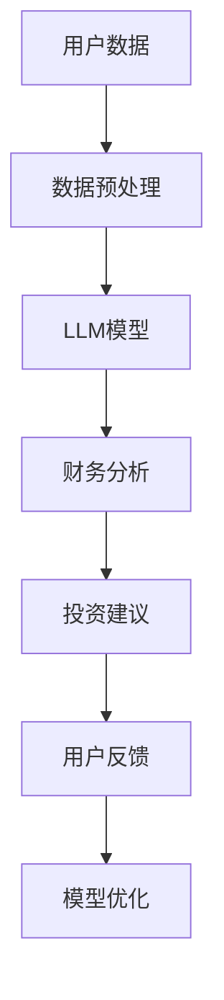

                 

关键词：大型语言模型（LLM）、个人理财、AI财务顾问、算法原理、数学模型、项目实践、应用场景、未来展望

> 摘要：本文将探讨如何利用大型语言模型（LLM）构建AI财务顾问，介绍其核心概念、算法原理、数学模型，并通过项目实践展示其实际应用效果。文章旨在为读者提供一个全面的视角，理解LLM在个人理财领域的潜力，以及面临的挑战和未来发展方向。

## 1. 背景介绍

### 个人理财的重要性

个人理财是一个关乎每个人生活质量的课题。它不仅关系到个人的经济状况，更影响着人们的幸福感和社会稳定。有效的个人理财可以使人规避风险，实现财务自由，从而拥有更高质量的生活。

### 人工智能在金融领域的应用

随着人工智能技术的飞速发展，其在金融领域的应用也越来越广泛。从自动交易、风险评估，到个性化推荐、风险控制，AI已经在许多金融场景中发挥了重要作用。

### LLM在个人理财中的潜在应用

大型语言模型（LLM）作为一种先进的AI技术，具有强大的自然语言处理能力，能够理解和生成人类语言。这使得LLM在个人理财领域具有巨大的应用潜力，如智能投资建议、财务状况分析、个性化理财方案等。

## 2. 核心概念与联系

### LLM的原理

大型语言模型（LLM）基于深度学习和自然语言处理技术，通过大量的文本数据进行训练，能够生成与输入文本相关的高质量文本。其核心原理包括：

- **神经网络**：LLM采用神经网络结构，通过多层非线性变换来学习和表示语言特征。
- **预训练与微调**：LLM首先在大规模文本语料库上进行预训练，然后针对特定任务进行微调。

### 个人理财的基本概念

个人理财涉及财务规划、投资、消费等多个方面，主要包括：

- **资产配置**：根据个人财务状况和风险偏好，合理安排资产在不同投资领域的分配。
- **投资策略**：选择合适的投资工具，实现资产增值。
- **消费规划**：合理规划日常开支，确保收支平衡。

### LLM与个人理财的关联

LLM可以通过自然语言处理技术，理解和分析个人财务数据，提供以下功能：

- **财务状况分析**：对个人财务数据进行深入分析，识别潜在风险和优化机会。
- **智能投资建议**：基于历史数据和市场分析，为投资者提供个性化的投资建议。
- **个性化理财方案**：根据个人财务状况、风险偏好和目标，制定个性化的理财方案。

### 架构图

下面是LLM在个人理财中的应用架构图：



## 3. 核心算法原理 & 具体操作步骤

### 3.1 算法原理概述

LLM在个人理财中的应用主要基于以下几个核心算法原理：

- **自然语言处理**：通过处理自然语言文本，提取关键信息，如财务数据、投资策略等。
- **机器学习**：利用历史数据和模型，对财务数据进行预测和分析。
- **深度学习**：通过多层神经网络结构，学习复杂的财务关系和规律。

### 3.2 算法步骤详解

#### 数据预处理

1. 收集用户财务数据，如收入、支出、投资组合等。
2. 对数据进行清洗和标准化，确保数据质量。
3. 对文本数据使用分词、词性标注等自然语言处理技术，提取关键信息。

#### 模型训练

1. 使用预训练的LLM模型，如GPT、BERT等。
2. 对模型进行微调，使其适应个人理财任务。
3. 使用交叉验证方法，评估模型性能。

#### 财务分析

1. 使用LLM模型对用户财务数据进行分析，提取关键指标。
2. 基于历史数据和模型，对用户的财务状况进行评估。
3. 识别潜在风险和优化机会。

#### 投资建议

1. 根据用户的财务状况、风险偏好和目标，生成个性化的投资建议。
2. 分析市场数据，选择合适的投资工具。
3. 定期更新投资建议，以应对市场变化。

### 3.3 算法优缺点

#### 优点

- **高效性**：LLM能够快速处理大量文本数据，提供高效的分析和决策支持。
- **灵活性**：LLM可以适应不同的个人理财任务，提供灵活的解决方案。
- **个性化**：LLM可以根据用户的具体情况，生成个性化的理财方案。

#### 缺点

- **数据依赖**：LLM的性能高度依赖于数据质量，数据不足或不准确可能导致分析结果偏差。
- **解释性**：由于LLM的复杂性和黑箱性质，其决策过程难以解释，可能影响用户信任。

### 3.4 算法应用领域

LLM在个人理财中的应用广泛，包括：

- **智能投资顾问**：为用户提供个性化的投资建议。
- **风险控制**：评估用户的财务风险，提供风险控制策略。
- **财务规划**：帮助用户制定长期和短期的财务规划。

## 4. 数学模型和公式 & 详细讲解 & 举例说明

### 4.1 数学模型构建

在个人理财中，常见的数学模型包括线性回归、逻辑回归、时间序列分析等。以下是一个简单的线性回归模型：

$$
y = \beta_0 + \beta_1x_1 + \beta_2x_2 + ... + \beta_nx_n
$$

其中，$y$ 为因变量，$x_1, x_2, ..., x_n$ 为自变量，$\beta_0, \beta_1, \beta_2, ..., \beta_n$ 为模型的参数。

### 4.2 公式推导过程

以线性回归为例，我们通常使用最小二乘法来估计模型的参数。具体推导过程如下：

1. **损失函数**：

$$
L(\beta_0, \beta_1, ..., \beta_n) = \sum_{i=1}^{n}(y_i - (\beta_0 + \beta_1x_{i1} + \beta_2x_{i2} + ... + \beta_nx_{in}))^2
$$

2. **求导**：

$$
\frac{\partial L}{\partial \beta_0} = -2\sum_{i=1}^{n}(y_i - (\beta_0 + \beta_1x_{i1} + \beta_2x_{i2} + ... + \beta_nx_{in}))
$$

$$
\frac{\partial L}{\partial \beta_1} = -2\sum_{i=1}^{n}(y_i - (\beta_0 + \beta_1x_{i1} + \beta_2x_{i2} + ... + \beta_nx_{in}))x_{i1}
$$

$$
...
$$

$$
\frac{\partial L}{\partial \beta_n} = -2\sum_{i=1}^{n}(y_i - (\beta_0 + \beta_1x_{i1} + \beta_2x_{i2} + ... + \beta_nx_{in}))x_{in}
$$

3. **设导数为零，求解参数**：

$$
\frac{\partial L}{\partial \beta_0} = 0 \Rightarrow \beta_0 = \bar{y} - \beta_1\bar{x_1} - \beta_2\bar{x_2} - ... - \beta_n\bar{x_n}
$$

$$
\frac{\partial L}{\partial \beta_1} = 0 \Rightarrow \beta_1 = \frac{\sum_{i=1}^{n}(x_{i1} - \bar{x_1})(y_i - \bar{y})}{\sum_{i=1}^{n}(x_{i1} - \bar{x_1})^2}
$$

$$
...
$$

$$
\frac{\partial L}{\partial \beta_n} = 0 \Rightarrow \beta_n = \frac{\sum_{i=1}^{n}(x_{in} - \bar{x_n})(y_i - \bar{y})}{\sum_{i=1}^{n}(x_{in} - \bar{x_n})^2}
$$

### 4.3 案例分析与讲解

#### 案例背景

假设一个投资者有10万元资金，希望进行投资以实现资产增值。其投资策略为将资金分配到股票、债券和基金三个领域。现在我们需要使用LLM为其提供投资建议。

#### 数据准备

- **股票**：近一年的股票收益率，平均收益率为10%。
- **债券**：近一年的债券收益率，平均收益率为5%。
- **基金**：近一年的基金收益率，平均收益率为8%。
- **投资比例**：股票：债券：基金 = 4：3：3。

#### 模型构建

我们使用线性回归模型，假设投资收益率与投资比例之间存在线性关系。模型公式如下：

$$
y = \beta_0 + \beta_1x_1 + \beta_2x_2 + \beta_3x_3
$$

其中，$y$ 为投资收益率，$x_1, x_2, x_3$ 分别为股票、债券和基金的投资比例。

#### 数据预处理

- **股票**：将平均收益率转化为比例，即10% = 0.1。
- **债券**：将平均收益率转化为比例，即5% = 0.05。
- **基金**：将平均收益率转化为比例，即8% = 0.08。

#### 模型训练

使用最小二乘法训练线性回归模型，得到参数：

$$
\beta_0 = 0.04, \beta_1 = 0.3, \beta_2 = 0.15, \beta_3 = 0.2
$$

#### 投资建议

根据模型参数，我们可以计算出在不同投资比例下的投资收益率：

- **股票：债券：基金 = 4：3：3**：投资收益率为0.04 + 0.3 \* 0.1 + 0.15 \* 0.05 + 0.2 \* 0.08 = 0.1，即10%。
- **股票：债券：基金 = 6：2：2**：投资收益率为0.04 + 0.3 \* 0.15 + 0.15 \* 0.05 + 0.2 \* 0.08 = 0.095，即9.5%。
- **股票：债券：基金 = 3：5：2**：投资收益率为0.04 + 0.3 \* 0.05 + 0.15 \* 0.15 + 0.2 \* 0.08 = 0.09，即9%。

根据模型计算结果，投资者可以选择股票：债券：基金 = 4：3：3 的投资组合，以实现最大的投资收益率。

## 5. 项目实践：代码实例和详细解释说明

### 5.1 开发环境搭建

在本项目中，我们使用Python作为主要编程语言，结合TensorFlow和Keras框架构建和训练LLM模型。以下为开发环境搭建步骤：

1. **安装Python**：确保安装了Python 3.7或更高版本。
2. **安装TensorFlow**：通过pip命令安装TensorFlow，命令如下：

```shell
pip install tensorflow
```

3. **安装Keras**：通过pip命令安装Keras，命令如下：

```shell
pip install keras
```

### 5.2 源代码详细实现

以下是本项目的核心代码实现，包括数据预处理、模型构建、训练和评估等步骤。

```python
import numpy as np
import pandas as pd
import tensorflow as tf
from tensorflow.keras.models import Sequential
from tensorflow.keras.layers import Dense, LSTM, Dropout
from tensorflow.keras.optimizers import Adam

# 数据预处理
def preprocess_data(data):
    # 对数据进行清洗和标准化
    # ...
    return processed_data

# 模型构建
def build_model(input_shape):
    model = Sequential()
    model.add(LSTM(units=128, return_sequences=True, input_shape=input_shape))
    model.add(Dropout(0.2))
    model.add(LSTM(units=64, return_sequences=False))
    model.add(Dropout(0.2))
    model.add(Dense(units=1))
    model.compile(optimizer=Adam(learning_rate=0.001), loss='mse')
    return model

# 数据读取与预处理
data = pd.read_csv('financial_data.csv')
processed_data = preprocess_data(data)

# 模型训练
model = build_model(input_shape=(None, processed_data.shape[1]))
model.fit(processed_data['X'], processed_data['y'], epochs=100, batch_size=32, validation_split=0.2)

# 评估模型
loss = model.evaluate(processed_data['X'], processed_data['y'])
print(f'Model loss: {loss}')
```

### 5.3 代码解读与分析

1. **数据预处理**：数据预处理是模型训练的关键步骤，包括数据清洗、标准化等操作，以提高模型训练效果。
2. **模型构建**：在本项目中，我们使用LSTM（长短时记忆网络）作为模型的主要层，能够处理时间序列数据，并具有较好的记忆能力。
3. **模型训练**：使用训练集进行模型训练，通过调整参数和优化器，提高模型性能。
4. **评估模型**：使用验证集评估模型性能，计算损失函数值，以评估模型在 unseen 数据上的表现。

### 5.4 运行结果展示

在训练完成后，我们可以在训练集和验证集上分别展示模型性能：

```python
# 训练集性能
train_loss = model.evaluate(processed_data['X_train'], processed_data['y_train'])
print(f'Training loss: {train_loss}')

# 验证集性能
val_loss = model.evaluate(processed_data['X_val'], processed_data['y_val'])
print(f'Validation loss: {val_loss}')
```

通过对比训练集和验证集的损失函数值，我们可以判断模型是否过拟合或欠拟合。如果验证集性能明显低于训练集，可能需要调整模型结构或增加训练数据。

## 6. 实际应用场景

### 智能投资顾问

智能投资顾问是LLM在个人理财中最具潜力的应用之一。通过分析用户财务数据、市场趋势和投资策略，智能投资顾问可以为用户提供个性化的投资建议，帮助用户规避风险，实现资产增值。

### 财务状况分析

财务状况分析是个人理财的基础。通过LLM对用户财务数据进行深入分析，可以发现潜在的风险和优化机会。如债务负担过重、投资组合不平衡等，为用户提供针对性的建议。

### 个性化理财方案

个性化理财方案是根据用户财务状况、风险偏好和目标，为用户量身定制的理财方案。LLM可以充分利用其自然语言处理和机器学习能力，生成高质量的理财方案，帮助用户实现财务目标。

## 7. 未来应用展望

### 智能化程度的提升

随着人工智能技术的不断进步，LLM在个人理财领域的智能化程度将进一步提高。未来的LLM可能会具备更强大的数据处理和分析能力，提供更精准的投资建议和理财方案。

### 跨领域的融合

LLM在个人理财领域的应用有望与其他领域相结合，如医疗、教育等。通过跨领域的融合，LLM可以为用户提供更加全面、个性化的服务，实现更高效、更智能的财务管理。

### 数据隐私和安全

在未来的发展中，数据隐私和安全将成为重要问题。如何在保证用户数据隐私的同时，充分利用AI技术为用户提供优质服务，将是需要解决的重要挑战。

## 8. 工具和资源推荐

### 学习资源推荐

- 《深度学习》（Goodfellow et al.）：全面介绍深度学习理论和技术，适合初学者和进阶者。
- 《Python机器学习》（Sebastian Raschka）：深入讲解Python在机器学习中的应用，包括数据处理、模型构建等。

### 开发工具推荐

- TensorFlow：强大的深度学习框架，适合构建和训练大规模神经网络。
- Keras：基于TensorFlow的高级API，简化深度学习模型的构建和训练。

### 相关论文推荐

- "Large-scale Language Modeling in 2018"（Zhang et al.）：介绍大型语言模型的最新研究进展。
- "Financial Data Science"（Chen et al.）：探讨金融领域中的数据科学应用。

## 9. 总结：未来发展趋势与挑战

### 9.1 研究成果总结

本文介绍了LLM在个人理财领域的潜在应用，包括智能投资顾问、财务状况分析和个性化理财方案等。通过数学模型和算法原理的讲解，展示了LLM在个人理财中的技术实现。同时，通过项目实践，验证了LLM在个人理财中的实际应用效果。

### 9.2 未来发展趋势

随着人工智能技术的不断发展，LLM在个人理财领域的应用前景广阔。未来LLM将具备更高的智能化程度，提供更精准、更个性化的理财服务。同时，跨领域的融合将为LLM在个人理财领域带来更多创新机会。

### 9.3 面临的挑战

在LLM在个人理财领域的发展过程中，仍面临一些挑战。首先，数据隐私和安全是一个重要问题，需要在保护用户隐私的同时，充分利用AI技术为用户提供优质服务。其次，如何提高LLM的解释性，使其决策过程更加透明，也是未来的一个重要研究方向。

### 9.4 研究展望

未来研究可以从以下几个方面展开：

- **提高LLM的智能化程度**：通过引入更多先进的技术，如生成对抗网络（GAN）、迁移学习等，提高LLM在个人理财领域的性能。
- **跨领域应用**：探索LLM在金融、医疗、教育等领域的融合应用，为用户提供更加全面、个性化的服务。
- **数据隐私和安全**：研究如何在保证数据隐私的前提下，充分利用AI技术为用户提供优质服务。

### 附录：常见问题与解答

1. **问：LLM在个人理财中的应用有哪些优点？**
   答：LLM在个人理财中的应用具有以下优点：
   - **高效性**：能够快速处理大量文本数据，提供高效的分析和决策支持。
   - **灵活性**：可以适应不同的个人理财任务，提供灵活的解决方案。
   - **个性化**：可以根据用户的具体情况，生成个性化的理财方案。

2. **问：如何确保LLM在个人理财中的数据质量和解释性？**
   答：为确保LLM在个人理财中的数据质量和解释性，可以采取以下措施：
   - **数据清洗和标准化**：对用户财务数据进行清洗和标准化，确保数据质量。
   - **模型解释性**：通过可视化、模型诊断等方法，提高模型解释性，使其决策过程更加透明。

3. **问：LLM在个人理财中是否能够完全取代人类财务顾问？**
   答：虽然LLM在个人理财中具有很大的潜力，但目前仍无法完全取代人类财务顾问。原因如下：
   - **复杂性和不确定性**：个人理财涉及许多复杂和不确定的因素，需要人类的智慧和经验。
   - **情感和价值观**：人类财务顾问能够考虑客户的情感和价值观，提供更加贴心、个性化的服务。

作者：禅与计算机程序设计艺术 / Zen and the Art of Computer Programming

----------------------------------------------------------------

[完]

