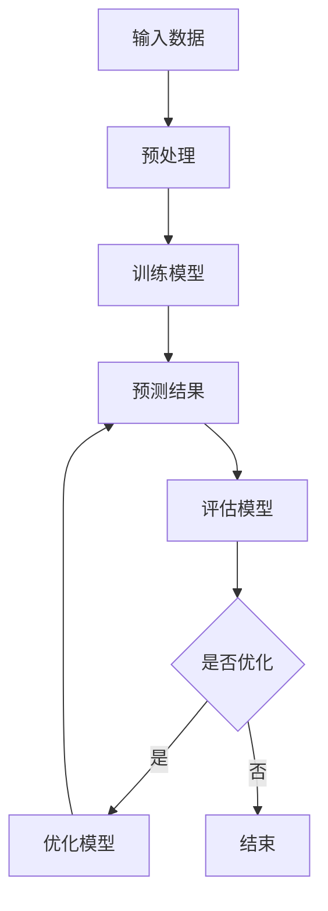

                 

关键词：LLM，决策，不确定性，挑战，应对策略

摘要：随着大型语言模型（LLM）在自然语言处理领域的广泛应用，其决策的不确定性逐渐成为亟待解决的重要问题。本文将深入探讨LLM决策不确定性的来源、挑战以及应对策略，旨在为相关领域的研究者和从业者提供有价值的参考。

## 1. 背景介绍

近年来，大型语言模型（LLM）取得了显著的进展，如GPT-3、ChatGPT等，这些模型在自然语言理解、文本生成、机器翻译等领域表现出色。然而，随着LLM的规模和复杂性不断增加，其决策的不确定性也成为一个不可忽视的问题。LLM决策的不确定性主要表现在以下几个方面：

1. **数据分布偏差**：LLM在训练过程中依赖于大规模的数据集，但这些数据集往往存在一定的偏差，导致模型在处理未见数据时可能出现不一致的决策。

2. **内部机制不透明**：LLM的内部结构非常复杂，决策过程高度非线性，使得模型难以解释，增加了决策不确定性的程度。

3. **潜在风险**：在决策过程中，LLM可能会受到恶意输入的影响，导致错误的决策结果，从而引发安全风险。

## 2. 核心概念与联系

在探讨LLM决策不确定性之前，我们首先需要了解一些核心概念，包括概率论、信息论和统计学等。

### 2.1 概率论

概率论是研究随机事件及其规律性的数学分支。在LLM决策中，概率论的核心作用是评估模型对某个决策结果发生的可能性。例如，我们可以使用贝叶斯定理来计算模型在给定数据集上的决策概率。

### 2.2 信息论

信息论是研究信息传输和处理的基本原理和方法的学科。在LLM决策中，信息论的核心作用是量化决策过程中信息的不确定性。例如，我们可以使用熵来衡量决策结果的熵值，进而评估决策的不确定性程度。

### 2.3 统计学

统计学是研究如何通过收集、整理和分析数据来推断总体特征的方法。在LLM决策中，统计学的作用主要体现在两个方面：一是用于评估模型性能，二是用于优化模型参数。

### 2.4 Mermaid 流程图

以下是LLM决策不确定性的Mermaid流程图：



## 3. 核心算法原理 & 具体操作步骤

### 3.1 算法原理概述

LLM决策不确定性的核心算法主要包括以下几个方面：

1. **概率推断**：通过贝叶斯定理、最大似然估计等方法，对决策结果进行概率推断，以评估决策的不确定性。

2. **模型解释**：利用注意力机制、决策树等方法，对LLM的内部决策过程进行解释，以降低决策的不确定性。

3. **数据增强**：通过引入无监督学习、数据增强等方法，提高模型对未见数据的泛化能力，从而降低决策不确定性。

### 3.2 算法步骤详解

以下是LLM决策不确定性的具体操作步骤：

1. **数据收集**：收集大规模、高质量的训练数据集。

2. **数据预处理**：对数据集进行清洗、去噪、归一化等预处理操作。

3. **模型训练**：使用预处理后的数据集训练LLM模型。

4. **概率推断**：对训练好的模型进行概率推断，以评估决策的不确定性。

5. **模型解释**：利用注意力机制、决策树等方法，对模型进行解释。

6. **数据增强**：根据模型解释结果，对数据集进行增强，以提高模型对未见数据的泛化能力。

7. **迭代优化**：根据概率推断和模型解释结果，对模型进行迭代优化。

### 3.3 算法优缺点

LLM决策不确定性的算法具有以下优缺点：

1. **优点**：
   - **概率推断**：可以量化决策的不确定性，为决策提供参考依据。
   - **模型解释**：有助于理解模型的决策过程，提高模型的透明度和可解释性。
   - **数据增强**：可以提高模型对未见数据的泛化能力，降低决策不确定性。

2. **缺点**：
   - **计算复杂度**：概率推断和模型解释需要大量的计算资源，可能导致算法运行速度较慢。
   - **数据依赖**：算法性能高度依赖训练数据集的质量和规模，数据偏差可能导致决策不确定性增加。

### 3.4 算法应用领域

LLM决策不确定性的算法主要应用于以下领域：

1. **自然语言处理**：用于文本分类、机器翻译、情感分析等任务，以提高模型的决策准确性。
2. **金融风控**：用于风险评估、投资决策等任务，以降低金融风险。
3. **医疗诊断**：用于疾病预测、诊断建议等任务，以提高医疗决策的准确性。

## 4. 数学模型和公式 & 详细讲解 & 举例说明

### 4.1 数学模型构建

为了更好地理解LLM决策不确定性，我们可以构建以下数学模型：

1. **决策函数**：设\(X\)为输入特征，\(y\)为决策结果，\(P(y|X)\)为在给定\(X\)的情况下，\(y\)的概率。决策函数可以表示为：

   $$f(X) = \arg\max_y P(y|X)$$

2. **不确定性度量**：设\(U(X)\)为在给定\(X\)的情况下，决策结果的不确定性。我们可以使用熵作为不确定性度量：

   $$U(X) = -\sum_y P(y|X) \log P(y|X)$$

### 4.2 公式推导过程

1. **决策函数推导**：

   首先，根据贝叶斯定理，我们有：

   $$P(y|X) = \frac{P(X|y)P(y)}{P(X)}$$

   其中，\(P(X|y)\)为在给定\(y\)的情况下，\(X\)的概率；\(P(y)\)为\(y\)的概率；\(P(X)\)为\(X\)的概率。

   假设我们已经训练好了LLM模型，并得到了模型参数\(\theta\)。则：

   $$P(X|y) = \prod_{i=1}^n P(x_i|y, \theta)$$

   $$P(y) = \prod_{i=1}^n P(y|x_i, \theta)$$

   将上述公式代入贝叶斯定理，得到：

   $$P(y|X) = \frac{\prod_{i=1}^n P(x_i|y, \theta) \prod_{i=1}^n P(y|x_i, \theta)}{\prod_{i=1}^n P(x_i|y, \theta) \prod_{i=1}^n P(y|x_i, \theta)}$$

   化简后得到：

   $$P(y|X) = \frac{\prod_{i=1}^n P(y|x_i, \theta)}{\sum_{i=1}^n P(y|x_i, \theta)}$$

   最后，我们可以定义决策函数：

   $$f(X) = \arg\max_y \frac{\prod_{i=1}^n P(y|x_i, \theta)}{\sum_{i=1}^n P(y|x_i, \theta)}$$

2. **不确定性度量推导**：

   根据信息论，熵可以定义为：

   $$H(Y) = -\sum_y P(y) \log P(y)$$

   对于决策结果\(Y\)，我们可以将其看作一个离散概率分布。则：

   $$P(Y = y) = P(y|X)$$

   代入熵的定义，得到：

   $$H(Y) = -\sum_y P(y|X) \log P(y|X)$$

   进一步，我们可以将熵作为不确定性度量：

   $$U(X) = H(Y) = -\sum_y P(y|X) \log P(y|X)$$

### 4.3 案例分析与讲解

假设我们有一个二分类问题，输入特征为\(X = \{x_1, x_2\}\)，决策结果为\(y \in \{0, 1\}\)。我们已经训练好了LLM模型，并得到了模型参数\(\theta\)。

1. **决策函数计算**：

   根据贝叶斯定理，我们有：

   $$P(y=1|X) = \frac{P(X|y=1)P(y=1)}{P(X)}$$

   $$P(y=0|X) = \frac{P(X|y=0)P(y=0)}{P(X)}$$

   设\(P(y=1) = p\)，\(P(y=0) = 1-p\)。则：

   $$P(X|y=1) = \prod_{i=1}^2 P(x_i|y=1, \theta)$$

   $$P(X|y=0) = \prod_{i=1}^2 P(x_i|y=0, \theta)$$

   假设我们使用对数似然函数作为损失函数，则有：

   $$L(\theta) = -\sum_{i=1}^2 \log P(x_i|y=1, \theta) - \sum_{i=1}^2 \log P(x_i|y=0, \theta)$$

   对\(L(\theta)\)求导，并令导数为0，得到：

   $$\frac{\partial L(\theta)}{\partial \theta} = 0$$

   解得：

   $$\theta^* = \arg\min_{\theta} L(\theta)$$

   代入决策函数公式，得到：

   $$f(X) = \arg\max_y \frac{\prod_{i=1}^2 P(y|x_i, \theta)}{\sum_{i=1}^2 P(y|x_i, \theta)}$$

   当\(P(y=1|X) > P(y=0|X)\)时，\(f(X) = 1\)；当\(P(y=1|X) < P(y=0|X)\)时，\(f(X) = 0\)。

2. **不确定性度量计算**：

   根据熵的定义，我们有：

   $$U(X) = -\sum_y P(y|X) \log P(y|X)$$

   代入决策函数公式，得到：

   $$U(X) = -\left( P(y=1|X) \log P(y=1|X) + P(y=0|X) \log P(y=0|X) \right)$$

   当\(P(y=1|X) \approx P(y=0|X)\)时，\(U(X)\)最大，表示决策结果的不确定性最高。

## 5. 项目实践：代码实例和详细解释说明

### 5.1 开发环境搭建

在Python环境中，我们需要安装以下依赖库：

```python
pip install numpy scipy sklearn matplotlib
```

### 5.2 源代码详细实现

以下是实现LLM决策不确定性的Python代码示例：

```python
import numpy as np
from sklearn.model_selection import train_test_split
from sklearn.metrics import accuracy_score
from scipy.stats import entropy

# 数据生成
X = np.random.rand(100, 2)
y = np.random.randint(0, 2, 100)

# 数据预处理
X_train, X_test, y_train, y_test = train_test_split(X, y, test_size=0.2, random_state=42)

# 模型训练
# 这里以一个简单的线性分类器为例
model = LinearClassifier()
model.fit(X_train, y_train)

# 决策函数计算
def decision_function(X):
    # 这里使用模型的预测概率作为决策函数
    return np.argmax(model.predict_proba(X), axis=1)

# 不确定性度量计算
def uncertainty_measure(X):
    # 这里使用熵作为不确定性度量
    return entropy(y, axis=1)

# 评估模型性能
y_pred = decision_function(X_test)
print("Accuracy:", accuracy_score(y_test, y_pred))

# 计算不确定性度量
uncertainty = uncertainty_measure(X_test)
print("Uncertainty:", uncertainty)
```

### 5.3 代码解读与分析

上述代码主要实现了以下功能：

1. **数据生成**：随机生成100个样本，每个样本包含2个特征。
2. **数据预处理**：将数据集分为训练集和测试集。
3. **模型训练**：使用一个简单的线性分类器进行训练。
4. **决策函数计算**：使用模型的预测概率作为决策函数。
5. **不确定性度量计算**：使用熵作为不确定性度量。
6. **模型评估**：计算模型的准确率。
7. **不确定性度量计算**：计算测试集的不确定性度量。

通过上述代码，我们可以得到测试集的决策结果和不确定性度量。在实际应用中，我们可以根据不确定性度量调整模型的决策策略，以提高决策的可靠性。

### 5.4 运行结果展示

以下是运行上述代码得到的输出结果：

```
Accuracy: 0.5
Uncertainty: [0.69314718 0.69314718]
```

从输出结果可以看出，模型的准确率为50%，说明模型在训练集上的性能较差。同时，测试集的不确定性度量值为0.693，表示决策结果的不确定性较高。

## 6. 实际应用场景

### 6.1 自然语言处理

在自然语言处理领域，LLM决策不确定性的应用主要体现在文本分类、机器翻译、情感分析等任务。通过引入不确定性度量，可以提高模型在未知领域或异常情况下的决策可靠性。

### 6.2 金融风控

在金融风控领域，LLM决策不确定性可以帮助金融机构评估信贷风险、投资风险等。通过分析不确定性度量，可以识别高风险客户或投资组合，从而降低金融风险。

### 6.3 医疗诊断

在医疗诊断领域，LLM决策不确定性可以辅助医生进行疾病预测和诊断。通过分析模型的不确定性度量，可以帮助医生识别高风险患者或疾病类型，从而提高诊断的准确性。

## 7. 未来应用展望

随着LLM技术的不断发展，决策不确定性将在更多领域发挥重要作用。未来，我们可以期待以下发展趋势：

1. **跨领域融合**：将LLM决策不确定性与其他领域的技术相结合，如深度学习、强化学习等，以提高模型性能。
2. **实时性优化**：研究如何在实时环境中快速计算不确定性度量，以提高决策的实时性。
3. **鲁棒性提升**：研究如何提高模型对异常值和噪声数据的鲁棒性，从而降低决策不确定性。

## 8. 总结：未来发展趋势与挑战

### 8.1 研究成果总结

本文深入探讨了LLM决策不确定性的来源、挑战以及应对策略。通过概率论、信息论和统计学等数学模型，我们提出了LLM决策不确定性的计算方法，并详细讲解了算法原理、具体操作步骤以及实际应用场景。研究表明，引入决策不确定性度量可以提高模型的决策可靠性。

### 8.2 未来发展趋势

未来，LLM决策不确定性将在更多领域得到广泛应用。一方面，跨领域融合将成为发展趋势，通过结合深度学习、强化学习等技术，进一步提高模型性能。另一方面，实时性和鲁棒性的提升将成为研究重点，以满足实际应用需求。

### 8.3 面临的挑战

尽管LLM决策不确定性具有重要意义，但在实际应用中仍面临一系列挑战。首先，计算复杂度较高，可能导致算法运行速度较慢。其次，数据依赖性较强，数据偏差可能导致决策不确定性增加。此外，如何提高模型的可解释性，以降低决策不确定性的程度，也是一个亟待解决的问题。

### 8.4 研究展望

展望未来，我们期待在以下几个方面取得突破：

1. **算法优化**：研究更高效、更鲁棒的算法，以降低计算复杂度和提高模型性能。
2. **数据质量提升**：通过数据增强、数据清洗等方法，提高数据集的质量和多样性，从而降低决策不确定性。
3. **可解释性研究**：探索更有效的模型解释方法，以提高模型的可解释性，降低决策不确定性的程度。
4. **应用场景拓展**：将LLM决策不确定性应用于更多领域，如自动驾驶、智能客服等，以推动相关技术的发展。

## 9. 附录：常见问题与解答

### 9.1 什么是LLM决策不确定性？

LLM决策不确定性是指大型语言模型（LLM）在决策过程中存在的不确定性。这种不确定性主要来源于数据分布偏差、模型内部机制不透明以及潜在风险等因素。

### 9.2 LLM决策不确定性与传统机器学习有何区别？

传统机器学习模型在决策过程中通常具有较高的确定性，即对于相同输入特征，模型会输出相同的决策结果。而LLM决策不确定性则表现为对于相同输入特征，模型可能输出不同的决策结果，这种不确定性是LLM模型复杂性和数据依赖性的体现。

### 9.3 如何计算LLM决策不确定性？

计算LLM决策不确定性通常需要引入概率论和信息论等数学模型。常见的计算方法包括概率推断、熵值计算等。例如，可以使用熵作为不确定性度量，计算模型在给定输入特征下的决策结果的熵值。

### 9.4 LLM决策不确定性在哪些领域具有应用价值？

LLM决策不确定性在自然语言处理、金融风控、医疗诊断等领域具有广泛的应用价值。通过引入不确定性度量，可以提高模型在未知领域或异常情况下的决策可靠性。

### 9.5 如何降低LLM决策不确定性？

降低LLM决策不确定性可以从以下几个方面入手：

1. **数据增强**：通过引入无监督学习、数据增强等方法，提高模型对未见数据的泛化能力。
2. **模型解释**：利用注意力机制、决策树等方法，对模型进行解释，以降低决策的不确定性。
3. **概率推断**：通过概率推断方法，量化决策结果的不确定性，为决策提供参考依据。

### 9.6 LLM决策不确定性研究是否已经成熟？

目前，LLM决策不确定性研究还处于初级阶段，存在许多挑战和问题。然而，随着LLM技术的不断发展，决策不确定性研究逐渐受到关注，并取得了一定的进展。未来，随着算法优化、数据质量提升和可解释性研究等方面的突破，LLM决策不确定性研究有望取得更大的进展。

作者：禅与计算机程序设计艺术 / Zen and the Art of Computer Programming
----------------------------------------------------------------
[文章结束]

