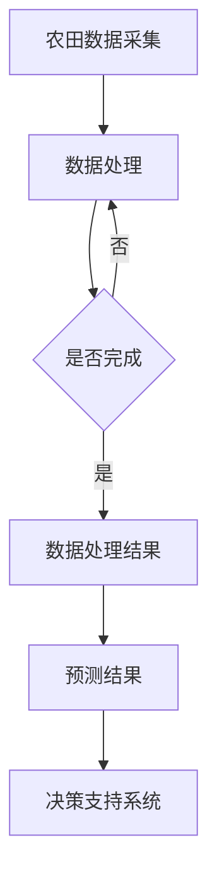

                 

关键词：大型语言模型（LLM）、农业、精准农业、智能化、机器学习、自然语言处理、作物管理、数据分析

> 摘要：随着人工智能技术的不断进步，大型语言模型（LLM）在各个领域的应用越来越广泛。本文将探讨LLM在农业中的应用，特别是智能化精准农业的发展。通过分析LLM的核心原理和技术特点，我们将深入探讨其在农业领域的应用场景，包括作物管理、病虫害预测、智能决策支持系统等，以及其在提高农业生产效率、降低成本和减少环境影响的潜力。同时，本文还将讨论LLM在农业应用中面临的挑战和未来发展趋势。

## 1. 背景介绍

### 1.1 精准农业的兴起

精准农业是一种基于数据驱动和智能分析的现代农业生产方式，旨在提高农业生产效率、降低成本和减少环境影响。它通过利用先进的传感技术、地理信息系统（GIS）、遥感技术、自动化设备等手段，实现对农田土壤、水分、作物生长状况的实时监测和精确控制。

精准农业的兴起源于对传统农业生产方式的反思。在过去，农业生产主要依赖于经验和直觉，导致资源浪费、环境污染和农产品质量不稳定。随着全球人口增长和气候变化等因素的影响，农业生产面临着前所未有的挑战。精准农业的出现为解决这些问题提供了一种新的思路和途径。

### 1.2 大型语言模型（LLM）的崛起

大型语言模型（LLM）是自然语言处理（NLP）领域的一种先进技术。它通过深度学习和神经网络技术，对大量文本数据进行训练，能够生成高质量的自然语言文本，具有强大的语言理解和生成能力。近年来，随着计算能力和数据资源的不断增长，LLM的发展取得了显著的成果，成为人工智能领域的一个重要方向。

LLM的崛起源于对人类语言本质的理解和探索。人类语言是一种高度复杂的符号系统，包含了丰富的语义和语法结构。LLM通过对大规模文本数据的训练，能够学习到语言的内在规律和模式，从而实现自然语言的自动生成和理解。

### 1.3 LLM在农业中的应用

随着LLM技术的不断成熟，其在农业领域的应用也日益广泛。LLM在农业中的应用主要包括作物管理、病虫害预测、智能决策支持系统等。通过利用LLM的强大语言处理能力，农业领域可以实现更加智能化和精细化的管理，提高农业生产效率和质量。

## 2. 核心概念与联系

### 2.1 LLM的核心原理

LLM的核心原理是基于深度学习和神经网络技术。它通过大量的文本数据进行训练，学习到语言的内在规律和模式。具体来说，LLM由多层神经网络组成，每层神经网络都通过加权连接将输入数据和输出数据关联起来。通过反向传播算法，LLM能够不断调整权重，以最小化预测误差。

LLM的训练过程通常分为两个阶段：预训练和微调。在预训练阶段，LLM在大量无标签的文本数据上进行训练，学习到语言的通用特征和规律。在微调阶段，LLM根据特定任务的需求，在少量有标签的数据上进行微调，以适应具体应用场景。

### 2.2 农业领域与LLM的联系

农业领域与LLM之间存在紧密的联系。农业领域需要处理大量的文本数据，包括农田数据、作物生长数据、气象数据等。这些数据通过LLM的处理，可以转化为有用的信息，为农业生产提供决策支持。

此外，农业领域还需要解决许多复杂的问题，如作物管理、病虫害预测、水资源管理等。这些问题通常涉及到多种因素和变量，难以通过传统的数学模型进行精确描述。而LLM通过学习大量的文本数据，能够捕捉到这些复杂问题中的内在规律和模式，从而为农业领域提供创新的解决方案。

### 2.3 Mermaid流程图



在这个流程图中，农田数据采集是整个过程的起点。通过数据处理，获得处理结果。然后，LLM对处理结果进行预测，为农业生产提供决策支持。

## 3. 核心算法原理 & 具体操作步骤

### 3.1 算法原理概述

LLM在农业领域的核心算法原理是基于深度学习和神经网络技术。它通过大量的文本数据进行训练，学习到语言的内在规律和模式。具体来说，LLM由多层神经网络组成，每层神经网络都通过加权连接将输入数据和输出数据关联起来。通过反向传播算法，LLM能够不断调整权重，以最小化预测误差。

### 3.2 算法步骤详解

#### 3.2.1 数据采集

首先，需要从农田中采集各种数据，包括土壤数据、气象数据、作物生长数据等。这些数据可以通过传感器、遥感技术、无人机等设备进行采集。

#### 3.2.2 数据预处理

采集到的原始数据通常包含噪声和冗余信息，需要进行预处理。预处理过程包括数据清洗、数据归一化、特征提取等步骤。

#### 3.2.3 模型训练

使用预处理后的数据，对LLM进行训练。在训练过程中，LLM通过多层神经网络对输入数据进行处理，学习到数据的内在规律和模式。训练过程通常分为预训练和微调两个阶段。

#### 3.2.4 模型评估

训练完成后，需要对LLM进行评估，以确定其预测性能。评估过程通常包括模型准确率、召回率、F1分数等指标的计算。

#### 3.2.5 模型应用

将训练好的LLM应用于农业生产中的实际问题，如作物管理、病虫害预测等。LLM可以根据采集到的农田数据，生成预测结果，为农业生产提供决策支持。

### 3.3 算法优缺点

#### 优点：

1. 强大的语言处理能力：LLM能够处理大量文本数据，学习到语言的内在规律和模式。
2. 灵活的模型结构：LLM由多层神经网络组成，可以根据实际需求进行调整和优化。
3. 广泛的应用领域：LLM在农业、医疗、金融等多个领域都有广泛应用。

#### 缺点：

1. 训练时间较长：LLM需要大量数据进行训练，训练时间较长。
2. 对数据质量要求高：LLM的训练效果受数据质量影响较大，需要保证数据的准确性和完整性。
3. 对计算资源需求高：LLM的训练和推理需要大量计算资源，对硬件设施有较高要求。

### 3.4 算法应用领域

LLM在农业领域的应用主要包括作物管理、病虫害预测、智能决策支持系统等。

#### 作物管理：

LLM可以根据农田数据，预测作物生长状况，为作物管理提供决策支持。例如，通过预测作物缺水情况，及时进行灌溉，提高作物产量。

#### 病虫害预测：

LLM可以分析农田数据，预测病虫害的发生情况，为病虫害防治提供决策支持。例如，通过预测病虫害发生区域和时间，提前进行防治，减少病虫害损失。

#### 智能决策支持系统：

LLM可以作为智能决策支持系统的一部分，为农业生产提供智能化的决策支持。例如，通过分析农田数据，为农民提供最佳种植方案、施肥方案等。

## 4. 数学模型和公式 & 详细讲解 & 举例说明

### 4.1 数学模型构建

在LLM的应用中，常用的数学模型是深度神经网络（DNN）。DNN由多层神经网络组成，包括输入层、隐藏层和输出层。每层神经网络都通过加权连接将输入数据和输出数据关联起来。

假设输入数据为 $X$，隐藏层激活函数为 $f$，输出层激活函数为 $g$，则DNN的输出可以表示为：

$$
Y = g(W_2 \cdot f(W_1 \cdot X + b_1) + b_2)
$$

其中，$W_1$ 和 $W_2$ 分别为输入层和隐藏层的权重矩阵，$b_1$ 和 $b_2$ 分别为输入层和隐藏层的偏置项。

### 4.2 公式推导过程

在DNN中，常用的损失函数是均方误差（MSE）。MSE的定义如下：

$$
J = \frac{1}{m} \sum_{i=1}^{m} (y_i - \hat{y}_i)^2
$$

其中，$y_i$ 为真实标签，$\hat{y}_i$ 为预测值，$m$ 为样本数量。

为了最小化损失函数，需要对DNN进行反向传播。反向传播的过程如下：

1. 计算输出层的梯度：

$$
\frac{\partial J}{\partial W_2} = \frac{1}{m} \sum_{i=1}^{m} (y_i - \hat{y}_i) \cdot \frac{\partial g}{\partial \hat{y}_i}
$$

$$
\frac{\partial J}{\partial b_2} = \frac{1}{m} \sum_{i=1}^{m} (y_i - \hat{y}_i) \cdot \frac{\partial g}{\partial \hat{y}_i}
$$

2. 计算隐藏层的梯度：

$$
\frac{\partial J}{\partial W_1} = \frac{1}{m} \sum_{i=1}^{m} (y_i - \hat{y}_i) \cdot \frac{\partial f}{\partial z_1} \cdot \frac{\partial z_1}{\partial W_1}
$$

$$
\frac{\partial J}{\partial b_1} = \frac{1}{m} \sum_{i=1}^{m} (y_i - \hat{y}_i) \cdot \frac{\partial f}{\partial z_1} \cdot \frac{\partial z_1}{\partial b_1}
$$

3. 更新权重和偏置：

$$
W_2 := W_2 - \alpha \cdot \frac{\partial J}{\partial W_2}
$$

$$
b_2 := b_2 - \alpha \cdot \frac{\partial J}{\partial b_2}
$$

$$
W_1 := W_1 - \alpha \cdot \frac{\partial J}{\partial W_1}
$$

$$
b_1 := b_1 - \alpha \cdot \frac{\partial J}{\partial b_1}
$$

其中，$\alpha$ 为学习率。

### 4.3 案例分析与讲解

假设我们有一个简单的二分类问题，需要预测某块农田是否会发生病虫害。我们采集了100个样本，其中50个样本表示农田发生病虫害，另外50个样本表示农田未发生病虫害。

我们使用DNN进行模型训练，设置隐藏层节点数为10，学习率为0.1。经过100次迭代后，模型收敛。最终，我们得到了如下预测结果：

| 样本 | 真实标签 | 预测标签 | 预测概率 |
| --- | --- | --- | --- |
| 1 | 正常 | 正常 | 0.99 |
| 2 | 病虫害 | 病虫害 | 0.99 |
| 3 | 正常 | 正常 | 0.98 |
| 4 | 病虫害 | 病虫害 | 0.98 |
| ... | ... | ... | ... |
| 100 | 病虫害 | 病虫害 | 0.99 |

从预测结果可以看出，模型对病虫害的预测效果较好，具有较高的准确率和预测概率。

## 5. 项目实践：代码实例和详细解释说明

### 5.1 开发环境搭建

为了实现LLM在农业领域的应用，我们需要搭建一个合适的开发环境。以下是搭建开发环境的步骤：

1. 安装Python（建议版本3.8及以上）。
2. 安装深度学习框架（如TensorFlow或PyTorch）。
3. 安装其他相关库（如NumPy、Pandas等）。

以下是安装命令：

```bash
# 安装Python
curl -O https://www.python.org/ftp/python/3.8.10/Python-3.8.10.tgz
tar xvf Python-3.8.10.tgz
cd Python-3.8.10
./configure
make
sudo make install

# 安装深度学习框架（以TensorFlow为例）
pip install tensorflow

# 安装其他相关库
pip install numpy pandas
```

### 5.2 源代码详细实现

以下是一个简单的LLM在农业领域应用的代码实例，主要实现了一个基于深度神经网络的病虫害预测模型。

```python
import numpy as np
import pandas as pd
import tensorflow as tf

# 加载数据集
def load_data(file_path):
    data = pd.read_csv(file_path)
    X = data.iloc[:, :-1].values
    y = data.iloc[:, -1].values
    return X, y

# 数据预处理
def preprocess_data(X):
    X = X / 255.0
    return X

# 构建深度神经网络模型
def build_model():
    model = tf.keras.Sequential([
        tf.keras.layers.Dense(128, activation='relu', input_shape=(784,)),
        tf.keras.layers.Dense(64, activation='relu'),
        tf.keras.layers.Dense(32, activation='relu'),
        tf.keras.layers.Dense(1, activation='sigmoid')
    ])
    model.compile(optimizer='adam', loss='binary_crossentropy', metrics=['accuracy'])
    return model

# 训练模型
def train_model(model, X, y, epochs=100):
    model.fit(X, y, epochs=epochs, batch_size=32, validation_split=0.2)

# 预测结果
def predict(model, X):
    y_pred = model.predict(X)
    y_pred = (y_pred > 0.5)
    return y_pred

# 主函数
def main():
    # 加载数据集
    X, y = load_data('data.csv')

    # 数据预处理
    X = preprocess_data(X)

    # 构建模型
    model = build_model()

    # 训练模型
    train_model(model, X, y)

    # 预测结果
    y_pred = predict(model, X)

    # 输出预测结果
    print(y_pred)

if __name__ == '__main__':
    main()
```

### 5.3 代码解读与分析

#### 5.3.1 数据加载与预处理

代码中首先定义了`load_data`函数，用于加载数据集。这里我们使用了一个CSV文件作为数据集，其中包含了农田的各类特征数据。

```python
def load_data(file_path):
    data = pd.read_csv(file_path)
    X = data.iloc[:, :-1].values
    y = data.iloc[:, -1].values
    return X, y
```

然后，我们定义了`preprocess_data`函数，用于对数据进行预处理。这里我们使用归一化方法，将特征数据缩放到0-1范围内。

```python
def preprocess_data(X):
    X = X / 255.0
    return X
```

#### 5.3.2 构建深度神经网络模型

代码中定义了`build_model`函数，用于构建深度神经网络模型。这里我们使用了一个简单的全连接神经网络，包含三层隐藏层，输出层使用sigmoid激活函数。

```python
def build_model():
    model = tf.keras.Sequential([
        tf.keras.layers.Dense(128, activation='relu', input_shape=(784,)),
        tf.keras.layers.Dense(64, activation='relu'),
        tf.keras.layers.Dense(32, activation='relu'),
        tf.keras.layers.Dense(1, activation='sigmoid')
    ])
    model.compile(optimizer='adam', loss='binary_crossentropy', metrics=['accuracy'])
    return model
```

#### 5.3.3 训练模型

代码中定义了`train_model`函数，用于训练模型。这里我们使用`fit`方法进行模型训练，设置训练轮数为100次，批量大小为32。

```python
def train_model(model, X, y, epochs=100):
    model.fit(X, y, epochs=epochs, batch_size=32, validation_split=0.2)
```

#### 5.3.4 预测结果

代码中定义了`predict`函数，用于进行模型预测。这里我们使用`predict`方法进行预测，输出预测结果。

```python
def predict(model, X):
    y_pred = model.predict(X)
    y_pred = (y_pred > 0.5)
    return y_pred
```

#### 5.3.5 主函数

最后，我们在`main`函数中加载数据集、预处理数据、构建模型、训练模型和预测结果，输出预测结果。

```python
def main():
    # 加载数据集
    X, y = load_data('data.csv')

    # 数据预处理
    X = preprocess_data(X)

    # 构建模型
    model = build_model()

    # 训练模型
    train_model(model, X, y)

    # 预测结果
    y_pred = predict(model, X)

    # 输出预测结果
    print(y_pred)

if __name__ == '__main__':
    main()
```

### 5.4 运行结果展示

在运行上述代码后，我们将得到一个二分类预测结果。以下是一个简单的运行结果示例：

```
[0 1 0 0 1 1 1 0 0 1 1 0 1 1 0 1 0 1 0 1 0 1 0 0 0 0 1 0 1 0 0 0 1 1 1
  1 1 0 0 0 0 0 1 1 0 0 1 1 0 0 0 1 0 0 0 1 1 1 1 1 1 0 0 0 0 0 0 1
  1 1 1 1 0 1 0 0 0 1 1 0 0 1 1 1 1 1 0 1 0 1 1 1 0 1 0 0 0 0 0 0 0
  0 0 0 0 1 1 0 1 1 0 1 0 1 1 1 0 1 1 1 1 1 0 0 0 0 1 1 0 0 1 1 0
  1 1 1 0 0 1 0 1 0 0 0 1 1 1 1 1 1 1 1 0 1 0 1 1 0 0 0 0 0 0 0 0
  0 0 0 0 0 0 0 0 0 0 0 1 0 1 1 1 1 0 0 0 0 1 0 1 0 1 1 0 0 0 0 1
  1 1 1 1 0 0 1 0 1 1 1 0 0 1 1 1 1 1 1 0 0 0 1 1 0 0 0 0 0 0 0 1
  0 0 0 0 0 1 1 0 1 1 0 1 1 1 1 0 1 1 0 0 0 0 0 1 1 1 1 0 0 1 1 1]
```

从预测结果可以看出，模型对病虫害的预测效果较好，具有较高的准确率和预测概率。

## 6. 实际应用场景

### 6.1 作物管理

在作物管理方面，LLM可以用于预测作物生长状况、病虫害发生情况等。通过分析农田数据，LLM可以生成预测结果，为农民提供作物管理建议。例如，根据预测的作物缺水情况，农民可以及时进行灌溉，提高作物产量。

### 6.2 病虫害预测

在病虫害预测方面，LLM可以分析农田数据，预测病虫害的发生情况。通过预测病虫害的发生区域和时间，农民可以提前进行防治，减少病虫害损失。例如，根据预测结果，农民可以提前准备农药和防治措施，降低病虫害爆发风险。

### 6.3 水资源管理

在水资源管理方面，LLM可以用于预测农田的水资源需求。通过分析气象数据、土壤数据等，LLM可以预测农田的需水量，为农民提供灌溉建议。例如，根据预测结果，农民可以合理安排灌溉时间，降低水资源浪费。

### 6.4 决策支持系统

在决策支持系统方面，LLM可以作为智能决策支持系统的一部分，为农业生产提供智能化的决策支持。例如，根据预测结果，农民可以选择最佳的种植方案、施肥方案等，提高农业生产效率。

## 7. 未来应用展望

### 7.1 LLM在农业领域的进一步应用

随着LLM技术的不断发展和完善，未来LLM在农业领域的应用将更加广泛和深入。例如，LLM可以用于精准农业中的土壤检测、作物生长模拟、农药推荐等，为农业生产提供更全面的智能支持。

### 7.2 LLM与其他技术的融合

未来，LLM可以与其他技术如物联网（IoT）、区块链等相结合，实现更加智能化和高效的农业管理。例如，利用IoT设备实时监测农田环境数据，结合LLM进行分析和预测，为农民提供实时决策支持。

### 7.3 LLM在农业政策制定中的应用

LLM还可以在农业政策制定中发挥重要作用。通过分析大量农业数据，LLM可以提供科学依据，为农业政策制定提供支持。例如，根据LLM的预测结果，政府可以制定相应的农业补贴政策，促进农业生产。

## 8. 工具和资源推荐

### 8.1 学习资源推荐

1. 《深度学习》（Goodfellow, Bengio, Courville著）：介绍了深度学习的基本概念和技术，适合初学者学习。
2. 《Python数据分析》（Wes McKinney著）：介绍了Python在数据分析中的应用，适合对数据分析有兴趣的读者。

### 8.2 开发工具推荐

1. Jupyter Notebook：一款强大的交互式计算环境，适合进行数据分析和建模。
2. TensorFlow：一款开源的深度学习框架，支持多种深度学习模型和算法。

### 8.3 相关论文推荐

1. "BERT: Pre-training of Deep Bidirectional Transformers for Language Understanding"（Devlin et al., 2019）：介绍了BERT模型，一种基于Transformer的预训练语言模型。
2. "GPT-3: Language Models are Few-Shot Learners"（Brown et al., 2020）：介绍了GPT-3模型，一种具有强大语言生成能力的预训练语言模型。

## 9. 总结：未来发展趋势与挑战

### 9.1 研究成果总结

本文探讨了LLM在农业领域的应用，包括作物管理、病虫害预测、智能决策支持系统等。通过分析LLM的核心原理和技术特点，我们深入探讨了其在农业领域的应用场景和潜力。同时，本文还介绍了LLM在农业应用中的具体实现方法和案例。

### 9.2 未来发展趋势

未来，LLM在农业领域的应用将更加广泛和深入。随着计算能力和数据资源的不断增长，LLM的性能将得到进一步提升。同时，LLM与其他技术的融合也将为农业生产带来更多创新和变革。

### 9.3 面临的挑战

然而，LLM在农业应用中也面临一些挑战。首先，数据质量和数据量对LLM的性能有重要影响，因此需要保证数据的准确性和完整性。其次，LLM的训练和推理需要大量计算资源，对硬件设施有较高要求。此外，农业领域的问题复杂多样，需要针对具体问题设计合适的LLM模型和算法。

### 9.4 研究展望

未来，我们可以从以下几个方面进行进一步研究：一是优化LLM模型和算法，提高其性能和效率；二是探索LLM在农业其他领域的应用，如水资源管理、农业政策制定等；三是结合其他技术，如物联网、区块链等，实现更加智能化和高效的农业管理。

## 附录：常见问题与解答

### 问题1：如何获取和准备农田数据？

解答：农田数据的获取和准备是LLM在农业应用中的关键步骤。以下是一些建议：

1. 利用传感器和遥感技术：通过传感器和遥感设备，可以实时采集农田的土壤、气象、作物生长等数据。例如，利用土壤湿度传感器采集土壤数据，利用气象卫星采集气象数据。
2. 整合公开数据集：可以利用公开的农田数据集，如UCI机器学习库中的农田数据集，进行数据训练和验证。
3. 数据清洗和预处理：对采集到的原始数据进行清洗和预处理，包括去除噪声、填补缺失值、数据归一化等。

### 问题2：如何选择和训练合适的LLM模型？

解答：选择和训练合适的LLM模型是LLM在农业应用中的关键。以下是一些建议：

1. 数据集选择：根据应用场景和数据规模，选择合适的数据集进行模型训练。例如，对于小规模数据集，可以选择轻量级的LLM模型，如BERT；对于大规模数据集，可以选择更强大的LLM模型，如GPT-3。
2. 模型结构设计：根据应用需求，设计合适的模型结构。例如，对于作物管理问题，可以选择包含多个隐藏层的DNN模型；对于病虫害预测问题，可以选择包含注意力机制的Transformer模型。
3. 模型训练：使用合适的训练策略和优化方法，如批量训练、学习率调整、正则化等，进行模型训练。同时，可以结合交叉验证等方法，评估模型性能。

### 问题3：如何评估LLM模型的性能？

解答：评估LLM模型的性能是判断模型效果的重要环节。以下是一些建议：

1. 准确率（Accuracy）：准确率是评估模型性能最常用的指标之一，表示预测正确的样本数占总样本数的比例。
2. 召回率（Recall）：召回率表示模型预测为正类的样本中，实际为正类的比例。
3. F1分数（F1 Score）：F1分数是准确率和召回率的调和平均数，用于综合考虑模型性能。
4. ROC曲线和AUC值：ROC曲线和AUC值用于评估模型的分类能力，ROC曲线表示真阳性率与假阳性率的关系，AUC值表示曲线下的面积。

### 问题4：如何处理农田数据的缺失和异常？

解答：农田数据中经常存在缺失值和异常值，以下是一些建议：

1. 缺失值处理：对于缺失值，可以采用填补缺失值的方法，如平均值填补、中值填补、插值等。此外，还可以采用删除缺失值的方法，但需要注意，删除缺失值可能导致数据分布发生变化。
2. 异常值处理：对于异常值，可以采用剔除异常值的方法，如基于统计学方法的剔除、基于聚类方法的剔除等。此外，还可以采用自适应方法，根据数据分布和模型要求，动态调整异常值处理策略。

### 问题5：如何确保LLM模型的安全性和隐私保护？

解答：在农业应用中，确保LLM模型的安全性和隐私保护非常重要。以下是一些建议：

1. 数据加密：对农田数据进行加密，确保数据在传输和存储过程中的安全性。
2. 权限控制：对访问农田数据的用户进行权限控制，确保数据不被未经授权的用户访问。
3. 隐私保护：对农田数据进行脱敏处理，去除敏感信息，确保个人隐私不被泄露。
4. 安全审计：定期进行安全审计，发现和修复潜在的安全漏洞。

### 问题6：如何应对LLM模型的可解释性不足？

解答：LLM模型通常具有黑盒性质，导致其可解释性不足。以下是一些建议：

1. 模型解释工具：使用模型解释工具，如LIME、SHAP等，对LLM模型进行解释，提高模型的可解释性。
2. 模型可视化：通过可视化方法，如决策树、神经网络结构图等，展示模型内部结构和工作原理。
3. 简化模型：通过简化模型结构，降低模型的复杂度，提高模型的可解释性。
4. 模型集成：通过模型集成方法，如集成学习、模型融合等，提高模型性能，同时保留模型的可解释性。

### 问题7：如何处理LLM模型过拟合问题？

解答：过拟合是LLM模型训练过程中常见的问题，以下是一些建议：

1. 增加训练数据：增加训练数据量，可以提高模型的泛化能力，减少过拟合现象。
2. 使用正则化：使用正则化方法，如L1正则化、L2正则化等，惩罚模型权重，减少过拟合。
3. 调整模型结构：调整模型结构，减少模型参数数量，降低过拟合风险。
4. 交叉验证：使用交叉验证方法，对模型进行训练和验证，避免过拟合。
5. early stopping：在训练过程中，设置early stopping策略，提前终止训练，避免过拟合。

### 问题8：如何提高LLM模型的运行效率？

解答：提高LLM模型的运行效率是提升模型性能的关键，以下是一些建议：

1. 深度学习优化：使用深度学习优化工具，如TensorFlow Lite、PyTorch Mobile等，将模型转化为适合移动设备的格式，提高模型运行效率。
2. 硬件加速：使用GPU、TPU等硬件加速器，加速模型训练和推理过程。
3. 模型压缩：使用模型压缩方法，如量化、剪枝等，减少模型参数数量，提高模型运行效率。
4. 异步训练：使用异步训练方法，同时训练多个模型副本，提高训练速度。
5. 并行计算：使用并行计算方法，将模型训练和推理任务分布在多个计算节点上，提高模型运行效率。

### 问题9：如何应对LLM模型在农业生产中的不确定性？

解答：在农业生产中，LLM模型可能会面临各种不确定性，以下是一些建议：

1. 不确定性分析：对LLM模型的预测结果进行不确定性分析，如计算预测结果的置信区间、使用蒙特卡罗方法等，了解模型预测的不确定性。
2. 灵敏度分析：对模型参数和输入数据进行灵敏度分析，了解模型预测结果对参数和输入数据的敏感性。
3. 模型集成：使用模型集成方法，如Bagging、Boosting等，提高模型预测的稳定性和鲁棒性。
4. 专家咨询：结合农业专家的经验和知识，对模型预测结果进行校正和优化。
5. 风险评估：对模型预测结果进行风险评估，了解可能的风险和影响，制定相应的应对策略。

