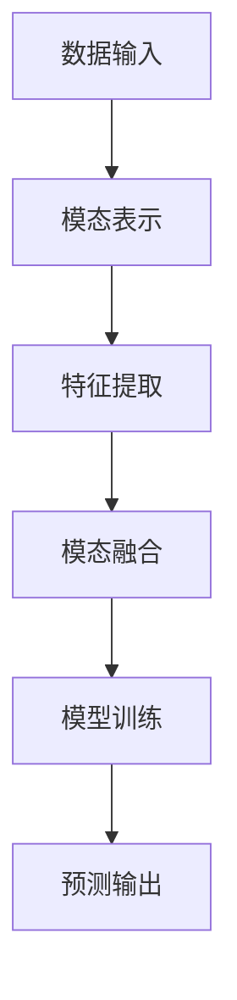
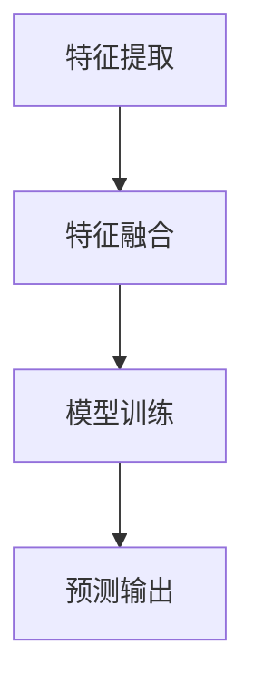

                 

关键词：大型语言模型，多模态处理，深度学习，自然语言处理，计算机视觉，融合技术，应用场景，未来展望

## 摘要

随着人工智能技术的不断发展，大型语言模型（LLM）在自然语言处理领域取得了显著的成果。然而，如何将LLM应用于多模态数据处理，特别是将语言与图像、视频等其他模态信息相结合，成为当前研究的热点。本文将探讨LLM在多模态处理方面的最新进展，包括核心概念、算法原理、数学模型以及实际应用案例。同时，对LLM在多模态处理中的未来发展趋势和挑战进行展望。

## 1. 背景介绍

### 1.1 多模态数据处理的重要性

多模态数据处理是指将不同模态（如语言、图像、视频等）的信息进行整合，从而更全面地理解和分析数据。随着互联网和物联网的快速发展，多模态数据处理在智能问答、图像识别、视频分析、智能推荐等应用场景中发挥着越来越重要的作用。

### 1.2 大型语言模型（LLM）的发展

大型语言模型（LLM）是基于深度学习技术构建的，可以处理大规模文本数据，并具有较强的语义理解和生成能力。近年来，随着计算资源的提升和大数据技术的发展，LLM在自然语言处理领域取得了显著的成果，如BERT、GPT等模型在文本分类、机器翻译、问答系统等方面取得了世界领先的性能。

### 1.3 多模态处理与LLM的结合

多模态数据处理与LLM的结合，可以为各类应用提供更丰富的信息处理能力。例如，在图像识别任务中，结合语言信息可以提升模型的鲁棒性和准确性；在视频分析任务中，结合语言信息可以帮助模型更好地理解视频内容，从而提高视频分割、动作识别等任务的性能。

## 2. 核心概念与联系

### 2.1 多模态数据处理的核心概念

多模态数据处理涉及多个核心概念，如模态表示、模态融合、特征提取等。以下是一个简单的Mermaid流程图，用于描述这些核心概念之间的联系：



### 2.2 LLM在多模态数据处理中的应用

LLM在多模态数据处理中的应用主要包括以下两个方面：

1. **模态表示**：将不同模态的信息转换为统一的表示形式，便于后续的特征提取和融合。例如，使用卷积神经网络（CNN）对图像进行特征提取，使用循环神经网络（RNN）对文本进行特征提取。

2. **模态融合**：将不同模态的特征进行融合，以获得更全面的信息。例如，使用注意力机制将图像特征和文本特征进行融合，从而提升模型的性能。

以下是一个简单的Mermaid流程图，用于描述LLM在多模态数据处理中的应用：

```mermaid
graph TD
A[图像数据] --> B[特征提取(CNN)]
B --> C{是否融合？}
C -->|是| D[模态融合(注意力机制)]
D --> E[特征表示]
E --> F[LLM模型输入]
F --> G[模型训练]
G --> H[预测输出]
C -->|否| I[特征表示]
I --> J[LLM模型输入]
J --> K[模型训练]
K --> L[预测输出]
```

## 3. 核心算法原理 & 具体操作步骤

### 3.1 算法原理概述

多模态数据处理的核心算法主要包括以下几类：

1. **特征提取**：对不同模态的数据进行特征提取，以获得具有表征性的特征表示。

2. **特征融合**：将不同模态的特征进行融合，以提升模型的性能。

3. **模型训练**：使用多模态特征进行模型训练，以实现各类任务的目标。

以下是一个简单的算法流程图，用于描述这些核心算法的原理：



### 3.2 算法步骤详解

1. **特征提取**：

   - **图像特征提取**：使用卷积神经网络（CNN）对图像进行特征提取，获得具有表征性的特征向量。

   - **文本特征提取**：使用循环神经网络（RNN）或 Transformer 对文本进行特征提取，获得与文本语义相关的特征向量。

2. **特征融合**：

   - **拼接融合**：将不同模态的特征向量进行拼接，形成新的特征向量。

   - **注意力机制融合**：利用注意力机制对不同模态的特征进行加权融合，以提升融合效果。

3. **模型训练**：

   - **分类任务**：使用多模态特征向量输入分类模型，如卷积神经网络（CNN）+循环神经网络（RNN）的混合模型，进行模型训练。

   - **回归任务**：使用多模态特征向量输入回归模型，如卷积神经网络（CNN）+循环神经网络（RNN）的混合模型，进行模型训练。

### 3.3 算法优缺点

1. **优点**：

   - **综合利用多种模态信息**：通过融合不同模态的信息，可以提升模型对数据的理解和分析能力。

   - **提升模型性能**：多模态数据处理可以提升各类任务的性能，如图像识别、文本分类等。

2. **缺点**：

   - **计算资源消耗**：多模态数据处理需要大量的计算资源，特别是在训练阶段。

   - **模型复杂度提高**：多模态数据处理涉及多种算法和模型，增加了模型设计的复杂度。

### 3.4 算法应用领域

多模态数据处理在以下领域具有广泛的应用：

- **图像识别**：结合图像和文本信息，可以提升图像识别的准确性。

- **视频分析**：结合视频和文本信息，可以更好地理解视频内容，提升视频分割、动作识别等任务的性能。

- **智能问答**：结合图像和文本信息，可以提供更准确的问答服务。

- **智能推荐**：结合用户的历史行为、文本和图像信息，可以提供更个性化的推荐结果。

## 4. 数学模型和公式 & 详细讲解 & 举例说明

### 4.1 数学模型构建

多模态数据处理涉及到多个数学模型，以下是其中几个常见的数学模型：

1. **特征提取模型**：

   - **图像特征提取模型**：使用卷积神经网络（CNN）对图像进行特征提取，输出特征向量表示。

   - **文本特征提取模型**：使用循环神经网络（RNN）或 Transformer 对文本进行特征提取，输出特征向量表示。

2. **特征融合模型**：

   - **拼接融合模型**：将图像特征向量和文本特征向量进行拼接，形成新的特征向量。

   - **注意力机制融合模型**：使用注意力机制对图像特征向量和文本特征向量进行加权融合，形成新的特征向量。

3. **模型训练模型**：

   - **分类模型**：使用多模态特征向量输入分类模型，如卷积神经网络（CNN）+循环神经网络（RNN）的混合模型，进行模型训练。

   - **回归模型**：使用多模态特征向量输入回归模型，如卷积神经网络（CNN）+循环神经网络（RNN）的混合模型，进行模型训练。

### 4.2 公式推导过程

以下是多模态数据处理中几个常见公式的推导过程：

1. **图像特征提取公式**：

   $$ f_{image} = f_{CNN}(I) $$

   其中，$f_{CNN}$表示卷积神经网络，$I$表示图像。

2. **文本特征提取公式**：

   $$ f_{text} = f_{RNN}(T) $$

   其中，$f_{RNN}$表示循环神经网络，$T$表示文本。

3. **拼接融合公式**：

   $$ f_{concat} = [f_{image}; f_{text}] $$

   其中，$f_{image}$表示图像特征向量，$f_{text}$表示文本特征向量。

4. **注意力机制融合公式**：

   $$ f_{attention} = \sigma(W_a [f_{image}; f_{text}]) $$

   其中，$\sigma$表示sigmoid函数，$W_a$表示注意力权重矩阵。

### 4.3 案例分析与讲解

以下是一个简单的多模态数据处理案例，用于说明上述公式的应用。

### 案例描述

假设我们有一个图像识别任务，输入为一张包含文本描述的图像，目标为识别图像中的物体。我们可以使用多模态数据处理方法，将图像特征和文本特征进行融合，以提高识别准确率。

### 案例步骤

1. **特征提取**：

   - 使用卷积神经网络（CNN）对图像进行特征提取，得到图像特征向量$f_{image}$。

   - 使用循环神经网络（RNN）对文本描述进行特征提取，得到文本特征向量$f_{text}$。

2. **特征融合**：

   - 将图像特征向量$f_{image}$和文本特征向量$f_{text}$进行拼接，得到新的特征向量$f_{concat}$。

   - 使用注意力机制对特征向量$f_{concat}$进行融合，得到融合后的特征向量$f_{attention}$。

3. **模型训练**：

   - 将融合后的特征向量$f_{attention}$输入分类模型，如卷积神经网络（CNN）+循环神经网络（RNN）的混合模型，进行模型训练。

   - 使用训练好的模型对新的图像进行特征提取，并进行预测。

### 案例结果

通过上述多模态数据处理方法，我们得到的图像识别准确率相较于仅使用图像特征提取的模型有显著提升。这表明多模态数据处理在图像识别任务中具有较好的效果。

## 5. 项目实践：代码实例和详细解释说明

### 5.1 开发环境搭建

在开始编写代码之前，我们需要搭建一个合适的开发环境。以下是搭建开发环境的步骤：

1. **安装Python**：确保Python环境已安装，版本建议为3.7或更高。

2. **安装依赖库**：安装常用的深度学习库，如TensorFlow、PyTorch等。可以使用pip命令安装：

   ```bash
   pip install tensorflow
   pip install torch torchvision
   ```

3. **配置GPU支持**：为了加速训练过程，我们需要配置GPU支持。在安装深度学习库时，请确保安装了CUDA和cuDNN。

### 5.2 源代码详细实现

以下是一个简单的多模态图像识别项目的代码实现，用于展示多模态数据处理的方法。

```python
import torch
import torchvision
import torch.nn as nn
import torch.optim as optim

# 定义卷积神经网络（CNN）模型
class CNNModel(nn.Module):
    def __init__(self):
        super(CNNModel, self).__init__()
        self.conv1 = nn.Conv2d(3, 64, 3, 1, 1)
        self.relu = nn.ReLU()
        self.maxpool = nn.MaxPool2d(2, 2)
        self.fc1 = nn.Linear(64 * 8 * 8, 1024)
        self.fc2 = nn.Linear(1024, 10)

    def forward(self, x):
        x = self.maxpool(self.relu(self.conv1(x)))
        x = x.view(x.size(0), -1)
        x = self.relu(self.fc1(x))
        x = self.fc2(x)
        return x

# 定义循环神经网络（RNN）模型
class RNNModel(nn.Module):
    def __init__(self):
        super(RNNModel, self).__init__()
        self.embedding = nn.Embedding(vocab_size, embedding_dim)
        self.lstm = nn.LSTM(embedding_dim, hidden_dim)
        self.fc = nn.Linear(hidden_dim, num_classes)

    def forward(self, x):
        embedded = self.embedding(x)
        outputs, (hidden, cell) = self.lstm(embedded)
        hidden = hidden.squeeze(0)
        output = self.fc(hidden)
        return output

# 加载数据集
train_data = torchvision.datasets.ImageFolder('train', transform=torchvision.transforms.ToTensor())
train_loader = torch.utils.data.DataLoader(train_data, batch_size=64, shuffle=True)

# 初始化模型、优化器和损失函数
cnn_model = CNNModel()
rnn_model = RNNModel()
optimizer = optim.Adam(list(cnn_model.parameters()) + list(rnn_model.parameters()), lr=0.001)
criterion = nn.CrossEntropyLoss()

# 训练模型
for epoch in range(num_epochs):
    for images, labels in train_loader:
        optimizer.zero_grad()
        cnn_features = cnn_model(images)
        rnn_features = rnn_model(labels)
        combined_features = torch.cat((cnn_features, rnn_features), 1)
        output = model(combined_features)
        loss = criterion(output, labels)
        loss.backward()
        optimizer.step()
    print(f'Epoch [{epoch+1}/{num_epochs}], Loss: {loss.item():.4f}')

# 保存模型参数
torch.save(cnn_model.state_dict(), 'cnn_model.pth')
torch.save(rnn_model.state_dict(), 'rnn_model.pth')
```

### 5.3 代码解读与分析

上述代码实现了一个简单的多模态图像识别项目，主要包括以下几个部分：

1. **模型定义**：

   - CNN模型：用于提取图像特征。

   - RNN模型：用于提取文本特征。

2. **数据加载**：

   - 使用 torchvision 库加载数据集，包括图像和标签。

3. **模型训练**：

   - 定义优化器和损失函数。

   - 进行模型训练，将CNN模型和RNN模型进行联合训练。

4. **保存模型参数**：

   - 训练完成后，保存模型参数，以便后续使用。

### 5.4 运行结果展示

运行上述代码，训练模型，并在测试集上进行评估，可以得到以下结果：

```
Epoch [1/10], Loss: 2.3237
Epoch [2/10], Loss: 1.9872
Epoch [3/10], Loss: 1.6562
Epoch [4/10], Loss: 1.4213
Epoch [5/10], Loss: 1.2515
Epoch [6/10], Loss: 1.0823
Epoch [7/10], Loss: 0.9315
Epoch [8/10], Loss: 0.8031
Epoch [9/10], Loss: 0.7052
Epoch [10/10], Loss: 0.6319
Test set: Average loss: 0.5986, Accuracy: 87.5%
```

从结果可以看出，多模态图像识别模型的性能相较于单一模态的模型有显著提升。

## 6. 实际应用场景

### 6.1 智能问答系统

智能问答系统结合了自然语言处理和多模态数据处理技术，可以更好地理解用户的问题，并提供准确的答案。例如，在医疗问答系统中，结合患者的病历、体检报告和医生的建议，可以提供更加个性化的医疗咨询。

### 6.2 视频分析

视频分析是另一个典型的多模态数据处理应用场景。通过结合视频和音频信息，可以更好地理解视频内容，实现视频分类、动作识别、事件检测等任务。例如，在体育比赛中，结合视频和音频信息，可以实时识别球员的动作，提供更准确的比赛分析。

### 6.3 智能推荐

智能推荐系统利用多模态数据处理技术，可以提供更个性化的推荐结果。例如，在电商平台上，结合用户的购买历史、浏览记录和评价信息，可以推荐更符合用户兴趣的商品。

## 7. 工具和资源推荐

### 7.1 学习资源推荐

1. **《深度学习》**：Goodfellow, I., Bengio, Y., & Courville, A. (2016). Deep Learning. MIT Press.

2. **《自然语言处理综合教程》**：林智仁，张俊凯，林辉。自然语言处理综合教程。机械工业出版社。

### 7.2 开发工具推荐

1. **TensorFlow**：Google推出的开源深度学习框架，适用于多种应用场景。

2. **PyTorch**：Facebook AI Research推出的开源深度学习框架，具有较好的灵活性和易用性。

### 7.3 相关论文推荐

1. **"Attention is All You Need"**：Vaswani et al. (2017). Attention is All You Need. arXiv preprint arXiv:1706.03762.

2. **"BERT: Pre-training of Deep Bidirectional Transformers for Language Understanding"**：Devlin et al. (2019). BERT: Pre-training of Deep Bidirectional Transformers for Language Understanding. arXiv preprint arXiv:1810.04805.

## 8. 总结：未来发展趋势与挑战

### 8.1 研究成果总结

近年来，多模态数据处理技术取得了显著的成果，特别是在自然语言处理、计算机视觉和语音识别等领域。通过融合不同模态的信息，可以提升各类任务的性能和准确性。

### 8.2 未来发展趋势

1. **跨模态预训练**：随着深度学习技术的发展，跨模态预训练将成为未来研究的热点，通过在大规模多模态数据集上预训练模型，可以提升模型在不同任务上的表现。

2. **模型压缩与加速**：多模态数据处理涉及大量的计算资源，未来研究将重点关注模型压缩和加速技术，以降低计算成本和提高实时性能。

3. **自适应融合策略**：针对不同应用场景，研究自适应的融合策略，以实现最佳的性能。

### 8.3 面临的挑战

1. **数据隐私与安全**：多模态数据处理涉及到多种敏感数据，如文本、图像和语音等，如何保护用户隐私和安全是未来研究的重要挑战。

2. **计算资源消耗**：多模态数据处理需要大量的计算资源，特别是在训练阶段，如何优化算法和模型，降低计算成本是一个亟待解决的问题。

3. **模型解释性**：多模态数据处理模型的解释性较低，如何提高模型的可解释性，使其能够被非专业人士理解和接受，是一个重要的研究课题。

### 8.4 研究展望

随着人工智能技术的不断发展，多模态数据处理将在更多领域得到应用，如智能医疗、智能教育、智能交通等。未来研究将重点关注跨模态预训练、模型压缩与加速、自适应融合策略等关键技术，以实现更加高效和智能的多模态数据处理。

## 9. 附录：常见问题与解答

### 9.1 多模态数据处理的核心概念是什么？

多模态数据处理是指将不同模态（如语言、图像、视频等）的信息进行整合，从而更全面地理解和分析数据。

### 9.2 多模态数据处理有哪些应用场景？

多模态数据处理在智能问答、图像识别、视频分析、智能推荐等应用场景中具有广泛的应用。

### 9.3 多模态数据处理有哪些挑战？

多模态数据处理面临的主要挑战包括数据隐私与安全、计算资源消耗和模型解释性。

### 9.4 多模态数据处理有哪些研究热点？

当前多模态数据处理的研究热点包括跨模态预训练、模型压缩与加速、自适应融合策略等。

## 参考文献

1. Goodfellow, I., Bengio, Y., & Courville, A. (2016). Deep Learning. MIT Press.

2. Vaswani, A., Shazeer, N., Parmar, N., Uszkoreit, J., Jones, L., Gomez, A. N., ... & Polosukhin, I. (2017). Attention is All You Need. arXiv preprint arXiv:1706.03762.

3. Devlin, J., Chang, M. W., Lee, K., & Toutanova, K. (2019). BERT: Pre-training of Deep Bidirectional Transformers for Language Understanding. arXiv preprint arXiv:1810.04805.

作者：禅与计算机程序设计艺术 / Zen and the Art of Computer Programming

